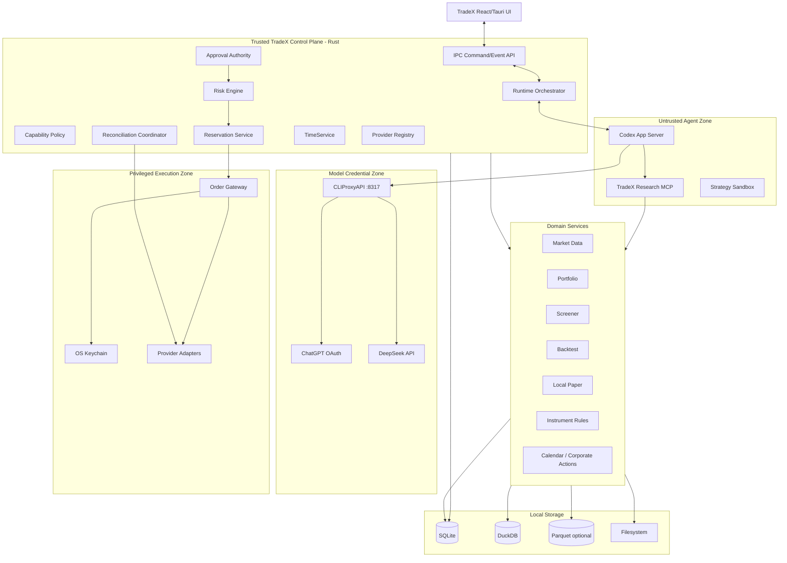

# TradeX Backend Architecture Requirements & Design (ARD)

**Contract clarification date:** 2026-09-05; prototype behavior is evidence only, subject to the QA Report defects and pending gates.

**Version:** v1.0 Revision C (RevC)  
**Status:** Engineering baseline  
**Scope:** Local backend / control plane / agent runtime integration / domain services / execution boundary  
**Primary implementation:** Rust control plane with local sidecars/processes where justified  
**Source baseline:** `TradeX_PRD_v1.0_RevC.md`, `TradeX_UI_Prototype_Spec_v1.0_RevC.md`; prototype observations are recorded separately in the QA Report\
**Language:** English

> This ARD translates the RevC product requirements into an implementable backend architecture. Safety semantics, product state, provider scope, and storage responsibilities come from the RevC PRD. Concrete process boundaries, service decomposition, persistence patterns, command/event contracts, concurrency controls, and adapter patterns below are architectural decisions for implementation.

---

## 1. Purpose

The TradeX backend is the trusted local control plane behind the desktop workspace. It integrates Codex App Server for agent execution, CLIProxyAPI for model routing, local domain services for research/backtesting, and isolated broker/exchange adapters for account access and execution.

Its core responsibility is to ensure that an agent can research and propose financial actions without becoming the authority that can execute them.

The backend must:

- supervise local runtime dependencies;
- persist Thread / Turn / Item provenance;
- expose typed domain tools to the agent;
- normalize instruments, accounts, orders, market data, and provider capabilities;
- manage account-scoped live arming;
- evaluate deterministic risk;
- issue and validate TradeX financial approvals;
- reserve account capacity atomically;
- isolate the privileged Order Gateway and credentials;
- reconcile broker state and recover safely from ambiguity, restart, sleep, disconnect, and rate limits;
- maintain local auditability and data provenance.

---

## 2. Architectural Drivers

### 2.1 Safety drivers

1. The model cannot access raw broker secrets.
2. Codex/agent runtime cannot directly call the privileged Order Gateway.
3. Generic Codex approvals cannot authorize financial execution.
4. Live approvals are proposal/account/action-bound, short-lived, and single-use.
5. Broker/exchange state is authoritative for live orders, positions, and fills.
6. No blind retry after ambiguous non-idempotent order submission.
7. Live account arming is account-scoped and resets on safety triggers.
8. Reservations are atomic per account across concurrent threads.
9. Stale market data or unacceptable clock uncertainty fails closed for live authority decisions.
10. Dangerous credential permissions block live readiness.

### 2.2 Runtime drivers

- Codex App Server is pinned and compatibility-tested.
- CLIProxyAPI is pinned, locally supervised, and is the only LLM egress path.
- Control-plane trading/reconciliation operations continue even if model inference is unavailable.
- Local persistence is the default; external telemetry is opt-in.

### 2.3 Data drivers

- SQLite owns transactional/domain state and financial audit.
- DuckDB owns persistent analytical/historical data for the MVP.
- Parquet is optional for large immutable datasets/interchange.
- Filesystem stores artifacts, strategies, exports, backups, and datasets.
- Secrets are excluded from all ordinary workspace stores.

---

## 3. Backend System Context



---

## 4. Trust Zones and Process Boundaries

TradeX implements four security-relevant zones.

### 4.1 Untrusted Agent Zone

Contains:

- Codex App Server;
- TradeX research MCP/tool process;
- strategy sandbox;
- workspace research files.

This zone may read approved context and create proposals/signals, but receives no broker credentials or direct execution capability.

### 4.2 Trusted Control Plane

Contains financial authority logic:

- capability policy;
- account arming state;
- risk engine;
- approval authority;
- reservations;
- reconciliation coordination;
- provider capability/health state;
- TimeService;
- persistence transactions.

### 4.3 Privileged Execution Zone

Contains:

- OS keychain access;
- provider request signing/authentication;
- ExecutionAdapter implementations;
- Order Gateway.

Only a validated, approved, reserved execution intent may cross into this zone.

### 4.4 Model Credential Zone

Contains CLIProxyAPI and model credentials only:

- ChatGPT OAuth tokens in sidecar auth directory;
- DeepSeek API key rendered into sidecar configuration by Rust at launch.

Broker credentials must never enter this zone.

---

## 5. Local Process Topology

Recommended v1.0 topology:

```text
tradex-desktop (Tauri/Rust main process)
 ├─ React webview
 ├─ embedded/control-plane Rust services
 ├─ child: order-gateway [privileged execution; private IPC only]
 ├─ child: codex-app-server [pinned]
 ├─ child: cliproxyapi [pinned, localhost:8317]
 ├─ child: research-mcp (Rust or Python, restricted contract)
 └─ child: strategy/backtest worker(s) [restricted]
```

### 5.1 Process supervision

The Rust main process owns child lifecycle:

- deterministic startup order;
- version verification;
- health checks;
- restart with capped exponential backoff;
- stdout/stderr redaction;
- shutdown coordination;
- crash event persistence.

### 5.2 Startup order

Recommended sequence:

```text
open/migrate SQLite
→ load settings + provider metadata
→ initialize TimeService
→ initialize domain services + durable event/authority store
→ start/authenticate Order Gateway (new mutations disabled)
→ restore account metadata
→ reconcile all live/open-order accounts
→ expose live execution readiness only for healthy accounts
→ require explicit per-account arming before new Live mutations
```

After domain initialization, start CLIProxyAPI → probe `/v1/models` → start Codex App Server as an independent, bounded-backoff branch. Model startup failures must not block order queries, reconciliation, account disarming, or the execution control plane. Agent turns become available only when their selected model route is healthy; the workspace may display history and recovery controls earlier.

### 5.3 Order Gateway process boundary

The separate child process is mandatory (PRD OD-009); a module inside the desktop process does not satisfy this boundary. “Privileged” means exclusive trading/credential capabilities, not root/administrator execution. The parent pins/verifies its binary and supervises health, bounded restart, redacted logs, and shutdown.

Use a dedicated inherited duplex IPC channel, framed with message lengths and a startup protocol-version handshake. The parent retains the only peer handle; never expose a listening TCP endpoint or pass this handle to the webview, Codex, CLIProxyAPI, research, or strategy workers. Authenticate each new child session with a random session credential sent through the inherited channel, never command-line arguments, logs, or ordinary workspace files. Reject an incompatible protocol before accepting requests.

The Gateway retrieves authoritative immutable objects through the authenticated control-plane channel; it does not become a second SQLite writer. Only its provider signing layer resolves execution credential references. Neither model credentials nor arbitrary frontend/agent order fields enter a Gateway request. Gateway failure disarms affected Live accounts, stops undispatched work, and reconciles every attempt that might have reached a provider before allowing explicit re-arming. Restarting the child never replays an order mutation automatically.

Agent workspace may become partially usable before broker reconciliation completes, but live execution remains blocked until the affected account is healthy.

---

## 6. Backend Module Decomposition

Recommended Rust workspace:

```text
crates/
  tradex-app/                 # Tauri application/bootstrap
  tradex-api/                 # IPC command/event schemas
  tradex-domain/              # canonical domain types
  tradex-runtime/             # Codex + CLIProxy supervision
  tradex-thread/              # Thread/Turn/Item persistence/orchestration
  tradex-capability/          # Agent Mode / Execution Context policy
  tradex-market/              # market data normalization
  tradex-instruments/         # canonical instruments/rules/calendar
  tradex-portfolio/           # balances/positions/valuation
  tradex-risk/                # deterministic risk engine
  tradex-approval/            # financial approval authority
  tradex-reservation/         # atomic execution reservations
  tradex-execution/           # Order Gateway
  tradex-reconciliation/      # broker-state convergence
  tradex-provider-core/       # provider schemas/capabilities/errors
  tradex-provider-alpaca/
  tradex-provider-t212/
  tradex-provider-binance/
  tradex-provider-bitget/
  tradex-storage/             # SQLite/DuckDB/filesystem
  tradex-observability/
  tradex-security/            # redaction, keychain abstractions
```

Python workers may be used for quant/scientific workloads, but financial authority remains in Rust.

---

## 7. Canonical Domain Model

### 7.1 Identity rules

Domain logic uses stable canonical IDs:

```text
workspace_id
thread_id
turn_id
account_id
instrument_id
proposal_id
approval_id
reservation_id
execution_attempt_id
provider_order_id
market_snapshot_id
policy_version
```

Provider-specific symbols/IDs remain adapter mappings.

### 7.2 Instrument examples

```yaml
instrument_id: equity:US:AAPL
asset_class: EQUITY
exchange: XNAS
currency: USD
providers:
  alpaca: AAPL
  trading212: provider_specific_id
```

```yaml
instrument_id: crypto:BTC/USDT:spot
asset_class: CRYPTO_SPOT
base: BTC
quote: USDT
providers:
  binance: BTCUSDT
  bitget: BTCUSDT
```

### 7.3 Decimal arithmetic

Price, quantity, notional, fees, FX conversion, and risk calculations use decimal-safe types. Binary floating point is prohibited in financial authority logic.

### 7.4 Quantity semantics

```rust
enum OrderQuantity {
    Base(Decimal),
    Quote(Decimal),
    Notional(Decimal),
}
```

Adapters convert explicitly according to provider capabilities and instrument rules.

---

## 8. Thread / Turn / Item Runtime Architecture

### 8.1 Persistent Thread

Stores navigation/default context only:

```text
workspace_id
codex_thread_id
title
created_at
updated_at
default_agent_mode
linked_accounts[]
linked_instruments[]
linked_strategies[]
linked_artifacts[]
```

### 8.2 Immutable Turn snapshot

At turn start, persist:

```text
turn_id
agent_mode_at_start
selected_account_id?
execution_context_at_start
capability_level_at_start
model_id
model_provider
attached_context_ids[]
attached_context_hashes[]
started_at
```

This snapshot is immutable after the turn starts. Provider attempts and completion time belong to append-only Turn lifecycle events outside the start snapshot; the displayed historical model/context must not be read from current workspace defaults.

### 8.3 Runtime adapter

`tradex-runtime` maps Codex protocol events into TradeX domain items so product logic does not depend directly on unstable protocol details.

```text
Codex JSON-RPC/JSONL
→ RuntimeProtocolAdapter
→ TradeX TurnEvent / ItemEvent
→ persistence
→ UI domain event
```

### 8.4 Generic approval isolation

Codex approval events may pause/resume a turn, but are stored distinctly from `FinancialApproval`. No code path may coerce one into the other.

---

## 9. Agent Mode, Execution Context, and Capability Policy

### 9.1 Agent Mode

```text
ASK
RESEARCH
BACKTEST
TRADE
```

### 9.2 Execution Context

```text
NONE_READ_ONLY
HISTORICAL_SIMULATION
LOCAL_PAPER
ALPACA_PAPER
TRADING212_DEMO
TRADING212_LIVE
BINANCE_TESTNET
BINANCE_LIVE
BITGET_DEMO
BITGET_LIVE
```

### 9.3 Capability policy service

The policy service returns permitted tool capabilities for a specific turn snapshot.

```rust
struct CapabilityDecision {
    level: CapabilityLevel,
    allowed_tools: Vec<ToolId>,
    execution_allowed: bool,
    reason: Option<String>,
}
```

Rules:

- Ask/Research never receive current-market execution tools;
- Backtest receives historical simulation only;
- Trade + Paper/Demo/Testnet may receive C3 execution tools;
- Trade + Live may reach proposal capability C4;
- C5 is not a standing tool grant; it exists only when a valid transaction-specific approval is consumed inside the control plane;
- C6 is unsupported.

---

## 10. LLM Runtime Architecture

### 10.1 Single egress

All model inference goes through:

```text
127.0.0.1:8317 → CLIProxyAPI
```

Direct external LLM calls from TradeX, Codex, research tools, or strategy code are prohibited.

### 10.2 CLIProxyAPI supervision

Backend responsibilities:

- verify pinned binary/version;
- allocate/verify port 8317;
- launch sidecar;
- inject only model credentials/config;
- probe `/v1/models`;
- classify stopped/port-conflict/unauthorized states;
- restart with backoff where appropriate;
- clear rendered DeepSeek configuration on exit.

### 10.3 Provider routing

V1.0 providers:

- ChatGPT subscription OAuth → GPT-5.6 series;
- DeepSeek official API → `deepseek-chat` / `deepseek-reasoner`.

Cross-provider automatic fallback is OFF by default.

### 10.4 Provider attempt audit

Every attempt persists:

```text
turn_id
attempt_no
model_id
provider
started_at
ended_at
result
error_category?
quota_metadata?
```

If opt-in automatic fallback occurs, both attempts remain visible and auditable. Provider switch never changes financial capability state.

### 10.5 Model failure independence

`MODEL_UNAVAILABLE`, `OAUTH_EXPIRED`, or `QUOTA_EXCEEDED` may block new agent turns, but must not stop:

- live order monitoring;
- cancellation already in trusted control-plane flow;
- reconciliation;
- account health processing;
- audit persistence.

---

## 11. Provider Registry and Schema-driven Connection Model

### 11.1 Provider definition

Each integration exposes metadata:

```rust
struct ProviderDefinition {
    provider_id: ProviderId,
    display_name: String,
    environments: Vec<Environment>,
    credential_schema: CredentialSchema,
    capability_schema: CapabilitySchema,
    permission_rules: PermissionRules,
}
```

### 11.2 Credential schema

Schema describes:

- fields;
- sensitivity;
- required/optional status;
- environment applicability;
- help text;
- validation behavior.

The backend never assumes every broker has the same `API Key + Secret` model.

### 11.3 Secure connection sequence

```text
UI submits secret fields through privileged Tauri command
→ Rust validates shape
→ write secret to OS keychain
→ persist only credential reference metadata
→ adapter probes provider
→ discover permissions/capabilities
→ apply dangerous-permission safety gate
→ persist non-secret health/capability metadata
→ return sanitized account connection result
```

### 11.4 Permission gate

Live readiness is blocked if detected permissions include:

- withdrawal;
- transfer;
- custody authority;
- unsupported margin/leverage-management authority.

If permission introspection is unavailable, mark `UNVERIFIED`, require user acknowledgement, and keep it visible in account health.

---

## 12. Broker Adapter Architecture

Use small, capability-specific interfaces rather than one oversized abstraction.

```rust
trait AccountAdapter { /* balances, positions, orders */ }
trait ExecutionAdapter { /* place/cancel/query execution */ }
trait MarketDataAdapter { /* quotes/bars/book + instrument metadata */ }
trait AccountStreamAdapter { /* private account/order stream */ }
```

### 12.1 Capability discovery

```rust
struct BrokerCapabilities {
    account_read: bool,
    position_read: bool,
    public_market_data: bool,
    private_account_stream: bool,
    order_types: Vec<OrderType>,
    fractional_quantity: bool,
    notional_orders: bool,
    extended_hours: bool,
    client_order_id: bool,
    paper_environment: bool,
    live_environment: bool,
}
```

Additional capability metadata should include TIF, min notional, post-only/venue constraints, cancellation behavior, and provider-specific limits where supported.

### 12.2 Provider-specific adapters

V1.0 target integrations:

- Alpaca Paper;
- Trading 212 Demo / Live;
- Binance Testnet / Spot Live;
- Bitget Demo / Spot Live.

Adapters map canonical orders into provider requests and provider states back into normalized TradeX states.

### 12.3 Adapter error normalization

Provider errors map into the canonical taxonomy and preserve raw provider code/message in redacted diagnostic metadata.

---

## 13. Market Data Architecture

### 13.1 Separation from execution

Market data and broker execution are separate service contracts. A broker adapter may provide market data, but domain code must not assume it is complete or execution-grade.

### 13.2 Subscription/access tiers

```text
Census — broad coarse universe/on-demand
Warm   — watchlists/candidates periodic refresh
Hot    — currently viewed/monitored active stream
Cold   — persisted historical/backtest data
```

MVP uses Hot active subscriptions plus on-demand/coarse watchlist/universe refresh. It does not maintain always-on tick subscriptions for the full universe.

### 13.3 Market snapshot

```rust
struct MarketSnapshot {
    id: MarketSnapshotId,
    instrument_id: InstrumentId,
    source: String,
    venue: Option<String>,
    provider_timestamp: DateTime<Utc>,
    received_timestamp: DateTime<Utc>,
    entitlement: Entitlement,
    freshness: FreshnessState,
    payload: MarketPayload,
}
```

Every live authority decision references a persisted snapshot ID.

### 13.4 Entitlement metadata

Each provider integration declares:

- realtime/delayed status;
- local retention limits;
- redistribution restrictions;
- commercial constraints;
- jurisdictions where relevant.

---

## 14. TimeService

TimeService provides consistent semantics for:

- quote age;
- approval TTL;
- reconciliation deadlines;
- event ordering;
- provider timestamp offset.

### 14.1 Data model

Track both wall-clock and monotonic time. Detect:

- significant wall-clock jump;
- system resume discontinuity;
- provider/server offset outside tolerance;
- uncertain quote age.

### 14.2 Fail-closed rule

When TimeService marks timing confidence below the configured live threshold:

- no new live approval is valid;
- pre-execution freshness/TTL checks fail;
- account/execution surfaces receive a clock/freshness blocking state;
- monitoring/reconciliation continues.

---

## 15. Instrument Rules, Calendar, and Corporate Actions

### 15.1 InstrumentRulesService

Maintains venue/provider-specific constraints:

- tick size;
- price/quantity precision;
- minimum/maximum quantity;
- minimum/maximum notional;
- allowed order types;
- market-order constraints;
- trading status.

Validation sequence:

```text
normalized order
→ InstrumentRulesService
→ deterministic risk
→ approval
→ pre-execution revalidation
→ provider adapter
```

### 15.2 MarketCalendarService

For equities:

- holidays;
- half days;
- sessions;
- extended-hours state;
- open/close timestamps;
- halts.

### 15.3 CorporateActionsService

Tracks:

- splits;
- dividends;
- symbol changes;
- delistings;
- historical adjustment metadata.

`MARKET_CLOSED` and `INSTRUMENT_HALTED` are deterministic blocking states where execution is unsupported.

---

## 16. Portfolio and Valuation Architecture

### 16.1 Broker truth

Balances, positions, open orders, and fills originate from provider state and are normalized into local projections.

### 16.2 Workspace base currency

Portfolio aggregation uses a configured base currency.

### 16.3 FX/stablecoin conversion

Conversion records:

```text
source
pair/path
provider timestamp
TradeX received timestamp
freshness
quality/depeg state
```

Never assume `USDT = USD` or stablecoin parity.

If conversion quality is unreliable and live risk depends on the normalized value, execution must fail closed.

---

## 17. Deterministic Risk Engine

The Risk Engine is independent of the model.

### 17.1 Inputs

Risk evaluation consumes immutable snapshots/references:

- account state;
- normalized order proposal;
- instrument rules;
- current market snapshot;
- policy version;
- portfolio/exposure state;
- open orders;
- active reservations;
- daily execution counters;
- market/calendar status;
- valuation provenance where required.

### 17.2 User-configurable policy

Supports controls such as:

- maximum order notional/quantity;
- position/concentration limits;
- asset-class exposure;
- daily traded notional/loss;
- max open orders;
- max reserved capital;
- allowed/blocked instruments/venues/accounts;
- market-order enablement and slippage limits;
- price deviation;
- stale-price threshold;
- environment constraints.

The agent cannot modify policy.

### 17.3 Hard safety rules

System-enforced and not user-bypassable:

- approval binding;
- duplicate-order protection;
- decimal/precision validation;
- instrument-rule validation;
- authoritative reconciliation;
- unhealthy-account block;
- stale snapshot block;
- reservation correctness;
- no blind retry after ambiguity;
- Order Gateway isolation.

### 17.4 Risk result

```rust
struct RiskDecision {
    proposal_id: ProposalId,
    policy_version: PolicyVersion,
    allowed: bool,
    checks: Vec<RiskCheckResult>,
    evaluated_at: DateTime<Utc>,
}
```

Persist every live risk decision.

---

## 18. Risk Policy Versioning and Serialization

Risk policy is versioned per affected scope/account.

Save flow:

```text
begin per-account single-writer transaction
→ persist new policy version
→ invalidate affected pending approvals
→ re-evaluate pending proposals
→ if policy weakened: DISARM affected live account
→ append audit events
→ commit
```

Approval consumption for the same account participates in the same serialization boundary so policy-save vs approval-consume races cannot bypass revalidation.

---

## 19. Order Draft and Immutable Proposal Service

### 19.1 Draft

`OrderDraft` may change freely and carries no authority.

### 19.2 Proposal generation

```text
OrderDraft
→ normalize canonical order
→ validate instrument/provider capability
→ capture market_snapshot_id where needed
→ bind policy_version
→ generate proposal_id
→ canonical serialize
→ SHA-256 proposal_hash
→ persist immutable OrderProposal
```

### 19.3 Material edit

Any material edit creates a new proposal ID/hash. Old approvals become unusable but remain in audit history.

### 19.4 Canonical serialization

Hashing must use a deterministic serialization format with explicit decimal/string normalization, field ordering, instrument/account identity, environment, TIF, and quantity semantics.

---

## 20. Financial Approval Authority

A `FinancialApproval` is separate from Codex approval.

### 20.1 Approval payload

```rust
struct FinancialApproval {
    approval_id: ApprovalId,
    intent: ApprovedFinancialIntent,
    account_id: AccountId,
    operation: FinancialOperation,
    policy_version: PolicyVersion,
    issued_at: DateTime<Utc>,
    expires_at: DateTime<Utc>,
    nonce: String,
    consumed_at: Option<DateTime<Utc>>,
}
```

ApprovedFinancialIntent is a tagged union: PLACE_ORDER binds proposal_id/proposal_hash; CANCEL binds cancellation_intent_id/intent_hash. The operation must match the tag, account, and immutable intent. A cancellation approval cannot authorize an order creation.

### 20.2 Properties

- proposal-bound;
- account-bound;
- operation-bound;
- short-lived;
- single-use;
- invalidated on material order change;
- invalidated on relevant policy change;
- invalid when market snapshot/clock conditions no longer satisfy execution checks.

### 20.3 Approval consumption

Consumption is transactional with pre-execution validation and reservation creation. A consumed approval cannot be reused.

---

## 21. Account-scoped Live Arming

Persist live arming as account-specific control-plane state.

```text
account A: DISARMED/ARMED
account B: DISARMED/ARMED
account C: DISARMED/ARMED
```

### 21.1 Arm requirements

Before accepting `ARM`:

- account connection healthy;
- reconciliation complete;
- credential/permission state acceptable;
- provider capability supports Live;
- no blocking recovery state;
- user action explicitly targets that account.

### 21.2 Automatic disarm triggers

Disarm affected account on:

- application restart;
- OS sleep/session lock;
- credential change;
- account health degradation;
- reconciliation failure;
- failed relevant pre-execution state;
- risk-policy weakening;
- configured inactivity timeout.

### 21.3 Global Disable All

One control-plane operation atomically sets all live account arming states to DISARMED and appends audit events.

Application restart, OS sleep/session lock, and Disable All affect every Live account. Credential/health failures affect the identified account; a shared policy change affects every account bound to that policy version. Selection in the UI never determines the scope.

Disable All also revokes undispatched execution grants. A `RESERVED` attempt stopped before the trusted dispatch boundary is invalidated and its reservation released under PRD §45. An attempt already handed to provider I/O retains its reservation and is reconciled; Disable All is not an implicit broker cancellation. Re-arming never restores an old approval or dispatch grant.

---

## 22. Execution Reservation Service

Reservations prevent concurrent threads from double-consuming capacity.

### 22.1 Effective capacity

Risk calculations use:

```text
broker available state
- open-order committed capacity
- active reservations
- submitted-but-unconfirmed exposure
± pending cancellation rules
= effective available capacity
```

### 22.2 Atomicity model

Use per-account serialization, implemented through a SQLite immediate transaction plus application-level per-account async mutex/single-writer queue.

The database transaction is the correctness boundary; the in-memory lock is a contention optimization, not the only safety mechanism.

### 22.3 Reservation lifecycle

```text
APPROVED
→ RESERVED
→ SUBMITTING
→ ACCEPTED / REJECTED / UNKNOWN_RECONCILING
→ adjust/release only from authoritative resolution
```

### 22.4 Unknown state

`UNKNOWN_RECONCILING` freezes reservation capacity. It cannot be auto-released after timeout.

The guarded expiry/release table in PRD §45 is normative. Approval expiry after possible transmission changes only the approval record. Provider terminal evidence adjusts for cumulative fills/fees before releasing the unused remainder; cancellation acknowledgement alone cannot release it. Persist the evidence reference, previous state, release amount, and resulting account state in the same transaction as the reservation disposition.

---

## 23. Pre-approval and Pre-execution Validation Pipeline

### 23.1 Pre-approval

```text
proposal immutable?
→ account/environment compatibility
→ account health
→ arming state for Live
→ provider capability
→ instrument rules
→ market/calendar state
→ market snapshot freshness/entitlement
→ TimeService confidence
→ deterministic risk
→ reservation capacity preview
→ approval request eligibility
```

### 23.2 Pre-execution

Immediately before broker submission:

```text
approval valid + unconsumed?
→ proposal hash matches?
→ policy version unchanged?
→ account still ARMED?
→ account healthy/reconciled?
→ quote still fresh?
→ TimeService trusted?
→ cash/positions/open orders refreshed as policy requires?
→ reservation created atomically
→ consume approval
→ transition RESERVED
→ call Order Gateway
```

A material failure invalidates or rejects the flow and requires refreshed user consent where necessary.

---

## 24. Privileged Order Gateway

### 24.1 Responsibility

The Order Gateway is the only component allowed to perform live provider mutations.

It accepts a narrow internal request containing validated identifiers, not free-form agent input.

```rust
struct GatewayExecutionRequest {
    execution_attempt_id: ExecutionAttemptId,
    intent_id: FinancialIntentId,
    operation: FinancialOperation,
    approval_id: ApprovalId,
    reservation_id: Option<ReservationId>,
    account_id: AccountId,
}
```

Gateway reloads authoritative proposal/account data inside the privileged boundary rather than trusting duplicated mutable fields from the caller.

The intent_id resolves to an immutable OrderProposal for PLACE_ORDER or CancellationIntent for CANCEL. A reservation_id is mandatory for new orders; cancellation may reference an existing reservation but never creates a new purchase reservation merely to cancel.

### 24.1.1 Dispatch ownership and failure boundary

1. The control plane creates the reservation and consumes approval under account/policy serialization, persisting the execution attempt as `RESERVED`.
2. The Gateway requests a one-use dispatch grant for that attempt over the private channel. Under the same serialization used by disarm/policy-save, the control plane rechecks arming, health, permissions, policy, proposal identity, market/clock/FX eligibility and current reservation; it records the grant before replying.
3. The Gateway serializes dispatch and revocation per account, confirms the grant is current, and records a durable `SUBMITTING` intent through the control plane immediately before provider I/O. A disable acknowledged before this boundary prevents I/O. Once the boundary is crossed, cancellation of local work cannot prove absence at the provider.
4. If delivery, child health, or transmission acknowledgement is uncertain after a grant, retain capacity and query the provider first. The control plane must not infer “not submitted” from a missing Gateway reply. Release is allowed only when durable dispatch/revocation evidence proves that transmission never began, or later provider evidence resolves the attempt.

Disable All returns per-account disarm state and per-attempt STOPPED_BEFORE_DISPATCH or MAY_HAVE_SUBMITTED disposition. The former requires an acknowledged Gateway revocation before its dispatch boundary; an unreachable Gateway yields the latter and retains capacity. These are dispatch dispositions, not new broker order states.

The grant binds the execution attempt, account, operation, proposal/hash, approval, reservation where applicable, and authority version. The existing execution attempt ID deduplicates requests; a transport request ID alone is not financial idempotency. Gateway and control-plane restarts invalidate grants and preserve attempts for reconciliation.

### 24.2 Keychain access

Credentials are read only inside the provider signing/execution layer and never returned to the caller.

### 24.3 Network isolation

Only provider adapters need outbound broker/exchange access for privileged operations. Agent/strategy processes do not receive this capability.

---

## 25. Idempotency and Submission Semantics

### 25.1 Internal identity

Each execution has a durable `execution_attempt_id` and, where provider supports it, a provider `client_order_id` derived from a stable TradeX identifier.

### 25.2 Safe retry classes

- query/read requests: retry with bounded backoff where safe;
- idempotent provider mutations: retry only according to provider contract;
- non-idempotent order POST after ambiguous timeout: **never blindly retry**.

### 25.3 Ambiguous timeout

If the network outcome is unknown:

```text
SUBMITTING
→ SUBMISSION_AMBIGUOUS
→ UNKNOWN_RECONCILING
→ query provider using client order ID / account orders / time-symbol-side fingerprints
```

Reservation remains frozen until evidence resolves the state.

---

## 26. Reconciliation Architecture

Reconciliation converges local projections to provider truth.

### 26.1 Triggers

- application startup;
- OS resume;
- private stream disconnect/reconnect;
- ambiguous submission;
- periodic health cycle;
- user-requested refresh;
- restore/import;
- detected state mismatch.

### 26.2 Priority

Rate-limit budgeting prioritizes:

1. ambiguous-order resolution;
2. open live orders;
3. fills/positions/balances needed for execution safety;
4. private stream recovery;
5. research/history traffic.

### 26.3 Reconciliation algorithm

```text
load local unresolved/open execution records
→ fetch authoritative provider state
→ map provider orders/fills to canonical IDs
→ detect missing/changed state
→ append reconciliation events
→ update local projection
→ adjust/release reservations only from resolved truth
→ recompute account health
```

### 26.4 Stream handling

Private WebSocket/account stream is a low-latency signal, not sole truth. REST/query reconciliation repairs missed events.

---

## 27. Manual Resolution

After the bounded automatic reconciliation window (default from PRD: 5 minutes), unresolved submissions remain frozen and the account is unhealthy/disarmed.

Allowed actions:

### 27.1 Confirmed not submitted

Requires provider/account evidence sufficient to establish absence. Then:

- mark execution attempt resolved-not-submitted;
- release reservation transactionally;
- run account reconciliation;
- restore readiness only if health checks pass.

### 27.2 Confirmed submitted

Require/link broker order identity, then reconcile provider state and adjust reservation from truth.

### 27.3 Keep reconciling

Leave reservation frozen and continue query-first resolution.

A user assertion alone cannot make the account healthy/live-ready.

### 27.4 Evidence contract

Manual Resolution submits `{execution_attempt_id, account_id, decision, evidence_ids, broker_order_id?, expected_state_version}`. Decisions are `CONFIRMED_NOT_SUBMITTED`, `CONFIRMED_SUBMITTED`, or `KEEP_RECONCILING`; these are resolution decisions, not new order states. The backend owns sanitized evidence records: provider/account, query scope, query time and coverage window, provider request/reference, outcome, and related broker identity. Missing credentials, incomplete pagination, lagging provider visibility, or an empty single query do not prove absence.

Confirmed submission requires an account-scoped broker identity verified against the intended instrument/action; confirmed non-submission requires an adapter-specific sufficient-absence rule. Unsupported absence proof leaves the only available decision as Keep reconciling. The backend validates evidence and expected state version again at commit; a fill arriving meanwhile wins over stale manual input. The UI can inspect evidence but cannot declare it verified. A successful resolution triggers health revalidation and keeps arming DISARMED until a separate user action.

---

## 28. Order State Machine

Normalized backend order states:

```text
DRAFT
PROPOSED
RISK_REJECTED
NEEDS_APPROVAL
APPROVED
RESERVED
SUBMITTING
ACCEPTED
PARTIALLY_FILLED
FILLED
CANCEL_PENDING
CANCELLED
REJECTED
EXPIRED
UNKNOWN_RECONCILING
```

### 28.1 Transition ownership

- Draft/Proposal: proposal service;
- Risk rejected: Risk Engine;
- Needs approval/Approved and approval expiry: Approval Authority;
- Reserved: Reservation Service;
- Submitting: Order Gateway;
- Accepted/Partial/Filled/Rejected/Cancelled and broker order expiry: provider truth via adapter/reconciliation;
- Unknown reconciling: submission/reconciliation coordinator.

No UI or agent text may write these states directly.

---

## 29. Cancellation Architecture

Cancellation is transaction-specific.

Cancellation intent is immutable and binds `operation=CANCEL`, account/environment, instrument, provider order ID, latest observed order state, cumulative filled/remaining quantity, and provider snapshot time. Arming is a prerequisite that returns to this same cancellation intent, never a create-order approval. After arming, refresh provider state again; changed remaining quantity/state requires a refreshed cancellation intent and new consent. A filled/terminal order cannot be cancelled. Use cancellation eligibility rules: an equity market closed to new orders does not automatically mean the provider forbids cancellation.

Flow:

```text
refresh provider order state
→ verify cancellable state/capability
→ create cancellation intent
→ deterministic safety checks
→ request user cancellation approval
→ consume cancellation approval
→ Order Gateway cancel
→ CANCEL_PENDING
→ reconcile
→ CANCELLED or authoritative terminal state
```

A partial fill before cancellation changes the remaining exposure and reservation adjustment.

V1.0 does not require broker-native amend/replace. Modification is implemented as confirmed cancel followed by a new proposal.

---

## 30. Paper / Demo / Testnet Architecture

### 30.1 Local Paper

Local Paper is a TradeX-owned simulation engine and must be labeled distinctly from broker-hosted environments.

It uses the same normalized order/event domain where practical, but never crosses the Privileged Live Order Gateway.

### 30.2 Provider-hosted non-live environments

Alpaca Paper, Trading 212 Demo, Binance Testnet, and Bitget Demo use provider adapters with explicit non-live environment metadata.

Their lifecycle should normalize into the same order-state model where possible, but Live arming/financial approval requirements do not apply as Live authority gates.

### 30.3 Environment invariant

Environment is immutable on an execution attempt. A Demo/Testnet order cannot become Live by adapter routing or UI state change.

---

## 31. Backtest and Strategy Architecture

### 31.1 Backtest engine

Backtests are local and deterministic. Persist:

- inputs/parameters;
- strategy version/hash;
- dataset hash/provider;
- adjustment/calendar/timezone assumptions;
- commission/slippage model;
- engine version;
- complete metrics/trades/equity curve.

### 31.2 Sandbox

Strategy worker may access approved historical data and numerical libraries, but not:

- keychain;
- broker credentials;
- arbitrary network;
- privileged Order Gateway;
- unrestricted filesystem.

### 31.3 Live strategy output

A strategy produces a signal, not an executable provider request. Signal → proposal → risk → approval → reservation → gateway.

---

## 32. Storage Architecture

### 32.1 SQLite

Authoritative transactional/domain state:

- workspace metadata;
- Thread/Turn/Item mappings;
- account metadata/capabilities/health;
- watchlists;
- risk policies/versions;
- Local Paper state;
- order drafts/proposals;
- risk decisions;
- approvals;
- reservations;
- execution attempts;
- reconciliation events;
- portfolio snapshots;
- provider connection metadata;
- settings/memory;
- audit log.

### 32.2 DuckDB

Analytical/historical store:

- persistent 1-minute+ OHLCV;
- screener materializations;
- features;
- portfolio analytics;
- historical joins;
- backtest datasets/results.

### 32.3 Parquet

Optional large immutable historical/interchange layer. Not required for v1.0 correctness.

### 32.4 Filesystem

```text
~/.tradex/
  workspaces/
  artifacts/
  strategies/
  datasets/
  logs/
  broker-cache/
  backups/
  exports/
```

Secrets are excluded.

---

## 33. SQLite Transaction and Concurrency Model

### 33.1 Single-writer safety domains

Critical financial mutations serialize by account:

- risk policy save;
- approval consumption;
- reservation create/release;
- execution attempt creation;
- reconciliation updates that alter execution capacity.

### 33.2 Transaction rules

Use explicit transactions and foreign-key constraints. Recommended patterns:

- `BEGIN IMMEDIATE` for financial state mutation;
- optimistic version columns for non-critical editable metadata;
- append-only financial events where possible;
- unique constraints on single-use approval consumption and idempotency identities.

### 33.3 Suggested uniqueness constraints

```text
UNIQUE(proposal_hash)
UNIQUE(approval_id)
UNIQUE(reservation_id)
UNIQUE(execution_attempt_id)
UNIQUE(account_id, provider_client_order_id) where supported
```

Approval tables should enforce consumed-at-most-once semantics transactionally.

---

## 34. Event and Audit Architecture

### 34.1 Domain events

Important state changes append immutable events:

- TurnStarted/Completed/Failed;
- ProviderAttemptStarted/Failed/Completed;
- AccountArmed/Disarmed;
- RiskPolicyChanged;
- ProposalGenerated;
- RiskEvaluated;
- ApprovalIssued/Invalidated/Consumed/Expired;
- ReservationCreated/Adjusted/Released/Frozen;
- ExecutionStarted;
- BrokerAcknowledged;
- FillObserved;
- SubmissionBecameAmbiguous;
- ReconciliationStarted/Resolved/Failed;
- ManualResolutionRecorded.

### 34.2 Tamper evidence

Recommended for financial audit events:

```text
sequence
previous_event_hash
event_hash
```

This provides local tamper detection without claiming regulated immutable-ledger guarantees.

### 34.3 Secret redaction

Structured logging applies field-level redaction before serialization. Never rely only on downstream log scrubbing.

---

## 35. Error Taxonomy

Backend returns canonical categories:

```text
AUTH_ERROR
PERMISSION_ERROR
RATE_LIMITED
NETWORK_ERROR
UNSUPPORTED_CAPABILITY
MARKET_CLOSED
INSTRUMENT_HALTED
INVALID_ORDER
INSUFFICIENT_FUNDS
RISK_REJECTED
SUBMISSION_REJECTED
SUBMISSION_AMBIGUOUS
STREAM_DISCONNECTED
STATE_STALE
RECONCILIATION_REQUIRED
MODEL_UNAVAILABLE
QUOTA_EXCEEDED
OAUTH_EXPIRED
INTERNAL_ERROR
```

Each error contains:

- category;
- stable internal code;
- human-safe message;
- blocking/non-blocking status;
- remediation actions;
- related aggregate ID;
- redacted provider code/detail where useful.

---

## 36. Rate-limit and Backpressure Architecture

### 36.1 Provider budgets

Maintain per-provider/per-account rate-limit state and request classes.

Priority classes:

```text
P0 execution reconciliation
P1 account/order safety refresh
P2 active market/context
P3 research/history/background
```

### 36.2 Backpressure

High-volume streams pass through bounded channels. Policies:

- never drop financial order/fill events before durable processing;
- coalesce replaceable quote/UI updates;
- backpressure or sample high-frequency market data according to tier;
- persist sequence/checkpoint metadata for account streams where provider permits.

### 36.3 Codex backpressure

Codex queue overload affects agent turns only. It must not starve control-plane reconciliation/execution tasks.

---

## 37. Recovery Architecture

### 37.1 Application restart

On startup:

- all live accounts begin DISARMED;
- load unresolved/open live executions;
- start reconciliation within NFR target;
- keep live execution disabled until account health is restored.

### 37.2 Sleep/resume

On sleep/session lock:

- disarm live accounts;
- persist runtime checkpoint where safe;
- on resume, reinitialize TimeService confidence;
- reconnect private streams;
- reconcile before new live execution.

### 37.3 Stream disconnect

Private-stream loss marks account degraded, blocks new Live execution, and triggers query-based reconciliation/reconnect.

### 37.4 Corrupted local projections

Broker truth can reconstruct order/position projections. Local audit/proposal history remains valuable but does not override provider truth.

---

## 38. Workspace Export / Import / Backup

### 38.1 Export

Archive includes non-secret workspace state, schemas/manifests, artifacts, strategy files, and permitted datasets/metadata.

### 38.2 Import

```text
validate archive manifest/schema
→ backup current state
→ migrate/restore non-secret state
→ verify credential references exist
→ mark live accounts DISARMED
→ reconcile account state
→ enable readiness only after health checks
```

Raw broker secrets are never imported from workspace archives.

### 38.3 Retention

Ordinary artifacts/cache may follow user retention settings. Unresolved execution/reconciliation records must not be automatically deleted.

---

## 39. Observability

Local metrics/logging track:

- Codex turn/tool latency;
- token/model provider usage;
- CLIProxyAPI health;
- market-data freshness;
- WebSocket reconnects;
- broker REST latency;
- rate-limit state;
- order acknowledgement latency;
- fill convergence latency;
- reconciliation failures;
- unknown-order count;
- risk rejection count;
- storage growth.

External telemetry is disabled by default and, if enabled, uses explicit redaction and excludes broker secrets.

---

## 40. Security Controls

### 40.1 Credentials

- broker secrets only in OS credential storage;
- credential references in SQLite contain no secret material;
- ChatGPT OAuth remains in CLIProxyAPI auth-dir;
- DeepSeek API key remains in OS keychain and is rendered into sidecar config with restrictive file permissions;
- temporary rendered model config is cleared on exit;
- logs redact auth headers/signatures/tokens.

### 40.2 Prompt-injection boundary

Research content is untrusted data. Tool contracts distinguish data from authority. No text returned by research sources can:

- modify risk policy;
- arm accounts;
- issue financial approval;
- access keychain;
- call Order Gateway.

### 40.3 Sandbox

Strategy/research subprocesses run with least privilege, restricted filesystem/environment, and no privileged broker credential access.

### 40.4 Dependency pinning

Pin and test:

- Codex App Server;
- CLIProxyAPI;
- provider SDK/API schema assumptions;
- database migrations.

Upgrade requires compatibility/schema diff tests.

---

## 41. Backend API / IPC Surface

Canonical command names exposed to the frontend (version 1; see §41.1):

### Workspace/runtime

```text
workspace.open
workspace.export
workspace.import
runtime.status
runtime.restart_sidecar
```

### Threads

```text
thread.list
thread.get
thread.create
turn.start
turn.cancel
turn.retry
```

### Markets/accounts

```text
market.snapshot
market.history
market.screen
account.list
account.get
account.refresh
account.arm
account.disarm
account.disable_all_live
```

### Providers

```text
provider.list_definitions
provider.get_schema
provider.connect
provider.disconnect
provider.probe
provider.permissions
model.login_chatgpt
model.configure_deepseek
model.set_default
model.set_fallback_policy
```

### Risk/trading

```text
risk.get_policy
risk.save_policy
trade.save_draft
trade.generate_proposal
trade.refresh_proposal
trade.request_approval
trade.approve
trade.reject
trade.cancel_request
trade.cancel_approve
trade.manual_resolution
trade.resolution_evidence
```

### Strategy/backtest

```text
strategy.list
strategy.save_version
backtest.run
backtest.cancel
backtest.get
backtest.compare
```

Every command has explicit schema versioning and sanitized errors.

---


### 41.1 Canonical wire contract (version 1)

This section and §42 own the frontend/control-plane wire contract. Frontend ARD §10 references it; conceptual module groups are not alternate command names. The command names in this section are exact wire names, not examples to rename independently. New operations require an explicit schema entry before implementation.

~~~ts
interface CommandEnvelope<T> {
  requestId: string;
  command: string;
  schemaVersion: 1;
  payload: T;
}
type ResultEnvelope<T> =
  | { requestId: string; schemaVersion: 1; ok: true; data: T; stateVersion?: string }
  | { requestId: string; schemaVersion: 1; ok: false; error: TradeXError };
interface TradeXError {
  category: string; // PRD §51 canonical error category
  code: string;     // stable operation-specific reason, not an order state
  message: string;  // sanitized user-facing explanation
  retryable: boolean; // not permission to retry a financial mutation
  blocking: boolean;
  remediationActions: Array<{ id: string; label: string }>;
  aggregateId?: string;
  providerCode?: string; // sanitized, optional
}
~~~

Unsupported schema versions fail as category INTERNAL_ERROR, code IPC_SCHEMA_UNSUPPORTED, before dispatch; the UI offers runtime compatibility/reconnect guidance. An unknown command fails as IPC_COMMAND_UNKNOWN. Malformed wire payloads fail as INTERNAL_ERROR with code IPC_PAYLOAD_INVALID; invalid order values use INVALID_ORDER. A state-version mismatch fails as STATE_STALE with code STATE_VERSION_CONFLICT and returns no mutation; the client reloads the authoritative object before requesting new consent.

| Frontend responsibility | Exact command | Minimum payload contract |
|---|---|---|
| Save editable draft | trade.save_draft | draft_id when updating, draft fields, expected_state_version when updating; no authority granted |
| Generate proposal | trade.generate_proposal | draft_id, expected_draft_version; backend generates immutable identity/hash |
| Refresh stale proposal | trade.refresh_proposal | proposal_id, expected_state_version; return a new proposal and invalidate old consent |
| Request approval | trade.request_approval | proposal_id, expected_state_version; returns eligibility and immutable approval summary |
| Explicitly approve | trade.approve | proposal_id, proposal_hash, approval_id, expected_state_version; consume only after backend revalidation |
| Reject approval | trade.reject | approval_id, expected_state_version; no broker action |
| Prepare cancellation | trade.cancel_request | account_id, broker_order_id, expected_state_version; fetch provider state and return immutable cancellation intent |
| Approve cancellation | trade.cancel_approve | cancellation_intent_id, approval_id, expected_state_version; operation is always CANCEL |
| Inspect resolution evidence | trade.resolution_evidence | execution_attempt_id, account_id; return backend-owned evidence and allowed decisions |
| Resolve ambiguity | trade.manual_resolution | §27.4 payload; decision/evidence validated again at commit |

State versions are opaque backend tokens, scoped to the returned aggregate. Decimal amounts use normalized strings; IDs, enum values, time representations, and required/optional fields are part of the command's versioned schema. A request ID correlates one exchange and never substitutes for proposal/approval/execution identity. After timeout on an authority-changing command, query state before any retry; never turn transport retries into repeated consent.

Runtime status, account queries, event subscription/replay, and reconciliation must remain available when model inference is unavailable. Frontend-only navigation/draft typing does not require a backend command.

---

## 42. Backend-to-Frontend Event Surface

Representative events:

```text
runtime.health.changed
model.provider_attempt.changed
thread.updated
turn.started
turn.item.started
turn.item.delta
turn.item.completed
turn.failed
market.snapshot.updated
account.health.changed
account.arming.changed
risk.policy.changed
trade.proposal.created
trade.proposal.invalidated
trade.approval.issued
trade.approval.invalidated
trade.reservation.created
trade.order.state_changed
trade.fill.observed
trade.reconciliation.changed
trade.manual_resolution.required
provider.health.changed
```

Event payloads carry canonical IDs and versioned schemas.

---


### 42.1 Event envelope, ordering, and recovery

~~~ts
interface DomainEvent<T> {
  eventId: string;
  eventType: string;
  schemaVersion: 1;
  occurredAt: string;
  aggregateType: string;
  aggregateId: string;
  sequence: number;
  payload: T;
}
~~~

For a given aggregateType/aggregateId, sequence is a durable, strictly increasing integer starting at 1. The envelope has no implied cross-aggregate order. Persist domain changes and their outbox events in one transaction; replay retains the original eventId, sequence, schemaVersion, and occurredAt. Streaming UI deltas carry the owning Turn sequence; transient animation frames are not domain events.

The IPC transport exposes domain.subscribe({aggregateType, aggregateId, afterSequence}) and domain.snapshot({aggregateType, aggregateId}) as exact commands. Subscribe replays retained events after the cursor and then follows live events without a gap; afterSequence=0 starts from the beginning. Snapshot returns a coherent projection and lastSequence; a new subscription resumes after that cursor.

The frontend ignores duplicate eventId/sequence pairs, buffers neither unbounded gaps nor speculative authority updates, and reloads a snapshot on a sequence gap or conflicting duplicate. If the replay range was compacted, return STATE_STALE with code IPC_REPLAY_UNAVAILABLE and require a snapshot. Snapshot loss/unknown schema keeps financial controls unavailable until a supported authoritative projection is loaded. Unknown event types/versions are visible compatibility errors; do not silently advance the cursor past them.

Approval, reservation, broker order state, account readiness, and model-route health remain separate payloads. A completed agent item, acknowledgement, or unknown status must never synthesize a broker fill. Frontend types and Rust serde types must be generated or checked against one implementation schema when the IPC module is built; do not maintain independently drifting definitions.

---

## 43. Testing Strategy

### 43.1 Unit tests

- capability matrix;
- decimal arithmetic;
- instrument rules;
- risk checks;
- policy version invalidation;
- approval single-use rules;
- reservation accounting;
- order transition validation;
- error normalization;
- TimeService skew decisions.

### 43.2 Adapter contract tests

For every provider/environment verify:

- symbol mapping;
- capability discovery;
- credential/permission detection;
- account read normalization;
- order request mapping;
- acknowledgement vs fill distinction;
- cancellation semantics;
- error mapping;
- idempotency/client-order-ID behavior;
- private stream event mapping.

### 43.3 Fault-injection tests

Simulate:

- timeout before/after provider accepted an order;
- private stream disconnect;
- duplicate provider events;
- out-of-order events;
- application crash between RESERVED and SUBMITTING;
- crash after provider accepts but before local acknowledgement;
- SQLite transaction interruption;
- clock jump;
- quota/OAuth/model sidecar failure;
- rate-limit exhaustion.

### 43.4 Security tests

- attempt to expose keychain values to Codex;
- attempt strategy access to gateway/network/secret paths;
- prompt-injection content requesting execution;
- log secret scanning;
- dangerous provider permission gate;
- generic Codex approval cannot consume FinancialApproval path.

### 43.5 End-to-end state assertions

Verify:

- no unapproved Live submission;
- no duplicate submission caused by TradeX retry;
- broker acknowledgement is not a fill;
- restart disarms and reconciles;
- two threads cannot reserve the same capital;
- policy changes invalidate pending approval;
- stale or clock-uncertain snapshot blocks execution;
- ambiguous reservation remains frozen until evidence-based resolution;
- model outage does not disable reconciliation.

---

## 44. Performance and Resource Targets

Backend engineering should support the RevC local-resource model:

- avoid full-universe tick subscriptions;
- use bounded queues;
- persist 1-minute+ OHLCV rather than uncontrolled raw tick history by default;
- batch analytical writes into DuckDB;
- prioritize transactional SQLite operations for execution safety;
- cap child-process restart loops;
- keep reconciliation latency independent from heavy backtest/research jobs.

Backtests and large analytics should run in worker threads/processes so the control plane remains responsive.

---

## 45. Release and Migration Architecture

### 45.1 Database migration

- version every schema;
- backup before migration;
- transactional migration where supported;
- integrity check after migration;
- do not enable Live readiness until migration and reconciliation succeed.

### 45.2 Runtime compatibility

Release artifact records pinned versions of:

- TradeX app;
- Codex App Server;
- CLIProxyAPI;
- backend IPC schema;
- provider adapter schema/version;
- backtest engine.

### 45.3 Code signing and packaging

Tauri desktop and bundled/managed sidecars follow a repeatable signed release pipeline. Binary provenance/version is surfaced in About/diagnostics.

---

## 46. Backend Delivery Phases

### Phase BE-0 — Core control plane

- Rust app/bootstrap;
- SQLite/DuckDB stores;
- versioned IPC schemas;
- Thread/Turn/Item persistence;
- Codex supervision;
- CLIProxyAPI supervision;
- keychain abstraction;
- Agent Mode/Execution Context capability service;
- provider schema registry;
- account-scoped arming model.

### Phase BE-1 — Research/data domain

- canonical instruments;
- market data tiers;
- TimeService;
- portfolio/FX/stablecoin provenance;
- screener/research MCP;
- calendars/corporate actions;
- artifact provenance.

### Phase BE-2 — Backtest and non-live execution

- deterministic backtest engine;
- strategy sandbox;
- Local Paper;
- Alpaca Paper;
- T212 Demo;
- Binance Testnet;
- Bitget Demo;
- normalized order lifecycle.

### Phase BE-3 — Trusted live execution

- Risk Engine;
- policy versioning;
- Approval Authority;
- Reservations;
- Order Gateway;
- T212/Binance/Bitget Live adapters;
- cancellation;
- reconciliation;
- ambiguous-state Manual Resolution;
- restart/sleep/stream recovery.

### Phase BE-4 — Hardening

- fault injection;
- audit tamper detection;
- export/import;
- telemetry controls;
- migration hardening;
- accessibility-support event semantics;
- performance/resource profiling;
- adapter capability contract coverage.

---

## 47. Backend Definition of Done

Backend v1.0 is architecture-complete when:

1. all financial authority is outside the agent/model zone;
2. broker credentials are reachable only inside privileged provider code;
3. every live execution has durable proposal → risk → approval → reservation → execution → broker-state provenance;
4. approval consumption and reservation creation are transactional and account-serialized;
5. ambiguous non-idempotent submissions never blind-retry and keep capacity frozen;
6. reconciliation makes provider state authoritative after restart/disconnect/ambiguity;
7. account arming is account-scoped and resets on all RevC safety triggers;
8. model outages cannot interrupt trusted order monitoring/reconciliation;
9. all live market-data authority decisions reference complete provenance and trusted time semantics;
10. adapter/provider capabilities are discovered and normalized rather than assumed;
11. SQLite/DuckDB/filesystem responsibilities match RevC and secrets never enter ordinary stores;
12. end-to-end safety and fault-injection tests pass for all enabled Live providers.

---

## 48. Backend Traceability to RevC

This ARD primarily implements:

- **FR:** FR-001–080, with particular ownership of FR-006–013, FR-019–029, FR-036–039, FR-046–047, FR-057–080;
- **NFR:** NFR-003–014, NFR-017–019;
- **SEC:** SEC-001–009;
- **DATA:** DATA-001–008;
- **OPS:** OPS-001–009;
- **UX:** backend enforcement supporting UX-001–010.

The frontend consumes these decisions and renders them; it does not replace backend authority.

---
