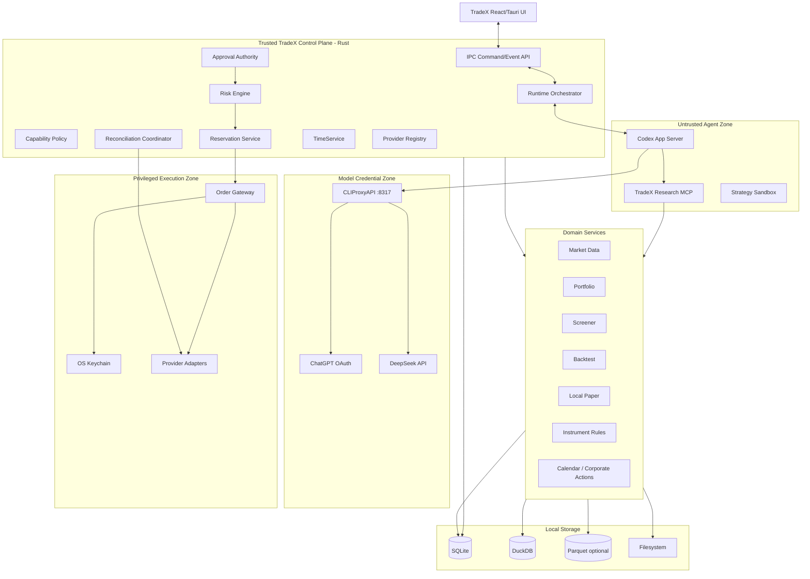

# TradeX Backend Architecture Requirements & Design (ARD)

**Contract clarification date:** 2026-09-05; prototype behavior is evidence only, subject to the QA Report defects and pending gates.

**Version:** v1.0 Revision C (RevC)  
**Status:** Engineering baseline  
**Scope:** Local backend / control plane / agent runtime integration / domain services / execution boundary  
**Primary implementation:** Rust control plane with local sidecars/processes where justified  
**Source baseline:** `TradeX_PRD_v1.0_RevC.md`, `TradeX_UI_Prototype_Spec_v1.0_RevC.md`; prototype observations are recorded separately in the QA Report\
**Language:** English

> This ARD translates the RevC product requirements into an implementable backend architecture. Safety semantics, product state, provider scope, and storage responsibilities come from the RevC PRD. Concrete process boundaries, service decomposition, persistence patterns, command/event contracts, concurrency controls, and adapter patterns below are architectural decisions for implementation.

---

## 1. Purpose

The TradeX backend is the trusted local control plane behind the desktop workspace. It integrates Codex App Server for agent execution, CLIProxyAPI for model routing, local domain services for research/backtesting, and isolated broker/exchange adapters for account access and execution.

Its core responsibility is to ensure that an agent can research and propose financial actions without becoming the authority that can execute them.

The backend must:

- supervise local runtime dependencies;
- persist Thread / Turn / Item provenance;
- expose typed domain tools to the agent;
- normalize instruments, accounts, orders, market data, and provider capabilities;
- manage account-scoped live arming;
- evaluate deterministic risk;
- issue and validate TradeX financial approvals;
- reserve account capacity atomically;
- isolate the privileged Order Gateway and credentials;
- reconcile broker state and recover safely from ambiguity, restart, sleep, disconnect, and rate limits;
- maintain local auditability and data provenance.

---

## 2. Architectural Drivers

### 2.1 Safety drivers

1. The model cannot access raw broker secrets.
2. Codex/agent runtime cannot directly call the privileged Order Gateway.
3. Generic Codex approvals cannot authorize financial execution.
4. Live approvals are proposal/account/action-bound, short-lived, and single-use.
5. Broker/exchange state is authoritative for live orders, positions, and fills.
6. No blind retry after ambiguous non-idempotent order submission.
7. Live account arming is account-scoped and resets on safety triggers.
8. Reservations are atomic per account across concurrent threads.
9. Stale market data or unacceptable clock uncertainty fails closed for live authority decisions.
10. Dangerous credential permissions block live readiness.

### 2.2 Runtime drivers

- Codex App Server is pinned and compatibility-tested.
- CLIProxyAPI is pinned, locally supervised, and is the only LLM egress path.
- Control-plane trading/reconciliation operations continue even if model inference is unavailable.
- Local persistence is the default; external telemetry is opt-in.

### 2.3 Data drivers

- SQLite owns transactional/domain state and financial audit.
- DuckDB owns persistent analytical/historical data for the MVP.
- Parquet is optional for large immutable datasets/interchange.
- Filesystem stores artifacts, strategies, exports, backups, and datasets.
- Secrets are excluded from all ordinary workspace stores.

---

## 3. Backend System Context



---

## 4. Trust Zones and Process Boundaries

TradeX implements four security-relevant zones.

### 4.1 Untrusted Agent Zone

Contains:

- Codex App Server;
- TradeX research MCP/tool process;
- strategy sandbox;
- workspace research files.

This zone may read approved context and create proposals/signals, but receives no broker credentials or direct execution capability.

### 4.2 Trusted Control Plane

Contains financial authority logic:

- capability policy;
- account arming state;
- risk engine;
- approval authority;
- reservations;
- reconciliation coordination;
- provider capability/health state;
- TimeService;
- persistence transactions.

### 4.3 Privileged Execution Zone

Contains:

- OS keychain access;
- provider request signing/authentication;
- ExecutionAdapter implementations;
- Order Gateway.

Only a validated, approved, reserved execution intent may cross into this zone.

### 4.4 Model Credential Zone

Contains CLIProxyAPI and model credentials only:

- ChatGPT OAuth tokens in sidecar auth directory;
- DeepSeek API key rendered into sidecar configuration by Rust at launch.

Broker credentials must never enter this zone.

---

## 5. Local Process Topology

Recommended v1.0 topology:

```text
tradex-desktop (Tauri/Rust main process)
 ├─ React webview
 ├─ embedded/control-plane Rust services
 ├─ child: order-gateway [privileged execution; private IPC only]
 ├─ child: codex-app-server [pinned]
 ├─ child: cliproxyapi [pinned, localhost:8317]
 ├─ child: research-mcp (Rust or Python, restricted contract)
 └─ child: strategy/backtest worker(s) [restricted]
```

### 5.1 Process supervision

The Rust main process owns child lifecycle:

- deterministic startup order;
- version verification;
- health checks;
- restart with capped exponential backoff;
- stdout/stderr redaction;
- shutdown coordination;
- crash event persistence.

### 5.2 Startup order

Recommended sequence:

```text
open/migrate SQLite
→ load settings + provider metadata
→ initialize TimeService
→ initialize domain services + durable event/authority store
→ start/authenticate Order Gateway (new mutations disabled)
→ restore account metadata
→ reconcile all live/open-order accounts
→ expose live execution readiness only for healthy accounts
→ require explicit per-account arming before new Live mutations
```

After domain initialization, start CLIProxyAPI → probe `/v1/models` → start Codex App Server as an independent, bounded-backoff branch. Model startup failures must not block order queries, reconciliation, account disarming, or the execution control plane. Agent turns become available only when their selected model route is healthy; the workspace may display history and recovery controls earlier.

### 5.3 Order Gateway process boundary

The separate child process is mandatory (PRD OD-009); a module inside the desktop process does not satisfy this boundary. “Privileged” means exclusive trading/credential capabilities, not root/administrator execution. The parent pins/verifies its binary and supervises health, bounded restart, redacted logs, and shutdown.

Use a dedicated inherited duplex IPC channel, framed with message lengths and a startup protocol-version handshake. The parent retains the only peer handle; never expose a listening TCP endpoint or pass this handle to the webview, Codex, CLIProxyAPI, research, or strategy workers. Authenticate each new child session with a random session credential sent through the inherited channel, never command-line arguments, logs, or ordinary workspace files. Reject an incompatible protocol before accepting requests.

The Gateway retrieves authoritative immutable objects through the authenticated control-plane channel; it does not become a second SQLite writer. Only its provider signing layer resolves execution credential references. Neither model credentials nor arbitrary frontend/agent order fields enter a Gateway request. Gateway failure disarms affected Live accounts, stops undispatched work, and reconciles every attempt that might have reached a provider before allowing explicit re-arming. Restarting the child never replays an order mutation automatically.

Agent workspace may become partially usable before broker reconciliation completes, but live execution remains blocked until the affected account is healthy.

---

## 6. Backend Module Decomposition

Recommended Rust workspace:

```text
crates/
  tradex-app/                 # Tauri application/bootstrap
  tradex-api/                 # IPC command/event schemas
  tradex-domain/              # canonical domain types
  tradex-runtime/             # Codex + CLIProxy supervision
  tradex-thread/              # Thread/Turn/Item persistence/orchestration
  tradex-capability/          # Agent Mode / Execution Context policy
  tradex-market/              # market data normalization
  tradex-instruments/         # canonical instruments/rules/calendar
  tradex-portfolio/           # balances/positions/valuation
  tradex-risk/                # deterministic risk engine
  tradex-approval/            # financial approval authority
  tradex-reservation/         # atomic execution reservations
  tradex-execution/           # Order Gateway
  tradex-reconciliation/      # broker-state convergence
  tradex-provider-core/       # provider schemas/capabilities/errors
  tradex-provider-alpaca/
  tradex-provider-t212/
  tradex-provider-binance/
  tradex-provider-bitget/
  tradex-storage/             # SQLite/DuckDB/filesystem
  tradex-observability/
  tradex-security/            # redaction, keychain abstractions
```

Python workers may be used for quant/scientific workloads, but financial authority remains in Rust.

---

## 7. Canonical Domain Model

### 7.1 Identity rules

Domain logic uses stable canonical IDs:

```text
workspace_id
thread_id
turn_id
account_id
instrument_id
proposal_id
approval_id
reservation_id
execution_attempt_id
provider_order_id
market_snapshot_id
policy_version
```

Provider-specific symbols/IDs remain adapter mappings.

### 7.2 Instrument examples

```yaml
instrument_id: equity:US:AAPL
asset_class: EQUITY
exchange: XNAS
currency: USD
providers:
  alpaca: AAPL
  trading212: provider_specific_id
```

```yaml
instrument_id: crypto:BTC/USDT:spot
asset_class: CRYPTO_SPOT
base: BTC
quote: USDT
providers:
  binance: BTCUSDT
  bitget: BTCUSDT
```

### 7.3 Decimal arithmetic

Price, quantity, notional, fees, FX conversion, and risk calculations use decimal-safe types. Binary floating point is prohibited in financial authority logic.

### 7.4 Quantity semantics

```rust
enum OrderQuantity {
    Base(Decimal),
    Quote(Decimal),
    Notional(Decimal),
}
```

Adapters convert explicitly according to provider capabilities and instrument rules.

---

## 8. Thread / Turn / Item Runtime Architecture

### 8.1 Persistent Thread

Stores navigation/default context only:

```text
workspace_id
codex_thread_id
title
created_at
updated_at
default_agent_mode
linked_accounts[]
linked_instruments[]
linked_strategies[]
linked_artifacts[]
```

### 8.2 Immutable Turn snapshot

At turn start, persist:

```text
turn_id
agent_mode_at_start
selected_account_id?
execution_context_at_start
capability_level_at_start
model_id
model_provider
attached_context_ids[]
attached_context_hashes[]
started_at
```

This snapshot is immutable after the turn starts. Provider attempts and completion time belong to append-only Turn lifecycle events outside the start snapshot; the displayed historical model/context must not be read from current workspace defaults.

### 8.3 Runtime adapter

`tradex-runtime` maps Codex protocol events into TradeX domain items so product logic does not depend directly on unstable protocol details.

```text
Codex JSON-RPC/JSONL
→ RuntimeProtocolAdapter
→ TradeX TurnEvent / ItemEvent
→ persistence
→ UI domain event
```

### 8.4 Generic approval isolation

Codex approval events may pause/resume a turn, but are stored distinctly from `FinancialApproval`. No code path may coerce one into the other.

---

## 9. Agent Mode, Execution Context, and Capability Policy

### 9.1 Agent Mode

```text
ASK
RESEARCH
BACKTEST
TRADE
```

### 9.2 Execution Context

```text
NONE_READ_ONLY
HISTORICAL_SIMULATION
LOCAL_PAPER
ALPACA_PAPER
TRADING212_DEMO
TRADING212_LIVE
BINANCE_TESTNET
BINANCE_LIVE
BITGET_DEMO
BITGET_LIVE
```

### 9.3 Capability policy service

The policy service returns permitted tool capabilities for a specific turn snapshot.

```rust
struct CapabilityDecision {
    level: CapabilityLevel,
    allowed_tools: Vec<ToolId>,
    execution_allowed: bool,
    reason: Option<String>,
}
```

Rules:

- Ask/Research never receive current-market execution tools;
- Backtest receives historical simulation only;
- Trade + Paper/Demo/Testnet may receive C3 execution tools;
- Trade + Live may reach proposal capability C4;
- C5 is not a standing tool grant; it exists only when a valid transaction-specific approval is consumed inside the control plane;
- C6 is unsupported.

---

## 10. LLM Runtime Architecture

### 10.1 Single egress

All model inference goes through:

```text
127.0.0.1:8317 → CLIProxyAPI
```

Direct external LLM calls from TradeX, Codex, research tools, or strategy code are prohibited.

### 10.2 CLIProxyAPI supervision

Backend responsibilities:

- verify pinned binary/version;
- allocate/verify port 8317;
- launch sidecar;
- inject only model credentials/config;
- probe `/v1/models`;
- classify stopped/port-conflict/unauthorized states;
- restart with backoff where appropriate;
- clear rendered DeepSeek configuration on exit.

### 10.3 Provider routing

V1.0 providers:

- ChatGPT subscription OAuth → GPT-5.6 series;
- DeepSeek official API → `deepseek-v4-flash`, explicitly using `thinking.type: disabled` or `thinking.type: enabled`.

The selected thinking mode is part of the immutable route/attempt snapshot and audit alongside the real model ID. Always send the explicit mode through CLIProxyAPI; do not rely on the upstream default or disguise either mode as a retired model name. This user-approved model-name clarification does not add a provider or relax the single-egress or financial guards.

Cross-provider automatic fallback is OFF by default.

### 10.4 Provider attempt audit

Every attempt persists:

```text
turn_id
attempt_no
model_id
provider
started_at
ended_at
result
error_category?
quota_metadata?
```

If opt-in automatic fallback occurs, both attempts remain visible and auditable. Provider switch never changes financial capability state.

### 10.5 Model failure independence

`MODEL_UNAVAILABLE`, `OAUTH_EXPIRED`, or `QUOTA_EXCEEDED` may block new agent turns, but must not stop:

- live order monitoring;
- cancellation already in trusted control-plane flow;
- reconciliation;
- account health processing;
- audit persistence.

---

## 11. Provider Registry and Schema-driven Connection Model

### 11.1 Provider definition

Each integration exposes metadata:

```rust
struct ProviderDefinition {
    provider_id: ProviderId,
    display_name: String,
    environments: Vec<Environment>,
    credential_schema: CredentialSchema,
    capability_schema: CapabilitySchema,
    permission_rules: PermissionRules,
}
```

### 11.2 Credential schema

Schema describes:

- fields;
- sensitivity;
- required/optional status;
- environment applicability;
- help text;
- validation behavior.

The backend never assumes every broker has the same `API Key + Secret` model.

### 11.3 Secure connection sequence

```text
UI submits secret fields through privileged Tauri command
→ Rust validates shape
→ write secret to OS keychain
→ persist only credential reference metadata
→ adapter probes provider
→ discover permissions/capabilities
→ apply dangerous-permission safety gate
→ persist non-secret health/capability metadata
→ return sanitized account connection result
```

### 11.4 Permission gate

Live readiness is blocked if detected permissions include:

- withdrawal;
- transfer;
- custody authority;
- unsupported margin/leverage-management authority.

If permission introspection is unavailable, mark `UNVERIFIED`, require user acknowledgement, and keep it visible in account health.

---

## 12. Broker Adapter Architecture

Use small, capability-specific interfaces rather than one oversized abstraction.

```rust
trait AccountAdapter { /* balances, positions, orders */ }
trait ExecutionAdapter { /* place/cancel/query execution */ }
trait MarketDataAdapter { /* quotes/bars/book + instrument metadata */ }
trait AccountStreamAdapter { /* private account/order stream */ }
```

### 12.1 Capability discovery

```rust
struct BrokerCapabilities {
    account_read: bool,
    position_read: bool,
    public_market_data: bool,
    private_account_stream: bool,
    order_types: Vec<OrderType>,
    fractional_quantity: bool,
    notional_orders: bool,
    extended_hours: bool,
    client_order_id: bool,
    paper_environment: bool,
    live_environment: bool,
}
```

Additional capability metadata should include TIF, min notional, post-only/venue constraints, cancellation behavior, and provider-specific limits where supported.

### 12.2 Provider-specific adapters

V1.0 target integrations:

- Alpaca Paper;
- Trading 212 Demo / Live;
- Binance Testnet / Spot Live;
- Bitget Demo / Spot Live.

Adapters map canonical orders into provider requests and provider states back into normalized TradeX states.

### 12.3 Adapter error normalization

Provider errors map into the canonical taxonomy and preserve raw provider code/message in redacted diagnostic metadata.

---

## 13. Market Data Architecture

### 13.1 Separation from execution

Market data and broker execution are separate service contracts. A broker adapter may provide market data, but domain code must not assume it is complete or execution-grade.

### 13.2 Subscription/access tiers

```text
Census — broad coarse universe/on-demand
Warm   — watchlists/candidates periodic refresh
Hot    — currently viewed/monitored active stream
Cold   — persisted historical/backtest data
```

MVP uses Hot active subscriptions plus on-demand/coarse watchlist/universe refresh. It does not maintain always-on tick subscriptions for the full universe.

### 13.3 Market snapshot

```rust
struct MarketSnapshot {
    id: MarketSnapshotId,
    instrument_id: InstrumentId,
    source: String,
    venue: Option<String>,
    provider_timestamp: DateTime<Utc>,
    received_timestamp: DateTime<Utc>,
    entitlement: Entitlement,
    freshness: FreshnessState,
    payload: MarketPayload,
}
```

Every live authority decision references a persisted snapshot ID.

### 13.4 Entitlement metadata

Each provider integration declares:

- realtime/delayed status;
- local retention limits;
- redistribution restrictions;
- commercial constraints;
- jurisdictions where relevant.

---

## 14. TimeService

TimeService provides consistent semantics for:

- quote age;
- approval TTL;
- reconciliation deadlines;
- event ordering;
- provider timestamp offset.

### 14.1 Data model

Track both wall-clock and monotonic time. Detect:

- significant wall-clock jump;
- system resume discontinuity;
- provider/server offset outside tolerance;
- uncertain quote age.

### 14.2 Fail-closed rule

When TimeService marks timing confidence below the configured live threshold:

- no new live approval is valid;
- pre-execution freshness/TTL checks fail;
- account/execution surfaces receive a clock/freshness blocking state;
- monitoring/reconciliation continues.

---

## 15. Instrument Rules, Calendar, and Corporate Actions

### 15.1 InstrumentRulesService

Maintains venue/provider-specific constraints:

- tick size;
- price/quantity precision;
- minimum/maximum quantity;
- minimum/maximum notional;
- allowed order types;
- market-order constraints;
- trading status.

Validation sequence:

```text
normalized order
→ InstrumentRulesService
→ deterministic risk
→ approval
→ pre-execution revalidation
→ provider adapter
```

### 15.2 MarketCalendarService

For equities:

- holidays;
- half days;
- sessions;
- extended-hours state;
- open/close timestamps;
- halts.

### 15.3 CorporateActionsService

Tracks:

- splits;
- dividends;
- symbol changes;
- delistings;
- historical adjustment metadata.

`MARKET_CLOSED` and `INSTRUMENT_HALTED` are deterministic blocking states where execution is unsupported.

---

## 16. Portfolio and Valuation Architecture

### 16.1 Broker truth

Balances, positions, open orders, and fills originate from provider state and are normalized into local projections.

### 16.2 Workspace base currency

Portfolio aggregation uses a configured base currency.

### 16.3 FX/stablecoin conversion

Conversion records:

```text
source
pair/path
provider timestamp
TradeX received timestamp
freshness
quality/depeg state
```

Never assume `USDT = USD` or stablecoin parity.

If conversion quality is unreliable and live risk depends on the normalized value, execution must fail closed.

---

## 17. Deterministic Risk Engine

The Risk Engine is independent of the model.

### 17.1 Inputs

Risk evaluation consumes immutable snapshots/references:

- account state;
- normalized order proposal;
- instrument rules;
- current market snapshot;
- policy version;
- portfolio/exposure state;
- open orders;
- active reservations;
- daily execution counters;
- market/calendar status;
- valuation provenance where required.

### 17.2 User-configurable policy

Supports controls such as:

- maximum order notional/quantity;
- position/concentration limits;
- asset-class exposure;
- daily traded notional/loss;
- max open orders;
- max reserved capital;
- allowed/blocked instruments/venues/accounts;
- market-order enablement and slippage limits;
- price deviation;
- stale-price threshold;
- environment constraints.

The agent cannot modify policy.

### 17.3 Hard safety rules

System-enforced and not user-bypassable:

- approval binding;
- duplicate-order protection;
- decimal/precision validation;
- instrument-rule validation;
- authoritative reconciliation;
- unhealthy-account block;
- stale snapshot block;
- reservation correctness;
- no blind retry after ambiguity;
- Order Gateway isolation.

### 17.4 Risk result

```rust
struct RiskDecision {
    proposal_id: ProposalId,
    policy_version: PolicyVersion,
    allowed: bool,
    checks: Vec<RiskCheckResult>,
    evaluated_at: DateTime<Utc>,
}
```

Persist every live risk decision.

---

## 18. Risk Policy Versioning and Serialization

Risk policy is versioned per affected scope/account.

Save flow:

```text
begin per-account single-writer transaction
→ persist new policy version
→ invalidate affected pending approvals
→ re-evaluate pending proposals
→ if policy weakened: DISARM affected live account
→ append audit events
→ commit
```

Approval consumption for the same account participates in the same serialization boundary so policy-save vs approval-consume races cannot bypass revalidation.

---

## 19. Order Draft and Immutable Proposal Service

### 19.1 Draft

`OrderDraft` may change freely and carries no authority.

### 19.2 Proposal generation

```text
OrderDraft
→ normalize canonical order
→ validate instrument/provider capability
→ capture market_snapshot_id where needed
→ bind policy_version
→ generate proposal_id
→ canonical serialize
→ SHA-256 proposal_hash
→ persist immutable OrderProposal
```

### 19.3 Material edit

Any material edit creates a new proposal ID/hash. Old approvals become unusable but remain in audit history.

### 19.4 Canonical serialization

Hashing must use a deterministic serialization format with explicit decimal/string normalization, field ordering, instrument/account identity, environment, TIF, and quantity semantics.

---

## 20. Financial Approval Authority

A `FinancialApproval` is separate from Codex approval.

### 20.1 Approval payload

```rust
struct FinancialApproval {
    approval_id: ApprovalId,
    intent: ApprovedFinancialIntent,
    account_id: AccountId,
    operation: FinancialOperation,
    policy_version: PolicyVersion,
    issued_at: DateTime<Utc>,
    expires_at: DateTime<Utc>,
    nonce: String,
    consumed_at: Option<DateTime<Utc>>,
}
```

ApprovedFinancialIntent is a tagged union: PLACE_ORDER binds proposal_id/proposal_hash; CANCEL binds cancellation_intent_id/intent_hash. The operation must match the tag, account, and immutable intent. A cancellation approval cannot authorize an order creation.

### 20.2 Properties

- proposal-bound;
- account-bound;
- operation-bound;
- short-lived;
- single-use;
- invalidated on material order change;
- invalidated on relevant policy change;
- invalid when market snapshot/clock conditions no longer satisfy execution checks.

### 20.3 Approval consumption

Consumption is transactional with pre-execution validation and reservation creation. A consumed approval cannot be reused.

---

## 21. Account-scoped Live Arming

Persist live arming as account-specific control-plane state.

```text
account A: DISARMED/ARMED
account B: DISARMED/ARMED
account C: DISARMED/ARMED
```

### 21.1 Arm requirements

Before accepting `ARM`:

- account connection healthy;
- reconciliation complete;
- credential/permission state acceptable;
- provider capability supports Live;
- no blocking recovery state;
- user action explicitly targets that account.

### 21.2 Automatic disarm triggers

Disarm affected account on:

- application restart;
- OS sleep/session lock;
- credential change;
- account health degradation;
- reconciliation failure;
- failed relevant pre-execution state;
- risk-policy weakening;
- configured inactivity timeout.

### 21.3 Global Disable All

One control-plane operation atomically sets all live account arming states to DISARMED and appends audit events.

Application restart, OS sleep/session lock, and Disable All affect every Live account. Credential/health failures affect the identified account; a shared policy change affects every account bound to that policy version. Selection in the UI never determines the scope.

Disable All also revokes undispatched execution grants. A `RESERVED` attempt stopped before the trusted dispatch boundary is invalidated and its reservation released under PRD §45. An attempt already handed to provider I/O retains its reservation and is reconciled; Disable All is not an implicit broker cancellation. Re-arming never restores an old approval or dispatch grant.

---

## 22. Execution Reservation Service

Reservations prevent concurrent threads from double-consuming capacity.

### 22.1 Effective capacity

Risk calculations use:

```text
broker available state
- open-order committed capacity
- active reservations
- submitted-but-unconfirmed exposure
± pending cancellation rules
= effective available capacity
```

### 22.2 Atomicity model

Use per-account serialization, implemented through a SQLite immediate transaction plus application-level per-account async mutex/single-writer queue.

The database transaction is the correctness boundary; the in-memory lock is a contention optimization, not the only safety mechanism.

### 22.3 Reservation lifecycle

```text
APPROVED
→ RESERVED
→ SUBMITTING
→ ACCEPTED / REJECTED / UNKNOWN_RECONCILING
→ adjust/release only from authoritative resolution
```

### 22.4 Unknown state

`UNKNOWN_RECONCILING` freezes reservation capacity. It cannot be auto-released after timeout.

The guarded expiry/release table in PRD §45 is normative. Approval expiry after possible transmission changes only the approval record. Provider terminal evidence adjusts for cumulative fills/fees before releasing the unused remainder; cancellation acknowledgement alone cannot release it. Persist the evidence reference, previous state, release amount, and resulting account state in the same transaction as the reservation disposition.

---

## 23. Pre-approval and Pre-execution Validation Pipeline

### 23.1 Pre-approval

```text
proposal immutable?
→ account/environment compatibility
→ account health
→ arming state for Live
→ provider capability
→ instrument rules
→ market/calendar state
→ market snapshot freshness/entitlement
→ TimeService confidence
→ deterministic risk
→ reservation capacity preview
→ approval request eligibility
```

### 23.2 Pre-execution

Immediately before broker submission:

```text
approval valid + unconsumed?
→ proposal hash matches?
→ policy version unchanged?
→ account still ARMED?
→ account healthy/reconciled?
→ quote still fresh?
→ TimeService trusted?
→ cash/positions/open orders refreshed as policy requires?
→ reservation created atomically
→ consume approval
→ transition RESERVED
→ call Order Gateway
```

A material failure invalidates or rejects the flow and requires refreshed user consent where necessary.

---

## 24. Privileged Order Gateway

### 24.1 Responsibility

The Order Gateway is the only component allowed to perform live provider mutations.

It accepts a narrow internal request containing validated identifiers, not free-form agent input.

```rust
struct GatewayExecutionRequest {
    execution_attempt_id: ExecutionAttemptId,
    intent_id: FinancialIntentId,
    operation: FinancialOperation,
    approval_id: ApprovalId,
    reservation_id: Option<ReservationId>,
    account_id: AccountId,
}
```

Gateway reloads authoritative proposal/account data inside the privileged boundary rather than trusting duplicated mutable fields from the caller.

The intent_id resolves to an immutable OrderProposal for PLACE_ORDER or CancellationIntent for CANCEL. A reservation_id is mandatory for new orders; cancellation may reference an existing reservation but never creates a new purchase reservation merely to cancel.

### 24.1.1 Dispatch ownership and failure boundary

1. The control plane creates the reservation and consumes approval under account/policy serialization, persisting the execution attempt as `RESERVED`.
2. The Gateway requests a one-use dispatch grant for that attempt over the private channel. Under the same serialization used by disarm/policy-save, the control plane rechecks arming, health, permissions, policy, proposal identity, market/clock/FX eligibility and current reservation; it records the grant before replying.
3. The Gateway serializes dispatch and revocation per account, confirms the grant is current, and records a durable `SUBMITTING` intent through the control plane immediately before provider I/O. A disable acknowledged before this boundary prevents I/O. Once the boundary is crossed, cancellation of local work cannot prove absence at the provider.
4. If delivery, child health, or transmission acknowledgement is uncertain after a grant, retain capacity and query the provider first. The control plane must not infer “not submitted” from a missing Gateway reply. Release is allowed only when durable dispatch/revocation evidence proves that transmission never began, or later provider evidence resolves the attempt.

Disable All returns per-account disarm state and per-attempt STOPPED_BEFORE_DISPATCH or MAY_HAVE_SUBMITTED disposition. The former requires an acknowledged Gateway revocation before its dispatch boundary; an unreachable Gateway yields the latter and retains capacity. These are dispatch dispositions, not new broker order states.

The grant binds the execution attempt, account, operation, proposal/hash, approval, reservation where applicable, and authority version. The existing execution attempt ID deduplicates requests; a transport request ID alone is not financial idempotency. Gateway and control-plane restarts invalidate grants and preserve attempts for reconciliation.

### 24.2 Keychain access

Credentials are read only inside the provider signing/execution layer and never returned to the caller.

### 24.3 Network isolation

Only provider adapters need outbound broker/exchange access for privileged operations. Agent/strategy processes do not receive this capability.

---

## 25. Idempotency and Submission Semantics

### 25.1 Internal identity

Each execution has a durable `execution_attempt_id` and, where provider supports it, a provider `client_order_id` derived from a stable TradeX identifier.

### 25.2 Safe retry classes

- query/read requests: retry with bounded backoff where safe;
- idempotent provider mutations: retry only according to provider contract;
- non-idempotent order POST after ambiguous timeout: **never blindly retry**.

### 25.3 Ambiguous timeout

If the network outcome is unknown:

```text
SUBMITTING
→ SUBMISSION_AMBIGUOUS
→ UNKNOWN_RECONCILING
→ query provider using client order ID / account orders / time-symbol-side fingerprints
```

Reservation remains frozen until evidence resolves the state.

---

## 26. Reconciliation Architecture

Reconciliation converges local projections to provider truth.

### 26.1 Triggers

- application startup;
- OS resume;
- private stream disconnect/reconnect;
- ambiguous submission;
- periodic health cycle;
- user-requested refresh;
- restore/import;
- detected state mismatch.

### 26.2 Priority

Rate-limit budgeting prioritizes:

1. ambiguous-order resolution;
2. open live orders;
3. fills/positions/balances needed for execution safety;
4. private stream recovery;
5. research/history traffic.

### 26.3 Reconciliation algorithm

```text
load local unresolved/open execution records
→ fetch authoritative provider state
→ map provider orders/fills to canonical IDs
→ detect missing/changed state
→ append reconciliation events
→ update local projection
→ adjust/release reservations only from resolved truth
→ recompute account health
```

### 26.4 Stream handling

Private WebSocket/account stream is a low-latency signal, not sole truth. REST/query reconciliation repairs missed events.

---

## 27. Manual Resolution

After the bounded automatic reconciliation window (default from PRD: 5 minutes), unresolved submissions remain frozen and the account is unhealthy/disarmed.

Allowed actions:

### 27.1 Confirmed not submitted

Requires provider/account evidence sufficient to establish absence. Then:

- mark execution attempt resolved-not-submitted;
- release reservation transactionally;
- run account reconciliation;
- restore readiness only if health checks pass.

### 27.2 Confirmed submitted

Require/link broker order identity, then reconcile provider state and adjust reservation from truth.

### 27.3 Keep reconciling

Leave reservation frozen and continue query-first resolution.

A user assertion alone cannot make the account healthy/live-ready.

### 27.4 Evidence contract

Manual Resolution submits `{execution_attempt_id, account_id, decision, evidence_ids, broker_order_id?, expected_state_version}`. Decisions are `CONFIRMED_NOT_SUBMITTED`, `CONFIRMED_SUBMITTED`, or `KEEP_RECONCILING`; these are resolution decisions, not new order states. The backend owns sanitized evidence records: provider/account, query scope, query time and coverage window, provider request/reference, outcome, and related broker identity. Missing credentials, incomplete pagination, lagging provider visibility, or an empty single query do not prove absence.

Confirmed submission requires an account-scoped broker identity verified against the intended instrument/action; confirmed non-submission requires an adapter-specific sufficient-absence rule. Unsupported absence proof leaves the only available decision as Keep reconciling. The backend validates evidence and expected state version again at commit; a fill arriving meanwhile wins over stale manual input. The UI can inspect evidence but cannot declare it verified. A successful resolution triggers health revalidation and keeps arming DISARMED until a separate user action.

---

## 28. Order State Machine

Normalized backend order states:

```text
DRAFT
PROPOSED
RISK_REJECTED
NEEDS_APPROVAL
APPROVED
RESERVED
SUBMITTING
ACCEPTED
PARTIALLY_FILLED
FILLED
CANCEL_PENDING
CANCELLED
REJECTED
EXPIRED
UNKNOWN_RECONCILING
```

### 28.1 Transition ownership

- Draft/Proposal: proposal service;
- Risk rejected: Risk Engine;
- Needs approval/Approved and approval expiry: Approval Authority;
- Reserved: Reservation Service;
- Submitting: Order Gateway;
- Accepted/Partial/Filled/Rejected/Cancelled and broker order expiry: provider truth via adapter/reconciliation;
- Unknown reconciling: submission/reconciliation coordinator.

No UI or agent text may write these states directly.

---

## 29. Cancellation Architecture

Cancellation is transaction-specific.

Cancellation intent is immutable and binds `operation=CANCEL`, account/environment, instrument, provider order ID, latest observed order state, cumulative filled/remaining quantity, and provider snapshot time. Arming is a prerequisite that returns to this same cancellation intent, never a create-order approval. After arming, refresh provider state again; changed remaining quantity/state requires a refreshed cancellation intent and new consent. A filled/terminal order cannot be cancelled. Use cancellation eligibility rules: an equity market closed to new orders does not automatically mean the provider forbids cancellation.

Flow:

```text
refresh provider order state
→ verify cancellable state/capability
→ create cancellation intent
→ deterministic safety checks
→ request user cancellation approval
→ consume cancellation approval
→ Order Gateway cancel
→ CANCEL_PENDING
→ reconcile
→ CANCELLED or authoritative terminal state
```

A partial fill before cancellation changes the remaining exposure and reservation adjustment.

V1.0 does not require broker-native amend/replace. Modification is implemented as confirmed cancel followed by a new proposal.

---

## 30. Paper / Demo / Testnet Architecture

### 30.1 Local Paper

Local Paper is a TradeX-owned simulation engine and must be labeled distinctly from broker-hosted environments.

It uses the same normalized order/event domain where practical, but never crosses the Privileged Live Order Gateway.

### 30.2 Provider-hosted non-live environments

Alpaca Paper, Trading 212 Demo, Binance Testnet, and Bitget Demo use provider adapters with explicit non-live environment metadata.

Their lifecycle should normalize into the same order-state model where possible, but Live arming/financial approval requirements do not apply as Live authority gates.

### 30.3 Environment invariant

Environment is immutable on an execution attempt. A Demo/Testnet order cannot become Live by adapter routing or UI state change.

---

## 31. Backtest and Strategy Architecture

### 31.1 Backtest engine

Backtests are local and deterministic. Persist:

- inputs/parameters;
- strategy version/hash;
- dataset hash/provider;
- adjustment/calendar/timezone assumptions;
- commission/slippage model;
- engine version;
- complete metrics/trades/equity curve.

### 31.2 Sandbox

Strategy worker may access approved historical data and numerical libraries, but not:

- keychain;
- broker credentials;
- arbitrary network;
- privileged Order Gateway;
- unrestricted filesystem.

### 31.3 Live strategy output

A strategy produces a signal, not an executable provider request. Signal → proposal → risk → approval → reservation → gateway.

---

## 32. Storage Architecture

### 32.1 SQLite

Authoritative transactional/domain state:

- workspace metadata;
- Thread/Turn/Item mappings;
- account metadata/capabilities/health;
- watchlists;
- risk policies/versions;
- Local Paper state;
- order drafts/proposals;
- risk decisions;
- approvals;
- reservations;
- execution attempts;
- reconciliation events;
- portfolio snapshots;
- provider connection metadata;
- settings/memory;
- audit log.

### 32.2 DuckDB

Analytical/historical store:

- persistent 1-minute+ OHLCV;
- screener materializations;
- features;
- portfolio analytics;
- historical joins;
- backtest datasets/results.

### 32.3 Parquet

Optional large immutable historical/interchange layer. Not required for v1.0 correctness.

### 32.4 Filesystem

```text
~/.tradex/
  workspaces/
  artifacts/
  strategies/
  datasets/
  logs/
  broker-cache/
  backups/
  exports/
```

Secrets are excluded.

---

## 33. SQLite Transaction and Concurrency Model

### 33.1 Single-writer safety domains

Critical financial mutations serialize by account:

- risk policy save;
- approval consumption;
- reservation create/release;
- execution attempt creation;
- reconciliation updates that alter execution capacity.

### 33.2 Transaction rules

Use explicit transactions and foreign-key constraints. Recommended patterns:

- `BEGIN IMMEDIATE` for financial state mutation;
- optimistic version columns for non-critical editable metadata;
- append-only financial events where possible;
- unique constraints on single-use approval consumption and idempotency identities.

### 33.3 Suggested uniqueness constraints

```text
UNIQUE(proposal_hash)
UNIQUE(approval_id)
UNIQUE(reservation_id)
UNIQUE(execution_attempt_id)
UNIQUE(account_id, provider_client_order_id) where supported
```

Approval tables should enforce consumed-at-most-once semantics transactionally.

---

## 34. Event and Audit Architecture

### 34.1 Domain events

Important state changes append immutable events:

- TurnStarted/Completed/Failed;
- ProviderAttemptStarted/Failed/Completed;
- AccountArmed/Disarmed;
- RiskPolicyChanged;
- ProposalGenerated;
- RiskEvaluated;
- ApprovalIssued/Invalidated/Consumed/Expired;
- ReservationCreated/Adjusted/Released/Frozen;
- ExecutionStarted;
- BrokerAcknowledged;
- FillObserved;
- SubmissionBecameAmbiguous;
- ReconciliationStarted/Resolved/Failed;
- ManualResolutionRecorded.

### 34.2 Tamper evidence

Recommended for financial audit events:

```text
sequence
previous_event_hash
event_hash
```

This provides local tamper detection without claiming regulated immutable-ledger guarantees.

### 34.3 Secret redaction

Structured logging applies field-level redaction before serialization. Never rely only on downstream log scrubbing.

---

## 35. Error Taxonomy

Backend returns canonical categories:

```text
AUTH_ERROR
PERMISSION_ERROR
RATE_LIMITED
NETWORK_ERROR
UNSUPPORTED_CAPABILITY
MARKET_CLOSED
INSTRUMENT_HALTED
INVALID_ORDER
INSUFFICIENT_FUNDS
RISK_REJECTED
SUBMISSION_REJECTED
SUBMISSION_AMBIGUOUS
STREAM_DISCONNECTED
STATE_STALE
RECONCILIATION_REQUIRED
MODEL_UNAVAILABLE
QUOTA_EXCEEDED
OAUTH_EXPIRED
INTERNAL_ERROR
```

Each error contains:

- category;
- stable internal code;
- human-safe message;
- blocking/non-blocking status;
- remediation actions;
- related aggregate ID;
- redacted provider code/detail where useful.

---

## 36. Rate-limit and Backpressure Architecture

### 36.1 Provider budgets

Maintain per-provider/per-account rate-limit state and request classes.

Priority classes:

```text
P0 execution reconciliation
P1 account/order safety refresh
P2 active market/context
P3 research/history/background
```

### 36.2 Backpressure

High-volume streams pass through bounded channels. Policies:

- never drop financial order/fill events before durable processing;
- coalesce replaceable quote/UI updates;
- backpressure or sample high-frequency market data according to tier;
- persist sequence/checkpoint metadata for account streams where provider permits.

### 36.3 Codex backpressure

Codex queue overload affects agent turns only. It must not starve control-plane reconciliation/execution tasks.

---

## 37. Recovery Architecture

### 37.1 Application restart

On startup:

- all live accounts begin DISARMED;
- load unresolved/open live executions;
- start reconciliation within NFR target;
- keep live execution disabled until account health is restored.

### 37.2 Sleep/resume

On sleep/session lock:

- disarm live accounts;
- persist runtime checkpoint where safe;
- on resume, reinitialize TimeService confidence;
- reconnect private streams;
- reconcile before new live execution.

### 37.3 Stream disconnect

Private-stream loss marks account degraded, blocks new Live execution, and triggers query-based reconciliation/reconnect.

### 37.4 Corrupted local projections

Broker truth can reconstruct order/position projections. Local audit/proposal history remains valuable but does not override provider truth.

---

## 38. Workspace Export / Import / Backup

### 38.1 Export

Archive includes non-secret workspace state, schemas/manifests, artifacts, strategy files, and permitted datasets/metadata.

### 38.2 Import

```text
validate archive manifest/schema
→ backup current state
→ migrate/restore non-secret state
→ verify credential references exist
→ mark live accounts DISARMED
→ reconcile account state
→ enable readiness only after health checks
```

Raw broker secrets are never imported from workspace archives.

### 38.3 Retention

Ordinary artifacts/cache may follow user retention settings. Unresolved execution/reconciliation records must not be automatically deleted.

---

## 39. Observability

Local metrics/logging track:

- Codex turn/tool latency;
- token/model provider usage;
- CLIProxyAPI health;
- market-data freshness;
- WebSocket reconnects;
- broker REST latency;
- rate-limit state;
- order acknowledgement latency;
- fill convergence latency;
- reconciliation failures;
- unknown-order count;
- risk rejection count;
- storage growth.

External telemetry is disabled by default and, if enabled, uses explicit redaction and excludes broker secrets.

---

## 40. Security Controls

### 40.1 Credentials

- broker secrets only in OS credential storage;
- credential references in SQLite contain no secret material;
- ChatGPT OAuth remains in CLIProxyAPI auth-dir;
- DeepSeek API key remains in OS keychain and is rendered into sidecar config with restrictive file permissions;
- temporary rendered model config is cleared on exit;
- logs redact auth headers/signatures/tokens.

### 40.2 Prompt-injection boundary

Research content is untrusted data. Tool contracts distinguish data from authority. No text returned by research sources can:

- modify risk policy;
- arm accounts;
- issue financial approval;
- access keychain;
- call Order Gateway.

### 40.3 Sandbox

Strategy/research subprocesses run with least privilege, restricted filesystem/environment, and no privileged broker credential access.

### 40.4 Dependency pinning

Pin and test:

- Codex App Server;
- CLIProxyAPI;
- provider SDK/API schema assumptions;
- database migrations.

Upgrade requires compatibility/schema diff tests.

---

## 41. Backend API / IPC Surface

Canonical command names exposed to the frontend (version 1; see §41.1):

### Workspace/runtime

```text
workspace.open
workspace.export
workspace.import
runtime.status
runtime.restart_sidecar
time.status
time.revalidate
```

### Agent capability

```text
agent.capabilities
```

### Threads

```text
thread.list
thread.get
thread.create
turn.start
turn.cancel
turn.retry
```

### Markets/accounts

```text
market.catalog
market.get
market.snapshot
market.history
market.screen
screener.list
screener.save
screener.update
screener.attach
watchlist.list
watchlist.create
watchlist.rename
watchlist.delete
watchlist.add
watchlist.remove
account.list
account.get
account.refresh
account.arm
account.disarm
account.disable_all_live
portfolio.get
```

### Data-source policy

```text
data.source.catalog
data.source.probe
```

### Providers

```text
provider.list_definitions
provider.get_schema
provider.connect
provider.disconnect
provider.probe
provider.permissions
model.login_chatgpt
model.configure_deepseek
model.set_default
model.set_fallback_policy
```

### Risk/trading

```text
risk.get_policy
risk.save_policy
trade.save_draft
trade.generate_proposal
trade.refresh_proposal
trade.request_approval
trade.approve
trade.reject
trade.cancel_request
trade.cancel_approve
trade.manual_resolution
trade.resolution_evidence
```

### Local Paper simulation (S16)

```text
paper.account.ensure
paper.get
paper.order.submit
paper.order.cancel
paper.quote.refresh
paper.scenario.set
```

### Alpaca Paper order submission (S17)

```text
alpaca.paper.order.submit
alpaca.paper.order.attempt.get
alpaca.paper.order.reconcile
```

### Trading 212 Demo order submission (S18 #61)

```text
trading212.demo.order.submit
trading212.demo.order.attempt.get
```

### Strategy/backtest

```text
strategy.list
strategy.save_version
backtest.run
backtest.cancel
backtest.get
backtest.list
backtest.compare
```

### Artifacts

```text
artifact.save
artifact.list
artifact.get
artifact.export
```

Every command has explicit schema versioning and sanitized errors.

---


### 41.1 Canonical wire contract (version 1)

This section and §42 own the frontend/control-plane wire contract. Frontend ARD §10 references it; conceptual module groups are not alternate command names. The command names in this section are exact wire names, not examples to rename independently. New operations require an explicit schema entry before implementation.

~~~ts
interface CommandEnvelope<T> {
  requestId: string;
  command: string;
  schemaVersion: 1;
  payload: T;
}
type ResultEnvelope<T> =
  | { requestId: string; schemaVersion: 1; ok: true; data: T; stateVersion?: string }
  | { requestId: string; schemaVersion: 1; ok: false; error: TradeXError };
interface TradeXError {
  category: string; // PRD §51 canonical error category
  code: string;     // stable operation-specific reason, not an order state
  message: string;  // sanitized user-facing explanation
  retryable: boolean; // not permission to retry a financial mutation
  blocking: boolean;
  remediationActions: Array<{ id: string; label: string }>;
  aggregateId?: string;
  providerCode?: string; // sanitized, optional
}
~~~

Unsupported schema versions fail as category INTERNAL_ERROR, code IPC_SCHEMA_UNSUPPORTED, before dispatch; the UI offers runtime compatibility/reconnect guidance. An unknown command fails as IPC_COMMAND_UNKNOWN. Malformed wire payloads fail as INTERNAL_ERROR with code IPC_PAYLOAD_INVALID; invalid order values use INVALID_ORDER. A state-version mismatch fails as STATE_STALE with code STATE_VERSION_CONFLICT and returns no mutation; the client reloads the authoritative object before requesting new consent.

| Frontend responsibility | Exact command | Minimum payload contract |
|---|---|---|
| Read Agent capability | agent.capabilities | workspace_id, agent_mode, execution_context, optional account_id, attached_contexts, and optional requested_tool/requested_level probes; returns capability level, allowed tools, executionAllowed, and blocking reason; disallowed or unknown tools and C5/C6 return UNSUPPORTED_CAPABILITY |
| Save editable draft | trade.save_draft | draft_id when updating, draft fields, expected_state_version when updating; no authority granted |
| Generate proposal | trade.generate_proposal | draft_id, expected_draft_version; backend generates immutable identity/hash |
| Refresh stale proposal | trade.refresh_proposal | proposal_id, expected_state_version; return a new proposal and invalidate old consent |
| Request approval | trade.request_approval | proposal_id, expected_state_version; returns eligibility and immutable approval summary |
| Explicitly approve | trade.approve | proposal_id, proposal_hash, approval_id, expected_state_version; consume only after backend revalidation |
| Reject approval | trade.reject | approval_id, expected_state_version; no broker action |
| Prepare cancellation | trade.cancel_request | account_id, broker_order_id, expected_state_version; fetch provider state and return immutable cancellation intent |
| Approve cancellation | trade.cancel_approve | cancellation_intent_id, approval_id, expected_state_version; operation is always CANCEL |
| Inspect resolution evidence | trade.resolution_evidence | execution_attempt_id, account_id; return backend-owned evidence and allowed decisions |
| Resolve ambiguity | trade.manual_resolution | §27.4 payload; decision/evidence validated again at commit |

State versions are opaque backend tokens, scoped to the returned aggregate. Decimal amounts use normalized strings; IDs, enum values, time representations, and required/optional fields are part of the command's versioned schema. A request ID correlates one exchange and never substitutes for proposal/approval/execution identity. After timeout on an authority-changing command, query state before any retry; never turn transport retries into repeated consent.

#### 41.1.1 Backtest lifecycle payloads (S15)

`backtest.run`, `backtest.get`, `backtest.list`, `backtest.compare`, and `backtest.cancel` use schema version 1 and are workspace-scoped. `backtest.run` accepts only the bounded frozen configuration below; the renderer cannot submit a run ID, state, request hash, observed timestamp, engine version, or state version. The backend resolves the saved strategy hash and trusted time, then persists a queued run before any worker starts.

```ts
interface BacktestRunRequest {
  workspaceId: string;
  strategyVersionId: string;
  expectedStrategyHash?: string;
  instrumentId: string;
  datasetId: string;
  startAt: string; // UTC RFC 3339
  endAt: string; // UTC RFC 3339, end >= start
  barInterval: "1m" | "5m" | "15m" | "30m" | "1h" | "1d";
  startingCash: string; // normalized non-negative decimal, > 0
  commission: string; // normalized non-negative decimal
  slippage: string; // normalized non-negative decimal
  portfolioSeed?: string;
  parameters?: StrategyParameter[]; // omitted means the saved version parameters
  fixtureScenario?: "SUCCESS" | "FAILURE" | "CANCELLED" | "LOOKAHEAD" | "SURVIVORSHIP" | "SPLIT" | "DIVIDEND" | "TIMEZONE" | "DATA_GAP" | "DATASET_HASH_MISMATCH"; // integration-test fixture only; never production
}
interface BacktestCancel {
  workspaceId: string;
  runId: string;
  expectedStateVersion: string;
}
interface BacktestRunSummary {
  runId: string;
  strategyVersionId: string;
  strategyHash: string;
  instrumentId: string;
  datasetId: string;
  startAt: string;
  endAt: string;
  barInterval: string;
  state: "QUEUED" | "RUNNING" | "COMPLETED" | "FAILED" | "CANCELLED";
  requestHash: string;
  updatedAt: string;
  resultHash?: string;
  tradeCount?: number;
}
interface BacktestLibrary {
  workspaceId: string;
  stateVersion: string;
  runs: BacktestRunSummary[];
}
interface BacktestCompareRequest {
  workspaceId: string;
  leftRunId: string;
  rightRunId: string;
}
interface BacktestComparison {
  workspaceId: string;
  left: BacktestRun;
  right: BacktestRun;
  leftCurve: {pointCount: number; startAt: string; endAt: string; startEquity: string; endEquity: string; maxDrawdown: string};
  rightCurve: {pointCount: number; startAt: string; endAt: string; startEquity: string; endEquity: string; maxDrawdown: string};
  inputDifferences: Array<{field: string; left: string; right: string}>;
  manifestDifferences: Array<{field: string; left: string; right: string}>;
  metrics: {
    return: {left: string; right: string; difference: string};
    sharpe: {left: string; right: string; difference: string};
    sortino: {left: string; right: string; difference: string};
    maxDrawdown: {left: string; right: string; difference: string};
    winRate: {left: string; right: string; difference: string};
    profitFactor: {left: string; right: string; difference: string};
    turnover: {left: string; right: string; difference: string};
    tradeCount: {left: string; right: string; difference: string};
  };
  historicalSimulation: boolean;
  limitations: string[];
}
interface BacktestManifest {
  strategyVersion: string;
  strategyHash: string;
  datasetId: string;
  datasetHash: string;
  dataProvider: string;
  retrievedAt: string;
  startAt: string;
  endAt: string;
  adjustmentMethod: string;
  timezone: string;
  marketCalendarVersion: string;
  commissionModel: string;
  commission: string;
  slippageModel: string;
  slippage: string;
  startingCash: string;
  seed: string;
  parameters: StrategyParameter[];
  engineVersion: string;
  runtimeVersion: string;
  guardChecks: Array<{name: string; state: "PASSED"; detail: string}>; // look-ahead, survivorship, split, dividend, timezone, gaps
  manifestHash: string;
}
interface BacktestResult {
  metrics: {
    return: string;
    sharpe: string;
    sortino: string;
    maxDrawdown: string;
    winRate: string;
    profitFactor: string;
    turnover: string;
    tradeCount: number;
  };
  equityCurve: Array<{observedAt: string; equity: string; drawdown: string}>;
  trades: Array<{
    tradeId: string;
    instrumentId: string;
    side: string;
    quantity: string;
    price: string;
    grossValue: string;
    commission: string;
    slippage: string;
    realizedPnl: string;
    observedAt: string;
  }>;
  manifest: BacktestManifest;
  historicalSimulation: true;
  limitations: string[];
  resultHash: string;
}
interface BacktestRun {
  // frozen configuration and lifecycle fields omitted here for brevity
  result?: BacktestResult; // required when state is COMPLETED; absent for other states
}
```

When `parameters` is omitted or an empty array is supplied, the backend uses the saved strategy version's parameters. `fixtureScenario` is accepted only by the integration-test fixture and is never a production runtime control.

`backtest.get` accepts `{workspaceId, runId}` and returns the complete frozen configuration, `runId`, `requestHash`, `state`, failure/remediation when applicable, and the opaque `stateVersion`. A `COMPLETED` response includes a hash-checked `BacktestResult` with the full metric set, equity curve, trade list, six data guard checks, limitations and reproducibility manifest. Missing fields, tampered hashes, mismatched strategy/dataset identity or a non-historical result fail closed. The stable request identity is the SHA-256 of the canonical strategy/version/hash, dataset hash, instrument, dataset, date range, timezone, calendar/adjustment assumptions, bar interval, normalized costs, starting cash, portfolio seed, parameters, runtime and engine versions; observation time is metadata and is excluded from identity. Run IDs are unique per attempt, so a retry keeps the same request identity while creating a new run identity.

`backtest.list` accepts {workspaceId} and returns a bounded, workspace-scoped `BacktestLibrary` of persisted summaries, ordered newest first. The backend revalidates every projection before returning it; the library is a selector for the compare flow and does not grant execution authority. `backtest.compare` accepts exactly two distinct run IDs and reloads both projections before constructing `BacktestComparison`. Both runs must belong to the active workspace, be `COMPLETED`, have valid request/result/manifest identities and `historicalSimulation=true`; unknown, cross-workspace, same-run, non-completed or tampered identities fail closed without mutation. The response retains both full run identities and bounded input/manifest/metric/curve differences. Compare is read-only historical analysis and never invokes a broker, order, approval, reservation, gateway or provider mutation. A model-unavailable state does not clear this persisted library or completed results.

The persisted state machine is `QUEUED -> RUNNING -> COMPLETED|FAILED|CANCELLED` (a queued run may fail or cancel before running). Every transition is an immediate SQLite transaction with a state-version compare-and-swap. A stale cancel token returns `STATE_STALE / STATE_VERSION_CONFLICT` without mutation; a missing token fails the version-1 payload schema before dispatch. Terminal projections are immutable. Reopening a workspace reconciles queued/running runs to typed `CANCELLED` state. Backtest workers never place broker orders or invoke execution accounts.

Runtime status, account queries, event subscription/replay, and reconciliation must remain available when model inference is unavailable. Frontend-only navigation/draft typing does not require a backend command.

---

### 41.2 Workspace bootstrap payloads (S01)

The following version-1 payloads define the first desktop vertical slice. All objects reject undeclared fields. IDs are non-empty opaque strings; sequences are integers from 0 through JavaScript's safe integer maximum. Times are UTC RFC 3339 strings. No command below grants financial authority.

| Command | Payload | Success data |
|---|---|---|
| workspace.open | `{path?: string, name?: string, baseCurrency?: string}`; omitted means the application default workspace directory; a supplied path must be an absolute directory path | Workspace projection: `{workspaceId, name, baseCurrency, path, createdAt, lastOpenedAt, storageSchemaVersion: 5}` and opaque `stateVersion` in the result envelope |
| runtime.status | `{}` | `{components: [{id, status, message}], modelAvailable: boolean, liveExecutionAvailable: boolean}`; initial Codex/CLIProxyAPI status is `NOT_CONFIGURED`, never inferred healthy |
| domain.snapshot | `{aggregateType: "workspace", aggregateId: string}` | `{aggregateType, aggregateId, projection: Workspace, lastSequence}` |
| domain.subscribe | `{aggregateType: "workspace", aggregateId: string, afterSequence: number}` | `{aggregateType, aggregateId, afterSequence, lastSequence, replayedCount}` after all retained events through the acknowledged cursor have been delivered; subsequent events use the same transport channel |

The desktop transport supplies a Tauri Channel outside the canonical command envelope. The control plane identifies the consumer from the native webview, not a caller-supplied identity. Re-subscribing replaces that consumer's subscription to this aggregate. Delivery failure removes the subscription; the client reloads a snapshot and subscribes again. Replacing the active workspace revokes its subscriptions. The replay-to-live handoff and command mutations share one serialization boundary, so a concurrent committed event cannot fall between them. The headless integration runner uses framed JSON lines on inherited stdio, no listening network port.

An absent/unknown aggregate yields `STATE_STALE / IPC_AGGREGATE_NOT_FOUND`. A future cursor yields `STATE_STALE / STATE_VERSION_CONFLICT`. A retained-event gap yields `STATE_STALE / IPC_REPLAY_UNAVAILABLE`; clients reload the snapshot. Missing/failed subscription delivery yields `INTERNAL_ERROR / IPC_SUBSCRIPTION_CHANNEL_REQUIRED` or `IPC_SUBSCRIPTION_DELIVERY_FAILED`. Failed storage opening yields sanitized `INTERNAL_ERROR` codes `WORKSPACE_PATH_INVALID`, `WORKSPACE_BUSY`, `WORKSPACE_OPEN_FAILED`, `WORKSPACE_SCHEMA_UNSUPPORTED` or `WORKSPACE_INTEGRITY_FAILED`; it must preserve the previously active workspace and never overwrite corrupted/foreign databases. No raw filesystem/SQL diagnostic is returned.

Name (1–120 characters without control characters) and baseCurrency (three uppercase letters) apply only when creating a workspace; reopening returns its persisted configuration. Defaults are the folder name and USD. Unsupported conversion pairs remain unavailable until the portfolio/data integration supplies them. Opening creates the non-secret workspace database if absent, or reopens the existing identity. Each successful open transaction updates `lastOpenedAt` and appends one `workspace.opened` domain event whose payload is the resulting Workspace projection. Workspace ID and `createdAt` remain immutable. New-database initialization is transactional; existing recognized schema upgrades require a consistent backup before migration and integrity verification. A process-scoped OS lock prevents two control planes from treating the same workspace as active writers. Unknown newer schemas and foreign SQLite databases are rejected without migration. Browser projection/render checks cannot substitute for actual Tauri and persistent-store checks.

---

### 41.3 Broker connection payloads (S02)

Version 1 adds the following exact operations. All input objects reject extra fields and explicit nulls. Strings and collection sizes are bounded; opaque IDs/state versions are non-empty. A broker connection is scoped to the active `workspaceId`; provider/environment never change after creation. No wire field accepts a secret, HTTP destination, permission assertion, arming flag or caller-selected Keychain reference.

| Command | Payload | Success data |
|---|---|---|
| provider.list_definitions | `{}` | `{providers: ProviderDefinition[]}` with provider/environment availability, credential field sensitivity/requiredness/validation/help, requested permission rules and supported capabilities |
| provider.get_schema | `{providerId, environment}` | ProviderDefinition for that supported selection; unsupported combinations fail before secret entry |
| provider.connect | `{step: "test", workspaceId, providerId, environment, label}` | AccountConnection after native secure entry and read-only authentication; status REVIEW_REQUIRED; secret fields never cross the webview command envelope |
| provider.connect | `{step: "confirm", workspaceId, connectionId, expectedStateVersion, acknowledgeUnverified: boolean}` | AccountConnection; confirms only the exact successfully tested review version; unknown scope requires explicit acknowledgement and remains UNVERIFIED |
| provider.probe / account.refresh | `{workspaceId, connectionId, expectedStateVersion}` | AccountConnection with actual read results/health; a failed read preserves prior observations and last successful sync, marks stale/error, and returns a sanitized error |
| provider.permissions / account.get | `{workspaceId, connectionId}` | PermissionReview / AccountConnection respectively |
| account.list | `{workspaceId}` | `{accounts: AccountConnection[]}`; includes pending/failed/disconnected records for recovery/history |
| provider.disconnect | `{workspaceId, connectionId, expectedStateVersion}` | AccountConnection marked DISCONNECTED before credential cleanup; failed deletion remains DELETE_PENDING and is retryable with the new version; no provider mutation or external-order cancellation |

ProviderDefinition includes `providerId`, `displayName`, `environment`, `available`, `helpText`, `fields` (`id`, `label`, `inputType`, `required`, `secret`, `maxLength`, `helpText`, applicable environment), and permission requirements. Only supported implemented combinations can enter the connection workflow; unavailable catalog entries explain why. Local Paper is built-in and credential-free; it is not a successful external probe.

AccountConnection includes immutable `connectionId`, `workspaceId`, `providerId`, `environment`, `createdAt`; `label`, opaque `stateVersion`, `updatedAt`, `connectionState` (CONNECTING / REVIEW_REQUIRED / CONNECTED / FAILED / DISCONNECTED); separate connection/authentication/credential/private-stream/reconciliation/execution-eligibility/arming health; optional prior account data; optional last successful sync; and PermissionReview. Account data includes remote identity/type, currency where available, exact normalized decimal balances, optional account-level buying power, positions and open orders, observed capabilities and explicit limitations. Missing values are unavailable, never zero by default. Alpaca Paper `buyingPower` is an exact decimal in the provider-reported account currency and is never inferred from cash or equity. PermissionReview distinguishes scope VERIFIED/UNVERIFIED, detected permissions, forbidden/unsupported permissions, acknowledgement and IP restriction status. Read success cannot establish complete key scope or financial authority. All Live accounts remain DISARMED; S02 supplies no execution readiness.

Account observations add optional `reserved` and `inPies` decimal strings on each balance; optional `instrumentCurrency` and `marketValueCurrency` on positions; and optional `currency` / `filledValue` on open orders. `filledQuantity` is nullable/optional for provider value orders. Missing fields on stored older projections remain unavailable. Every monetary unit displayed comes from its observation currency; the workspace currency is not an implicit conversion. Trading 212 account subtype remains explicitly unavailable because the summary does not expose it. JSON-number provider values are normalized into exact decimal wire strings without binary-float conversion.

The control plane allocates the immutable connection and its private reference before native entry. Keychain values are captured/stored/resolved only in the trusted provider layer; ordinary connection storage contains metadata/reference only. Cancellation invalidates the pending connection and deletes only its own credential. A failed initial test remains visibly failed and removes its own credential; failed cleanup is DELETE_PENDING, blocks probes and supports retrying disconnect. Native dialogs and network I/O never hold the domain-state lock. Each result is committed only if workspace session, connection identity and expected state still match; disconnect/workspace switch invalidate in-flight completion. The privileged layer checks validity before further I/O and removes abandoned newly captured credentials. On restart, interrupted CONNECTING records become DISCONNECTED / DELETE_PENDING for cleanup and reconnection; previous observations are stale until reference checks and a successful fresh probe; restart cannot confirm a review or restore arming.

Every accepted connection/health change and its `account.health.changed` event commit in one SQLite transaction. The `account` aggregate uses `connectionId`, its own contiguous sequence and an AccountConnection projection. `domain.snapshot` / `domain.subscribe` accept this aggregate with the same recovery and replay-to-live guarantees as §41.2. A consumer may subscribe to different aggregates; replacement is scoped to consumer + aggregate, not to all its subscriptions.

Errors use PRD §51 categories with stable codes: `PROVIDER_UNSUPPORTED`, `PROVIDER_NATIVE_ENTRY_REQUIRED`, `PROVIDER_ENTRY_CANCELLED`, `PROVIDER_ENTRY_BUSY`, `PROVIDER_ALREADY_CONNECTED`, `PROVIDER_AUTH_FAILED`, `PROVIDER_UNAVAILABLE`, `PROVIDER_RATE_LIMITED`, `CLOCK_SKEW` (`STATE_STALE`), `PROVIDER_RESPONSE_INVALID`, `PROVIDER_DATA_INCOMPLETE`, `PROVIDER_IDENTITY_CHANGED`, `PROVIDER_REVIEW_REQUIRED`, `PROVIDER_PERMISSION_BLOCKED`, `CREDENTIAL_UNAVAILABLE`, `CREDENTIAL_STORE_FAILED`, `CREDENTIAL_DELETE_FAILED`, plus existing payload/state/storage errors. Provider bodies, URLs containing signatures, auth headers and native diagnostics are never returned. Request correlation never substitutes for connection or consent identity.

For Binance Spot, balance `available` / `reserved` mean native-asset free / locked; `total` is their exact sum. Nonzero totals form unpriced Spot holdings. Order identity includes symbol and orderId because IDs are symbol-scoped; missing quote currency remains unavailable. Testnet key scope stays UNVERIFIED; Live uses separate key introspection, never account `canWithdraw` as withdrawal authority. Invalid signing time, slow time sampling or provider timestamp rejection returns `STATE_STALE / CLOCK_SKEW` without updating the observation.


For Bitget Classic Spot, the native credential schema has exactly three sensitive fields: API key, secret and passphrase. Demo and Live are immutable connections sharing the fixed Bitget REST host; every Demo private request carries `paptrading: 1`, and Live requests omit it. Unsupported Demo account reads fail explicitly with `PROVIDER_UNSUPPORTED`; no Live fallback or fabricated empty successful observation is allowed.

Bitget balance `reserved` means frozen assets. Add optional decimal-string `locked` and `restrictedAvailable` fields to Balance; other providers and older persisted records may leave them unavailable. Preserve available, frozen, locked and restricted availability independently. A displayed asset total/holding quantity computed from available + frozen + locked must identify that component basis in account limitations; restricted availability is not added because the provider does not document whether it overlaps. This is not portfolio equity or an FX valuation. Missing fields remain unavailable, not zero.

Add optional `kind` (NORMAL / TPSL / PLAN) and decimal-string `triggerPrice` fields to OpenOrder. Bitget reads ordinary and TPSL current orders separately and also reads outstanding plan orders, following each endpoint's documented pagination to completion before publishing the account snapshot. Keep plan identity separate from ordinary-order identity. Base quantity, quote notional, filled base quantity and filled quote value remain distinct. Market-buy size is quote notional; limit and market-sell size are base quantity; planType amount/total determines plan quantity/notional. Unavailable currency or fill observations remain null. These read-only observations do not authorize creating or executing trigger orders. Missing additive fields on older records remain readable.

PermissionReview adds optional `ipAllowList: string[] | null`: canonical, sorted unique IP addresses when the provider exposes a valid list; an empty array means explicitly unrestricted and null means unavailable. It participates in scope equality so changing addresses while remaining RESTRICTED still invalidates confirmation.

Bitget authorities and IP introspection determine credential scope independently from successful REST reads. Unknown authorities remain visible and UNVERIFIED; transfer, withdrawal, account-management and unsupported non-Spot write authorities block confirmation even after acknowledgement. Scope changes invalidate prior acknowledgement. Every Live connection remains DISARMED with execution BLOCKED.

---

### 41.4 Managed model gateway payloads (S03 lifecycle)

All version-1 input objects reject undeclared fields and nulls. Workspace identity must match the active workspace; mutation requires its current gateway state version. No payload accepts secrets, paths, executable arguments, ports, remote URLs or process IDs. The host supplies the private runtime directory outside workspace storage.

| Command | Payload | Success data |
|---|---|---|
| model.get_gateway | `{workspaceId: string}` | `GatewayState` |
| model.gateway | `{workspaceId: string, expectedStateVersion: string, action: "LAUNCH" \| "PROBE" \| "RESTART" \| "STOP"}` | `GatewayState` and opaque `stateVersion` |

~~~ts
interface GatewayState {
  workspaceId: string;
  stateVersion: string;
  pinnedVersion: "7.2.155";
  endpoint: "http://127.0.0.1:8317";
  status: "STOPPED" | "INSTALLING" | "STARTING" | "RUNNING" |
          "PORT_CONFLICT" | "UNAUTHORIZED" | "BACKOFF" | "FAILED" | "STOPPING";
  desiredRunning: boolean;
  installed: boolean;
  modelAvailable: boolean;
  discoveredModelCount: number;
  lastProbeAt: string | null;
  nextRetryAt: string | null;
  restartAttempts: number;
  errorCode: string | null;
  updatedAt: string;
}
~~~

The `model-gateway` aggregate uses `workspaceId` as its aggregate ID; snapshot/subscribe/replay follow §41.2 with `GatewayState` projections. A newly opened process session restores non-secret configuration but marks process/probe observations unverified: STOPPED, no usable model, zero discovered models and no current probe timestamp. A new runtime session never trusts a persisted PID or port listener. Times are UTC RFC 3339; counts are bounded non-negative integers. Installation means the pinned executable digest was verified, not merely that a file exists.

LAUNCH may install the pinned artifact, then starts and probes the owned process. STOP cancels backoff and stops only owned children; RESTART stops them before a fresh launch; PROBE only checks the owned process and never attaches to an occupied endpoint. Transitional states are committed and emitted before slow I/O. I/O runs outside the Control Plane mutex. Workspace replacement invalidates old operations; late results cannot update the new workspace. The supervisor checks process ownership before sending the downstream secret, bounds requests and output, forbids redirects/proxies, and redacts raw process/network diagnostics.

A successful `/v1/models` probe means RUNNING, not modelAvailable. The lifecycle slice leaves modelAvailable false until an exact authorized route passes the later inference verification. Port conflict, unauthorized, stopped, failed startup/probe and exhausted restart budget use category MODEL_UNAVAILABLE with specific sanitized GATEWAY_* reason codes. Automatic crash recovery waits 1, 2, then 4 seconds, stops after three failed restarts, and exposes the next retry time. Explicit STOP or workspace replacement cancels pending retries. Successful stable operation may reset the budget only after 60 seconds. Ordinary model/provider failures never change financial state.

Each committed transition appends `model.gateway.changed` under §42 with the complete `GatewayState` payload and strictly increasing aggregate sequence, atomically with its projection. Unchanged polling does not emit another event. Domain replay validates event type and aggregate/payload identity exactly as for workspace/accounts.

### 41.5 Model provider connection payloads (S03 connection)

The `model` aggregate uses `workspaceId` as its aggregate ID and contains only non-secret provider health, allowlisted route metadata and bounded setup-attempt provenance. It never contains OAuth tokens, DeepSeek keys, Keychain bytes, sidecar paths, broker references, raw response bodies or prompt content. A fresh process marks persisted provider configuration UNVERIFIED until a new route verification succeeds.

| Command | Payload | Success data |
|---|---|---|
| model.get | `{workspaceId: string}` | `ModelState` |
| model.login_chatgpt | `{workspaceId: string, expectedStateVersion: string, action: "LOGIN" \| "RELOGIN"}` | `ModelState` and opaque `stateVersion` |
| model.configure_deepseek | `{workspaceId: string, expectedStateVersion: string}` | `ModelState` and opaque `stateVersion` |
| model.verify_route | `{workspaceId: string, expectedStateVersion: string, provider: "CHATGPT" \| "DEEPSEEK", modelId: string, thinkingType: "disabled" \| "enabled" \| null}` | `ModelState` and opaque `stateVersion` |

`model.login_chatgpt` starts the pinned sidecar `-codex-login` flow in its dedicated auth directory and observes only bounded exit/status; TradeX never reads or parses OAuth files. `model.configure_deepseek` accepts the key only through the trusted native secure-entry path, stores it in a model-only OS Keychain service and renders it into a private 0600 sidecar config when the gateway is (re)started. Cancellation and failed writes preserve the prior key and state.

`model.verify_route` first authenticates the owned loopback gateway's `/v1/models` response, then sends a bounded fixed harmless prompt to the exact returned route. Only GPT-5.6 series IDs or `deepseek-v4-flash` with explicit `thinking.type: disabled|enabled` are eligible. A catalog hit without successful inference remains UNVERIFIED. Setup attempts are append-only and carry the real provider/model/mode, times, outcome, canonical error (`MODEL_UNAVAILABLE`, `OAUTH_EXPIRED`, `QUOTA_EXCEEDED`) and only known quota windows/cooldowns; raw bodies and prompts are discarded.

`model.provider.changed` carries the complete sanitized `ModelState`; `model.provider_attempt.changed` carries the same state after an appended attempt. Both use contiguous `model` aggregate sequences and strict aggregate/payload identity during replay. These mutations never change account capability, risk, arming or approval state. A verified route is required before `modelAvailable` or onboarding Ready can become true; default selection and cross-provider fallback consent are persisted in the model aggregate, while the onboarding and risk contract is defined in §41.6.

### 41.6 Risk policy and onboarding payloads (S03 onboarding)

The `risk` aggregate uses `workspaceId` as its aggregate ID and is the only authority for onboarding progress and the setup risk defaults. Version 1 adds these exact commands:

| Command | Payload | Success data |
|---|---|---|
| risk.get_policy | `{workspaceId: string}` | `RiskPolicyState` and its opaque `stateVersion` |
| risk.save_policy | `{workspaceId: string, expectedStateVersion: string, policy: RiskPolicyInput}` | New `RiskPolicyState`, incremented `policyVersion`, and `risk.policy.changed` |
| onboarding.set_step | `{workspaceId: string, expectedStateVersion: string, step: 1 \| 2 \| 3 \| 4 \| 5}` | New `RiskPolicyState` with the requested progress step |
| onboarding.complete | `{workspaceId: string, expectedStateVersion: string}` | New `RiskPolicyState` with `onboardingCompleted: true` |

~~~ts
interface RiskPolicyInput {
  maxOrderNotional: string | null;
  maxSingleInstrumentExposurePercent: string | null;
  maxDailyTradedNotional: string | null;
  maxDailyRealizedLoss: string | null;
  staleQuoteThresholdSeconds: number;
  marketOrdersEnabled: boolean;
  liveInactivityTimeoutMinutes: number;
}
interface RiskPolicy {
  maxOrderNotional: string | null;
  maxSingleInstrumentExposurePercent: string | null;
  maxDailyTradedNotional: string | null;
  maxDailyRealizedLoss: string | null;
  staleQuoteThresholdSeconds: number;
  marketOrdersEnabled: boolean;
  liveInactivityTimeoutMinutes: number;
}
interface RiskPolicyState {
  workspaceId: string;
  stateVersion: string;
  policyVersion: number;
  configured: boolean;
  onboardingStep: 1 | 2 | 3 | 4 | 5;
  onboardingCompleted: boolean;
  policy: RiskPolicy;
  hardRules: Array<{id: string; description: string}>;
  updatedAt: string;
}
~~~

Money and exposure values are decimal strings, never JSON numbers or floats. Every `RiskPolicyInput` field is required on the wire; the four monetary/exposure limits may be explicitly `null` until the user chooses them. A new policy defaults stale quote to 3 seconds, market orders to `false`, and Live inactivity timeout to 20 minutes. Accepted time bounds are 1–86,400 seconds and 1–1,440 minutes; exposure is at most 100 percent; empty, zero, scientific-notation, malformed or overlong decimals fail as `POLICY_ERROR / RISK_POLICY_INVALID`. `hardRules` is backend-owned read-only data: Live is DISARMED by default, approval remains required, stale data blocks Live, and an Agent cannot modify policy. This setup record does not implement the full S21 risk engine.

All mutations require the active workspace and exact current `stateVersion`; stale cursors return `STATE_STALE / STATE_VERSION_CONFLICT` without mutation. Progress can move only one step forward or back; a jump returns `POLICY_ERROR / ONBOARDING_STEP_INVALID`. Step 5 and completion require `configured` risk defaults and a current verified default model route from §41.5. Completion additionally checks every Live account is `DISARMED`; no onboarding command arms an account or enables Send/Live execution. A model-session reset invalidates a completed setup and reopens at Model (step 3). `risk.policy.changed` is committed atomically with the risk projection and outbox, and its `risk` snapshot/subscribe/replay follows §41.2 with contiguous per-workspace sequence. New workspaces initialize the risk table during storage schema version 5 migration; recognized older workspaces are backed up before migration.

The sanitized remediation codes are `RISK_POLICY_INVALID`, `RISK_POLICY_NOT_CONFIGURED`, `ONBOARDING_STEP_INVALID` and `ONBOARDING_BLOCKED`; no raw storage, account or model diagnostics are returned. Frontend controls must treat an unknown/loading account state as unavailable until an authoritative account projection is present, and must display the current provider/model/fallback, currency and Live arming facts in Ready. These commands are renderer setup operations; Agent/Thread execution has no policy mutation capability.

---

### 41.7 Context catalog payloads (S05)

The context catalog is a read-only workspace query. It exposes canonical non-secret account refs for the Composer and explicit empty states for future context kinds; it never returns credentials, provider bodies or permission secrets.

| Command | Payload | Success data |
|---|---|---|
| context.catalog | `{workspaceId: string}` | `ContextCatalog` with bounded account entries and explicit empty states |

~~~ts
interface ContextCatalog {
  entries: ContextCatalogEntry[];
  emptyStates: ContextCatalogEmptyState[];
}
interface ContextCatalogEntry {
  contextRef: { kind: "account"; id: string; hash: string };
  label: string;
  providerId?: string;
  environment?: string;
  readOnly: boolean;
  available: boolean;
  availabilityReason?: string;
}
interface ContextCatalogEmptyState {
  kind: "instrument" | "account" | "strategy" | "backtest" | "artifact";
  availabilityReason: string;
}
~~~

Account hashes are `sha256:<64 lowercase hex characters>` over the canonical non-secret tuple `workspaceId\0connectionId\0providerId\0environment\0createdAt`. Labels and credential material are not hash inputs. Disconnected, missing-credential and cleanup-pending connections remain visible with `available: false`; future instrument, strategy, backtest and artifact kinds return an explicit empty state rather than fixtures. `thread.create` and `turn.start` accept only bounded supported refs; account refs must match the active workspace catalog and derived hash. Duplicate, malformed, unknown or cross-workspace refs fail before persistence or runtime work. For `turn.start`, omitted `attachedContexts` preserves the saved Thread refs for compatibility, while an explicit empty array clears them; explicit `null` is invalid.

An available attached account context adds read-only `account_read` capability for Ask, Research and Backtest. It never satisfies the separate execution-account requirement for Trade.

### 41.8 Typed research tool/result boundary (S05)

`CapabilityDecision.researchTools` is a data-plane registry derived by the Control Plane from `allowedTools`. It may contain only `public_market_read`, `account_read`, and `historical_simulation`; `paper_demo_testnet_execution` and `live_order_proposal`, plus risk, approval, arming, keychain and Order Gateway commands, are never registry entries. The total capability list remains the authoritative mode/environment decision: Trade Paper/Demo/Testnet is the only non-live execution path and Trade Live remains proposal-only.

| Command | Payload | Success data |
|---|---|---|
| research.run | `ResearchToolRequest` | `ResearchToolResult` |

~~~ts
type ResearchToolId = "public_market_read" | "account_read" | "historical_simulation";
type ResearchResultState = "AVAILABLE" | "DEGRADED" | "UNAVAILABLE" | "BLOCKED_EXTERNAL" | "FAILED";
type ResearchFocus = "GENERAL" | "EQUITY" | "CRYPTO_SPOT";
type ResearchSpotVenueId = "BINANCE" | "BITGET";
type ResearchFreshness = "HEALTHY" | "STALE" | "UNAVAILABLE";
type ResearchQuality = "VERIFIED" | "DEGRADED" | "UNKNOWN" | "UNAVAILABLE";
interface ResearchToolDefinition { id: ResearchToolId; label: string; readOnly: boolean; description: string; }
interface ResearchFinding { title: string; detail: string; } // title <=120, detail <=512
interface ResearchScenario { title: string; detail: string; } // title <=120, detail <=512
interface ResearchProvenance {
  sourceId: string; provider: string; status: DataSourceStatus;
  providerTimestamp?: string; receivedTimestamp: string;
  freshness: ResearchFreshness; quality: ResearchQuality; limitation?: string;
}
interface ResearchSpotVenue {
  venue: ResearchSpotVenueId; state: ResearchResultState; selected: boolean;
  bid?: string; ask?: string; spread?: string; depth?: string; quoteAge?: string;
  provenance: ResearchProvenance; limitation?: string;
}
interface ResearchToolPayload {
  state: ResearchResultState; reason: string; focus?: ResearchFocus;
  conclusion?: string; findings: ResearchFinding[]; scenarios: ResearchScenario[];
  evidence: ResearchProvenance[]; limitations: string[]; instrumentRefs: string[];
  artifactRefs: string[]; marketSnapshotRefs?: string[]; datasetRefs?: string[];
  orderRefs?: string[]; spotVenues: ResearchSpotVenue[]; fixtureLabel?: string;
}
interface ResearchToolRequest {
  workspaceId: string; agentMode: AgentMode; executionContext: ExecutionContext;
  accountId?: string; focus?: ResearchFocus; attachedContexts: ThreadContextRef[];
  toolId: ResearchToolId; query: string;
}
interface ResearchToolInvocation { toolId: ResearchToolId; focus?: ResearchFocus; query: string; }
interface ResearchToolResult {
  resultId: string; toolId: ResearchToolId; sourceId: string; accountId?: string;
  requestHash: string; marker: string; contextRefs: ThreadContextRef[];
  payload: ResearchToolPayload;
}
~~~

`research.run` is read-only and returns a source-gated typed payload until the owning market/account/history slices connect providers. Focus, tool, mode, execution context, account, attached refs and query all enter the request hash; query text is bounded and hashed but never echoed into the result. The legacy S05 payload containing only `state/reason` remains decodable through defaults. `turn.start` may submit a `ResearchToolInvocation` only together with its result; the Control Plane reconstructs the full request from the Turn inputs, reruns the same registry function, and compares every result field before writing a `research_result` item or starting runtime. Missing, mismatched, or tampered pairs return `RESEARCH_RESULT_INVALID` without projection mutation. The persisted item keeps the complete bounded typed result together with non-secret source/context refs and marker; runtime receives only the sanitized marker. No broker credentials, model secrets, or direct external LLM endpoint cross this seam.

The payload's `scenarios` and `artifactRefs` are bounded typed fields. `artifactRefs` can only copy canonical artifact context IDs already attached to the request. `spotVenues` is limited to Binance and Bitget rows with an explicit typed state and complete provenance; bid/ask/spread/depth/quoteAge are nullable and serialize as `null` when the source is unavailable, never as zero. The integration bridge may expose synthetic equity scenarios or venue rows only behind the integration feature and an explicit fixture environment flag, with `fixtureLabel` visible in the result; this does not establish provider entitlement or live facts. A Trade-mode card may expose only a read-only proposal entry and cannot call order, approval, arming, Gateway or live-risk commands.

### 41.9 Data-source catalog and probe payloads (S06)

The data-source catalog is a read-only policy projection. It records the selected source, capability coverage, latency, entitlement, retention, redistribution/commercial/jurisdiction limits, official/terms URLs and source-review date for OD-001–006. It does not imply that a connected broker account has market-data entitlement. `data.source.probe` is bounded and read-only: a public HTTP response proves reachability only, while credentialed Alpaca sources remain `BLOCKED_EXTERNAL` until a user-managed entitlement is separately verified.

| Command | Payload | Success data |
|---|---|---|
| data.source.catalog | `{workspaceId: string}` | `DataSourceCatalog` |
| data.source.probe | `{workspaceId: string, sourceId: string, expectedStateVersion: string}` | `DataSourceCatalog` with the probed entry replaced |

~~~ts
type DataSourceStatus = "AVAILABLE" | "UNAVAILABLE" | "BLOCKED_EXTERNAL" | "UNVERIFIED";
type DataSourceProbeKind = "PUBLIC_METADATA" | "CREDENTIALED_METADATA";
interface DataSourceEntry {
  sourceId: string; provider: string; capabilities: string[];
  coverage: string; latency: string; entitlement: string;
  retention: string; redistribution: string; commercialUse: string;
  jurisdictions: string; officialUrl: string; termsUrl: string;
  reviewedAt: string; checkedAt?: string; observedAt?: string;
  probeKind: DataSourceProbeKind; status: DataSourceStatus;
  configured: boolean; verifiedAt?: string; availabilityReason: string;
}
interface DataSourceCatalog { workspaceId: string; stateVersion: string; sources: DataSourceEntry[]; }
interface DataSourceQuery { workspaceId: string; }
interface DataSourceProbe { workspaceId: string; sourceId: string; expectedStateVersion: string; }
~~~

The initial policy maps Alpaca Market Data to OD-001/002, SEC EDGAR to fundamentals and filings in OD-003/004, Alpaca Calendar/Corporate Actions to OD-005, and ECB EXR/SDMX informational reference rates to OD-006. General news, complete cross-market events, execution-grade intraday FX and stablecoin parity remain `BLOCKED_EXTERNAL`. Public SEC/ECB probes retain the source URL, checked/observed timestamp and sanitized HTTP outcome but never response bodies or credentials. Unknown source IDs return `DATA_SOURCE_UNKNOWN`; stale workspace cursors return `STATE_STALE / STATE_VERSION_CONFLICT`; neither command writes SQLite state, changes account/model/risk/thread versions, or enables Live. Probe observations are process-scoped in-memory by workspace/source: renderer reload/remount within the same Control Plane retains them, while process restart resets entries to static `UNVERIFIED`/`BLOCKED_EXTERNAL` and requires a fresh probe. A source status other than `AVAILABLE` must produce a sanitized unavailable typed-research result until the owning data slice resolves the gate.

### 41.10 Market catalog, detail and history payloads (S07)

S07 adds two read-only market commands. They resolve canonical instrument identity before any provider adapter work and never treat a broker account connection as market-data entitlement.

| Command | Payload | Success data |
|---|---|---|
| market.catalog | `{workspaceId: string, query?: string, tier?: MarketTier}` | `MarketCatalog` |
| market.get | `{workspaceId: string, instrumentId: string, tier: MarketTier}` | `MarketDetail` |

~~~ts
type MarketTier = "CENSUS" | "WARM" | "HOT" | "COLD";
type MarketDataStatus = "AVAILABLE" | "UNAVAILABLE" | "BLOCKED_EXTERNAL" | "UNVERIFIED";
type MarketEntitlement = "REALTIME" | "DELAYED" | "UNKNOWN";
type MarketFreshness = "HEALTHY" | "STALE" | "CLOCK_UNCERTAIN";
interface InstrumentProviderMapping { providerId: string; providerSymbol: string; }
interface Instrument {
  instrumentId: string; assetClass: "EQUITY" | "CRYPTO_SPOT"; symbol: string;
  base?: string; quote?: string; exchange?: string; currency: string;
  displayName: string; providers: InstrumentProviderMapping[];
}
interface MarketSnapshotProvenance {
  marketSnapshotId: string; source: string; venue?: string;
  providerTimestamp: string; receivedTimestamp: string;
  entitlement: MarketEntitlement; freshness: MarketFreshness;
}
interface MarketSnapshot {
  instrumentId: string; provenance: MarketSnapshotProvenance;
  lastPrice?: string; bid?: string; ask?: string;
}
interface MarketCatalog {
  workspaceId: string; query: string; tier: MarketTier; sourceId?: string;
  status: MarketDataStatus; availabilityReason: string; instruments: Instrument[];
}
interface MarketDetail {
  workspaceId: string; instrument: Instrument; tier: MarketTier; sourceId?: string;
  status: MarketDataStatus; availabilityReason: string; snapshot?: MarketSnapshot;
}
~~~

`market.catalog` defaults an omitted `tier` to `CENSUS`; both payloads reject unknown fields, control characters and overlong values. Instrument IDs are canonical (`equity:US:AAPL` or `crypto:BTC/USDT:spot`); provider symbols remain adapter-only mappings. Equity tiers select OD-001 (Census/Warm/Hot) or OD-002 (Cold). A catalog source ID is returned only when every matching result resolves to the same source; mixed equity/crypto results omit it so an Alpaca source is never displayed for a crypto row. Crypto mappings are retained for future Binance/Bitget adapters, but no crypto source is selected by the S06 authorization catalog yet, so `market.get` returns `UNAVAILABLE` with no source ID and no snapshot. A source status other than `AVAILABLE` returns a sanitized status/reason and never fabricates a quote.

Market history is an internal data-layer operation, not a renderer mutation. DuckDB is stored beside the workspace SQLite database in `market.duckdb` and contains bounded `ohlcv_1m` rows keyed by canonical instrument, minute and source. A row is accepted only when its canonical instrument is in the registry, its source ID maps to an equity OD-001/OD-002 adapter and the matching entry is `AVAILABLE`; crypto rows and `REALTIME` entitlement are rejected at this historical-write boundary. OHLCV values are exact non-negative decimal strings, timestamps are RFC 3339 (the interval start is on a minute boundary), and venue/source fields are bounded identifiers. Missing, blocked or mismatched sources return `MARKET_HISTORY_UNAVAILABLE` before any write; no SQLite domain projection or state version changes. Reopening a workspace recreates the table if needed and never imports synthetic or blocked history.

### 41.11 Watchlist library and membership payloads (S07)

Watchlists are workspace-scoped local collection projections. They are authoritative SQLite state for ordered membership, but are not financial-authority aggregates. Version 1 exposes these exact commands:

| Command | Payload | Success data |
|---|---|---|
| watchlist.list | `{workspaceId: string}` | `Watchlists` |
| watchlist.create | `{workspaceId: string, name: string}` | `Watchlist` |
| watchlist.rename | `{workspaceId: string, watchlistId: string, name: string, expectedStateVersion: string}` | `Watchlist` |
| watchlist.delete | `{workspaceId: string, watchlistId: string, expectedStateVersion: string}` | `Watchlists` |
| watchlist.add | `{workspaceId: string, watchlistId: string, instrumentId: string, expectedStateVersion: string}` | `Watchlist` |
| watchlist.remove | `{workspaceId: string, watchlistId: string, instrumentId: string, expectedStateVersion: string}` | `Watchlist` |

~~~ts
interface WatchlistItem { instrumentId: string; }
interface Watchlist {
  watchlistId: string; workspaceId: string; name: string;
  stateVersion: string; items: WatchlistItem[];
}
interface Watchlists {
  workspaceId: string; stateVersion: string; watchlists: Watchlist[];
}
~~~

Every payload rejects undeclared fields, control characters and overlong values. Names are trimmed, bounded and case-insensitively unique per workspace; membership uses only canonical instrument IDs and preserves insertion order. A mutation requires the exact per-list `expectedStateVersion`; a stale cursor returns `STATE_STALE / STATE_VERSION_CONFLICT` without mutation. Add/remove of an already-present/absent member is idempotent. The bounded limits are 128 lists per workspace and 256 members per list. Sanitized errors are `WATCHLIST_NAME_CONFLICT`, `WATCHLIST_NOT_FOUND`, `MARKET_INSTRUMENT_INVALID`, `MARKET_INSTRUMENT_NOT_FOUND`, `STATE_VERSION_CONFLICT` and `IPC_PAYLOAD_INVALID`.

Each mutation commits the projection and its table metadata in one immediate SQLite transaction. It never stores credentials or quotes and never changes account, model, risk or thread versions. `watchlist.list` is the authoritative read after mutation and workspace reopen. Watchlists intentionally do not use `DomainProjection`, the outbox, or `domain.snapshot`/`domain.subscribe` in v1.0; §42 event/replay applies to financial and agent-authority aggregates. If cross-window live synchronization is introduced, promote this collection to an evented aggregate and add the replay/snapshot contract before enabling it.

### 41.12 Trusted time payloads (S08)

`time.status` and `time.revalidate` are workspace-scoped, read-only runtime queries. Both accept `{workspaceId: string}` and return `TimeStatus`:

~~~ts
type TimeConfidence = "TRUSTED" | "CLOCK_UNCERTAIN" | "STALE";
interface TimeStatus {
  workspaceId: string; confidence: TimeConfidence; wallClock: string;
  monotonicMs: number; providerOffsetMs?: number; observedAt: string;
  reason: string; remediation: { id: string; label: string };
}
~~~

The Rust Control Plane compares UTC wall-clock and monotonic elapsed time using a documented 2,000 ms tolerance and bounds provider/server offset at 5,000 ms. Workspace open, process restart, and resume reset trust; the first status remains `CLOCK_UNCERTAIN` until an explicit `time.revalidate` establishes a valid baseline. Material wall-clock divergence, monotonic rollback, or an out-of-bound provider offset returns `CLOCK_UNCERTAIN` or `STALE`, with `CLOCK_SKEW` remediation `time_revalidate`. Time readings are process-scoped and never enter SQLite, DomainProjection, outbox, account, risk, approval, or thread state. Future freshness/TTL/approval/dispatch paths must consume `TimeService::require_trusted`; the renderer cannot supply a clock override.

### 41.13 Market state and corporate-action payloads (S08)

`market.get` remains a read-only canonical-instrument query and now carries typed market-session and corporate-action metadata:

~~~ts
type MarketSession = "OPEN" | "CLOSED" | "EXTENDED_HOURS" | "HALTED" | "MAINTENANCE" | "SUSPENDED" | "DEGRADED" | "UNKNOWN";
type AdjustmentStatus = "ADJUSTED" | "UNADJUSTED" | "UNKNOWN" | "UNAVAILABLE";
type CorporateActionType = "SPLIT" | "DIVIDEND" | "SYMBOL_CHANGE" | "DELISTING";
interface MarketState {
  session: MarketSession; venue: string; sourceId?: string;
  sourceStatus: MarketDataStatus; nextOpen?: string; nextClose?: string;
  calendarVersion?: string; providerTime?: string; observedAt: string;
  timeConfidence: TimeConfidence; reason: string;
}
interface CorporateAction {
  actionId: string; instrumentId: string; actionType: CorporateActionType;
  effectiveAt: string; announcedAt?: string; sourceId?: string;
  description: string; adjustmentStatus: AdjustmentStatus;
}
interface MarketDetail {
  /* existing S07 fields remain unchanged */
  marketState: MarketState; corporateActions: CorporateAction[];
  adjustmentStatus: AdjustmentStatus;
}
~~~

Equity state and action data use the OD-005 calendar/corporate-action gate; crypto venue state remains `UNKNOWN`/`UNAVAILABLE` until an authorized source is selected. No source status may be presented as `OPEN`, and no fixture marks DuckDB history as adjusted. A bounded observation seam supports deterministic regular/holiday/half-day/extended/halt and crypto maintenance/suspension/degraded fixtures for contract tests, while blocked or unavailable sources continue to render `UNKNOWN`/`UNAVAILABLE`. Payloads are bounded, canonical-instrument scoped, reject unknown/control-character fields and invalid RFC 3339 timestamps, and reject duplicate action IDs; corporate-action records are canonically ordered by effective time and action ID. The shared `market_execution_eligibility` seam consumes `TimeService::require_trusted` first, then requires an available source and known adjustment status before allowing `OPEN`/`EXTENDED_HOURS`, and returns deterministic `MARKET_CLOSED` or `INSTRUMENT_HALTED` remediation for blocked/closed/halted states; no order, approval, risk, reservation, or gateway command is implemented here.

### 41.14 Read-only portfolio payloads (S09)

Version 1 adds one workspace-scoped, read-only operation:

| Command | Payload | Success data | Mutation/event behavior |
|---|---|---|---|
| `portfolio.get` | `{workspaceId}` | `PortfolioSnapshot` | none; it does not write SQLite, outbox, account/model/risk/thread versions or credentials, and emits no domain event |

`PortfolioSnapshot` returns the persisted workspace `baseCurrency`, a TimeService `observedAt`, a typed `status` (`AVAILABLE`, `DEGRADED`, `UNAVAILABLE` or `BLOCKED_EXTERNAL`), a sanitized `availabilityReason`, `PortfolioTotals`, bounded account/holding/order rows, optional `fills`, bounded `fxRoutes`, and `liveRisk` with `eligible=false` for this read-only slice. The request rejects extra fields, control characters, foreign workspaces and collections over their schema limits.

Every account/holding/order/fill observation carries the provider connection identity, its observation `observedAt` and the account `health`. Adapter normalization resolves provider symbols to canonical `instrumentId` values before the account projection reaches portfolio logic; an unknown mapping is represented by the explicit `asset: "UNAVAILABLE"` sentinel. `venue` is optional and is omitted unless the provider supplies venue evidence. A balance asset may remain an explicit native asset/currency identity.

`PortfolioValue` keeps `nativeValue/nativeCurrency`, `accountValue/accountCurrency`, and `workspaceValue/workspaceCurrency` separate. A normalized value must carry `FxProvenance` with source, pair path, optional rate, provider timestamp, TradeX received timestamp, freshness, quality and an optional depeg warning. Missing currency, rate, fills, cost basis, realized/unrealized P&L or other provider fields are `null`/unavailable and never zero-filled. Aggregates fail closed: if any contributing native value lacks a trusted workspace conversion, the dependent workspace total is unavailable and the snapshot status remains degraded/blocked. `fillsCount` is optional for providers that do not expose fills. No portfolio payload grants arming, approval, reservation or gateway authority; later risk consumers must revalidate all account, market, time and FX gates.

### 41.15 Read-only natural-language screener payloads (S11)

Version 1 adds the source-gated `market.screen` operation plus a workspace-scoped reviewed-definition projection and a canonical attachment operation:

| Command | Payload | Success data | Mutation/event behavior |
|---|---|---|---|
| `market.screen` | `{workspaceId, operation, naturalLanguage, focus?, filterSpec?, rankSpec?, revision?, limit?}` | `ScreenerResult` | none; no provider call, SQLite write, DuckDB write, domain event or execution authority |
| `screener.list` | `{workspaceId}` | `ScreenerLibrary` | read-only SQLite projection query; no domain event, provider call or execution authority |
| `screener.save` / `screener.update` | `{workspaceId, name, definition, state, expectedStateVersion[, screenerId]}` | `ScreenerLibrary` | atomic workspace-scoped SQLite projection write only; no outbox/domain event, DuckDB/provider/account/risk/approval/arming/Gateway/credential mutation |
| `screener.attach` | `{workspaceId, revision, selectedInstrumentIds[]}` | `ScreenerAttachment` | no persistence or provider call; returns only selected canonical `ThreadContextRef` values |

`operation` is `PARSE` or `RUN`. `PARSE` converts bounded natural language into a typed `FilterSpec`, `RankSpec`, and deterministic `sha256:` revision. The renderer must show the parsed conditions before `RUN`; edits require a new revision. `RUN` rejects missing or stale revisions and returns `COMPLETED`, `EMPTY`, `BLOCKED_EXTERNAL` or `FAILED` with bounded candidate rows, exact canonical instrument IDs, feature values, source IDs, provider/received timestamps, freshness, quality, and limitations. `RUN` never silently drops unsupported predicates: the typed result is `FAILED` with `SCREENER_FILTER_UNSUPPORTED`.

The first implementation supports US equities, US large-cap technology and crypto spot universes, revenue growth, estimate revision, RSI and price-change predicates, and quality/revision-strength/momentum ranking. Real provider adapters remain source-gated by OD-001/OD-003 and return `BLOCKED_EXTERNAL` until entitlement and an adapter are configured. The integration-only `SYNTHETIC_SCREENER_FIXTURE` is deterministic and cannot establish provider entitlement, quote authority or Live execution.

`ScreenerLibrary` stores only bounded reviewed definitions (`naturalLanguage`, `FilterSpec`, `RankSpec`, `revision`, `limit`, state and timestamps) under the active workspace. Names are unique per workspace; unknown workspace, duplicate name, bounds, revision mismatch and stale `expectedStateVersion` fail closed. Reopening a definition restores inputs only and never restores Live authority or provider payloads. Editing creates a new revision and invalidates the previous result.

`screener.attach` accepts only explicitly selected canonical instrument IDs, validates their current market catalog membership and returns workspace-bound `ThreadContextRef` values. The renderer may pass them to `thread.create.linkedContexts` or the next `turn.start`; both paths revalidate the refs. Unselected candidates, complete universes, provider payloads, credentials and natural-language context are not attached, and no Turn is started automatically.

### 41.16 Research artifact payloads (S12)

Version 1 adds a workspace-scoped, read-only-to-financial-state artifact projection and an explicit local export:

| Command | Payload | Success data | Mutation/event behavior |
|---|---|---|---|
| `artifact.save` | `{workspaceId, threadId, turnId, itemId, kind, title}` | `Artifact` | bounded sanitized projection write in SQLite only; no outbox/domain event, account/model/risk/approval/arming/reservation/Gateway/credential mutation |
| `artifact.list` | `{workspaceId}` | `ArtifactLibrary` | workspace-scoped SQLite projection query only |
| `artifact.get` | `{workspaceId, artifactId}` | `Artifact` | workspace-scoped projection query only; the saved Turn snapshot is authoritative |
| `artifact.export` | `{workspaceId, artifactId, fileName?, destinationPath?}` | `ArtifactExportResult` | explicit local atomic JSON export under workspace `exports/` or a native user-selected path; no cloud upload or share link |

`artifact.save` re-reads the persisted Thread and requires a completed Turn and completed Item in the active workspace. The resulting `Artifact` is immutable in this slice and contains only bounded text/typed research fields plus `ArtifactProvenance`: workspace/Thread/Turn/Item IDs, immutable `TurnSnapshot`, append-only provider attempts, research tool/result/source provenance and optional market snapshot, dataset and order references. Each artifact has version `1`, a canonical `sha256:` content hash and an opaque ID; repeated saves create new identities.

When a typed research producer has them, `ResearchToolResult.payload` carries bounded `marketSnapshotRefs`, `datasetRefs` and `orderRefs`; `artifact.save` copies those producer-owned values into the corresponding provenance fields. Renderer context references are not reinterpreted as market snapshots, datasets or order identities.

The projection rejects unknown or cross-workspace references, unsupported kinds, over-limit collections, control characters and sensitive markers. It never stores broker credentials, model keys, Keychain bytes, Authorization headers, raw provider responses or complete account/order payloads. `artifact.export` writes a manifest containing schema version, artifact/version/hash, export time and provenance references together with the sanitized artifact JSON. It rejects path traversal, symlinked destinations, existing files, redaction failures and partial writes; the returned manifest hash and content hash support later integrity checks. Artifact operations do not grant execution authority and do not change financial state.

### 41.17 Local Paper payloads (S16)

Local Paper uses the version-1 envelope and remains a workspace-scoped TradeX projection. It is credential-free and does not call a provider adapter, Keychain/native credential input, network, model gateway, approval authority, arming service, reservation service, broker gateway, or reconciliation service.

| Command | Payload | Success data | Mutation/event behavior |
|---|---|---|---|
| `paper.account.ensure` | `{workspaceId}` | built-in `AccountConnection` with `providerId: "local-paper"`, `environment: "LOCAL"`, `TRADEX_SIMULATION`, and `SIMULATION_ONLY` eligibility | idempotently creates the Local Paper account and initial SQLite projection; no credential or provider probe |
| `paper.get` | `{workspaceId}` | `LocalPaperState` | authoritative SQLite read; rehydrates orders, fills and events, validates the deterministic ledger, and emits no event |
| `paper.order.submit` | `{workspaceId, proposalId, expectedProposalStateVersion, idempotencyKey}` | `PaperOrderResult` with `LocalPaperOrder`, optional `LocalPaperFill`, deterministic `LocalPaperQuote`, and the updated `LocalPaperState` | consumes only the currently selected, workspace-bound `NEEDS_APPROVAL` Local Paper proposal; one immediate transaction persists the order/fill/event/projection; the same idempotency key replays the result without mutation |
| `paper.order.cancel` | `{workspaceId, orderId, expectedStateVersion, idempotencyKey}` | `PaperOrderResult` | cancels only an open Local Paper order, releases simulated cash reservation, preserves fills, and persists one cancellation event transactionally; duplicate cancellation replays without mutation |
| `paper.quote.refresh` | `{workspaceId, expectedStateVersion}` | `LocalPaperState` | Trade-surface-only refresh of the bounded deterministic quote timestamp; rejects open orders and Agent consumers |
| `paper.scenario.set` | `{workspaceId, expectedStateVersion, profile}` | `LocalPaperState` | Trade-surface-only change among the bounded S16 scenarios; rejects open orders, tampered policy fields, stale versions, unknown fields, and Agent consumers |

`LocalPaperState` retains `local-paper` / `LOCAL` / `TRADEX_SIMULATION` identity, deterministic scenario and quote provenance, normalized cash/reservation/position/P&L projections, and an ordered event list (`ACCEPTED`, `PARTIALLY_FILLED`, `FILLED`, `REJECTED`, `CANCELLED`, `SCENARIO_CHANGED`, `QUOTE_REFRESHED`). The storage boundary rejects foreign workspaces/proposals, malformed or unknown fields, stale versions, invalidated proposals, tampered fill/cash/position/P&L projections, and any state that cannot be recomputed from the canonical fills and open-order reservations, returning `WORKSPACE_INTEGRITY_FAILED` without partial mutation. Reopening the same workspace rehydrates the same account, profile, orders, fills, cash, positions, open orders, P&L, events, and read-only portfolio aggregate.

Local Paper results are simulation observations, never provider order IDs, broker acknowledgements, reconciliation truth, approval state, arming state, Live readiness, or Live execution authority. These commands do not publish provider or Live domain events; the embedded Local Paper event list is the authoritative simulation timeline.

### 41.18 Alpaca Paper submission and recovery (S17 #57)

These version-1 commands are available only to the primary UI consumer and use the existing `alpaca` / `PAPER` connection and Keychain credential. The provider transport fixes the host to `https://paper-api.alpaca.markets`, allows only the bounded required paths and methods, and never accepts a renderer-provided host, symbol, remote account ID, credential, or authority field.

| Command | Payload | Success data | Mutation/event behavior |
|---|---|---|---|
| `alpaca.paper.order.submit` | `{workspaceId, connectionId, expectedConnectionStateVersion, proposalId, expectedProposalStateVersion, proposalHash, idempotencyKey, confirmedPaperOrder}` | `AlpacaPaperOrderAttempt` | re-reads and binds the immutable Alpaca Paper Proposal to the current connection/account; persists one attempt and stable `clientOrderId` before provider I/O; duplicate submission returns the saved attempt without another POST |
| `alpaca.paper.order.attempt.get` | `{workspaceId, proposalId}` | `{attempt?: AlpacaPaperOrderAttempt}` | workspace-scoped read only |
| `alpaca.paper.order.reconcile` | `{workspaceId, connectionId, expectedConnectionStateVersion, proposalId}` | `AlpacaPaperOrderAttempt` | only an `UNKNOWN_RECONCILING` attempt may reconcile; the provider account identity is rechecked before querying by saved client order ID; an empty or failed lookup remains unknown and never triggers another POST |

`AlpacaPaperOrderAttempt` is a versioned, workspace-scoped projection with append-only state events and `SUBMITTING`, `ACKNOWLEDGED`, `UNKNOWN_RECONCILING`, or `REJECTED` state. Restart converts unresolved `SUBMITTING` to `UNKNOWN_RECONCILING`; provider acknowledgement remains distinct from fill evidence. Inputs are schema validated, unknown fields are rejected, and only the primary Trade surface can submit or reconcile. The provider job rechecks the returned account identity, account trading status, asset class/status/tradability/fractionability, exact Proposal identity and supported order combination before posting. Fractional equity `qty` and `notional` are restricted to Market/Day; order combinations not verified by the current contract fail closed.

The attempt changes publish `alpaca.paper.order.attempt.changed` with aggregate type `alpaca-paper-order-attempt`, stable attempt identity and monotonic sequence. Secret values, Authorization headers and raw provider payloads never enter the attempt projection or event. Order listing/fills/cancel and private-stream recovery belong to later S17 child tickets; these commands do not add Live authority or change Local Paper behavior.

### 41.19 Alpaca Paper orders, fills, and cancellation (S17 #58)

These commands remain fixed to the existing `alpaca` / `PAPER` connection, its remote account identity, Keychain reference, and Paper host. `alpaca-paper-order-book` is a workspace-and-connection-scoped persisted aggregate; its projection contains normalized provider orders and `FILL` activity observations, not renderer-owned order state.

| Command | Payload | Success data | Mutation/provider behavior |
|---|---|---|---|
| `alpaca.paper.orders.get` | `{workspaceId, connectionId}` | `{book?: AlpacaPaperOrderBook}` | workspace-scoped read of the last persisted order book |
| `alpaca.paper.orders.refresh` | `{workspaceId, connectionId, expectedConnectionStateVersion}` | `AlpacaPaperOrderBook` | verifies the same Paper account, reads bounded order-history and fill-activity pages, and commits the complete merged projection with `alpaca.paper.order.book.changed` |
| `alpaca.paper.order.review` | `{workspaceId, connectionId, expectedConnectionStateVersion, providerOrderId}` | `AlpacaPaperOrderBook` | re-reads the exact provider order and returns its current identity, status, filled and remaining quantity before user confirmation; marks the book stale until a full refresh |
| `alpaca.paper.order.cancel` | `{workspaceId, connectionId, expectedConnectionStateVersion, providerOrderId, expectedBookStateVersion, idempotencyKey, confirmed}` | `AlpacaPaperOrderBook` | requires explicit confirmation and the reviewed book version; persists `SUBMITTING` before DELETE, then keeps provider state and local cancellation state distinct |

The Rust transport allows only bounded Paper routes. A complete refresh is limited to 500 orders and 1,000 fills; repeated cursors, conflicting identities, malformed rows, or exceeded limits fail closed and retain the last complete observations with `DEGRADED` status. Orders and fills use stable provider IDs, canonical instrument IDs when resolvable, exact decimal strings, provider timestamps, and TradeX observation timestamps. `origin` distinguishes `TRADE_X` from `EXTERNAL`, so orders created outside TradeX remain visible. Duplicate observations merge by provider identity without replacing a fill with an order status.

Cancellation first re-reads the exact order and compares the reviewed identity and quantities. If that snapshot changed or is no longer cancelable, no DELETE is sent and the user must review again. A provider 204 is only an acknowledgement: the order remains `CANCEL_PENDING` until a later authoritative order read reports terminal state. A transport failure after DELETE may have been sent also stays pending and is reconciled by read; it is never blindly retried. Provider rejection and fill/cancel races preserve the provider order and fill facts. On reopen, interrupted `SUBMITTING` cancellation is recovered as pending. Partial reads and an order-only review are explicitly `DEGRADED` or `STALE`, never an empty/current book.

Order-book projection changes and their outbox event commit atomically. The primary Trade surface alone can refresh, review, or cancel; these commands do not add Agent, Local Paper, Live, approval, arming, reservation, or gateway authority. S17 private `trade_updates` streaming and reconnect reconciliation remain #59.

### 41.20 Alpaca Paper private trade-update stream (S17 #59)

The desktop service owns one worker per connected `alpaca` / `PAPER` account. It reads only that account's existing Keychain credential, rechecks the remote account through the Paper REST endpoint, then connects to the fixed `wss://paper-api.alpaca.markets/stream` host with redirects disabled and subscribes to `trade_updates`. The renderer supplies no host, credential, remote identity, or authority. Workspace replacement cancels old workers before new ones start; app resume forces reconnect. Worker shutdown is observed before the supervisor starts a replacement, preventing overlapping subscriptions for one connection.

WebSocket messages and frames are capped at 256 KiB. A 32-entry bounded channel applies backpressure while typed Rust validation and SQLite projection writes run serially. Each update must match the active workspace, connection state version, Paper environment, and remote account; secret reflection, malformed timestamps, order/fill identity conflicts, and oversized payloads fail closed. Orders merge by provider order ID and provider update time, fills by execution identity, duplicate updates are idempotent, older statuses cannot roll back newer ones, and unknown provider statuses remain visible without becoming a known terminal state. Fill projections record whether the first observation came from `TRADE_UPDATE` or a REST `FILL` activity.

The stream writes the normalized `alpaca-paper-order-book` and publishes `alpaca.paper.order.book.changed`. Account health is a separate `account.health.changed` projection with `privateStream`, reconciliation state, sanitized reason, and `lastPrivateStreamEventAt`; health updates retain the account state version so a stream tick does not invalidate unrelated provider work. Disconnect, authorization failure, and incomplete recovery mark the book stale/degraded. Initial connect, socket reconnect, workspace reopen, and system resume restore authentication/subscription and then run the existing bounded REST order/fill reconciliation before reporting `CURRENT`. Queries remain available from SQLite while the stream is disconnected; no stale book is represented as current.

Streaming adds no public IPC command. The primary Trade surface reads the existing order query and account aggregate; account health events invalidate the saved order query so stream changes render through the existing Rust outbox and React projection path. Local Paper, Live credentials, Live arming, and all financial approval paths are unchanged.

### 41.21 Trading 212 Demo order submission (S18 #61)

These version-1 commands are available only to the primary Trade UI and an already connected, permission-reviewed `trading212` / `DEMO` connection. Provider I/O uses that connection's Keychain credential and the fixed `https://demo.trading212.com` host; the transport allows only `GET /api/v0/equity/account/summary`, `POST /api/v0/equity/orders/market`, and `POST /api/v0/equity/orders/limit` for this ticket. No renderer payload supplies a host, ticker, remote account ID, credential, or authority flag.

| Command | Payload | Success data | Mutation/provider behavior |
|---|---|---|---|
| `trading212.demo.order.submit` | `{workspaceId, connectionId, expectedConnectionStateVersion, proposalId, expectedProposalStateVersion, proposalHash, idempotencyKey, confirmedDemoOrder}` | `Trading212DemoOrderAttempt` | re-reads and binds the immutable Demo Proposal to the current connection/account; persists one attempt before provider I/O; `idempotencyKey` is TradeX-local and is never sent to Trading 212; any duplicate for the same Proposal returns the saved attempt without another POST |
| `trading212.demo.order.attempt.get` | `{workspaceId, proposalId}` | `{attempt?: Trading212DemoOrderAttempt}` | workspace-scoped read only |

`Trading212DemoOrderAttemptState` is `SUBMITTING`, `ACKNOWLEDGED`, `UNKNOWN_RECONCILING`, or `REJECTED`. `Trading212DemoOrderAttempt` contains `attemptId`, `workspaceId`, `connectionId`, `remoteAccountId`, `proposalId`, `proposalHash`, `state`, optional `providerOrderId`, optional `providerStatus`, optional `errorCode`, `reason`, `stateVersion`, `createdAt`, and `updatedAt`; it contains no credentials, raw response, or client order ID. The version-1 request objects reject unknown fields. Restart converts an interrupted `SUBMITTING` attempt to `UNKNOWN_RECONCILING`; a repeated submit never retransmits, including after a rejection or ambiguous result.

Before POST, the Control Plane revalidates the active workspace, connection state/version, provider/environment, permission review, remote account ID from the account-summary preflight, immutable Proposal ID/hash/state/version, canonical instrument, and supported order fields. Only BASE-quantity stock Market-DAY and Limit-DAY/GTC are accepted. The Market body contains the mapped `ticker`, signed `quantity`, and `extendedHours: false`; the Limit body additionally contains exact `limitPrice` and `timeValidity` (`DAY` or `GOOD_TILL_CANCEL`). Decimal JSON numbers are serialized without binary-float conversion, and Sell is encoded as negative quantity. Market sends no time-validity field; its response must report `DAY`. Limit response `timeInForce` must match the request. Unsupported combinations fail before provider I/O.

A validated HTTP 200 order response must contain a positive int64 `id` and match the requested ticker, side, absolute quantity, type, and applicable limit/time-in-force fields; it records the opaque ID and raw non-empty provider status as an acknowledgement, never a fill. Explicit HTTP 400/401/403/429 rejection remains `REJECTED` and is never automatically retried. HTTP 408, transport failure after dispatch, other ambiguous/unrecognized responses, identity/field mismatch, or interrupted process becomes `UNKNOWN_RECONCILING` with no retry. Trading 212 provides no TradeX client-order identity, so matching orders in later account reads are evidence candidates and cannot automatically bind an attempt or release the account freeze; stronger evidence or the later S25 authority-resolution path is required. Secrets, Authorization headers, and raw provider responses never enter the projection or event.

Attempt changes publish `trading212.demo.order.attempt.changed` with aggregate type `trading212-demo-order-attempt`, stable attempt identity, and monotonic sequence. Attempt projection and outbox event commit atomically. These commands add no Live, Local Paper, Agent, financial approval, arming, reservation, or Order Gateway authority; order-book reads are specified by S18 #62 and cancellation by #63.

### 41.22 Trading 212 Demo order-book reads (S18 #62)

These version-1 read commands are available only to the primary Trade UI and an already connected, permission-reviewed `trading212` / `DEMO` connection. Requests use the connection's Keychain credential and the fixed `https://demo.trading212.com` host. No provider write route is available from this command family.

| Command | Payload | Success data | Behavior |
|---|---|---|---|
| `trading212.demo.orders.get` | `{workspaceId, connectionId}` | `{book?: Trading212DemoOrderBook}` | reads the durable book scoped to that workspace and connection |
| `trading212.demo.orders.refresh` | `{workspaceId, connectionId, expectedConnectionStateVersion, action, providerOrderId?}` | `Trading212DemoOrderBook` | performs exactly one provider read for `PENDING`, `DETAIL`, or one `HISTORY` page; `DETAIL` requires an exact ID already present in the saved pending set |

Transport allows only `GET /api/v0/equity/orders`, `GET /api/v0/equity/orders/{positive-int64-id}`, and `GET /api/v0/equity/history/orders?limit=50[&cursor=…]` on Demo. History follows only a validated provider `nextPagePath`, reads at most 50 rows per page and 100 pages / 5,000 orders per account run, and rejects repeated/non-advancing cursors, duplicate or conflicting order identity, unknown status, malformed decimal, oversized/incomplete pages, or an unexpected route. A failed read sets `DEGRADED` and retains the last trusted rows and last successful sync time. No high-frequency polling or private-stream worker is added.

`Trading212DemoOrderBook` is scoped by `workspaceId`, `connectionId`, exact string `remoteAccountId`, and constant `environment: DEMO`. Its `NEVER_SYNCED`, `CURRENT`, `DEGRADED`, or `STALE` status, observation timestamps, history cursor/page state, endpoint retry timestamps, and at most 5,000 orders are persisted with a monotonic version and `trading212.demo.order.book.changed` outbox event. Each `Trading212DemoOrder` preserves the provider ID as a decimal string, raw provider status and a separate normalized status, `pending`, exact optional decimal-string quantity / cumulative filled quantity / cumulative filled value / remaining quantity, optional provider-reported ISO currency code, provider and TradeX observation times, `TRADE_X` or `EXTERNAL` origin, and an optional linked attempt ID. A TradeX attempt is linked only by an exact provider order ID already recorded for that same connection and remote account; similar submit candidates are never inferred or bound. The detail endpoint is queryable only while the exact order remains in the saved pending set; a verified terminal detail observation removes it from that set.

Open-order, detail, and history reads have separate per-account gates (5 seconds, 1 second, and 10 seconds respectively). The adapter honors a provider `x-ratelimit-remaining: 0` reset deadline when supplied and exposes the next eligible time. Cumulative fill summaries remain order observations: acknowledgements are not fills and no per-execution rows are synthesized. Value-strategy orders keep quantity and remaining quantity unavailable when the provider supplies no quantity; missing numbers are never presented as zero.

The Order Drafts surface renders loading, never-synced, empty, current, stale/degraded, and retry states with text. Manual refreshes update the returned projection; stored events preserve the same identity and sequence contract for projection consumers. No Live, Agent, Local Paper, approval, arming, reservation, or gateway authority is introduced.

## 42. Backend-to-Frontend Event Surface

Representative events:

```text
runtime.health.changed
model.gateway.changed
model.provider_attempt.changed
thread.updated
turn.started
turn.item.started
turn.item.delta
turn.item.completed
turn.failed
market.snapshot.updated
account.health.changed
alpaca.paper.order.book.changed
account.arming.changed
risk.policy.changed
trade.proposal.created
trade.proposal.invalidated
trade.approval.issued
trade.approval.invalidated
trade.reservation.created
trade.order.state_changed
trade.fill.observed
trade.reconciliation.changed
trade.manual_resolution.required
provider.health.changed
alpaca.paper.order.attempt.changed
trading212.demo.order.attempt.changed
```

Event payloads carry canonical IDs and versioned schemas.

---


### 42.1 Event envelope, ordering, and recovery

~~~ts
interface DomainEvent<T> {
  eventId: string;
  eventType: string;
  schemaVersion: 1;
  occurredAt: string;
  aggregateType: string;
  aggregateId: string;
  sequence: number;
  payload: T;
}
~~~

For a given aggregateType/aggregateId, sequence is a durable, strictly increasing integer starting at 1. The envelope has no implied cross-aggregate order. Persist domain changes and their outbox events in one transaction; replay retains the original eventId, sequence, schemaVersion, and occurredAt. Streaming UI deltas carry the owning Turn sequence; transient animation frames are not domain events.

The IPC transport exposes domain.subscribe({aggregateType, aggregateId, afterSequence}) and domain.snapshot({aggregateType, aggregateId}) as exact commands. Subscribe replays retained events after the cursor and then follows live events without a gap; afterSequence=0 starts from the beginning. Snapshot returns a coherent projection and lastSequence; a new subscription resumes after that cursor.

The frontend ignores duplicate eventId/sequence pairs, buffers neither unbounded gaps nor speculative authority updates, and reloads a snapshot on a sequence gap or conflicting duplicate. If the replay range was compacted, return STATE_STALE with code IPC_REPLAY_UNAVAILABLE and require a snapshot. Snapshot loss/unknown schema keeps financial controls unavailable until a supported authoritative projection is loaded. Unknown event types/versions are visible compatibility errors; do not silently advance the cursor past them.

Approval, reservation, broker order state, account readiness, and model-route health remain separate payloads. A completed agent item, acknowledgement, or unknown status must never synthesize a broker fill. Frontend types and Rust serde types must be generated or checked against one implementation schema when the IPC module is built; do not maintain independently drifting definitions.

---

## 43. Testing Strategy

### 43.1 Unit tests

- capability matrix;
- decimal arithmetic;
- instrument rules;
- risk checks;
- policy version invalidation;
- approval single-use rules;
- reservation accounting;
- order transition validation;
- error normalization;
- TimeService skew decisions.

### 43.2 Adapter contract tests

For every provider/environment verify:

- symbol mapping;
- capability discovery;
- credential/permission detection;
- account read normalization;
- order request mapping;
- acknowledgement vs fill distinction;
- cancellation semantics;
- error mapping;
- idempotency/client-order-ID behavior;
- private stream event mapping.

### 43.3 Fault-injection tests

Simulate:

- timeout before/after provider accepted an order;
- private stream disconnect;
- duplicate provider events;
- out-of-order events;
- application crash between RESERVED and SUBMITTING;
- crash after provider accepts but before local acknowledgement;
- SQLite transaction interruption;
- clock jump;
- quota/OAuth/model sidecar failure;
- rate-limit exhaustion.

### 43.4 Security tests

- attempt to expose keychain values to Codex;
- attempt strategy access to gateway/network/secret paths;
- prompt-injection content requesting execution;
- log secret scanning;
- dangerous provider permission gate;
- generic Codex approval cannot consume FinancialApproval path.

### 43.5 End-to-end state assertions

Verify:

- no unapproved Live submission;
- no duplicate submission caused by TradeX retry;
- broker acknowledgement is not a fill;
- restart disarms and reconciles;
- two threads cannot reserve the same capital;
- policy changes invalidate pending approval;
- stale or clock-uncertain snapshot blocks execution;
- ambiguous reservation remains frozen until evidence-based resolution;
- model outage does not disable reconciliation.

---

## 44. Performance and Resource Targets

Backend engineering should support the RevC local-resource model:

- avoid full-universe tick subscriptions;
- use bounded queues;
- persist 1-minute+ OHLCV rather than uncontrolled raw tick history by default;
- batch analytical writes into DuckDB;
- prioritize transactional SQLite operations for execution safety;
- cap child-process restart loops;
- keep reconciliation latency independent from heavy backtest/research jobs.

Backtests and large analytics should run in worker threads/processes so the control plane remains responsive.

---

## 45. Release and Migration Architecture

### 45.1 Database migration

- version every schema;
- backup before migration;
- transactional migration where supported;
- integrity check after migration;
- do not enable Live readiness until migration and reconciliation succeed.

### 45.2 Runtime compatibility

Release artifact records pinned versions of:

- TradeX app;
- Codex App Server;
- CLIProxyAPI;
- backend IPC schema;
- provider adapter schema/version;
- backtest engine.

### 45.3 Code signing and packaging

Tauri desktop and bundled/managed sidecars follow a repeatable signed release pipeline. Binary provenance/version is surfaced in About/diagnostics.

---

## 46. Backend Delivery Phases

### Phase BE-0 — Core control plane

- Rust app/bootstrap;
- SQLite/DuckDB stores;
- versioned IPC schemas;
- Thread/Turn/Item persistence;
- Codex supervision;
- CLIProxyAPI supervision;
- keychain abstraction;
- Agent Mode/Execution Context capability service;
- provider schema registry;
- account-scoped arming model.

### Phase BE-1 — Research/data domain

- canonical instruments;
- market data tiers;
- TimeService;
- portfolio/FX/stablecoin provenance;
- screener/research MCP;
- calendars/corporate actions;
- artifact provenance.

### Phase BE-2 — Backtest and non-live execution

- deterministic backtest engine;
- strategy sandbox;
- Local Paper;
- Alpaca Paper;
- T212 Demo;
- Binance Testnet;
- Bitget Demo;
- normalized order lifecycle.

### Phase BE-3 — Trusted live execution

- Risk Engine;
- policy versioning;
- Approval Authority;
- Reservations;
- Order Gateway;
- T212/Binance/Bitget Live adapters;
- cancellation;
- reconciliation;
- ambiguous-state Manual Resolution;
- restart/sleep/stream recovery.

### Phase BE-4 — Hardening

- fault injection;
- audit tamper detection;
- export/import;
- telemetry controls;
- migration hardening;
- accessibility-support event semantics;
- performance/resource profiling;
- adapter capability contract coverage.

---

## 47. Backend Definition of Done

Backend v1.0 is architecture-complete when:

1. all financial authority is outside the agent/model zone;
2. broker credentials are reachable only inside privileged provider code;
3. every live execution has durable proposal → risk → approval → reservation → execution → broker-state provenance;
4. approval consumption and reservation creation are transactional and account-serialized;
5. ambiguous non-idempotent submissions never blind-retry and keep capacity frozen;
6. reconciliation makes provider state authoritative after restart/disconnect/ambiguity;
7. account arming is account-scoped and resets on all RevC safety triggers;
8. model outages cannot interrupt trusted order monitoring/reconciliation;
9. all live market-data authority decisions reference complete provenance and trusted time semantics;
10. adapter/provider capabilities are discovered and normalized rather than assumed;
11. SQLite/DuckDB/filesystem responsibilities match RevC and secrets never enter ordinary stores;
12. end-to-end safety and fault-injection tests pass for all enabled Live providers.

---

## 48. Backend Traceability to RevC

This ARD primarily implements:

- **FR:** FR-001–080, with particular ownership of FR-006–013, FR-019–029, FR-036–039, FR-046–047, FR-057–080;
- **NFR:** NFR-003–014, NFR-017–019;
- **SEC:** SEC-001–009;
- **DATA:** DATA-001–008;
- **OPS:** OPS-001–009;
- **UX:** backend enforcement supporting UX-001–010.

The frontend consumes these decisions and renders them; it does not replace backend authority.

---
