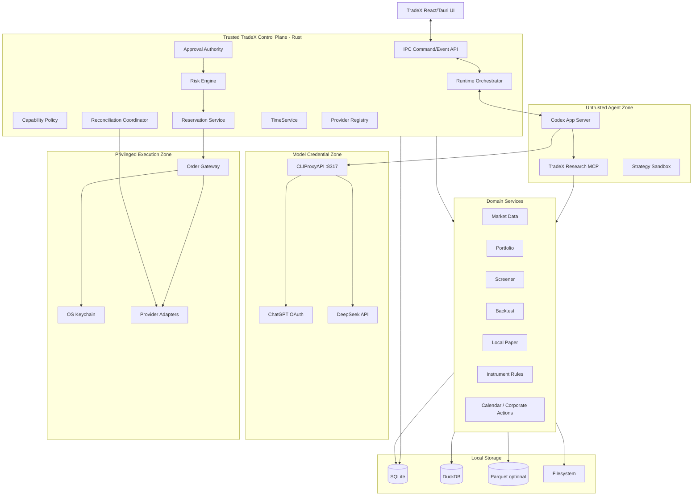

# TradeX Backend Architecture Requirements & Design (ARD)

**Contract clarification date:** 2026-09-05 (RevC); S18 account-deletion contract added 2026-09-23. Prototype behavior is evidence only, subject to the QA Report defects and pending gates.

**Version:** v1.0 Revision C (RevC)  
**Status:** Engineering baseline  
**Scope:** Local backend / control plane / agent runtime integration / domain services / execution boundary  
**Primary implementation:** Rust control plane with local sidecars/processes where justified  
**Source baseline:** `TradeX_PRD_v1.0_RevC.md`, `TradeX_UI_Prototype_Spec_v1.0_RevC.md`; prototype observations are recorded separately in the QA Report\
**Language:** English

> This ARD translates the RevC product requirements into an implementable backend architecture. Safety semantics, product state, provider scope, and storage responsibilities come from the RevC PRD. Concrete process boundaries, service decomposition, persistence patterns, command/event contracts, concurrency controls, and adapter patterns below are architectural decisions for implementation.

---

## 1. Purpose

The TradeX backend is the trusted local control plane behind the desktop workspace. It integrates Codex App Server for agent execution, CLIProxyAPI for model routing, local domain services for research/backtesting, and isolated broker/exchange adapters for account access and execution.

Its core responsibility is to ensure that an agent can research and propose financial actions without becoming the authority that can execute them.

The backend must:

- supervise local runtime dependencies;
- persist Thread / Turn / Item provenance;
- expose typed domain tools to the agent;
- normalize instruments, accounts, orders, market data, and provider capabilities;
- manage account-scoped live arming;
- evaluate deterministic risk;
- issue and validate TradeX financial approvals;
- reserve account capacity atomically;
- isolate the privileged Order Gateway and credentials;
- reconcile broker state and recover safely from ambiguity, restart, sleep, disconnect, and rate limits;
- maintain local auditability and data provenance.

---

## 2. Architectural Drivers

### 2.1 Safety drivers

1. The model cannot access raw broker secrets.
2. Codex/agent runtime cannot directly call the privileged Order Gateway.
3. Generic Codex approvals cannot authorize financial execution.
4. Live approvals are proposal/account/action-bound, short-lived, and single-use.
5. Broker/exchange state is authoritative for live orders, positions, and fills.
6. No blind retry after ambiguous non-idempotent order submission.
7. Live account arming is account-scoped and resets on safety triggers.
8. Reservations are atomic per account across concurrent threads.
9. Stale market data or unacceptable clock uncertainty fails closed for live authority decisions.
10. Dangerous credential permissions block live readiness.

### 2.2 Runtime drivers

- Codex App Server is pinned and compatibility-tested.
- CLIProxyAPI is pinned, locally supervised, and is the only LLM egress path.
- Control-plane trading/reconciliation operations continue even if model inference is unavailable.
- Local persistence is the default; external telemetry is opt-in.

### 2.3 Data drivers

- SQLite owns transactional/domain state and financial audit.
- DuckDB owns persistent analytical/historical data for the MVP.
- Parquet is optional for large immutable datasets/interchange.
- Filesystem stores artifacts, strategies, exports, backups, and datasets.
- Secrets are excluded from all ordinary workspace stores.

---

## 3. Backend System Context


```mermaid
flowchart TD
    UI[TradeX React/Tauri UI]

    subgraph CP[Trusted TradeX Control Plane - Rust]
      API[IPC Command/Event API]
      ORCH[Runtime Orchestrator]
      CAP[Capability Policy]
      RISK[Risk Engine]
      APPR[Approval Authority]
      RES[Reservation Service]
      REC[Reconciliation Coordinator]
      TIME[TimeService]
      PROV[Provider Registry]
    end

    subgraph AGENT[Untrusted Agent Zone]
      COD[Codex App Server]
      MCP[TradeX Research MCP]
      SBX[Strategy Sandbox]
    end

    subgraph MODEL[Model Credential Zone]
      CLIP[CLIProxyAPI :8317]
      CHAT[ChatGPT OAuth]
      DS[DeepSeek API]
    end

    subgraph DOMAIN[Domain Services]
      MKT[Market Data]
      PORT[Portfolio]
      SCR[Screener]
      BT[Backtest]
      PAPER[Local Paper]
      INST[Instrument Rules]
      CAL[Calendar / Corporate Actions]
    end

    subgraph EXEC[Privileged Execution Zone]
      GW[Order Gateway]
      KEY[OS Keychain]
      ADP[Provider Adapters]
    end

    subgraph STORE[Local Storage]
      SQL[(SQLite)]
      DUCK[(DuckDB)]
      PQ[(Parquet optional)]
      FS[Filesystem]
    end

    UI <--> API
    API <--> ORCH
    ORCH <--> COD
    COD --> MCP
    COD --> CLIP
    CLIP --> CHAT
    CLIP --> DS

    MCP --> DOMAIN
    CP --> DOMAIN

    APPR --> RISK
    RISK --> RES
    RES --> GW
    GW --> KEY
    GW --> ADP
    REC --> ADP

    CP --> SQL
    DOMAIN --> SQL
    DOMAIN --> DUCK
    DOMAIN --> PQ
    DOMAIN --> FS
```

---

## 4. Trust Zones and Process Boundaries

TradeX implements four security-relevant zones.

### 4.1 Untrusted Agent Zone

Contains:

- Codex App Server;
- TradeX research MCP/tool process;
- strategy sandbox;
- workspace research files.

This zone may read approved context and create proposals/signals, but receives no broker credentials or direct execution capability.

### 4.2 Trusted Control Plane

Contains financial authority logic:

- capability policy;
- account arming state;
- risk engine;
- approval authority;
- reservations;
- reconciliation coordination;
- provider capability/health state;
- TimeService;
- persistence transactions.

### 4.3 Privileged Execution Zone

Contains:

- OS keychain access;
- provider request signing/authentication;
- ExecutionAdapter implementations;
- Order Gateway.

Only a validated, approved, reserved execution intent may cross into this zone.

### 4.4 Model Credential Zone

Contains CLIProxyAPI and model credentials only:

- ChatGPT OAuth tokens in sidecar auth directory;
- DeepSeek API key rendered into sidecar configuration by Rust at launch.

Broker credentials must never enter this zone.

---

## 5. Local Process Topology

Recommended v1.0 topology:

```text
tradex-desktop (Tauri/Rust main process)
 ├─ React webview
 ├─ embedded/control-plane Rust services
 ├─ child: order-gateway [privileged execution; private IPC only]
 ├─ child: codex-app-server [pinned]
 ├─ child: cliproxyapi [pinned, localhost:8317]
 ├─ child: research-mcp (Rust or Python, restricted contract)
 └─ child: strategy/backtest worker(s) [restricted]
```

### 5.1 Process supervision

The Rust main process owns child lifecycle:

- deterministic startup order;
- version verification;
- health checks;
- restart with capped exponential backoff;
- stdout/stderr redaction;
- shutdown coordination;
- crash event persistence.

### 5.2 Startup order

Recommended sequence:

```text
open/migrate SQLite
→ load settings + provider metadata
→ initialize TimeService
→ initialize domain services + durable event/authority store
→ start/authenticate Order Gateway (new mutations disabled)
→ restore account metadata
→ reconcile all live/open-order accounts
→ expose live execution readiness only for healthy accounts
→ require explicit per-account arming before new Live mutations
```

After domain initialization, start CLIProxyAPI → probe `/v1/models` → start Codex App Server as an independent, bounded-backoff branch. Model startup failures must not block order queries, reconciliation, account disarming, or the execution control plane. Agent turns become available only when their selected model route is healthy; the workspace may display history and recovery controls earlier.

### 5.3 Order Gateway process boundary

The separate child process is mandatory (PRD OD-009); a module inside the desktop process does not satisfy this boundary. “Privileged” means exclusive trading/credential capabilities, not root/administrator execution. The parent pins/verifies its binary and supervises health, bounded restart, redacted logs, and shutdown.

Use a dedicated inherited duplex IPC channel, framed with message lengths and a startup protocol-version handshake. The parent retains the only peer handle; never expose a listening TCP endpoint or pass this handle to the webview, Codex, CLIProxyAPI, research, or strategy workers. Authenticate each new child session with a random session credential sent through the inherited channel, never command-line arguments, logs, or ordinary workspace files. Reject an incompatible protocol before accepting requests.

The Gateway retrieves authoritative immutable objects through the authenticated control-plane channel; it does not become a second SQLite writer. Only its provider signing layer resolves execution credential references. Neither model credentials nor arbitrary frontend/agent order fields enter a Gateway request. Gateway failure disarms affected Live accounts, stops undispatched work, and reconciles every attempt that might have reached a provider before allowing explicit re-arming. Restarting the child never replays an order mutation automatically.

Agent workspace may become partially usable before broker reconciliation completes, but live execution remains blocked until the affected account is healthy.

---

## 6. Backend Module Decomposition

Recommended Rust workspace:

```text
crates/
  tradex-app/                 # Tauri application/bootstrap
  tradex-api/                 # IPC command/event schemas
  tradex-domain/              # canonical domain types
  tradex-runtime/             # Codex + CLIProxy supervision
  tradex-thread/              # Thread/Turn/Item persistence/orchestration
  tradex-capability/          # Agent Mode / Execution Context policy
  tradex-market/              # market data normalization
  tradex-instruments/         # canonical instruments/rules/calendar
  tradex-portfolio/           # balances/positions/valuation
  tradex-risk/                # deterministic risk engine
  tradex-approval/            # financial approval authority
  tradex-reservation/         # atomic execution reservations
  tradex-execution/           # Order Gateway
  tradex-reconciliation/      # broker-state convergence
  tradex-provider-core/       # provider schemas/capabilities/errors
  tradex-provider-alpaca/
  tradex-provider-t212/
  tradex-provider-binance/
  tradex-provider-bitget/
  tradex-storage/             # SQLite/DuckDB/filesystem
  tradex-observability/
  tradex-security/            # redaction, keychain abstractions
```

Python workers may be used for quant/scientific workloads, but financial authority remains in Rust.

---

## 7. Canonical Domain Model

### 7.1 Identity rules

Domain logic uses stable canonical IDs:

```text
workspace_id
thread_id
turn_id
account_id
instrument_id
proposal_id
approval_id
reservation_id
execution_attempt_id
provider_order_id
market_snapshot_id
policy_version
```

Provider-specific symbols/IDs remain adapter mappings.

### 7.2 Instrument examples

```yaml
instrument_id: equity:US:AAPL
asset_class: EQUITY
exchange: XNAS
currency: USD
providers:
  alpaca: AAPL
  trading212: provider_specific_id
```

```yaml
instrument_id: crypto:BTC/USDT:spot
asset_class: CRYPTO_SPOT
base: BTC
quote: USDT
providers:
  binance: BTCUSDT
  bitget: BTCUSDT
```

### 7.3 Decimal arithmetic

Price, quantity, notional, fees, FX conversion, and risk calculations use decimal-safe types. Binary floating point is prohibited in financial authority logic.

### 7.4 Quantity semantics

```rust
enum OrderQuantity {
    Base(Decimal),
    Quote(Decimal),
    Notional(Decimal),
}
```

Adapters convert explicitly according to provider capabilities and instrument rules.

---

## 8. Thread / Turn / Item Runtime Architecture

### 8.1 Persistent Thread

Stores navigation/default context only:

```text
workspace_id
codex_thread_id
title
created_at
updated_at
default_agent_mode
linked_accounts[]
linked_instruments[]
linked_strategies[]
linked_artifacts[]
```

### 8.2 Immutable Turn snapshot

At turn start, persist:

```text
turn_id
agent_mode_at_start
selected_account_id?
execution_context_at_start
capability_level_at_start
model_id
model_provider
attached_context_ids[]
attached_context_hashes[]
started_at
```

This snapshot is immutable after the turn starts. Provider attempts and completion time belong to append-only Turn lifecycle events outside the start snapshot; the displayed historical model/context must not be read from current workspace defaults.

### 8.3 Runtime adapter

`tradex-runtime` maps Codex protocol events into TradeX domain items so product logic does not depend directly on unstable protocol details.

```text
Codex JSON-RPC/JSONL
→ RuntimeProtocolAdapter
→ TradeX TurnEvent / ItemEvent
→ persistence
→ UI domain event
```

### 8.4 Generic approval isolation

Codex approval events may pause/resume a turn, but are stored distinctly from `FinancialApproval`. No code path may coerce one into the other.

---

## 9. Agent Mode, Execution Context, and Capability Policy

### 9.1 Agent Mode

```text
ASK
RESEARCH
BACKTEST
TRADE
```

### 9.2 Execution Context

```text
NONE_READ_ONLY
HISTORICAL_SIMULATION
LOCAL_PAPER
ALPACA_PAPER
TRADING212_DEMO
TRADING212_LIVE
BINANCE_TESTNET
BINANCE_LIVE
BITGET_DEMO
BITGET_LIVE
```

### 9.3 Capability policy service

The policy service returns permitted tool capabilities for a specific turn snapshot.

```rust
struct CapabilityDecision {
    level: CapabilityLevel,
    allowed_tools: Vec<ToolId>,
    execution_allowed: bool,
    reason: Option<String>,
}
```

Rules:

- Ask/Research never receive current-market execution tools;
- Backtest receives historical simulation only;
- Trade + Paper/Demo/Testnet may receive C3 execution tools;
- Trade + Live may reach proposal capability C4;
- C5 is not a standing tool grant; it exists only when a valid transaction-specific approval is consumed inside the control plane;
- C6 is unsupported.

---

## 10. LLM Runtime Architecture

### 10.1 Single egress

All model inference goes through:

```text
127.0.0.1:8317 → CLIProxyAPI
```

Direct external LLM calls from TradeX, Codex, research tools, or strategy code are prohibited.

### 10.2 CLIProxyAPI supervision

Backend responsibilities:

- verify pinned binary/version;
- allocate/verify port 8317;
- launch sidecar;
- inject only model credentials/config;
- probe `/v1/models`;
- classify stopped/port-conflict/unauthorized states;
- restart with backoff where appropriate;
- clear rendered DeepSeek configuration on exit.

### 10.3 Provider routing

V1.0 providers:

- ChatGPT subscription OAuth → GPT-5.6 series;
- DeepSeek official API → `deepseek-v4-flash`, explicitly using `thinking.type: disabled` or `thinking.type: enabled`.

The selected thinking mode is part of the immutable route/attempt snapshot and audit alongside the real model ID. Always send the explicit mode through CLIProxyAPI; do not rely on the upstream default or disguise either mode as a retired model name. This user-approved model-name clarification does not add a provider or relax the single-egress or financial guards.

Cross-provider automatic fallback is OFF by default.

### 10.4 Provider attempt audit

Every attempt persists:

```text
turn_id
attempt_no
model_id
provider
started_at
ended_at
result
error_category?
quota_metadata?
```

If opt-in automatic fallback occurs, both attempts remain visible and auditable. Provider switch never changes financial capability state.

### 10.5 Model failure independence

`MODEL_UNAVAILABLE`, `OAUTH_EXPIRED`, or `QUOTA_EXCEEDED` may block new agent turns, but must not stop:

- live order monitoring;
- cancellation already in trusted control-plane flow;
- reconciliation;
- account health processing;
- audit persistence.

---

## 11. Provider Registry and Schema-driven Connection Model

### 11.1 Provider definition

Each integration exposes metadata:

```rust
struct ProviderDefinition {
    provider_id: ProviderId,
    display_name: String,
    environments: Vec<Environment>,
    credential_schema: CredentialSchema,
    capability_schema: CapabilitySchema,
    permission_rules: PermissionRules,
}
```

### 11.2 Credential schema

Schema describes:

- fields;
- sensitivity;
- required/optional status;
- environment applicability;
- help text;
- validation behavior.

The backend never assumes every broker has the same `API Key + Secret` model.

### 11.3 Secure connection sequence

```text
UI submits secret fields through privileged Tauri command
→ Rust validates shape
→ write secret to OS keychain
→ persist only credential reference metadata
→ adapter probes provider
→ discover permissions/capabilities
→ apply dangerous-permission safety gate
→ persist non-secret health/capability metadata
→ return sanitized account connection result
```

### 11.4 Permission gate

Live readiness is blocked if detected permissions include:

- withdrawal;
- transfer;
- custody authority;
- unsupported margin/leverage-management authority.

If permission introspection is unavailable, mark `UNVERIFIED`, require user acknowledgement, and keep it visible in account health.

---

## 12. Broker Adapter Architecture

Use small, capability-specific interfaces rather than one oversized abstraction.

```rust
trait AccountAdapter { /* balances, positions, orders */ }
trait ExecutionAdapter { /* place/cancel/query execution */ }
trait MarketDataAdapter { /* quotes/bars/book + instrument metadata */ }
trait AccountStreamAdapter { /* private account/order stream */ }
```

### 12.1 Capability discovery

```rust
struct BrokerCapabilities {
    account_read: bool,
    position_read: bool,
    public_market_data: bool,
    private_account_stream: bool,
    order_types: Vec<OrderType>,
    fractional_quantity: bool,
    notional_orders: bool,
    extended_hours: bool,
    client_order_id: bool,
    paper_environment: bool,
    live_environment: bool,
}
```

Additional capability metadata should include TIF, min notional, post-only/venue constraints, cancellation behavior, and provider-specific limits where supported.

### 12.2 Provider-specific adapters

V1.0 target integrations:

- Alpaca Paper;
- Trading 212 Demo / Live;
- Binance Testnet / Spot Live;
- Bitget Demo / Spot Live.

Adapters map canonical orders into provider requests and provider states back into normalized TradeX states.

### 12.3 Adapter error normalization

Provider errors map into the canonical taxonomy and preserve raw provider code/message in redacted diagnostic metadata.

---

## 13. Market Data Architecture

### 13.1 Separation from execution

Market data and broker execution are separate service contracts. A broker adapter may provide market data, but domain code must not assume it is complete or execution-grade.

### 13.2 Subscription/access tiers

```text
Census — broad coarse universe/on-demand
Warm   — watchlists/candidates periodic refresh
Hot    — currently viewed/monitored active stream
Cold   — persisted historical/backtest data
```

MVP uses Hot active subscriptions plus on-demand/coarse watchlist/universe refresh. It does not maintain always-on tick subscriptions for the full universe.

### 13.3 Market snapshot

```rust
struct MarketSnapshot {
    id: MarketSnapshotId,
    instrument_id: InstrumentId,
    source: String,
    venue: Option<String>,
    provider_timestamp: DateTime<Utc>,
    received_timestamp: DateTime<Utc>,
    entitlement: Entitlement,
    freshness: FreshnessState,
    payload: MarketPayload,
}
```

Every live authority decision references a persisted snapshot ID.

### 13.4 Entitlement metadata

Each provider integration declares:

- realtime/delayed status;
- local retention limits;
- redistribution restrictions;
- commercial constraints;
- jurisdictions where relevant.

---

## 14. TimeService

TimeService provides consistent semantics for:

- quote age;
- approval TTL;
- reconciliation deadlines;
- event ordering;
- provider timestamp offset.

### 14.1 Data model

Track both wall-clock and monotonic time. Detect:

- significant wall-clock jump;
- system resume discontinuity;
- provider/server offset outside tolerance;
- uncertain quote age.

### 14.2 Fail-closed rule

When TimeService marks timing confidence below the configured live threshold:

- no new live approval is valid;
- pre-execution freshness/TTL checks fail;
- account/execution surfaces receive a clock/freshness blocking state;
- monitoring/reconciliation continues.

---

## 15. Instrument Rules, Calendar, and Corporate Actions

### 15.1 InstrumentRulesService

Maintains venue/provider-specific constraints:

- tick size;
- price/quantity precision;
- minimum/maximum quantity;
- minimum/maximum notional;
- allowed order types;
- market-order constraints;
- trading status.

Validation sequence:

```text
normalized order
→ InstrumentRulesService
→ deterministic risk
→ approval
→ pre-execution revalidation
→ provider adapter
```

### 15.2 MarketCalendarService

For equities:

- holidays;
- half days;
- sessions;
- extended-hours state;
- open/close timestamps;
- halts.

### 15.3 CorporateActionsService

Tracks:

- splits;
- dividends;
- symbol changes;
- delistings;
- historical adjustment metadata.

`MARKET_CLOSED` and `INSTRUMENT_HALTED` are deterministic blocking states where execution is unsupported.

---

## 16. Portfolio and Valuation Architecture

### 16.1 Broker truth

Balances, positions, open orders, and fills originate from provider state and are normalized into local projections.

### 16.2 Workspace base currency

Portfolio aggregation uses a configured base currency.

### 16.3 FX/stablecoin conversion

Conversion records:

```text
source
pair/path
provider timestamp
TradeX received timestamp
freshness
quality/depeg state
```

Never assume `USDT = USD` or stablecoin parity.

If conversion quality is unreliable and live risk depends on the normalized value, execution must fail closed.

---

## 17. Deterministic Risk Engine

The Risk Engine is independent of the model.

### 17.1 Inputs

Risk evaluation consumes immutable snapshots/references:

- account state;
- normalized order proposal;
- instrument rules;
- current market snapshot;
- policy version;
- portfolio/exposure state;
- open orders;
- active reservations;
- daily execution counters;
- market/calendar status;
- valuation provenance where required.

### 17.2 User-configurable policy

Supports controls such as:

- maximum order notional/quantity;
- position/concentration limits;
- asset-class exposure;
- daily traded notional/loss;
- max open orders;
- max reserved capital;
- allowed/blocked instruments/venues/accounts;
- market-order enablement and slippage limits;
- price deviation;
- stale-price threshold;
- environment constraints.

The agent cannot modify policy.

### 17.3 Hard safety rules

System-enforced and not user-bypassable:

- approval binding;
- duplicate-order protection;
- decimal/precision validation;
- instrument-rule validation;
- authoritative reconciliation;
- unhealthy-account block;
- stale snapshot block;
- reservation correctness;
- no blind retry after ambiguity;
- Order Gateway isolation.

### 17.4 Risk result

```rust
struct RiskDecision {
    decision_id: DecisionId,
    workspace_id: WorkspaceId,
    proposal_id: ProposalId,
    proposal_hash: Sha256,
    account_id: Option<AccountId>,
    environment: ExecutionContext,
    policy_version: Option<PolicyVersion>,
    policy_state_version: Option<StateVersion>,
    status: RiskDecisionStatus, // ALLOWED | REJECTED | UNAVAILABLE
    state_version: StateVersion,
    inputs: Vec<RiskDecisionInputReference>,
    checks: Vec<RiskCheckResult>,
    evaluated_at: DateTime<Utc>,
}
```

Each input reference carries its kind, bounded reference ID, SHA-256 digest, and optional observed time. Each check carries a stable ID, `PASS` / `REJECT` / `UNAVAILABLE`, reason code, and sanitized explanation. A rejection takes precedence; with no rejection, any unavailable check makes the decision unavailable. Null policy limits are explicitly `LIMIT_NOT_CONFIGURED`; missing evidence for a configured limit is never converted to zero.

Input digests cover canonical material evidence rather than read-time metadata. They exclude policy update time, portfolio collection/row observation times and FX receipt time, market instrument/session observation times, and moving wall-clock/monotonic samples. Account and policy state, portfolio values/holdings/open orders/fills, quote identity/prices/source/venue/entitlement/freshness, and time confidence/provider offset remain bound. Quote `providerTimestamp`, `receivedTimestamp`, and market-state `providerTime` are parsed, converted to UTC, and formatted as canonical RFC3339 before hashing. Revalidation compares these digests and the current checks; quote and instrument-state freshness are separately recomputed against trusted time with full subsecond precision, and future-dated evidence is unavailable.

Persist each decision separately from its proposal as an append-only `risk.decision.evaluated` event, keyed by workspace + proposal and a per-proposal sequence. Re-evaluation adds history and cannot mutate the proposal/hash. The renderer supplies only workspace/proposal IDs; the Control Plane loads policy, exact account, complete workspace portfolio, market/time and existing activity evidence and computes every check. Submission paths re-evaluate through the same evaluator and reject `REJECTED` / `UNAVAILABLE` before an attempt or provider/simulator I/O. Errors are distinct: `RISK_REJECTED` and `RISK_EVIDENCE_UNAVAILABLE`.

Non-local execution requires trusted real-time quote provenance, a trusted clock, an authoritative open market session, and authoritative provider instrument rules. Until the owning adapters produce those inputs, the result remains `UNAVAILABLE`; this slice adds no market, calendar, FX, fills, reservation, or provider-rule collection. A policy result is not financial approval, arming, reservation, or gateway authorization. Ordinary Bitget `LIVE` maps to `RiskPolicyEnvironment::Live`; this decision path makes no provider request and offers no Bitget Demo or Live write authority.

---

## 18. Risk Policy Versioning and Serialization

The `risk` aggregate owns one workspace-shared policy. The persisted account bindings in that workspace define the affected set; UI selection is never an input to policy scope.

Save flow:

```text
begin a workspace SQLite immediate transaction and verify policy/account/proposal versions
→ persist new policy version
→ re-evaluate every pending proposal against the new policy
→ append `POLICY_CHANGED` to each pending proposal bound to the old version
→ persist `POLICY_VERSION_STALE` decisions and audit projections
→ if any field relaxed: DISARM every affected Live account
→ commit
```

`weakened` is true when any changed field relaxes a constraint, including a mixed tightening/relaxation; a tightening-only change is false. Increased/unset maximum limits, expanded allow-lists, removed block-list entries, enabling market orders, and increased staleness/inactivity thresholds are relaxations. Policy, account-set, and proposal-state versions are rechecked before commit so concurrent stale writes fail without partial effects. The `risk.policy.changed` event, optional account disarm events, proposal invalidations, and RiskDecisions commit atomically.

The reusable `POLICY_VERSION` eligibility check rejects an old-version proposal with `POLICY_VERSION_STALE`; S22 approval eligibility consumes the same predicate. S23 owns atomic approval consumption/reservation serialization with policy save. Current persisted Live accounts are DISARMED by invariant; any later ARMED account in scope is set to DISARMED in the weakening transaction.

---

## 19. Order Draft and Immutable Proposal Service

### 19.1 Draft

`OrderDraft` may change freely and carries no authority.

### 19.2 Proposal generation

```text
OrderDraft
→ normalize canonical order
→ validate instrument/provider capability
→ capture market_snapshot_id where needed
→ bind policy_version
→ generate proposal_id
→ canonical serialize
→ SHA-256 proposal_hash
→ persist immutable OrderProposal
```

### 19.3 Material edit

Any material edit creates a new proposal ID/hash. Old approvals become unusable but remain in audit history.

### 19.4 Canonical serialization

Hashing must use a deterministic serialization format with explicit decimal/string normalization, field ordering, instrument/account identity, environment, TIF, and quantity semantics.

---

## 20. Financial Approval Authority

A `FinancialApproval` is separate from Codex approval.

### 20.1 Approval payload

```rust
struct FinancialApproval {
    approval_id: ApprovalId,
    intent: ApprovedFinancialIntent,
    account_id: AccountId,
    operation: FinancialOperation,
    policy_version: PolicyVersion,
    issued_at: DateTime<Utc>,
    expires_at: DateTime<Utc>,
    nonce: String,
    consumed_at: Option<DateTime<Utc>>,
}
```

ApprovedFinancialIntent is a tagged union: PLACE_ORDER binds proposal_id/proposal_hash; CANCEL binds cancellation_intent_id/intent_hash. The operation must match the tag, account, and immutable intent. A cancellation approval cannot authorize an order creation.

### 20.2 Properties

- proposal-bound;
- account-bound;
- operation-bound;
- short-lived;
- single-use;
- invalidated on material order change;
- invalidated on relevant policy change;
- invalid when market snapshot/clock conditions no longer satisfy execution checks.

An approval review is not an approval. `trade.request_approval` returns a backend-built review bound to the current immutable proposal and an `ALLOWED` RiskDecision. It includes the provider/account/LIVE identity, proposal fields, full available quote provenance, quote age calculated from the trusted review time and TradeX received timestamp, and risk checks. BUY orders show expected spend; SELL orders show expected proceeds; both show the maximum authorized amount. For market orders, the backend compares expected value to the maximum using exact decimal arithmetic; a value above the cap makes the review ineligible and `trade.approve` cannot issue it. Estimated fees and slippage are optional trusted estimates and remain explicitly unavailable when no estimator supplies them. The review's RiskDecision ID is only a compare-and-revalidate token, never authority supplied by the renderer. `trade.approve` re-reads and re-evaluates all inputs and issues only if the user-reviewed proposal and evidence remain unchanged. The native UI may issue it only from an explicit Approve action; generic Codex approval, Enter, and Agent requests are not approval actions.

The issued approval binds the workspace, immutable proposal ID/hash, Live account and environment, `PLACE_ORDER`, policy version, the reviewed evidence digest, and the single explicit approval action. The backend sets its ID, nonce, issue time, and expiry. Its initial lifetime is at most 30 seconds and uses trusted `TimeService`; an untrusted clock blocks issuance and expires/invalidate checks fail closed. The review and approval history contains sanitized reasons and evidence references only, never credentials, signatures, or raw provider bodies.

An explicit Reject records a durable `USER_REJECTED` audit action and does not create a `FinancialApproval`. Edits/refreshes, account disarm or health changes, policy or material RiskDecision/quote changes, untrusted time, and expiry durably invalidate an issued approval. A later `trade.approval.list` read also performs the current backend validity check, so non-streamed quote or clock changes are recorded before the approval is shown as current or used.

### 20.3 Approval consumption

Approval issuance in S22 does not consume the approval or create a reservation. S23 owns transactional consumption with pre-execution validation and reservation creation. A consumed approval cannot be reused.

---

## 21. Account-scoped Live Arming

Persist live arming as account-specific control-plane state.

```text
account A: DISARMED/ARMED
account B: DISARMED/ARMED
account C: DISARMED/ARMED
```

### 21.1 Arm requirements

Before accepting `ARM`:

- account connection healthy;
- reconciliation complete;
- credential/permission state acceptable;
- provider capability supports Live;
- no blocking recovery state;
- user action explicitly targets that account.

### 21.2 Automatic disarm triggers

Disarm affected account on:

- application restart;
- OS sleep/session lock;
- on macOS, `NSApplicationDidResignActiveNotification`; treat every app deactivation as `SESSION_INACTIVE`, including ordinary app switches, so a lock-screen transition to loginwindow fails closed;
- credential change;
- account health degradation;
- reconciliation failure;
- failed relevant pre-execution state;
- risk-policy weakening;
- configured inactivity timeout.

### 21.3 Global Disable All

One control-plane operation atomically sets all live account arming states to DISARMED and appends audit events.

Application restart, OS sleep/session lock, and Disable All affect every Live account. Credential/health failures affect the identified account; a shared policy change affects every account bound to that policy version. Selection in the UI never determines the scope.

Disable All also revokes undispatched execution grants. A `RESERVED` attempt stopped before the trusted dispatch boundary is invalidated and its reservation released under PRD §45. An attempt already handed to provider I/O retains its reservation and is reconciled; Disable All is not an implicit broker cancellation. Re-arming never restores an old approval or dispatch grant.

---

## 22. Execution Reservation Service

Reservations prevent concurrent threads from double-consuming capacity.

### 22.1 Effective capacity

Adapters normalize provider capacity before Risk calculations:

```text
gross provider balance
- provider open-order commitment (only when the adapter reports gross balance)
= normalized provider available

normalized provider available
- active reservations
- submitted-but-unconfirmed exposure
± pending cancellation rules
= effective available capacity
```

When an adapter already reports free/available-to-trade capacity, that value is already net of provider commitments. The backend still exposes the committed amount and its source for explanation, but never subtracts it a second time. Capacity evidence is bound to the account state version and observation timestamp; stale or unavailable evidence has no amount fields.

### 22.2 Atomicity model

Use per-account serialization, implemented through a SQLite immediate transaction plus the application's serialized Control Plane command queue. Preparation, shared-policy save, account disarm/Disable All, and trusted-time expiry use this same write boundary; whichever operation commits first determines whether preparation is rejected or the still-`RESERVED` attempt is stopped.

The database transaction is the correctness boundary; the in-memory lock is a contention optimization, not the only safety mechanism.

### 22.3 Reservation lifecycle

The explicit `trade.execution.prepare` action remains the only public PLACE/CANCEL authority entry point. For Live PLACE, one SQLite immediate transaction revalidates the exact proposal and account, consumes the approval and proposal, creates the exact capacity reservation and `RESERVED` attempt, and commits their audit/outbox records. For Live CANCEL, the same command revalidates the approved immutable intent, provider order identity, account snapshot/evidence, policy, and remaining quantity, then consumes only the cancellation approval and saves a `RESERVED` attempt with no new reservation. After that transaction commits, the Control Plane internally starts the isolated Order Gateway. The Gateway obtains a one-use grant only after current authority is revalidated, and provider I/O is allowed only after `SUBMITTING` and its audit/outbox record are durable. Existing order commitment remains until authoritative provider evidence resolves cancellation or a fill race. A shared policy change, account disarm/Disable All, or trusted approval TTL expiry that wins before `SUBMITTING` atomically invalidates the attempt; an active PLACE reservation transitions to `RELEASED` exactly once. A consumed approval remains consumed for audit, and same-key replay never re-sends. After a lost response or restart, `trade.execution.preparation.get` reads the durable attempt and its active or released PLACE reservation by workspace and approval identity.

```text
PLACE: APPROVED → RESERVED (exact reservation) → SUBMITTING
       → ACCEPTED / REJECTED / UNKNOWN_RECONCILING
       → adjust/release only from authoritative resolution
CANCEL: APPROVED → RESERVED (no new reservation) → SUBMITTING
        → CANCEL_PENDING / REJECTED / UNKNOWN_RECONCILING
        → provider-confirmed terminal state or fill race

If a stop wins before SUBMITTING: RESERVED → INVALIDATED (STOPPED_BEFORE_DISPATCH);
                                 active PLACE reservation → RELEASED
```

### 22.4 Unknown state

`UNKNOWN_RECONCILING` freezes reservation capacity. It cannot be auto-released after timeout.

The guarded expiry/release table in PRD §45 is normative. Approval expiry after possible transmission changes only the approval record. Provider terminal evidence adjusts for cumulative fills/fees before releasing the unused remainder; cancellation acknowledgement alone cannot release it. Persist the evidence reference, previous state, release amount, and resulting account state in the same transaction as the reservation disposition.

---

## 23. Pre-approval and Pre-execution Validation Pipeline

### 23.1 Pre-approval

```text
proposal immutable?
→ account/environment compatibility
→ account health
→ arming state for Live
→ provider capability
→ instrument rules
→ market/calendar state
→ market snapshot freshness/entitlement
→ TimeService confidence
→ deterministic risk
→ reservation capacity preview
→ approval request eligibility
```

### 23.2 Pre-execution

Before an attempt can enter the later S24 broker-dispatch boundary:

```text
approval valid + unconsumed?
→ proposal hash matches?
→ policy version unchanged?
→ account still ARMED?
→ account healthy/reconciled?
→ quote still fresh?
→ TimeService trusted?
→ cash/positions/open orders refreshed as policy requires?
→ reservation created atomically
→ consume approval
→ consume proposal
→ transition RESERVED
→ after commit, Control Plane starts the Order Gateway internally
→ Gateway may record SUBMITTING only after fresh revalidation; provider mutation follows that commit
```

A material failure invalidates or rejects the flow and requires refreshed user consent where necessary.

---

## 24. Privileged Order Gateway

### 24.1 Responsibility

The Order Gateway is the only component allowed to perform live provider mutations.

It accepts a narrow internal request containing validated identifiers, not free-form agent input.

```rust
struct GatewayExecutionRequest {
    execution_attempt_id: ExecutionAttemptId,
    intent_id: FinancialIntentId,
    operation: FinancialOperation,
    approval_id: ApprovalId,
    reservation_id: Option<ReservationId>,
    account_id: AccountId,
}
```

Gateway reloads authoritative proposal/account data inside the privileged boundary rather than trusting duplicated mutable fields from the caller.

The intent_id resolves to an immutable OrderProposal for PLACE_ORDER or CancellationIntent for CANCEL. A reservation_id is mandatory for new orders; cancellation may reference an existing reservation but never creates a new purchase reservation merely to cancel.

### 24.1.1 Dispatch ownership and failure boundary

1. The explicit `trade.execution.prepare` action consumes the proposal/approval and atomically persists the `RESERVED` attempt, PLACE reservation when applicable, audit, and outbox under account/policy serialization. After commit, the Control Plane starts the Gateway internally; the Gateway reloads that durable state.
2. The Gateway requests a one-use dispatch grant for that attempt over the private channel. Under the same serialization used by disarm/policy-save, the control plane rechecks arming, health, permissions, policy, proposal identity, market/clock/FX eligibility and current reservation; it records the grant before replying.
3. The Gateway serializes dispatch and revocation per account, confirms the grant is current, and records a durable `SUBMITTING` intent through the control plane immediately before provider I/O. A disable acknowledged before this boundary prevents I/O. Once the boundary is crossed, cancellation of local work cannot prove absence at the provider.
4. If a stop wins before `SUBMITTING`, revoke the grant, persist `STOPPED_BEFORE_DISPATCH`/invalidation, make no provider mutation, and release an active PLACE reservation exactly once. If `SUBMITTING` commits first, persist `MAY_HAVE_SUBMITTED`, retain capacity, and never replay POST/DELETE or claim that local cancellation prevented the request. A lost or uncertain result after this boundary remains `UNKNOWN_RECONCILING` for later reconciliation.

Disable All returns per-account disarm state and per-attempt STOPPED_BEFORE_DISPATCH or MAY_HAVE_SUBMITTED disposition. The former requires an acknowledged Gateway revocation before its dispatch boundary; an unreachable Gateway yields the latter and retains capacity. These are dispatch dispositions, not new broker order states.

The grant binds the execution attempt, account, operation, proposal/hash, approval, reservation where applicable, and authority version. The existing execution attempt ID deduplicates requests; a transport request ID alone is not financial idempotency. Gateway and control-plane restarts invalidate grants and preserve attempts for reconciliation.

### 24.2 Keychain access

Credentials are read only inside the provider signing/execution layer and never returned to the caller.

### 24.3 Network isolation

Only provider adapters need outbound broker/exchange access for privileged operations. Agent/strategy processes do not receive this capability.

---

## 25. Idempotency and Submission Semantics

### 25.1 Internal identity

Each execution has a durable `execution_attempt_id` and, where the provider supports it, a provider `client_order_id` derived from a stable TradeX identifier. Persist that provider identity on the execution attempt before submission. Binance uses `tx-{execution_attempt_id without hyphens}` and sends that saved value as `newClientOrderId` / `origClientOrderId`.

### 25.2 Safe retry classes

- query/read requests: retry with bounded backoff where safe;
- idempotent provider mutations: retry only according to provider contract;
- non-idempotent order POST after ambiguous timeout: **never blindly retry**.

### 25.3 Ambiguous timeout

If the network outcome is unknown:

```text
SUBMITTING
→ SUBMISSION_AMBIGUOUS
→ UNKNOWN_RECONCILING
→ query provider using client order ID / account orders / time-symbol-side fingerprints
```

Reservation remains frozen until evidence resolves the state.

---

## 26. Reconciliation Architecture

Reconciliation converges local projections to provider truth.

### 26.1 Triggers

- application startup;
- OS resume;
- private stream disconnect/reconnect;
- ambiguous submission;
- periodic health cycle;
- user-requested refresh;
- restore/import;
- detected state mismatch.

### 26.2 Priority

Rate-limit budgeting prioritizes:

1. ambiguous-order resolution;
2. open live orders;
3. fills/positions/balances needed for execution safety;
4. private stream recovery;
5. research/history traffic.

### 26.3 Reconciliation algorithm

```text
load local unresolved/open execution records
→ fetch authoritative provider state
→ map provider orders/fills to canonical IDs
→ detect missing/changed state
→ append reconciliation events
→ update local projection
→ adjust/release reservations only from resolved truth
→ recompute account health
```

### 26.4 Stream handling

Private WebSocket/account stream is a low-latency signal, not sole truth. REST/query reconciliation repairs missed events.

---

## 27. Manual Resolution

After the bounded automatic reconciliation window (default from PRD: 5 minutes), unresolved submissions remain frozen and the account is unhealthy/disarmed.

Allowed actions:

### 27.1 Confirmed not submitted

Requires provider/account evidence sufficient to establish absence. Then:

- mark execution attempt resolved-not-submitted;
- release reservation transactionally;
- run account reconciliation;
- restore readiness only if health checks pass.

### 27.2 Confirmed submitted

Require/link broker order identity, then reconcile provider state and adjust reservation from truth.

### 27.3 Keep reconciling

Leave reservation frozen and continue query-first resolution.

A user assertion alone cannot make the account healthy/live-ready.

### 27.4 Evidence contract

Manual Resolution submits `{execution_attempt_id, account_id, decision, evidence_ids, broker_order_id?, expected_state_version}`. Decisions are `CONFIRMED_NOT_SUBMITTED`, `CONFIRMED_SUBMITTED`, or `KEEP_RECONCILING`; these are resolution decisions, not new order states. The backend owns sanitized evidence records: provider/account, query scope, query time and coverage window, provider request/reference, outcome, and related broker identity. Missing credentials, incomplete pagination, lagging provider visibility, or an empty single query do not prove absence.

Confirmed submission requires an account-scoped broker identity verified against the intended instrument/action; confirmed non-submission requires an adapter-specific sufficient-absence rule. Unsupported absence proof leaves the only available decision as Keep reconciling. The backend validates evidence and expected state version again at commit; a fill arriving meanwhile wins over stale manual input. The UI can inspect evidence but cannot declare it verified. A successful resolution triggers health revalidation and keeps arming DISARMED until a separate user action.

---

## 28. Order State Machine

Normalized backend order states:

```text
DRAFT
PROPOSED
RISK_REJECTED
NEEDS_APPROVAL
APPROVED
RESERVED
SUBMITTING
ACCEPTED
PARTIALLY_FILLED
FILLED
CANCEL_PENDING
CANCELLED
REJECTED
EXPIRED
UNKNOWN_RECONCILING
```

### 28.1 Transition ownership

- Draft/Proposal: proposal service;
- Risk rejected: Risk Engine;
- Needs approval/Approved and approval expiry: Approval Authority;
- Reserved: Reservation Service;
- Submitting: Order Gateway;
- Accepted/Partial/Filled/Rejected/Cancelled and broker order expiry: provider truth via adapter/reconciliation;
- Unknown reconciling: submission/reconciliation coordinator.

No UI or agent text may write these states directly.

---

## 29. Cancellation Architecture

Cancellation is transaction-specific.

Cancellation intent is immutable and binds `operation=CANCEL`, account/environment, instrument, provider order ID, latest observed order state, cumulative filled/remaining quantity, and provider snapshot time. Arming is a prerequisite that returns to this same cancellation intent, never a create-order approval. After arming, refresh provider state again; changed remaining quantity/state requires a refreshed cancellation intent and new consent. A filled/terminal order cannot be cancelled. Use cancellation eligibility rules: an equity market closed to new orders does not automatically mean the provider forbids cancellation.

Flow:

```text
refresh provider order state
→ verify cancellable state/capability
→ create cancellation intent
→ deterministic safety checks
→ request user cancellation approval
→ consume cancellation approval
→ Order Gateway cancel
→ CANCEL_PENDING
→ reconcile
→ CANCELLED or authoritative terminal state
```

A partial fill before cancellation changes the remaining exposure and reservation adjustment.

V1.0 does not require broker-native amend/replace. Modification is implemented as confirmed cancel followed by a new proposal.

---

## 30. Paper / Demo / Testnet Architecture

### 30.1 Local Paper

Local Paper is a TradeX-owned simulation engine and must be labeled distinctly from broker-hosted environments.

It uses the same normalized order/event domain where practical, but never crosses the Privileged Live Order Gateway.

### 30.2 Provider-hosted non-live environments

Alpaca Paper, Trading 212 Demo, Binance Testnet, and Bitget Demo use provider adapters with explicit non-live environment metadata.

Their lifecycle should normalize into the same order-state model where possible, but Live arming/financial approval requirements do not apply as Live authority gates.

### 30.3 Environment invariant

Environment is immutable on an execution attempt. A Demo/Testnet order cannot become Live by adapter routing or UI state change.

---

## 31. Backtest and Strategy Architecture

### 31.1 Backtest engine

Backtests are local and deterministic. Persist:

- inputs/parameters;
- strategy version/hash;
- dataset hash/provider;
- adjustment/calendar/timezone assumptions;
- commission/slippage model;
- engine version;
- complete metrics/trades/equity curve.

### 31.2 Sandbox

Strategy worker may access approved historical data and numerical libraries, but not:

- keychain;
- broker credentials;
- arbitrary network;
- privileged Order Gateway;
- unrestricted filesystem.

### 31.3 Live strategy output

A strategy produces a signal, not an executable provider request. Signal → proposal → risk → approval → reservation → gateway.

---

## 32. Storage Architecture

### 32.1 SQLite

Authoritative transactional/domain state:

- workspace metadata;
- Thread/Turn/Item mappings;
- account metadata/capabilities/health;
- watchlists;
- risk policies/versions;
- Local Paper state;
- order drafts/proposals;
- risk decisions;
- approvals;
- reservations;
- execution attempts;
- reconciliation events;
- portfolio snapshots;
- provider connection metadata;
- settings/memory;
- audit log.

### 32.2 DuckDB

Analytical/historical store:

- persistent 1-minute+ OHLCV;
- screener materializations;
- features;
- portfolio analytics;
- historical joins;
- backtest datasets/results.

### 32.3 Parquet

Optional large immutable historical/interchange layer. Not required for v1.0 correctness.

### 32.4 Filesystem

```text
~/.tradex/
  workspaces/
  artifacts/
  strategies/
  datasets/
  logs/
  broker-cache/
  backups/
  exports/
```

Secrets are excluded.

---

## 33. SQLite Transaction and Concurrency Model

### 33.1 Single-writer safety domains

Critical financial mutations serialize by account:

- risk policy save;
- approval consumption;
- reservation create/release;
- execution attempt creation;
- reconciliation updates that alter execution capacity.

### 33.2 Transaction rules

Use explicit transactions and foreign-key constraints. Recommended patterns:

- `BEGIN IMMEDIATE` for financial state mutation;
- optimistic version columns for non-critical editable metadata;
- append-only financial events where possible;
- unique constraints on single-use approval consumption and idempotency identities.
- commit the consumed proposal event, consumed approval, reservation, `RESERVED` attempt, and their outbox records in the same transaction; the S23 execution rows enforce workspace, approval, account, and attempt references with SQLite foreign keys.

### 33.3 Suggested uniqueness constraints

```text
UNIQUE(proposal_hash)
UNIQUE(approval_id)
UNIQUE(reservation_id)
UNIQUE(execution_attempt_id)
UNIQUE(account_id, provider_client_order_id) where supported
```

Approval tables should enforce consumed-at-most-once semantics transactionally.

---

## 34. Event and Audit Architecture

### 34.1 Domain events

Important state changes append immutable events:

- TurnStarted/Completed/Failed;
- ProviderAttemptStarted/Failed/Completed;
- AccountArmed/Disarmed;
- RiskPolicyChanged;
- ProposalGenerated;
- ProposalConsumed / ExecutionPreparationRejected;
- RiskEvaluated;
- ApprovalIssued/Invalidated/Consumed/Expired;
- ReservationCreated/Adjusted/Released/Frozen;
- ExecutionStarted;
- BrokerAcknowledged;
- FillObserved;
- SubmissionBecameAmbiguous;
- ReconciliationStarted/Resolved/Failed;
- ManualResolutionRecorded.

### 34.2 Tamper evidence

Recommended for financial audit events:

```text
sequence
previous_event_hash
event_hash
```

This provides local tamper detection without claiming regulated immutable-ledger guarantees.

### 34.3 Secret redaction

Structured logging applies field-level redaction before serialization. Never rely only on downstream log scrubbing.

---

## 35. Error Taxonomy

Backend returns canonical categories:

```text
AUTH_ERROR
PERMISSION_ERROR
RATE_LIMITED
NETWORK_ERROR
UNSUPPORTED_CAPABILITY
MARKET_CLOSED
INSTRUMENT_HALTED
INVALID_ORDER
INSUFFICIENT_FUNDS
RISK_REJECTED
SUBMISSION_REJECTED
SUBMISSION_AMBIGUOUS
STREAM_DISCONNECTED
STATE_STALE
RECONCILIATION_REQUIRED
MODEL_UNAVAILABLE
QUOTA_EXCEEDED
OAUTH_EXPIRED
INTERNAL_ERROR
```

Each error contains:

- category;
- stable internal code;
- human-safe message;
- blocking/non-blocking status;
- remediation actions;
- related aggregate ID;
- redacted provider code/detail where useful.

---

## 36. Rate-limit and Backpressure Architecture

### 36.1 Provider budgets

Maintain per-provider/per-account rate-limit state and request classes.

Priority classes:

```text
P0 execution reconciliation
P1 account/order safety refresh
P2 active market/context
P3 research/history/background
```

The native provider adapter allows at most four active HTTP requests per provider; non-P0 work may use at most three, reserving one active slot for execution reconciliation. It bounds waiting work at 32 requests; P2/P3 work together may occupy at most 24 waiting slots, leaving eight for P0/P1. Requests run by priority and FIFO within a priority. A numeric `Retry-After` or provider reset deadline cools down the affected account before later eligible requests proceed; provider-wide/IP limits (including Binance request-weight limits and accountless public sources) delay all accounts. A cooled account does not block another account’s eligible work. Queue overflow returns retryable `PROVIDER_BACKPRESSURE` before sending that request. Provider waits happen outside the Control Plane/SQLite lock. The serialized P0-only Order Gateway holds a parent scheduler permit throughout preflight and submission, counting toward the same four-request provider budget. It returns sanitized cooldown seconds over its private channel so parent requests honor child 429 responses; dispatch eligibility is revalidated before durable SUBMITTING. Busy Gateway admission returns immediate retryable backpressure instead of accumulating commands behind its host mutex.

### 36.2 Backpressure

High-volume streams pass through bounded channels. Policies:

- never drop financial order/fill events before durable processing;
- coalesce replaceable quote/UI updates;
- backpressure or sample high-frequency market data according to tier;
- persist sequence/checkpoint metadata for account streams where provider permits.

The current market quote refresh is local Paper simulation; no remote quote/UI refresh producer is routed through the provider adapter. A provider-backed feed must coalesce or sample replaceable refreshes at its producer before admission. Durable order/fill changes and exact reconciliation requests are never coalesced.

### 36.3 Codex backpressure

Codex queue overload affects agent turns only. It must not starve control-plane reconciliation/execution tasks.

---

## 37. Recovery Architecture

### 37.1 Application restart

On startup:

- all live accounts begin DISARMED;
- load unresolved/open live executions;
- start reconciliation within NFR target;
- keep live execution disabled until account health is restored.

### 37.2 Sleep/resume

On sleep/session lock:

- disarm live accounts;
- on macOS, also disarm when the TradeX app gives up active status to another app;
- persist runtime checkpoint where safe;
- on resume, reinitialize TimeService confidence;
- reconnect private streams on system wake and when TradeX becomes active again;
- stale connected Live account health and refresh provider state;
- reconcile before new live execution.

### 37.3 Stream disconnect

Private-stream loss marks account degraded, blocks new Live execution, and triggers query-based reconciliation/reconnect.

### 37.4 Corrupted local projections

Broker truth can reconstruct order/position projections. Local audit/proposal history remains valuable but does not override provider truth.

---

## 38. Workspace Export / Import / Backup

### 38.1 Export

Archive includes non-secret workspace state, schemas/manifests, artifacts, strategy files, and permitted datasets/metadata.

### 38.2 Import

```text
validate archive manifest/schema
→ backup current state
→ migrate/restore non-secret state
→ verify credential references exist
→ mark live accounts DISARMED
→ reconcile account state
→ enable readiness only after health checks
```

Raw broker secrets are never imported from workspace archives.

### 38.3 Retention

Ordinary artifacts/cache may follow user retention settings. Unresolved execution/reconciliation records must not be automatically deleted.

---

## 39. Observability

Local metrics/logging track:

- Codex turn/tool latency;
- token/model provider usage;
- CLIProxyAPI health;
- market-data freshness;
- WebSocket reconnects;
- broker REST latency;
- rate-limit state;
- order acknowledgement latency;
- fill convergence latency;
- reconciliation failures;
- unknown-order count;
- risk rejection count;
- storage growth.

External telemetry is disabled by default and, if enabled, uses explicit redaction and excludes broker secrets.

---

## 40. Security Controls

### 40.1 Credentials

- broker secrets only in OS credential storage;
- credential references in SQLite contain no secret material;
- ChatGPT OAuth remains in CLIProxyAPI auth-dir;
- DeepSeek API key remains in OS keychain and is rendered into sidecar config with restrictive file permissions;
- temporary rendered model config is cleared on exit;
- logs redact auth headers/signatures/tokens.

### 40.2 Prompt-injection boundary

Research content is untrusted data. Tool contracts distinguish data from authority. No text returned by research sources can:

- modify risk policy;
- arm accounts;
- issue financial approval;
- access keychain;
- call Order Gateway.

### 40.3 Sandbox

Strategy/research subprocesses run with least privilege, restricted filesystem/environment, and no privileged broker credential access.

### 40.4 Dependency pinning

Pin and test:

- Codex App Server;
- CLIProxyAPI;
- provider SDK/API schema assumptions;
- database migrations.

Upgrade requires compatibility/schema diff tests.

---

## 41. Backend API / IPC Surface

Canonical command names exposed to the frontend (version 1; see §41.1):

### Workspace/runtime

```text
workspace.open
workspace.export
workspace.import
runtime.status
runtime.restart_sidecar
time.status
time.revalidate
```

### Agent capability

```text
agent.capabilities
```

### Threads

```text
thread.list
thread.get
thread.create
turn.start
turn.cancel
turn.retry
```

### Markets/accounts

```text
market.catalog
market.get
market.snapshot
market.history
market.screen
screener.list
screener.save
screener.update
screener.attach
watchlist.list
watchlist.create
watchlist.rename
watchlist.delete
watchlist.add
watchlist.remove
account.list
account.activity
account.get
account.refresh
account.arm
account.disarm
account.disable_all_live
portfolio.get
```

### Data-source policy

```text
data.source.catalog
data.source.probe
```

### Providers

```text
provider.list_definitions
provider.get_schema
provider.connect
provider.disconnect
provider.probe
provider.permissions
model.login_chatgpt
model.configure_deepseek
model.set_default
model.set_fallback_policy
```

### Risk/trading

```text
risk.get_policy
risk.save_policy
trade.save_draft
trade.generate_proposal
trade.refresh_proposal
trade.request_approval
trade.approve
trade.execution.prepare
trade.execution.preparation.get
trade.reject
trade.cancel_request
trade.cancel_approve
trade.manual_resolution
trade.resolution_evidence
trade.resolution_evidence.refresh
```

### Local Paper simulation (S16)

```text
paper.account.ensure
paper.get
paper.order.submit
paper.order.cancel
paper.quote.refresh
paper.scenario.set
```

### Alpaca Paper order submission (S17)

```text
alpaca.paper.order.submit
alpaca.paper.order.attempt.get
alpaca.paper.order.reconcile
```

### Trading 212 Demo order submission (S18 #61)

```text
trading212.demo.order.submit
trading212.demo.order.attempt.get
```

### Strategy/backtest

```text
strategy.list
strategy.save_version
backtest.run
backtest.cancel
backtest.get
backtest.list
backtest.compare
```

### Artifacts

```text
artifact.save
artifact.list
artifact.get
artifact.export
```

Every command has explicit schema versioning and sanitized errors.

---


### 41.1 Canonical wire contract (version 1)

This section and §42 own the frontend/control-plane wire contract. Frontend ARD §10 references it; conceptual module groups are not alternate command names. The command names in this section are exact wire names, not examples to rename independently. New operations require an explicit schema entry before implementation.

~~~ts
interface CommandEnvelope<T> {
  requestId: string;
  command: string;
  schemaVersion: 1;
  payload: T;
}
type ResultEnvelope<T> =
  | { requestId: string; schemaVersion: 1; ok: true; data: T; stateVersion?: string }
  | { requestId: string; schemaVersion: 1; ok: false; error: TradeXError };
interface TradeXError {
  category: string; // PRD §51 canonical error category
  code: string;     // stable operation-specific reason, not an order state
  message: string;  // sanitized user-facing explanation
  retryable: boolean; // not permission to retry a financial mutation
  blocking: boolean;
  reason?: string; // stable subreason when a code has multiple causes
  capacityContext?: CapacityRejectionContext; // backend-owned exact capacity comparison
  remediationActions: Array<{ id: string; label: string }>;
  aggregateId?: string;
  providerCode?: string; // sanitized, optional
}
~~~

Unsupported schema versions fail as category INTERNAL_ERROR, code IPC_SCHEMA_UNSUPPORTED, before dispatch; the UI offers runtime compatibility/reconnect guidance. An unknown command fails as IPC_COMMAND_UNKNOWN. Malformed wire payloads fail as INTERNAL_ERROR with code IPC_PAYLOAD_INVALID; invalid order values use INVALID_ORDER. A state-version mismatch fails as STATE_STALE with code STATE_VERSION_CONFLICT and returns no mutation; the client reloads the authoritative object before requesting new consent.

| Frontend responsibility | Exact command | Minimum payload contract |
|---|---|---|
| Read Agent capability | agent.capabilities | workspace_id, agent_mode, execution_context, optional account_id, attached_contexts, and optional requested_tool/requested_level probes; returns capability level, allowed tools, executionAllowed, and blocking reason; disallowed or unknown tools and C5/C6 return UNSUPPORTED_CAPABILITY |
| Save editable draft | trade.save_draft | draft_id when updating, draft fields, expected_state_version when updating; no authority granted |
| Generate proposal | trade.generate_proposal | draft_id, expected_draft_version; backend generates immutable identity/hash |
| Refresh stale proposal | trade.refresh_proposal | proposal_id, expected_state_version; return a new proposal and invalidate old consent |
| Request approval review | trade.request_approval | workspace_id, proposal_id; returns backend-owned proposal/account/quote summary and current RiskDecision ID for comparison; does not issue authority |
| Explicitly approve | trade.approve | workspace_id, proposal_id, proposal_hash, reviewed_risk_decision_id, expected_state_version; backend revalidates the exact review and creates a short-lived approval; no consumption or reservation |
| Prepare and send approved Live PLACE | trade.execution.prepare | workspace_id, approval_id, expected_approval_state_version, idempotency_key, confirmed=true; backend rereads and revalidates exact proposal/account/policy/quote/FX/capacity/time evidence, then atomically consumes proposal and approval and creates one `RESERVED` attempt plus exact reservation. After commit the Control Plane starts the Gateway internally; the Gateway obtains a current one-use grant and revalidates immediately before durable `SUBMITTING`, which precedes the single provider POST. The result is persisted as `ACCEPTED` (not a fill), `REJECTED`, or `UNKNOWN_RECONCILING`. Same-key replay returns saved state and never sends another POST. A capacity refusal leaves proposal/approval available and performs no provider mutation. |
| Prepare and send approved Live CANCEL | trade.execution.prepare | The same workspace/approval/version/idempotency/confirmed payload; backend revalidates the tagged CANCEL approval and exact current intent/order/account/policy/snapshot evidence, then atomically consumes the approval and writes one `RESERVED` attempt with `reservation=null`. The Control Plane starts the Gateway only after commit; durable `SUBMITTING` precedes the single exact provider DELETE. Provider acknowledgement becomes `CANCEL_PENDING`, never `CANCELLED`; definitive rejection and unknown result retain separate states. No proposal is consumed and no new PLACE reservation is created. Same-key replay reads saved state and never sends another DELETE. |
| Recover Live execution preparation | trade.execution.preparation.get | workspace_id, approval_id; returns the durable `ExecutionPreparation | null` (a PLACE reservation and linked fill/fee settlement when available) and capacity rejection history after a lost response or restart. Read-only; no provider request. |
| Reject approval review | trade.reject | workspace_id, proposal_id, proposal_hash, reviewed_risk_decision_id, expected_state_version; records `USER_REJECTED`; no approval or broker action |
| Read approval history | trade.approval.list | workspace_id, proposal_id; returns issued, rejected, invalidated, expired, and later consumed states with sanitized audit reasons |
| Prepare cancellation review | trade.cancel_request | workspace_id, account_id, broker_order_id, expected_state_version, optional previous_intent_id; Control Plane runs an authenticated Live read, persists the observation, and returns a CancellationReview with immutable intent ID/hash, exact remaining quantity, snapshot_version/evidence, account, risk decision, blockers, and review digest. Revalidation after Arm reuses the same intent only when its semantic order identity/state/quantities are unchanged. |
| Approve cancellation | trade.cancel_approve | workspace_id, cancellation_intent_id, intent_hash, reviewed_risk_decision_id, review_digest, expected_state_version; revalidate current account/order/policy/arming/freshness and issue a tagged FinancialApproval with operation `CANCEL`, exact provider order ID and remaining quantity, snapshot_version/evidence, policy version, and 30-second TTL. This command never calls provider DELETE. |
| Reject cancellation review | trade.cancel_reject | the same exact intent/hash, risk-decision ID, review digest, and expected snapshot version as the displayed review; records a durable `USER_REJECTED` audit and invalidates that intent. |
| Read cancellation authorization history | trade.cancel_approval.list | workspace_id, account_id, optional broker_order_id; returns bounded sanitized intent invalidation, approval issuance/expiry/invalidation, and rejection history for the account or exact provider order. |
| Refresh exact Trading 212 or Binance Live cancellation evidence | trade.live_order.refresh | workspace_id, account_id, approval_id, broker_order_id, expected_state_version; perform a read-only exact-order refresh for a consumed supported Live CANCEL approval and persist its order observation and any exact linked PLACE settlement |
| Inspect resolution evidence | trade.resolution_evidence | execution_attempt_id, account_id; return backend-owned evidence and allowed decisions |
| Refresh Live reconciliation evidence | trade.resolution_evidence.refresh | workspace_id, execution_attempt_id, account_id, expected_attempt_state_version; run one bounded read-only provider query for a saved Trading 212, Binance Spot, or Bitget Spot Live unknown PLACE attempt |
| Resolve ambiguity | trade.manual_resolution | §27.4 payload; decision/evidence validated again at commit |

State versions are opaque backend tokens, scoped to the returned aggregate. Decimal amounts use normalized strings; IDs, enum values, time representations, and required/optional fields are part of the command's versioned schema. A request ID correlates one exchange and never substitutes for proposal/approval/execution identity. After timeout on an authority-changing command, query state before any retry; never turn transport retries into repeated consent.

```ts
interface ExecutionPrepareRequest {
  workspaceId: string;
  approvalId: string;
  expectedApprovalStateVersion: string;
  idempotencyKey: string;
  confirmed: boolean;
}
interface ExecutionPreparation {
  attempt: ExecutionAttempt; // RESERVED or pre-dispatch INVALIDATED
  reservation?: ExecutionReservation; // PLACE: ACTIVE or RELEASED
  liveOrderSettlement?: LiveOrderSettlement; // exact linked provider evidence, when observed
}
type LiveOrderDisposition = 'WORKING' | 'TERMINAL' | 'UNKNOWN';
type LiveOrderSettlementStatus = 'WORKING' | 'INCOMPLETE' | 'SETTLED';
interface LiveOrderFee { asset: string; amount: string; }
interface LiveOrderTradeFact {
  providerTradeId: string;
  quantity: string;
  value: string;
  fees: LiveOrderFee[];
}
interface LiveOrderSettlement {
  workspaceId: string;
  accountId: string;
  attemptId: string;
  reservationId: string;
  providerOrderId: string;
  providerStatus?: string;
  disposition: LiveOrderDisposition;
  status: LiveOrderSettlementStatus;
  filledQuantity?: string;
  filledValue?: string;
  fees?: LiveOrderFee[];
  tradeFacts?: LiveOrderTradeFact[]; // bounded persisted provider trade IDs and per-trade fees
  fillEvidenceComplete: boolean;
  feesComplete: boolean;
  tradeFactsComplete: boolean;
  providerTradeCount: number;
  source: string;
  providerObservedAt?: string;
  observedAt: string;
  initialCommitment: string;
  remainingCommitment: string;
  unresolvedReason?: string;
  stateVersion: string;
}
interface ExecutionPreparationQuery { workspaceId: string; approvalId: string; }
interface ExecutionPreparationRejection {
  auditId: string;
  workspaceId: string;
  approvalId: string;
  idempotencyDigest: string; // SHA-256; the raw key is never persisted
  reason: 'RESERVED_CAPACITY';
  capacityContext: CapacityRejectionContext;
  occurredAt: string;
  stateVersion: string;
}
interface ExecutionPreparationQueryResult {
  preparation: ExecutionPreparation | null;
  rejections: ExecutionPreparationRejection[];
}
type CapacityLimitSource = 'BROKER_AVAILABLE' | 'WORKSPACE_RESERVED_CAPITAL';
type CapacityFreshness = 'CURRENT' | 'STALE' | 'UNAVAILABLE';
type CapacityAvailableSource = 'PROVIDER_BALANCE_AVAILABLE' | 'POSITION_LESS_OPEN_SELL_ORDERS' | 'UNAVAILABLE';
type CapacityCommittedSource = 'PROVIDER_BALANCE_COMMITTED' | 'OPEN_SELL_ORDERS' | 'UNAVAILABLE';
type CapacityRemediation = 'REDUCE_REQUEST_OR_WAIT_FOR_RESERVATIONS' | 'REDUCE_REQUEST_OR_REVIEW_WORKSPACE_LIMIT';
interface CapacityProjection {
  accountStateVersion: string;
  available?: string;
  committed?: string;
  reserved?: string;
  effectiveAvailable?: string;
  unit: string;
  availableSource: CapacityAvailableSource;
  committedSource: CapacityCommittedSource;
  freshness: CapacityFreshness;
  observedAt?: string | null;
  requestedAmount?: string;
}
// `trade.request_approval` returns this optional projection in ApprovalReview.
// PLACE reservations and capacity rejections preserve the backend snapshot too.
interface CapacityRejectionContext {
  source: CapacityLimitSource;
  requestedAmount: string;
  unit: string;
  capacityLimit: string;
  existingReservations: string;
  effectiveAvailable: string; // before the requested reservation
  capacityProjection?: CapacityProjection;
  remediation?: CapacityRemediation;
}
```

Settlement accepts only an authenticated Control Plane observation matched by exact Live account, provider order ID, accepted PLACE attempt, and original reservation; similar symbol, quantity, or time never links an external order. The durable projection preserves raw provider status, cumulative decimal fill/value, fee amounts and assets, trade IDs, source, and observation time. Missing, malformed, contradictory, decreasing, stale, or incomplete fill/fee evidence remains `INCOMPLETE` and retains the last conservative commitment. A complete nonterminal observation reduces the held remainder by cumulative BUY value plus reserve-currency fees, or cumulative SELL quantity plus base-asset fees. A complete authoritative terminal observation releases only the unused remainder once. Attempt status, trade facts, settlement and reservation projections, and their outbox events commit in one SQLite transaction. Reopening this query reads saved evidence only and never refreshes a provider.

#### 41.1.1 Backtest lifecycle payloads (S15)

`backtest.run`, `backtest.get`, `backtest.list`, `backtest.compare`, and `backtest.cancel` use schema version 1 and are workspace-scoped. `backtest.run` accepts only the bounded frozen configuration below; the renderer cannot submit a run ID, state, request hash, observed timestamp, engine version, or state version. The backend resolves the saved strategy hash and trusted time, then persists a queued run before any worker starts.

```ts
interface BacktestRunRequest {
  workspaceId: string;
  strategyVersionId: string;
  expectedStrategyHash?: string;
  instrumentId: string;
  datasetId: string;
  startAt: string; // UTC RFC 3339
  endAt: string; // UTC RFC 3339, end >= start
  barInterval: "1m" | "5m" | "15m" | "30m" | "1h" | "1d";
  startingCash: string; // normalized non-negative decimal, > 0
  commission: string; // normalized non-negative decimal
  slippage: string; // normalized non-negative decimal
  portfolioSeed?: string;
  parameters?: StrategyParameter[]; // omitted means the saved version parameters
  fixtureScenario?: "SUCCESS" | "FAILURE" | "CANCELLED" | "LOOKAHEAD" | "SURVIVORSHIP" | "SPLIT" | "DIVIDEND" | "TIMEZONE" | "DATA_GAP" | "DATASET_HASH_MISMATCH"; // integration-test fixture only; never production
}
interface BacktestCancel {
  workspaceId: string;
  runId: string;
  expectedStateVersion: string;
}
interface BacktestRunSummary {
  runId: string;
  strategyVersionId: string;
  strategyHash: string;
  instrumentId: string;
  datasetId: string;
  startAt: string;
  endAt: string;
  barInterval: string;
  state: "QUEUED" | "RUNNING" | "COMPLETED" | "FAILED" | "CANCELLED";
  requestHash: string;
  updatedAt: string;
  resultHash?: string;
  tradeCount?: number;
}
interface BacktestLibrary {
  workspaceId: string;
  stateVersion: string;
  runs: BacktestRunSummary[];
}
interface BacktestCompareRequest {
  workspaceId: string;
  leftRunId: string;
  rightRunId: string;
}
interface BacktestComparison {
  workspaceId: string;
  left: BacktestRun;
  right: BacktestRun;
  leftCurve: {pointCount: number; startAt: string; endAt: string; startEquity: string; endEquity: string; maxDrawdown: string};
  rightCurve: {pointCount: number; startAt: string; endAt: string; startEquity: string; endEquity: string; maxDrawdown: string};
  inputDifferences: Array<{field: string; left: string; right: string}>;
  manifestDifferences: Array<{field: string; left: string; right: string}>;
  metrics: {
    return: {left: string; right: string; difference: string};
    sharpe: {left: string; right: string; difference: string};
    sortino: {left: string; right: string; difference: string};
    maxDrawdown: {left: string; right: string; difference: string};
    winRate: {left: string; right: string; difference: string};
    profitFactor: {left: string; right: string; difference: string};
    turnover: {left: string; right: string; difference: string};
    tradeCount: {left: string; right: string; difference: string};
  };
  historicalSimulation: boolean;
  limitations: string[];
}
interface BacktestManifest {
  strategyVersion: string;
  strategyHash: string;
  datasetId: string;
  datasetHash: string;
  dataProvider: string;
  retrievedAt: string;
  startAt: string;
  endAt: string;
  adjustmentMethod: string;
  timezone: string;
  marketCalendarVersion: string;
  commissionModel: string;
  commission: string;
  slippageModel: string;
  slippage: string;
  startingCash: string;
  seed: string;
  parameters: StrategyParameter[];
  engineVersion: string;
  runtimeVersion: string;
  guardChecks: Array<{name: string; state: "PASSED"; detail: string}>; // look-ahead, survivorship, split, dividend, timezone, gaps
  manifestHash: string;
}
interface BacktestResult {
  metrics: {
    return: string;
    sharpe: string;
    sortino: string;
    maxDrawdown: string;
    winRate: string;
    profitFactor: string;
    turnover: string;
    tradeCount: number;
  };
  equityCurve: Array<{observedAt: string; equity: string; drawdown: string}>;
  trades: Array<{
    tradeId: string;
    instrumentId: string;
    side: string;
    quantity: string;
    price: string;
    grossValue: string;
    commission: string;
    slippage: string;
    realizedPnl: string;
    observedAt: string;
  }>;
  manifest: BacktestManifest;
  historicalSimulation: true;
  limitations: string[];
  resultHash: string;
}
interface BacktestRun {
  // frozen configuration and lifecycle fields omitted here for brevity
  result?: BacktestResult; // required when state is COMPLETED; absent for other states
}
```

When `parameters` is omitted or an empty array is supplied, the backend uses the saved strategy version's parameters. `fixtureScenario` is accepted only by the integration-test fixture and is never a production runtime control.

`backtest.get` accepts `{workspaceId, runId}` and returns the complete frozen configuration, `runId`, `requestHash`, `state`, failure/remediation when applicable, and the opaque `stateVersion`. A `COMPLETED` response includes a hash-checked `BacktestResult` with the full metric set, equity curve, trade list, six data guard checks, limitations and reproducibility manifest. Missing fields, tampered hashes, mismatched strategy/dataset identity or a non-historical result fail closed. The stable request identity is the SHA-256 of the canonical strategy/version/hash, dataset hash, instrument, dataset, date range, timezone, calendar/adjustment assumptions, bar interval, normalized costs, starting cash, portfolio seed, parameters, runtime and engine versions; observation time is metadata and is excluded from identity. Run IDs are unique per attempt, so a retry keeps the same request identity while creating a new run identity.

`backtest.list` accepts {workspaceId} and returns a bounded, workspace-scoped `BacktestLibrary` of persisted summaries, ordered newest first. The backend revalidates every projection before returning it; the library is a selector for the compare flow and does not grant execution authority. `backtest.compare` accepts exactly two distinct run IDs and reloads both projections before constructing `BacktestComparison`. Both runs must belong to the active workspace, be `COMPLETED`, have valid request/result/manifest identities and `historicalSimulation=true`; unknown, cross-workspace, same-run, non-completed or tampered identities fail closed without mutation. The response retains both full run identities and bounded input/manifest/metric/curve differences. Compare is read-only historical analysis and never invokes a broker, order, approval, reservation, gateway or provider mutation. A model-unavailable state does not clear this persisted library or completed results.

The persisted state machine is `QUEUED -> RUNNING -> COMPLETED|FAILED|CANCELLED` (a queued run may fail or cancel before running). Every transition is an immediate SQLite transaction with a state-version compare-and-swap. A stale cancel token returns `STATE_STALE / STATE_VERSION_CONFLICT` without mutation; a missing token fails the version-1 payload schema before dispatch. Terminal projections are immutable. Reopening a workspace reconciles queued/running runs to typed `CANCELLED` state. Backtest workers never place broker orders or invoke execution accounts.

Runtime status, account queries, event subscription/replay, and reconciliation must remain available when model inference is unavailable. Frontend-only navigation/draft typing does not require a backend command.

---

### 41.2 Workspace bootstrap payloads (S01)

The following version-1 payloads define the first desktop vertical slice. All objects reject undeclared fields. IDs are non-empty opaque strings; sequences are integers from 0 through JavaScript's safe integer maximum. Times are UTC RFC 3339 strings. No command below grants financial authority.

| Command | Payload | Success data |
|---|---|---|
| workspace.open | `{path?: string, name?: string, baseCurrency?: string}`; omitted means the application default workspace directory; a supplied path must be an absolute directory path | Workspace projection: `{workspaceId, name, baseCurrency, path, createdAt, lastOpenedAt, storageSchemaVersion: 27}` and opaque `stateVersion` in the result envelope |
| runtime.status | `{}` | `{components: [{id, status, message}], modelAvailable: boolean, liveExecutionAvailable: boolean}`; initial Codex/CLIProxyAPI status is `NOT_CONFIGURED`, never inferred healthy |
| domain.snapshot | `{aggregateType: "workspace", aggregateId: string}` | `{aggregateType, aggregateId, projection: Workspace, lastSequence}` |
| domain.subscribe | `{aggregateType: "workspace", aggregateId: string, afterSequence: number}` | `{aggregateType, aggregateId, afterSequence, lastSequence, replayedCount}` after all retained events through the acknowledged cursor have been delivered; subsequent events use the same transport channel |

The desktop transport supplies a Tauri Channel outside the canonical command envelope. The control plane identifies the consumer from the native webview, not a caller-supplied identity. Re-subscribing replaces that consumer's subscription to this aggregate. Delivery failure removes the subscription; the client reloads a snapshot and subscribes again. Replacing the active workspace revokes its subscriptions. The replay-to-live handoff and command mutations share one serialization boundary, so a concurrent committed event cannot fall between them. The headless integration runner uses framed JSON lines on inherited stdio, no listening network port.

An absent/unknown aggregate yields `STATE_STALE / IPC_AGGREGATE_NOT_FOUND`. A future cursor yields `STATE_STALE / STATE_VERSION_CONFLICT`. A retained-event gap yields `STATE_STALE / IPC_REPLAY_UNAVAILABLE`; clients reload the snapshot. Missing/failed subscription delivery yields `INTERNAL_ERROR / IPC_SUBSCRIPTION_CHANNEL_REQUIRED` or `IPC_SUBSCRIPTION_DELIVERY_FAILED`. Failed storage opening yields sanitized `INTERNAL_ERROR` codes `WORKSPACE_PATH_INVALID`, `WORKSPACE_BUSY`, `WORKSPACE_OPEN_FAILED`, `WORKSPACE_SCHEMA_UNSUPPORTED` or `WORKSPACE_INTEGRITY_FAILED`; it must preserve the previously active workspace and never overwrite corrupted/foreign databases. No raw filesystem/SQL diagnostic is returned.

Name (1–120 characters without control characters) and baseCurrency (three uppercase letters) apply only when creating a workspace; reopening returns its persisted configuration. Defaults are the folder name and USD. Unsupported conversion pairs remain unavailable until the portfolio/data integration supplies them. Opening creates the non-secret workspace database if absent, or reopens the existing identity. Each successful open transaction updates `lastOpenedAt` and appends one `workspace.opened` domain event whose payload is the resulting Workspace projection. Workspace ID and `createdAt` remain immutable. New-database initialization is transactional; existing recognized schema upgrades require a consistent backup before migration and integrity verification. A process-scoped OS lock prevents two control planes from treating the same workspace as active writers. Unknown newer schemas and foreign SQLite databases are rejected without migration. Browser projection/render checks cannot substitute for actual Tauri and persistent-store checks.

---

### 41.3 Broker connection payloads (S02)

Version 1 adds the following exact operations. All input objects reject extra fields and explicit nulls. Strings and collection sizes are bounded; opaque IDs/state versions are non-empty. A broker connection is scoped to the active `workspaceId`; provider/environment never change after creation. No wire field accepts a secret, HTTP destination, permission assertion, arming flag or caller-selected Keychain reference.

| Command | Payload | Success data |
|---|---|---|
| provider.list_definitions | `{}` | `{providers: ProviderDefinition[]}` with provider/environment availability, credential field sensitivity/requiredness/validation/help, requested permission rules and supported capabilities |
| provider.get_schema | `{providerId, environment}` | ProviderDefinition for that supported selection; unsupported combinations fail before secret entry |
| provider.connect | `{step: "test", workspaceId, providerId, environment, label}` | AccountConnection after native secure entry and read-only authentication; status REVIEW_REQUIRED; secret fields never cross the webview command envelope |
| provider.connect | `{step: "confirm", workspaceId, connectionId, expectedStateVersion, acknowledgeUnverified: boolean}` | AccountConnection; confirms only the exact successfully tested review version; unknown scope requires explicit acknowledgement and remains UNVERIFIED |
| provider.probe / account.refresh | `{workspaceId, connectionId, expectedStateVersion}` | AccountConnection with actual read results/health; a failed read preserves prior observations and last successful sync, marks stale/error, and returns a sanitized error |
| provider.permissions / account.get | `{workspaceId, connectionId}` | PermissionReview / AccountConnection respectively |
| account.list | `{workspaceId}` | `{accounts: AccountConnection[], liveArmingEligibility: LiveArmingEligibility[]}`; includes pending/failed/disconnected records for recovery/history and fail-closed per-Live-account readiness reasons |
| account.arm | `{workspaceId, connectionId, expectedStateVersion, confirmed: true}` | AccountConnection; revalidates trusted time, configured risk policy, provider Live support, connection/credential health, reconciliation and VERIFIED permission scope; acknowledging UNVERIFIED scope is insufficient; then persists only this account's ARMED transition and `account.arming.changed` event |
| account.disarm | `{workspaceId, connectionId, expectedStateVersion}` | AccountConnection; disarms only the identified Live account and records the reason |
| account.disable_all_live | `{workspaceId}` | Accounts; atomically disarms every Live account in the workspace and publishes each transition; it does not cancel a provider request already dispatched |
| account.activity | `{workspaceId}` | `{}`; trusted foreground pointer/keyboard/touch input refreshes the in-memory inactivity deadline for currently armed accounts only; it cannot arm an account or extend consent after the backend timeout check has expired |
| provider.disconnect | `{workspaceId, connectionId, expectedStateVersion}` | AccountConnection marked DISCONNECTED before credential cleanup; failed deletion remains DELETE_PENDING and is retryable with the new version; no provider mutation or external-order cancellation |
| account.delete | `{workspaceId, connectionId, expectedStateVersion}` | `{connectionId}` receipt; permanently deletes only one eligible Trading 212 Demo connection's local account and order-book observations |

ProviderDefinition includes `providerId`, `displayName`, `environment`, `available`, `helpText`, `fields` (`id`, `label`, `inputType`, `required`, `secret`, `maxLength`, `helpText`, applicable environment), and permission requirements. Only supported implemented combinations can enter the connection workflow; unavailable catalog entries explain why. Local Paper is built-in and credential-free; it is not a successful external probe.

AccountConnection includes immutable `connectionId`, `workspaceId`, `providerId`, `environment`, `createdAt`; `label`, opaque `stateVersion`, `updatedAt`, `connectionState` (CONNECTING / REVIEW_REQUIRED / CONNECTED / FAILED / DISCONNECTED); separate connection/authentication/credential/private-stream/reconciliation/execution-eligibility/arming health, including a durable `armingReason`; optional prior account data; optional last successful sync; and PermissionReview. Account data includes remote identity/type, currency where available, exact normalized decimal balances, optional account-level buying power, positions and open orders, observed capabilities and explicit limitations. Missing values are unavailable, never zero by default. Alpaca Paper `buyingPower` is an exact decimal in the provider-reported account currency and is never inferred from cash or equity. PermissionReview distinguishes scope VERIFIED/UNVERIFIED, detected permissions, forbidden/unsupported permissions, acknowledgement and IP restriction status. Read success cannot establish complete key scope or financial authority. All Live accounts remain DISARMED after restart; S02 supplies no execution readiness.

The Arm dialog binds to the provider, user label, `LIVE` environment, full TradeX `connectionId`, and observed provider account ID. Eligibility is returned by `account.list`; absence of a current eligibility row is blocked in the renderer, and `account.arm` independently rechecks every prerequisite. Arming requires VERIFIED credential-permission scope; acknowledgement of UNVERIFIED scope permits connection review only. A native deadline monitor durably applies inactivity disarm while the app is idle. `account.activity` only refreshes active monotonic deadlines from trusted renderer input; periodic account refreshes do not count as activity. App restart, session loss, OS sleep, policy weakening, account health/credential changes, and timeout disarm durably with a reason.

Account observations add optional `reserved` and `inPies` decimal strings on each balance; optional `instrumentCurrency` and `marketValueCurrency` on positions; and optional `currency` / `filledValue` on open orders. `filledQuantity` is nullable/optional for provider value orders. Missing fields on stored older projections remain unavailable. Every monetary unit displayed comes from its observation currency; the workspace currency is not an implicit conversion. Trading 212 account subtype remains explicitly unavailable because the summary does not expose it. JSON-number provider values are normalized into exact decimal wire strings without binary-float conversion.

The control plane allocates the immutable connection and its private reference before native entry. Keychain values are captured/stored/resolved only in the trusted provider layer; ordinary connection storage contains metadata/reference only. Cancellation invalidates the pending connection and deletes only its own credential. A failed initial test remains visibly failed and removes its own credential; failed cleanup is DELETE_PENDING, blocks probes and supports retrying disconnect. Native dialogs and network I/O never hold the domain-state lock. Each result is committed only if workspace session, connection identity and expected state still match; disconnect/workspace switch invalidate in-flight completion. The privileged layer checks validity before further I/O and removes abandoned newly captured credentials. On restart, interrupted CONNECTING records become DISCONNECTED / DELETE_PENDING for cleanup and reconnection; previous observations are stale until reference checks and a successful fresh probe; restart cannot confirm a review or restore arming.

Every accepted connection/health change and its `account.health.changed` event commit in one SQLite transaction. The `account` aggregate uses `connectionId`, its own contiguous sequence and an AccountConnection projection. `domain.snapshot` / `domain.subscribe` accept this aggregate with the same recovery and replay-to-live guarantees as §41.2. A consumer may subscribe to different aggregates; replacement is scoped to consumer + aggregate, not to all its subscriptions.

Errors use PRD §51 categories with stable codes: `PROVIDER_UNSUPPORTED`, `PROVIDER_NATIVE_ENTRY_REQUIRED`, `PROVIDER_ENTRY_CANCELLED`, `PROVIDER_ENTRY_BUSY`, `PROVIDER_ALREADY_CONNECTED`, `PROVIDER_AUTH_FAILED`, `PROVIDER_UNAVAILABLE`, `PROVIDER_RATE_LIMITED`, `PROVIDER_BACKPRESSURE` (`RATE_LIMITED`), `CLOCK_SKEW` (`STATE_STALE`), `ACCOUNT_DELETE_BLOCKED` (`STATE_STALE`), `PROVIDER_RESPONSE_INVALID`, `PROVIDER_DATA_INCOMPLETE`, `PROVIDER_IDENTITY_CHANGED`, `PROVIDER_REVIEW_REQUIRED`, `PROVIDER_PERMISSION_BLOCKED`, `CREDENTIAL_UNAVAILABLE`, `CREDENTIAL_STORE_FAILED`, `CREDENTIAL_DELETE_FAILED`, plus existing payload/state/storage errors. Provider queue overflow is explicit, retryable, and occurs before the provider request is sent. Provider bodies, URLs containing signatures, auth headers and native diagnostics are never returned. Request correlation never substitutes for connection or consent identity.

For Binance Spot, balance `available` / `reserved` mean native-asset free / locked; `total` is their exact sum. Nonzero totals form unpriced Spot holdings. Order identity includes symbol and orderId because IDs are symbol-scoped; missing quote currency remains unavailable. Testnet key scope stays UNVERIFIED; Live uses separate key introspection, never account `canWithdraw` as withdrawal authority. Invalid signing time, slow time sampling or provider timestamp rejection returns `STATE_STALE / CLOCK_SKEW` without updating the observation.


For Bitget Classic Spot, the native credential schema has exactly three sensitive fields: API key, secret and passphrase. Demo and Live are immutable connections sharing the fixed Bitget REST host; every Demo private request carries `paptrading: 1`, and Live requests omit it. Unsupported Demo account reads fail explicitly with `PROVIDER_UNSUPPORTED`; no Live fallback or fabricated empty successful observation is allowed.

Bitget balance `reserved` means frozen assets. Add optional decimal-string `locked` and `restrictedAvailable` fields to Balance; other providers and older persisted records may leave them unavailable. Preserve available, frozen, locked and restricted availability independently. A displayed asset total/holding quantity computed from available + frozen + locked must identify that component basis in account limitations; restricted availability is not added because the provider does not document whether it overlaps. This is not portfolio equity or an FX valuation. Missing fields remain unavailable, not zero.

Add optional `kind` (NORMAL / TPSL / PLAN) and decimal-string `triggerPrice` fields to OpenOrder. Bitget reads ordinary and TPSL current orders separately and also reads outstanding plan orders, following each endpoint's documented pagination to completion before publishing the account snapshot. Keep plan identity separate from ordinary-order identity. Base quantity, quote notional, filled base quantity and filled quote value remain distinct. Market-buy size is quote notional; limit and market-sell size are base quantity; planType amount/total determines plan quantity/notional. Unavailable currency or fill observations remain null. These read-only observations do not authorize creating or executing trigger orders. Missing additive fields on older records remain readable.

PermissionReview adds optional `ipAllowList: string[] | null`: canonical, sorted unique IP addresses when the provider exposes a valid list; an empty array means explicitly unrestricted and null means unavailable. It participates in scope equality so changing addresses while remaining RESTRICTED still invalidates confirmation.

Bitget authorities and IP introspection determine credential scope independently from successful REST reads. Unknown authorities remain visible and UNVERIFIED; transfer, withdrawal, account-management and unsupported non-Spot write authorities block confirmation even after acknowledgement. Scope changes invalidate prior acknowledgement. Every Live connection remains DISARMED with execution BLOCKED.

---

### 41.4 Managed model gateway payloads (S03 lifecycle)

All version-1 input objects reject undeclared fields and nulls. Workspace identity must match the active workspace; mutation requires its current gateway state version. No payload accepts secrets, paths, executable arguments, ports, remote URLs or process IDs. The host supplies the private runtime directory outside workspace storage.

| Command | Payload | Success data |
|---|---|---|
| model.get_gateway | `{workspaceId: string}` | `GatewayState` |
| model.gateway | `{workspaceId: string, expectedStateVersion: string, action: "LAUNCH" \| "PROBE" \| "RESTART" \| "STOP"}` | `GatewayState` and opaque `stateVersion` |

~~~ts
interface GatewayState {
  workspaceId: string;
  stateVersion: string;
  pinnedVersion: "7.2.155";
  endpoint: "http://127.0.0.1:8317";
  status: "STOPPED" | "INSTALLING" | "STARTING" | "RUNNING" |
          "PORT_CONFLICT" | "UNAUTHORIZED" | "BACKOFF" | "FAILED" | "STOPPING";
  desiredRunning: boolean;
  installed: boolean;
  modelAvailable: boolean;
  discoveredModelCount: number;
  lastProbeAt: string | null;
  nextRetryAt: string | null;
  restartAttempts: number;
  errorCode: string | null;
  updatedAt: string;
}
~~~

The `model-gateway` aggregate uses `workspaceId` as its aggregate ID; snapshot/subscribe/replay follow §41.2 with `GatewayState` projections. A newly opened process session restores non-secret configuration but marks process/probe observations unverified: STOPPED, no usable model, zero discovered models and no current probe timestamp. A new runtime session never trusts a persisted PID or port listener. Times are UTC RFC 3339; counts are bounded non-negative integers. Installation means the pinned executable digest was verified, not merely that a file exists.

LAUNCH may install the pinned artifact, then starts and probes the owned process. STOP cancels backoff and stops only owned children; RESTART stops them before a fresh launch; PROBE only checks the owned process and never attaches to an occupied endpoint. Transitional states are committed and emitted before slow I/O. I/O runs outside the Control Plane mutex. Workspace replacement invalidates old operations; late results cannot update the new workspace. The supervisor checks process ownership before sending the downstream secret, bounds requests and output, forbids redirects/proxies, and redacts raw process/network diagnostics.

A successful `/v1/models` probe means RUNNING, not modelAvailable. The lifecycle slice leaves modelAvailable false until an exact authorized route passes the later inference verification. Port conflict, unauthorized, stopped, failed startup/probe and exhausted restart budget use category MODEL_UNAVAILABLE with specific sanitized GATEWAY_* reason codes. Automatic crash recovery waits 1, 2, then 4 seconds, stops after three failed restarts, and exposes the next retry time. Explicit STOP or workspace replacement cancels pending retries. Successful stable operation may reset the budget only after 60 seconds. Ordinary model/provider failures never change financial state.

Each committed transition appends `model.gateway.changed` under §42 with the complete `GatewayState` payload and strictly increasing aggregate sequence, atomically with its projection. Unchanged polling does not emit another event. Domain replay validates event type and aggregate/payload identity exactly as for workspace/accounts.

### 41.5 Model provider connection payloads (S03 connection)

The `model` aggregate uses `workspaceId` as its aggregate ID and contains only non-secret provider health, allowlisted route metadata and bounded setup-attempt provenance. It never contains OAuth tokens, DeepSeek keys, Keychain bytes, sidecar paths, broker references, raw response bodies or prompt content. A fresh process marks persisted provider configuration UNVERIFIED until a new route verification succeeds.

| Command | Payload | Success data |
|---|---|---|
| model.get | `{workspaceId: string}` | `ModelState` |
| model.login_chatgpt | `{workspaceId: string, expectedStateVersion: string, action: "LOGIN" \| "RELOGIN"}` | `ModelState` and opaque `stateVersion` |
| model.configure_deepseek | `{workspaceId: string, expectedStateVersion: string}` | `ModelState` and opaque `stateVersion` |
| model.verify_route | `{workspaceId: string, expectedStateVersion: string, provider: "CHATGPT" \| "DEEPSEEK", modelId: string, thinkingType: "disabled" \| "enabled" \| null}` | `ModelState` and opaque `stateVersion` |

`model.login_chatgpt` starts the pinned sidecar `-codex-login` flow in its dedicated auth directory and observes only bounded exit/status; TradeX never reads or parses OAuth files. `model.configure_deepseek` accepts the key only through the trusted native secure-entry path, stores it in a model-only OS Keychain service and renders it into a private 0600 sidecar config when the gateway is (re)started. Cancellation and failed writes preserve the prior key and state.

`model.verify_route` first authenticates the owned loopback gateway's `/v1/models` response, then sends a bounded fixed harmless prompt to the exact returned route. Only GPT-5.6 series IDs or `deepseek-v4-flash` with explicit `thinking.type: disabled|enabled` are eligible. A catalog hit without successful inference remains UNVERIFIED. Setup attempts are append-only and carry the real provider/model/mode, times, outcome, canonical error (`MODEL_UNAVAILABLE`, `OAUTH_EXPIRED`, `QUOTA_EXCEEDED`) and only known quota windows/cooldowns; raw bodies and prompts are discarded.

`model.provider.changed` carries the complete sanitized `ModelState`; `model.provider_attempt.changed` carries the same state after an appended attempt. Both use contiguous `model` aggregate sequences and strict aggregate/payload identity during replay. These mutations never change account capability, risk, arming or approval state. A verified route is required before `modelAvailable` or onboarding Ready can become true; default selection and cross-provider fallback consent are persisted in the model aggregate, while the onboarding and risk contract is defined in §41.6.

### 41.6 Risk policy, RiskDecision, and onboarding payloads

The `risk` aggregate uses `workspaceId` as its aggregate ID and is the only authority for onboarding progress and the setup risk defaults. Version 1 adds these exact commands:

| Command | Payload | Success data |
|---|---|---|
| risk.get_policy | `{workspaceId: string}` | `RiskPolicyState` and its opaque `stateVersion` |
| risk.save_policy | `{workspaceId: string, expectedStateVersion: string, policy: RiskPolicyInput}` | New `RiskPolicyState`, incremented `policyVersion`, and `risk.policy.changed` |
| onboarding.set_step | `{workspaceId: string, expectedStateVersion: string, step: 1 \| 2 \| 3 \| 4 \| 5}` | New `RiskPolicyState` with the requested progress step |
| onboarding.complete | `{workspaceId: string, expectedStateVersion: string}` | New `RiskPolicyState` with `onboardingCompleted: true` |
| risk.evaluate_proposal | `{workspaceId: string, proposalId: string}` | Newly appended `RiskDecision` and `risk.decision.evaluated` |
| risk.decision.list | `{workspaceId: string, proposalId: string}` | `RiskDecisionHistory`, ordered by per-proposal sequence |

~~~ts
type RiskPolicyEnvironment = "LOCAL_PAPER" | "PAPER" | "DEMO" | "TESTNET" | "LIVE";
type RiskAssetClass = "EQUITY" | "CRYPTO_SPOT";
interface RiskAssetClassLimit {
  assetClass: RiskAssetClass;
  maxExposurePercent: string;
}
interface RiskPolicyInput {
  maxOrderNotional: string | null;
  maxOrderQuantity: string | null;
  maxPositionSize: string | null;
  maxSingleInstrumentExposurePercent: string | null;
  maxAssetClassExposurePercent: RiskAssetClassLimit[];
  maxDailyTradedNotional: string | null;
  maxDailyRealizedLoss: string | null;
  maxOpenOrders: number | null;
  maxReservedCapital: string | null;
  allowedInstrumentIds: string[];
  blockedInstrumentIds: string[];
  allowedVenues: string[];
  blockedVenues: string[];
  allowedAccountIds: string[];
  blockedAccountIds: string[];
  allowedEnvironments: RiskPolicyEnvironment[];
  staleQuoteThresholdSeconds: number;
  marketOrdersEnabled: boolean;
  maxMarketOrderSlippagePercent: string | null;
  maxPriceDeviationPercent: string | null;
  liveInactivityTimeoutMinutes: number;
}
type RiskPolicy = RiskPolicyInput;
interface RiskPolicyChange {
  oldPolicyVersion: number;
  newPolicyVersion: number;
  scope: {kind: "WORKSPACE"; workspaceId: string};
  weakened: boolean;
  weakeningReasons: string[];
  affectedAccounts: Array<{accountId: string; environment: string}>;
  affectedProposals: Array<{
    proposalId: string;
    policyVersion?: number | null;
    invalidationReason: string;
  }>;
  changedAt: string;
}
interface RiskPolicyState {
  workspaceId: string;
  stateVersion: string;
  policyVersion: number;
  configured: boolean;
  onboardingStep: 1 | 2 | 3 | 4 | 5;
  onboardingCompleted: boolean;
  policy: RiskPolicy;
  hardRules: Array<{id: string; description: string}>;
  lastChange?: RiskPolicyChange | null;
  updatedAt: string;
}
type RiskDecisionStatus = "ALLOWED" | "REJECTED" | "UNAVAILABLE";
type RiskCheckOutcome = "PASS" | "REJECT" | "UNAVAILABLE";
interface RiskCheckResult {
  checkId: RiskCheckId;
  outcome: RiskCheckOutcome;
  reasonCode: RiskDecisionReasonCode;
  reason: string;
}
interface RiskDecisionInputReference {
  kind: RiskDecisionInputKind;
  referenceId: string;
  digest: string; // sha256:<lowercase hex>
  observedAt?: string;
}
interface RiskDecision {
  decisionId: string;
  workspaceId: string;
  proposalId: string;
  proposalHash: string;
  accountId?: string | null;
  environment: ExecutionContext;
  policyVersion?: number | null;
  policyStateVersion?: string | null;
  status: RiskDecisionStatus;
  evaluatedAt: string;
  stateVersion: string;
  inputs: RiskDecisionInputReference[];
  checks: RiskCheckResult[];
}
interface RiskDecisionHistory {
  workspaceId: string;
  proposalId: string;
  decisions: RiskDecision[];
}
~~~

Every `RiskPolicyInput` field is required on the wire. Money and portfolio-value limits (`maxOrderNotional`, `maxPositionSize`, `maxDailyTradedNotional`, `maxDailyRealizedLoss`, and `maxReservedCapital`) are exact decimal strings in the workspace base currency. `maxOrderQuantity` is an exact decimal in canonical instrument base units (shares or base asset units); quote-quantity proposals need trusted base-equivalent evidence before a later risk check can use this limit. Exposure, slippage, and price-deviation values are exact decimal percentages. `maxOpenOrders` is a positive integer or `null`. Financial and exposure limits remain `null` until the user chooses them; no monetary or exposure appetite is invented. Market orders default to `false`; enabling them requires an explicit maximum slippage. Stale quote defaults to 3 seconds and Live inactivity timeout to 20 minutes.

Money, quantity, and percentage decimals are strings, never JSON numbers or floats. Money and exposure amounts accept at most 15 integer and 8 fractional digits; base quantity accepts 18 integer and 8 fractional digits; exposure is at most 100 percent. Slippage and price deviation accept at most 18 integer and 8 fractional digits. Decimal inputs must be positive and cannot be empty, zero, scientific notation, malformed, or overlong. `maxOpenOrders` must be a positive integer when set. Stale quote bounds are 1–86,400 seconds and Live inactivity bounds are 1–1,440 minutes. Allow/block lists contain up to 256 unique bounded identifiers; instrument IDs use canonical TradeX identity. Empty allow-lists mean no additional allow-list restriction; an empty block-list means nothing is blocked. When an identifier is in both lists, the block-list wins. An empty environment list adds no environment restriction. Per-asset-class exposure limits accept at most one entry for each currently supported class (`EQUITY`, `CRYPTO_SPOT`). Invalid or stale saves return `POLICY_ERROR / RISK_POLICY_INVALID` or `STATE_STALE / STATE_VERSION_CONFLICT` without changing the projection or outbox.

New policy fields default to `null` or empty lists. A recognized pre-S21 risk projection that has the original seven setup fields receives those safe defaults when loaded; its existing values, policy version, and market-order preference are preserved. `hardRules` remains backend-owned and read-only: Live is DISARMED by default, approval remains required, stale data blocks Live, and an Agent cannot modify policy. `RiskPolicyState.lastChange` is absent on legacy projections and otherwise contains the workspace scope, old/new policy versions, deterministic weakening classification/reason codes, every persisted affected account identity, every pending proposal invalidation reason, and change time. Its account/proposal arrays are bounded to 256 entries; IDs and workspace IDs are 1–128 characters, environments use the defined account set, reason codes are at most 32 entries of 1–64 ASCII uppercase letters, digits, or underscores, invalidation reasons are 1–128 characters, policy versions are positive, and change time is 1–64 characters. Policy-save fan-out follows §18; `POLICY_VERSION` / `POLICY_VERSION_STALE` is the reusable stale-version eligibility check, including for S22. Onboarding continues to present the seven setup defaults.

On policy save, each pending proposal bound to an older policy version is re-evaluated against the new policy. Its decision contains `POLICY_VERSION` with outcome `REJECT` and reason `POLICY_VERSION_STALE`; its proposal history appends `POLICY_CHANGED` with the sanitized version-change reason in the same SQLite transaction. The renderer reads these persisted results and never supplies proposal status.

All mutations require the active workspace and exact current `stateVersion`; stale cursors return `STATE_STALE / STATE_VERSION_CONFLICT` without mutation. Progress can move only one step forward or back; a jump returns `POLICY_ERROR / ONBOARDING_STEP_INVALID`. Step 5 and completion require `configured` risk defaults and a current verified default model route from §41.5. Completion additionally checks every Live account is `DISARMED`; no onboarding command arms an account or enables Send/Live execution. A model-session reset invalidates a completed setup and reopens at Model (step 3). `risk.policy.changed` is committed atomically with the risk projection and outbox, and its `risk` snapshot/subscribe/replay follows §41.2 with contiguous per-workspace sequence. New workspaces initialize the risk table during storage schema version 5 migration; recognized older workspaces are backed up before migration.

The sanitized remediation codes are `RISK_POLICY_INVALID`, `RISK_POLICY_NOT_CONFIGURED`, `ONBOARDING_STEP_INVALID` and `ONBOARDING_BLOCKED`; no raw storage, account or model diagnostics are returned. Decision commands accept only workspace/proposal identity; per-check reason codes include policy, identifier, account, market, clock, rule, counter and reservation outcomes. A decision stores SHA-256 input references, not raw credentials or provider response bodies. The `risk-decision` aggregate uses proposal ID as aggregate ID and a contiguous per-proposal sequence. `risk.decision.list` is read-only; `risk.evaluate_proposal` appends without changing the proposal or risk-policy aggregate. A failed submit records the blocking decision before returning its sanitized risk error and does not persist an order attempt. Frontend controls must treat an unknown/loading account state as unavailable until an authoritative account projection is present, and must display the current provider/model/fallback, currency and Live arming facts in Ready. These commands are renderer operations; Agent/Thread execution has no policy mutation capability and cannot invoke the evaluator with renderer-supplied evidence.

---

### 41.7 Context catalog payloads (S05)

The context catalog is a read-only workspace query. It exposes canonical non-secret account refs for the Composer and explicit empty states for future context kinds; it never returns credentials, provider bodies or permission secrets.

| Command | Payload | Success data |
|---|---|---|
| context.catalog | `{workspaceId: string}` | `ContextCatalog` with bounded account entries and explicit empty states |

~~~ts
interface ContextCatalog {
  entries: ContextCatalogEntry[];
  emptyStates: ContextCatalogEmptyState[];
}
interface ContextCatalogEntry {
  contextRef: { kind: "account"; id: string; hash: string };
  label: string;
  providerId?: string;
  environment?: string;
  readOnly: boolean;
  available: boolean;
  availabilityReason?: string;
}
interface ContextCatalogEmptyState {
  kind: "instrument" | "account" | "strategy" | "backtest" | "artifact";
  availabilityReason: string;
}
~~~

Account hashes are `sha256:<64 lowercase hex characters>` over the canonical non-secret tuple `workspaceId\0connectionId\0providerId\0environment\0createdAt`. Labels and credential material are not hash inputs. Disconnected, missing-credential and cleanup-pending connections remain visible with `available: false`; future instrument, strategy, backtest and artifact kinds return an explicit empty state rather than fixtures. `thread.create` and `turn.start` accept only bounded supported refs; account refs must match the active workspace catalog and derived hash. Duplicate, malformed, unknown or cross-workspace refs fail before persistence or runtime work. For `turn.start`, omitted `attachedContexts` preserves the saved Thread refs for compatibility, while an explicit empty array clears them; explicit `null` is invalid.

An available attached account context adds read-only `account_read` capability for Ask, Research and Backtest. It never satisfies the separate execution-account requirement for Trade.

### 41.8 Typed research tool/result boundary (S05)

`CapabilityDecision.researchTools` is a data-plane registry derived by the Control Plane from `allowedTools`. It may contain only `public_market_read`, `account_read`, and `historical_simulation`; `paper_demo_testnet_execution` and `live_order_proposal`, plus risk, approval, arming, keychain and Order Gateway commands, are never registry entries. The total capability list remains the authoritative mode/environment decision: Trade Paper/Demo/Testnet is the only non-live execution path and Trade Live remains proposal-only.

| Command | Payload | Success data |
|---|---|---|
| research.run | `ResearchToolRequest` | `ResearchToolResult` |

~~~ts
type ResearchToolId = "public_market_read" | "account_read" | "historical_simulation";
type ResearchResultState = "AVAILABLE" | "DEGRADED" | "UNAVAILABLE" | "BLOCKED_EXTERNAL" | "FAILED";
type ResearchFocus = "GENERAL" | "EQUITY" | "CRYPTO_SPOT";
type ResearchSpotVenueId = "BINANCE" | "BITGET";
type ResearchFreshness = "HEALTHY" | "STALE" | "UNAVAILABLE";
type ResearchQuality = "VERIFIED" | "DEGRADED" | "UNKNOWN" | "UNAVAILABLE";
interface ResearchToolDefinition { id: ResearchToolId; label: string; readOnly: boolean; description: string; }
interface ResearchFinding { title: string; detail: string; } // title <=120, detail <=512
interface ResearchScenario { title: string; detail: string; } // title <=120, detail <=512
interface ResearchProvenance {
  sourceId: string; provider: string; status: DataSourceStatus;
  providerTimestamp?: string; receivedTimestamp: string;
  freshness: ResearchFreshness; quality: ResearchQuality; limitation?: string;
}
interface ResearchSpotVenue {
  venue: ResearchSpotVenueId; state: ResearchResultState; selected: boolean;
  bid?: string; ask?: string; spread?: string; depth?: string; quoteAge?: string;
  provenance: ResearchProvenance; limitation?: string;
}
interface ResearchToolPayload {
  state: ResearchResultState; reason: string; focus?: ResearchFocus;
  conclusion?: string; findings: ResearchFinding[]; scenarios: ResearchScenario[];
  evidence: ResearchProvenance[]; limitations: string[]; instrumentRefs: string[];
  artifactRefs: string[]; marketSnapshotRefs?: string[]; datasetRefs?: string[];
  orderRefs?: string[]; spotVenues: ResearchSpotVenue[]; fixtureLabel?: string;
}
interface ResearchToolRequest {
  workspaceId: string; agentMode: AgentMode; executionContext: ExecutionContext;
  accountId?: string; focus?: ResearchFocus; attachedContexts: ThreadContextRef[];
  toolId: ResearchToolId; query: string;
}
interface ResearchToolInvocation { toolId: ResearchToolId; focus?: ResearchFocus; query: string; }
interface ResearchToolResult {
  resultId: string; toolId: ResearchToolId; sourceId: string; accountId?: string;
  requestHash: string; marker: string; contextRefs: ThreadContextRef[];
  payload: ResearchToolPayload;
}
~~~

`research.run` is read-only and returns a source-gated typed payload until the owning market/account/history slices connect providers. Focus, tool, mode, execution context, account, attached refs and query all enter the request hash; query text is bounded and hashed but never echoed into the result. The legacy S05 payload containing only `state/reason` remains decodable through defaults. `turn.start` may submit a `ResearchToolInvocation` only together with its result; the Control Plane reconstructs the full request from the Turn inputs, reruns the same registry function, and compares every result field before writing a `research_result` item or starting runtime. Missing, mismatched, or tampered pairs return `RESEARCH_RESULT_INVALID` without projection mutation. The persisted item keeps the complete bounded typed result together with non-secret source/context refs and marker; runtime receives only the sanitized marker. No broker credentials, model secrets, or direct external LLM endpoint cross this seam.

The payload's `scenarios` and `artifactRefs` are bounded typed fields. `artifactRefs` can only copy canonical artifact context IDs already attached to the request. `spotVenues` is limited to Binance and Bitget rows with an explicit typed state and complete provenance; bid/ask/spread/depth/quoteAge are nullable and serialize as `null` when the source is unavailable, never as zero. The integration bridge may expose synthetic equity scenarios or venue rows only behind the integration feature and an explicit fixture environment flag, with `fixtureLabel` visible in the result; this does not establish provider entitlement or live facts. A Trade-mode card may expose only a read-only proposal entry and cannot call order, approval, arming, Gateway or live-risk commands.

### 41.9 Data-source catalog and probe payloads (S06)

The data-source catalog is a read-only policy projection. It records the selected source, capability coverage, latency, entitlement, retention, redistribution/commercial/jurisdiction limits, official/terms URLs and source-review date for OD-001–006. It does not imply that a connected broker account has market-data entitlement. `data.source.probe` is bounded and read-only: a public HTTP response proves reachability only, while credentialed Alpaca sources remain `BLOCKED_EXTERNAL` until a user-managed entitlement is separately verified.

| Command | Payload | Success data |
|---|---|---|
| data.source.catalog | `{workspaceId: string}` | `DataSourceCatalog` |
| data.source.probe | `{workspaceId: string, sourceId: string, expectedStateVersion: string}` | `DataSourceCatalog` with the probed entry replaced |

~~~ts
type DataSourceStatus = "AVAILABLE" | "UNAVAILABLE" | "BLOCKED_EXTERNAL" | "UNVERIFIED";
type DataSourceProbeKind = "PUBLIC_METADATA" | "CREDENTIALED_METADATA";
interface DataSourceEntry {
  sourceId: string; provider: string; capabilities: string[];
  coverage: string; latency: string; entitlement: string;
  retention: string; redistribution: string; commercialUse: string;
  jurisdictions: string; officialUrl: string; termsUrl: string;
  reviewedAt: string; checkedAt?: string; observedAt?: string;
  probeKind: DataSourceProbeKind; status: DataSourceStatus;
  configured: boolean; verifiedAt?: string; availabilityReason: string;
}
interface DataSourceCatalog { workspaceId: string; stateVersion: string; sources: DataSourceEntry[]; }
interface DataSourceQuery { workspaceId: string; }
interface DataSourceProbe { workspaceId: string; sourceId: string; expectedStateVersion: string; }
~~~

The initial policy maps Alpaca Market Data to OD-001/002, SEC EDGAR to fundamentals and filings in OD-003/004, Alpaca Calendar/Corporate Actions to OD-005, and ECB EXR/SDMX informational reference rates to OD-006. General news, complete cross-market events, execution-grade intraday FX and stablecoin parity remain `BLOCKED_EXTERNAL`. Public SEC/ECB probes retain the source URL, checked/observed timestamp and sanitized HTTP outcome but never response bodies or credentials. Unknown source IDs return `DATA_SOURCE_UNKNOWN`; stale workspace cursors return `STATE_STALE / STATE_VERSION_CONFLICT`; neither command writes SQLite state, changes account/model/risk/thread versions, or enables Live. Probe observations are process-scoped in-memory by workspace/source: renderer reload/remount within the same Control Plane retains them, while process restart resets entries to static `UNVERIFIED`/`BLOCKED_EXTERNAL` and requires a fresh probe. A source status other than `AVAILABLE` must produce a sanitized unavailable typed-research result until the owning data slice resolves the gate.

### 41.10 Market catalog, detail and history payloads (S07)

S07 adds two read-only market commands. They resolve canonical instrument identity before any provider adapter work and never treat a broker account connection as market-data entitlement.

| Command | Payload | Success data |
|---|---|---|
| market.catalog | `{workspaceId: string, query?: string, tier?: MarketTier}` | `MarketCatalog` |
| market.get | `{workspaceId: string, instrumentId: string, tier: MarketTier}` | `MarketDetail` |

~~~ts
type MarketTier = "CENSUS" | "WARM" | "HOT" | "COLD";
type MarketDataStatus = "AVAILABLE" | "UNAVAILABLE" | "BLOCKED_EXTERNAL" | "UNVERIFIED";
type MarketEntitlement = "REALTIME" | "DELAYED" | "UNKNOWN";
type MarketFreshness = "HEALTHY" | "STALE" | "CLOCK_UNCERTAIN";
interface InstrumentProviderMapping { providerId: string; providerSymbol: string; }
interface Instrument {
  instrumentId: string; assetClass: "EQUITY" | "CRYPTO_SPOT"; symbol: string;
  base?: string; quote?: string; exchange?: string; currency: string;
  displayName: string; providers: InstrumentProviderMapping[];
}
interface MarketSnapshotProvenance {
  marketSnapshotId: string; source: string; venue?: string;
  providerTimestamp: string; receivedTimestamp: string;
  entitlement: MarketEntitlement; freshness: MarketFreshness;
}
interface MarketSnapshot {
  instrumentId: string; provenance: MarketSnapshotProvenance;
  lastPrice?: string; bid?: string; ask?: string;
  bidSize?: string; askSize?: string; // exact BASE units, from the quote producer
}
interface MarketCatalog {
  workspaceId: string; query: string; tier: MarketTier; sourceId?: string;
  status: MarketDataStatus; availabilityReason: string; instruments: Instrument[];
}
interface MarketDetail {
  workspaceId: string; instrument: Instrument; tier: MarketTier; sourceId?: string;
  status: MarketDataStatus; availabilityReason: string; snapshot?: MarketSnapshot;
}
~~~

`market.catalog` defaults an omitted `tier` to `CENSUS`; both payloads reject unknown fields, control characters and overlong values. Instrument IDs are canonical (`equity:US:AAPL` or `crypto:BTC/USDT:spot`); provider symbols remain adapter-only mappings. Equity tiers select OD-001 (Census/Warm/Hot) or OD-002 (Cold). A catalog source ID is returned only when every matching result resolves to the same source; mixed equity/crypto results omit it so an Alpaca source is never displayed for a crypto row. Crypto mappings are retained for future Binance/Bitget adapters, but no crypto source is selected by the S06 authorization catalog yet, so `market.get` returns `UNAVAILABLE` with no source ID and no snapshot. A source status other than `AVAILABLE` returns a sanitized status/reason and never fabricates a quote.

Market history is an internal data-layer operation, not a renderer mutation. DuckDB is stored beside the workspace SQLite database in `market.duckdb` and contains bounded `ohlcv_1m` rows keyed by canonical instrument, minute and source. A row is accepted only when its canonical instrument is in the registry, its source ID maps to an equity OD-001/OD-002 adapter and the matching entry is `AVAILABLE`; crypto rows and `REALTIME` entitlement are rejected at this historical-write boundary. OHLCV values are exact non-negative decimal strings, timestamps are RFC 3339 (the interval start is on a minute boundary), and venue/source fields are bounded identifiers. Missing, blocked or mismatched sources return `MARKET_HISTORY_UNAVAILABLE` before any write; no SQLite domain projection or state version changes. Reopening a workspace recreates the table if needed and never imports synthetic or blocked history.

### 41.11 Watchlist library and membership payloads (S07)

Watchlists are workspace-scoped local collection projections. They are authoritative SQLite state for ordered membership, but are not financial-authority aggregates. Version 1 exposes these exact commands:

| Command | Payload | Success data |
|---|---|---|
| watchlist.list | `{workspaceId: string}` | `Watchlists` |
| watchlist.create | `{workspaceId: string, name: string}` | `Watchlist` |
| watchlist.rename | `{workspaceId: string, watchlistId: string, name: string, expectedStateVersion: string}` | `Watchlist` |
| watchlist.delete | `{workspaceId: string, watchlistId: string, expectedStateVersion: string}` | `Watchlists` |
| watchlist.add | `{workspaceId: string, watchlistId: string, instrumentId: string, expectedStateVersion: string}` | `Watchlist` |
| watchlist.remove | `{workspaceId: string, watchlistId: string, instrumentId: string, expectedStateVersion: string}` | `Watchlist` |

~~~ts
interface WatchlistItem { instrumentId: string; }
interface Watchlist {
  watchlistId: string; workspaceId: string; name: string;
  stateVersion: string; items: WatchlistItem[];
}
interface Watchlists {
  workspaceId: string; stateVersion: string; watchlists: Watchlist[];
}
~~~

Every payload rejects undeclared fields, control characters and overlong values. Names are trimmed, bounded and case-insensitively unique per workspace; membership uses only canonical instrument IDs and preserves insertion order. A mutation requires the exact per-list `expectedStateVersion`; a stale cursor returns `STATE_STALE / STATE_VERSION_CONFLICT` without mutation. Add/remove of an already-present/absent member is idempotent. The bounded limits are 128 lists per workspace and 256 members per list. Sanitized errors are `WATCHLIST_NAME_CONFLICT`, `WATCHLIST_NOT_FOUND`, `MARKET_INSTRUMENT_INVALID`, `MARKET_INSTRUMENT_NOT_FOUND`, `STATE_VERSION_CONFLICT` and `IPC_PAYLOAD_INVALID`.

Each mutation commits the projection and its table metadata in one immediate SQLite transaction. It never stores credentials or quotes and never changes account, model, risk or thread versions. `watchlist.list` is the authoritative read after mutation and workspace reopen. Watchlists intentionally do not use `DomainProjection`, the outbox, or `domain.snapshot`/`domain.subscribe` in v1.0; §42 event/replay applies to financial and agent-authority aggregates. If cross-window live synchronization is introduced, promote this collection to an evented aggregate and add the replay/snapshot contract before enabling it.

### 41.12 Trusted time payloads (S08)

`time.status` and `time.revalidate` are workspace-scoped, read-only runtime queries. Both accept `{workspaceId: string}` and return `TimeStatus`:

~~~ts
type TimeConfidence = "TRUSTED" | "CLOCK_UNCERTAIN" | "STALE";
interface TimeStatus {
  workspaceId: string; confidence: TimeConfidence; wallClock: string;
  monotonicMs: number; providerOffsetMs?: number; observedAt: string;
  reason: string; remediation: { id: string; label: string };
}
~~~

The Rust Control Plane compares UTC wall-clock and monotonic elapsed time using a documented 2,000 ms tolerance and bounds provider/server offset at 5,000 ms. Workspace open, process restart, and resume reset trust; the first status remains `CLOCK_UNCERTAIN` until an explicit `time.revalidate` establishes a valid baseline. Material wall-clock divergence, monotonic rollback, or an out-of-bound provider offset returns `CLOCK_UNCERTAIN` or `STALE`, with `CLOCK_SKEW` remediation `time_revalidate`. Time readings are process-scoped and never enter SQLite, DomainProjection, outbox, account, risk, approval, or thread state. Future freshness/TTL/approval/dispatch paths must consume `TimeService::require_trusted`; the renderer cannot supply a clock override.

### 41.13 Market state and corporate-action payloads (S08)

`market.get` remains a read-only canonical-instrument query and now carries typed market-session and corporate-action metadata:

~~~ts
type MarketSession = "OPEN" | "CLOSED" | "EXTENDED_HOURS" | "HALTED" | "MAINTENANCE" | "SUSPENDED" | "DEGRADED" | "UNKNOWN";
type AdjustmentStatus = "ADJUSTED" | "UNADJUSTED" | "UNKNOWN" | "UNAVAILABLE";
type CorporateActionType = "SPLIT" | "DIVIDEND" | "SYMBOL_CHANGE" | "DELISTING";
interface MarketState {
  session: MarketSession; venue: string; sourceId?: string;
  sourceStatus: MarketDataStatus; nextOpen?: string; nextClose?: string;
  calendarVersion?: string; providerTime?: string; observedAt: string;
  timeConfidence: TimeConfidence; reason: string;
}
interface CorporateAction {
  actionId: string; instrumentId: string; actionType: CorporateActionType;
  effectiveAt: string; announcedAt?: string; sourceId?: string;
  description: string; adjustmentStatus: AdjustmentStatus;
}
interface MarketDetail {
  /* existing S07 fields remain unchanged */
  marketState: MarketState; corporateActions: CorporateAction[];
  adjustmentStatus: AdjustmentStatus;
}
~~~

Equity state and action data use the OD-005 calendar/corporate-action gate; crypto venue state remains `UNKNOWN`/`UNAVAILABLE` until an authorized source is selected. No source status may be presented as `OPEN`, and no fixture marks DuckDB history as adjusted. A bounded observation seam supports deterministic regular/holiday/half-day/extended/halt and crypto maintenance/suspension/degraded fixtures for contract tests, while blocked or unavailable sources continue to render `UNKNOWN`/`UNAVAILABLE`. Payloads are bounded, canonical-instrument scoped, reject unknown/control-character fields and invalid RFC 3339 timestamps, and reject duplicate action IDs; corporate-action records are canonically ordered by effective time and action ID. The shared `market_execution_eligibility` seam consumes `TimeService::require_trusted` first, then requires an available source and known adjustment status before allowing `OPEN`/`EXTENDED_HOURS`, and returns deterministic `MARKET_CLOSED` or `INSTRUMENT_HALTED` remediation for blocked/closed/halted states; no order, approval, risk, reservation, or gateway command is implemented here.

### 41.14 Read-only portfolio payloads (S09)

Version 1 adds one workspace-scoped, read-only operation:

| Command | Payload | Success data | Mutation/event behavior |
|---|---|---|---|
| `portfolio.get` | `{workspaceId}` | `PortfolioSnapshot` | none; it does not write SQLite, outbox, account/model/risk/thread versions or credentials, and emits no domain event |

`PortfolioSnapshot` returns the persisted workspace `baseCurrency`, a TimeService `observedAt`, a typed `status` (`AVAILABLE`, `DEGRADED`, `UNAVAILABLE` or `BLOCKED_EXTERNAL`), a sanitized `availabilityReason`, `PortfolioTotals`, bounded account/holding/order rows, optional `fills`, bounded `fxRoutes`, and `liveRisk` with `eligible=false` for this read-only slice. The request rejects extra fields, control characters, foreign workspaces and collections over their schema limits.

Every account/holding/order/fill observation carries the provider connection identity, its observation `observedAt` and the account `health`. Adapter normalization resolves provider symbols to canonical `instrumentId` values before the account projection reaches portfolio logic; an unknown mapping is represented by the explicit `asset: "UNAVAILABLE"` sentinel. `venue` is optional and is omitted unless the provider supplies venue evidence. A balance asset may remain an explicit native asset/currency identity.

`PortfolioValue` keeps `nativeValue/nativeCurrency`, `accountValue/accountCurrency`, and `workspaceValue/workspaceCurrency` separate. A normalized value must carry `FxProvenance` with source, pair path, optional rate, provider timestamp, TradeX received timestamp, freshness, quality and an optional depeg warning. Missing currency, rate, fills, cost basis, realized/unrealized P&L or other provider fields are `null`/unavailable and never zero-filled. Aggregates fail closed: if any contributing native value lacks a trusted workspace conversion, the dependent workspace total is unavailable and the snapshot status remains degraded/blocked. `fillsCount` is optional for providers that do not expose fills. No portfolio payload grants arming, approval, reservation or gateway authority; later risk consumers must revalidate all account, market, time and FX gates.

### 41.15 Read-only natural-language screener payloads (S11)

Version 1 adds the source-gated `market.screen` operation plus a workspace-scoped reviewed-definition projection and a canonical attachment operation:

| Command | Payload | Success data | Mutation/event behavior |
|---|---|---|---|
| `market.screen` | `{workspaceId, operation, naturalLanguage, focus?, filterSpec?, rankSpec?, revision?, limit?}` | `ScreenerResult` | none; no provider call, SQLite write, DuckDB write, domain event or execution authority |
| `screener.list` | `{workspaceId}` | `ScreenerLibrary` | read-only SQLite projection query; no domain event, provider call or execution authority |
| `screener.save` / `screener.update` | `{workspaceId, name, definition, state, expectedStateVersion[, screenerId]}` | `ScreenerLibrary` | atomic workspace-scoped SQLite projection write only; no outbox/domain event, DuckDB/provider/account/risk/approval/arming/Gateway/credential mutation |
| `screener.attach` | `{workspaceId, revision, selectedInstrumentIds[]}` | `ScreenerAttachment` | no persistence or provider call; returns only selected canonical `ThreadContextRef` values |

`operation` is `PARSE` or `RUN`. `PARSE` converts bounded natural language into a typed `FilterSpec`, `RankSpec`, and deterministic `sha256:` revision. The renderer must show the parsed conditions before `RUN`; edits require a new revision. `RUN` rejects missing or stale revisions and returns `COMPLETED`, `EMPTY`, `BLOCKED_EXTERNAL` or `FAILED` with bounded candidate rows, exact canonical instrument IDs, feature values, source IDs, provider/received timestamps, freshness, quality, and limitations. `RUN` never silently drops unsupported predicates: the typed result is `FAILED` with `SCREENER_FILTER_UNSUPPORTED`.

The first implementation supports US equities, US large-cap technology and crypto spot universes, revenue growth, estimate revision, RSI and price-change predicates, and quality/revision-strength/momentum ranking. Real provider adapters remain source-gated by OD-001/OD-003 and return `BLOCKED_EXTERNAL` until entitlement and an adapter are configured. The integration-only `SYNTHETIC_SCREENER_FIXTURE` is deterministic and cannot establish provider entitlement, quote authority or Live execution.

`ScreenerLibrary` stores only bounded reviewed definitions (`naturalLanguage`, `FilterSpec`, `RankSpec`, `revision`, `limit`, state and timestamps) under the active workspace. Names are unique per workspace; unknown workspace, duplicate name, bounds, revision mismatch and stale `expectedStateVersion` fail closed. Reopening a definition restores inputs only and never restores Live authority or provider payloads. Editing creates a new revision and invalidates the previous result.

`screener.attach` accepts only explicitly selected canonical instrument IDs, validates their current market catalog membership and returns workspace-bound `ThreadContextRef` values. The renderer may pass them to `thread.create.linkedContexts` or the next `turn.start`; both paths revalidate the refs. Unselected candidates, complete universes, provider payloads, credentials and natural-language context are not attached, and no Turn is started automatically.

### 41.16 Research artifact payloads (S12)

Version 1 adds a workspace-scoped, read-only-to-financial-state artifact projection and an explicit local export:

| Command | Payload | Success data | Mutation/event behavior |
|---|---|---|---|
| `artifact.save` | `{workspaceId, threadId, turnId, itemId, kind, title}` | `Artifact` | bounded sanitized projection write in SQLite only; no outbox/domain event, account/model/risk/approval/arming/reservation/Gateway/credential mutation |
| `artifact.list` | `{workspaceId}` | `ArtifactLibrary` | workspace-scoped SQLite projection query only |
| `artifact.get` | `{workspaceId, artifactId}` | `Artifact` | workspace-scoped projection query only; the saved Turn snapshot is authoritative |
| `artifact.export` | `{workspaceId, artifactId, fileName?, destinationPath?}` | `ArtifactExportResult` | explicit local atomic JSON export under workspace `exports/` or a native user-selected path; no cloud upload or share link |

`artifact.save` re-reads the persisted Thread and requires a completed Turn and completed Item in the active workspace. The resulting `Artifact` is immutable in this slice and contains only bounded text/typed research fields plus `ArtifactProvenance`: workspace/Thread/Turn/Item IDs, immutable `TurnSnapshot`, append-only provider attempts, research tool/result/source provenance and optional market snapshot, dataset and order references. Each artifact has version `1`, a canonical `sha256:` content hash and an opaque ID; repeated saves create new identities.

When a typed research producer has them, `ResearchToolResult.payload` carries bounded `marketSnapshotRefs`, `datasetRefs` and `orderRefs`; `artifact.save` copies those producer-owned values into the corresponding provenance fields. Renderer context references are not reinterpreted as market snapshots, datasets or order identities.

The projection rejects unknown or cross-workspace references, unsupported kinds, over-limit collections, control characters and sensitive markers. It never stores broker credentials, model keys, Keychain bytes, Authorization headers, raw provider responses or complete account/order payloads. `artifact.export` writes a manifest containing schema version, artifact/version/hash, export time and provenance references together with the sanitized artifact JSON. It rejects path traversal, symlinked destinations, existing files, redaction failures and partial writes; the returned manifest hash and content hash support later integrity checks. Artifact operations do not grant execution authority and do not change financial state.

### 41.17 Local Paper payloads (S16)

Local Paper uses the version-1 envelope and remains a workspace-scoped TradeX projection. It is credential-free and does not call a provider adapter, Keychain/native credential input, network, model gateway, approval authority, arming service, reservation service, broker gateway, or reconciliation service.

| Command | Payload | Success data | Mutation/event behavior |
|---|---|---|---|
| `paper.account.ensure` | `{workspaceId}` | built-in `AccountConnection` with `providerId: "local-paper"`, `environment: "LOCAL"`, `TRADEX_SIMULATION`, and `SIMULATION_ONLY` eligibility | idempotently creates the Local Paper account and initial SQLite projection; no credential or provider probe |
| `paper.get` | `{workspaceId}` | `LocalPaperState` | authoritative SQLite read; rehydrates orders, fills and events, validates the deterministic ledger, and emits no event |
| `paper.order.submit` | `{workspaceId, proposalId, expectedProposalStateVersion, idempotencyKey}` | `PaperOrderResult` with `LocalPaperOrder`, optional `LocalPaperFill`, deterministic `LocalPaperQuote`, and the updated `LocalPaperState` | consumes only the currently selected, workspace-bound `NEEDS_APPROVAL` Local Paper proposal; one immediate transaction persists the order/fill/event/projection; the same idempotency key replays the result without mutation |
| `paper.order.cancel` | `{workspaceId, orderId, expectedStateVersion, idempotencyKey}` | `PaperOrderResult` | cancels only an open Local Paper order, releases simulated cash reservation, preserves fills, and persists one cancellation event transactionally; duplicate cancellation replays without mutation |
| `paper.quote.refresh` | `{workspaceId, expectedStateVersion}` | `LocalPaperState` | Trade-surface-only refresh of the bounded deterministic quote timestamp; rejects open orders and Agent consumers |
| `paper.scenario.set` | `{workspaceId, expectedStateVersion, profile}` | `LocalPaperState` | Trade-surface-only change among the bounded S16 scenarios; rejects open orders, tampered policy fields, stale versions, unknown fields, and Agent consumers |

`LocalPaperState` retains `local-paper` / `LOCAL` / `TRADEX_SIMULATION` identity, deterministic scenario and quote provenance, normalized cash/reservation/position/P&L projections, and an ordered event list (`ACCEPTED`, `PARTIALLY_FILLED`, `FILLED`, `REJECTED`, `CANCELLED`, `SCENARIO_CHANGED`, `QUOTE_REFRESHED`). The storage boundary rejects foreign workspaces/proposals, malformed or unknown fields, stale versions, invalidated proposals, tampered fill/cash/position/P&L projections, and any state that cannot be recomputed from the canonical fills and open-order reservations, returning `WORKSPACE_INTEGRITY_FAILED` without partial mutation. Reopening the same workspace rehydrates the same account, profile, orders, fills, cash, positions, open orders, P&L, events, and read-only portfolio aggregate.

Local Paper results are simulation observations, never provider order IDs, broker acknowledgements, reconciliation truth, approval state, arming state, Live readiness, or Live execution authority. These commands do not publish provider or Live domain events; the embedded Local Paper event list is the authoritative simulation timeline.

### 41.18 Alpaca Paper submission and recovery (S17 #57)

These version-1 commands are available only to the primary UI consumer and use the existing `alpaca` / `PAPER` connection and Keychain credential. The provider transport fixes the host to `https://paper-api.alpaca.markets`, allows only the bounded required paths and methods, and never accepts a renderer-provided host, symbol, remote account ID, credential, or authority field.

| Command | Payload | Success data | Mutation/event behavior |
|---|---|---|---|
| `alpaca.paper.order.submit` | `{workspaceId, connectionId, expectedConnectionStateVersion, proposalId, expectedProposalStateVersion, proposalHash, idempotencyKey, confirmedPaperOrder}` | `AlpacaPaperOrderAttempt` | re-reads and binds the immutable Alpaca Paper Proposal to the current connection/account; persists one attempt and stable `clientOrderId` before provider I/O; duplicate submission returns the saved attempt without another POST |
| `alpaca.paper.order.attempt.get` | `{workspaceId, proposalId}` | `{attempt?: AlpacaPaperOrderAttempt}` | workspace-scoped read only |
| `alpaca.paper.order.reconcile` | `{workspaceId, connectionId, expectedConnectionStateVersion, proposalId}` | `AlpacaPaperOrderAttempt` | only an `UNKNOWN_RECONCILING` attempt may reconcile; the provider account identity is rechecked before querying by saved client order ID; an empty or failed lookup remains unknown and never triggers another POST |

`AlpacaPaperOrderAttempt` is a versioned, workspace-scoped projection with append-only state events and `SUBMITTING`, `ACKNOWLEDGED`, `UNKNOWN_RECONCILING`, or `REJECTED` state. Restart converts unresolved `SUBMITTING` to `UNKNOWN_RECONCILING`; provider acknowledgement remains distinct from fill evidence. Inputs are schema validated, unknown fields are rejected, and only the primary Trade surface can submit or reconcile. The provider job rechecks the returned account identity, account trading status, asset class/status/tradability/fractionability, exact Proposal identity and supported order combination before posting. Fractional equity `qty` and `notional` are restricted to Market/Day; order combinations not verified by the current contract fail closed.

The attempt changes publish `alpaca.paper.order.attempt.changed` with aggregate type `alpaca-paper-order-attempt`, stable attempt identity and monotonic sequence. Secret values, Authorization headers and raw provider payloads never enter the attempt projection or event. Order listing/fills/cancel and private-stream recovery belong to later S17 child tickets; these commands do not add Live authority or change Local Paper behavior.

### 41.19 Alpaca Paper orders, fills, and cancellation (S17 #58)

These commands remain fixed to the existing `alpaca` / `PAPER` connection, its remote account identity, Keychain reference, and Paper host. `alpaca-paper-order-book` is a workspace-and-connection-scoped persisted aggregate; its projection contains normalized provider orders and `FILL` activity observations, not renderer-owned order state.

| Command | Payload | Success data | Mutation/provider behavior |
|---|---|---|---|
| `alpaca.paper.orders.get` | `{workspaceId, connectionId}` | `{book?: AlpacaPaperOrderBook}` | workspace-scoped read of the last persisted order book |
| `alpaca.paper.orders.refresh` | `{workspaceId, connectionId, expectedConnectionStateVersion}` | `AlpacaPaperOrderBook` | verifies the same Paper account, reads bounded order-history and fill-activity pages, and commits the complete merged projection with `alpaca.paper.order.book.changed` |
| `alpaca.paper.order.review` | `{workspaceId, connectionId, expectedConnectionStateVersion, providerOrderId}` | `AlpacaPaperOrderBook` | re-reads the exact provider order and returns its current identity, status, filled and remaining quantity before user confirmation; marks the book stale until a full refresh |
| `alpaca.paper.order.cancel` | `{workspaceId, connectionId, expectedConnectionStateVersion, providerOrderId, expectedBookStateVersion, idempotencyKey, confirmed}` | `AlpacaPaperOrderBook` | requires explicit confirmation and the reviewed book version; persists `SUBMITTING` before DELETE, then keeps provider state and local cancellation state distinct |

The Rust transport allows only bounded Paper routes. A complete refresh is limited to 500 orders and 1,000 fills; repeated cursors, conflicting identities, malformed rows, or exceeded limits fail closed and retain the last complete observations with `DEGRADED` status. Orders and fills use stable provider IDs, canonical instrument IDs when resolvable, exact decimal strings, provider timestamps, and TradeX observation timestamps. `origin` distinguishes `TRADE_X` from `EXTERNAL`, so orders created outside TradeX remain visible. Duplicate observations merge by provider identity without replacing a fill with an order status.

Cancellation first re-reads the exact order and compares the reviewed identity and quantities. If that snapshot changed or is no longer cancelable, no DELETE is sent and the user must review again. A provider 204 is only an acknowledgement: the order remains `CANCEL_PENDING` until a later authoritative order read reports terminal state. A transport failure after DELETE may have been sent also stays pending and is reconciled by read; it is never blindly retried. Provider rejection and fill/cancel races preserve the provider order and fill facts. On reopen, interrupted `SUBMITTING` cancellation is recovered as pending. Partial reads and an order-only review are explicitly `DEGRADED` or `STALE`, never an empty/current book.

Order-book projection changes and their outbox event commit atomically. The primary Trade surface alone can refresh, review, or cancel; these commands do not add Agent, Local Paper, Live, approval, arming, reservation, or gateway authority. S17 private `trade_updates` streaming and reconnect reconciliation remain #59.

### 41.20 Alpaca Paper private trade-update stream (S17 #59)

The desktop service owns one worker per connected `alpaca` / `PAPER` account. It reads only that account's existing Keychain credential, rechecks the remote account through the Paper REST endpoint, then connects to the fixed `wss://paper-api.alpaca.markets/stream` host with redirects disabled and subscribes to `trade_updates`. The renderer supplies no host, credential, remote identity, or authority. Workspace replacement cancels old workers before new ones start; app resume forces reconnect. Worker shutdown is observed before the supervisor starts a replacement, preventing overlapping subscriptions for one connection.

WebSocket messages and frames are capped at 256 KiB. A 32-entry bounded channel applies backpressure while typed Rust validation and SQLite projection writes run serially. Each update must match the active workspace, connection state version, Paper environment, and remote account; secret reflection, malformed timestamps, order/fill identity conflicts, and oversized payloads fail closed. Orders merge by provider order ID and provider update time, fills by execution identity, duplicate updates are idempotent, older statuses cannot roll back newer ones, and unknown provider statuses remain visible without becoming a known terminal state. Fill projections record whether the first observation came from `TRADE_UPDATE` or a REST `FILL` activity.

The stream writes the normalized `alpaca-paper-order-book` and publishes `alpaca.paper.order.book.changed`. Account health is a separate `account.health.changed` projection with `privateStream`, reconciliation state, sanitized reason, and `lastPrivateStreamEventAt`; health updates retain the account state version so a stream tick does not invalidate unrelated provider work. Disconnect, authorization failure, and incomplete recovery mark the book stale/degraded. Initial connect, socket reconnect, workspace reopen, and system resume restore authentication/subscription and then run the existing bounded REST order/fill reconciliation before reporting `CURRENT`. Queries remain available from SQLite while the stream is disconnected; no stale book is represented as current.

Streaming adds no public IPC command. The primary Trade surface reads the existing order query and account aggregate; account health events invalidate the saved order query so stream changes render through the existing Rust outbox and React projection path. Local Paper, Live credentials, Live arming, and all financial approval paths are unchanged.

### 41.21 Trading 212 Demo order submission (S18 #61)

These version-1 commands are available only to the primary Trade UI and an already connected, permission-reviewed `trading212` / `DEMO` connection. Provider I/O uses that connection's Keychain credential and the fixed `https://demo.trading212.com` host; the transport allows only `GET /api/v0/equity/account/summary`, `POST /api/v0/equity/orders/market`, and `POST /api/v0/equity/orders/limit` for this ticket. No renderer payload supplies a host, ticker, remote account ID, credential, or authority flag.

| Command | Payload | Success data | Mutation/provider behavior |
|---|---|---|---|
| `trading212.demo.order.submit` | `{workspaceId, connectionId, expectedConnectionStateVersion, proposalId, expectedProposalStateVersion, proposalHash, idempotencyKey, confirmedDemoOrder}` | `Trading212DemoOrderAttempt` | re-reads and binds the immutable Demo Proposal to the current connection/account; persists one attempt before provider I/O; `idempotencyKey` is TradeX-local and is never sent to Trading 212; any duplicate for the same Proposal returns the saved attempt without another POST |
| `trading212.demo.order.attempt.get` | `{workspaceId, proposalId}` | `{attempt?: Trading212DemoOrderAttempt}` | workspace-scoped read only |

`Trading212DemoOrderAttemptState` is `SUBMITTING`, `ACKNOWLEDGED`, `UNKNOWN_RECONCILING`, or `REJECTED`. `Trading212DemoOrderAttempt` contains `attemptId`, `workspaceId`, `connectionId`, `remoteAccountId`, `proposalId`, `proposalHash`, `state`, optional `providerOrderId`, optional `providerStatus`, optional `errorCode`, `reason`, `stateVersion`, `createdAt`, and `updatedAt`; it contains no credentials, raw response, or client order ID. The version-1 request objects reject unknown fields. Restart converts an interrupted `SUBMITTING` attempt to `UNKNOWN_RECONCILING`; a repeated submit never retransmits, including after a rejection or ambiguous result.

Before POST, the Control Plane revalidates the active workspace, connection state/version, provider/environment, permission review, remote account ID from the account-summary preflight, immutable Proposal ID/hash/state/version, canonical instrument, and supported order fields. Only BASE-quantity stock Market-DAY and Limit-DAY/GTC are accepted. The Market body contains the mapped `ticker`, signed `quantity`, and `extendedHours: false`; the Limit body additionally contains exact `limitPrice` and `timeValidity` (`DAY` or `GOOD_TILL_CANCEL`). Decimal JSON numbers are serialized without binary-float conversion, and Sell is encoded as negative quantity. Market sends no time-validity field; its response must report `DAY`. Limit response `timeInForce` must match the request. Unsupported combinations fail before provider I/O.

A validated HTTP 200 order response must contain a positive int64 `id` and match the requested ticker, side, absolute quantity, type, and applicable limit/time-in-force fields; it records the opaque ID and raw non-empty provider status as an acknowledgement, never a fill. Explicit HTTP 400/401/403/429 rejection remains `REJECTED` and is never automatically retried. HTTP 408, transport failure after dispatch, other ambiguous/unrecognized responses, identity/field mismatch, or interrupted process becomes `UNKNOWN_RECONCILING` with no retry. Trading 212 provides no TradeX client-order identity, so matching orders in later account reads are evidence candidates and cannot automatically bind an attempt or release the account freeze; stronger evidence or the later S25 authority-resolution path is required. Secrets, Authorization headers, and raw provider responses never enter the projection or event.

Attempt changes publish `trading212.demo.order.attempt.changed` with aggregate type `trading212-demo-order-attempt`, stable attempt identity, and monotonic sequence. Attempt projection and outbox event commit atomically. These commands add no Live, Local Paper, Agent, financial approval, arming, reservation, or Order Gateway authority; order-book reads are specified by S18 #62 and cancellation by #63.

### 41.22 Trading 212 Demo order-book reads (S18 #62)

These version-1 read commands are available only to the primary Trade UI and an already connected, permission-reviewed `trading212` / `DEMO` connection. Requests use the connection's Keychain credential and the fixed `https://demo.trading212.com` host. No provider write route is available from this command family.

| Command | Payload | Success data | Behavior |
|---|---|---|---|
| `trading212.demo.orders.get` | `{workspaceId, connectionId}` | `{book?: Trading212DemoOrderBook}` | reads the durable book scoped to that workspace and connection |
| `trading212.demo.orders.refresh` | `{workspaceId, connectionId, expectedConnectionStateVersion, action, providerOrderId?}` | `Trading212DemoOrderBook` | performs exactly one provider read for `PENDING`, `DETAIL`, or one `HISTORY` page; `DETAIL` requires an exact ID already present in the saved pending set |

Transport allows only `GET /api/v0/equity/orders`, `GET /api/v0/equity/orders/{positive-int64-id}`, and `GET /api/v0/equity/history/orders?limit=50[&cursor=…]` on Demo. History follows only a validated provider `nextPagePath`, reads at most 50 rows per page and 100 pages / 5,000 orders per account run, and rejects repeated/non-advancing cursors, duplicate or conflicting order identity, unknown status, malformed decimal, oversized/incomplete pages, or an unexpected route. A failed read sets `DEGRADED` and retains the last trusted rows and last successful sync time. No high-frequency polling or private-stream worker is added.

`Trading212DemoOrderBook` is scoped by `workspaceId`, `connectionId`, exact string `remoteAccountId`, and constant `environment: DEMO`. Its `NEVER_SYNCED`, `CURRENT`, `DEGRADED`, or `STALE` status, observation timestamps, history cursor/page state, endpoint retry timestamps, and at most 5,000 orders are persisted with a monotonic version and `trading212.demo.order.book.changed` outbox event. Each `Trading212DemoOrder` preserves the provider ID as a decimal string, raw provider status and a separate normalized status, `pending`, exact optional decimal-string quantity / cumulative filled quantity / cumulative filled value / remaining quantity, optional provider-reported ISO currency code, provider and TradeX observation times, `TRADE_X` or `EXTERNAL` origin, and an optional linked attempt ID. A TradeX attempt is linked only by an exact provider order ID already recorded for that same connection and remote account; similar submit candidates are never inferred or bound. The detail endpoint is queryable only while the exact order remains in the saved pending set; a verified terminal detail observation removes it from that set.

Open-order, detail, and history reads have separate per-account gates (5 seconds, 1 second, and 10 seconds respectively). The adapter honors a provider `x-ratelimit-remaining: 0` reset deadline when supplied and exposes the next eligible time. Cumulative fill summaries remain order observations: acknowledgements are not fills and no per-execution rows are synthesized. Value-strategy orders keep quantity and remaining quantity unavailable when the provider supplies no quantity; missing numbers are never presented as zero.

The Order Drafts surface renders loading, never-synced, empty, current, stale/degraded, and retry states with text. Manual refreshes update the returned projection; stored events preserve the same identity and sequence contract for projection consumers. No Live, Agent, Local Paper, approval, arming, reservation, or gateway authority is introduced.

### 41.23 Trading 212 Demo order cancellation (S18 #63)

`trading212.demo.orders.cancel` is a separate primary-Trade-UI write command with payload `{workspaceId, connectionId, expectedConnectionStateVersion, providerOrderId, expectedBookStateVersion, idempotencyKey, confirmed}` and result `Trading212DemoOrderBook`. It accepts only a connected, permission-reviewed `trading212` / `DEMO` connection and an exact order in the current saved pending set whose raw provider status is `CONFIRMED`, `NEW`, or `PARTIALLY_FILLED`. The selected provider detail must have been observed no more than 60 seconds earlier. The UI obtains that detail by an explicit Review cancellation action, then shows the exact environment, account, provider order ID, status, filled/remaining quantities, currency/value when available, and observation time for a separate confirmation. Dismissal sends no command.

Before I/O, an immediate SQLite transaction rechecks workspace, connection and book versions, environment, connection/authentication health, remote account identity, pending status, freshness, and confirmation; it persists `SUBMITTING`, the local idempotency key, and the outbox event. The provider worker verifies the Demo remote account again through the fixed Demo host before issuing at most one `DELETE /api/v0/equity/orders/{positive-int64-id}`. The cancellation route is permitted only on `https://demo.trading212.com`; Live denies it. The local cancellation gate is two seconds per account and stores/exposes `cancelOrderRetryAt`, while provider reset metadata is honored when returned.

HTTP 200 means accepted, not cancelled: set local `cancelState: PENDING` and retain the provider status until a later explicit order observation. Clear local cancellation state for definitive 400/401/403/429 responses with a bounded error. Timeout, transport ambiguity, 408, or any unrecognized response is `PENDING` with `ORDER_CANCEL_STATUS_UNKNOWN`; never resend. Reopen converts an interrupted `SUBMITTING` to that same pending/unknown state. Duplicate commands against `SUBMITTING` or `PENDING` do not send another DELETE. Provider observations win races: partial fills update cumulative fill data while cancellation stays pending; only provider-terminal `CANCELLED`, `FILLED`, `REJECTED`, `REPLACED`, or `EXPIRED` clears local cancellation state, and a fill remains visible. `CANCELLING` remains nonterminal and pending. No automatic polling, replacement order, Live route, Agent, or Order Gateway authority is added.

### 41.24 Trading 212 Demo local account deletion (S18 #66)

`account.delete` is a version-1 public command with input `{workspaceId, connectionId, expectedStateVersion}` and a success receipt `{connectionId}`. It accepts only the active workspace's exact `trading212` / `DEMO` account in `FAILED` or `DISCONNECTED` state with credential health `MISSING` and the exact current account state version. The backend rejects a different provider/environment, Live, a connected/credential-bearing account, provider open orders, a pending Demo order-book row, a `NEEDS_APPROVAL` proposal bound to the connection, or an attempt still `SUBMITTING` or `UNKNOWN_RECONCILING`. An `ACKNOWLEDGED` attempt also blocks deletion until the durable order book contains its exact linked order with a recognized terminal status and `pending: false`; acknowledgement alone is not resolution. A `REJECTED` attempt is terminal. Rejections return `ACCOUNT_DELETE_BLOCKED` / `STATE_STALE` (or `STATE_VERSION_CONFLICT` for a stale version).

All eligibility reads and writes use one immediate SQLite transaction. Success deletes the account projection (including its non-secret deterministic credential reference), account aggregate outbox observations, the connection-scoped Trading 212 Demo order-book projection, and that book's aggregate outbox observations. Account, book, proposal, or attempt validation and any storage error abort the transaction. Terminal proposal/attempt audit history remains under the existing retention contract. No provider request is made and no Keychain API is called; the operation cannot revoke a provider key, cancel a provider order, or affect another account. No schema migration or general-purpose account-delete API is added.

### 41.25 Binance Spot Testnet submission and unknown-result recovery (S19 #68)

Version-1 primary Trade commands are `binance.testnet.order.submit` with `{workspaceId, connectionId, expectedConnectionStateVersion, proposalId, expectedProposalStateVersion, proposalHash, idempotencyKey, confirmedTestnetOrder}` and result `BinanceTestnetOrderAttempt`; `binance.testnet.order.attempt.get` with `{workspaceId, proposalId}` and result `{attempt?}`; and `binance.testnet.order.reconcile` with `{workspaceId, connectionId, expectedConnectionStateVersion, proposalId}` and result `BinanceTestnetOrderAttempt`. Only the main Trade surface may prepare submit/reconcile jobs; Research and Agent consumers are denied. The saved aggregate is `binance-testnet-order-attempt`, with `binance.testnet.order.attempt.changed` events and versioned snapshot/replay. Schema migration 20 adds the durable attempt table and converts interrupted `SUBMITTING` rows to `UNKNOWN_RECONCILING`.

Before provider I/O, one immediate SQLite transaction rechecks the connected Binance `TESTNET` account, acknowledged key scope, exact remote account ID, immutable `NEEDS_APPROVAL` Proposal/hash/version and supported capability, consumes the Proposal and idempotency key, and persists `SUBMITTING` with a stable `newClientOrderId` plus its outbox event. A durable attempt exists before any write. Duplicate submission returns the saved attempt without another POST; only one unresolved submit per connection is allowed.

The adapter uses the fixed `https://testnet.binance.vision` host and a strict `/api/v3` route/parameter allowlist. It obtains Binance server time from `/api/v3/time`, signs query parameters with HMAC-SHA256, marks the API-key header sensitive, and never accepts a renderer-selected URL. The Testnet order path supports canonical BTC/USDT and ETH/USDT Spot instruments: Market with `DAY` semantics and BASE quantity, or BUY-only QUOTE quantity; Limit with BASE quantity and exact `GTC`, `IOC`, or `FOK`. Unsupported time-in-force and order forms fail explicitly. Before submission it rechecks `/api/v3/account` identity, `SPOT` and `canTrade`, native-asset free balance, current `/api/v3/exchangeInfo` filters, and any needed market reference price. Limit `PERCENT_PRICE` and `PERCENT_PRICE_BY_SIDE` filters, plus BASE-quantity Market notional checks, use `/api/v3/referencePrice` when Binance returns a verified non-null value. Only a well-formed HTTP 200 response with `referencePrice: null` permits fallback to `/api/v3/avgPrice`, or `/api/v3/ticker/price` when `avgPriceMins` is zero; an interval mismatch or any reference endpoint error fails closed. Decimal range, step, tick, percentage-price, notional, maximum spend and balance checks are exact; TradeX never rounds a Proposal to fit a provider filter. Order writes are POST-only on Testnet `/api/v3/order`; Live order POST and `/sapi` routes are not part of this command.

A verified provider response transitions to `ACKNOWLEDGED`, preserving the provider order ID as a decimal string and status as provider acceptance only; this attempt does not synthesize fills. A definitive provider rejection becomes `REJECTED`. A timeout, transport ambiguity, or response that cannot verify the exact client-order identity triggers a query by the saved `origClientOrderId`; an absent or inconclusive query remains `UNKNOWN_RECONCILING`. Reconciliation is GET-only by that exact saved client order ID. Neither a duplicate command nor an empty query clears uncertainty or resubmits the order. No automatic polling, cancel, Live order, Agent write, or Order Gateway permission is added in this slice.

### 41.26 Binance Spot Testnet orders, fills, and balances (S19 #69)

Version-1 primary Trade commands are `binance.testnet.orders.get` with `{workspaceId, connectionId}` and result `{book?}`, plus `binance.testnet.orders.refresh` with `{workspaceId, connectionId, expectedConnectionStateVersion, action, symbol?, providerOrderId?}` and result `BinanceTestnetOrderBook`. Actions are `PENDING`, `ACCOUNT`, `HISTORY`, and `DETAIL`. The active connected Binance `TESTNET` account is revalidated against `/api/v3/account` before each action. `PENDING` reads open orders, `ACCOUNT` reads balances, `HISTORY` reads one bounded page of `/api/v3/allOrders` and `/api/v3/myTrades` for one supported symbol, and `DETAIL` reads one exact order already present in the saved book. Only fixed `/api/v3` routes and the supported `BTCUSDT` / `ETHUSDT` history symbols are permitted. No renderer-provided URL, route, or arbitrary provider ID is accepted.

Each action has a persisted retry deadline and a conservative backend request interval; 429 and 418 responses extend the relevant deadline. History pages are capped at the provider maximum of 1,000 rows. Each symbol starts at provider ID `1` and tracks separate exact-string order and trade cursors; a full page remains incomplete until a later page proves exhaustion. HTTP, parse, identity, and rate-limit failures retain the last trusted rows and mark the book `DEGRADED` or `STALE`; an incomplete history page is never presented as complete. A successful `/api/v3/account` response must match the saved remote `uid` before its exact `free` and `locked` asset strings are accepted.

The durable `BinanceTestnetOrderBook` is bound to workspace, connection, remote-account string, and constant `TESTNET` environment. It stores bounded orders, fills, asset balances, per-symbol history cursors and last-read times, separate successful observation times for open orders and balances, endpoint retry deadlines, latest-request status/time, monotonic version, and `binance.testnet.order.book.changed` outbox events. The top-level status describes only the most recent request; a section is not represented as empty until its corresponding provider read has succeeded. Provider order IDs and trade IDs stay decimal strings; quantities, price, quote totals, commissions, and balances stay exact decimal strings. Binance's negative `cummulativeQuoteQty` history sentinel is exposed as unavailable, never as a valuation. Remaining base quantity is derived with exact decimal subtraction only when provider base quantity is available. Fees are shown per provider trade as exact commission plus commission asset. An order is `TRADE_X` only when its exact `clientOrderId` matches a saved attempt for the same workspace, connection, and remote account; all others are `EXTERNAL`. Unknown provider statuses stay visible and are not treated as terminal. No USD valuation is inferred for crypto balances.

These reads are main Trade UI commands only. They add no submit retry, cancellation, or Live route, Local Paper coupling, Agent write, or Order Gateway authority. Private-stream convergence is specified separately in §41.27; the read commands remain explicit user actions.

### 41.27 Binance Spot Testnet signed user-data stream (S19 #70)

The desktop service owns one worker for each connected `binance` / `TESTNET` account with a verified remote account identity. It reads only that connection's two-field Keychain credential, rechecks `/api/v3/account` on the fixed Testnet REST host, and connects only to `wss://ws-api.testnet.binance.vision/ws-api/v3`. It authenticates with the signed WebSocket API method `userDataStream.subscribe.signature`; it validates the acknowledgement and requires every event's `subscriptionId` to match. API key, secret, signature, signed request, and raw authentication frames never enter renderer IPC, events, SQLite, or ordinary logs. The renderer supplies no host, credential, subscription, remote identity, or authority. Workspace replacement cancels old workers before replacements start; app resume restarts them.

WebSocket messages/frames are capped at 256 KiB and a 32-entry bounded channel feeds serial Rust validation and SQLite writes. Every frame is bound to the active workspace, connection state version, remote account ID, `TESTNET` environment, and acknowledged subscription. `executionReport` merges the exact provider order identity and cumulative decimal quantities by symbol/order ID; fills are accepted only for `TRADE` executions with a positive trade ID and merge by symbol/trade ID. Older timestamps or lower cumulative fills cannot roll back state, repeated fills are idempotent, conflicting identities fail closed, and raw unknown statuses remain visible and nonterminal. `outboundAccountPosition` replaces only the explicitly changed asset balances and ignores older account update times; `balanceUpdate` is delta-only, so it marks reconciliation required instead of guessing free/locked balances. Unknown event types also require reconciliation. Secret reflection, malformed identities/timestamps/decimals, and oversized or mismatched frames fail closed without clearing saved observations.

Accepted order/account observations update the existing `binance-testnet-order-book` and Account health projections without a public streaming IPC command. Both projections and their `binance.testnet.order.book.changed` / `account.health.changed` outbox events commit in one SQLite transaction. Exact duplicate frames do not create duplicate fills or events. Account health supplies the readable private-stream state, reconciliation state, and last event time; the account event invalidates the existing saved-order query in Order Drafts.

Disconnect, `eventStreamTerminated`, workspace reopen, and system resume mark the stream degraded; authentication failures use `AUTH_FAILED`. In both cases the saved order book is stale. The worker then uses only the existing fixed `/api/v3` read routes to verify the exact account, read open orders and balances, and advance bounded `allOrders` / `myTrades` history for `BTCUSDT` and `ETHUSDT`. Recovery is capped by the existing 5,000-row order/fill projection limits and 1,000-row provider pages. History remains explicitly incomplete when a bound is reached; the account cannot report reconciliation `CURRENT` unless the required reads succeeded. Provider 418/429 cooldowns, redirects, malformed/partial responses, and account identity changes fail closed and retain prior trusted observations. No stale book is presented as current.

The only runtime test seam is the existing Rust Control Plane over temporary SQLite/outbox, with a memory Keychain and controlled loopback WebSocket/HTTP fixtures; browser acceptance injects sanitized fixtures through the integration-only Rust bridge and checks accessible stream/reconciliation text at 390, 768, and 1280 px. No live Testnet key or order is used. No listen-key lifecycle, other symbols, Live stream, Local Paper, Agent access, financial approval, reservation, or Order Gateway authority is added.

### 41.28 Binance Spot Testnet exact-order cancellation (S19 #71)

Version-1 adds primary Trade UI command `binance.testnet.orders.cancel`, accepting `{workspaceId, connectionId, expectedConnectionStateVersion, symbol, providerOrderId, expectedBookStateVersion, idempotencyKey, confirmed}` and returning the saved `BinanceTestnetOrderBook`. Only connected `binance` / `TESTNET` accounts and exact `BTCUSDT` / `ETHUSDT` orders in `NEW` or `PARTIALLY_FILLED` state with a known, valid, strictly positive remaining quantity are eligible. Zero remaining quantity is not cancelable. The saved order observation must be `CURRENT`, match the account/book versions and remote identity, and be no more than 60 seconds old. A transaction stores `SUBMITTING`, its UUID idempotency key, a new book version and outbox event before provider I/O. A reopened `SUBMITTING` attempt becomes `PENDING` with unknown outcome and is never resent.

After explicit confirmation, the privileged adapter rechecks `/api/v3/account` against the saved remote `uid`, then makes a signed exact-order `GET /api/v3/order` immediately before the write. It compares immutable order identity, raw status, filled and remaining quantities, and provider update time with the reviewed observation. A changed order returns `ORDER_CHANGED_REVIEW_AGAIN`; a now-terminal order is saved without a DELETE; unsupported status is rejected. Only then may the adapter send one signed `DELETE /api/v3/order` with the exact symbol, decimal-string order ID, and saved UUID as `newClientOrderId`. No cancel-all, cancel-replace, arbitrary route, Live endpoint, Agent, or Gateway path is allowed. Definite pre-write rejection retains the idempotency key to prevent replay; transport/parse ambiguity is `PENDING` / `ORDER_CANCEL_STATUS_UNKNOWN` and is never blindly resent.

A DELETE response is only an acknowledgement. A follow-up exact-order GET or the signed private stream must establish provider state; a fill, including a fill racing the acknowledgement, remains authoritative. The result merges onto the newest durable order book and fills instead of overwriting concurrent stream updates; conflicts retain the latest trusted fill and mark the book stale for reconciliation. Order-book projection and event commit atomically. Fixture tests use synthetic Testnet responses and temporary SQLite; they do not call Binance or place a real order.

### 41.29 Bitget Spot Live order and fill observations (#75)

`AccountData` adds the optional `bitgetOrderBook` projection for an immutable `bitget` / `LIVE` connection. It contains current open orders plus recent normal, TPSL, and plan-order history, recent fill records, and a TradeX observation timestamp. Preserve provider IDs and decimal quantities/values as strings. Each order retains its kind, side, symbol, quote currency when supplied, provider status, normalized status, provider timestamps, cumulative filled base quantity/value, and remaining base quantity only when determinable. `TRIGGERED` and `TRIGGER_FAILED` describe plan-order trigger outcomes and are not fill evidence. An origin is `TRADEX` only when correlated with a persisted TradeX identity; otherwise it is the literal `external`.

The selected account's explicit `account.refresh` uses only signed GET requests to the fixed Classic Spot host. Current orders and asset balances remain part of the same observation. Recent history/fills are bounded to 20 pages of at most 100 rows per history category and fills endpoint, with a 2 MiB per-response limit; current open orders are bounded to 10,000 rows across their categories, making the total order projection at most 16,000 rows. Fill pages after the first are spaced by at least one second to honor Bitget's trader-specific UID limit. Exceeding a bound, duplicate/invalid cursor or identity, or malformed/truncated data fails the refresh and preserves the last trusted AccountConnection projection. A rate-limit or provider failure never fabricates an empty successful result.

Live reads omit `paptrading: 1`, cannot fall back to Demo, and expose no submit/cancel/transfer/withdrawal route. The provider is read only on explicit refresh, not by background polling. Existing records without `bitgetOrderBook` remain readable; missing values stay unavailable. Live remains DISARMED and execution BLOCKED. This account-detail slice does not complete Bitget Demo acceptance or S30 Live execution.

TradeX does not maintain a private stream for its Bitget Classic Spot v2 connection. Account/order observations update only through explicit signed REST connect/refresh requests; project `privateStream` as `NOT_CONFIGURED` and disclose `Private stream unavailable · REST reconciliation` in the account limitations.

### 41.30 Live unknown PLACE reconciliation (S25.1 #97, S25.2 #98, S25.3 #99, S25.4 #100)

`ExecutionAttempt.dispatchStartedAt` records the trusted timestamp at the durable `SUBMITTING` boundary. Reconciliation uses that timestamp as the start of its five-minute automatic window; legacy attempts without it use the earlier `createdAt` cutoff. The window is evaluated only with trusted time. If time is untrusted, saved evidence remains readable while provider refresh and automatic expiry are paused.

A native Control Plane deadline pass checks saved eligible attempts independently of the Order Drafts surface, and public command dispatch runs the same safety preflight before handling later Live authority checks. Once trusted time reaches an attempt's deadline, the pass marks its exact account reconciliation `STALE` and `DISARMED`; closing or navigating away from the evidence surface does not defer that transition.

~~~ts
interface ResolutionEvidenceQuery {
  workspaceId: string;
  executionAttemptId: string;
  accountId: string;
}
interface ResolutionEvidenceRefresh extends ResolutionEvidenceQuery {
  expectedAttemptStateVersion: string;
}
interface ManualResolutionRequest extends ResolutionEvidenceQuery {
  decision: 'KEEP_RECONCILING' | 'CONFIRMED_SUBMITTED';
  evidenceIds: string[];
  brokerOrderId?: string | null;
  expectedAttemptStateVersion: string;
  expectedEvidenceStateVersion?: string | null;
}
type ResolutionEvidenceOutcome = 'CANDIDATES_FOUND' | 'INCONCLUSIVE';
interface ProviderOrderCandidate {
  providerOrderId: string;
  providerSymbol: string;
  side: OrderSide;
  providerStatus: string;
  orderType: string;
  quantity?: string | null;
  quoteQuantity?: string | null;
  limitPrice?: string | null;
  timeInForce?: string | null;
  force?: string | null;
  tpslType?: string | null;
  submittedAt?: string | null;
  providerClientId?: string | null;
}
interface ResolutionEvidence {
  evidenceId: string;
  executionAttemptId: string;
  accountId: string;
  providerId: 'trading212' | 'binance' | 'bitget';
  accountObservationVersion?: string | null;
  queriedAt: string;
  queryScope: string;
  coverageFrom?: string | null;
  coverageTo?: string | null;
  outcome: ResolutionEvidenceOutcome;
  paginationComplete: boolean;
  candidateOrders: ProviderOrderCandidate[];
  nextPagePath?: string | null;
  errorCode?: string | null;
}
interface ResolutionEvidenceQueryResult {
  ledger?: ResolutionEvidenceLedger | null;
  automaticWindowStartedAt: string;
  automaticWindowEndsAt: string;
  automaticWindowExpired: boolean;
  timeTrusted: boolean;
  allowedDecisions: ManualResolutionDecision[];
}
~~~

`trade.resolution_evidence` accepts `{workspaceId, executionAttemptId, accountId}` and is read-only. It returns the durable `ResolutionEvidenceLedger | null`, window start/end, `automaticWindowExpired`, `timeTrusted`, and backend-authorized decisions. `trade.resolution_evidence.refresh` adds `expectedAttemptStateVersion` and is available only to the main Trade surface (stdio only in integration-test builds). Both commands require the exact saved Trading 212 Live, Binance Spot Live, or Bitget Spot Live PLACE attempt in `UNKNOWN_RECONCILING`, its exact connected account and immutable proposal, and its active reservation. The renderer supplies neither provider identity nor URL.

Each refresh verifies the remote account identity, reads open orders, and reads one page of the strict Trading 212 Live `/api/v0/equity/history/orders` GET allowlist (at most 50 rows). The renderer supplies no URL or provider identity. The UI schedules automatic refreshes at least 11 seconds apart; a saved next-page cursor advances only on a later refresh. Candidate selection requires exact ticker, side, quantity, and a provider submission time within the trusted window. A similar order is always only a candidate because Trading 212 supplies no TradeX client-order identity: it is never auto-linked and cannot resolve the attempt.

For Binance Spot Live, one reconciliation performs signed GETs against the ordinary production endpoint `https://api.binance.com`: `/api/v3/account` verifies the saved numeric SPOT account identity, then `/api/v3/order` queries the exact provider symbol and the attempt's saved `providerClientOrderId` as `origClientOrderId`. Binance derives this value as `tx-{execution_attempt_id without hyphens}` and persists it before submission. The order query is read-only and does not enable Binance Live submission. A returned row is a candidate only if its client ID, symbol, side, order type, exact base or quote quantity, and provider timestamp match the immutable proposal and trusted five-minute window. LIMIT rows must also match the saved limit price and time-in-force. Binance `-2013` (no matching order), a missing client ID, malformed or partial data, account mismatch, authentication failure, transport failure, and rate limiting all leave the attempt `UNKNOWN_RECONCILING` and its reservation active. This Live path never uses the Testnet endpoint and never sends POST or DELETE.

For Bitget Classic Spot Live, one reconciliation uses only signed GETs against the ordinary production host `https://api.bitget.com`: `/api/v2/public/time` supplies the signing clock, `/api/v2/spot/account/info` verifies the saved remote `userId`, and `/api/v2/spot/trade/orderInfo?clientOid={saved-clientOid}` queries the exact saved order. TradeX derives and persists `clientOid` as `tx-{execution_attempt_id without hyphens}` before submission. The response must contain exactly one row whose `userId`, `clientOid`, symbol, side, order type, size, and `cTime` match the saved account, immutable proposal, and trusted five-minute window; LIMIT rows must also match price and `force`, and `tpslType` must be `normal`. Bitget's empty `data` array remains inconclusive; multiple rows, missing fields, unrelated identity, malformed data, authentication/rate-limit errors, and transport failures never resolve the attempt or release capacity. This path omits the Demo-only `paptrading: 1` header, rejects Testnet/Demo contexts, and never sends POST or DELETE.

Successful empty, incomplete, delayed, unauthenticated, identity-mismatched, or failed observations remain `INCONCLUSIVE`; an empty response never proves non-submission. Persist only sanitized scope, time coverage, pagination state, bounded candidate fields, outcome, and stable error code. Each evidence projection and `trade.resolution_evidence.changed` event commit together in SQLite/outbox. At the trusted five-minute timeout, mark the account reconciliation `STALE` and `DISARMED`, retain `UNKNOWN_RECONCILING` and the active PLACE reservation, and allow `KEEP_RECONCILING`. `CONFIRMED_SUBMITTED` is additionally available only for a fresh, complete, account-snapshot-bound Binance or Bitget observation from the exact saved client-order-ID query, with exactly one provider order matching the immutable proposal and trusted window. The commit revalidates quantity semantics (base versus quote), LIMIT price and time-in-force/force, and Bitget `tpslType`, then atomically links the provider order ID/status to the attempt while appending the manual decision and both outbox projections; the reservation stays active and no fill is synthesized. Trading 212 similar-order candidates, and all empty, incomplete, delayed, stale, mismatched, or unsupported observations, remain Keep-only. `CONFIRMED_NOT_SUBMITTED` stays unavailable until a provider-specific sufficient-absence rule is implemented. The main Trade surface submits `trade.manual_resolution` with current attempt/evidence versions and references to existing evidence. After expiry it never restarts provider reads or sends/replays POST/DELETE; stale or untrusted requests fail closed.

### 41.31 Trading 212 Live cancellation race and exact-order observation (S26.2 #104)

`trade.cancel_approval.list` accepts `{workspaceId, accountId, brokerOrderId?}`. Omitting the optional order ID returns bounded cancellation history for the account so consumed approvals remain discoverable after navigation or restart; supplying it retains exact-order scoping.

`trade.live_order.refresh` accepts `{workspaceId, accountId, approvalId, brokerOrderId, expectedStateVersion}` and returns the refreshed `AccountConnection`. It requires the exact consumed CANCEL approval, saved account and provider order ID, and its durable `REJECTED`, `UNKNOWN_RECONCILING`, or `CANCEL_PENDING` attempt with `MAY_HAVE_SUBMITTED` dispatch disposition. Only a connected Trading 212 Live account is eligible, except an online `REVIEW_REQUIRED` account with valid authentication may still use this read-only command when the provider permission scope needs review. Missing/deleting credentials, identity changes, stale account versions, malformed data, provider failures, and unsupported states fail closed. This exception grants no arming, approval, or provider-write authority.

The adapter uses the saved credential for all reads and verifies `/api/v0/equity/account/summary` against the saved remote account ID. It reads the exact `/api/v0/equity/orders/{id}` detail; because Trading 212 detail is pending-only, HTTP 404 falls back to one bounded `/api/v0/equity/history/orders` page and accepts only the exact saved ID. The command sends only GETs and never changes cancellation state or retries a DELETE.

Persist the validated raw provider status, normalized `WORKING`/`TERMINAL`/`UNKNOWN` disposition, exact available order/fill/remaining quantity and cumulative value, TradeX observation time, optional provider time, and source on the same CANCEL attempt. In the same SQLite transaction, pass exact order fill evidence through S26.1 settlement for the uniquely linked PLACE attempt. A later fill observation wins over stale pending-order data, but the CANCEL attempt remains `CANCEL_PENDING`; an acknowledgement is never presented as confirmed cancellation. Missing provider fee or trade facts remain unavailable, retain S26.1 completeness/unresolved state, and do not release capacity. Saved observations and the linked settlement are available through execution-preparation history after workspace reopen. No background polling is added.

### 41.32 Binance Spot Live cancellation race and exact-order observation (S26.3 #105)

`trade.live_order.refresh` uses the same `{workspaceId, accountId, approvalId, brokerOrderId, expectedStateVersion}` payload for a connected `binance` / `LIVE` Spot account. It requires the exact consumed CANCEL approval, saved account and composite `symbol:orderId`, and durable `REJECTED`, `UNKNOWN_RECONCILING`, or `CANCEL_PENDING` attempt with `MAY_HAVE_SUBMITTED` disposition. An online `REVIEW_REQUIRED` account may use this read-only refresh only while authentication and its saved credential remain valid. Identity changes, stale versions, malformed or incomplete provider evidence, and unsupported states fail closed; this exception adds no Arm, approval, or write authority.

The Order Gateway rechecks the saved Spot account and exact saved order immediately before mutation. After durable `SUBMITTING`, it sends at most one signed `DELETE /api/v3/order` with the saved symbol and numeric order ID. It never calls cancel-all, cancel-replace, Testnet, or another mutation route. A successful acknowledgement becomes `CANCEL_PENDING`; definitive rejection and ambiguous response remain distinct, and neither is resent after restart.

Refresh verifies the saved numeric Spot account ID and reads the exact `/api/v3/order?symbol={symbol}&orderId={id}`. For settlement evidence it reads only that order's bounded `/api/v3/myTrades?symbol={symbol}&orderId={id}` pages. Persist exact order status, cumulative executed/remaining quantity and quote value, each provider trade ID, commission amount/asset, source, and provider/TradeX observation times. Return at most 2,000 persisted trade facts in the settlement and execution-preparation history projections; the cancellation history shows each trade ID and its commission details. Bind a cancellation ID such as `BTCUSDT:12345` to an accepted PLACE only when the same account's numeric broker order ID, canonical symbol/instrument, and saved proposal agree; external or merely similar orders are not linked.

In the same SQLite transaction, persist the CANCEL observation and pass the exact order/trade evidence to S26.1 settlement. A fill racing DELETE updates the latest provider facts while the CANCEL attempt remains `CANCEL_PENDING`. Working, unknown, or incomplete evidence retains the conservative remaining commitment; only complete authoritative terminal evidence settles cumulative fills/fees and releases the unused remainder once. Missing or inconsistent trades/fees never become zero. Execution-preparation history restores the observation and linked settlement after reopen. No background polling is added.

### 41.33 Bitget Classic Spot Live cancellation race and exact-order observation (S26.4 #106)

`trade.live_order.refresh` uses `{workspaceId, accountId, approvalId, brokerOrderId, expectedStateVersion}` for a connected Bitget Classic Spot Live account. The saved cancellation identity is namespaced as `normal:{numericOrderId}`; accept only a positive decimal provider ID within the signed 64-bit range, the exact saved symbol, exact account `userId`, and an ordinary `tpslType=normal` order. An online `REVIEW_REQUIRED` account may use this read-only refresh while authentication and the saved credential remain valid; it gains no Arm, approval, or write authority. `trade.cancel_approval.list` retains the account-scoped durable history after the order leaves the open-order projection.

The privileged Gateway rechecks the exact signed account and order immediately before dispatch. After durable `SUBMITTING`, send at most one HMAC-signed `POST /api/v2/spot/trade/cancel-order` with a JSON body containing only the saved `symbol` and numeric `orderId`. Do not send a client ID, `tpslType`, or extra order identity. Only Bitget Classic Spot Live is routable; Demo/Testnet, batch cancel, cancel-replace, and cancel-all are denied. A verified provider acknowledgement becomes `CANCEL_PENDING`, never `CANCELLED`. A definitive rejection remains distinct; timeout, transport ambiguity, lost response, restart, or uncertain acknowledgement never retries the non-idempotent POST.

The Gateway CANCEL frame carries only the matched open order and its matching ordinary Bitget order-book record; unrelated balances, positions, capabilities, and fills remain in durable SQLite evidence and are omitted from that one-time dispatch package to keep it below the 64 KiB frame limit. Keep the full refreshed account projection intact. A new approval may create a new attempt for the same intent only when every prior attempt is durably `INVALIDATED`/`STOPPED_BEFORE_DISPATCH`, has no dispatch-start timestamp, and carries no provider result or order observation. Any prior attempt that may have reached the provider remains consumed. Schema version 31 permits this CANCEL history while preserving one PLACE attempt per intent.

Read and validate the saved account identity, exact `/api/v2/spot/trade/orderInfo?orderId={id}`, and bounded order-scoped `/api/v2/spot/trade/fills?limit=100&orderId={id}` pages (at most 20 pages/2,000 fills). Persist the raw provider status, normalized disposition, exact base quantity, cumulative fill/remaining quantity and quote value, trade IDs, per-trade fee asset/amount, provider execution/update times, source, and TradeX observation time on the saved CANCEL attempt and Bitget order book. Normalize Bitget's signed negative `totalFee` balance delta to a non-negative fee cost for the shared settlement model; preserve exact decimal precision.

In the same SQLite transaction, persist the exact CANCEL observation and pass its complete order/trade evidence through S26.1 settlement. Link to a PLACE only for the same account, numeric provider order ID, canonical instrument, and saved proposal. A fill racing the POST updates the provider facts while the attempt stays `CANCEL_PENDING`. Working, unknown, stale, malformed, identity-mismatched, incomplete-page, missing-fee, or conflicting cumulative evidence retains conservative capacity; missing fees or trades are never treated as zero. Only complete authoritative terminal evidence settles cumulative fills and releases the unused remainder once. Execution-preparation history restores the observation and settlement after reopen.

The real Gateway-child integration test uses a loopback fake provider to verify exact signed serialization, one POST only, and no replay after rejection, transport loss, or process restart. No real Bitget call is needed for deterministic tests.

### 41.34 Live startup recovery and bounded recent orders (S27.1 #108)

Opening a workspace resets persisted Live health to stale/disarmed, establishes a fresh local TimeService baseline, and schedules read-only recovery for every connected Trading 212, Binance Spot, and Bitget Spot Live account, independent of the selected renderer account. Account-refresh provider reads are dispatched concurrently across connected accounts so one slow provider cannot delay the others from starting. Exact S25 evidence reads for saved `UNKNOWN_RECONCILING` PLACE attempts overlap those account reads; exact evidence is committed before refreshed account projections are persisted. Startup does not query or replay unknown CANCEL attempts; either an unknown PLACE or CANCEL keeps reconciliation `STALE`, eligibility `BLOCKED`, and arming `DISARMED`. An unknown CANCEL requires the existing user-triggered exact-order refresh. A Live account can become `CURRENT` only after a successful fresh account observation, trusted local time, and no unknown Live execution attempt. Arm remains a separate explicit action.

`AccountData.recentOrders` is an optional, serde-defaulted `OpenOrder[]` projection bounded to 10,000 rows. It is distinct from `openOrders` and is for recent-history visibility only; it is not authoritative for current open orders, cancellation eligibility, capacity, or settlement. Trading 212 Live refresh reads one `/api/v0/equity/history/orders?limit=50` page and validates the bounded response; it does not follow a saved next-page cursor during startup. Binance Spot Live reads one signed `/api/v3/allOrders?symbol={symbol}&limit=1000` page for at most 10 symbols found in current open orders and the previously persisted recent-order projection. Binance has no account-wide order-history query in this path, so symbols not yet observed locally may be absent. Bitget Live retains its existing bounded order/fill history in `bitgetOrderBook`; no duplicate `recentOrders` feed is added. Provider limits and failures remain visible, and retained trusted observations are not promoted to current after an incomplete refresh.

The UI renders `recentOrders` separately from `openOrders` for Trading 212 and Binance Live. Recent rows never appear as open orders or enable cancellation. Startup never arms an account or replays PLACE/CANCEL; it leaves the account stale and disarmed on untrusted time, failed/incomplete identity-bound reads, or any unresolved attempt. The five-second startup-read target remains a product target; native packaged-app timing must be measured separately.

### 41.35 Live resume and return-to-active recovery (S27.2 #109)

On macOS, `NSWorkspaceDidWakeNotification` and `NSApplicationDidBecomeActiveNotification` drive the resume transition; the desktop `RunEvent::Resumed` is not available on macOS. Returning after sleep or session loss disarms every Live account, resets TimeService confidence, and durably marks each connected Live account `STALE / UNVERIFIED / UNCHECKED / STALE / BLOCKED / DISARMED` before provider recovery begins. The selected renderer account never narrows this scope.

The native service restarts its existing supported private-stream workers, revalidates TimeService, then dispatches the existing P0 exact-evidence reads for unknown PLACE attempts and P1 read-only account refreshes for every connected Trading 212, Binance Spot, and Bitget Spot Live account. Existing stream support remains limited to its declared Paper/Testnet environments; Live recovery uses the fixed provider REST adapters. A Live account returns to `CURRENT` only after fresh identity-bound provider data, trusted time, and no unresolved PLACE or CANCEL attempt. Provider failure, incomplete data, untrusted time, or unresolved execution leaves the durable account reason stale/blocked. Recovery invalidates prior account-bound approvals/dispatch preparation through the existing account projection path, never replays an order mutation, and always requires a fresh explicit Arm.

### 41.36 Trading 212 Live market authorization bound (S28 #114)

For an immutable `TRADING212_LIVE` Market-DAY Proposal with BASE quantity, `maximumSpend` is required as a positive canonical decimal local authorization bound. It remains bound to the Proposal/approval and conservative capacity reservation through the existing trusted checks. The privileged adapter validates this field before credential/provider I/O; absent, nonpositive or malformed bounds cannot reach submission. Trading 212 does not expose a broker-enforced spend or execution-price ceiling for this request: do not present the local bound as such a guarantee.

The fixed Live Market request contains only the exact provider ticker, signed numeric quantity (negative for Sell), and `extendedHours: false`; `maximumSpend` is not sent as an unsupported broker field. BASE Limit-DAY/GTC retains exact limit price and `DAY`/`GOOD_TILL_CANCEL`, without a market bound. Demo rejects `maximumSpend` as before. Existing permission, policy, quote/provenance, trusted-time, session/tradability, FX, approval, reservation and authenticated Gateway guards remain authoritative. Synthetic tests cannot satisfy ordinary native readiness or real-money acceptance.

`MarketSnapshot` may carry optional exact BASE `bidSize`/`askSize` from its quote producer, sharing the prices’ instrument, venue, source, timestamps and entitlement. BUY uses ask/askSize; SELL uses bid/bidSize, and the entire BASE quantity must fit the complete displayed depth on its side. Untrusted source/time, missing, nonpositive, malformed, crossed, mismatched instrument/venue or insufficient-depth evidence is unavailable; no deeper price is inferred. The reference is the contemporaneous bid/ask midpoint: adverse top-price distance is `100 × (ask − bid) / (ask + bid)` percent. Risk compares the configured limit by exact decimal cross multiplication, never using the rounded display quotient for authorization. The review percentage is an indicative displayed-depth estimate, not a broker fill guarantee. Prices, depth and provenance are revalidated through existing proposal/account/provider bindings and digests at approval, atomic Prepare and dispatch; changed depth invalidates consent. Ordinary desktop remains blocked without a production quote producer; synthetic depth comes only from test/integration producers and never implies OD-001 credentials or entitlement.

### 41.37 Configured Alpaca source and production quote target (S28 #116)

This is the implementation target, not provider-hosted acceptance. OD-001 selection is separately scoped from Alpaca Paper accounts. `data.source.connection {workspaceId}` returns `DataSourceConnection`: `workspaceId`, `sourceId: "OD-001"`, `stateVersion`, `configured`, `status`, `availabilityReason`, `eligibleAccounts: {connectionId, displayName}[]`, required `cleanupPending`, and optional explicit `feed` (`iex | sip | delayed_sip`), `credentialKind` (`EXISTING_ACCOUNT | DEDICATED`) and selected `accountId` (existing-reference selection only). The source version is `data:{workspaceId}:{generation}`, independent of workspace/account versions. Trusted native Settings sends `data.source.configure {workspaceId, expectedStateVersion, feed, credential}` with either `{kind: "EXISTING_ACCOUNT", connectionId}` or `{kind: "DEDICATED"}`. The former explicitly reuses an eligible saved Alpaca reference without copying its key; the latter opens native secure entry outside the Control Plane lock, stores only a source-owned Keychain item, and creates no brokerage account. Neither asserts entitlement. `data.source.disconnect {workspaceId, expectedStateVersion}` removes selection and stops access, preserving reused broker keys and queuing only owned data keys for cleanup. `data.source.cleanup {workspaceId}` retries that owned cleanup without changing source selection/version. Deletion failures remain visible as `cleanupPending`; no secret or vault reference enters the renderer or Agent surface. Register owned references durably before secure entry, atomically activate them with the selection, and recover interrupted writes as pending cleanup on restart. Cancellation/stale completion preserves the current selection and cleans only the newly owned item. Reopen retains selection but clears verification and quote readiness. Configuration generations and sanitized audit/cleanup metadata are durable SQLite state; quote ticks are bounded memory.

Read-only provider I/O runs outside the Control Plane lock under the shared provider budget. Fixed `https://data.alpaca.markets` latest-quote and metadata paths and `wss://stream.data.alpaca.markets/v2/{feed}` are allowed, with explicit feed/canonical symbol/USD, disabled redirects, bounded deadlines/bodies/frames and sanitized errors. HTTP authentication/entitlement/rate outcomes are separate from stream protocol errors. Hot requires authenticated and full requested-symbol subscription acknowledgements followed by actual quote data; upgrade or the public test feed is insufficient. One managed source connection serves bounded active subscriptions, releases them on navigation/close/disconnect, rejects old generations/older or ambiguous frames, and marks previous quotes stale on reconnect or failure. Stream errors 402/404 are auth failure/timeout, 405 symbol limit, 406 connection limit, 407 slow client, 409 entitlement; stream 403 means already authenticated. Typed ephemeral subscription generations/sequences never fabricate durable domain replay.

Coverage follows PRD §33: SIP is consolidated US evidence (`US_SIP`), not a single listing venue's order book. Preserve actual bid/ask exchange codes, feed/coverage, condition/tape evidence and source/connection generations together with existing canonical provider/receipt timestamp bindings. Only supported canonical US listings with matching proposal listing mapping can use validated realtime SIP quote coverage. IEX and delayed/unknown/mismatched coverage are unavailable for that execution check. Known regular conditions must be resolved from authenticated provider metadata; unsupported/unknown conditions, mappings or sizes remain unavailable. Current CTA/UTP SIP quote sizes from 2025-11-03 are shares (BASE), not round-lot counts; do not multiply them by100 or extrapolate to IEX/historical paths. Exact slippage/depth comparison, quote age/future/time checks and all other financial guards remain enforced. Identical provider events retain the original receipt time; new timestamps/material/source generations invalidate consent.

`MarketSnapshotProvenance.alpaca` is optional for legacy/other producers and required for this producer: explicit `feed`, `coverage` (`US_SIP | IEX`), canonical `providerSymbol`, `listingVenue`, actual `bidExchange`/`askExchange` and authenticated `bidExchangeName`/`askExchangeName`, `tape`, bounded `conditions: {code, name}[]`, `regularConditions`, `depthUnit` (`BASE | UNAVAILABLE`), `sourceVersion`, and ephemeral `connectionGeneration`. For the supported Tape C instruments, the regular quote condition is code `R` with authenticated metadata name exactly `Regular Two Sided Open`. Both must match; shortened labels, other codes, mixed or non-regular conditions cannot supply execution evidence. Current SIP sizes use BASE only for provider events at/after 2025-11-03. Quote-only reads supply bid/ask and never invent `lastPrice` or a trade. Cached reads preserve the first receipt and snapshot ID for identical material; source changes and workspace reopen clear that memory. On every read, source validity, TimeService confidence and both timestamp ages determine current/stale status. Technical verification uses the selected feed with an authenticated AAPL/USD latest-quote read; it does not attest quote age, broker health or permission. Newer verification outcomes win over late responses, and reopening the same workspace clears verification.

Verification/quotes bind the selected reused account version as well as the source version and workspace epoch. Updating that account clears current verification; acquiring a fresh read rotates its ephemeral connection generation, so old key observations and quote consent cannot survive the update.

The Hot lease wire target is `market.hot.acquire {workspaceId, instrumentId, expectedSourceVersion}`, `market.hot.get {workspaceId, leaseId, generation}` and trusted `market.hot.release` with the same lease query. Acquire selects the saved feed/canonical symbol only. `HotQuoteProjection` contains workspace/source/instrument IDs, source version, ephemeral lease ID/lease generation, connectionGeneration, reconnectAttempt and sequence, status (`CONNECTING | RECONNECTING | AUTHENTICATING | SUBSCRIBING | AWAITING_QUOTE | STREAMING | STALE | FAILED | CLOSED`), authenticated/subscribed flags, a sanitized reason and optional shared Market detail. STREAMING requires an actual accepted quote after both acknowledgements; it does not establish financial freshness. Release returns a CLOSED receipt with `released`; late release of a superseded lease is idempotent and cannot stop its replacement. One managed worker owns the source socket, closes an old connection before opening another, and invalidates old generations on navigation/source/workspace changes. No ephemeral sequence or quote tick is persisted or replayed.

Implementation/local fixture verification is separate from actual authenticated reads and current feed evidence. FR-016/AC-010 and the original S28 permission/calendar/action/tradability/FX/real-order gates remain unverified until their own acceptance.

### 41.38 Read-only XNAS calendar prerequisite (S28 #118)

This slice supplies calendar evidence only; it does not certify Trading 212 Live or close the quote acceptance ticket. Existing permission, quote/depth, corporate-action/tradability, FX, consent and Gateway guards remain independent.

| Command | Payload | Success data |
|---|---|---|
| data.calendar.connection | `{workspaceId}` | `CalendarConnection` |
| data.calendar.configure | `{workspaceId, expectedStateVersion, connectionId}` | `CalendarConnection`; explicit eligible saved Alpaca Paper account selection |
| data.calendar.disconnect | `{workspaceId, expectedStateVersion}` | `CalendarConnection`; retain borrowed account/key |
| data.calendar.refresh | `{workspaceId, expectedStateVersion}` | `CalendarConnection`; authenticated fixed-host read outside the Control Plane lock |

Inputs reject unknown fields, secrets, caller observations, arbitrary hosts and vault references. Only saved connected Alpaca `PAPER` accounts with credential status `CONFIGURED` or `UNCHECKED` are eligible; `UNCHECKED` permits selection after reopen but a new successful vault/provider read is still required for calendar evidence. SQLite schema33 persists source generation/account selection and metadata audit; no secret or calendar observation is persisted. Selection uses CAS; reopening restores metadata only and retires observations.

`CalendarConnection` has workspaceId/sourceId/stateVersion/configured, optional connectionId, fixed environment `PAPER`, calendar-specific status/availabilityReason, eligibleAccounts, optional observedAt/calendarVersion/coverageStart/coverageEnd and exactly four typed capabilityStatuses. Each capability result contains capability (`MARKET_CALENDAR`, `CORPORATE_ACTIONS`, `HALTS`, `HISTORICAL_ADJUSTMENT`), status and reason. OD-005 combined catalog status stays UNVERIFIED while only calendar is implemented. Scheduled times are not provider observation times; an absent provider timestamp remains absent.

Use only authenticated GET `https://paper-api.alpaca.markets/v3/calendar/XNAS?start=<UTC date minus one day>&end=<UTC date plus fourteen days>&timezone=UTC`. The canonical scope is AAPL/MSFT on XNAS. No host/key/feed fallback or provider mutation. Validate market identity/timezone, UTC intervals, bounded dates/order/duplicates and optional paired boundaries; incomplete, mismatched, oversized or unavailable data fails closed. Determine regular OPEN, CLOSED and EXTENDED_HOURS from provider boundaries, including early closes/holiday gaps, rather than local weekday/DST assumptions. Corporate actions, halts and historical adjustment are not inferred.

Process-scoped evidence binds source generation, exact account version/reference, workspace/session, trusted clock generation and refresh sequence. Vault/network work uses the existing bounded read-priority scheduler outside the Control Plane lock; late results cannot publish after a binding change. Preserve first receipt for projections. Execution age is at most30 trusted seconds by wall and monotonic time; clock reset/revalidation, reopen, credential/source/account change or failed refresh retires eligibility. The calendar version hashes validated requested coverage/material schedule and authority-relevant source/account/session/clock binding without exposing secrets. Repeated UI projection cannot renew receipt age.

The same producer projection reaches market detail, risk/approval review, consumption and dispatch revalidation. Only its matching calendar check can pass. CLOSED/EXTENDED/stale/UNKNOWN block execution; no source setup/read grants Arm, approval or reservation. Explicitly configured calendar data also bypasses historical synthetic market/Live-approval fixtures. Tests use the previously agreed public UI/real Rust/disposable-storage/external-provider seam; provider-hosted read evidence and financial positive acceptance remain separate.

### 41.39 Known company events and exact account metadata (S28 #119)

This read-only prerequisite supplies bounded observations, not positive financial acceptance. Calendar, processed company events, complete prospective action coverage, history adjustment, exchange halts, exact account tradability, quote quality and key permissions are independent. Successful reads cannot promote Trading 212 permission scope from `UNVERIFIED` or enable Arm, approval, Prepare or Gateway dispatch.

| Command | Payload | Success data |
|---|---|---|
| data.actions.connection / data.instrument.connection | `{workspaceId}` | `FinancialSourceConnection` |
| data.actions.configure / data.instrument.configure | `{workspaceId, expectedStateVersion, connectionId}` | `FinancialSourceConnection`; explicit saved account selection |
| data.actions.disconnect / data.instrument.disconnect | `{workspaceId, expectedStateVersion}` | `FinancialSourceConnection`; retain borrowed account/key |
| data.actions.refresh / data.instrument.refresh | `{workspaceId, expectedStateVersion}` | `FinancialSourceConnection`; fixed-host authenticated reads outside the Control Plane lock |

Inputs deny unknown fields and cannot contain credentials, private vault references, hosts, caller observations or authority assertions. The company-event source borrows an eligible connected Alpaca `PAPER` account; the instrument source borrows an eligible connected Trading 212 `LIVE` account. Credential status `CONFIGURED` or `UNCHECKED` permits selection, but does not prove access. SQLite schema34 persists per-kind source generation, selected account and configuration audit only. CAS selection/disconnect retires old evidence. Reopen restores metadata and retires process evidence; a repeated projection never renews first receipt.

`FinancialSourceConnection` contains workspaceId, kind (`CORPORATE_ACTIONS` or `BROKER_INSTRUMENTS`), stateVersion, configured, optional connectionId, fixed environment, status, availabilityReason, eligibleAccounts, optional observedAt/evidence and capabilityStatuses. Capabilities are separately typed: `KNOWN_ACTIONS`, `ACTION_QUERY_COMPLETION`, `COMPLETE_ACTION_COVERAGE`, `HISTORICAL_ADJUSTMENT`, `BROKER_ACCOUNT_IDENTITY`, `BROKER_INSTRUMENT_METADATA`, `EXCHANGE_HALTS`, `ACCOUNT_TRADABILITY`. Each source projects its own four results. Combined OD-005 stays `UNVERIFIED` after source selection, including after disconnect; legacy fixture or entitlement probes cannot supply missing authority.

Evidence binds workspace/session/runtime epoch, kind/source generation, exact account/version/private reference, trusted clock generation and refresh sequence. Its public binding contains connectionId/accountVersion/sourceVersion/bindingVersion; it never exposes the private reference. Preserve the first authenticated receipt before parsing and its wall/monotonic reading. Material version includes original receipt, quality, validated material and binding. At most30 trusted seconds of wall and monotonic age are usable; account/source/clock/session changes and failed refresh retire current eligibility. Expired observations may remain visibly unavailable in the current process. Late/cancelled reads cannot publish. Protected vault access and bounded P3 HTTP execute outside the Control Plane lock; scheduler admission reserves the full12second HTTP timeout within the45second broker or60second company-query job deadline. Protected OS authentication still requires the user when prompted. Credential acquisition returns a sanitized unavailable source at the job deadline even if OS authentication remains pending. Outstanding source-vault reads are bounded to32 per process and one per private reference until actual completion. The vault worker performs credential retrieval only; timed-out receivers discard zeroizing credentials, without HTTP or publication. A retry while the same reference is still pending returns backpressure; no OS authentication is bypassed or cancelled.

Company events use only `GET https://data.alpaca.markets/v1/corporate-actions?symbols=AAPL,MSFT&region=us&data_quality=all&start=<UTC today minus30days>&end=<UTC today plus30days>&limit=100`, followed by validated, encoded provider page tokens. Exhaust all pages atomically within10pages/1000records,512KiB/page,4MiB total and2048characters/token. Reject token loops, duplicate logical UUIDs, unknown schemas/groups, invalid dates/decimals or resource limits without publishing a partial query or retaining previous current authority. Replace the bounded current query; do not archive raw bodies, mutate history or export it.

`CORPORATE_ACTIONS` evidence carries binding/materialVersion/providerQuality=`DELAYED_PROCESS_DATE_QUERY`, observedAt, optional providerObservedAt, coverageStart/coverageEnd, queryComplete and up to1000 typed actions. Each action keeps stable canonical UUID identity, canonical AAPL/MSFT instrumentIds, category, original processDate and optional date-only dates, security roles/ISIN/CUSIP, exact decimal terms/stock movements, optional currency/special/foreign/subType/lotteryType and partial. The16 categories are forward/reverse/unit split, cash/stock dividend, spin-off, cash/stock/stock-and-cash merger, redemption, name change, worthless removal, rights distribution, partial call, reorganization and capital gains distribution. Do not turn name changes into symbol changes, worthless removals into delisting evidence, date-only values into timestamps, or missing terms into zeros. Pagination completion or an empty result certifies only exhaustion of the returned process-date query; it cannot certify no pending event, complete future coverage or adjusted history.

Broker metadata uses the same saved Trading 212 Live credential at the fixed Live host: summary first (`/api/v0/equity/account/summary`), then `/api/v0/equity/metadata/instruments` and `/api/v0/equity/metadata/exchanges`. Require exact positive remote account identity and saved currency before directory reads; do not mutate account health, balances or permission review. Enforce25000instrument/8MiB and1000exchange/2MiB bounds, unique tickers/exchange/schedule identities, exact unique AAPL_US_EQ/MSFT_US_EQ `STOCK`/USD rows, valid checksum ISINs and coherent schedule joins. Schedule bounds are1000per exchange,10000total,4000events per schedule,100000total; only the8 official time-event types are accepted. No Demo, key/host fallback, order/Pie probe or retry bypass. Quotas are keyed by actual remote account and endpoint across workspace/key/source generation changes; reserve and extend summary5seconds, instruments50seconds, exchanges30seconds from actual operation completion, with provider429/exhausted/reset/Retry-After restrictions. Every known-account summary consumer reserves the shared endpoint atomically, including before the first metadata refresh. The isolated Gateway also uses this parent-owned reservation before grant delivery. After its summary read, the child sends one authenticated, attempt/grant-bound `summary_read_completed` private frame containing only status, remaining, resetAt and retryAfterSeconds; the parent validates bounded rate metadata, records actual completion and acknowledges `summary_read_recorded` before accepting begin_request. No provider body, credential or renderer authority travels in this receipt. Child/transport loss or an unused reservation releases conservatively at completion; these frames cannot authorize mutation or bypass durable SUBMITTING. In-flight holds cannot expire; release and minimum/provider-header cooldown use actual completion even after transport failure, cancellation or workspace/clock changes. Unattempted reserved metadata endpoints receive conservative minimum cooldown. Initial authentication cannot infer an unknown remote identity before its first response. Coherent schedules reject contradictory repeated session/break transitions and zero-duration regular transitions while allowing unknown initial session state and unfinished final sessions in a bounded window. `AFTER_HOURS_OPEN` can transition directly from an unpaused regular session without a separate `CLOSE`; retain the provider events and do not invent a closing event or time. This does not certify calendar coverage or current venue state.

`BROKER_INSTRUMENTS` evidence carries original binding/materialVersion/observedAt, optional providerObservedAt, providerQuality=`TEN_MINUTE_METADATA`, accountCurrency and exactly two typed instrument rows. Each row retains canonical instrumentId, providerSymbol, ISIN, currency, displayName, workingScheduleId, exchangeName, scheduleEvents, optional exact maxOpenQuantity/extendedHours and canonicalSecurityIdentity. Valid checksum and directory membership do not supply an authoritative canonical ISIN registry; canonicalSecurityIdentity remains `UNVERIFIED`. Static schedules do not prove current halt/tradability, execution MIC or provider observation time. Never interpret quantity caps or extendedHours as unrestricted account permissions or upgrade ten-minute quality because the local receipt is recent. Malformed/ambiguous/incomplete, secret-reflecting, unauthorized or oversized replies retire current evidence with sanitized errors.

`MarketDetail.financialEvidence` optionally carries companyEvents/brokerInstruments source projections. Selected production sources shield historical financial fixtures, including after disconnect, clear legacy timestamped actions and instrument readiness and leave adjustment unavailable. Ordinary external equity PLACE adds independent `CORPORATE_ACTION_COVERAGE` and `HISTORICAL_ADJUSTMENT` unavailable checks. Exact account tradability requires matching selected account/version/source/instrument and genuine available capability/identity evidence; this provider metadata cannot supply those missing checks. Preserve Local Paper, non-equity and protective CANCEL behavior and all other guards. The existing explicitly identified synthetic contract producer remains test-only and is not production evidence; no new positive-authority seed is introduced. Risk/approval/Prepare/dispatch consume the same immutable evidence and revalidate binding/age/material/quality. Polling cannot renew consent. Public UI/real Rust/disposable storage/external HTTP-vault tests and actual ordinary-native read evidence are separate; parents #117/#116/#113 remain OPEN until their own acceptance.

### 41.40 Required currency routes and read-only FX observations (S28 #120)

This bounded prerequisite supplies currency requirements and authenticated observations; it cannot supply qualified financial conversion. It neither completes OD-006 nor closes the positive financial acceptance parents. [Alpaca's current Market Data schema](https://docs.alpaca.markets/us/openapi/market-data-api.json) documents keyed latest rates `ap/bp/mp/t` and APCA Trading API authentication. Saved-key entitlement, permissible financial use and feed qualification remain independent. A third-party rate does not establish Trading 212's executable primary-account-currency conversion or fees; daily ECB reference rates and historical/delayed data remain execution-ineligible.

| Command | Payload | Success data |
|---|---|---|
| data.fx.connection | `{workspaceId}` | `FinancialSourceConnection` |
| data.fx.configure | `{workspaceId, expectedStateVersion, connectionId}` | `FinancialSourceConnection`; explicit saved Alpaca PAPER selection |
| data.fx.disconnect | `{workspaceId, expectedStateVersion}` | `FinancialSourceConnection`; retain account/key |
| data.fx.refresh | `{workspaceId, expectedStateVersion, proposalId?}` | `FinancialSourceConnection`; bounded read for backend-derived routes |
| data.fx.requirements | `{workspaceId, proposalId?}` | `FxRequirements` |

All inputs reject unknown fields, endpoints, vault references, caller pairs/rates/quality/authority and alternate account assertions. An eligible saved connected Alpaca PAPER account has credential status CONFIGURED or UNCHECKED; selection is not read verification. Save performs no provider/vault read. SQLite schema35 atomically extends the per-kind configuration/audit constraints with FX and preserves schema34 source generations and selections. Disconnect retains borrowed credentials. Reopen restores metadata only; generation remains material even after disconnect.

`FxRequirements` contains workspaceId/baseCurrency, optional immutable proposalId, materialVersion and up to128 deduplicated typed requirements. Each requirement names purpose (`ACCOUNT_WORKSPACE`, `BALANCE_WORKSPACE`, `POSITION_WORKSPACE`, `ORDER_WORKSPACE`, `INTENT_POLICY`, `INTENT_FUNDING`), exact account/version when known, optional fromCurrency/toCurrency/providerPair, need (`IDENTITY`, `EXTERNAL_RATE`, `UNKNOWN_CURRENCY`) and reason. Backend derives currencies from actual account monetary observations and the stored immutable proposal; it does not infer currencies or values from another provider. Same-currency identity needs no external rate. Unknown currency remains unknown, unsupported routes remain unsupported, and USDT is distinct from USD. EURUSD and USDEUR are separate directional provider observations, never inferred reciprocals. Portfolio context includes actual primary account currency, each observed balance total-or-available native unit, position market-value and order-value currencies. Balance routes are explicitly BALANCE_WORKSPACE and cannot infer unknown account fiat currency from a known wallet unit. Known currency/monetary-unit tokens follow Portfolio validation (2–16 ASCII uppercase letters or digits); this only names unsupported asset routes, never financial eligibility or parity. Proposal context additionally names policy and required BUY funding routes. For supported Spot BUY, a returned balance matching the immutable quote currency establishes that funding unit only; it does not establish portfolio fiat currency or USDT/USD parity. SELL base-asset capacity does not acquire a BUY funding conversion route. These descriptive routes cannot become a portfolio-wide protective CANCEL prerequisite.

Only genuinely required supported pairs are read from fixed `GET https://data.alpaca.markets/v1beta1/forex/latest/rates?currency_pairs=EURUSD`, `USDEUR` or sorted `EURUSD,USDEUR`, with the selected key's APCA-API-KEY-ID/APCA-API-SECRET-KEY headers. If no supported external pair is required, do not access Keychain or HTTP; explain identity versus missing/unsupported currency without a false replacement-key remedy. No historical, auth, host, key, redirect or proxy fallback exists. Existing P3 quotas remain authoritative. At most2pairs,512KiB response,12second HTTP timeout and30second job deadline apply. Bounded vault/scheduler/HTTP work runs outside the Control Plane lock; timed-out authentication cannot publish or start later HTTP.

Preserve exact JSON numeric lexemes as bounded positive decimal strings for bid/ask/provider-mid. Validate exact requested keyed pairs, duplicate/conflicting fields, known schema, noncrossed bid/ask, decimal bounds and RFC3339 timestamps. Provider mid is independent; do not require arithmetic-mid equality. No timestamp or price is fabricated. Any invalid, incomplete, secret-reflecting or oversized response retires current evidence. HTTP401/403/429 and other read failures remain sanitized independent access/quota failures.

FX source projection adds optional fxRequirements and four separately typed capabilities: FX_RATE_OBSERVATION, TRANSACTION_FX_QUALIFICATION, BROKER_CONVERSION_COSTS and MONETARY_INPUT_COMPLETENESS. FX evidence contains kind=FX, binding/materialVersion, providerQuality=UNQUALIFIED_FX_RATE, original observedAt, absent aggregate providerObservedAt, captured requirements and1–2rates. Each rate retains providerPair/fromCurrency/toCurrency/bid/ask/mid and its original providerTimestamp. Read availability cannot promote transaction qualification, exact broker funding/costs, complete monetary inputs, key permissions, Arm or consent. No current consumer turns these rates into trusted PortfolioFxProvenance or monetary authority. Asset/liability/funding direction, inversion and rounding require a separate synchronized contract before any future financial use.

Bind source/account/credential versions, workspace/session/runtime epoch, trusted-clock generation, refresh sequence and exact requirements/proposal material. Provider timestamp, first receipt wall age and first receipt monotonic age must each be nonnegative and at most30seconds. Projection polling never renews receipt/material; expired context can remain visibly unavailable. Account/source/key/time/workspace changes, failed reads and newer sequence retire old eligibility. Late reads cannot replace newer evidence. Explicit FX selection permanently shields the legacy synthetic portfolio opt-in, including after disconnect, without manufacturing missing actual monetary data.

For a non-Local-Paper PLACE with an explicitly selected FX source (including its retained generation after disconnect) and actual cross-currency or unknown requirements, risk inputs add CURRENCY_RATES with original captured material. The CURRENCY_CONVERSION check remains UNAVAILABLE / CURRENCY_CONVERSION_UNAVAILABLE because this producer cannot qualify conversion, rounding or exact funding/cost evidence. `ApprovalReview.currencyEvidence` optionally captures the same FxReviewEvidence `{requirements, source}` used by that decision once; it is immutable and includes the original observation. Existing input digest/consent/review, Prepare and dispatch revalidation detect changed source/material/expiry and cannot renew consent through polling. Same-currency-only context adds no FX gate. Local Paper and protective CANCEL preserve their operation-specific checks. All incomplete portfolio, permission, quote/SIP, calendar/actions, identity/venue/tradability and capacity guards remain independent. Public fixtures, responsive UI and ordinary native hosted evidence are separate acceptance classes; implementation documentation alone proves none of them.

### 41.41 Binance Live account trading-state observations (S29.1 #122)

`AccountConnection.binanceTradingStatus` is an optional, serde-defaulted observation for the exact ordinary Binance Spot Live connection. Historical accounts without it remain readable, with unavailable trading-state evidence. Fields are `systemStatus` (`NORMAL` or `MAINTENANCE`), `apiTradingLocked` (boolean), `providerUpdatedAt` (the provider's lock update time in RFC3339), `plannedRecoveryAt` (nullable RFC3339; provider zero means not provided), and `observedAt` (RFC3339 local receipt of the first system-status response). This conservative receipt remains unchanged while subsequent lock/history reads complete. System status has no provider timestamp; neither receipt nor an old lock update time is an executable quote timestamp. Stable unlocked status may have an old provider update time: freshness measures a new successful read, not a fictitious new lock event.

Ordinary Test/Verify/Refresh reads public unsigned GET `/sapi/v1/system/status` and signed GET `/sapi/v1/account/apiTradingStatus` on the fixed `https://api.binance.com` host using existing scheduler, server-time HMAC, current-job, identity, bounded response and secret checks. Validate original JSON integer/boolean tokens independently of arbitrary-precision `Value` conversion before projecting status evidence; object-valued numeric sentinels, duplicate critical fields, wrong types, unknown system codes, invalid provider time units/range and lock updates later than sampled provider time are invalid responses. Do not persist remote messages, trigger-condition bodies or raw payloads. Exact CANCEL observations and unknown PLACE reconciliation keep their independently guarded read contracts and do not acquire new diagnostic dependencies. Successful exact Live order persistence retains the existing identity, permission, credential and genuine health-degradation checks while excluding this new diagnostic prerequisite; the trusted prepared job determines that scope. Ordinary account persistence and Arm/PLACE continue to consume trading-state evidence.

Normal system and unlocked API trading are one read-only diagnostic, never full permissions, instrument/rule/quote/FX/rights/private-stream readiness. Maintenance, lock, absent observation, unparseable/future receipt or receipt age over 30 seconds blocks Arm and PLACE account-health evaluation. The existing account degradation path disarms and invalidates outstanding authority when applicable; a normal read never automatically rearms. Failures or obsolete jobs retain prior trusted data, status and successful-sync time but cannot restore current health. Reopen retains status for reference while existing startup invalidation still disarms/reconciles. The parent S29 ordinary-source, Live PLACE/private-stream and authorized hosted lifecycle acceptance remain open; S28/S17/physical S27 release gates are unchanged.

### 41.42 Binance ordinary Spot rule source (S29.2 #123)

`data.binance_rules.connection {workspaceId}` returns `FinancialSourceConnection` with kind `BINANCE_SPOT_RULES` and optional canonical `instrumentId`. `data.binance_rules.configure {workspaceId, expectedStateVersion, connectionId, instrumentId}` selects an eligible saved ordinary Binance Live account and only `crypto:BTC/USDT:spot` or `crypto:ETH/USDT:spot`; `data.binance_rules.refresh {workspaceId, expectedStateVersion}` explicitly reads the saved selection; `data.binance_rules.disconnect {workspaceId, expectedStateVersion}` removes the selection while retaining the borrowed account/key. Save/disconnect make no provider request. SQLite schema 36 preserves historical source rows; reopening restores configuration only, with no runtime observation or arm authority.

Refresh uses the existing bounded vault/P3/current-job boundary with a 30-second caller deadline, fixed `api.binance.com` GET routes and no alternate host/Testnet/mutation. A bounded server-clock sample precedes signed account, key restrictions, trading status and exact-symbol myFilters reads; exact-symbol exchangeInfo explicitly requests `showPermissionSets=true`, and executionRules remains a separate public read. HMAC and secret/signature reflection guards apply before projection. The collector reserves rolling 60-second metadata headroom of 3000 IP-weight and 1500 authenticated UID-weight per process; changing source/account/workspace cannot reset it. These reserves do not claim to account for all provider/IP traffic. Responses are bounded to 512 KiB each and 4 MiB total. Identity must match the connected remote UID and canonical symbol/BASE/QUOTE; USDT is never USD.

Evidence kind `BINANCE_SPOT_RULES` has quality `READ_ONLY_SPOT_RULES`, `binding`, `materialVersion`, conservative first `observedAt`, nullable `providerObservedAt` (absent rule timestamp remains null), and separate `providerClockSample`. The binding covers workspace/session/clock/sequence and source/account/credential versions. Include reported and typed symbol status, precision, Spot/quote-quantity flags, order forms/STP modes, typed account type/canTrade/permissions, permission sets/membership, optional account STP requirement, key review, trading-state observation, scoped constraints, `admissionBlockers` and `unresolvedObligations`. Original JSON booleans/integers/decimal strings are mandatory; nonnegative int64 rule limits project as exact strings, including values above JavaScript's safe-integer range. Decimal strings never round-trip through floating point. Duplicate fields/scoped rules, wrong scope/identity, invalid ranges, overlong values and numeric sentinels fail closed. PRICE_FILTER zero disables its individual component. Only documented PRICE_FILTER.priceExponent and MAX_ASSET.qtyExponent are accepted as optional bounded original integers; unknown active kinds/fields stay explicit unsupported obligations. MAX_ASSET constrains one order's asset amount, independently from MAX_POSITION.

Permission membership is OR within each permission set and AND across sets. Account/type/canTrade, key scope, Spot support, HALT/BREAK/unknown symbol status, maintenance and API lock retain distinct negative diagnoses. A successful collection is technical availability only. Admission expires no later than 30 seconds under independent wall/monotonic clocks; cached reads never renew receipt. New source/account/time/sequence/session generations retire eligibility; failed refresh retains the last successful observation, clearly unavailable and without renewal. MarketDetail's optional `spotRuleEvidence` projects only the exact selected canonical instrument; Trade additionally requires the exact selected account. Current negative admission enters backend InstrumentRules rejection and market/approval digests; normal metadata remains UNAVAILABLE for per-Proposal qualification. Selecting this source also retires legacy synthetic crypto authority, including after disconnect.

Individual remaining duties name price/quantity grids, notional/market reference, provider reference or weighted-average price, current position/order counts, exact order asset amount, PRICE_RANGE book reference, order forms and unsupported constraints where applicable. Collection cannot grant unconditional InstrumentRules PASS, executable quote/depth, licence, FX/fees, equity-calendar/corporate-action completeness, approval, Arm, PLACE or private-stream authority. Exact CANCEL/reconciliation remains independent. #123 acceptance, full parent #121 and S28/S17/physical S27 gates remain separate; documentation is a contract, not ordinary-provider or financial runtime proof.


`orderFormFlags` preserves nullable original booleans `icebergAllowed`, `ocoAllowed`, `otoAllowed`, `opoAllowed`, `allowTrailingStop`, `cancelReplaceAllowed`, `amendAllowed` and `pegInstructionsAllowed`. Missing/null values remain unobserved (`ORDER_FORM_FLAGS_UNOBSERVED`); malformed supplied types fail collection. `ADVANCED_ORDER_FORMS_UNSUPPORTED` explicitly preserves the TradeX Market/Limit intent boundary: provider support cannot enable iceberg, trailing, lists, cancel-replace, amend or peg. Empty outer or inner permission sets are unpopulated evidence and fail collection; they never imply successful membership.

### 41.43 Binance ordinary public Spot market-source selection (S29.3 #124, IN_PROGRESS)

`data.binance_market.connection {workspaceId}`, `data.binance_market.configure {workspaceId, expectedStateVersion}` and `data.binance_market.disconnect {workspaceId, expectedStateVersion}` return typed `BinanceMarketSourceConnection {workspaceId, stateVersion, configured, source: DataSourceEntry}`. These metadata commands require the trusted main consumer (existing feature-gated verification stdio is allowed only in integration builds) and never read HTTP/WS or credentials. Source ID `BINANCE_SPOT_PUBLIC` is separate from OD-001/Alpaca and execution keys; only canonical BTC/USDT and ETH/USDT are target coverage. SQLite schema37 adds versioned configuration/audit records, preserves schema36 rule selections and earlier history, and restores only selection after reopen. Selecting/disconnecting this source must not restore legacy synthetic crypto authority.

Configured selection remains UNVERIFIED until its owning continuous Hot producer supplies actual evidence. Source AVAILABLE denotes current technical collection only: trusted wall/provider/monotonic ages at most30s, the exact current source/owner/connection binding, and a bridged continuous known book. Failed/stopped/retired/expired collection is UNAVAILABLE; retained reads never renew the material receipt. The source registry records technical public access, realtime target, ephemeral memory, explicit unverified retention/redistribution/commercial/user-region rights and official/terms URLs reviewed2026-10-08. No public read/checkbox grants those rights, Arm or approval.

The existing `market.hot.acquire/get/release` owns one ordinary public BTCUSDT or ETHUSDT diff-depth stream, independently of any execution credential. Original `E/U/u` and REST `lastUpdateId` are parsed as bounded original integers, without float/string coercion; provider IDs are projected as decimal strings. Original decimal strings are validated and normalized exactly. A REST snapshot has no event time and cannot become a quote until buffered diffs bridge it. An obsolete buffered set waits for a later bridge within the bootstrap deadline. Duplicate/obsolete events do not renew material; unchanged accepted updates advance lease health/sequence only. Malformed original values and invalid future/stale event times are rejected before cursor discard or material comparison. Gaps retire continuity, and recovery uses a new connection generation and new snapshot; at most3 reconnects use250/500/1000ms backoff. No Control Plane lock is held over network I/O, depth parsing or material hashing.

A snapshot behind the first buffered range permits one REST reread on the same connection, preserving the original buffer/receipts under one10s connect/bootstrap deadline and the existing shared public read budget. Admitted reads have a scoped interruption guard: allow250ms for the existing normal close path, then interrupt a trickling partial frame; join the guard before handing the single worker to a replacement. Both stock and Binance reads use this cancellation boundary. Raw exact-symbol streams send no subscription JSON; echoed provider Pong payloads reserve client headroom of4 control responses per rolling second. Ordinary-host connection attempts reserve30 per rolling300s across symbols/source generations/workspaces, using monotonic time. A valid original `serverShutdown {e, E}` has no symbol, retires continuity with `PROVIDER_STREAM_SHUTDOWN` and enters the same bounded3-reconnect/new-bootstrap path. No shutdown notification or Pong renews quote material.

Each socket rotates after23 monotonic hours, before the official24-hour lifetime. This retires the old socket/book through the same `PROVIDER_STREAM_SHUTDOWN` path, at-most3 reconnect budget and fresh bootstrap. A scoped read guard also bounds trickling reads at rotation; elapsed time never resets process/IP quotas or renews material. Only the integration loopback connector may shorten this transport deadline for genuine external-wire testing; no renderer parameter or production configuration overrides it.

Optional `MarketSnapshotProvenance.binance: BinanceSpotQuoteEvidence` records `workspaceId`, `sessionId`, `timeGeneration`, `leaseId`, `environment: ORDINARY`, `providerSymbol`, `baseAsset`, `quoteAsset`, `sourceVersion`, `connectionGeneration`, `bookUpdateId` (the material's update), `providerEventTimeMs`, `depthUnit: BASE`, `depthCoverage: KNOWN_PRICE_BANDS`, `knownBidLevels`, `knownAskLevels`, `bidKnownFloor`, `askKnownCeiling`, at most20 `bids/asks {price, quantity}` per side, a64-character lowercase SHA-256 `materialHash`, and `dataUseRights: UNVERIFIED`. The hash covers canonical source/symbol/BASE, known boundaries and every retained known level in exact bid-descending/ask-ascending order, including levels outside the displayed20. Known boundaries do not expand when a boundary level is deleted. The initial snapshot is limited to1000 levels/side, retained known levels to5000/side, frames to512KiB and the bootstrap buffer to256 frames/4MiB. No whole-book coverage, last trade, USD/USDT parity or data-use licence is invented.

For the explicitly selected ordinary public Spot producer, non-Cold `MarketDetail.sourceId` is `BINANCE_SPOT_PUBLIC` even while pending/retired/unavailable. Owning `QUOTE_FRESHNESS` qualifies the current canonical/venue/workspace/runtime source projection, original event time, bounded BASE depth and immutable material without requiring `lastPrice`. It accepts only matching ordinary Binance Live execution coverage; another venue/environment or stale runtime binding remains unavailable. `RiskCheckId: MARKET_DATA_USE` with `RiskDecisionReasonCode: DATA_USE_RIGHTS_UNVERIFIED` is an independent shared IPC check: financial use of this selected source remains UNAVAILABLE regardless of collection/read success, source replacement or other check outcomes. Other sources/local simulation return NOT_APPLICABLE for this source-specific check; no rights authority is created. Reviews may hold an ephemeral captured book; persisted risk decisions retain typed references/digests/times/outcomes, not the raw snapshot/levels. Public review/history/reopen proof is limited to that path and cannot establish all export/artifact/retention compliance. Reference-dependent deviation, FX/fees, rights and all later approval/dispatch duties remain independently required.

For ordinary Binance Live, the existing `MARKET_SESSION` risk check owns exact-account/symbol Spot venue admission instead of requiring an equity calendar. It consumes only current AVAILABLE `spotRuleEvidence`, matching selected connection/instrument, account/source versions and remote account identity. The rule collector owns the current workspace/session/time/sequence binding and independent wall/monotonic30s admission age. Empty admission blockers can satisfy this one check; HALT/BREAK rejects with MARKET_HALTED, and maintenance/API lock/unsatisfied permissions retain their actual blocker diagnostics. Missing, foreign-symbol, expired, failed or changed-account evidence stays UNAVAILABLE. This does not change `MarketState.session: UNKNOWN`, invent OPEN/calendarVersion/provider venue timestamps, or relabel the provider clock sample/old lock update as current venue observation. `INSTRUMENT_RULES` remains UNAVAILABLE for normal collected metadata; exact negative admission can reject it. Displayed best-side BASE liquidity can satisfy only the existing conservative slippage estimate: quantity must fit that side's displayed best size, with exact spread-versus-midpoint comparison. No deeper execution/whole-book fill or quantity walk is inferred. A configured last-trade deviation stays UNAVAILABLE without its genuine reference, even when bid/ask and quote freshness are verified. These checks never create overall financial authority.


The full Hot/continuous-depth/consumer/UI contract is [the paired source specification](implementation/s29-binance-hot-source-spec.md). The producer and #124 acceptance remain IN_PROGRESS: remaining lifecycle/actual visibility and boundary evidence, full checks and serial reviews still require owning acceptance. Producer/rotation/protected consumers and actual source UI have scoped checkpoint evidence; none establishes final ticket acceptance. Transport quotas, resnapshot, typed shutdown and cancellation have focused external-protocol proof; this is not full acceptance. Local loopback producer proof is separate from ordinary-native/provider/financial acceptance and parent closure. Prototype code remains unchanged.

### 41.44 Immutable Proposal static Spot rules and references (S29.4 #125)

`trade.spot_rules.get {workspaceId, proposalId}` and `trade.spot_rules.refresh {workspaceId, proposalId, expectedStateVersion}` require the trusted main consumer. Both reject unknown input fields; the backend derives saved immutable intent, exact account, ordinary venue and canonical BTC/USDT or ETH/USDT. Get reads local projections only. Refresh is explicit and CAS-bound; no renderer host, symbol, price, credential or authority input is accepted. Its ten-second deadline and P3 ordinary public reads run outside the global Control Plane lock, using shared IP headroom and no authenticated UID or execution key. Fixed `referencePrice`/`avgPrice` reads cost2; original recent `trades?symbol=BTCUSDT|ETHUSDT&limit=1` costs25. HTTP bans/rate limits honor shared Retry-After; errors never enable fallback.

Typed `SpotProposalRules` returns workspace/Proposal/hash/account/instrument, BASE/QUOTE, source/material/first receipt, binding/state versions, overall outcome, at most272 scoped/origin-preserving `SpotRuleEvaluation {scope, origin, ruleType, applicable, outcome, reasonCode, unit}`, at most272 bounded unresolved obligations,256 required-purpose identifiers,2 transient references and an optional bounded reference failure. Identity/version/reason strings are bounded128, assets16, rule types64 and original times64; hashes retain exact71/64 lengths. Each `SpotRuleReference {kind, price?, providerObservedAt, receivedAt, digest, intervalMinutes?}` preserves provider time separately from first receipt. Prices/quantity constraints use exact decimals, never floats, rounding, BASE inference or USDT/USD parity. PRICE_FILTER alone honors its documented zero disabling; ordinary forms, side-specific percentages, applicable notionals and single-order MAX_ASSET amounts retain their actual units. An absent optional notional filter is not invented. Missing mandatory coverage, unknown schema/fields, dynamic counts/positions or PRICE_RANGE inputs remain UNAVAILABLE; a known current violation yields REJECT/INSTRUMENT_RULES_REJECTED. Complete INSTRUMENT_RULES PASS requires every actually applicable collected obligation.

Only a well-formed200 explicit-null primary response permits purpose-specific fallback. Non-null genuine provider reference has priority. A nonzero average must match the rule's original interval; zero uses an original timestamped last trade, never a ticker, receipt or midpoint. Mixed purposes may retain one genuine last trade and one genuine average; mismatched inputs cannot qualify a rule. Public references are not policy price-deviation inputs or quotes. Future/stale provider times fail closed; provider and immutable monotonic first-receipt ages obey the stricter of30s and the financial stale-quote policy (default3s). Re-reading identical material cannot renew receipt. At most8 Proposal slots are transient. Account/source/market/policy/workspace/session/time changes, CAS conflicts and late publication retire eligibility; a failed or timed-out owned refresh removes old reference eligibility.

RiskDecision and captured review/history retain bounded outcomes, references/digests/times with every reference price redacted, never a raw price cache. Reopen restores configuration and captured history only. Rights/MARKET_DATA_USE, quote/depth, permissions/health, Arm, fees/FX, reservations, consent, immediate authenticated Gateway preflight and protective exact CANCEL remain separate. This read-only prerequisite grants no overall financial authority or provider mutation. Implementation acceptance is tracked separately in [the paired specification](implementation/s29-spot-proposal-rules-spec.md); prototype code is unchanged.

### 41.45 Exact-account Spot capacity input observations (S29.5 #126, IN_PROGRESS)

Trusted `trade.spot_capacity.get {workspaceId, proposalId}` and explicit CAS `trade.spot_capacity.refresh {workspaceId, proposalId, expectedStateVersion}` reuse the bounded `SpotRulesQuery`/`SpotRulesRefresh` input schemas. Unknown renderer fields are rejected. The backend derives the immutable ordinary Binance Live BTC/USDT or ETH/USDT intent, exact saved account/remote UID/key ownership, canonical units, active scoped rules and workspace/source/material/account/policy/market/session/time bindings. Get is local only. Required purposes are `OPEN_ORDERS_ACCOUNT`, `OPEN_ORDERS_SYMBOL`, `BASE_BALANCES` and `OPEN_ORDER_LISTS`, with account/symbol scopes mutually exclusive and at most3 purposes. Exchange-wide/shared-asset obligations require all-account orders; solely symbol-scoped count inputs use the exact derived symbol. List/leg completeness can require the open-list endpoint. No required purpose means no private collection.

Only fixed ordinary signed USER_DATA GETs are permitted: clock2 is public/IP only; account20, all-account openOrders80, exact-symbol openOrders6 and genuinely required openOrderList6 charge the actual signed UID/IP budgets. Interval unfilled-order counters are separate and not called here. Reuse vault/zeroization/HMAC/recvWindow5000, trusted time, P3/shared418/429 Retry-After and bounded provider I/O. The overall deadline is30s; no global CP lock spans vault/network I/O, late/changed ownership cannot publish, and no quota reset, redirect, mutation, order test or universe scan is introduced. Bound8 transient Proposal slots,512KiB per response,1000 orders,256 lists and1024 balances; reject overflow rather than truncate.

Typed `SpotCapacityInputs` binds workspace/Proposal/hash/account/instrument, BASE/QUOTE, source/rule-material/binding/state versions, purposes, `NOT_OBSERVED|OBSERVED|UNAVAILABLE|STALE`, optional sanitized failure and optional `SpotCapacityObservation`. Qualification always remains `UNAVAILABLE/DYNAMIC_INPUTS_NOT_EXECUTION_QUALIFIED`. Observation contains collectionId, `READ_ONLY_SPOT_CAPACITY`, atomic:false, absent aggregate providerObservedAt, bounded counts, optional original selected BASE free/locked, optional selected-symbol open BUY original/executed quantity components, at most16 bounded unresolved obligations and2–3 read records. Account/symbol total/algo/iceberg/list counts and missing-leg counts are exact decimal integer strings (max20); unavailable scope/classification is null, not zero. `classificationsComplete`, `orderCoverageComplete` and optional `listCoverageComplete` explain observed coverage only. Unknown active fields, foreign asset attribution, partial fills and list/leg contradictions remain explicit; no guessed remaining quantity, BASE mapping, reserved capacity or USDT/USD parity qualifies MAX_POSITION or other financial rules.

Each read preserves kind, startedAt/receivedAt, digest and optional original oldest/latestProviderUpdateTimeMs and oldest/latestProviderTransactionTimeMs. Times are bounded64, original integer milliseconds20 and digests64. Provider state-change/transaction time and clock samples are not provider snapshot freshness. Separate reads are non-atomic. Age starts at the earliest private response and obeys the stricter of30s and the configured stale-quote threshold (default3s); cached get/history cannot renew it. A genuine explicit authenticated reread creates a separate collection. Failure, expiry, source/account/key/rule/market/policy/workspace/Proposal/session/time changes and reopen retire current inputs. RiskDecision may retain bounded `spotCapacity` and a `SPOT_CAPACITY` input digest; no raw account/balance/order/list inventory or runtime cache is persisted. Current/captured/pre-arm explanations do not improve rights, quotes, health/permissions, funding/feesFX, Arm, consent, reservations or immediate authenticated Gateway preflight. Exact CANCEL/reconciliation remains independent. Full acceptance is pending the paired specification and evidence; prototype code is unchanged.

Pending explicit refresh retires the previous current observation before vault/network work. After credential reading, no HTTP starts without the existing12-second completion margin.

Public clock responses obey the same512KiB original-JSON bound and reject duplicate fields before private reads. A public-clock418 shares its actual Retry-After at IP scope. Returned foreign asset/symbol identities are bounded opaque original text (max64, including non-ASCII); they are never request parameters, inferred BASE membership or projected raw inventory.

### 41.46 Exact-account interval order-limit inputs (S29.6 #127, SOURCE_VERIFIED / FULL_ACCEPTANCE_PENDING)

Trusted local `trade.spot_order_intervals.get {workspaceId, proposalId}` and explicit CAS `trade.spot_order_intervals.refresh {workspaceId, proposalId, expectedStateVersion}` reuse `SpotRulesQuery`/`SpotRulesRefresh`; unknown renderer authority fields are rejected. Derive ordinary Binance Live BTC/USDT or ETH/USDT immutable intent/hash, saved account/remote UID/key ownership and source/rule-material/market/policy/workspace/session/time/refresh ownership. Get never reads vault/providers. Fixed filtered exchangeInfo must return exactly the derived symbol/BASE/QUOTE; no universe scan, new setup or implicit read.

`SpotOrderIntervalInputs` carries workspaceId/proposalId/proposalHash/accountId/instrumentId/baseAsset/quoteAsset/sourceVersion/ruleMaterialVersion, `scope: ACCOUNT_ALL_KEYS_IPS_APIS`, NOT_OBSERVED/OBSERVED/UNAVAILABLE/STALE status, qualification/reason, observation?, failure?, retirementReason?, providerWaitSeconds?, bindingVersion/stateVersion. Qualification is always UNAVAILABLE / INTERVAL_INPUTS_NOT_EXECUTION_QUALIFIED. IDs/versions/reasons128, token text64, assets16, exact Proposal hash71/material/read digests64; original nonnegative limit/count and positive intervalNum are signed64-bit integers projected as decimal strings(max20), never floats/strings coerced from original JSON. Provider cooldown seconds are also exact strings, distinct from an order reset time.

Bound each original response to512KiB and each declaration/counter collection to32 unique `(rateLimitType, interval, intervalNum)` tuples. Check known SECOND/MINUTE/HOUR/DAY duration multiplication. A reported zero limit remains zero; at/above-limit count is not clamped. Duplicate keys/tuples, malformed original types/ranges/overflow or bounds fail closed. Actual ORDERS definitions establish counter purpose; absent ORDERS means no vault/private collection and INTERVAL_DEFINITIONS_UNAVAILABLE. REQUEST_WEIGHT/RAW_REQUESTS are transport constraints. Preserve bounded unknown rows, missing/extra intervals, unknown active fields/types/units and limit contradiction as precise unresolved reasons; never truncate or infer unlimited/zero usage.

Only fixed GETs: public `/api/v3/time`1 and filtered `/api/v3/exchangeInfo`20 reserve shared IP weight only; signed USER_DATA `/api/v3/account`20 proves original positive numeric SPOT UID equals the saved UID, then `/api/v3/rateLimit/order`40 uses that same key/UID/IP. Reuse sensitive headers, HMAC/recvWindow5000, no redirects, P3 and shared418/429 Retry-After/caps; no fabricated public UID or budget reset. Account response supplies identity only, never projected balances. No order/list/history read, order test, PLACE/CANCEL/amend/listen-key mutation or CP lock over vault/network. Reject authentication reflection in declaration or signed responses. Overall30s, bounded vault worker and existing12s HTTP completion margin remain.

`SpotOrderIntervalObservation` contains collectionId, atomic:false, absent providerObservedAt, bounded declarations `{rateLimitType,interval,intervalNum,limit}` and counters adding `count`, coverageComplete, unresolvedObligations(max16), clock `{serverTimeMs,startedAt,receivedAt,localRoundTripBoundMs}`, `timeAssociation: DERIVED_UNCERTAIN` and up to3 reads `{kind,startedAt,receivedAt,digest}`. Read kinds INTERVAL_DEFINITIONS/ACCOUNT_IDENTITY/ACCOUNT_INTERVAL_COUNTERS preserve separate non-atomic windows and first receipts. Clock/receipts do not manufacture a counter snapshot time, resetAt, remaining slots or execution-qualified interval identity. A conservative derived possible-boundary check retires observations; it does not certify their actual counter window. No local fill/cancel/expiry, absent header or changed workspace/key/source decrements or resets original usage.

At most8 transient Proposal slots. Freshness starts at the first definition receipt and obeys min30s/configured stale threshold(default3s), with earlier possible-boundary retirement. Pending refresh removes old success; failure clears observations with sanitized recovery. Binding/ownership changes, late/deadline results, reopen and clock/session generations cannot revive old inputs. Cached get/history never renew receipts. RiskDecision optionally captures `spotOrderIntervals` and SPOT_ORDER_INTERVALS input references as approved bounded aggregates/digests; no raw responses/secrets/runtime cache persist. Capture does not upgrade complete rules, funding/fees/FX, rights/quote/liquidity, permissions/health, reservations, Arm/consent, Prepare or Gateway. Exact CANCEL/reconciliation remain independent. Source implementation acceptance is separate from full parent/native/hosted/financial/physical/prototype/main acceptance; prototype code unchanged.

### 41.47 Immutable Proposal price-range execution explanation (S29.7 #128, IN_PROGRESS)

Trusted local `trade.spot_rules.get {workspaceId, proposalId}` and explicit CAS `trade.spot_rules.refresh {workspaceId, proposalId, expectedStateVersion}` gain a bounded `priceRangePreview` on the existing immutable ordinary Binance Live Proposal contract; unknown renderer authority fields stay rejected, renderer text is never authority, and get performs no provider or vault read. Fixed scoped `GET /api/v3/executionRules?symbol=` evidence must report exactly one entry for the derived symbol, so absence of a `PRICE_RANGE` rule inside that entry is complete, correctly scoped non-enforcement rather than an omitted collection. No new account, source, universe scan or configuration is introduced.

PRICE_RANGE is a documented execution rule, not a placement filter. All four multipliers (`bidLimitMultUp/Down`, `askLimitMultUp/Down`) are individually optional; an omitted multiplier for a side means no enforcement for that side and price direction, while a reported zero stays a real multiplier and never becomes a disabled marker. Bounded original decimal text, duplicate/type/precision/range/unknown-active-field rejection and the existing min≤max comparison remain; only this rule's all-four-required validation becomes documented optional handling and every other known schema stays all-required. `SpotPriceRangePreview` carries the state enum `NO_RULE | UNSUPPORTED_CONFIGURATION | NOT_ENFORCED_SELECTED_SIDE | NO_STATED_EXECUTION_PRICE | REFERENCE_MISSING | REFERENCE_UNAVAILABLE | REFERENCE_EXPLICIT_NULL | SNAPSHOT_AVAILABLE`, the intent side, the QUOTE-per-BASE unit, at most two bounded direction entries `{direction, lowerMultiplier, upperMultiplier, enforced}`, optional lower/upper snapshot bounds, an optional bound digest binding the reference digest, selected side, unit and exact bounds, an optional `EXECUTION_REFERENCE` observation and one precise explanation code.

Only the genuine `GET /api/v3/referencePrice` response (weight2, shared P3 IP budget with418/429 Retry-After) qualifies this purpose; there is no book, trade or average fallback, and a reference collected for another static purpose never silently satisfies the execution purpose because the execution observation is stored in its own transient slot field with its own digest. An explicit null reference price is a documented non-error observation recorded as such; a missing, failed, stale or non-exactly-multipliable lookup stays unavailable and is never presented as non-enforcement. An observation that has exceeded the same derived freshness window keeps its provenance digest and receipt times but never its price, so a plain `get` can only retire it to `REFERENCE_UNAVAILABLE`/`REFERENCE_PRICE_STALE` and can never renew the qualified price or its bounds. Exact decimal multiplication only, no f64 or rounding. The reference is read only for a limit form whose selected side is actually enforced, so an unenforced or market form performs no read and rejects refresh with `REFERENCE_PRICE_NOT_REQUIRED`. Existing512KiB response, 30s deadline, 12s completion margin, first-receipt/provider-time freshness, eight transient slots and no-Control-Plane-lock-over-I/O remain unchanged.

`PRICE_RANGE` never becomes placement authority: its per-rule row stays `UNAVAILABLE` with `PRICE_RANGE_SNAPSHOT_BOUNDS_ONLY`, `EXECUTION_REFERENCE_PRICE_MISSING`, `PRICE_RANGE_ARITHMETIC_UNAVAILABLE`, the sanitized failure code or `UNSUPPORTED_ACTIVE_CONSTRAINT_SCHEMA`, and it contributes `EXECUTION_PRICE_RANGE_UNQUALIFIED` to unresolved obligations. Verified non-enforcement is instead a not-applicable `PASS` row (`PRICE_RANGE_NOT_ENFORCED_FOR_SELECTED_SIDE`, `PRICE_RANGE_NOT_ENFORCED_WITHOUT_REFERENCE` or `PRICE_RANGE_EXECUTION_TIME_ONLY` for a market form with no stated execution price) and is a purpose-specific fact, not broad readiness. The venue recalculates the reference price when the order enters its taker phase and an out-of-range execution expires the order, so the snapshot neither rejects a stated limit solely by its price nor promises a fill or admission.

Pending/failed/expired refresh, binding/source/account/rule-material/market/policy/workspace/session/time change, reopen and late or newer-owner results retire the current preview; cached get never renews the receipt. RiskDecision capture keeps the preview configuration, states and both digests while stripping the execution reference price and the snapshot bounds, so a saved review still names the reference and bound digests it was made against while no snapshot price persists. No rights/quote/liquidity/permissions/health/feesFX/funding/dynamic-admission/reservation/Arm/consent/Prepare/Gateway upgrade, and exact CANCEL/reconciliation stay independent. Bilingual English/Chinese wire, financial and evidence contracts stay synchronized; prototype code unchanged and source acceptance stays separate from full parent/native/provider/financial/physical/prototype/main acceptance.

## 42. Backend-to-Frontend Event Surface

Representative events:

```text
runtime.health.changed
model.gateway.changed
model.provider_attempt.changed
thread.updated
turn.started
turn.item.started
turn.item.delta
turn.item.completed
turn.failed
market.snapshot.updated
account.health.changed
alpaca.paper.order.book.changed
account.arming.changed
risk.policy.changed
trade.proposal.created
trade.proposal.invalidated
trade.approval.issued
trade.approval.invalidated
trade.approval.consumed
trade.reservation.created
trade.reservation.adjusted
trade.reservation.released
trade.live_order.settlement.changed
trade.execution.attempt.changed
trade.resolution_evidence.changed
trade.order.state_changed
trade.fill.observed
trade.reconciliation.changed
trade.manual_resolution.required
provider.health.changed
alpaca.paper.order.attempt.changed
trading212.demo.order.attempt.changed
trading212.demo.order.book.changed
binance.testnet.order.book.changed
```

Event payloads carry canonical IDs and versioned schemas.

---


### 42.1 Event envelope, ordering, and recovery

~~~ts
interface DomainEvent<T> {
  eventId: string;
  eventType: string;
  schemaVersion: 1;
  occurredAt: string;
  aggregateType: string;
  aggregateId: string;
  sequence: number;
  payload: T;
}
~~~

For a given aggregateType/aggregateId, sequence is a durable, strictly increasing integer starting at 1. The envelope has no implied cross-aggregate order. Persist domain changes and their outbox events in one transaction; replay retains the original eventId, sequence, schemaVersion, and occurredAt. Streaming UI deltas carry the owning Turn sequence; transient animation frames are not domain events.

The IPC transport exposes domain.subscribe({aggregateType, aggregateId, afterSequence}) and domain.snapshot({aggregateType, aggregateId}) as exact commands. Subscribe replays retained events after the cursor and then follows live events without a gap; afterSequence=0 starts from the beginning. Snapshot returns a coherent projection and lastSequence; a new subscription resumes after that cursor.

The frontend ignores duplicate eventId/sequence pairs, buffers neither unbounded gaps nor speculative authority updates, and reloads a snapshot on a sequence gap or conflicting duplicate. If the replay range was compacted, return STATE_STALE with code IPC_REPLAY_UNAVAILABLE and require a snapshot. Snapshot loss/unknown schema keeps financial controls unavailable until a supported authoritative projection is loaded. Unknown event types/versions are visible compatibility errors; do not silently advance the cursor past them.

Approval, reservation, broker order state, account readiness, and model-route health remain separate payloads. A completed agent item, acknowledgement, or unknown status must never synthesize a broker fill. Frontend types and Rust serde types must be generated or checked against one implementation schema when the IPC module is built; do not maintain independently drifting definitions.

---

## 43. Testing Strategy

### 43.1 Unit tests

- capability matrix;
- decimal arithmetic;
- instrument rules;
- risk checks;
- policy version invalidation;
- approval single-use rules;
- reservation accounting;
- order transition validation;
- error normalization;
- TimeService skew decisions.

### 43.2 Adapter contract tests

For every provider/environment verify:

- symbol mapping;
- capability discovery;
- credential/permission detection;
- account read normalization;
- order request mapping;
- acknowledgement vs fill distinction;
- cancellation semantics;
- error mapping;
- idempotency/client-order-ID behavior;
- private stream event mapping.

### 43.3 Fault-injection tests

Simulate:

- timeout before/after provider accepted an order;
- private stream disconnect;
- duplicate provider events;
- out-of-order events;
- application crash between RESERVED and SUBMITTING;
- crash after provider accepts but before local acknowledgement;
- SQLite transaction interruption;
- clock jump;
- quota/OAuth/model sidecar failure;
- rate-limit exhaustion.

### 43.4 Security tests

- attempt to expose keychain values to Codex;
- attempt strategy access to gateway/network/secret paths;
- prompt-injection content requesting execution;
- log secret scanning;
- dangerous provider permission gate;
- generic Codex approval cannot consume FinancialApproval path.

### 43.5 End-to-end state assertions

Verify:

- no unapproved Live submission;
- no duplicate submission caused by TradeX retry;
- broker acknowledgement is not a fill;
- restart disarms and reconciles;
- two threads cannot reserve the same capital;
- policy changes invalidate pending approval;
- stale or clock-uncertain snapshot blocks execution;
- ambiguous reservation remains frozen until evidence-based resolution;
- model outage does not disable reconciliation.

---

## 44. Performance and Resource Targets

Backend engineering should support the RevC local-resource model:

- avoid full-universe tick subscriptions;
- use bounded queues;
- persist 1-minute+ OHLCV rather than uncontrolled raw tick history by default;
- batch analytical writes into DuckDB;
- prioritize transactional SQLite operations for execution safety;
- cap child-process restart loops;
- keep reconciliation latency independent from heavy backtest/research jobs.

Backtests and large analytics should run in worker threads/processes so the control plane remains responsive.

---

## 45. Release and Migration Architecture

### 45.1 Database migration

- version every schema;
- backup before migration;
- transactional migration where supported;
- integrity check after migration;
- do not enable Live readiness until migration and reconciliation succeed.

### 45.2 Runtime compatibility

Release artifact records pinned versions of:

- TradeX app;
- Codex App Server;
- CLIProxyAPI;
- backend IPC schema;
- provider adapter schema/version;
- backtest engine.

### 45.3 Code signing and packaging

Tauri desktop and bundled/managed sidecars follow a repeatable signed release pipeline. Binary provenance/version is surfaced in About/diagnostics.

---

## 46. Backend Delivery Phases

### Phase BE-0 — Core control plane

- Rust app/bootstrap;
- SQLite/DuckDB stores;
- versioned IPC schemas;
- Thread/Turn/Item persistence;
- Codex supervision;
- CLIProxyAPI supervision;
- keychain abstraction;
- Agent Mode/Execution Context capability service;
- provider schema registry;
- account-scoped arming model.

### Phase BE-1 — Research/data domain

- canonical instruments;
- market data tiers;
- TimeService;
- portfolio/FX/stablecoin provenance;
- screener/research MCP;
- calendars/corporate actions;
- artifact provenance.

### Phase BE-2 — Backtest and non-live execution

- deterministic backtest engine;
- strategy sandbox;
- Local Paper;
- Alpaca Paper;
- T212 Demo;
- Binance Testnet;
- Bitget Demo;
- normalized order lifecycle.

### Phase BE-3 — Trusted live execution

- Risk Engine;
- policy versioning;
- Approval Authority;
- Reservations;
- Order Gateway;
- T212/Binance/Bitget Live adapters;
- cancellation;
- reconciliation;
- ambiguous-state Manual Resolution;
- restart/sleep/stream recovery.

### Phase BE-4 — Hardening

- fault injection;
- audit tamper detection;
- export/import;
- telemetry controls;
- migration hardening;
- accessibility-support event semantics;
- performance/resource profiling;
- adapter capability contract coverage.

---

## 47. Backend Definition of Done

Backend v1.0 is architecture-complete when:

1. all financial authority is outside the agent/model zone;
2. broker credentials are reachable only inside privileged provider code;
3. every live execution has durable proposal → risk → approval → reservation → execution → broker-state provenance;
4. approval consumption and reservation creation are transactional and account-serialized;
5. ambiguous non-idempotent submissions never blind-retry and keep capacity frozen;
6. reconciliation makes provider state authoritative after restart/disconnect/ambiguity;
7. account arming is account-scoped and resets on all RevC safety triggers;
8. model outages cannot interrupt trusted order monitoring/reconciliation;
9. all live market-data authority decisions reference complete provenance and trusted time semantics;
10. adapter/provider capabilities are discovered and normalized rather than assumed;
11. SQLite/DuckDB/filesystem responsibilities match RevC and secrets never enter ordinary stores;
12. end-to-end safety and fault-injection tests pass for all enabled Live providers.

---

## 48. Backend Traceability to RevC

This ARD primarily implements:

- **FR:** FR-001–080, with particular ownership of FR-006–013, FR-019–029, FR-036–039, FR-046–047, FR-057–080;
- **NFR:** NFR-003–014, NFR-017–019;
- **SEC:** SEC-001–009;
- **DATA:** DATA-001–008;
- **OPS:** OPS-001–009;
- **UX:** backend enforcement supporting UX-001–010.

The frontend consumes these decisions and renders them; it does not replace backend authority.

---

#### Hot lease ownership and reconnect generations

`HotQuoteProjection.generation` binds the view-owned lease and stays stable across automatic reconnect. Read-only `connectionGeneration` binds an actual network attempt, rotates on every reconnect, and enters `AlpacaQuoteEvidence.connectionGeneration` and the snapshot digest. `reconnectAttempt` is 0–3; `RECONNECTING` establishes no authentication, subscription or quote. On transient transport/internal-error/slow-client failure, the same lease closes its old socket, invalidates retained quotes, rotates connection generation and clears both acknowledgement flags before up to three automatic retries (500/1000/2000 ms waits cancellable by release, stop or source changes). Each attempt rereads bound credentials and completes authentication, exact subscription and an actual quote before restoring STREAMING; acknowledgements alone never refresh quote evidence. Authentication/feed entitlement/connection or symbol limit/protocol errors and HTTP quota/cooldown never trigger feed changes or immediate retries; FAILED offers the user a retry path. Releasing an old lease cannot affect its replacement; releasing the current view lease ends all of its connection attempts. Identical quote material on a new connection generation is new evidence and cannot reuse old consent.

Existing OS_SLEEP, SESSION_INACTIVE and SESSION_RESUMED safety handlers also rotate quote connection generation, make retained quotes non-current and clear source verification. Selection and credential ownership remain intact. Old callbacks or late authentication cannot restore the old stream; explicit reacquisition and new actual provider reads are required. Public handler tests and actual macOS Sleep/Wake event evidence are recorded separately.

#### Hot shutdown, complete subscription and heartbeat

Explicit supervisor stop is terminal even before its first acquire; it rejects new acquisitions before changing the current public lease. Dropping an intermediate supervisor handle preserves the shared connection; dropping the final owner stops its worker and closes the provider socket. Active or queued current leases retire to CLOSED with acknowledgement flags cleared. Shutdown does not create quotes, alter source selection or remove credentials. A subscription acknowledgement must contain only the requested single quote symbol and known empty unrelated channels; unknown channels or unrequested symbols are invalid. WebSocket Ping uses a fresh bounded nonce every 20 seconds; only an identical Pong within 10 seconds acknowledges that Ping ([RFC 6455 §5.5.3](https://datatracker.ietf.org/doc/html/rfc6455#section-5.5.3)). Unsolicited or mismatched Pongs do not extend that deadline or refresh quote timestamps. A missed deadline retires the attempt through the same bounded reconnect path. At most one OS hostname-resolution thread is outstanding across lease attempts, including an OS resolver that outlives the four-second caller deadline; literal test loopback IPs require no DNS. Hostname resolver saturation fails visibly, without queueing unbounded resolution threads or changing feed.

#### Quote-only source evidence in risk and approval

A selected configured Alpaca quote producer supplies the same accepted in-memory Market observation to risk evaluation, approval review/issue, Prepare and dispatch revalidation. A legacy test fixture cannot override that explicit selection. Its quote freshness uses validated bid/ask and timestamp/entitlement evidence without inventing `lastPrice`; last-trade-dependent price deviation remains unavailable. Consolidated realtime SIP may satisfy the execution-coverage check only for the canonical supported equity's verified listing mapping matching the proposal venue, with matching provider symbol, known regular conditions and documented BASE sizes. No single bid/ask exchange is relabeled as the execution venue. IEX, delayed, unknown or mismatched evidence cannot satisfy it. Existing exact depth/slippage arithmetic and all permission/session/actions/tradability/FX/arming gates remain separate.

#### Configured source without an observation

A configured source with no accepted quote projects Market detail as UNAVAILABLE. For the matching Hot lease, its bounded lifecycle reason explains the missing observation (connecting, authenticating, waiting for subscription or waiting for an actual quote). A successful authenticated quote-access probe or subscription acknowledgement does not create a snapshot. Without a matching lease, the source verification/failure reason remains visible; an available source without a quote requests an on-demand refresh. The legacy unconfigured-adapter reason does not describe an explicitly configured producer.

Control-message framing follows the [official stock stream contract](https://docs.alpaca.markets/us/docs/streaming-market-data): success/error/subscription messages are singleton arrays. Reject a control message mixed with quotes or other control messages before applying any acknowledgement or observation. Bounded multi-quote data arrays remain allowed. Provider metadata reads also run outside the Control Plane lock, and a source/feed change during a pending read invalidates that old result and its socket.
