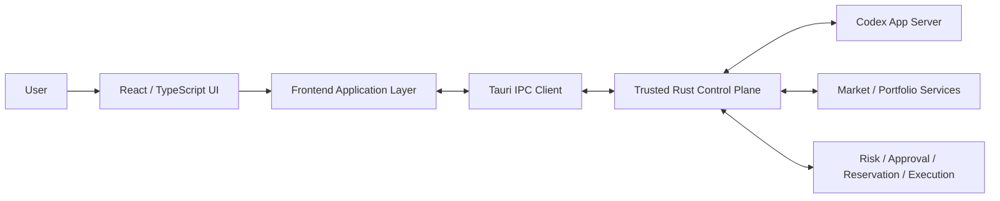

# TradeX Frontend Architecture Requirements & Design (ARD)

**Version:** v1.0 Revision C (RevC)  
**Status:** Engineering baseline  
**Scope:** Desktop frontend only  
**Target stack:** Tauri + React + TypeScript  
**Source baseline:** `TradeX_PRD_v1.0_RevC.md`, `TradeX_UI_Prototype_Spec_v1.0_RevC.md`, RevC prototype  
**Language:** English

> This ARD translates the RevC product requirements into an implementable frontend architecture. Product semantics and safety invariants come from the RevC PRD/UI specification. Concrete module boundaries, state-store decomposition, IPC shapes, folder layout, and test structure below are architectural decisions for implementation.

---

## 1. Purpose

The TradeX frontend is a local-first desktop workbench for persistent agent threads, market research, backtesting, simulated trading, and approval-gated live trading. It must behave like a Codex-style agent workspace while treating financial execution as a separate, privileged workflow.

The frontend is responsible for:

- rendering persistent Thread / Turn / Item timelines;
- exposing Agent Mode and Execution Context as separate dimensions;
- rendering market, account, portfolio, strategy, artifact, and execution state;
- presenting trusted risk, approval, reservation, and reconciliation decisions from the backend;
- collecting explicit user actions such as account arming, live approval, cancellation approval, provider configuration, and Manual Resolution choices;
- preserving visibility of provider/model provenance and market-data provenance;
- remaining safe under narrow layouts, keyboard navigation, reconnects, stale data, and backend failure.

The frontend is **not** the financial authority. It never decides whether a live order is valid, never owns broker credentials, and never converts a generic agent approval into trading authorization.

---

## 2. Architectural Drivers

### 2.1 Product drivers

1. Codex-style persistent workspace rather than a stateless chat UI.
2. Local-first desktop UX with fast event rendering.
3. Agent-native structured timeline cards.
4. Research-first workflow with optional progression into Trade.
5. Explicit separation between Agent Mode and Execution Context.
6. Account-scoped live arming.
7. Transaction-specific, single-use live approval.
8. Full market snapshot provenance in every live approval.
9. Explicit Paper / Demo / Testnet / Live identity.
10. Visible recovery and reconciliation states instead of optimistic assumptions.

### 2.2 Quality drivers

- IPC event arrival → visible UI commit: p95 < 100 ms for representative events.
- Keyboard-reachable core UI with visible focus.
- `Enter` must never implicitly approve a live order/cancellation.
- Narrow desktop/tablet layouts must preserve live safety controls.
- State must not be communicated by color alone.
- External telemetry is opt-in; no secrets in frontend logs.

### 2.3 Trust-boundary driver

The frontend may request privileged actions only through typed backend commands. It cannot access the OS keychain, provider signing code, Order Gateway, or raw broker credentials.

---

## 3. Frontend System Context



### Architectural rule

The UI renders authoritative backend state; it must not infer a successful financial mutation from an agent message, network timeout, or optimistic client transition.

---

## 4. Technology Decisions

| Area | Decision | Rationale |
|---|---|---|
| Desktop shell | Tauri | Local desktop integration, smaller footprint, Rust control-plane boundary |
| UI framework | React + TypeScript | Componentized Codex-style workspace, strong typing |
| Server-state cache | TanStack Query | Query lifecycle, invalidation, polling/revalidation where appropriate |
| UI/session state | Zustand or equivalent small store | Explicit local UI state without turning server state into client-owned truth |
| Runtime transport | Typed Tauri commands/events | Keeps privileged operations behind Rust boundary |
| Agent stream mapping | Adapter from Codex JSON-RPC/JSONL events to typed frontend events | Prevents protocol details leaking across all UI components |
| Charts | Lightweight financial chart library | Fast local rendering; no authority semantics in chart layer |
| Styling | CSS modules/tokens or equivalent | Deterministic design system, focus/reduced-motion control |
| Schema validation | Zod or generated runtime validator | Reject malformed IPC/event payloads at boundary |

The exact React meta-framework is intentionally unspecified. TradeX v1.0 is a desktop application and does not require SSR.

---

## 5. Frontend Process and Layer Model

```text
React Presentation
    ↓
Feature Controllers / View Models
    ↓
Frontend Domain Selectors
    ↓
Query + Event Stores
    ↓
Typed IPC Client
    ↓
Rust Control Plane
```

### 5.1 Presentation layer

Contains reusable visual components only. Examples:

- `AppShell`
- `Sidebar`
- `TopBar`
- `ThreadTimeline`
- `Composer`
- `ContextPanel`
- `MarketSnapshotProvenance`
- `OrderProposalCard`
- `RiskCheckPanel`
- `ReservationPanel`
- `LiveArmModal`
- `LiveApprovalModal`
- `CancellationApprovalModal`
- `ErrorRecoveryPanel`
- `WorkspaceImportModal`

Presentation components receive explicit state and callbacks. They do not call broker APIs or inspect secrets.

### 5.2 Feature-controller layer

Coordinates UI flows such as:

- create/resume thread;
- start/cancel/retry turn;
- switch Agent Mode;
- select execution account/context;
- arm/disarm one live account;
- generate/refresh live proposal;
- submit approval/rejection;
- approve cancellation;
- resolve ambiguous submission;
- configure provider/model;
- import/restore workspace.

### 5.3 Frontend domain-selector layer

Builds derived display state only. Examples:

- `canShowLiveApproval`
- `executionContextLabel`
- `isSelectedLiveAccountArmed`
- `effectiveAvailableDisplay`
- `isMarketSnapshotFresh`
- `isTurnExternalProcessorChanged`

Selectors may help rendering but never create authority. The backend remains authoritative for `can_execute`, risk, freshness eligibility, reservation validity, and account health.

---

## 6. Application Navigation Architecture

Primary navigation is fixed by RevC:

```text
New Thread
Threads
Markets
Watchlists
Accounts
Strategies
Artifacts
Settings
```

Portfolio and Orders are context/account surfaces rather than permanent first-level modules.

### 6.1 Route model

Recommended logical routes:

```text
/
/thread/:threadId
/markets
/markets/:instrumentId
/watchlists
/watchlists/:watchlistId
/accounts
/accounts/:accountId
/strategies
/strategies/:strategyId
/artifacts
/artifacts/:artifactId
/settings/:section?
```

These routes are local desktop navigation states, not public web URLs.

### 6.2 Narrow-window navigation

Below the narrow-layout breakpoint:

- sidebar collapses;
- primary workspace remains reachable;
- secondary inspectors stack below main content;
- a `More` entry exposes Artifacts and Settings if compact navigation cannot fit all primary items;
- live account identity, arming status, Reject, Approve, Cancel, Manual Resolution, and Disable All Live remain reachable without hover.

---

## 7. Core Frontend Domain Model

The frontend mirrors backend domain objects but does not own their authoritative lifecycle.

### 7.1 Thread

```ts
interface ThreadSummary {
  workspaceId: string;
  threadId: string;
  title: string;
  createdAt: string;
  updatedAt: string;
  defaultAgentMode: AgentMode;
  linkedAccountIds: string[];
  linkedInstrumentIds: string[];
  linkedStrategyIds: string[];
  linkedArtifactIds: string[];
}
```

### 7.2 Immutable Turn start snapshot

```ts
interface TurnSnapshot {
  turnId: string;
  agentModeAtStart: AgentMode;
  selectedAccountId?: string;
  executionContextAtStart: ExecutionContext;
  capabilityLevelAtStart: CapabilityLevel;
  modelId: string;
  modelProvider: ModelProvider;
  providerAttempts: ProviderAttempt[];
  attachedContextIds: string[];
  attachedContextHashes: string[];
  startedAt: string;
  completedAt?: string;
}
```

Picker changes after a turn starts never mutate this object.

### 7.3 Agent Mode

```ts
type AgentMode = "ASK" | "RESEARCH" | "BACKTEST" | "TRADE";
```

### 7.4 Execution Context

```ts
type ExecutionContext =
  | "NONE_READ_ONLY"
  | "HISTORICAL_SIMULATION"
  | "LOCAL_PAPER"
  | "ALPACA_PAPER"
  | "TRADING212_DEMO"
  | "TRADING212_LIVE"
  | "BINANCE_TESTNET"
  | "BINANCE_LIVE"
  | "BITGET_DEMO"
  | "BITGET_LIVE";
```

### 7.5 Live account state

```ts
type ArmingState = "DISARMED" | "ARMED";

interface LiveAccountStatus {
  accountId: string;
  environment: "LIVE";
  armingState: ArmingState;
  health: AccountHealth;
  lastReconciledAt?: string;
  capabilitySummary: string[];
}
```

There is no workspace-wide `liveArmed: boolean`.

---

## 8. Agent Mode × Execution Context UX State Machine

The frontend must present legality rules explicitly.

| Agent Mode | No account | Paper/Demo/Testnet | Live account |
|---|---|---|---|
| Ask | read-only | read-only context | read-only context |
| Research | read-only | read-only context | read-only context |
| Backtest | historical simulation | optional portfolio seed | optional portfolio seed |
| Trade | select execution account | simulated/provider-hosted execution | live proposal flow, still gated |

### UI behavior

- illegal combinations are disabled with an explanation;
- switching Agent Mode never silently swaps account/environment;
- selecting a Live account in Ask/Research remains read-only;
- selecting Trade never arms an account;
- changing mode/account/model applies to the next turn, not an in-flight turn.

---

## 9. State Management Strategy

TradeX must distinguish authoritative backend state from ephemeral UI state.

### 9.1 TanStack Query-owned state

Use queries for backend-owned snapshots:

- thread summaries and thread detail;
- account details and health;
- portfolio snapshots;
- watchlists;
- market/instrument snapshots;
- provider/model health;
- risk-policy summaries;
- strategy/backtest metadata;
- artifacts;
- open orders and reconciliation views.

### 9.2 Event-driven state

Subscribe to backend events for:

- Codex turn/item streaming;
- tool lifecycle;
- order state changes;
- fills/position updates;
- private-stream degradation;
- reconciliation progress;
- account arming changes;
- risk-policy invalidation;
- CLIProxyAPI health/provider-attempt changes.

Events update normalized caches or append immutable timeline items.

### 9.3 Zustand-owned UI state

Use a small client store for:

- selected workspace/thread route;
- composer draft text;
- open/closed drawers and inspectors;
- expanded timeline item IDs;
- pending picker selection before send;
- local theme/appearance preference;
- transient modal stack.

Do **not** store authoritative approval validity, broker order truth, reservation truth, or account health only in Zustand.

---

## 10. IPC Contract Architecture

The frontend talks only to the Rust control plane through versioned, typed commands and events.

### 10.1 Command envelope

```ts
interface CommandEnvelope<T> {
  requestId: string;
  command: string;
  schemaVersion: number;
  payload: T;
}
```

### 10.2 Result envelope

```ts
interface ResultEnvelope<T> {
  requestId: string;
  ok: boolean;
  data?: T;
  error?: TradeXError;
  stateVersion?: string;
}
```

### 10.3 Event envelope

```ts
interface DomainEvent<T> {
  eventId: string;
  eventType: string;
  occurredAt: string;
  aggregateType: string;
  aggregateId: string;
  sequence?: number;
  payload: T;
}
```

### 10.4 Required frontend command groups

```text
workspace.*
thread.*
turn.*
market.*
watchlist.*
account.*
provider.*
risk.*
trade.draft.*
trade.proposal.*
trade.approval.*
trade.cancel.*
trade.resolution.*
strategy.*
backtest.*
artifact.*
settings.*
```

### 10.5 Safety rules

- no raw keychain value is returned to the frontend;
- no frontend command accepts a raw broker secret after initial secure-entry handoff;
- live execution commands reference `account_id`, `proposal_id`, `approval_id`, etc.;
- UI never builds provider-signed requests;
- malformed or unknown event versions fail visibly instead of being silently coerced.

---

## 11. Thread / Turn / Item Rendering Architecture

### 11.1 Timeline item registry

Use a typed renderer registry rather than a large conditional component.

```ts
const itemRenderers: Record<ItemType, React.ComponentType<any>> = {
  user_message: UserMessageItem,
  agent_message: AgentMessageItem,
  plan: PlanItem,
  tool_call: ToolCallItem,
  tool_result: ToolResultItem,
  market_snapshot: MarketSnapshotItem,
  research_evidence: ResearchEvidenceItem,
  portfolio_snapshot: PortfolioSnapshotItem,
  screener_result: ScreenerResultItem,
  backtest_result: BacktestResultItem,
  order_draft: OrderDraftItem,
  order_proposal: OrderProposalItem,
  risk_check: RiskCheckItem,
  approval_request: ApprovalRequestItem,
  reservation: ReservationItem,
  order_update: OrderUpdateItem,
  fill: FillItem,
  error: ErrorItem,
  artifact: ArtifactItem,
};
```

### 11.2 Item lifecycle

UI supports:

```text
started → streaming → completed
                 ↘ failed
```

Turn states include running, cancelled, interrupted, completed, failed.

### 11.3 Resume behavior

Resuming a thread may restore navigation/default context, but the frontend must not visually restore:

- consumed/expired approvals;
- stale market snapshots as approval-valid;
- prior `ARMED` state after restart;
- an in-flight turn’s provider/model from current picker values.

---

## 12. Composer Architecture

Composer controls are first-class product state:

```text
@ Context | Account | Agent Mode | Model | Send
```

### 12.1 Send sequence

```text
validate local draft
→ request backend compatibility validation
→ freeze TurnSnapshot inputs
→ persist/start turn
→ render streaming items
```

### 12.2 Provider disclosure

Before send, display the next-turn path:

```text
CLIProxyAPI → ChatGPT
or
CLIProxyAPI → DeepSeek
```

If the provider changes during an explicitly enabled fallback, the timeline must record the change and make it visible.

### 12.3 Ask mode

Ask is a lightweight read-only workflow. It must not expose current-market trading actions or auto-create research artifacts.

---

## 13. Market and Portfolio UI Architecture

### 13.1 Canonical instrument identity

Frontend routes and cache keys use canonical `instrument_id`, not provider symbols.

### 13.2 Market snapshot model

```ts
interface MarketSnapshotProvenance {
  marketSnapshotId: string;
  instrumentId: string;
  source: string;
  venue?: string;
  providerTimestamp: string;
  receivedTimestamp: string;
  entitlement: "REALTIME" | "DELAYED" | "UNKNOWN";
  freshness: "HEALTHY" | "STALE" | "CLOCK_UNCERTAIN";
  quoteAgeMs?: number;
}
```

Live approval views require the full provenance block when market data participates in authority decisions.

### 13.3 FX/stablecoin provenance

Portfolio normalization surfaces:

- workspace base currency;
- conversion pair/path;
- source;
- timestamps;
- freshness;
- quality/depeg warning.

The frontend must not silently display USDT as USD-equivalent without the backend-provided conversion state.

---

## 14. Live Execution UI Architecture

### 14.1 Principle

The frontend is a **decision and consent surface**, not the execution engine.

### 14.2 Order lifecycle display

The UI must support the normalized state model, including at minimum:

```text
DRAFT
PROPOSED
RISK_REJECTED
NEEDS_APPROVAL
APPROVED
RESERVED
SUBMITTING
ACCEPTED
PARTIALLY_FILLED
FILLED
CANCEL_PENDING
CANCELLED
REJECTED
EXPIRED
UNKNOWN_RECONCILING
```

### 14.3 Editable draft vs immutable proposal

- `OrderDraft` is editable.
- `Generate Proposal` returns a new immutable `proposal_id + proposal_hash`.
- any later material edit creates a new proposal identity;
- stale approval UI must visibly become invalidated rather than silently update fields.

### 14.4 Account-scoped arming

Arming flow:

```text
select exact live account
→ inspect account health + permission state
→ explicit Arm action
→ backend confirms ARMED for that account
→ UI updates account badge
```

Global Disable All invokes one backend action and then renders the returned per-account states.

### 14.5 Approval modal

Mandatory content:

- exact account and environment;
- proposal ID/hash or inspectable immutable identity;
- instrument, side, quantity/notional, type, price, TIF;
- estimated notional;
- complete market snapshot provenance;
- available / reserved / effective available when relevant;
- deterministic risk checks;
- policy version;
- explicit Reject and Approve action.

`Enter` must never activate approval by default.

### 14.6 Reservation conflict

If a proposal fails due to reduced effective capacity, render the backend reason and reservation context. Do not recompute the financial answer in the browser.

### 14.7 Ambiguous submission

`UNKNOWN_RECONCILING` opens a Manual Resolution surface with only backend-authorized options:

- Confirmed not submitted (evidence required);
- Confirmed submitted (link broker identity);
- Keep reconciling.

There is no generic “release reservation and continue” action.

---

## 15. Provider and Model Configuration UI

### 15.1 Schema-driven forms

Provider configuration is rendered from backend-provided schema metadata.

```ts
interface ProviderFieldSchema {
  id: string;
  label: string;
  inputType: "text" | "password" | "select" | "boolean";
  required: boolean;
  secret: boolean;
  environment?: string[];
  helpText?: string;
}
```

The frontend must not assume every provider uses `API Key + Secret`.

### 15.2 Secret-entry rule

Secret fields are write-only from the UI perspective. After secure submission, the UI stores only metadata such as “configured”, keychain reference identity if safe, permission/capability result, and health.

### 15.3 LLM provider surface

Render:

- CLIProxyAPI sidecar state;
- pinned version;
- `/v1/models` health;
- ChatGPT OAuth login/re-login state;
- DeepSeek key configured/invalid state;
- discovered models;
- default provider/model;
- optional `Allow automatic fallback to DeepSeek` switch, OFF by default.

Model-provider configuration never appears as a trading capability.

---

## 16. Error and Recovery Architecture

Use one reusable `ErrorRecoveryPanel` driven by canonical error data.

```ts
interface TradeXError {
  category: ErrorCategory;
  code?: string;
  title: string;
  detail?: string;
  blocking: boolean;
  remediation: RemediationAction[];
  relatedEntity?: { type: string; id: string };
}
```

Canonical categories include:

```text
AUTH_ERROR
PERMISSION_ERROR
RATE_LIMITED
NETWORK_ERROR
UNSUPPORTED_CAPABILITY
MARKET_CLOSED
INSTRUMENT_HALTED
INVALID_ORDER
INSUFFICIENT_FUNDS
RISK_REJECTED
SUBMISSION_REJECTED
SUBMISSION_AMBIGUOUS
STREAM_DISCONNECTED
STATE_STALE
RECONCILIATION_REQUIRED
MODEL_UNAVAILABLE
QUOTA_EXCEEDED
OAUTH_EXPIRED
INTERNAL_ERROR
```

Frontend error handling must not invent alternate machine-state names.

---

## 17. Accessibility Architecture

Mandatory engineering rules:

- semantic buttons/inputs/landmarks;
- visible `:focus-visible` treatment;
- logical tab order;
- accessible labels for icon-only controls;
- modal focus trap and focus return;
- `aria-live`/status announcements for important order state changes;
- explicit textual Paper/Demo/Testnet/Live labels;
- no approval action bound to generic `Enter`;
- reduced-motion media query for non-essential animation;
- no hover-only safety information.

For live approval, initial modal focus should prefer a neutral/reject-safe control rather than the Approve button.

---

## 18. Performance Architecture

### 18.1 Rendering strategy

- virtualize long thread timelines;
- append streaming items incrementally;
- memoize expensive structured cards;
- keep chart rendering isolated from the main timeline tree;
- use stable cache keys based on canonical IDs;
- batch high-frequency market events before React commits when raw rate exceeds useful visual refresh frequency.

### 18.2 Market stream strategy

The frontend should not consume every tick for every instrument. It receives only backend-selected Hot subscriptions and coarse/on-demand updates for other contexts.

### 18.3 Failure containment

A chart or research-card rendering error must not hide live execution state. Critical execution/status surfaces should sit behind a separate error boundary from non-critical visualization components.

---

## 19. Security Architecture

Frontend security requirements:

1. No broker secrets in React state, browser storage, logs, URL-like routes, analytics, or crash payloads.
2. No direct external LLM requests.
3. No direct broker/exchange requests for privileged operations.
4. Content rendered from research/web sources is untrusted and cannot trigger privileged commands.
5. HTML/Markdown rendering is sanitized.
6. Clipboard/export actions for sensitive account data require deliberate user action where applicable.
7. Trade approval state is rendered only from backend authority objects.
8. UI cannot manufacture approval IDs, reservation IDs, or execution eligibility.

---

## 20. Frontend Project Structure

Recommended layout:

```text
src/
  app/
    App.tsx
    routes.tsx
    providers/
  components/
    shell/
    timeline/
    market/
    account/
    trading/
    strategy/
    artifact/
    settings/
    recovery/
  features/
    threads/
    composer/
    markets/
    watchlists/
    accounts/
    trading/
    strategies/
    backtests/
    artifacts/
    providers/
  domain/
    types/
    selectors/
    schemas/
  ipc/
    client.ts
    commands.ts
    events.ts
    generated/
  state/
    uiStore.ts
  query/
    keys.ts
    hooks/
  accessibility/
  styles/
  test/
```

Generated IPC/domain schema bindings should be kept separate from handwritten UI logic.

---

## 21. Testing Strategy

### 21.1 Unit tests

Test:

- Agent Mode × Execution Context compatibility;
- state selectors;
- immutable proposal rendering;
- policy-invalidation display;
- provider disclosure;
- canonical error mapping;
- safe keyboard behavior.

### 21.2 Component tests

Test critical components with fixture state:

- LiveArmModal;
- LiveApprovalModal;
- ReservationPanel;
- CancellationApprovalModal;
- ManualResolution panel;
- ProviderCredentialSchemaForm;
- ErrorRecoveryPanel.

### 21.3 Integration tests

Use a fake IPC backend to verify:

- turn streaming;
- restart/resume with all live accounts DISARMED;
- policy save invalidates approval;
- reservation conflict;
- ambiguous submission;
- model OAuth/quota error and explicit switch;
- Demo/Testnet never visually becomes Live.

### 21.4 End-to-end safety tests

Required assertions include:

- selecting Trade or Live never arms an account;
- arming Trading 212 does not arm Binance/Bitget;
- generic Enter cannot approve live order/cancel;
- materially changed proposal cannot reuse old approval;
- stale/clock-uncertain quote cannot display executable approval state;
- `UNKNOWN_RECONCILING` has no unsafe release button;
- restart UI does not restore ARMED.

### 21.5 Accessibility tests

Automate semantic checks where possible and manually verify focus order, screen-reader announcements, narrow-window live flows, and reduced motion.

---

## 22. Frontend Delivery Phases

### Phase FE-0 — Shell and contracts

- Tauri/React shell;
- typed IPC client;
- primary navigation;
- design tokens;
- Thread/Turn/Item renderer foundation;
- Agent Mode/Execution Context types;
- account-scoped arming display model.

### Phase FE-1 — Agent research workspace

- composer/pickers;
- thread history/resume;
- market/instrument/context panels;
- provider/model provenance;
- watchlists/accounts/artifacts.

### Phase FE-2 — Backtest and simulated trading

- strategy/backtest surfaces;
- Local Paper;
- Alpaca Paper;
- T212 Demo / Binance Testnet / Bitget Demo lifecycle variants.

### Phase FE-3 — Live execution safety

- live arming;
- approval/provenance;
- reservation;
- cancellation;
- risk-policy invalidation;
- ambiguous state / Manual Resolution;
- startup/reconnect recovery.

### Phase FE-4 — Hardening

- full canonical errors;
- workspace import/restore;
- accessibility;
- narrow-layout QA;
- performance profiling;
- release telemetry controls.

---

## 23. Frontend Definition of Done

Frontend v1.0 is architecture-complete when:

1. every RevC UI state is backed by a typed backend contract or explicitly marked local-only UI state;
2. Thread/Turn/Item replay does not depend on current picker values;
3. Agent Mode and Execution Context are independent throughout UI/state/API types;
4. account-scoped arming has no global-boolean shortcut;
5. all live approvals render immutable order identity + full provenance + risk/reservation information;
6. frontend cannot access secrets or privileged execution APIs;
7. canonical error/recovery states are rendered without invented authority;
8. keyboard/narrow-layout behavior preserves all live safety invariants;
9. generated schema compatibility tests pass against the pinned backend version.

---

## 24. Frontend Traceability to RevC

Primary requirement groups implemented by this ARD:

- **FR:** FR-002–006, FR-014–018, FR-030–035, FR-040–045, FR-048–080 where UI-facing;
- **NFR:** NFR-001, NFR-002, NFR-009, NFR-015–019;
- **SEC:** SEC-001–009 as frontend boundary constraints;
- **DATA:** DATA-001, DATA-003–008;
- **OPS:** OPS-003, OPS-007–009 as recovery/visibility responsibilities;
- **UX:** UX-001–010.

The backend remains the authority for risk, reservations, broker state, approval validity, reconciliation, credential handling, and execution.

---
