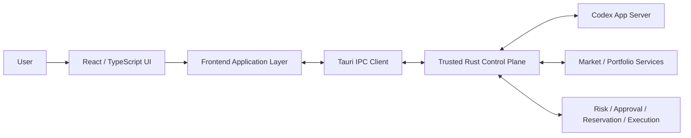

# TradeX Frontend Architecture Requirements & Design (ARD)

**Contract clarification date:** 2026-09-05 (RevC); S18 account-deletion contract clarified 2026-09-24 to identify duplicate-label records by full connection ID. Prototype behavior is evidence only, subject to the QA Report defects and pending gates.

**Version:** v1.0 Revision C (RevC)  
**Status:** Engineering baseline  
**Scope:** Desktop frontend only  
**Target stack:** Tauri + React + TypeScript  
**Source baseline:** `TradeX_PRD_v1.0_RevC.md`, `TradeX_UI_Prototype_Spec_v1.0_RevC.md`; prototype observations are recorded separately in the QA Report\
**Language:** English

> This ARD translates the RevC product requirements into an implementable frontend architecture. Product semantics and safety invariants come from the RevC PRD/UI specification. Concrete module boundaries, state-store decomposition, IPC shapes, folder layout, and test structure below are architectural decisions for implementation.

---

## 1. Purpose

The TradeX frontend is a local-first desktop workbench for persistent agent threads, market research, backtesting, simulated trading, and approval-gated live trading. It must behave like a Codex-style agent workspace while treating financial execution as a separate, privileged workflow.

The frontend is responsible for:

- rendering persistent Thread / Turn / Item timelines;
- exposing Agent Mode and Execution Context as separate dimensions;
- rendering market, account, portfolio, strategy, artifact, and execution state;
- presenting trusted risk, approval, reservation, and reconciliation decisions from the backend;
- collecting explicit user actions such as account arming, live approval, cancellation approval, provider configuration, and Manual Resolution choices;
- preserving visibility of provider/model provenance and market-data provenance;
- remaining safe under narrow layouts, keyboard navigation, reconnects, stale data, and backend failure.

The frontend is **not** the financial authority. It never decides whether a live order is valid, never owns broker credentials, and never converts a generic agent approval into trading authorization.

---

## 2. Architectural Drivers

### 2.1 Product drivers

1. Codex-style persistent workspace rather than a stateless chat UI.
2. Local-first desktop UX with fast event rendering.
3. Agent-native structured timeline cards.
4. Research-first workflow with optional progression into Trade.
5. Explicit separation between Agent Mode and Execution Context.
6. Account-scoped live arming.
7. Transaction-specific, single-use live approval.
8. Full market snapshot provenance in every live approval.
9. Explicit Paper / Demo / Testnet / Live identity.
10. Visible recovery and reconciliation states instead of optimistic assumptions.

### 2.2 Quality drivers

- IPC event arrival → visible UI commit: p95 < 100 ms for representative events.
- Keyboard-reachable core UI with visible focus.
- `Enter` must never implicitly approve a live order/cancellation.
- Narrow desktop/tablet layouts must preserve live safety controls.
- State must not be communicated by color alone.
- External telemetry is opt-in; no secrets in frontend logs.

### 2.3 Trust-boundary driver

The frontend may request privileged actions only through typed backend commands. It cannot access the OS keychain, provider signing code, Order Gateway, or raw broker credentials.

---

## 3. Frontend System Context



### Architectural rule

The UI renders authoritative backend state; it must not infer a successful financial mutation from an agent message, network timeout, or optimistic client transition.

---

## 4. Technology Decisions

| Area | Decision | Rationale |
|---|---|---|
| Desktop shell | Tauri | Local desktop integration, smaller footprint, Rust control-plane boundary |
| UI framework | React + TypeScript | Componentized Codex-style workspace, strong typing |
| Server-state cache | TanStack Query | Query lifecycle, invalidation, polling/revalidation where appropriate |
| UI/session state | Zustand or equivalent small store | Explicit local UI state without turning server state into client-owned truth |
| Runtime transport | Typed Tauri commands/events | Keeps privileged operations behind Rust boundary |
| Agent stream mapping | Adapter from Codex JSON-RPC/JSONL events to typed frontend events | Prevents protocol details leaking across all UI components |
| Charts | Lightweight financial chart library | Fast local rendering; no authority semantics in chart layer |
| Styling | CSS modules/tokens or equivalent | Deterministic design system, focus/reduced-motion control |
| Schema validation | Zod or generated runtime validator | Reject malformed IPC/event payloads at boundary |

The exact React meta-framework is intentionally unspecified. TradeX v1.0 is a desktop application and does not require SSR.

---

## 5. Frontend Process and Layer Model

```text
React Presentation
    ↓
Feature Controllers / View Models
    ↓
Frontend Domain Selectors
    ↓
Query + Event Stores
    ↓
Typed IPC Client
    ↓
Rust Control Plane
```

### 5.1 Presentation layer

Contains reusable visual components only. Examples:

- `AppShell`
- `Sidebar`
- `TopBar`
- `ThreadTimeline`
- `Composer`
- `ContextPanel`
- `MarketSnapshotProvenance`
- `OrderProposalCard`
- `RiskCheckPanel`
- `ReservationPanel`
- `LiveArmModal`
- `LiveApprovalModal`
- `CancellationApprovalModal`
- `ErrorRecoveryPanel`
- `WorkspaceImportModal`

Presentation components receive explicit state and callbacks. They do not call broker APIs or inspect secrets.

### 5.2 Feature-controller layer

Coordinates UI flows such as:

- create/resume thread;
- start/cancel/retry turn;
- switch Agent Mode;
- select execution account/context;
- arm/disarm one live account;
- generate/refresh live proposal;
- submit approval/rejection;
- approve cancellation;
- resolve ambiguous submission;
- configure provider/model;
- import/restore workspace.

### 5.3 Frontend domain-selector layer

Builds derived display state only. Examples:

- `canShowLiveApproval`
- `executionContextLabel`
- `isSelectedLiveAccountArmed`
- `effectiveAvailableDisplay`
- `isMarketSnapshotFresh`
- `isTurnExternalProcessorChanged`

Selectors may help rendering but never create authority. The backend remains authoritative for `can_execute`, risk, freshness eligibility, reservation validity, and account health.

---

## 6. Application Navigation Architecture

Primary navigation is fixed by RevC:

```text
New Thread
Threads
Markets
Watchlists
Accounts
Strategies
Artifacts
Settings
```

Portfolio and Orders are context/account surfaces rather than permanent first-level modules.

### 6.1 Route model

Recommended logical routes:

```text
/
/thread/:threadId
/markets
/markets/:instrumentId
/watchlists
/watchlists/:watchlistId
/accounts
/accounts/:accountId
/strategies
/strategies/:strategyId
/artifacts
/artifacts/:artifactId
/settings/:section?
```

These routes are local desktop navigation states, not public web URLs.

### 6.2 Narrow-window navigation

Below the narrow-layout breakpoint:

- sidebar collapses;
- primary workspace remains reachable;
- secondary inspectors stack below main content;
- a drawer or `More` preserves New Thread, Thread History, Watchlists, Artifacts, Settings, and Account Health when the sidebar is collapsed; Provider Configure/Models and row actions wrap/stack instead of disappearing;
- live account identity, arming status, Reject, Approve, Cancel, Manual Resolution, and Disable All Live remain reachable without hover.

---

## 7. Core Frontend Domain Model

The frontend mirrors backend domain objects but does not own their authoritative lifecycle.

### 7.1 Thread

```ts
interface ThreadSummary {
  workspaceId: string;
  threadId: string;
  title: string;
  createdAt: string;
  updatedAt: string;
  defaultAgentMode: AgentMode;
  linkedAccountIds: string[];
  linkedInstrumentIds: string[];
  linkedStrategyIds: string[];
  linkedArtifactIds: string[];
}
```

### 7.2 Immutable Turn start snapshot

```ts
interface TurnSnapshot {
  turnId: string;
  agentModeAtStart: AgentMode;
  selectedAccountId?: string;
  executionContextAtStart: ExecutionContext;
  capabilityLevelAtStart: CapabilityLevel;
  modelId: string;
  modelProvider: ModelProvider;
  attachedContextIds: string[];
  attachedContextHashes: string[];
  startedAt: string;
}
```

Picker changes after a turn starts never mutate this object.

The immutable snapshot contains start-time inputs only. Provider attempts are append-only Turn events; completion time belongs to the Turn lifecycle record. Historical Turn/Artifact provenance reads the stored snapshot and event history, never the current composer selectors.

### 7.3 Agent Mode

```ts
type AgentMode = "ASK" | "RESEARCH" | "BACKTEST" | "TRADE";
```

### 7.4 Execution Context

```ts
type ExecutionContext =
  | "NONE_READ_ONLY"
  | "HISTORICAL_SIMULATION"
  | "LOCAL_PAPER"
  | "ALPACA_PAPER"
  | "TRADING212_DEMO"
  | "TRADING212_LIVE"
  | "BINANCE_TESTNET"
  | "BINANCE_LIVE"
  | "BITGET_DEMO"
  | "BITGET_LIVE";
```

### 7.5 Live account state

```ts
type ArmingState = "DISARMED" | "ARMED";

interface LiveAccountStatus {
  accountId: string;
  environment: "LIVE";
  armingState: ArmingState;
  health: AccountHealth;
  lastReconciledAt?: string;
  capabilitySummary: string[];
}
```

There is no workspace-wide `liveArmed: boolean`.

### 7.6 Capability preflight

```ts
type CapabilityLevel = "C0" | "C1" | "C2" | "C3" | "C4" | "C5" | "C6";
type ToolId = "public_market_read" | "account_read" | "historical_simulation" | "paper_demo_testnet_execution" | "live_order_proposal";

interface CapabilityDecision {
  level: CapabilityLevel;
  allowedTools: ToolId[];
  executionAllowed: boolean;
  reason?: string;
}
```

The composer may query `agent.capabilities` for pending state, but `turn.start` must receive the same inputs and recompute the decision at the trusted boundary. C5/C6 and unknown or disallowed tools remain unavailable.

### 7.7 Context catalog and temporary picker state

```ts
interface ContextCatalogEntry {
  contextRef: { kind: "account"; id: string; hash: string };
  label: string;
  providerId?: string;
  environment?: string;
  readOnly: boolean;
  available: boolean;
  availabilityReason?: string;
}
interface ContextCatalog {
  entries: ContextCatalogEntry[];
  emptyStates: { kind: "instrument" | "account" | "strategy" | "backtest" | "artifact"; availabilityReason: string }[];
}
```

`context.catalog` is backend-owned and contains persisted account refs plus explicit empty states for future catalogs. The picker keeps a temporary pending list: Attach replaces it, Cancel leaves it unchanged, and removing a chip affects only the next Turn. A Live account in Ask/Research is labelled `LIVE · READ-ONLY`; Backtest retains it only as an optional read-only seed. The backend revalidates ref IDs and hashes when creating a Thread or starting a Turn. An omitted `attachedContexts` field on `turn.start` preserves saved Thread refs for compatibility, while an explicit empty array clears them; `null` is invalid.

An available attached account context exposes read-only account tools for Ask, Research and Backtest; the separate Account picker remains required when Trade needs an execution account.

### 7.8 Typed research registry and result preview

The capability summary must render the separate `researchTools` data-plane registry. It contains only the read-only IDs `public_market_read`, `account_read`, and `historical_simulation`; financial authority IDs in `allowedTools` are not research tools. The Composer provides a selector for the authorized research tool and a focus selector (`GENERAL`, `EQUITY`, `CRYPTO_SPOT`), then may call `research.run` to show the typed state, conclusion, canonical instrument refs, findings, bounded scenarios, artifact refs, source/provider timestamps, freshness, quality, limitations and marker. For `CRYPTO_SPOT`, the card renders only typed Binance/Bitget venue rows with provenance, selected venue, spread/depth and quote age; missing data remains absent with a visible blocked/unavailable/degraded reason. Query text remains untrusted and is never rendered into the result payload.

Before Send, the Composer may attach a `ResearchToolInvocation` and its `ResearchToolResult`. `turn.start` revalidates the pair at the trusted boundary; a missing or tampered pair is surfaced as `RESEARCH_RESULT_INVALID` and leaves the Thread unchanged. A valid result renders as a `research_result` timeline item and its complete bounded typed result is persisted with the item so reloads retain the evidence card; the marker is visible in the final Turn output. Preview state is ephemeral and is cleared when the selected tool, focus, mode, execution context, account or attached refs change. A Trade-mode card may show a disabled/read-only proposal entry; Ask and Research render no Trade CTA, and the card never calls an order, approval, arming, Gateway or live-risk command. Synthetic fixture rows are visibly labelled and do not establish provider facts.

---

## 8. Agent Mode × Execution Context UX State Machine

The frontend must present legality rules explicitly.

| Agent Mode | No account | Paper/Demo/Testnet | Live account |
|---|---|---|---|
| Ask | read-only | read-only context | read-only context |
| Research | read-only | read-only context | read-only context |
| Backtest | historical simulation | optional portfolio seed | optional portfolio seed |
| Trade | select execution account | simulated/provider-hosted execution | live proposal flow, still gated |

### UI behavior

- illegal combinations are disabled with an explanation;
- switching Agent Mode never silently swaps account/environment;
- selecting a Live account in Ask/Research remains read-only;
- selecting Trade never arms an account;
- changing mode/account/model applies to the next turn, not an in-flight turn.

---

## 9. State Management Strategy

TradeX must distinguish authoritative backend state from ephemeral UI state.

### 9.1 TanStack Query-owned state

Use queries for backend-owned snapshots:

- thread summaries and thread detail;
- account details and health;
- portfolio snapshots;
- watchlists;
- market/instrument snapshots;
- provider/model health;
- risk-policy summaries;
- strategy/backtest metadata;
- artifacts;
- open orders and reconciliation views.

### 9.2 Event-driven state

Subscribe to backend events for:

- Codex turn/item streaming;
- tool lifecycle;
- order state changes;
- fills/position updates;
- private-stream degradation;
- reconciliation progress;
- account arming changes;
- risk-policy invalidation;
- CLIProxyAPI health/provider-attempt changes.

Events update normalized caches or append immutable timeline items.

### 9.3 Zustand-owned UI state

Use a small client store for:

- selected workspace/thread route;
- composer draft text;
- open/closed drawers and inspectors;
- expanded timeline item IDs;
- pending picker selection before send;
- local theme/appearance preference;
- transient modal stack.

Do **not** store authoritative approval validity, broker order truth, reservation truth, or account health only in Zustand.

---

## 10. IPC Contract Architecture

The canonical command/result/event envelopes, exact command names, payload requirements, schema-version rules, and replay protocol are owned by [Backend ARD §41–42](./TradeX_Backend_ARD_v1.0_RevC.md#41-backend-api--ipc-surface). Frontend IPC code must consume that contract; it must not invent trade.draft.*, trade.approval.*, or other aliases for the documented commands.

### 10.1 Client responsibilities

- Use schemaVersion 1 on commands and validate it on results/events.
- Match requestId; handle success and error as disjoint result types.
- Send the expected authoritative state version for mutations; a stale result requires reload and fresh consent, not blind retry.
- Subscribe/replay by aggregate identity and sequence; deduplicate repeated events and reload a coherent snapshot when a sequence gap, conflicting duplicate, or unavailable replay range occurs.
- Keep financial controls unavailable while their authoritative projection is missing or incompatible. Model-only failures disable affected Agent Turns while preserving account/reconciliation controls.
- Navigation and unsubmitted picker/draft changes remain local UI state. Typed account/trade/model/domain commands cross only the trusted Tauri control-plane boundary.

### 10.2 Safety rules

No keychain secret is returned to the frontend. Credential entry uses only the dedicated secure-entry handoff; subsequent commands reference credential IDs. The UI neither signs provider requests nor calls the Gateway directly. Financial commands carry canonical account/proposal/approval/cancellation-intent IDs and cannot derive authority from a generic Agent approval. The client checks all required safety/error fields defined by the canonical contract and displays backend remediation without inventing new order states.

---

## 11. Thread / Turn / Item Rendering Architecture

### 11.1 Timeline item registry

Use a typed renderer registry rather than a large conditional component.

```ts
const itemRenderers: Record<ItemType, React.ComponentType<any>> = {
  user_message: UserMessageItem,
  agent_message: AgentMessageItem,
  plan: PlanItem,
  tool_call: ToolCallItem,
  tool_result: ToolResultItem,
  market_snapshot: MarketSnapshotItem,
  research_evidence: ResearchEvidenceItem,
  portfolio_snapshot: PortfolioSnapshotItem,
  screener_result: ScreenerResultItem,
  backtest_result: BacktestResultItem,
  order_draft: OrderDraftItem,
  order_proposal: OrderProposalItem,
  risk_check: RiskCheckItem,
  approval_request: ApprovalRequestItem,
  reservation: ReservationItem,
  order_update: OrderUpdateItem,
  fill: FillItem,
  error: ErrorItem,
  artifact: ArtifactItem,
};
```

### 11.2 Item lifecycle

UI supports:

```text
started → streaming → completed
                 ↘ failed
```

Turn states include running, cancelled, interrupted, completed, failed.

### 11.3 Resume behavior

Resuming a thread may restore navigation/default context, but the frontend must not visually restore:

- consumed/expired approvals;
- stale market snapshots as approval-valid;
- prior `ARMED` state after restart;
- an in-flight turn’s provider/model from current picker values.

---

## 12. Composer Architecture

Composer controls are first-class product state:

```text
@ Context | Account | Agent Mode | Model | Send
```

### 12.1 Send sequence

```text
validate local draft
→ request backend compatibility validation
→ freeze TurnSnapshot inputs
→ persist/start turn
→ render streaming items
```

### 12.2 Provider disclosure

Before send, display the next-turn path:

```text
CLIProxyAPI → ChatGPT
or
CLIProxyAPI → DeepSeek
```

If the provider changes during an explicitly enabled fallback, the timeline must record the change and make it visible.

### 12.3 Ask mode

Ask is a lightweight read-only workflow. It must not expose current-market trading actions or auto-create research artifacts.

---

## 13. Market and Portfolio UI Architecture

### 13.1 Canonical instrument identity

Frontend routes and cache keys use canonical `instrument_id`, not provider symbols.

### 13.2 Market snapshot model

```ts
interface MarketSnapshotProvenance {
  marketSnapshotId: string;
  instrumentId: string;
  source: string;
  venue?: string;
  providerTimestamp: string;
  receivedTimestamp: string;
  entitlement: "REALTIME" | "DELAYED" | "UNKNOWN";
  freshness: "HEALTHY" | "STALE" | "CLOCK_UNCERTAIN";
  quoteAgeMs?: number;
}
```

Live approval views require the full provenance block when market data participates in authority decisions.

### 13.3 Trusted time health

Settings / Account Health renders the workspace-scoped `time.status` result as a semantic status with wall-clock, monotonic reading, provider offset, observed timestamp, bounded reason, and a keyboard-accessible `time.revalidate` action whenever confidence is `CLOCK_UNCERTAIN` or `STALE`. The panel uses `role="status"` with `aria-live="polite"`, keeps focus visible, and preserves the same blocking reason at 768 px and 390 px. Renderer state cannot override the backend reading; Live eligibility remains unavailable until the Control Plane reports `TRUSTED`.

### 13.4 Market session and corporate actions

`MarketDetail` renders the backend-owned `marketState`, `corporateActions`, and `adjustmentStatus` beside the existing source/snapshot panel. Session text covers `OPEN`, `CLOSED`, `EXTENDED_HOURS`, `HALTED`, `MAINTENANCE`, `SUSPENDED`, `DEGRADED`, and `UNKNOWN`; venue, source status, next boundaries, calendar version, provider time, observed time, and `timeConfidence` remain visible. Missing or blocked OD-005 data stays `UNKNOWN`/`UNAVAILABLE`, and no fixture is presented as a live session or adjusted history.

The panel uses semantic headings, a `role="status"`/`aria-live="polite"` announcement for session changes, visible focus, keyboard-reachable source remediation, and text labels in addition to color. `MARKET_CLOSED` and `INSTRUMENT_HALTED` are rendered as deterministic blocking states; the renderer never computes execution eligibility. Corporate-action rows are bounded and display action type, description, effective/announced time, source, and adjustment status.

### 13.5 FX/stablecoin provenance

Portfolio normalization surfaces:

- workspace base currency;
- conversion pair/path;
- source;
- timestamps;
- freshness;
- quality/depeg warning.

The frontend must not silently display USDT as USD-equivalent without the backend-provided conversion state.

### 13.6 Local Paper surface (S16)

The Local Paper account is rendered as `Local Paper · LOCAL_PAPER` and `TradeX simulation · TRADEX_SIMULATION`. The Accounts surface reads `paper.get`, shows deterministic scenario/quote state, cash, reserved cash, positions, open orders, fills and event history, and exposes only simulation actions. The Order Drafts surface submits the selected immutable Local Paper proposal through `paper.order.submit`; resting or partial orders use an explicit cancellation dialog before `paper.order.cancel`. `paper.quote.refresh` and `paper.scenario.set` are explicit Trade-surface actions and never an Agent action.

The renderer treats the Local Paper projection as authoritative after reload/reopen. Loading, empty, error and retry states use status/alert semantics; submit/cancel dialogs use `role="dialog"`, `aria-modal`, an accessible name, keyboard Enter for the explicit action only, and focus restoration to the triggering proposal or Local Paper summary. Every simulation result keeps the textual `LOCAL`, `TRADEX_SIMULATION`, and `not provider truth` disclosure. Portfolio shows simulation provenance and `Live risk: Blocked`; no Local Paper control renders approval, arming, reservation, broker acknowledgement, or Live readiness.

### 13.7 Alpaca Paper order submission (S17 #57)

The Accounts surface renders Alpaca Paper buying power only from the provider observation, paired with its account currency; missing values display `Unavailable`. The Order Drafts surface shows the immutable `ALPACA_PAPER` Proposal and its bound account, environment, canonical instrument, side, quantity/notional, order type, time in force, and limit price before presenting an explicit Paper-only confirmation dialog. The user must confirm the exact reviewed Proposal; this path is separate from Local Paper simulation and Live approval.

After submission, the renderer reads the durable attempt projection and distinguishes `SUBMITTING`, `ACKNOWLEDGED`, `UNKNOWN_RECONCILING`, and `REJECTED`. Acknowledgement is labeled as provider acceptance, never as fill evidence. Reload restores the saved attempt; an unknown attempt offers query-only reconciliation by its saved client order ID, while duplicate submission shows the existing attempt and cannot issue another POST. Errors retain their bounded remediation text. Loading and error states use status/alert semantics, the confirmation dialog restores focus, and the Paper account/order identity remains readable at 390, 768, and 1280 px. No Alpaca Paper control grants Live or Agent submission authority.

### 13.8 Alpaca Paper order book and cancel review (S17 #58)

The Order Drafts surface reads the persisted `alpaca-paper-order-book` for the selected Alpaca Paper account and offers an explicit refresh. It labels the `ALPACA_PAPER` environment, `TRADE_X` versus `EXTERNAL` origin, provider order status, filled/remaining quantity, provider time, TradeX observation time, and whether the last complete read is current, stale, degraded, or not yet available. Open orders, order history, and `FILL` activities remain separate lists; incomplete reads retain the last complete data and explain the degraded state.

Cancel is available only for a currently open provider order. Before showing the confirmation dialog, the frontend asks the backend to re-read that exact order. The dialog identifies the account, Paper environment, provider order, instrument, filled quantity, and remaining quantity. Only an explicit confirmation invokes the typed cancel command. Provider acknowledgement is displayed as `CANCEL_PENDING`; the UI shows `CANCELLED` only after a later provider observation confirms a terminal state. Changed order identity/status requires a new review. Keyboard dismissal sends no request, and focus returns to the triggering order control. These controls never cancel Local Paper or Live orders.

### 13.9 Alpaca Paper live updates and stream health (S17 #59)

The Accounts surface shows the textual private-stream and reconciliation states plus the last successfully received trade-update time. The Order Drafts surface shows the same health beside the saved Paper order book, refreshes that book when the account aggregate reports a stream update, and identifies fill observations as `trade_updates` or REST `FILL` activity. Partial, full, rejected, cancelled, expired, and unknown provider statuses remain visibly distinct. Disconnects and incomplete reconciliation use stale/degraded text and retain the last saved orders/fills; they never present them as current. Health does not grant Local Paper, Live, Agent, approval, or arming capability.

### 13.10 Trading 212 Demo order submission (S18 #61)

The Order Drafts surface submits only the selected immutable `TRADING212_DEMO` Proposal through `trading212.demo.order.submit` after a separate confirmation that names the Demo environment and displays the exact instrument, side, quantity, order type, limit, and time in force. The supported choices are BASE-quantity Market-DAY and Limit-DAY/GTC; Market confirmation states extended hours are off. `trading212.demo.order.attempt.get` restores the saved attempt after reload. The UI distinguishes `SUBMITTING`, `ACKNOWLEDGED`, `UNKNOWN_RECONCILING`, and `REJECTED`; acknowledgement is never called a fill. Repeating a submit reads the saved attempt and cannot send a second POST. Unknown results disable retry and remain frozen because the provider exposes no TradeX client-order identity. All controls are primary Trade UI actions; neither Agent nor Live can enter this path.

### 13.11 Trading 212 Demo order book (S18 #62)

Order Drafts lets the user select a connected Trading 212 Demo account and reads its saved book on selection/reload. Explicit controls refresh pending orders, refresh the details of an exact saved pending order, or load one bounded page of history at a time. The panel labels `TRADING212_DEMO`, provider order ID, `TRADE_X` versus `EXTERNAL` origin, raw and normalized provider status, order type/time-in-force, submitted/observed time, exact cumulative fill quantity/value, and remaining quantity when determinable. A saved TradeX attempt appears only when its recorded provider order ID exactly matches; similar orders are never linked. Missing provider values remain `Unavailable`.

The UI distinguishes never-synced, loading, empty, current, stale/degraded, and rate-limited reads, shows the last successful read and endpoint retry time, and retains saved observations after an incomplete read. History controls expose page count/completion and cannot trigger automatic polling. Pending-order detail is offered only while the saved observation says the order is pending; a terminal detail response removes that action. Lists and controls remain readable by keyboard and at narrow widths. Cumulative filled value is shown with the provider-reported currency when available; the UI never converts or infers a unit. No fill rows are synthesized, and no stream or Live/Agent action is added.

### 13.12 Trading 212 Demo order cancellation (S18 #63)

On a current pending Demo order with an allowlisted provider status, “Review cancellation” first refreshes that exact order detail. Open the confirmation only when the returned book and exact order are current, still pending/cancelable, and belong to the selected Demo connection and remote account. The dialog names the captured account/environment and full provider order ID, shows raw and normalized status, exact filled and remaining quantities, filled value/currency when available, and observation time. Its copy says provider acceptance is not cancellation. Keep reviewing or Escape dismisses without a write; keyboard focus starts on the safe dismissal control, remains trapped in the dialog, and returns to the trigger or logical fallback. Confirmation sends one `trading212.demo.orders.cancel` request for the captured connection and book version.

After a 200 acknowledgement, show the order as cancellation pending and keep the provider's raw status; timeout or unknown outcomes also remain pending/unknown and cannot be resubmitted. Keep exact-order detail refresh available for reconciliation, hide another cancel control, and let later provider facts win a partial/full-fill race. Only a provider-terminal state displays the final outcome. Show the cancel endpoint retry time with the other per-account gates. These actions are Demo-only and are unavailable on stale, disconnected, unknown, or terminal orders; layout and keyboard behavior are checked at 390/768 px.

### 13.13 Trading 212 Demo local account deletion (S18 #66)

Accounts offers “Delete local account” only when the selected Trading 212 Demo connection is FAILED or DISCONNECTED and credential health is MISSING. The native confirmation identifies the captured record by its full connection ID, account label, provider, and environment; names the TradeX-local account and account/order-book observations that will be removed; and says provider keys/orders and every other connection are unchanged. Cancel/Escape is read-only. Confirmation calls only `account.delete`; backend eligibility remains authoritative. An `ACKNOWLEDGED` attempt stays unresolved until its exact linked order has a durable recognized terminal observation with `pending: false`. On success invalidate account list/detail/context, remove the selected detail, announce completion, and return focus to the trigger or `Account connections`. On stale state, an unresolved guard, or storage failure, display an accessible error and retain the account view for recovery. Existing saved-connection selection and secure new-account entry remain available.

---

### 13.14 Binance Spot Testnet Proposal submission and recovery (S19 #68)

Order Drafts offers submission only for an immutable `BINANCE_TESTNET` Proposal bound to a connected Binance `TESTNET` account. Before confirmation, capture the exact connection ID, label and remote account ID and show them with the Proposal hash, instrument/venue, side, quantity type/value, order type, time in force, limit and maximum spend. Re-read the Proposal and account after confirmation; if the Proposal changed or the captured Testnet account identity no longer matches, stop and ask the user to review again. Only the main Trade UI can call the typed Testnet submit command.

The saved attempt is loaded on selection/reopen. The UI distinguishes `SUBMITTING`, `ACKNOWLEDGED`, `UNKNOWN_RECONCILING`, and `REJECTED`; acknowledgement means accepted by Binance and is never displayed as a fill. Duplicate submit reads the saved attempt and cannot issue another POST. `UNKNOWN_RECONCILING` disables resubmit and offers only an explicit query by the saved `clientOrderId`; an absent query leaves the attempt unknown. Loading/error/reload states use status/alert semantics. The confirmation traps focus, supports safe dismissal with Escape/Keep reviewing, and restores focus. Test the identity and state labels at 390, 768, and 1280 px. No Binance Live or Agent write control is exposed.

### 13.15 Binance Spot Testnet private updates and recovery (S19 #70)

On the selected connected `BINANCE_TESTNET` account, Order Drafts displays the saved order book and the account's textual private-stream/reconciliation health plus last event time. `executionReport` updates refresh the saved order query through the existing account aggregate event. Valid account-position updates replace only changed assets; stale/degraded/reconciling states retain the last trusted rows. A delta-only balance event or unknown event keeps reconciliation visibly required until fixed-route REST reads succeed. Unknown order statuses remain visible and nonterminal. The surface adds no user-data stream controls, Live or Local Paper path, or authority. Preserve the explicit manual pending/history/detail read controls and verify keyboard access and 390/768/1280 px layouts.

## 14. Live Execution UI Architecture

### 14.1 Principle

The frontend is a **decision and consent surface**, not the execution engine.

### 14.2 Order lifecycle display

The UI must support the normalized state model, including at minimum:

```text
DRAFT
PROPOSED
RISK_REJECTED
NEEDS_APPROVAL
APPROVED
RESERVED
SUBMITTING
ACCEPTED
PARTIALLY_FILLED
FILLED
CANCEL_PENDING
CANCELLED
REJECTED
EXPIRED
UNKNOWN_RECONCILING
```

### 14.3 Editable draft vs immutable proposal

- `OrderDraft` is editable.
- `Generate Proposal` returns a new immutable `proposal_id + proposal_hash`.
- any later material edit creates a new proposal identity;
- stale approval UI must visibly become invalidated rather than silently update fields.

### 14.4 Account-scoped arming

Arming flow:

```text
select exact live account
→ inspect account health + permission state
→ explicit Arm action
→ backend confirms ARMED for that account
→ UI updates account badge
```

Global Disable All invokes one backend action and then renders the returned per-account states.

### 14.5 Approval modal

Mandatory content:

- exact account and environment;
- proposal ID/hash or inspectable immutable identity;
- instrument, side, quantity/notional, type, price, TIF;
- estimated notional;
- complete market snapshot provenance;
- available / reserved / effective available when relevant;
- deterministic risk checks;
- policy version;
- explicit Reject and Approve action.

`Enter` must never activate approval by default.

### 14.6 Reservation conflict

If a proposal fails due to reduced effective capacity, render the backend reason and reservation context. Do not recompute the financial answer in the browser.

### 14.7 Ambiguous submission

`UNKNOWN_RECONCILING` opens a Manual Resolution surface with only backend-authorized options:

- Confirmed not submitted (evidence required);
- Confirmed submitted (link broker identity);
- Keep reconciling.

There is no generic “release reservation and continue” action.

---

### 14.8 Operation-preserving approval and cancellation

Keep a discriminated pending intent with operation PLACE_ORDER or CANCEL and its immutable backend identity. Opening Arm does not replace the intent, change the account, or populate a default order. After arming, ask the backend to refresh eligibility and return to the matching approval. Cancellation displays the broker order ID and remaining quantity; a changed provider snapshot invalidates prior consent.

### 14.9 State-derived rendering and eligibility

Render explicit order-state cases; an unrecognized or UNKNOWN_RECONCILING value has no successful-fill fallback. Show only persisted observed events, and keep account health, order status, reservation status, and approval expiry separate. Manual Resolution first loads backend evidence and allowed decisions via trade.resolution_evidence, then submits evidence references/version via trade.manual_resolution; local text or a checkbox cannot verify evidence.

Buttons reflect backend eligibility for the exact operation. Re-evaluate on account, mode, market, clock, permission, policy, proposal, and reservation changes. Disable All awaits a result identifying disarmed accounts and stopped/possibly-submitted attempts; it does not optimistically erase a reservation or imply a broker cancellation. UI Spec §14 supplies the required interaction and accessibility cases.

---

## 15. Provider and Model Configuration UI

### 15.1 Schema-driven forms

Provider configuration is rendered from backend-provided schema metadata.

```ts
interface ProviderFieldSchema {
  id: string;
  label: string;
  inputType: "text" | "password" | "select" | "boolean";
  required: boolean;
  secret: boolean;
  environment?: string[];
  helpText?: string;
}
```

The frontend must not assume every provider uses `API Key + Secret`.

### 15.2 Secret-entry rule

Secret fields are write-only from the UI perspective. After secure submission, the UI stores only metadata such as “configured”, keychain reference identity if safe, permission/capability result, and health.

### 15.3 LLM provider surface

Render:

- CLIProxyAPI sidecar state;
- pinned version;
- `/v1/models` health;
- ChatGPT OAuth login/re-login state;
- DeepSeek key configured/invalid state;
- discovered models;
- default provider/model;
- optional `Allow automatic fallback to DeepSeek` switch, OFF by default.

Model-provider configuration never appears as a trading capability.

---

## 16. Error and Recovery Architecture

Use one reusable `ErrorRecoveryPanel` driven by canonical error data.

```ts
interface TradeXError {
  category: ErrorCategory;
  code?: string;
  title: string;
  detail?: string;
  blocking: boolean;
  remediation: RemediationAction[];
  relatedEntity?: { type: string; id: string };
}
```

Canonical categories include:

```text
AUTH_ERROR
PERMISSION_ERROR
RATE_LIMITED
NETWORK_ERROR
UNSUPPORTED_CAPABILITY
MARKET_CLOSED
INSTRUMENT_HALTED
INVALID_ORDER
INSUFFICIENT_FUNDS
RISK_REJECTED
SUBMISSION_REJECTED
SUBMISSION_AMBIGUOUS
STREAM_DISCONNECTED
STATE_STALE
RECONCILIATION_REQUIRED
MODEL_UNAVAILABLE
QUOTA_EXCEEDED
OAUTH_EXPIRED
INTERNAL_ERROR
```

Frontend error handling must not invent alternate machine-state names.

---

## 17. Accessibility Architecture

Mandatory engineering rules:

- semantic buttons/inputs/landmarks;
- visible `:focus-visible` treatment;
- logical tab order;
- accessible labels for icon-only controls;
- modal focus trap and focus return;
- `aria-live`/status announcements for important order state changes;
- explicit textual Paper/Demo/Testnet/Live labels;
- no approval action bound to generic `Enter`;
- reduced-motion media query for non-essential animation;
- no hover-only safety information.

For live approval, initial modal focus should prefer a neutral/reject-safe control rather than the Approve button.

---

## 18. Performance Architecture

### 18.1 Rendering strategy

- virtualize long thread timelines;
- append streaming items incrementally;
- memoize expensive structured cards;
- keep chart rendering isolated from the main timeline tree;
- use stable cache keys based on canonical IDs;
- batch high-frequency market events before React commits when raw rate exceeds useful visual refresh frequency.

### 18.2 Market stream strategy

The frontend should not consume every tick for every instrument. It receives only backend-selected Hot subscriptions and coarse/on-demand updates for other contexts.

### 18.3 Failure containment

A chart or research-card rendering error must not hide live execution state. Critical execution/status surfaces should sit behind a separate error boundary from non-critical visualization components.

---

## 19. Security Architecture

Frontend security requirements:

1. No broker secrets in React state, browser storage, logs, URL-like routes, analytics, or crash payloads.
2. No direct external LLM requests.
3. No direct broker/exchange requests for privileged operations.
4. Content rendered from research/web sources is untrusted and cannot trigger privileged commands.
5. HTML/Markdown rendering is sanitized.
6. Clipboard/export actions for sensitive account data require deliberate user action where applicable.
7. Trade approval state is rendered only from backend authority objects.
8. UI cannot manufacture approval IDs, reservation IDs, or execution eligibility.

---

## 20. Frontend Project Structure

Recommended layout:

```text
src/
  app/
    App.tsx
    routes.tsx
    providers/
  components/
    shell/
    timeline/
    market/
    account/
    trading/
    strategy/
    artifact/
    settings/
    recovery/
  features/
    threads/
    composer/
    markets/
    watchlists/
    accounts/
    trading/
    strategies/
    backtests/
    artifacts/
    providers/
  domain/
    types/
    selectors/
    schemas/
  ipc/
    client.ts
    commands.ts
    events.ts
    generated/
  state/
    uiStore.ts
  query/
    keys.ts
    hooks/
  accessibility/
  styles/
  test/
```

Generated IPC/domain schema bindings should be kept separate from handwritten UI logic.

---

## 21. Testing Strategy

### 21.1 Unit tests

Test:

- Agent Mode × Execution Context compatibility;
- state selectors;
- immutable proposal rendering;
- policy-invalidation display;
- provider disclosure;
- canonical error mapping;
- safe keyboard behavior.

### 21.2 Component tests

Test critical components with fixture state:

- LiveArmModal;
- LiveApprovalModal;
- ReservationPanel;
- CancellationApprovalModal;
- ManualResolution panel;
- ProviderCredentialSchemaForm;
- ErrorRecoveryPanel.

### 21.3 Integration tests

Use a fake IPC backend to verify:

- turn streaming;
- restart/resume with all live accounts DISARMED;
- policy save invalidates approval;
- reservation conflict;
- ambiguous submission;
- model OAuth/quota error and explicit switch;
- Demo/Testnet never visually becomes Live.

### 21.4 End-to-end safety tests

Required assertions include:

- selecting Trade or Live never arms an account;
- arming Trading 212 does not arm Binance/Bitget;
- generic Enter cannot approve live order/cancel;
- materially changed proposal cannot reuse old approval;
- stale/clock-uncertain quote cannot display executable approval state;
- `UNKNOWN_RECONCILING` has no unsafe release button;
- restart UI does not restore ARMED.

### 21.5 Accessibility tests

Automate semantic checks where possible and manually verify focus order, screen-reader announcements, narrow-window live flows, and reduced motion.

---

## 22. Frontend Delivery Phases

### Phase FE-0 — Shell and contracts

- Tauri/React shell;
- typed IPC client;
- primary navigation;
- design tokens;
- Thread/Turn/Item renderer foundation;
- Agent Mode/Execution Context types;
- account-scoped arming display model.

### Phase FE-1 — Agent research workspace

- composer/pickers;
- thread history/resume;
- market/instrument/context panels;
- provider/model provenance;
- watchlists/accounts/artifacts.

### Phase FE-2 — Backtest and simulated trading

- strategy/backtest surfaces;
- Local Paper;
- Alpaca Paper;
- T212 Demo / Binance Testnet / Bitget Demo lifecycle variants.

### Phase FE-3 — Live execution safety

- live arming;
- approval/provenance;
- reservation;
- cancellation;
- risk-policy invalidation;
- ambiguous state / Manual Resolution;
- startup/reconnect recovery.

### Phase FE-4 — Hardening

- full canonical errors;
- workspace import/restore;
- accessibility;
- narrow-layout QA;
- performance profiling;
- release telemetry controls.

---

## 23. Frontend Definition of Done

Frontend v1.0 is architecture-complete when:

1. every RevC UI state is backed by a typed backend contract or explicitly marked local-only UI state;
2. Thread/Turn/Item replay does not depend on current picker values;
3. Agent Mode and Execution Context are independent throughout UI/state/API types;
4. account-scoped arming has no global-boolean shortcut;
5. all live approvals render immutable order identity + full provenance + risk/reservation information;
6. frontend cannot access secrets or privileged execution APIs;
7. canonical error/recovery states are rendered without invented authority;
8. keyboard/narrow-layout behavior preserves all live safety invariants;
9. generated schema compatibility tests pass against the pinned backend version.

---

## 24. Frontend Traceability to RevC

Primary requirement groups implemented by this ARD:

- **FR:** FR-002–006, FR-014–018, FR-030–035, FR-040–045, FR-048–080 where UI-facing;
- **NFR:** NFR-001, NFR-002, NFR-009, NFR-015–019;
- **SEC:** SEC-001–009 as frontend boundary constraints;
- **DATA:** DATA-001, DATA-003–008;
- **OPS:** OPS-003, OPS-007–009 as recovery/visibility responsibilities;
- **UX:** UX-001–010.

The backend remains the authority for risk, reservations, broker state, approval validity, reconciliation, credential handling, and execution.

---
