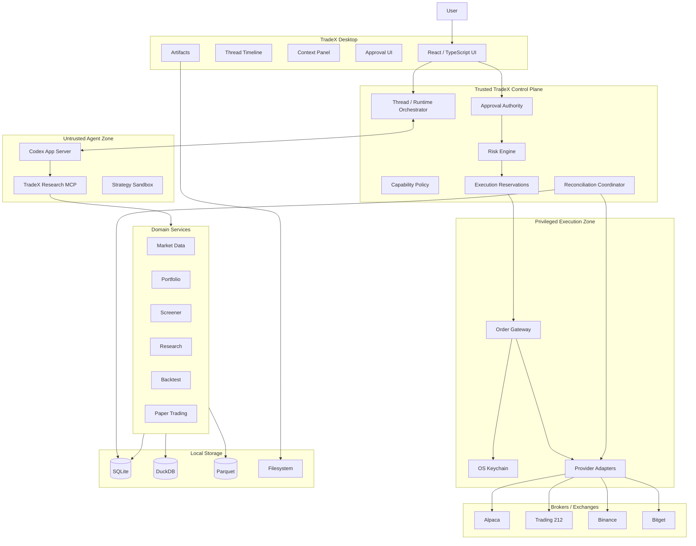

# TradeX Product Requirements Document

**Version:** 1.0 Final — Revision C  
**Date:** 2026-09-05\
**Product:** TradeX  
**Category:** Local-first AI Trading Agent Workspace  
**Primary Runtime Direction:** OpenAI Codex App Server / Codex Harness  
**Status:** Normative product baseline for architecture, UI specification, prototype traceability, QA planning, and MVP implementation  
**Prototype evidence:** [docs/prototype](./prototype/README.md), reviewed at main@6c4b267. The 2026-09-05 clarification updates normative documents; current prototype defects and remaining gates are recorded in the Coverage Matrix and QA Report.

---

This clarification preserves v1.0 scope and FR/AC identifiers. UI Spec §14 refines interaction requirements; Backend ARD §5/§24 and §41–42 specify the Gateway and canonical wire contract. Documentation readiness does not establish prototype/runtime acceptance.

## Revision History

| Version | Date | Summary |
|---|---|---|
| 1.0 Final | 2026-09-04 | Initial final PRD (2,980 lines, 30 chapters). |
| 1.0 RevA | 2026-09-04 | Normative re-baseline: added AC-039–AC-054 and the NFR/SEC/DATA/OPS/UX requirement tables (§62.2–62.5); normalized the order state machine and error taxonomy (§45, §51); added end-to-end state-assertion requirements (§67.5) and implementation phases / open decisions / success criteria (§70–§73); QA and coverage documentation moved from "all Complete" to graded evidence. |
| 1.0 RevB | 2026-09-04 | LLM gateway re-architecture: model access restricted to two sources — local CLIProxyAPI (ChatGPT subscription OAuth → GPT-5.6) and DeepSeek official API key — routed through a single local OpenAI-compatible endpoint (§16, §26.3, §27, §58, §64); OD-009/OD-015 resolved (§72); security additions SEC-007/SEC-008 and Model-credential zone (§17, §62.2); approval/reservation timing hardening (§15, §18, §21.3, §22, §23, §45, §46, §47); MVP storage profile simplification (§32, §54); adapter consolidation (§24); LLM error taxonomy (§51); FR-068–FR-073 and AC-055–AC-058 (§61, §69); privacy disclosure (§56); JTBD/scope/success-criteria updates (§8, §68, §73). |
| 1.0 RevC | 2026-09-04 | Product-state consolidation and prototype alignment: separated Agent Mode from Execution Context (§12–§15); added per-turn immutable context/model snapshots, OrderDraft→OrderProposal semantics, compatibility rules, account-scoped arming, evidence-based reconciliation resolution, provider-permission safety gates, time/FX provenance, and provider capability dimensions; made cross-provider LLM fallback explicit opt-in/manual by default (§16, §26.3, §51, §56); reconciled DuckDB/Parquet and market-data-tier semantics (§32, §54, §63); strengthened FR/AC/NFR/SEC/DATA/OPS/UX traceability and Phase 0 gates; added measurable product success criteria and open-decision ownership/defaults; synchronized UI Spec, Coverage Matrix, QA Report, English/Chinese documentation, and the standalone prototype. |
| 1.0 RevC clarification | 2026-09-05 | Guarded expiry/reservation release, global disarm scope, cancellation identity, Gateway/IPC contract references, corrected evidence grades, and bilingual synchronization; prototype code unchanged. |

## Table of Contents

- §1–§5 Overview: Executive Summary · Problem Statement · Product Vision · Product Goals · Non-Goals
- §6–§8 Principles & Users: Product Principles · Target Users · Jobs to Be Done
- §9–§11 Product Shape: Core User Journeys · Information Architecture · Codex-style UX Model
- §12–§15 Core Models: Thread/Turn/Item Model · Agent Modes & Execution Contexts · Capability Model · Live Trading Account Arming
- §16–§20 Execution Authority: Agent Runtime Architecture · Security Boundary · Financial Approval Model · Order Proposal · Approval UI
- §21–§24 Guardrails: Deterministic Risk Engine · Pre-approval/Pre-execution Validation · Reservations & Concurrency · Broker Adapter Architecture
- §25–§29 Providers & Data: Supported Brokers · Account Connection Model · Credential Security · Market/Instrument Model · Order Quantity Semantics
- §30–§35 Market Data: Instrument Rules · Market Data Architecture & Tiers · Metadata · Entitlements & Licensing · Market Calendar & Corporate Actions
- §36–§40 Research & Backtesting: Research Requirements · Screener Requirements · Portfolio Requirements · Backtesting · Reproducibility Manifest
- §41–§44 Strategy & Trading: Strategy Sandbox · Paper/Demo/Testnet Trading · Live Trading · Market-order Safety
- §45–§51 State & Errors: Order State Model & UI Mapping · Idempotency · Reconciliation · Startup/Crash Recovery · Sleep/Resume · Rate Limits · Error Taxonomy
- §52–§56 Agent & Storage: Prompt Injection · Agent Memory · Local Storage Architecture · Local Data Lifecycle · Privacy Model
- §57–§60 Platform: Observability · Codex Runtime Dependency · Desktop Technology Direction · High-level Architecture
- §61–§64 Requirements: Functional Requirements · Non-functional & Cross-cutting Requirements · Local Resource Constraints · Dependencies
- §65–§69 Governance: Regulatory/API/Data Constraints · Risk Register · Testing Strategy · MVP Scope · MVP Acceptance Criteria
- §70–§73 Execution: Implementation Phases · Future Scope · Open Product Decisions · Product Success Criteria

---

# 1. Executive Summary

TradeX is a **local-first, agent-native trading workspace** for market research, portfolio analysis, backtesting, paper trading, and approval-gated live trading.

Its interaction model is intentionally similar to **OpenAI Codex Desktop**:

- the user works inside persistent agent threads;
- the agent plans work and calls typed tools;
- research, market data, strategy runs, broker reads, and trading actions appear as structured timeline items;
- artifacts such as reports, tables, charts, strategies, and backtests remain attached to the workspace;
- the user can move from research to paper trading or live execution without leaving the thread.

TradeX is not intended to be a conventional trading terminal with an AI chat panel added on top. The **agent thread is the primary workspace object**.

The product supports:

- US equity research and portfolio analysis;
- crypto market research;
- local strategy development and backtesting;
- Alpaca paper trading;
- Trading 212 demo and live equity trading;
- Binance testnet and live spot trading;
- Bitget demo and live spot trading;
- future expansion to additional brokers, exchanges, asset classes, and A-share data sources.

Live trading is designed around a strict safety invariant:

> **The agent can reason about and request a trade, but it never possesses the authority required to execute a live trade.**

Every live order in the MVP must pass deterministic policy and risk checks and receive a one-time explicit user approval before a privileged local Order Gateway may send it to a broker or exchange.

---

# 2. Problem Statement

Active individual traders and quantitative researchers typically work across fragmented tools:

- market-data terminals;
- broker applications;
- charting software;
- notebooks and Python scripts;
- news and research websites;
- strategy repositories;
- backtesting engines;
- spreadsheets;
- AI assistants.

A typical workflow looks like:

```text
Research
   ↓ manual copying
Charts
   ↓ manual comparison
Portfolio
   ↓ manual context reconstruction
Python / Backtest
   ↓ manual interpretation
Broker
   ↓ manual order entry
Trade review
```

This creates several problems:

1. Context is repeatedly lost between tools.
2. Research evidence is disconnected from resulting trades.
3. AI assistants often lack reliable account, market, and strategy state.
4. Generic AI agents are not designed around safe financial execution boundaries.
5. Strategy research and live execution are difficult to reproduce and audit end-to-end.
6. Users repeatedly transform natural-language goals into manual data queries, code, calculations, and orders.
7. Existing trading terminals are powerful but generally not agent-native.

TradeX aims to collapse this workflow into:

```text
Intent
  ↓
Agent Thread
  ↓
Evidence + Deterministic Tools
  ↓
Analysis / Strategy / Backtest
  ↓
Order Proposal
  ↓
Risk Validation
  ↓
User Approval
  ↓
Execution
  ↓
Reconciliation
  ↓
Audit / Review
```

---

# 3. Product Vision

> **TradeX is Codex for markets: a local AI workspace where a user can research, analyze, backtest, paper trade, and safely execute real trades through persistent agent threads.**

The long-term vision is a desktop workspace in which market-related work feels similar to using an advanced coding agent:

- the user expresses intent;
- the agent investigates;
- tools provide deterministic facts;
- execution progress is visible;
- decisions become artifacts;
- state persists across sessions;
- every important action can be inspected and reproduced.

---

# 4. Product Goals

## 4.1 Primary Goals

TradeX v1.0 should:

1. Provide a Codex-style local desktop workspace for market-related agent workflows.
2. Support persistent agent threads with streamed tool execution and structured results.
3. Unify research, portfolio analysis, backtesting, and trading in the same workspace.
4. Support US equities and crypto spot markets in the MVP.
5. Support Alpaca Paper, Trading 212, Binance, and Bitget.
6. Keep primary user data and application state local by default.
7. Isolate broker credentials from the model and agent runtime.
8. Require explicit one-time user approval for every live order.
9. Maintain a deterministic local risk engine independent of the LLM.
10. Recover safely from network failures, broker ambiguity, application crashes, and restarts.
11. Preserve an auditable relationship between research, proposal, approval, broker submission, and resulting fills.
12. Provide a plugin-style architecture for future brokers, exchanges, market-data providers, and agent tools.

---

# 5. Non-Goals

TradeX v1.0 is not intended to provide:

- unattended autonomous live trading;
- high-frequency trading;
- market making;
- copy trading;
- social trading;
- managed accounts;
- trading on behalf of third parties;
- withdrawal or transfer functionality;
- deposit functionality;
- custody;
- leverage management;
- margin borrowing;
- options trading;
- futures live trading;
- institutional OMS/EMS functionality;
- sub-millisecond execution;
- cloud-hosted multi-user collaboration;
- mobile-first execution;
- broker account creation;
- broker KYC workflows;
- investment-adviser or portfolio-management services.

Future releases may expand some market capabilities, but withdrawals, transfers, and custody should remain outside the core product direction.

---

# 6. Product Principles

## 6.1 Local-first

The following should be stored locally by default:

- threads;
- workspace state;
- account metadata;
- portfolio snapshots;
- watchlists;
- research reports;
- strategy source code;
- strategy metadata;
- backtest datasets and outputs;
- order proposals;
- approvals;
- execution logs;
- agent memory;
- market-data cache;
- risk policies;
- artifacts.

A cloud backend is not required for the application to function.

Local-first refers primarily to storage and application architecture. Model inference always involves remote providers: under the RevC LLM policy (§16), all agent context sent for inference leaves the device through exactly one channel — the local CLIProxyAPI endpoint (127.0.0.1:8317) — and is processed either by the ChatGPT subscription backend (GPT-5.6 series) or the DeepSeek API, depending on the selected model. No other data category leaves the device: broker credentials, keychain items, workspace databases, artifacts, and audit logs never leave local storage.

---

## 6.2 Agent-native

The main application model is:

```text
Thread
→ Turn
→ Plan
→ Tool calls
→ Results
→ Artifacts
→ Optional action
```

rather than:

```text
Traditional trading terminal
+
chat sidebar
```

---

## 6.3 Research-first

For non-trivial financial actions, TradeX should encourage:

```text
Evidence
→ Analysis
→ Proposal
→ Action
```

instead of:

```text
Prompt
→ Immediate order
```

---

## 6.4 Safe-by-default Execution

The LLM cannot:

- access raw broker secrets;
- directly send authenticated broker orders;
- self-authorize execution;
- weaken risk limits;
- approve its own orders.

Live execution always passes through trusted local components outside the agent authority boundary.

---

## 6.5 Structured-data First

Large provider payloads should be normalized before reaching the model.

The model should receive compact typed data instead of:

- unrestricted account JSON;
- full tick streams;
- raw order-book deltas;
- complete historical datasets.

---

## 6.6 Broker State Is Authoritative

For live activity:

> Broker or exchange state is authoritative. TradeX maintains a local projection of that state.

Local state must never be assumed correct after ambiguous network failures or restarts without reconciliation.

---

## 6.7 Human Approval Is Transaction-specific

User approval for live trading is:

- single-use;
- proposal-specific;
- account-specific;
- action-specific;
- time-limited.

Generic tool approvals, session approvals, or model-level permissions cannot authorize a live financial transaction.

---

# 7. Target Users

## 7.1 Persona A — Technical Discretionary Trader

Characteristics:

- actively researches US equities and/or crypto;
- understands trading concepts;
- wants AI-assisted analysis;
- may use multiple accounts;
- still wants manual control over live execution.

Primary needs:

- faster research;
- portfolio-aware analysis;
- evidence-backed proposals;
- clear execution preview;
- one workspace for research and trading.

---

## 7.2 Persona B — Quantitative Researcher / Developer

Characteristics:

- comfortable with Python or TypeScript;
- develops systematic ideas;
- cares about reproducibility;
- uses historical testing before paper or live trading.

Primary needs:

- strategy workspace;
- deterministic backtests;
- datasets and artifacts;
- comparison of strategy versions;
- clear separation between signal generation and execution.

---

## 7.3 Persona C — Multi-venue Crypto Trader

Characteristics:

- uses Binance and/or Bitget;
- compares venue liquidity;
- monitors spreads, funding, OI, and balances;
- may maintain multiple crypto accounts.

Primary needs:

- unified venue context;
- normalized asset and order representation;
- venue-aware market data;
- explicit live/testnet separation;
- fast account and order reconciliation.

---

## 7.4 Explicit Non-target Users

The MVP is not designed for:

- institutional trading desks;
- market makers;
- financial advisers managing client money;
- users expecting fully autonomous wealth management;
- complete beginners relying on the agent as a substitute for financial education;
- latency-sensitive arbitrage.

---

# 8. Jobs to Be Done

Users should be able to use TradeX to:

1. Investigate an instrument or market event.
2. Compare several instruments or venues.
3. Understand current portfolio exposure.
4. Screen a market universe using natural language.
5. Save a thesis as an artifact.
6. Generate or modify a strategy.
7. Backtest a strategy locally.
8. Compare backtest runs.
9. Simulate or paper trade.
10. Prepare a live order.
11. Review risk impact before trading.
12. Approve or reject a live trade.
13. Monitor submission, partial fills, fills, cancellation, or rejection.
14. Recover from uncertain order state.
15. Review why a trade was made.
16. Resume prior research without reconstructing context.
17. Configure and manage AI reasoning sources (ChatGPT subscription via CLIProxyAPI, DeepSeek API key), including health, quota, and fallback visibility.

---

# 9. Core User Journeys

## 9.1 Research to Paper Trade

Example:

> Compare NVDA, AMD, and AVGO. Check momentum, recent earnings, valuation, and my current exposure. If NVDA remains the strongest candidate, buy $500 in Alpaca Paper.

Flow:

```text
User request
→ market data
→ research
→ portfolio read
→ comparison
→ decision artifact
→ paper risk check
→ Alpaca Paper submission
→ broker update
→ fill
```

---

## 9.2 Research to Trading 212 Live Order

Example:

> Review AAPL and my current portfolio. Prepare a limit order for two shares if the resulting single-stock exposure remains under 10%.

Flow:

```text
Research
→ account snapshot
→ quote
→ risk evaluation
→ immutable proposal
→ approval card
→ user approval
→ pre-execution revalidation
→ Trading 212 submission
→ reconciliation
```

---

## 9.3 Binance Spot Trade

Example:

> Compare BTC liquidity on Binance and Bitget. Prepare a 0.01 BTC Binance spot buy on the better venue if spread remains below my limit.

Flow:

```text
venue market data
→ liquidity comparison
→ selected venue
→ proposal
→ risk checks
→ approval
→ pre-execution validation
→ submission
→ private stream / REST reconciliation
```

---

## 9.4 Bitget Demo Validation

Example:

> Run my BTC breakout strategy on the last 12 months, then use Bitget Demo for the next valid signal.

Flow:

```text
strategy load
→ historical data
→ backtest
→ result artifact
→ demo mode
→ signal
→ demo order
→ fill update
```

---

## 9.5 Existing Position Review

Example:

> Review all my live positions across Trading 212, Binance, and Bitget. Tell me what changed since yesterday and which thesis needs attention.

Expected result:

- unified portfolio view;
- position-level market context;
- thesis links;
- important changes;
- no trading unless explicitly requested.

---

## 9.6 Critical Failure and Recovery Journeys

The MVP must also make the following non-happy-path journeys first-class:

1. provider authentication expires while a live account is selected;
2. LLM sidecar or model provider becomes unavailable during a thread;
3. a live approval expires or is invalidated by market/risk-policy change;
4. a second thread conflicts with already-reserved cash/exposure;
5. a live submission times out after leaving TradeX and becomes ambiguous;
6. the app restarts with open or unknown live orders;
7. a live cancellation races with a partial fill;
8. a restored workspace contains account references but no broker secrets;
9. market data is stale, delayed, closed, halted, or time synchronization is outside tolerance.

Each journey must end in an explicit authoritative state, a deterministic remediation path, and an audit event.

---

# 10. Product Information Architecture

TradeX uses a deliberately small primary navigation so the product remains an agent workspace rather than becoming a module-heavy trading terminal.

Primary navigation:

```text
New Thread
Threads
Markets
Watchlists
Accounts
Strategies
Artifacts
Settings
```

`Settings` contains secondary configuration destinations:

```text
Providers & Models
Risk & Limits
Data & Storage
Account Health
Appearance
About
```

Context-driven views may open from the primary workspace without becoming first-level navigation:

- Portfolio;
- Orders;
- Backtests;
- Account details;
- Instrument details;
- Artifact provenance;
- Recovery / reconciliation state.

`Markets` is retained as a first-level discovery entry because screener and instrument discovery are recurring workflows. Portfolio and Orders remain account/context surfaces rather than permanent top-level modules.

---

# 11. Codex-style UX Model

## 11.1 Primary Layout

```text
┌───────────────────────────────────────────────────────────────────────────┐
│ Workspace              Current Context                  PAPER / LIVE       │
├──────────────┬─────────────────────────────────────┬──────────────────────┤
│              │                                     │                      │
│ Threads      │ Agent Timeline                      │ Context              │
│              │                                     │                      │
│ Today        │ User                                │ Quote                │
│ Yesterday    │ Plan                                │ Chart                │
│ Saved        │ Tool Call                           │ Position             │
│              │ Research                            │ Open Orders          │
│ Watchlists   │ Chart                               │ Exposure             │
│ Accounts     │ Backtest                            │ Evidence             │
│ Strategies   │ Order Proposal                      │ Risk                 │
│ Artifacts    │ Approval                            │                      │
│              │ Order Update                        │                      │
│              │ Fill                                │                      │
├──────────────┴─────────────────────────────────────┴──────────────────────┤
│ @Context     Account      Mode      Model                        Send      │
└───────────────────────────────────────────────────────────────────────────┘
```

---

## 11.2 Composer

Composer controls:

```text
@ Context
Account
Mode
Model
```

Example context chips:

```text
@AAPL
@BTC/USDT
@Trading212-Live
@Binance-Live
@Momentum-v3
@Backtest-2026-09-01
```

Switching to Live changes the visible environment but does not authorize execution.

---

## 11.3 Thread Timeline

The center timeline should show:

- user messages;
- agent messages;
- plans;
- tool calls;
- structured results;
- artifacts;
- warnings;
- risk checks;
- order proposals;
- approvals;
- submissions;
- fills;
- errors;
- reconciliation state.

Users should be able to expand technical details while seeing compact summaries by default.


## 11.4 Thread History and Persistent Work Navigation

The left rail must expose recent and saved Threads so that the workspace behaves like a persistent agent workbench rather than a stateless chat surface.

Minimum UX:

```text
Threads
  Today
    US tech earnings analysis
    BTC liquidity setup
  Yesterday
    Portfolio risk review
    AAPL thesis refresh
  Saved
```

Requirements:

- thread history is locally persisted;
- selecting a thread restores linked account, instrument, strategy, artifact, and mode context where appropriate;
- resuming a thread never restores a previously consumed or expired live execution approval;
- users can create a new thread without losing prior thread state.

## 11.5 Context, Account, Agent Mode, and Model Pickers

The composer controls are interactive product primitives, not decorative labels.

`@ Context` opens a picker for:

- instruments;
- accounts;
- strategies;
- backtest runs;
- artifacts.

The Account picker must clearly distinguish Paper / Demo / Testnet / Live connections.

The Model picker changes the reasoning model only. It must never alter trading permissions, risk limits, or live-execution authorization. Switching models takes effect on the next turn and never mutates an in-flight turn; each turn records the model and provider that produced it. Models are displayed with their provider origin (CLIProxyAPI local gateway vs DeepSeek API).

Selecting `Live` mode changes the tool/capability context but does not arm live execution.

## 11.6 Agent Tool and Turn States

The prototype and implementation must visibly support:

```text
Tool: Running
Tool: Completed
Tool: Failed
Tool: Retrying
Turn: Cancelled
Turn: Interrupted
```

A failed read-only tool must not be presented as a financial-state mutation. Users must be able to retry or cancel the affected turn.

## 11.7 Responsive Product Behavior

The primary product is a desktop application. Responsive rules apply to narrow desktop and tablet-class windows, not to a separate native mobile execution product.

Responsive layouts must preserve:

- thread access;
- core market/account context;
- Paper / Demo / Testnet / Live distinction;
- live-arming state for the selected account;
- approval safety information;
- the ability to reject a live order;
- the ability to disable live execution.

On narrow windows, secondary inspectors may collapse below the main content, but live approval details must never be hidden behind hover-only or desktop-only UI.

TradeX v1.0 does **not** ship a native mobile live-execution client. A future mobile companion remains read-only unless separately reviewed.

## 11.8 Accessibility and Destructive-action Keyboard Safety

Core product surfaces must be keyboard reachable and expose a visible focus state.

For live financial actions:

- pressing `Enter` in a composer, picker, modal, or form must never implicitly approve a live order or cancellation;
- live approval requires activation of the explicit approval control while that control has focus;
- `Escape` may close/reject a dismissible approval surface but must never approve it;
- color is never the sole indicator of Paper / Demo / Testnet / Live or execution state;
- status changes such as `SUBMITTING`, `FILLED`, `REJECTED`, and `UNKNOWN_RECONCILING` should be exposed to assistive technology as status updates;
- reduced-motion preferences must be respected for non-essential animation.

# 12. Thread, Turn, and Item Model

Each user task maps to a persistent agent Thread. A Thread contains one or more Turns; a Turn contains typed Items.

A Thread stores long-lived navigation/default context, not the authoritative historical state of every turn:

```text
workspace_id
codex_thread_id
title
created_at
updated_at
default_agent_mode
linked_accounts[]
linked_instruments[]
linked_strategies[]
linked_artifacts[]
```

Every Turn stores an **immutable start snapshot** so replay/audit does not depend on later picker changes:

```text
turn_id
agent_mode_at_start
selected_account_id?
execution_context_at_start
capability_level_at_start
model_id
model_provider
provider_attempts[]
attached_context_ids[]
attached_context_hashes[]
started_at
completed_at?
```

Financial Items additionally reference the immutable policy and market context used for authority decisions:

```text
proposal_id / proposal_hash
policy_version
market_snapshot_id
reservation_id?
approval_id?
execution_attempt_id?
```

Recommended domain Item types:

```text
user_message
agent_message
plan
tool_call
tool_result
market_snapshot
research_evidence
portfolio_snapshot
chart
screener_result
strategy
backtest_result
order_draft
order_proposal
risk_check
approval_request
reservation
order_submitted
order_update
fill
position_update
warning
error
artifact
```

Item lifecycle:

```text
started
streaming
completed
failed
```

A resumed Thread may restore current defaults and attached context, but it never restores a consumed/expired approval, a stale market snapshot, or an `ARMED` state.

---

# 13. Agent Modes and Execution Contexts

TradeX separates **what the agent is doing** from **where execution could occur**. These are orthogonal product states and must not be encoded in one enum.

## 13.1 Agent Modes

| Agent Mode | Purpose | Execution authority |
|---|---|---|
| Ask | lightweight questions / quick analysis | none |
| Research | deeper market + portfolio research | none |
| Backtest | strategy research | historical simulation only |
| Trade | prepare/inspect a current-market transaction | determined by selected execution context, risk, arming, and approval |

Agent Mode controls tool exposure and workflow density. Selecting `Trade` by itself grants no execution authority.

## 13.2 Execution Context

Execution Context is derived from the selected account/environment and the current Agent Mode:

```text
NONE / READ_ONLY
HISTORICAL_SIMULATION
LOCAL_PAPER
ALPACA_PAPER
TRADING212_DEMO
TRADING212_LIVE
BINANCE_TESTNET
BINANCE_LIVE
BITGET_DEMO
BITGET_LIVE
```

A live account can be attached to Ask/Research as **read-only context**. The same account becomes execution-capable only in Trade mode and only after all safety gates pass.

## 13.3 Compatibility Rules

| Agent Mode | No account | Paper/Demo/Testnet account | Live account |
|---|---|---|---|
| Ask | public/read-only | read-only context | read-only context |
| Research | public/read-only | read-only context | read-only context |
| Backtest | historical simulation | optional portfolio seed only; no broker execution | optional portfolio seed only; no broker execution |
| Trade | must select an execution account | simulated/provider-hosted execution | proposal → risk → account arming → transaction approval → execution |

The UI must disable or explain illegal combinations rather than silently changing authority.

## 13.4 Ask Mode Rules

Ask mode is intentionally lighter than Research mode:

- may use public market data and explicitly attached read-only context;
- does not expose current-market paper/live execution tools;
- does not create a research artifact by default;
- may be promoted by the user to Research, Backtest, or Trade when deeper work is required.

Selecting a live account in Ask/Research, or selecting Trade mode, does **not** arm that account.

---

# 14. Capability Model

| Level | Capability |
|---|---|
| C0 | Public market data |
| C1 | Account read |
| C2 | Backtest |
| C3 | Paper/demo execution |
| C4 | Live order proposal |
| C5 | Live execution after explicit user approval |
| C6 | Unattended live execution |

C6 is out of scope.

The LLM cannot promote its own capability level.

---

# 15. Live Trading Account Arming State

Live arming is **account-scoped**, not a single workspace-wide permission.

Each live account has an independent state:

```text
Trading 212 Live   DISARMED
Binance Live       DISARMED
Bitget Live        DISARMED
```

For one account:

```text
DISARMED
   ↓ explicit user action for that exact account
ARMED
   ↓
live proposals may proceed to transaction-specific approval
```

Arming one live account does not arm any other live account.

Live execution remains transaction-specific and approval-gated while an account is ARMED.

TradeX automatically returns the affected live account to `DISARMED` after:

- application restart;
- OS sleep or session lock;
- credential change;
- account health degradation (single trigger source covering: authentication failure with provider reconnection, reconciliation failure, failed pre-approval/pre-execution checks, unhealthy broker state);
- risk-policy weakening;
- configured inactivity timeout.

Any risk-policy change that can affect pending live proposals invalidates approvals for the affected account. Weakening policy additionally disarms that live account.

The UI must provide:

- a clearly visible `LIVE · <Account> · ARMED/DISARMED` state;
- a per-account **Disable Live** action;
- a global **Disable All Live Execution** action that immediately disarms all live accounts for new submissions.

---

### 15.1 Disarm scope and in-flight work

Application restart, OS sleep/session lock, and Disable All disarm every Live account. Account-specific health/credential failures affect that account; policy changes affect all accounts bound to the changed policy. UI selection does not determine the affected set. Disable All revokes pending approvals/dispatch grants for undispatched work and prevents new transmissions. An attempt that may already have crossed the trusted dispatch boundary retains capacity and is reconciled, rather than being assumed cancelled. Apply §45 before releasing any reservation. Recovery requires health revalidation and a separate explicit Arm; it never restores prior consent.

---

# 16. Agent Runtime Architecture

TradeX uses **Codex App Server / Codex Harness** as the primary agent runtime (protocol layer: thread lifecycle, turn execution, item streaming, tool calls, generic approvals).

## 16.1 Model Access Policy (RevC)

Model inference is restricted to exactly two sources, routed through one local OpenAI-compatible endpoint:

1. **CLIProxyAPI** (local gateway, pinned version): ChatGPT subscription OAuth (`--codex-login`) → GPT-5.6 series;
2. **DeepSeek official API**: `deepseek-chat` / `deepseek-reasoner`, configured as a CLIProxyAPI upstream with the key injected from the OS keychain.

No other model provider is permitted in v1.0. All model traffic terminates at `127.0.0.1:8317`; direct external LLM connections from TradeX, Codex, strategy code, or research tools are prohibited (SEC-007).

```text
TradeX Desktop (React/Tauri)
      │ JSON-RPC / JSONL over local IPC
      ▼
Codex App Server ─── model_provider ───► CLIProxyAPI (127.0.0.1:8317)
      │                                  ├─ ChatGPT OAuth → GPT-5.6
      │                                  └─ DeepSeek official API → deepseek-*
      │
      └──────── TradeX Control Plane
                 Risk / Approval / Reservations / Order Gateway / Reconciliation
```

The Control Plane never depends on model availability.

## 16.2 CLIProxyAPI Sidecar Lifecycle

CLIProxyAPI runs as a **user-level sidecar managed by the TradeX Rust control plane**:

- start/supervise/restart with backoff;
- pin and surface the sidecar version;
- probe `/v1/models`; failed probe marks the model chain unhealthy;
- port conflict on 8317 maps to `MODEL_UNAVAILABLE`;
- keep model credentials in the sidecar credential domain only; broker credentials never cross into it (SEC-008).

## 16.3 Provider Routing, Fallback, and Failure Modes

Cross-provider fallback changes the external processor that receives model input, so **automatic cross-provider fallback is OFF by default**.

Default behavior:

- an in-flight turn keeps the provider/model snapshot it started with;
- OAuth expiry or sustained quota exhaustion pauses/fails the affected model attempt and surfaces remediation;
- the user may `Re-login`, `Retry`, or explicitly `Switch to DeepSeek` for the next attempt/turn;
- provider/model changes are recorded in `provider_attempts[]` and the audit trail;
- no provider switch may change capability level, account arming, risk limits, or approval requirements.

An optional setting, **Allow automatic fallback to DeepSeek**, may be enabled explicitly by the user. When enabled, TradeX may retry an eligible failed model attempt through DeepSeek, but must visibly disclose the provider change and record both attempts.

| Failure | Behavior |
|---|---|
| Sidecar not running / port occupied | agent turns pause with `MODEL_UNAVAILABLE` + remediation; trading/approval/reconciliation unaffected |
| ChatGPT OAuth expired (401) | `OAUTH_EXPIRED`; re-login or explicit provider switch; optional auto fallback only if user enabled it |
| ChatGPT quota exhausted (429) | `QUOTA_EXCEEDED`; cooldown/retry or explicit provider switch; optional auto fallback only if enabled |
| DeepSeek unavailable | affected DeepSeek turns pause/fail; no silent switch back to ChatGPT unless explicitly configured |
| Both providers unavailable | agent turns disabled; non-model trading control-plane operations continue |

---

# 17. Security Boundary

TradeX should separate three trust zones.

```text
┌─────────────────────────────┐
│ Untrusted Agent Zone        │
│                             │
│ Codex App Server            │
│ Research MCP tools          │
│ Strategy sandbox            │
│ Workspace files             │
└──────────────┬──────────────┘
               │
               │ proposals / reads
               ▼
┌─────────────────────────────┐
│ TradeX Control Plane        │
│                             │
│ Capability policy           │
│ Risk Engine                 │
│ Approval authority          │
│ Execution reservations      │
│ Reconciliation coordinator  │
└──────────────┬──────────────┘
               │
               │ scoped execution capability
               ▼
┌─────────────────────────────┐
│ Privileged Execution Zone   │
│                             │
│ Order Gateway               │
│ Keychain access             │
│ Broker adapters             │
└─────────────────────────────┘

┌─────────────────────────────┐
│ Model-credential Zone       │
│ (RevC)                      │
│                             │
│ CLIProxyAPI sidecar         │
│ ChatGPT OAuth tokens        │
│ DeepSeek API key (rendered) │
│                             │
│ Holds ONLY model            │
│ credentials — never broker  │
│ credentials (SEC-008)       │
└─────────────────────────────┘
```

Security invariants:

> Codex can request financial execution but cannot directly access the privileged gateway or credentials.

> Model inference traffic has exactly one exit — the local CLIProxyAPI endpoint — and the Model-credential zone is separate from the Privileged Execution Zone (SEC-007, SEC-008).

---

# 18. Financial Approval Model

Trade approvals are a TradeX authorization mechanism.

Generic Codex approval mechanisms may be used to pause a turn and render UI, but they must not themselves authorize live financial execution.

A valid live approval is:

- bound to one proposal hash;
- bound to one account;
- bound to one operation;
- bound to one user action;
- short-lived;
- single-use.

Example:

```yaml
proposal_id: ordp_01
proposal_hash: sha256(...)
account_id: trading212-live
operation: PLACE_ORDER
expires_at: 2026-09-04T15:15:00Z
nonce: ...
```

Any material order change invalidates the approval.

Each approval additionally carries the `policy_version` in effect at approval time. `PRE_EXECUTION_CHECK` revalidates that the account's current policy version still matches; a mismatch invalidates the approval. Expiration/invalidation releases an existing account-scoped reservation atomically only when the trusted execution boundary confirms that submission has not begun. Once submission may have begun, local approval expiry cannot release capacity or replace broker order state; apply the guarded rules in §45.

---

For cancellation, the financial approval binds an immutable cancellation_intent_id/intent_hash instead of a new-order proposal_id/proposal_hash. The intent fixes operation=CANCEL, account/environment, provider order identity, and the fresh remaining-order snapshot. Arming and navigation cannot change the operation (§43.3).

---

# 19. Order Draft and Immutable Order Proposal

The agent or user may first create an editable `OrderDraft`. A draft has no approval authority.

```text
OrderDraft (editable)
→ Generate Proposal
→ OrderProposal (immutable id + hash)
→ Risk / Approval / Reservation / Execution
```

Any edit after proposal generation creates a **new proposal_id/proposal_hash**. The prior proposal and any approval remain in audit history but become unusable.

Example immutable proposal:

```yaml
proposal_id: ordp_01
account_id: trading212-live
venue: TRADING212
environment: LIVE
instrument_id: equity:US:AAPL
side: BUY
order_type: LIMIT
quantity:
  type: BASE
  value: 2
limit_price: 221.50
time_in_force: DAY
estimated_notional:
  amount: 443.00
  currency: USD
market_snapshot_id: ms_01
policy_version: risk_v7
status: NEEDS_APPROVAL
```

---

# 20. Approval UI

Every live order approval must show both the immutable transaction and the exact market snapshot used for approval.

Example:

```text
LIVE ORDER

Trading 212 Live
BUY 2 AAPL
Limit: $221.50
Estimated value: $443.00

MARKET SNAPSHOT
Quote: $221.42
Venue: NASDAQ
Source: MarketDataProvider-X
Provider timestamp: 14:42:18.201
TradeX received: 14:42:18.312
Entitlement: REALTIME
Quote age: 111 ms
Freshness: HEALTHY

Available cash: €...
Projected AAPL concentration: 8.4%

Risk checks
✓ Account connected
✓ Account reconciled
✓ Instrument tradable
✓ Quantity valid
✓ Position limit valid
✓ Daily exposure valid
✓ Reservation capacity valid
✓ Duplicate-order protection valid
✓ Quote freshness valid

[Reject]                         [Approve & Place Order]
```

Approval requirements:

- the approval control is visually distinct from ordinary chat/send controls;
- source, provider timestamp, TradeX received timestamp, realtime/delayed entitlement, venue, and freshness state are mandatory when market data is used to approve execution;
- delayed data must be labeled `DELAYED` and cannot satisfy a realtime-only execution policy;
- material changes to account, instrument, side, quantity/notional, order type, price, time-in-force, or market snapshot validity invalidate approval;
- keyboard behavior follows §11.8 and must never make `Enter` an implicit live approval shortcut.

---

# 21. Deterministic Risk Engine

The Risk Engine operates independently of the model.

## 21.1 User-configurable Risk Policy

User-configurable controls may include:

- maximum order notional;
- maximum order quantity;
- maximum position size;
- maximum single-instrument concentration;
- maximum asset-class exposure;
- maximum daily traded notional;
- maximum daily realized loss;
- maximum number of open orders;
- maximum reserved capital;
- allowed instruments;
- blocked instruments;
- allowed venues;
- allowed accounts;
- market-order enable/disable;
- maximum market-order slippage;
- maximum price deviation;
- stale-price threshold;
- paper/live environment constraints.

The agent cannot modify these controls.

## 21.2 System-enforced Hard Safety Rules

The following are not user-bypassable policy preferences:

- proposal identity / approval binding;
- duplicate-order protection;
- decimal/precision validation;
- provider instrument-rule validation;
- authoritative broker-state reconciliation;
- unhealthy-account execution blocking;
- stale market-snapshot blocking;
- account-scoped reservation correctness;
- no blind retry after ambiguous non-idempotent submission;
- privileged Order Gateway isolation.

## 21.3 Risk-policy Change Behavior

A risk-policy save must be treated as a security-relevant event.

For the affected live account:

```text
Save risk policy
→ invalidate pending live approvals that could be affected
→ re-evaluate pending proposals
→ if policy is weakened: DISARM account
→ persist audit event
```

The UI must explicitly state when a previously approved transaction is no longer valid because policy changed.

Policy saves and approval consumption for the same account are serialized through a per-account single-writer path, eliminating save-vs-consume races: a save that lands between approval issuance and consumption is caught by the policy-version check at `PRE_EXECUTION_CHECK`.

---

# 22. Pre-approval and Pre-execution Validation

Every live order goes through two deterministic checks.

```text
PRE_APPROVAL_CHECK
```

before approval.

Then:

```text
PRE_EXECUTION_CHECK
```

immediately before submission.

The second stage revalidates:

- price freshness;
- available cash;
- position state;
- open orders;
- risk reservations;
- account connectivity;
- instrument status;
- market state.

If a material condition changed — including a `policy_version` mismatch (§18) — the original approval becomes invalid and the user must approve a refreshed proposal.

---

# 23. Execution Reservations and Concurrency

Concurrent threads must not independently consume the same available cash or exposure.

Before live execution, TradeX accounts for current holdings, open orders, approved-but-not-submitted orders, submitted-but-unconfirmed orders, reserved cash/exposure, and pending cancellations. Execution capacity is reserved atomically **per account**.

```text
Trading 212 Live cash = €10,000
Thread A reserves €4,000
Effective available = €6,000
Thread B evaluates against €6,000, not €10,000
```

If the second proposal exceeds effective capacity, deterministic risk returns `RISK_REJECTED` with a reservation-capacity reason before approval.

Reservation lifecycle:

```text
APPROVED
→ RESERVED
→ SUBMITTING
→ ACCEPTED / REJECTED / UNKNOWN_RECONCILING
→ release or adjust only from authoritative resolution
```

`UNKNOWN_RECONCILING` freezes the reservation. After the bounded automatic reconciliation window (default 5 minutes), the order remains `UNKNOWN_RECONCILING`, the account becomes unhealthy/disarmed, and TradeX opens **Manual Resolution** — never a blind “release reservation” button.

Manual Resolution options are evidence-based:

1. **Confirmed not submitted** — requires provider/account evidence; reservation may be released, but account health must still be revalidated before live execution resumes;
2. **Confirmed submitted** — record/link the broker order identity and reconcile/adjust the reservation from broker state;
3. **Keep reconciling** — leave reservation frozen and continue query-first reconciliation.

A mere local/user assertion cannot make an ambiguous account healthy. Expiration/invalidation before submission releases the reservation atomically.

The UI exposes `Available`, `Reserved`, and `Effective Available` where they explain a block.

---

# 24. Broker Adapter Architecture

Do not force every provider into one oversized interface.

Recommended interfaces (RevC: instrument metadata is folded into the market-data adapter — metadata is low-frequency market data; the ExecutionAdapter stays separate because of the privileged boundary):

```ts
interface AccountAdapter {}
interface ExecutionAdapter {}
interface MarketDataAdapter {}   // includes instrument metadata / rules
interface AccountStreamAdapter {}
```

Capability discovery should be explicit.

Example:

```ts
interface BrokerCapabilities {
  accountRead: boolean
  positionRead: boolean
  publicMarketData: boolean
  privateAccountStream: boolean
  orderTypes: string[]
  fractionalQuantity: boolean
  notionalOrders: boolean
  extendedHours: boolean
  clientOrderId: boolean
  paperEnvironment: boolean
  liveEnvironment: boolean
}
```

The UI and agent tool surface should adapt to provider capabilities.

---

# 25. Supported Brokers and Exchanges

## 25.1 Alpaca

MVP role:

> Primary US equity paper-trading environment.

Required capabilities:

- paper account;
- balances;
- buying power;
- positions;
- orders;
- fills;
- paper create/cancel;
- compatible equity market data where available.

Alpaca live trading is not required in v1.0.

---

## 25.2 Trading 212

MVP role:

> Initial live US/equity broker integration.

Required capabilities where supported by the user's account/API environment:

- account information;
- instruments;
- positions;
- open orders;
- order history;
- supported order types;
- cancel order;
- demo environment;
- live environment.

TradeX should treat provider features as capability-driven because the Public API may evolve.

Automatic blind retry of non-idempotent order submission is prohibited.

---

## 25.3 Binance

MVP role:

> Crypto spot testnet and live execution.

Required capabilities:

- spot market data;
- balances;
- spot orders;
- spot fills;
- public WebSocket;
- private account/order stream;
- Spot Testnet;
- live spot.

Not included:

- margin;
- futures;
- leverage changes.

---

## 25.4 Bitget

MVP role:

> Crypto spot demo and live execution.

Required capabilities:

- spot market data;
- balances;
- spot orders;
- fills;
- demo environment;
- live environment;
- private order/account updates where supported.

Not included:

- futures;
- leverage changes;
- margin.

---

# 26. Account Connection Model

Settings → Accounts:

```text
+ Connect Account

US Equities
  Alpaca Paper
  Trading 212 Demo
  Trading 212 Live

Crypto
  Binance Testnet
  Binance Live
  Bitget Demo
  Bitget Live
```

Each account displays:

- provider;
- environment;
- account type;
- connection health;
- capability set;
- last successful sync;
- permission scope;
- live trading enabled/disabled;
- risk policy;
- credential health;
- optional API IP restriction status.

Demo and live accounts must be represented as different connections.


## 26.1 Provider Connection Workflow

Connecting an account is a multi-step user workflow rather than a generic hard-coded API-key form.

Required sequence:

```text
Select provider/environment
→ render provider-defined credential schema
→ enter credentials in trusted UI
→ test authentication
→ detect account type and capabilities
→ display requested/available permissions
→ confirm connection
→ persist only credential reference + non-secret metadata locally
```

The provider adapter supplies a credential/capability schema so the UI can support provider-specific fields such as:

- API key;
- secret;
- passphrase;
- account identifier;
- environment selector;
- other provider-required non-secret metadata.

The UI must not assume every provider uses the same `API Key + Secret` shape. Provider schemas also declare field sensitivity, validation, environment applicability, help text, and whether a permission is required/optional/forbidden.

The connection UX must explicitly show that TradeX does not require or implement:

- withdrawals;
- transfers;
- custody;
- margin borrowing;
- leverage management.

For providers supporting IP allow-listing, the UX should recommend it.

Permission safety gate:

- detected withdrawal/transfer/custody permissions are **forbidden** for a TradeX live connection and block execution readiness until removed;
- margin/leverage-management permissions are out of scope and surface a blocking or unsupported-capability warning;
- where a provider cannot expose permission introspection, TradeX labels permission scope `UNVERIFIED`, requires explicit user acknowledgement, and keeps the limitation visible in Account Health;
- connection tests persist only non-secret capability/permission metadata plus keychain references.

## 26.2 Provider-specific Account Detail

Account detail screens must reflect actual provider capabilities instead of presenting one generic broker page.

At minimum, the product surface must represent:

- Alpaca Paper;
- Trading 212 Demo;
- Trading 212 Live;
- Binance Testnet;
- Binance Live;
- Bitget Demo;
- Bitget Live.

Each account view should show where available:

- environment;
- account type;
- account health;
- balances/equity;
- positions;
- open orders;
- last successful sync;
- last reconciliation;
- detected permission/capability set;
- credential health;
- risk policy summary;
- optional IP allow-list status;
- live arming state where relevant.

## 26.3 LLM Provider Connection Model (RevC)

LLM providers follow the same schema-driven connection pattern as broker providers (§26.1), with two v1.0 sources (OD-015 resolved):

| Provider | Credential | Connection flow | Health signal |
|---|---|---|---|
| CLIProxyAPI (local gateway) | none held by TradeX — ChatGPT OAuth lives in the sidecar auth-dir | sidecar install/launch → `--codex-login` browser authorization → probe `/v1/models` → model list discovery | sidecar running + probe OK |
| DeepSeek official API | API key in OS keychain (injected into sidecar config by the Rust layer, §27) | key entry → keychain storage → probe + test inference | probe OK + key valid |

Connection UI shows: sidecar state (Running / Stopped / Port conflict / Unauthorized), per-provider model availability, pinned version, current provider/model, and fallback policy. LLM providers never appear in the broker account picker and never grant trading capabilities. Onboarding cannot reach Ready without at least one usable LLM provider (AC-055). Cross-provider automatic fallback is an explicit opt-in and is OFF by default (§16.3).

# 27. Credential Security

Requirements:

1. Broker credentials are stored only in OS credential storage.
2. Credentials never appear in normal workspace files.
3. Credentials never appear in SQLite, DuckDB, Parquet, artifacts, or thread history.
4. The model never receives broker credentials.
5. Credentials are injected only inside the privileged provider signing layer.
6. Logs redact API keys, secrets, signatures, tokens, and auth headers.
7. TradeX should require only minimum API permissions.
8. Withdrawal and transfer permissions are not required.
9. TradeX should recommend API IP restrictions when providers support them.
10. Demo/test credentials and live credentials are separate.
11. ChatGPT subscription OAuth tokens live only in the CLIProxyAPI sidecar auth-dir; TradeX never reads, stores, or transmits them (§16.2).
12. The DeepSeek API key is stored in the OS keychain and rendered by the Rust control plane into the sidecar config at launch (file mode 0600, cleared on exit); it never appears in workspace files, SQLite, logs, or thread history.
13. Model-provider api-keys (including any downstream key configured on the sidecar) are treated as secrets under NFR-004 and §27.6 log-redaction rules.

---

# 28. Market and Instrument Model

TradeX requires canonical instrument identifiers independent of provider symbols.

Equity example:

```yaml
instrument_id: equity:US:AAPL
asset_class: EQUITY
symbol: AAPL
exchange: XNAS
currency: USD
isin: optional
providers:
  alpaca: AAPL
  trading212: provider_specific_id
```

Crypto example:

```yaml
instrument_id: crypto:BTC/USDT:spot
asset_class: CRYPTO_SPOT
base: BTC
quote: USDT
providers:
  binance: BTCUSDT
  bitget: BTCUSDT
```

Provider identifiers must not leak into portfolio or strategy domain logic.

---

# 29. Order Quantity Semantics

Never normalize every order to a single ambiguous `quantity`.

Use:

```ts
type OrderQuantity =
  | { type: "BASE"; value: Decimal }
  | { type: "QUOTE"; value: Decimal }
  | { type: "NOTIONAL"; value: Decimal }
```

Provider adapters perform explicit conversion.

All financial calculations must use decimal arithmetic rather than binary floating point.

---

# 30. Instrument Rules Service

TradeX should maintain venue-specific trading constraints:

- tick size;
- price precision;
- quantity step;
- quantity precision;
- minimum quantity;
- maximum quantity;
- minimum notional;
- maximum notional;
- allowed order types;
- market-order constraints;
- trading status.

Order flow:

```text
User intent
→ normalized order
→ InstrumentRulesService
→ Risk Engine
→ approval
→ pre-execution validation
→ broker adapter
```

Invalid orders should fail before reaching the broker whenever possible.

---

# 31. Market Data Architecture

Market data is separate from broker execution.

```text
Broker APIs
    → account + execution truth

Market Data Providers
    → quotes / bars / book / market state

Research Providers
    → news / filings / fundamentals / events
```

TradeX should not assume each broker is also a complete market-data provider.

---

# 32. Market Data Access Tiers and MVP Persistence

The product uses access/subscription tiers to control resource use. These are **not** storage-engine choices.

| Tier | Scope | Typical behavior |
|---|---|---|
| Census | broad universe, coarse snapshots | on-demand/universe queries |
| Warm | watchlists/candidates | periodic/coarse refresh; not tick subscriptions |
| Hot | currently viewed/actively monitored | memory + short buffer / active stream |
| Cold | historical research/backtest | on-demand persisted historical data |

Default data behavior:

- raw ticks/order-book deltas: memory/short optional buffer;
- 1-minute and higher OHLCV: persistent;
- daily/fundamental data: persistent and versioned;
- funding/OI: sampled history;
- broker account/order events: persistent audit.

TradeX never subscribes to every supported instrument at tick-level by default.

**MVP persistence profile (RevC):**

- SQLite: transactional/domain state and financial audit;
- DuckDB: persistent 1-minute+ OHLCV, analytical tables/features, screener materializations, and MVP backtest outputs;
- Filesystem: artifacts, strategies, exports, backups;
- Parquet: optional/Phase 2+ for large immutable historical datasets and interchange; not required for v1.0 MVP correctness.

MVP runtime supports Hot active subscriptions plus on-demand watchlist/universe refresh. Persistent always-on Warm subscriptions and a fully materialized Census universe are deferred until justified by resource measurements.

---

# 33. Market Data Metadata

Every market snapshot used by the product should carry:

```text
source
provider timestamp
TradeX received timestamp
realtime/delayed status
instrument
venue
data quality / freshness state
```

The UI must not present delayed data as realtime.

### Time synchronization requirements

TradeX maintains a `TimeService` for quote age, approval TTLs, reconciliation windows, and audit ordering. It records wall-clock and monotonic time, detects material clock jumps, estimates provider/server offset where available, and exposes `CLOCK_SKEW`/stale-state remediation when configured tolerance is exceeded. Live approval/execution is blocked when time uncertainty makes freshness/TTL checks unreliable.

---

# 34. Market-data Entitlements and Licensing

Each market-data integration must explicitly define:

- realtime vs delayed status;
- entitlement requirements;
- permitted local retention;
- redistribution restrictions;
- commercial/non-commercial terms;
- supported jurisdictions.

TradeX should not assume that locally caching market data automatically grants redistribution rights.

---

# 35. Market Calendar and Corporate Actions

For equities, TradeX requires:

- exchange holidays;
- half days;
- regular sessions;
- extended-hours sessions;
- trading halts;
- stock splits;
- dividends;
- symbol changes;
- delistings.

Services:

```text
MarketCalendarService
CorporateActionsService
```

The product UI must surface market-state information where it affects research or order eligibility, including:

```text
OPEN / CLOSED / EXTENDED HOURS / HALTED
next open/close timestamp
upcoming known corporate action
adjustment status for historical data
```

`MARKET_CLOSED` and `INSTRUMENT_HALTED` are deterministic states. When the requested order type/session does not permit execution, TradeX blocks progression before live approval rather than relying on the model to infer eligibility.

For crypto, market-state logic should account for:

- venue maintenance;
- instrument suspension;
- degraded trading services.

---

# 36. Research Requirements

The agent should support:

- company/instrument research;
- peer comparison;
- portfolio-aware analysis;
- event research;
- market summaries;
- thesis tracking;
- evidence collection;
- natural-language screening;
- crypto venue comparison.

Research outputs should retain source metadata and timestamps.

External research content must be treated as untrusted input.

---

# 37. Screener Requirements

Natural language should be converted to a structured query.

```text
User request
   ↓
FilterSpec / RankSpec
   ↓
Visible parsed interpretation
   ↓
DuckDB / feature tables
   ↓
Candidate reduction
   ↓
Selective external fetch
   ↓
Agent analysis
```

The model should not receive complete provider datasets for thousands of instruments.

Users should be able to inspect the interpreted filter before saving a screener.


## 37.1 Screener Builder UX

The screener flow must make the agent interpretation inspectable before execution.

Example:

```text
Natural-language request
→ Parsed FilterSpec / RankSpec
→ User can inspect/edit
→ Run structured query
→ Candidate table
→ Optional agent deep research on reduced candidate set
```

The high-fidelity prototype should demonstrate at least one complete screener creation and results flow.


---

# 38. Portfolio Requirements

TradeX should aggregate:

- balances;
- holdings;
- positions;
- open orders;
- fills;
- realized P&L;
- unrealized P&L;
- exposure;
- account currency;
- venue.

Cross-account portfolio calculations require FX normalization into the user-configured **Workspace Base Currency**.

Every value should be representable as:

```text
Native value
Account-currency value
Workspace-base-currency value
FX source
FX provider timestamp
TradeX received timestamp
FX freshness state
```

The UI may use EUR as fixture data, but product requirements must not hard-code EUR. Users must be able to inspect the FX source and timestamp used for aggregated portfolio values.

---

## 38.1 FX and Stablecoin Valuation

Cross-account valuation must never assume `USDT = USD = workspace currency`. FX/stablecoin conversions record source, pair/path, provider timestamp, TradeX received timestamp, freshness, and any depeg/quality warning. A stale or materially dislocated stablecoin conversion may degrade portfolio analytics and must block live risk calculations that depend on an unreliable conversion.

---

# 39. Backtesting

Backtesting remains local and deterministic.

MVP functionality:

- OHLCV strategies;
- market orders;
- limit orders;
- stop orders where supported by simulation model;
- configurable commission;
- configurable slippage;
- cash accounting;
- position accounting;
- equity curve;
- drawdown;
- Sharpe;
- Sortino;
- win rate;
- profit factor;
- turnover;
- trade list.

Backtests must be reproducible.

---

# 40. Backtest Reproducibility Manifest

Each saved run should record:

```yaml
strategy_version: ...
strategy_hash: ...
dataset_hash: ...
data_provider: ...
retrieved_at: ...
adjustment_method: ...
timezone: ...
market_calendar_version: ...
commission_model: ...
slippage_model: ...
starting_cash: ...
engine_version: ...
```

Backtesting should explicitly guard against:

- look-ahead bias;
- survivorship bias where relevant;
- incorrect split handling;
- incorrect dividend handling;
- timezone mismatch;
- data gaps.

Paper and backtest results must not be presented as equivalent to expected live performance.

---

# 41. Strategy Sandbox

Agent-generated strategy code must execute in a restricted environment.

Strategy code may access:

- approved historical datasets;
- predefined numerical libraries;
- strategy state;
- local workspace strategy files.

Strategy code may not access:

- OS keychain;
- broker secrets;
- raw live execution gateway;
- arbitrary network endpoints;
- unrestricted filesystem paths.

A live strategy produces a signal, not an executable broker request.

Example:

```yaml
signal:
  instrument: crypto:BTC/USDT:spot
  direction: BUY
  desired_exposure: 0.05
```

TradeX then applies normal proposal, risk, approval, and execution logic.


## 41.1 Strategy Run UX

The strategy workspace must visibly distinguish:

```text
Draft / Editor
Queued
Running
Completed
Failed
Cancelled
```

Users should be able to compare two saved backtest runs, including:

- parameter differences;
- return;
- Sharpe;
- drawdown;
- number of trades;
- dataset/reproducibility metadata.


---

# 42. Paper / Demo / Testnet Trading

TradeX supports two simulation families.

## 42.1 Local Simulation

`Local Paper` is an explicit v1.0 TradeX-managed simulation account. It is distinct from broker-hosted Paper/Demo/Testnet connections and never represents provider execution truth.


TradeX-owned deterministic simulation for:

- strategy testing;
- reproducible scenarios;
- venue-independent paper workflows.

## 42.2 Broker-hosted Paper / Demo / Testnet

MVP environments:

- Alpaca Paper;
- Trading 212 Demo where supported;
- Binance Spot Testnet;
- Bitget Demo.

The UI must clearly distinguish local simulation from broker-hosted simulation.

The product/prototype must represent a complete generic broker-hosted simulation lifecycle rather than only account cards:

```text
Select Demo/Testnet account
→ create supported simulated order
→ provider acknowledgement
→ order update/fill simulation
→ account/position update
```

Provider-specific variants may reuse the same normalized UI components while retaining explicit environment labels.

Paper/demo/testnet results must never be presented as equivalent to expected live execution quality.

---

# 43. Live Trading

Live trading supports:

- account read;
- proposal generation;
- risk validation;
- user approval;
- order submission;
- cancellation;
- reconciliation;
- trade review.

Live trading does not support unattended execution in v1.0.


## 43.1 Explicit Live Arming Workflow

Preparing a live order while the account/session is `DISARMED` must not automatically arm execution.

Required flow:

```text
Live order requested
→ TradeX detects DISARMED state
→ Explicit Arm Live Trading confirmation
→ Session becomes ARMED
→ Generate/show transaction-specific proposal
→ Separate transaction approval
```

Arming is not equivalent to order approval.

## 43.2 Live Order Identity Continuity

The same immutable proposal must remain identifiable throughout:

```text
Proposal
→ Approval
→ Reservation
→ Submission
→ Broker acknowledgement
→ Partial fill
→ Fill / cancellation / rejection
→ Reconciliation
```

The UI must never approve one instrument/account/order and then display monitoring state for a different transaction.

## 43.3 Live Cancellation

Cancellation of an open live order is a privileged live action.

Required flow:

```text
Open order
→ Request cancellation
→ Refresh broker state
→ Transaction-specific cancellation approval
→ CANCEL_PENDING
→ Broker confirmation
→ CANCELLED
```

TradeX must warn that an order may continue to fill until the broker confirms cancellation.

## 43.4 Order Amendment / Replace Scope

v1.0 does not expose broker-native amend/replace as a shortcut around approval. To change a live open order: refresh broker state → approve cancellation → confirm authoritative cancellation/remaining fill state → generate a new `OrderProposal` → obtain a new approval.

## 43.5 Live Failure States

The product must visibly represent at least:

- `RISK_REJECTED`;
- `REJECTED` by broker/exchange;
- `EXPIRED` approval;
- `UNKNOWN_RECONCILING`;
- authentication failure;
- private-stream disconnection;
- startup reconciliation.


---

# 44. Market-order Safety

Market orders require stronger preview information.

Approval should include:

```text
best bid / ask
spread
quote age
estimated notional
estimated fees
slippage assumption
maximum approved notional
```

Example:

```text
BUY BTC MARKET

Expected: ≈ €620
Maximum authorized spend: €630
Quote age: 280 ms
Spread: 1.7 bps
```

If actual required spend would exceed the approved hard limit, TradeX rejects submission.

---

# 45. Order State Model and UI Mapping

Canonical normalized domain states:

```text
DRAFT
PROPOSED
RISK_REJECTED
NEEDS_APPROVAL
APPROVED
RESERVED
SUBMITTING
ACCEPTED
PARTIALLY_FILLED
FILLED
CANCEL_PENDING
CANCELLED
REJECTED
EXPIRED
UNKNOWN_RECONCILING
```

`REJECTED` is the canonical order state for broker/exchange rejection. `SUBMISSION_REJECTED` is an error category explaining why the state became `REJECTED`; `BROKER_REJECTED` must not be introduced as a third machine state.

Approval expiry and broker order expiry are distinct events. An expired approval is never reusable, but expiry does not by itself prove that an order was not submitted. Every expiry event records its scope (`approval` or `broker_order`), authority/evidence reference, and reservation disposition; emit a reservation-release event only for capacity actually released.

| Trigger and known execution state | Authoritative transition | Reservation disposition |
|---|---|---|
| Approval expires/is invalidated before any transmission can have begun, including `RESERVED` work atomically stopped before dispatch | Approval Authority invalidates consent; the unsubmitted proposal may end as `EXPIRED` with a reason | Release any existing reservation atomically; no reservation means no fabricated release |
| Local approval expires after `SUBMITTING`, or transmission outcome is uncertain | Expire the approval record only; keep the observed order state or `UNKNOWN_RECONCILING` | Keep capacity frozen until authoritative reconciliation |
| Broker confirms terminal order expiry, cancellation, rejection, or fill | Adapter/reconciliation applies the broker state and cumulative fills | Account for fills/fees and release only the unused remainder, exactly once |
| Automatic reconciliation times out or the user closes Manual Resolution | Keep `UNKNOWN_RECONCILING`; account remains unhealthy/DISARMED | No release |
| Manual Resolution verifies provider evidence of no submission | Resolve the execution attempt as not submitted; retain its audit history and revalidate account health | Release atomically from the verified evidence; arming remains an explicit later action |

Cancellation acknowledgement is not terminal cancellation. `CANCEL_PENDING` and partial fills retain the remaining commitment until broker evidence permits adjustment. Restart, sleep, clock uncertainty, and Disable All cannot bypass these rules (§15, §23, §47–49).

Minimum UI mapping:

| Domain State | Required UI Representation |
|---|---|
| `DRAFT` | editable order/request draft |
| `PROPOSED` | immutable Order Proposal card |
| `RISK_REJECTED` | deterministic risk block with reason |
| `NEEDS_APPROVAL` | transaction-specific approval surface |
| `APPROVED` | approval event in timeline/audit |
| `RESERVED` | reservation event / reserved capacity where relevant |
| `SUBMITTING` | pending broker submission state |
| `ACCEPTED` | broker acknowledged, explicitly not a fill |
| `PARTIALLY_FILLED` | filled + remaining quantity |
| `FILLED` | authoritative completed fill state |
| `CANCEL_PENDING` | cancellation requested, fill race warning |
| `CANCELLED` | authoritative broker cancellation |
| `REJECTED` | broker/exchange rejection with error category |
| `EXPIRED` | approval/order expiry; no reuse |
| `UNKNOWN_RECONCILING` | ambiguous state; blind retry blocked |

TradeX must distinguish broker acknowledgement from fill.

---

# 46. Idempotency

TradeX assigns an internal logical order identity to every order.

Recommended fields:

```text
tradex_order_id
proposal_id
execution_attempt_id
provider_client_order_id?
broker_order_id?
```

Provider client-order identifiers are used where supported but are not the sole idempotency mechanism.

A timeout after submission must not automatically trigger a duplicate POST.

For adapters whose provider does not support client order identifiers, retry is allowed only after a **query-first** pass: scan the provider's open-order/order-history for the logical order identity and confirm no matching order exists, then resubmit under a new execution attempt id. This rule is contract-tested per adapter (§67.2).

---

# 47. Reconciliation

Live execution follows:

```text
WebSocket / provider event stream
   ↓ fast state updates

REST reconciliation
   ↓ correctness fallback

Local event store
   ↓ durable projection / audit
```

On ambiguous submission:

```text
SUBMITTING
   ↓ timeout / uncertain response
UNKNOWN_RECONCILING
   ↓
query broker state
   ↓
resolve or require user review
```

TradeX must not silently infer fill, rejection, or cancellation.

Reconciliation of an ambiguous submission runs automatically for a bounded window (default 5 minutes). On timeout, the order remains `UNKNOWN_RECONCILING`, the reservation stays frozen, the account is marked unhealthy/disarmed, and the UI opens the evidence-based Manual Resolution flow defined in §23. There is no unaudited “release and continue trading” shortcut.

---

# 48. Startup and Crash Recovery

After restart:

```text
Local order projection
      +
Broker account snapshot
      +
Open orders
      +
Recent order history
      ↓
Reconciliation
      ↓
Fresh local projection
```

Live execution remains disabled until reconciliation succeeds.

Pending approvals should expire on restart unless explicitly designed otherwise.

---

# 49. Sleep / Resume / Connectivity

Desktop environments introduce:

- laptop sleep;
- Wi-Fi change;
- VPN change;
- clock drift;
- temporary offline state.

On resume:

```text
invalidate freshness
→ reconnect streams
→ resynchronize provider/server time
→ refresh account state
→ reconcile open orders
→ mark account healthy
```

TradeX should fail closed for new live orders until the account is healthy.

---

# 50. Rate-limit Management

A central Provider Rate Limiter should manage API budgets.

Suggested priority:

```text
P0 execution reconciliation
P1 account refresh
P2 active market monitoring
P3 research/history fetch
```

Low-priority agent research must not starve execution reconciliation.

LLM quotas (CLIProxyAPI subscription limits, DeepSeek API rate limits) are managed separately from provider API budgets: CLIProxyAPI's internal round-robin/cooldown absorbs transient subscription limits, and sustained LLM throttling or unavailability degrades agent turns per §16.3 without ever blocking execution reconciliation, approvals, or reconciliation traffic (P0/P1 above).

---

# 51. Error Taxonomy

TradeX classifies errors deterministically.

Canonical categories:

```text
AUTH_ERROR
PERMISSION_ERROR
RATE_LIMITED
NETWORK_ERROR
UNSUPPORTED_CAPABILITY
MARKET_CLOSED
INSTRUMENT_HALTED
INVALID_ORDER
INSUFFICIENT_FUNDS
RISK_REJECTED
SUBMISSION_REJECTED
SUBMISSION_AMBIGUOUS
STREAM_DISCONNECTED
STATE_STALE
RECONCILIATION_REQUIRED
MODEL_UNAVAILABLE
QUOTA_EXCEEDED
OAUTH_EXPIRED
INTERNAL_ERROR
```

Naming rule:

```text
Order state: REJECTED
Error category: SUBMISSION_REJECTED
User-facing label: Broker rejected order
```

The UI should use one reusable error/status component family with category-specific remediation rather than inventing extra machine states.

Minimum remediation examples:

- `AUTH_ERROR` → reconnect credentials; live execution disabled;
- `PERMISSION_ERROR` → show missing permission/capability;
- `RATE_LIMITED` → backoff and preserve reconciliation priority;
- `MARKET_CLOSED` / `INSTRUMENT_HALTED` → block unsupported execution and show market state;
- `INSUFFICIENT_FUNDS` → show available vs required capacity including reservations;
- `STATE_STALE` / `RECONCILIATION_REQUIRED` → disable live execution until refreshed;
- `SUBMISSION_AMBIGUOUS` → transition to `UNKNOWN_RECONCILING`, no blind retry;
- `MODEL_UNAVAILABLE` → pause agent turns with sidecar remediation guidance (§16.3); approvals/execution/reconciliation unaffected;
- `QUOTA_EXCEEDED` → show quota state; offer cooldown/retry and explicit switch to DeepSeek; optional automatic fallback only when the user enabled it;
- `OAUTH_EXPIRED` → mark the ChatGPT route unavailable; show re-login and explicit switch actions; optional automatic fallback only when enabled;
- time/freshness uncertainty → map to `STATE_STALE` / `RECONCILIATION_REQUIRED` with clock/time remediation rather than inventing a conflicting order state.

The model may explain an error but does not assign its authoritative category.

---

# 52. Prompt Injection and Untrusted Content

All external content is untrusted:

- news;
- websites;
- filings;
- reports;
- user-imported strategy code;
- external research documents.

Rules:

```text
Untrusted content
      ↓
may influence analysis

cannot:
modify permissions
modify risk limits
authorize execution
access secrets
invoke privileged gateway
```

HTML or external content rendered in the desktop app must be sanitized.

---

# 53. Agent Memory

Memory is local and scoped.

Suitable memory:

- preferred markets;
- preferred analytical frameworks;
- watchlist intent;
- thesis definitions;
- saved strategy assumptions;
- user-selected base currency.

Memory must not contain:

- API keys;
- auth tokens;
- signing material;
- execution authorization.

Live trading authorization is never inferred from memory.

---

# 54. Local Storage Architecture

## SQLite — transactional/domain state

Use for workspaces, Thread/Turn mappings, accounts metadata, watchlists, strategy/backtest metadata, Local Paper state, order drafts/proposals, approvals, reservations, execution/reconciliation events, portfolio snapshots, risk policies, settings, and memory.

## DuckDB — MVP analytical and historical store

Use for persistent 1-minute+ OHLCV, screener materializations, feature joins, portfolio analytics, historical features, MVP backtest datasets/results, and large local analytical queries.

## Parquet — optional large-dataset/interchange layer

Parquet is **not required for v1.0 MVP**. Introduce it when immutable historical/backtest datasets become large enough to justify file partitioning/interchange. DuckDB must be able to read/write those datasets without changing the domain interfaces.

## Filesystem

```text
~/.tradex/
  workspaces/
  artifacts/
  strategies/
  datasets/
  logs/
  broker-cache/
  backups/
  exports/
```

Secrets are excluded. Workspace retention rules must treat unresolved execution/reconciliation records separately from ordinary artifacts/cache; unresolved financial audit records cannot be auto-deleted.

---

# 55. Local Data Lifecycle

TradeX should provide:

- versioned database schema;
- transactional migrations;
- backup before migration;
- corruption detection;
- workspace export;
- workspace import/restore;
- configurable artifact retention;
- configurable market-data retention;
- secure removal of credential references.

Workspace import/restore must:

- validate manifest/schema version before applying changes;
- never import raw broker secrets from the workspace archive;
- restore credential references only when the corresponding OS-keychain entry still exists;
- preserve audit/provenance identifiers where possible;
- require reconciliation before re-enabling live execution after restore.

Broker state remains recoverable from the broker even if local projections are damaged.

## 55.1 Artifact Provenance and Export

Every exported decision artifact should preserve enough metadata to reconnect the result to its source context.

At minimum, provenance should include where applicable:

- workspace and thread ID;
- turn/item ID;
- model/runtime identifier;
- tool calls used;
- source references and timestamps;
- market snapshot IDs/hashes;
- dataset / backtest manifest hash;
- related proposal/order IDs;
- creation timestamp.

---

# 56. Privacy Model

TradeX should classify data by disclosure boundary.

```text
LOCAL_ONLY
never leaves device

AGENT_CONTEXT
may be sent to configured model

BROKER_ONLY
sent only to broker/exchange

SECRET
never sent to model
```

Users should be able to inspect which account/context objects are attached to an agent thread.

RevC disclosure note: `AGENT_CONTEXT` leaves the device through exactly one channel — the local CLIProxyAPI endpoint (§16.1) — and is processed either by the ChatGPT subscription backend or by DeepSeek, each governed by its own privacy policy. The Model picker surfaces this provenance so users can make an informed choice per task; broker credentials, keychain items, and `SECRET`-class data never enter the LLM chain.

Future privacy option:

- mask absolute account values;
- expose only normalized percentages to the model.

---

## 56.1 Per-turn External Processor Disclosure

Before send, the composer surfaces the provider path for the next turn (for example `CLIProxyAPI → ChatGPT` or `CLIProxyAPI → DeepSeek`). If provider routing changes, TradeX records and visibly discloses the change. Automatic cross-provider fallback is never implied by selecting a model and remains opt-in (§16.3).

---

# 57. Observability

Observability is local by default.

Track:

- Codex turn latency;
- tool latency;
- token usage;
- market-data freshness;
- WebSocket connection health;
- reconnect count;
- broker REST latency;
- rate-limit state;
- order acknowledgement latency;
- fill convergence latency;
- reconciliation failures;
- unknown-order count;
- risk rejection count;
- provider error rate;
- local storage growth.

External telemetry must be opt-in.

Secrets must be redacted before logs are persisted.

---

# 58. Codex Runtime Dependency

TradeX should pin a tested Codex App Server version.

Requirements:

```text
Pinned App Server version
Generated protocol schemas
Compatibility tests
Schema diff on upgrade
Controlled runtime upgrade
```

Experimental protocol surfaces should not be required for MVP unless necessary.

App Server overload or queue backpressure should be handled gracefully with retry/backoff at the client layer.

TradeX should not track Codex `main` directly in production releases.

RevC baseline — CLIProxyAPI gateway dependency: the CLIProxyAPI version is pinned with the application and treated identically to the App Server (compatibility tests, schema/config diff on upgrade, controlled upgrade). The Rust control plane supervises the sidecar lifecycle (§16.2); a CLIProxyAPI upgrade that changes endpoints or auth behavior requires a compatibility test pass before release.

---

# 59. Desktop Technology Direction

Recommended stack:

- Tauri;
- React;
- TypeScript;
- local Rust control layer;
- TanStack Query;
- Zustand or equivalent state management;
- SQLite;
- DuckDB;
- Parquet;
- system keychain;
- lightweight financial charting library.

Python may be used as a separate local process where mature quant/scientific libraries justify it.

Electron remains a fallback if delivery speed outweighs footprint.

---

# 60. High-level Architecture



---

# 61. Functional Requirements

| ID | Requirement | Priority |
|---|---|---:|
| FR-001 | Run a pinned Codex App Server locally | P0 |
| FR-002 | Support persistent Thread / Turn / Item UX | P0 |
| FR-003 | Stream agent and tool activity in real time | P0 |
| FR-004 | Resume prior threads | P0 |
| FR-005 | Render structured financial timeline cards | P0 |
| FR-006 | Implement TradeX typed domain tools | P0 |
| FR-007 | Separate trusted control plane from agent zone | P0 |
| FR-008 | Implement OS keychain credential storage | P0 |
| FR-009 | Implement canonical instrument model | P0 |
| FR-010 | Implement provider capability discovery | P0 |
| FR-011 | Implement market-data service | P0 |
| FR-012 | Implement market-data freshness metadata | P0 |
| FR-013 | Implement portfolio aggregation | P0 |
| FR-014 | Implement account-currency and FX normalization | P0 |
| FR-015 | Implement Alpaca Paper adapter | P0 |
| FR-016 | Implement Trading 212 Demo/Live adapter | P0 |
| FR-017 | Implement Binance Testnet/Live Spot adapter | P0 |
| FR-018 | Implement Bitget Demo/Live Spot adapter | P0 |
| FR-019 | Implement OrderProposal model | P0 |
| FR-020 | Implement deterministic Risk Engine | P0 |
| FR-021 | Implement pre-approval validation | P0 |
| FR-022 | Implement pre-execution validation | P0 |
| FR-023 | Implement account-scoped atomic execution reservations | P0 |
| FR-024 | Implement single-use live approval | P0 |
| FR-025 | Implement privileged Order Gateway | P0 |
| FR-026 | Implement idempotency and reconciliation | P0 |
| FR-027 | Implement account-scoped live arming/disarming + global disable-all | P0 |
| FR-028 | Implement crash/startup reconciliation | P0 |
| FR-029 | Implement local execution audit trail | P0 |
| FR-030 | Implement provider rate limiting | P0 |
| FR-031 | Implement local backtesting | P0 |
| FR-032 | Implement strategy sandbox | P0 |
| FR-033 | Implement paper/demo/testnet trading workflows | P0 |
| FR-034 | Implement deterministic error taxonomy and UI mapping | P1 |
| FR-035 | Implement natural-language screener | P1 |
| FR-036 | Implement artifacts | P1 |
| FR-037 | Implement strategy versioning | P1 |
| FR-038 | Implement market calendar and corporate actions | P1 |
| FR-039 | Implement configurable data retention | P1 |
| FR-040 | Implement workspace export/import | P1 |
| FR-041 | Add futures support | P2 |
| FR-042 | Add A-share research/data integration | P2 |
| FR-043 | Add additional brokers/exchanges | P2 |
| FR-044 | Implement complete five-step onboarding flow | P0 |
| FR-045 | Implement interactive thread history and resume navigation | P0 |
| FR-046 | Implement context/account/model pickers | P0 |
| FR-047 | Implement provider connection test + permission/capability review | P0 |
| FR-048 | Implement provider-specific account-detail variants | P0 |
| FR-049 | Implement live order cancellation approval lifecycle | P0 |
| FR-050 | Implement explicit Risk Rejected / Broker Rejected / Approval Expired UI states | P0 |
| FR-051 | Implement startup/auth/stream-disconnected recovery states | P0 |
| FR-052 | Implement market-order maximum-authorized-notional approval UI | P0 |
| FR-053 | Implement complete natural-language screener builder flow | P1 |
| FR-054 | Implement backtest running/failed/compare states | P1 |
| FR-055 | Implement artifact provenance surface | P1 |
| FR-056 | Implement Ask mode with no execution capability | P0 |
| FR-057 | Implement complete live-approval market snapshot provenance | P0 |
| FR-058 | Implement risk-policy-change approval invalidation lifecycle | P0 |
| FR-059 | Implement reservation-conflict UI/reasoning surface | P0 |
| FR-060 | Implement complete Demo/Testnet order lifecycle variants for Trading 212, Binance, and Bitget | P0 |
| FR-061 | Implement complete normalized order-state UI mapping including `RESERVED` | P0 |
| FR-062 | Implement market-session / halt / corporate-action product surfaces | P1 |
| FR-063 | Implement workspace import/restore workflow | P1 |
| FR-064 | Implement complete canonical error-remediation surfaces | P1 |
| FR-065 | Implement portfolio FX provenance display | P1 |
| FR-066 | Implement full backtest metric set including Sortino, profit factor, and turnover | P1 |
| FR-067 | Implement provider-schema-driven credential/configuration forms | P1 |
| FR-068 | Implement LLM provider connection workflow (CLIProxyAPI OAuth / DeepSeek key), schema-driven per §26.3 | P0 |
| FR-069 | Implement CLIProxyAPI sidecar lifecycle: launch/supervise/health-check (`/v1/models` probe)/backoff restart/port-conflict handling | P0 |
| FR-070 | Implement subscription quota display and exhaustion handling (provider-reported windows where available; in-flight attempt behavior; explicit switch/retry) | P0 |
| FR-071 | Implement LLM error categories and recovery states (`MODEL_UNAVAILABLE` / `QUOTA_EXCEEDED` / `OAUTH_EXPIRED`) with remediation UI | P0 |
| FR-072 | Record per-turn model/provider provenance and write model switches/degradations to the audit trail | P0 |
| FR-073 | Implement model routing/fallback policy: cross-provider automatic fallback OFF by default, explicit opt-in, full audit/disclosure, and no capability change | P0 |
| FR-074 | Separate Agent Mode from Execution Context and enforce the compatibility matrix | P0 |
| FR-075 | Persist immutable per-turn mode/account/execution/model/provider/context snapshots | P0 |
| FR-076 | Implement evidence-based Manual Resolution for `UNKNOWN_RECONCILING`; no blind reservation release | P0 |
| FR-077 | Implement TimeService clock-skew/freshness/TTL safeguards for live authority decisions | P0 |
| FR-078 | Block/review dangerous provider permissions (withdrawal/transfer/custody/margin/leverage) before live readiness | P0 |
| FR-079 | Implement FX/stablecoin valuation provenance and depeg/quality handling | P1 |
| FR-080 | Implement editable OrderDraft → immutable OrderProposal regeneration semantics | P0 |

Requirement-overlap notes (for traceability, IDs are kept stable):

- FR-034 ⊂ FR-050 ⊂ FR-064: FR-034 is the taxonomy/data model; FR-050 is the P0 safety-state subset; FR-064 is the complete remediation surface set.
- FR-035 and FR-053 describe the same screener capability at two completion levels: FR-035 = working flow, FR-053 = complete builder (edit parsed FilterSpec, ranking, persistence).

---

# 62. Non-functional and Cross-cutting Requirements

## 62.1 Non-functional Requirements

| ID | Requirement | MVP Target |
|---|---|---|
| NFR-001 | UI render after received runtime event | p95 < 100 ms (measured from IPC event arrival to UI commit; sampled over representative interactions) |
| NFR-002 | Tool-card render after result received | p95 < 100 ms (same measurement boundary as NFR-001) |
| NFR-003 | Crash restart to reconciliation start | < 5 s |
| NFR-004 | Secret leakage into logs | 0 (CI runs a secret scanner over representative log corpora; zero findings is the acceptance gate) |
| NFR-005 | Unapproved live order submissions | 0 |
| NFR-006 | Duplicate live submissions caused by TradeX retry | 0 |
| NFR-007 | Silent assumption of ambiguous broker state | 0 |
| NFR-008 | Open live orders reconciled after restart | 100% |
| NFR-009 | Live approval market snapshots include source, provider timestamp, TradeX received timestamp, venue, entitlement, and freshness | 100% |
| NFR-010 | Live execution requires healthy account state | 100% |
| NFR-011 | Material order change invalidates approval | 100% |
| NFR-012 | Any relevant risk-policy change invalidates affected pending approvals; weakening policy disarms the affected live account | 100% |
| NFR-013 | External telemetry is disabled by default and requires explicit opt-in | 100% |
| NFR-014 | Financial price/quantity/notional calculations use decimal-safe arithmetic | 100% |
| NFR-015 | Core desktop UI is keyboard reachable with visible focus; `Enter` never implicitly approves a live transaction | 100% |
| NFR-016 | Narrow-window layouts preserve live safety information; v1.0 ships no native mobile live-execution client | 100% |

| NFR-017 | Turn/provider provenance is complete for every agent turn | 100% |
| NFR-018 | Live freshness/TTL checks use synchronized time semantics and fail closed on unacceptable clock uncertainty | 100% |
| NFR-019 | Ambiguous submissions cannot be locally released into a healthy/live-ready state without authoritative/evidence-based resolution | 100% |

## 62.2 Security Requirements

| ID | Requirement |
|---|---|
| SEC-001 | Model cannot access raw broker secrets or OS-keychain values. |
| SEC-002 | Agent/Codex runtime cannot directly call the privileged Order Gateway. |
| SEC-003 | Generic Codex approvals cannot authorize financial execution. |
| SEC-004 | Strategy sandbox cannot access broker credentials, keychain, privileged gateway, or unrestricted network. |
| SEC-005 | Untrusted external content cannot alter risk policy, authority, credentials, or approve execution. |
| SEC-006 | Live approvals are account/action/proposal-bound, short-lived, and single-use. |
| SEC-007 | All model inference traffic has exactly one exit: the local CLIProxyAPI endpoint (127.0.0.1:8317). TradeX, Codex, and the strategy sandbox must not connect to any external LLM endpoint directly. |
| SEC-008 | The CLIProxyAPI sidecar holds only model credentials (ChatGPT OAuth, rendered DeepSeek key); it must never hold or receive broker credentials, keychain broker items, or Order Gateway capabilities. |
| SEC-009 | A Live broker connection with withdrawal/transfer/custody permissions detected must not become execution-ready until those permissions are removed; TradeX must not use unsupported margin/leverage permissions. |

## 62.3 Data Integrity Requirements

| ID | Requirement |
|---|---|
| DATA-001 | Domain logic uses canonical instrument IDs; provider symbols remain adapter mappings. |
| DATA-002 | Price, quantity, and notional calculations use decimal-safe representations. |
| DATA-003 | Market snapshots retain source, provider timestamp, TradeX received timestamp, venue, entitlement, and freshness. |
| DATA-004 | Cross-account valuation records workspace-base currency, FX source, timestamp, and freshness. |
| DATA-005 | Market-data provider metadata includes entitlement, retention, and redistribution constraints. |
| DATA-006 | Backtests persist reproducibility manifests including strategy/data hashes and adjustment/calendar assumptions. |
| DATA-007 | Every Turn persists an immutable Agent Mode, Execution Context, account, model/provider, and attached-context provenance snapshot. |
| DATA-008 | FX/stablecoin normalized valuation persists source/path/timestamps/freshness and quality/depeg state. |

## 62.4 Operational Requirements

| ID | Requirement |
|---|---|
| OPS-001 | Broker/exchange state is authoritative for live positions, orders, and fills. |
| OPS-002 | Ambiguous non-idempotent submissions are reconciled before any retry. |
| OPS-003 | Startup/resume/reconnect performs reconciliation before new live execution. |
| OPS-004 | Provider rate limiting prioritizes execution reconciliation above research/history traffic. |
| OPS-005 | Execution reservations are atomic and account-scoped across concurrent threads. |
| OPS-006 | Desktop builds are packaged and code-signed through a repeatable release pipeline. |
| OPS-007 | Auto-update and crash reporting are explicit product surfaces; crash reports contain no broker secrets and telemetry follows NFR-013 opt-in. |
| OPS-008 | An `UNKNOWN_RECONCILING` reservation remains frozen after automated timeout and may only be resolved through audited Manual Resolution. |
| OPS-009 | TimeService detects material wall-clock jumps/skew and blocks Live freshness/TTL authority decisions until trusted time is restored. |

## 62.5 UX Safety Requirements

| ID | Requirement |
|---|---|
| UX-001 | Selecting Trade mode or a Live execution context never arms execution. |
| UX-002 | Live arming is explicit and account-scoped; arming one broker account does not arm another. |
| UX-003 | Live approval displays immutable order identity and market-data provenance. |
| UX-004 | Paper / Demo / Testnet / Live states use explicit text in addition to color. |
| UX-005 | Keyboard interaction cannot implicitly approve live order or cancellation. |
| UX-006 | Primary navigation is New Thread / Threads / Markets / Watchlists / Accounts / Strategies / Artifacts / Settings. |
| UX-007 | Responsive behavior is for narrow desktop/tablet-class windows; native mobile execution is out of v1.0 scope. |
| UX-008 | Agent Mode and Execution Context are visibly distinct; illegal combinations are disabled or explained. |
| UX-009 | Cross-provider model fallback is visibly disclosed before/when it occurs and is not enabled by default. |
| UX-010 | Manual Resolution never presents an unsafe generic “release reservation and continue” action. |

---

# 63. Local Resource Constraints

Default behavior avoids excessive local resource use.

```text
Hot active instruments: <= 20 by default
Watchlists/candidates: on-demand or coarse refresh; no persistent tick subscriptions by default
Raw order book: memory only unless explicitly enabled
Historical data: lazy/on-demand fetch
DuckDB historical cache: configurable size/retention warnings
Parquet: optional for large immutable datasets, not an MVP requirement
```

The product must expose storage/resource warnings before local disk or memory pressure can silently degrade correctness.

---

# 64. Dependencies

## Runtime

- Codex App Server;
- CLIProxyAPI (pinned local gateway — the only model endpoint; ChatGPT subscription OAuth for GPT-5.6, DeepSeek official API as OpenAI-compatible upstream) per §16.1.

## Desktop

- Tauri;
- operating-system credential vault;
- local filesystem;
- SQLite;
- DuckDB.

## Broker / Exchange

- Alpaca;
- Trading 212;
- Binance;
- Bitget.

## Market Data

- US equity realtime/delayed provider — TBD;
- US equity historical provider — TBD;
- crypto venue feeds.

## Reference Data

- instrument mapping;
- exchange calendars;
- corporate actions;
- FX source.

## Research

- news provider — TBD;
- fundamentals provider — TBD;
- filings provider — TBD.

## Visualization

- chart library — TBD based on licensing and embedding requirements.

---

# 65. Regulatory, API, and Data Constraints

TradeX is designed as a user-directed research and execution workspace.

It does not:

- hold customer funds;
- custody assets;
- withdraw assets;
- transfer assets;
- manage third-party accounts;
- trade on behalf of third parties.

Before public distribution, legal/product review should assess:

- broker/exchange API terms;
- automated trading restrictions;
- data licensing;
- exchange entitlements;
- local storage of provider data;
- investment-advice implications;
- jurisdiction-specific requirements.

Provider APIs may change independently of TradeX and must be isolated behind adapters.

---

# 66. Risk Register

| Risk | Severity | Primary Mitigation |
|---|---|---|
| Duplicate live order | Critical | no blind retry, logical IDs, reconciliation |
| Agent bypasses execution policy | Critical | trust-zone separation + privileged gateway |
| Generic agent approval authorizes trade | Critical | separate financial approval authority |
| Concurrent threads over-allocate exposure | Critical | atomic reservations |
| User confuses demo and live | Critical | separate connections + prominent environment UI |
| Stale market data | High | timestamps + freshness gates |
| Prompt injection | High | untrusted context boundary |
| Strategy code accesses broker | High | sandbox isolation |
| Provider outage | High | fail closed + reconciliation |
| Private stream loses messages | High | REST fallback |
| Trading 212 non-idempotent retry | High | no automatic blind POST retry |
| Provider API change | High | capability discovery + contract tests |
| Codex protocol change | High | pinned version + generated schemas |
| Market-data licensing issue | High | entitlement and provider policy layer |
| Local DB corruption | Medium | backups + broker reconciliation |
| Clock drift | Medium | server-time synchronization |
| Unsupported account/region | Medium | connect-time capability validation |

---

# 67. Testing Strategy

Testing must distinguish **action execution**, **state assertions**, **security boundaries**, **non-functional measurements**, and **visual QA**.

## 67.1 Unit Tests

Cover:

- risk rules;
- decimal/quantity normalization;
- instrument mapping;
- proposal hashing;
- approval expiry/consumption;
- risk-policy invalidation;
- provider error mapping;
- reservation accounting;
- state transitions.

## 67.2 Adapter Contract Tests

Each provider adapter must pass an applicable capability-aware contract suite.

Test:

- authentication;
- credential schema;
- account read;
- instrument lookup;
- order preview;
- supported order types;
- order submission;
- cancellation;
- reconciliation;
- provider-specific failure cases;
- Demo/Testnet vs Live separation.

## 67.3 Simulation and Fault-injection Tests

Inject:

- latency;
- timeout;
- partial fill;
- dropped WebSocket;
- duplicate events;
- out-of-order events;
- stale quotes;
- API rate limits;
- application crash;
- clock drift;
- reservation conflicts between simultaneous threads.

## 67.4 Security Tests

Verify:

- model cannot access keychain;
- agent cannot directly call privileged Order Gateway;
- strategy sandbox cannot access broker credentials;
- generic Codex approvals cannot authorize live execution;
- prompt injection cannot alter risk policy;
- risk policy cannot be modified through agent tools;
- imported workspace archives do not introduce broker secrets.

## 67.5 End-to-End Tests with State Assertions

End-to-end QA must assert resulting state, not merely verify that an action does not throw an exception.

Required examples:

```text
Select Trade mode with a Live execution context
ASSERT selected account remains DISARMED

Request Trading 212 live order while DISARMED
ASSERT account-specific Arm modal is visible
ASSERT order approval is not yet valid

Arm Trading 212
ASSERT Trading 212 == ARMED
ASSERT Binance == DISARMED

Approve AAPL order
ASSERT monitored account/instrument/side/quantity/type equal approved proposal

Change risk policy
ASSERT affected pending approvals == invalid
ASSERT weakened-policy account == DISARMED

Approve proposal A using €4,000 reservation
Evaluate proposal B
ASSERT proposal B sees reduced risk-available capacity

Submit → timeout
ASSERT order == UNKNOWN_RECONCILING
ASSERT automatic retry == blocked
```

Complete flow set:

```text
Ask → lightweight response without execution tools
research → paper order
research → live proposal → reject
research → live proposal → approve → fill
approve → quote stale → approval invalidated
Demo/Testnet → order → simulated fill
submit → timeout → reconcile
restart → reconcile open order
two threads → competing reservations
workspace export → import → reconcile before live
```

## 67.6 Non-functional Verification

NFR verification must record actual evidence or explicitly state `NOT TESTED` / `NOT APPLICABLE TO PROTOTYPE`.

It must include:

- runtime/UI latency measurement;
- restart-to-reconciliation timing;
- log/secret scans;
- duplicate-submission fault testing;
- responsive visual review;
- keyboard/focus review.

## 67.7 Visual and Accessibility QA

Before frontend implementation is accepted:

- review desktop and narrow-window layouts in a normal desktop browser;
- verify no live safety data is clipped or hidden;
- verify focus order and visible focus states;
- verify live approval cannot be triggered by generic Enter-key submission;
- verify Paper/Demo/Testnet/Live status never relies on color alone.

---

# 68. MVP Scope

## Included

### Agent Runtime

- Codex App Server;
- CLIProxyAPI local gateway + DeepSeek official API (the two and only LLM sources, §16.1);
- persistent threads;
- streaming;
- tool cards;
- artifacts;
- domain-specific approval UI.

### Markets

- US equities;
- crypto spot.

### Accounts

- Local Paper;
- Alpaca Paper;
- Trading 212 Demo;
- Trading 212 Live;
- Binance Spot Testnet;
- Binance Spot Live;
- Bitget Demo;
- Bitget Spot Live.

### Research

- market data;
- account context;
- portfolio context;
- watchlists;
- natural-language screener;
- research artifacts.

### Strategy

- local backtest;
- strategy versioning;
- sandbox execution.

### Trading

- Trade Agent Mode with explicit execution context;
- Local Paper / broker paper/demo/testnet trading;
- live proposal;
- deterministic risk;
- one-time approval;
- submission;
- cancellation;
- reconciliation;
- audit.

---

# 69. MVP Acceptance Criteria

## Harness and Agent Workspace

**AC-001**  
User can create a TradeX thread and see streamed agent items before the complete turn finishes.

**AC-002**  
User can close and reopen TradeX and resume a persisted thread.

**AC-003**  
Tool calls display name, state, duration, and structured summary.

**AC-039**  
The user can inspect and resume recent Threads and manage attached context/account/model from the composer.

**AC-041**  
Ask mode provides lightweight analysis/read-only context and does not expose paper or live execution capability.

---

## Accounts and Provider Setup

**AC-004**  
Demo and live accounts are represented as distinct connections.

**AC-005**  
TradeX validates provider capabilities when an account connects.

**AC-006**  
Live execution is disabled if account reconciliation is incomplete.

**AC-036**  
Provider connection surfaces detected permissions and capability set before the connection is treated as ready.

**AC-038**  
The complete first-run workflow covers Workspace → Providers → LLM (Model) → Risk Defaults → Ready, where the Model step configures the LLM provider: CLIProxyAPI sidecar state (running/OAuth-authorized) and/or DeepSeek key validated by probe + test inference (§26.3).

**AC-055**  
Onboarding cannot reach Ready without at least one usable LLM provider; a sidecar that is stopped, port-conflicted, or unauthorized blocks Ready with remediation guidance.

**AC-051**  
Provider connection UI is rendered from provider credential/capability schema and does not assume every provider uses identical credential fields.

---

## Research, Market Data, and Portfolio

**AC-007**  
Agent can combine market data, portfolio state, and research in one thread.

**AC-008**  
Every market snapshot shown in a live approval has source, provider timestamp, TradeX received timestamp, venue, realtime/delayed entitlement, and freshness state.

**AC-040**  
The natural-language screener shows the parsed structured filter before execution and renders the reduced candidate set.

**AC-049**  
Equity instrument detail exposes relevant market session/corporate-action state, and unsupported closed/halted execution is blocked deterministically.

**AC-053**  
Cross-account portfolio values show the workspace base currency plus FX source/timestamp/freshness for normalized values.

---

## Paper / Demo / Testnet Trading

**AC-009**  
User can submit an Alpaca Paper order and see resulting broker state.

**AC-010**  
User can execute supported Demo/Testnet order workflows on Trading 212, Binance, and Bitget where available, with explicit environment labels through acknowledgement/fill state.

---

## Live Trading Safety

**AC-011**  
A live order cannot be submitted without a valid TradeX financial approval.

**AC-012**  
A generic Codex approval cannot authorize live financial execution.

**AC-013**  
Changing instrument, side, quantity, account, order type, price, or time-in-force invalidates prior approval.

**AC-014**  
A relevant risk-policy change invalidates affected pending approvals; weakening policy additionally disarms the affected live account.

**AC-015**  
A stale market snapshot prevents execution until refreshed.

**AC-016**  
Risk state is revalidated immediately before submission.

**AC-017**  
Two concurrent threads cannot reserve the same cash or exposure.

**AC-018**  
Agent cannot modify risk policy.

**AC-019**  
Agent cannot access the privileged Order Gateway directly.

**AC-020**  
Model never receives broker secrets.

**AC-030**  
Selecting Trade mode or a Live execution context does not arm live execution.

**AC-031**  
Requesting a live order while DISARMED requires a separate explicit Arm action before transaction approval is shown.

**AC-032**  
The instrument, account, side, quantity, and order type displayed during order monitoring are the same immutable transaction approved by the user.

**AC-033**  
An open live order can enter cancellation flow only after broker state refresh and transaction-specific user approval; UI represents `CANCEL_PENDING` and `CANCELLED`.

**AC-034**  
The UI represents deterministic `RISK_REJECTED`, broker `REJECTED`, approval `EXPIRED`, and `UNKNOWN_RECONCILING` states without implying successful execution.

**AC-035**  
Market-order approval displays expected spend, maximum authorized spend, bid/ask/spread, quote age, and fees/slippage estimate where available.

**AC-042**  
Live arming is account-scoped: arming Trading 212 does not arm Binance or Bitget; global Disable All disarms all live accounts.

**AC-043**  
Every live approval exposes complete market snapshot provenance defined by AC-008.

**AC-044**  
Saving a risk policy invalidates affected pending approvals and communicates the invalidation reason; weakening policy disarms the affected account.

**AC-045**  
A second concurrent proposal evaluates against reduced account capacity after an earlier proposal reserves cash/exposure and is deterministically rejected when insufficient capacity remains.

**AC-046**  
Trading 212 Demo, Binance Testnet, and Bitget Demo/Testnet-compatible workflows preserve their explicit non-live environment identity through proposal, acknowledgement, fill/update, and account-position refresh.

---

## Order Lifecycle and Recovery

**AC-021**  
Broker acknowledgement is never displayed as a fill unless broker state confirms fill.

**AC-022**  
Ambiguous submission moves to `UNKNOWN_RECONCILING`.

**AC-023**  
TradeX never blindly retries a non-idempotent provider order POST after ambiguous timeout.

**AC-024**  
Lost private-stream connectivity triggers degraded state and reconciliation.

**AC-025**  
Restarting the app reconciles open live orders before enabling new live submissions.

**AC-026**  
Every live order has a durable chain from proposal → risk evaluation → approval → reservation → execution attempt → provider state.

**AC-037**  
Authentication failure and private-stream disconnection disable new live execution until account health is restored.

**AC-050**  
Canonical error categories render appropriate remediation without introducing conflicting machine-state names.

---

## Strategy, Backtest, and Data Lifecycle

**AC-027**  
Strategy code cannot access broker credentials.

**AC-028**  
External research content cannot authorize a trade.

**AC-029**  
Broker secrets never appear in logs, artifacts, thread history, SQLite, DuckDB, or Parquet.

**AC-047**  
Workspace import/restore validates archive/schema metadata, does not import broker secrets, and requires reconciliation before live execution is re-enabled.

**AC-048**  
Backtest result includes return, Sharpe, Sortino, max drawdown, win rate, profit factor, turnover, equity curve, trade list, and reproducibility manifest.

---

## Accessibility and Responsive Safety

**AC-052**  
Core interactive surfaces are keyboard reachable with visible focus, and generic `Enter` submission cannot approve a live order or cancellation.

**AC-054**  
Narrow desktop/tablet-class layouts preserve live safety information; v1.0 exposes no native mobile live-execution client.

---

## LLM Runtime and Model Access

**AC-056**  
When the CLIProxyAPI sidecar is stopped, port-conflicted, or unauthorized, agent turns pause with remediation guidance while approvals, execution, and reconciliation continue to function (fail-closed for LLM only).

**AC-057**  
Subscription quota exhaustion and OAuth expiry surface `QUOTA_EXCEEDED` / `OAUTH_EXPIRED` with retry/re-login/explicit provider-switch remediation. Cross-provider automatic fallback occurs only when the user explicitly enabled it, is visibly disclosed/audited, and never changes capability levels or bypasses approvals.

**AC-058**  
Every turn records the model/provider and all provider attempts that produced or failed that turn; model switches/degradations are written to the audit trail (§57).

**AC-059**  
Agent Mode and Execution Context are stored and rendered as separate dimensions; Ask/Research with a live account remains read-only, Backtest cannot invoke current-market broker execution, and Trade with a Live context still requires arming + approval.

**AC-060**  
Every started turn persists an immutable snapshot of Agent Mode, execution context, selected account, capability level, model/provider, and attached context references/hashes.

**AC-061**  
An ambiguous live submission that exceeds the automatic reconciliation window keeps its reservation frozen and exposes only the evidence-based Manual Resolution options in §23; no generic release action restores live readiness.

**AC-062**  
Detected withdrawal/transfer/custody permission on a live broker credential blocks execution readiness until removed; permission scope that cannot be inspected is labeled `UNVERIFIED` and remains visible.

**AC-063**  
Quote age, approval expiry, and reconciliation timers fail closed for live authority decisions when TimeService reports unacceptable clock uncertainty.

**AC-064**  
Local Paper is explicitly identified as TradeX simulation and cannot be confused with provider-hosted Paper/Demo/Testnet or Live execution.

**AC-065**  
Editing a generated order creates a new immutable `OrderProposal` identity and invalidates any approval tied to the prior proposal.

**AC-066**  
Cross-account valuation involving stablecoins/FX shows source/path/timestamps/freshness and a quality/depeg state; unreliable conversion cannot silently drive live risk calculations.

---

# 70. Implementation Phases

## Phase 0 — Harness, Model Gateway, and Product-state Foundation

Exit gate:

- Tauri shell, packaging/signing, React UI, pinned Codex App Server, JSON-RPC client;
- SQLite domain store + DuckDB analytical store; OS keychain; process boundaries;
- CLIProxyAPI sidecar lifecycle, `/v1/models` health, ChatGPT OAuth, DeepSeek key path;
- provider/model picker + per-turn provenance; cross-provider fallback OFF by default;
- Agent Mode / Execution Context state model and compatibility rules;
- account-scoped live arming state model (all DISARMED on restart);
- provider-schema credential forms and permission safety gate.

## Phase 1 — Research Workspace

- canonical instruments; US equity/crypto market data; TimeService; context panel; watchlists; portfolio reads; FX/stablecoin provenance; research tools/artifacts/screener; market session/corporate-action surfaces.

## Phase 2 — Strategy and Simulated Trading

- backtest engine + complete metrics/manifest; strategy sandbox/versioning; Local Paper; Alpaca Paper; Trading 212 Demo; Binance Testnet; Bitget Demo; normalized non-live order lifecycle.

## Phase 3 — Trusted Live Execution

Entry requires Phase 0/1 safety gates and resolved blocking ODs.

- financial approval authority; deterministic risk; reservations; Order Gateway; Trading 212/Binance/Bitget Spot Live; full market provenance; cancellation; reconciliation; Manual Resolution; crash/sleep recovery; evidence that dangerous permissions are blocked.

## Phase 4 — Product Hardening

- state-assertion/browser accessibility QA; observability; auto-update/crash reporting; workspace export/import; retention; capability contract coverage; source licensing/corporate-action hardening.

## Phase 5 — Broader Markets

- additional brokers/exchanges; A-share research; futures research/simulation; any new live capability requires separate safety review.

---

# 71. Future Scope

Potential future capabilities:

- A-share research and screening;
- additional US brokers;
- additional crypto exchanges;
- options research;
- futures research;
- futures paper trading;
- advanced multi-account analytics;
- local multi-agent research teams;
- locally hosted model support;
- strategy scheduling;
- conditional alerts;
- cloud backup as opt-in;
- mobile read-only companion.

Unattended live execution should require a separate product and safety review rather than being treated as a routine extension of v1.0.

---

# 72. Open Product Decisions

Open decisions use stable IDs. `Default if unresolved` is deliberately conservative; a blocked live capability stays disabled rather than relying on an implicit assumption.

| ID | Decision | Blocks | Owner | Decision by | Default if unresolved |
|---|---|---|---|---|---|
| OD-001 | US equity realtime market-data provider | Phase 3 live | Product + Data | before Phase 1 exit | live equity execution disabled; research may use explicitly delayed data |
| OD-002 | Historical equity-data provider | Phase 2 backtest | Data | before Phase 2 | affected backtests unavailable |
| OD-003 | Fundamentals provider | Phase 1 research | Product | before Phase 1 | fundamentals-dependent screens disabled |
| OD-004 | News and filings providers | Phase 1 research | Product | before Phase 1 | source-specific tools disabled |
| OD-005 | Exchange-calendar / corporate-actions source | Phase 3 live safety | Data + Risk | before Phase 3 | affected equity live execution disabled |
| OD-006 | FX source | portfolio/live risk | Data + Risk | before Phase 1 exit | cross-currency live risk disabled |
| OD-007 | Charting library/licensing | UI handoff | Frontend | Phase 1 | minimal internal charting only |
| OD-008 | Python backtest runtime vs Rust-native split | Phase 2 | Eng | before Phase 2 | isolated Python runtime with documented limits |
| OD-010 | Local database encryption policy | Phase 0 | Security | before Phase 0 exit | rely on OS disk protection; no claim of DB-level encryption |
| OD-011 | Default live-risk policy values | Phase 3 | Product + Risk | before Phase 3 | live execution disabled until user sets policy |
| OD-012 | Default market-order availability | Phase 3 | Product + Risk | before Phase 3 | disabled |
| OD-013 | Default live-arming inactivity timeout | Phase 3 | Product + Risk | before Phase 3 | 20 minutes |
| OD-014 | Desktop OS launch order | packaging | Product + Eng | Phase 0 | macOS first, other platforms not promised |
| OD-016 | v1.0 UI language scope | localization | Product | Phase 0 | English UI, localization-ready strings |

Resolved direction:

- Agent Mode and Execution Context are separate dimensions;
- live arming is account-scoped;
- `Markets` is primary navigation while Portfolio/Orders remain contextual;
- native mobile live execution is outside v1.0;
- `REJECTED` is the canonical broker-rejection order state;
- OD-009: Order Gateway is a separate privileged child process; CLIProxyAPI is an independent user-level sidecar; credential domains never mix;
- OD-015: v1.0 model access is limited to CLIProxyAPI-routed ChatGPT OAuth and DeepSeek official API; arbitrary base URLs/providers are prohibited;
- cross-provider automatic LLM fallback is OFF by default and requires explicit user opt-in.

---

# 73. Product Success Criteria

The MVP is successful when a target user can complete, without leaving TradeX:

```text
Ask a market question
→ inspect evidence + provider provenance
→ inspect portfolio/FX impact
→ run or inspect a strategy
→ Local Paper or broker Demo/Testnet trade
→ switch to Trade mode with a Live account
→ explicitly arm that exact account
→ review immutable proposal + market provenance + risk
→ approve once
→ observe RESERVED → broker state → reconciliation
→ later reconstruct why the trade happened
```

Measurable release targets:

| Metric | v1.0 target |
|---|---:|
| Unapproved live submissions | 0 |
| Duplicate submissions caused by TradeX retry | 0 |
| Live approvals with complete market provenance | 100% |
| Agent turns with model/provider/context provenance | 100% |
| Open live orders reconciled after restart test | 100% |
| Dangerous detected broker permissions accepted as live-ready | 0 |
| Critical prototype/user-flow state assertions passing | 100% before sign-off |
| Keyboard-accessible critical controls with visible focus | 100% |
| Workspace export/import excludes broker secrets | 100% |

Experience goals:

- workflow fluidity of Codex;
- determinism of a trading system;
- auditability of a research notebook;
- approval-gated authority separation.

When the LLM chain is unavailable, the user can still review existing artifacts, approve/reject already-created valid approvals, cancel/reconcile open orders, inspect account health, and use non-model control-plane functions. No live authority depends on model availability.

> **The agent reasons. The TradeX control plane authorizes. The broker/exchange is execution truth.**
