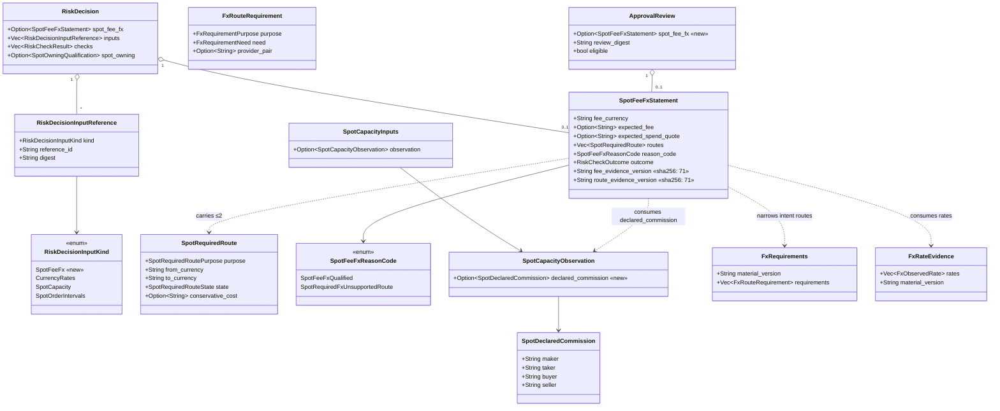
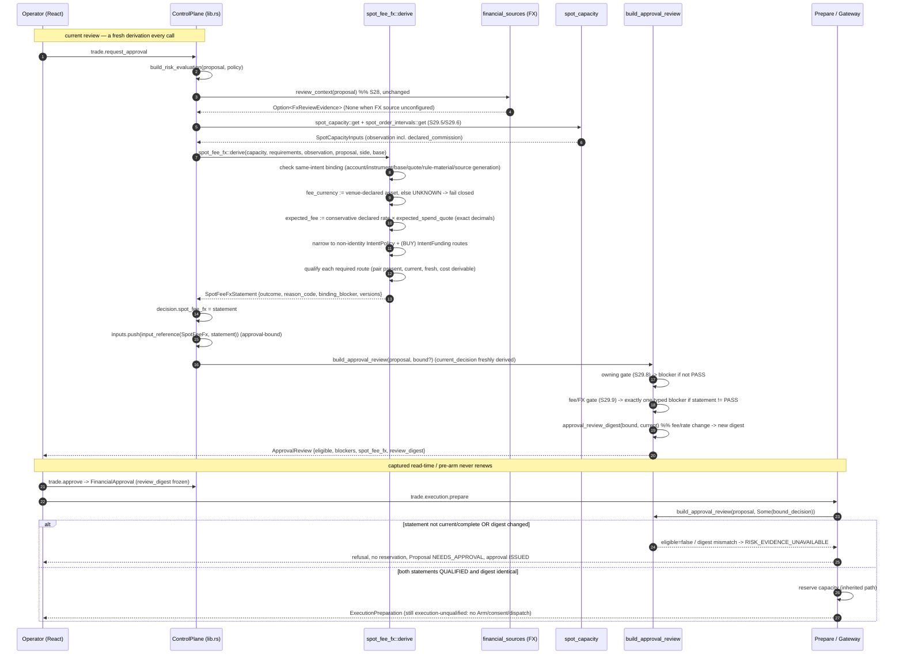
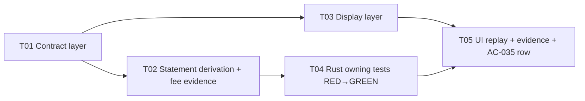

# S29.9 — Owning fee statement and genuinely-required execution FX: system design and task decomposition

Owner: Architect (Gao). Scope: design only. No product code in this document.
Authority order: English PRD → UI Spec §14 → Backend ARD §41–42 (IPC is authoritative) → this design.
Baseline: `dev@1f8e231`. Parent gate [#121](https://github.com/kaiqiangh/tradex/issues/121) stays OPEN.

This design implements `docs/implementation/s29-fee-and-required-fx-spec.md` (and its paired `_zh.md`) by
**consuming, never rebuilding**, the delivered seams. It extends the existing owning Live PLACE path
(risk evaluation → immutable approval review → Prepare → authenticated child Gateway) for an ordinary
Binance Spot Live account on the exact-amount Market/Limit boundary only.

> **READ FIRST — pinned technical findings (§9).** Two of the four PM "存疑" questions resolve to
> findings that change what a reachable positive case looks like at the public seam. They are stated
> in full in §9. **All four items are now CLOSED by team-lead ruling (§8)** — two of them make the
> slice's reachable positive statement-level and its terminal state a documented fail-closed refusal.
> The Engineer must not "fix" them by relaxing producers, adding parity, adding a supported provider
> pair, or widening the base currency. §8 also carries three binding pins (P1/P2/P3) for T02/T04/T05.

---

## Part A — System Design

### 1. Implementation approach

#### 1.1 The challenging points

1. **The fee evidence is already read but discarded.** `spot_capacity.rs:622–630` validates the
   account response's `commissionRates.{maker,taker,buyer,seller}` as original decimals and records
   any unknown key as an account extension, but projects *none* of it. There is no fee statement and
   no approval binding on the fee value today. `ApprovalReview.estimated_fees` exists but is always
   `None` (`lib.rs:8677`).
2. **The delivered FX context is portfolio-wide and permanently `UNAVAILABLE`.** `financial_sources::fx_requirements`
   (`financial_sources.rs:162`) emits account/balance/position/open-order routes plus the two intent
   routes; `review_context` (`:331`) attaches it only when the FX source is configured and at least
   one route is non-identity. The owning gate never consumes it, so `CURRENCY_CONVERSION` is
   `UNAVAILABLE` decoratively.
3. **The owning gate must be approval-bound.** A change to the fee or to a required rate must change
   `approval_review_digest` and leave the review ineligible, so re-admission needs a new review
   (`approval_review_digest` at `lib.rs:2101`, `is_approval_bound_risk_input` at `:2093`).
4. **The gate must not turn the delivered S29.8 positive red.** `reviewed_live_fixture` (binance,
   FX source not configured) asserts `review.eligible == true` and is reused by many delivered
   suites. The new gate must therefore activate on exactly the condition under which its evidence is
   in scope, mirroring how `review_context` gates `currency_evidence`.

#### 1.2 Architecture pattern

Exactly the S29.8 pattern, one level deeper: a **pure derivation module** (`spot_fee_fx.rs`), a
**new approval-bound `RiskDecisionInputKind`**, a **single typed blocker** contributed inside
`build_approval_review`, and **Prepare inheriting it transitively through `review_digest`**. No new
authority model, no second settlement path, no new saved source, no renderer-supplied value.

#### 1.3 Data flow and gate placement (where and why)

```
                       build_risk_evaluation  (lib.rs:7858)
   review_context() ──► email  currency_evidence  (S28, unchanged)
   spot_capacity::get ─► SpotCapacityInputs      (S29.5; NOW also carries the declared commission evidence)
   spot_order_intervals::get ─► SpotOrderIntervalInputs (S29.6)
        │
        ├─ spot_owning::qualify(capacity, intervals, side)        (S29.8; unchanged)
        └─ spot_fee_fx::derive(capacity, fx_requirements, fx_observation, proposal, side, base)
                 │
                 ├─ decision.spot_fee_fx = statement                    (new field on RiskDecision)
                 └─ inputs.push(input_reference(SpotFeeFx, ..., &statement))  (approval-bound)
   risk::evaluate(...)  ──► RiskDecision { checks, inputs, spot_owning, spot_fee_fx, ... }

                       build_approval_review  (lib.rs:8411)
   current_decision = build_risk_evaluation(...)          (fresh every call — never the frozen value)
   owning gate  (S29.8)  ──► blocker if not PASS
   fee/FX gate (S29.9)   ──► exactly one typed blocker if statement != QUALIFIED   (NEW)
   approval_review_digest(bound, current) ──► a change to fee/rate evidence changes the digest

                       Prepare  (prepare_live_place, lib.rs:8817 / revalidate_live_dispatch_attempt, :8684)
   build_approval_review(proposal, Some(bound_decision))
   → if !eligible || review_digest != approval.review_digest   → RISK_EVIDENCE_UNAVAILABLE
   → no reservation, no partial state  (inherited; boundary only extended, never relaxed)
```

**Why this placement.**
- The *derivation* belongs in `build_risk_evaluation` because that is the single place the owning
  decision is assembled and where the delivered `SpotCapacity`/`SpotOrderIntervals` inputs are
  already pushed. Pushing the statement as an input is what makes it approval-bound **without a new
  enum ordinal in the digest** beyond the one deliberate new kind.
- The *blocker* belongs in `build_approval_review` because that is where the S29.8 owning gate
  already contributes its single blocker against the **freshly derived** `current_decision`, which is
  exactly what makes expiry non-replayable. It is an **append-only push immediately after the owning
  gate** (`lib.rs:8482-8500`) with a **single-line `reason`** (no `\n`), so the `' · '`-joined
  blocker rendering keeps its delivered assertion (§8 P1).
- The *refusal* belongs to Prepare, unchanged: `review.eligible == false` → `RISK_EVIDENCE_UNAVAILABLE`,
  no reservation. This preserves `live_place_preparation_rejects_missing_cross_currency_fx_without_partial_state`.
- The *settlement* path is untouched; `LiveOrderSettlement.fees`/`feesComplete` and
  `LiveOrderTradeFact.fees` are inherited verbatim.

**Why a new `RiskDecisionInputKind::SpotFeeFx` rather than reusing `CurrencyRates`.** `CurrencyRates`
binds the *whole* portfolio-wide context (`FxReviewEvidence`) and is already present whenever
`review_context` is `Some`; folding the fee into it would (a) couple the fee statement's identity to
the portfolio context and (b) leave the fee value outside any digest whenever the FX source is not
configured. A dedicated kind binds exactly the statement this slice owns, at the delivered statement
identity (workspace, proposal, hash, account, instrument, base/quote asset, source + rule-material
generation, both evidence-version digests). Adding one enum value is an expected, reviewed contract
delta: the generated IPC schema gains one definition and the `RiskDecisionInputKind` union gains one
literal.

### 2. File list (relative paths)

**New**

| Path | Purpose |
| --- | --- |
| `src-tauri/src/spot_fee_fx.rs` | Pure derivation of `SpotFeeFxStatement` from the delivered seams (mirrors `spot_owning.rs`). |
| `src/SpotFeeFxExplanation.tsx` | React display of the statement (current / captured / pre-arm). Mirrors `SpotOwningAdmission.tsx`. |
| `src-tauri/tests/binance_rules.rs` (extended) | New owning fee/FX RED→GREEN cases appended to the S29.8 rig. |
| `tests/spot-fee-required-fx-ui.mjs` | Real Rust/React/temp-SQLite UI replay at 1280/768/390. |
| `docs/implementation/s29-fee-and-required-fx-evidence.md` (+ `_zh.md`) | Paired evidence. |
| `docs/implementation/s29-fee-and-required-fx-classes.mermaid` | Class diagram (this doc §3). |
| `docs/implementation/s29-fee-and-required-fx-sequence.mermaid` | Sequence diagram (this doc §4). |

**Modified**

| Path | Change |
| --- | --- |
| `src-tauri/src/lib.rs` | `pub mod spot_fee_fx;`; derive + push input in `build_risk_evaluation`; single typed blocker + `ApprovalReview.spot_fee_fx` surfacing in `build_approval_review`; no Prepare logic change. |
| `src-tauri/src/risk.rs` | `RiskDecisionInputKind::SpotFeeFx`; `RiskDecision.spot_fee_fx: Option<SpotFeeFxStatement>`; one arm in `normalize_input_material`. |
| `src-tauri/src/protocol.rs` | `ApprovalReview.spot_fee_fx: Option<SpotFeeFxStatement>` (keep `estimated_fees` for compatibility; optionally populate it). |
| `src-tauri/src/spot_capacity.rs` | Project the already-validated `commissionRates` into the observation as the declared commission evidence (additive). |
| `src-tauri/src/financial_sources.rs` | Add a read-only accessor exposing the current proposal-scoped FX observation + `fx_requirements` to the owning module. `fx_requirements`/`review_context` semantics unchanged. |
| `shared/ipc-v1.schema.json`, `shared/ipc-types.ts`, `shared/ipc-validators.js`, `shared/ipc-validators.d.ts` | Regenerated by `scripts/ipc-schema.mjs`. |
| `src/OrderDrafts.tsx` | Render `SpotFeeFxExplanation` in the three review surfaces next to `SpotOwningExplanation`. |
| `docs/implementation/requirements.csv` | Add this slice to the AC-035 fee + expected/maximum-authorized-spend portions only; `AC-035` stays `NOT_STARTED`. |
| `package.json` / test harness entry | Register the new UI replay. |

### 3. Data structures and interfaces

New Rust types (all `deny_unknown_fields`, `camelCase`, `JsonSchema`). **Length bounds are the lesson
from S29.8**: any `sha256:` binding version is declared at exactly **71** characters
(`min = 71, max = 71`), never shorter, because React decodes every response through the generated
validator before a component reads it.

```rust
// spot_fee_fx.rs — enum carried verbatim as the single typed reason
#[serde(rename_all = "SCREAMING_SNAKE_CASE")]
pub enum SpotFeeFxReasonCode {
    SpotFeeFxQualified,               // both statements current and complete
    SpotFeeFxEvidenceMismatch,        // fee + FX evidence do not describe the same immutable intent
    SpotFeeEvidenceUnavailable,       // no current declared commission observation bound to the intent
    SpotFeeCurrencyUnknown,           // venue does not declare the fee-charging asset -> fail closed
    SpotFeeRateUnsupported,           // declared rates present but not usable as an exact decimal basis
    SpotRequiredFxEvidenceUnavailable,// no current proposal-scoped FX observation
    SpotRequiredFxUnqualified,        // a required route's rate is missing/stale/unqualified
    SpotRequiredFxUnsupportedRoute,   // a required route has no supported provider pair (needs no rate parity)
}

#[serde(rename_all = "SCREAMING_SNAKE_CASE")]
pub enum SpotFeeRateBasis { Maker, Taker }        // the declared basis actually used (the conservative one)

#[serde(rename_all = "SCREAMING_SNAKE_CASE")]
pub enum SpotRequiredRoutePurpose { IntentPolicy, IntentFunding }

#[serde(rename_all = "SCREAMING_SNAKE_CASE")]
pub enum SpotRequiredRouteState { Qualified, Unqualified, UnsupportedRoute, EvidenceUnavailable }

pub struct SpotRequiredRoute {                    // at most two entries
    pub purpose: SpotRequiredRoutePurpose,
    #[schemars(length(min = 1, max = 16))] pub from_currency: String,
    #[schemars(length(min = 1, max = 16))] pub to_currency: String,
    #[serde(skip_serializing_if = "Option::is_none")] pub provider_pair: Option<String>, // len 6 when present
    pub state: SpotRequiredRouteState,
    #[serde(skip_serializing_if = "Option::is_none")] pub provider_quality: Option<String>,     // len 1..64
    #[serde(skip_serializing_if = "Option::is_none")] pub provider_timestamp: Option<String>,   // len 1..64
    #[serde(skip_serializing_if = "Option::is_none")] pub first_receipt: Option<String>,        // len 1..64
    #[serde(skip_serializing_if = "Option::is_none")] pub conservative_cost: Option<String>,    // len 1..64
    #[schemars(length(min = 1, max = 256))] pub reason: String,
}

pub struct SpotFeeFxStatement {
    #[schemars(length(min = 1, max = 128))] pub workspace_id: String,
    #[schemars(length(min = 1, max = 128))] pub proposal_id: String,
    #[schemars(length(min = 71, max = 71))] pub proposal_hash: String,
    #[schemars(length(min = 1, max = 128))] pub account_id: String,
    #[schemars(length(min = 1, max = 128))] pub instrument_id: String,
    #[schemars(length(min = 1, max = 16))] pub base_asset: String,
    #[schemars(length(min = 1, max = 16))] pub quote_asset: String,
    pub side: OrderSide,
    /// "UNKNOWN" when the venue does not genuinely declare the fee-charging asset.
    #[schemars(length(min = 1, max = 16))] pub fee_currency: String,
    #[schemars(length(min = 1, max = 128))] pub fee_currency_origin: String,   // e.g. ACCOUNT_DECLARED_FEE_ASSET | UNKNOWN
    #[serde(skip_serializing_if = "Option::is_none")] pub fee_rate_basis: Option<SpotFeeRateBasis>,
    #[schemars(length(min = 1, max = 64))] pub declared_maker_rate: Option<String>,   // verbatim
    #[schemars(length(min = 1, max = 64))] pub declared_taker_rate: Option<String>,   // verbatim
    #[schemars(length(min = 1, max = 64))] pub declared_buyer_rate: Option<String>,   // verbatim
    #[schemars(length(min = 1, max = 64))] pub declared_seller_rate: Option<String>,  // verbatim
    #[schemars(length(min = 1, max = 64))] pub expected_fee: Option<String>,          // in fee_currency
    #[schemars(length(min = 1, max = 64))] pub expected_spend_quote: Option<String>,  // intent notional in QUOTE
    #[schemars(length(min = 1, max = 64))] pub maximum_authorized_spend_quote: Option<String>,
    #[schemars(length(min = 1, max = 16))] pub base_currency: String,
    #[schemars(length(min = 1, max = 64))] pub workspace_base_expected_spend: Option<String>, // only if qualified
    #[schemars(length(min = 1, max = 64))] pub workspace_base_expected_fee: Option<String>,   // only if qualified
    #[schemars(length(max = 2))] pub routes: Vec<SpotRequiredRoute>,
    pub outcome: RiskCheckOutcome,
    pub reason_code: SpotFeeFxReasonCode,
    #[schemars(length(min = 1, max = 512))] pub reason: String,
    #[schemars(length(min = 1, max = 128))] pub binding_blocker: Option<String>,
    #[schemars(length(max = 5), inner(length(min = 1, max = 128)))] pub carried_limitations: Vec<String>,
    #[schemars(length(min = 71, max = 71))] pub fee_evidence_version: String,   // sha256:
    #[schemars(length(min = 71, max = 71))] pub route_evidence_version: String, // sha256:
}
```

`RiskDecision` (risk.rs) gains one field, serialized only when present:

```rust
#[serde(default, skip_serializing_if = "Option::is_none")]
pub spot_fee_fx: Option<crate::spot_fee_fx::SpotFeeFxStatement>,
```

`ApprovalReview` (protocol.rs) gains one field, serialized only when present:

```rust
#[serde(default, skip_serializing_if = "Option::is_none")]
pub spot_fee_fx: Option<crate::spot_fee_fx::SpotFeeFxStatement>,
```

`SpotCapacityObservation` (spot_capacity.rs) gains the additive declared-commission projection (see §9,
裁定 1). It projects only what the account read already validated — no new value is fabricated:

```rust
#[serde(default, skip_serializing_if = "Option::is_none")]
pub declared_commission: Option<SpotDeclaredCommission>,

pub struct SpotDeclaredCommission {                       // all verbatim original decimals
    #[schemars(length(min = 1, max = 64))] pub maker: String,
    #[schemars(length(min = 1, max = 64))] pub taker: String,
    #[schemars(length(min = 1, max = 64))] pub buyer: String,
    #[schemars(length(min = 1, max = 64))] pub seller: String,
    #[schemars(length(max = 16), inner(length(min = 1, max = 64)))] pub extension_keys: Vec<String>, // unknown commissionRates keys, recorded not projected
}
```

Only **additive** fields are introduced on delivered types; no existing field's meaning changes.



### 4. Program call flow



### 5. Task list (ordered, dependency-annotated)

Five tasks, each with ≥3 related files, no long linear chain. Only T02 depends on more than T01.

| ID | Task | Files | Depends on | Priority |
| --- | --- | --- | --- | --- |
| **T01** | **Contract layer (approval-bound statement plumbing)** — add `RiskDecisionInputKind::SpotFeeFx`, `RiskDecision.spot_fee_fx`, the `normalize_input_material` `SpotFeeFx` empty arm (same `=> {}` group as `SpotCapacity`/`SpotOrderIntervals`), `ApprovalReview.spot_fee_fx`, `pub mod spot_fee_fx;`, `spot_fee_fx::derive` skeleton (**T01 returns `Ok(None)` unconditionally**), an append-only blocker that fires only on `Some(statement) && outcome != PASS` (immediately after the owning gate push at `lib.rs:8482-8500`; `None` adds no blocker), and regenerate the IPC schema/types/validators. **Provably zero behaviour change** for every delivered suite; the only delta is the IPC schema increment. | `src-tauri/src/risk.rs`, `src-tauri/src/protocol.rs`, `src-tauri/src/lib.rs`, `src-tauri/src/spot_fee_fx.rs` (skeleton), `shared/ipc-*` (regenerated) | — | P0 |
| **T02** | **Statement derivation + fee evidence** — implement `spot_fee_fx::derive` in full and complete the `None → fail-closed` branch T01 left open; project the already-read `commissionRates` into `SpotCapacityObservation.declared_commission`; add the read-only FX-observation accessor in `financial_sources.rs`; exact-decimal fee math; route narrowing + qualification; typed blockers with the deterministic priority of §8 **P2** (route blocker binds over fee-currency blocker; the other is still reported); carried limitations; both `sha256:` version digests. | `src-tauri/src/spot_fee_fx.rs`, `src-tauri/src/spot_capacity.rs`, `src-tauri/src/financial_sources.rs`, `src-tauri/src/lib.rs` | T01 | P0 |
| **T03** | **Display layer** — `SpotFeeFxExplanation.tsx` + wiring into the current, captured and pre-arm views in `OrderDrafts.tsx`, with keyboard/1280/768/390 layout and a no-refresh/no-renewal contract identical to `SpotOwningExplanation`. | `src/SpotFeeFxExplanation.tsx`, `src/OrderDrafts.tsx`, styles | T01 | P1 |
| **T04** | **Rust owning tests (RED→GREEN)** — append the owning fee/FX cases to the S29.8 rig in `binance_rules.rs`, extend fixtures for the declared fee asset and the required-route producer states, and preserve `live_place_preparation_rejects_missing_cross_currency_fx_without_partial_state` verbatim (boundary extended only). | `src-tauri/tests/binance_rules.rs`, `src-tauri/src/lib.rs` (test rig) | T02 | P0 |
| **T05** | **UI replay + evidence + traceability** — `tests/spot-fee-required-fx-ui.mjs`, harness registration, paired evidence docs, and the AC-035 requirement-row update (fee + spend portions only). | `tests/spot-fee-required-fx-ui.mjs`, `package.json`/harness, `docs/implementation/s29-fee-and-required-fx-evidence.md` (+`_zh.md`), `docs/implementation/requirements.csv` | T03, T04 | P1 |

### 6. Required packages

**None.** No new Cargo crate and no new npm package. The slice reuses `schemars`, `serde`, `serde_json`,
`sha2`, the exact-decimal helpers in `provider_io` (`decimal`, `decimal_cmp`, `decimal_subtract`,
`decimal_mul`), the delivered HTTP/vault fakes and the existing React/MUI/Tailwind stack. The IPC
generation chain (`scripts/ipc-schema.mjs` → `cargo run --bin schema-export` → `json-schema-to-typescript`
→ `ajv`) is reused unchanged.

### 7. Shared knowledge (cross-file contracts)

- **Enum values (verbatim, screaming-snake on the wire).** Reason codes exactly:
  `SPOT_FEE_FX_QUALIFIED`, `SPOT_FEE_FX_EVIDENCE_MISMATCH`, `SPOT_FEE_EVIDENCE_UNAVAILABLE`,
  `SPOT_FEE_CURRENCY_UNKNOWN`, `SPOT_FEE_RATE_UNSUPPORTED`, `SPOT_REQUIRED_FX_EVIDENCE_UNAVAILABLE`,
  `SPOT_REQUIRED_FX_UNQUALIFIED`, `SPOT_REQUIRED_FX_UNSUPPORTED_ROUTE`. Input kind: `SPOT_FEE_FX`.
- **Sources / origins (reported verbatim, never promoted into a hidden gate).** Declared commission
  origin `ACCOUNT_DECLARED_COMMISSION_RATES`; declared fee-asset origin `ACCOUNT_DECLARED_FEE_ASSET`
  or `UNKNOWN`; carried limitations from the consumed slices stay verbatim.
- **Error codes.** Prepare refusal is always `RISK_EVIDENCE_UNAVAILABLE`; the digest mismatch path is
  the same. No new error code is introduced.
- **Blocker discipline (§8 P1/P2).** Exactly one `binding_blocker`; it is appended immediately after
  the owning gate and its `reason` contains no newline. When both "required route unsupported" and
  "fee currency unknown" hold, the **route** blocker binds and the fee-currency finding is still
  reported as a statement fact.
- **Units.** The exact expected spend is the intent notional in its own **QUOTE** unit; the maximum
  authorized spend is the intent's own maximum in **QUOTE**; workspace-base figures exist only when
  the corresponding required conversion is genuinely qualified. `USDT ≠ USD`: no implicit parity,
  no reciprocal, no bridging; `EURUSD` and `USDEUR` are independent observations.
- **Exactness.** Only `provider_io::decimal` / `decimal_cmp` / `decimal_subtract` / `decimal_mul`.
  No `f64`, no rounding, and never a rounding that makes a fee or converted amount smaller than the
  venue's own figure. The expected fee uses the **conservative** declared rate (never the smaller of
  maker/taker).
- **Bounds.** Every `sha256:` version is declared `length(min = 71, max = 71)`; `routes` is
  `max = 2`; `carried_limitations` is `max = 5`; each decimal string is `max = 64`.
- **No new authority.** The statement grants no Arm, consent, dispatch or execution authority even
  when fully qualified; it is not a fill promise and not a substitute for immediate authenticated
  preflight. The consumed settlement contract is unchanged.
- **Capture discipline.** Reading the current, captured or pre-arm review never re-reads, renews or
  repairs a saved statement.
- **No new provider read.** Fixed ordinary public hosts only; no redirect, no Testnet/regional
  fallback, no access bypass, no new credential or saved source. No Control Plane lock across I/O.

### 8. Resolved decisions and pins (team-lead ruling folded in — binding)

All four open items are **CLOSED** by team-lead ruling; three additional pins are now binding. T02
depends on this section. No item remains open except sub-ticket numbering, which team-lead handles at
publish time.

1. **[CLOSED — reachable positive] Adopt option (a): statement-level RED/GREEN.** Accept a
   **qualified, displayed fee statement** together with a **required-FX statement that fails closed
   with its single typed blocker**; parent gate #121 stays OPEN. The genuinely-required-conversion
   QUALIFIED path and the same-currency identity path are both **confirmed not reachable** at the
   public seam (team-lead independently re-verified §9 裁定 2). **Explicit prohibition (into §9 裁定 2
   and this doc): do NOT restore a positive by relaxing the producer, adding a supported pair,
   introducing parity, or widening `valid_base_currency`.**

   *Team-lead re-verified evidence (write verbatim):*
   - `valid_base_currency` (`portfolio.rs:1146-1148`) requires `len() == 3 && all ascii uppercase` →
     `USDT` can never be a base currency.
   - `fx_route` (`financial_sources.rs:292-318`) assigns a pair only to `EUR→USD` (`EURUSD`) and
     `USD→EUR` (`USDEUR`); every other unequal pair → `ExternalRate` + `pair = None`.
   - Permitted Spot instruments are exactly `equity:US:AAPL`, `equity:US:MSFT`,
     `crypto:BTC/USDT:spot`, `crypto:ETH/USDT:spot`.
   - ⇒ Every Spot intent's intent route is `USDT → base` (a 3-letter fiat only) → **permanently
     `SPOT_REQUIRED_FX_UNSUPPORTED_ROUTE`**; the identity positive is unreachable too.
2. **[CLOSED — fee-charging asset] Confirm "zero new read + `UNKNOWN` + fail-closed".** Accept
   `fee_currency = "UNKNOWN"`, `fee_currency_origin = "UNKNOWN"`, `SPOT_FEE_CURRENCY_UNKNOWN`, and do
   **not** fabricate a conservative fee amount. No SAPI domain, no Testnet/region fallback, no new
   credential, no new saved source. If implementation-time research finds a genuine fee-asset
   declaration on an ordinary fixed host, that is a **spec-level change → back to PM**, never an
   Engineer invention.
3. **[CLOSED — gate activation] One condition, one source of truth.** Do **not** add the extra
   "statement in scope" clause. The fee/FX gate reuses the boolean already computed in
   `build_approval_review` (`lib.rs:8481-8483`):
   ```rust
   let owning_required = proposal.fields.environment == protocol::ExecutionContext::BinanceLive
       && financial_sources::spot_rules_selected_once(self)?;
   ```
   Team-lead-measured rationale (not inferred): `live_proposal` (`lib.rs:14441-14550`) never
   configures `data.binance_rules` or `data.fx` and never produces capacity/interval observations, so
   in `reviewed_live_fixture*`, `spot_rules_selected_once()` = false
   (`financial_sources.rs:694-702`) → `spot_owning` = None → `currency_evidence` = None → the S29.8
   owning gate is **already inactive** in that fixture (that is why `eligible == true` passes). Every
   suite that configures `binance_rules` asserts `eligible == false` or does not assert it
   (`binance_rules.rs:5929` false; `binance_market_hot.rs:2332` false; no `lib.rs` case asserts
   `eligible == true` with `data.binance_rules` configured); the S29.8 UI GREEN
   (`tests/spot-owning-admission-ui.mjs:15-130`) never asserts `eligible === true` and the blocked
   check at `:155-156` uses `false` + `.some(startsWith(...))`. ⇒ An additive blocker cannot flip any
   delivered assertion.
4. **[CLOSED — AC-035] Confirmed.** The row attributes only the **fee-estimate** and
   **expected/maximum-authorized-spend** portions to this slice; `AC-035` stays `NOT_STARTED`;
   bid/ask/spread/quote-age stay with the quote slice.
5. **Sub-ticket numbering** — team-lead handles at publish time.

**Additional binding pins (from team-lead; must land in T02/T04/T05):**

- **P1 — blocker concatenation must stay single-line and append-only.** `src/OrderDrafts.tsx:1829`
  joins blockers with `' · '` on one line, and `tests/spot-owning-admission-ui.mjs:168` asserts the
  dialog text matches `/Approval remains blocked: .*SPOT_INTERVAL_QUOTA_EXHAUSTED/`. Therefore: (a) the
  S29.9 blocker is an **append-only push immediately after the owning gate** (`lib.rs:8482-8500`
  onward) and must not move, rename or delete the owning blocker; (b) the `reason` string must **not
  contain `\n`**, or that regex fails.
- **P2 — exactly one `binding_blocker`; non-binding facts still reported.** When both "required route
  unsupported" and "fee currency unknown" hold, the binding blocker is the **route** blocker (a
  structural impossibility on the intent route, prior to any fee arithmetic), and the other finding is
  still surfaced as a statement fact, never silently dropped — mirroring how the delivered
  `SPOT_INTERVAL_QUOTA_EXHAUSTED` still reports `declaredSymbolOpenOrders: "1"`. This deterministic
  priority is written into T02 and fixes T04's expected value.
- **P3 — the honest terminal state must be documented, not spun.** After S29.9 lands, **every
  reachable Binance Spot Live PLACE is refused at the approval-review gate with
  `RISK_EVIDENCE_UNAVAILABLE`** for two independent reasons (route unsupported + fee asset
  undeclared). This is the correct fail-closed outcome, **not a green path**. It must be written into
  `s29-fee-and-required-fx-evidence.md` (+`_zh.md`), the spec, and `s29-binance-live-plan`: it leaves
  the "fee asset" and "USDT-side conversion" problems to the remaining S29 work (immediate
  authenticated preflight / private-stream lifecycle / real financial acceptance). Do not present it
  as a positive result.

### 9. Technical conclusions on the four PM findings (裁定 1–4)

#### 裁定 1 — Fee evidence source: **zero new read; consume the already-read `commissionRates`; fee currency is `UNKNOWN` + fail-closed**

- The account read at `spot_capacity.rs` already validates `commissionRates.{maker,taker,buyer,seller}`
  as original decimals (`:622–630`) and records unknown keys as account-extension obligations, but
  projects none of it. The S29.2 rule source (`binance_rules.rs`) reads the same account response.
- **Pin:** this slice adds **no** new read and **no** new host/route. It projects the already-obtained
  `commissionRates` (verbatim) into `SpotCapacityObservation.declared_commission` so the fee evidence
  becomes approval-bound through the existing `SpotCapacity` input digest.
- The account response declares commission **rates**. It does **not** declare the fee-charging
  **asset**, and neither does the exchange-info read. There is no fixed ordinary public host/route in
  the delivered set that declares a Spot account's fee-charging asset.
- **Pin:** therefore `fee_currency = "UNKNOWN"`, `fee_currency_origin = "UNKNOWN"`, the statement fails
  closed with `SPOT_FEE_CURRENCY_UNKNOWN`, and the conservative expected fee is not fabricated. The
  venue's SAPI fee-schedule domain is **not** used (non-fixed host), and no Testnet fallback, region
  bypass, new credential or new source is introduced. If implementation-time research finds a genuine
  ordinary-host fee-asset declaration, that is a spec-level change and returns to PM, not an Engineer
  invention.

#### 裁定 2 — Genuinely-required execution-FX positive-path reachability: **UNREACHABLE at the public seam**

Worked through against the delivered code:

- Permitted instruments are exactly `equity:US:AAPL`, `equity:US:MSFT`, `crypto:BTC/USDT:spot`,
  `crypto:ETH/USDT:spot`; only the two crypto ones carry a **USDT** quote and are the owning Binance
  Spot path. `estimate_order_notional` (`storage.rs:11200`) sets
  `estimated_notional_currency = instrument.currency = "USDT"`.
- `fx_route` (`financial_sources.rs:282`) assigns a provider pair **only** for `EUR→USD` (`EURUSD`)
  and `USD→EUR` (`USDEUR`). Every other unequal pair is `EXTERNAL_RATE` with `provider_pair = None`
  ("unsupported by the selected bounded FX producer; parity never assumed").
- `valid_base_currency` (`portfolio.rs:1146`) requires **exactly 3** ASCII uppercase letters, so the
  workspace base currency is a 3-letter fiat and can **never** be `USDT`.
- The placement's genuinely-required set is the intent-policy route (`USDT → base`) plus, for a BUY,
  the intent-funding route (`USDT → funding_unit`). Since `USDT ≠ base` always, the intent-policy
  route is **always** non-identity, and because it originates in `USDT` it can **never** match the
  only supported pairs → **permanently `SPOT_REQUIRED_FX_UNSUPPORTED_ROUTE`.**
- The all-identity ("same-currency") case would require `USDT == base`, which `valid_base_currency`
  forbids.

**Conclusion (honest, as requested):** for a `BTC/USDT` Spot intent with workspace base `X`, the
genuinely-required route `USDT → X` can reach `QUALIFIED` **only if** `USDT` were one side of a
supported pair — it is not. The "genuinely required conversion reached QUALIFIED" positive path is
**not reachable** on the delivered public seam, and the "same-currency identity" positive is likewise
**not reachable** for the only permitted Spot instruments. The correct design is therefore:

- `USDT → non-USD base` and `USDT → USD` are both **`SPOT_REQUIRED_FX_UNSUPPORTED_ROUTE`** and both
  fail closed; `EURUSD` is never inferred from `USDEUR`.
- The reachable positive is the **fee statement** portion qualified *together with* the required-FX
  statement's single typed blocker; the owning gate fails closed and Prepare refuses with
  `RISK_EVIDENCE_UNAVAILABLE`. This is consistent with the fail-closed discipline and keeps parent
  #121 OPEN.
- **Explicit prohibition (team-lead ruling, binding):** do **not** restore a positive by relaxing the
  producer, adding a supported pair, introducing parity, or widening `valid_base_currency`. §8 item 1
  is **closed** (option (a)): the reachable RED/GREEN is statement-level.

#### 裁定 3 — Reuse of `CURRENCY_CONVERSION`: **do not change its delivered semantics**

- The delivered `CURRENCY_CONVERSION` check is pushed as `Unavailable / CURRENCY_CONVERSION_UNAVAILABLE`
  in `build_risk_evaluation` (`lib.rs:8118–8126`) whenever `currency_evidence.is_some()`.
- **Pin:** leave it exactly as delivered. This slice contributes its **own** typed blocker
  (`SPOT_REQUIRED_FX_*` / `SPOT_FEE_*`) through the owning gate; it does **not** turn
  `CURRENCY_CONVERSION` `PASS`. No "strictly non-weakening" argument is needed because the delivered
  check is not modified, and no delivered suite's expectation of `CURRENCY_CONVERSION_UNAVAILABLE`
  changes. Relaxing it to `PASS` requires a separate, evidenced, strictly-non-weakening analysis that
  this slice does not make.

#### 裁定 4 — Binding input kind: **add one new approval-bound `RiskDecisionInputKind::SpotFeeFx`**

- The delivered binding excludes only `Reservations` (`is_approval_bound_risk_input`, `lib.rs:2093`);
  `SpotCapacity`/`SpotOrderIntervals`/`CurrencyRates` are already bound. The fee statement must be
  bound **as a value**, not only transitively: the account read currently discards `commissionRates`,
  so without a dedicated digest a fee change would not move `review_digest`.
- **Pin:** add `RiskDecisionInputKind::SpotFeeFx` and push one `input_reference(SpotFeeFx, …)` built
  from the whole `SpotFeeFxStatement` (its two `sha256:` version digests ride inside it). This is the
  same mechanism S29.8 used for capacity/intervals, so a genuine fee or rate change changes the digest
  and re-admission needs a newly reviewed approval. Adding one enum value is an expected wire-contract
  delta (one new `$defs` entry and one new union literal); it is reviewed, not smuggled.
- **Gate activation (team-lead ruling, binding): one condition only.** The fee/FX gate contributes a
  blocker when `owning_required && statement.outcome != PASS`, where `owning_required` is the existing
  boolean at `lib.rs:8481-8483` (`environment == BinanceLive && financial_sources::spot_rules_selected_once(self)`),
  and the blocker is pushed **immediately after** the owning gate push (`lib.rs:8482-8500`) so the
  `' · '`-joined single-line blocker order is preserved (see §8 P1). No "statement in scope" sub-clause
  is added (§8 item 3).

---

## Part B — Task decomposition summary

- **Tasks: 5** (T01 contract layer → {T02 derivation, T03 display} → T04 Rust tests → T05 replay/evidence).
- **Packages: none.**
- **Dependency graph:**



- **Shared knowledge, unclear items and the 裁定 1–4 conclusions** are as recorded in §7, §8 and §9.
