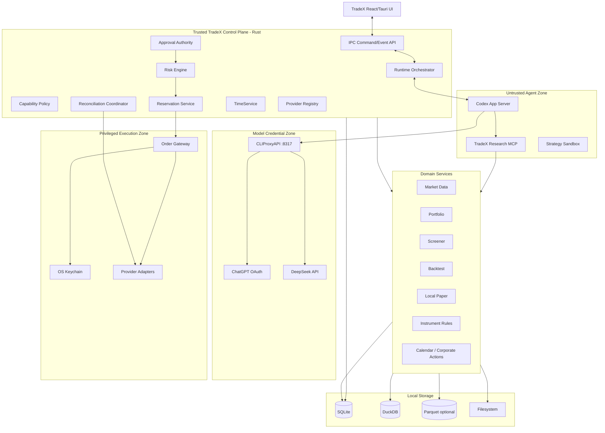

# TradeX 后端架构需求与设计（ARD）

**契约澄清日期：** 2026-09-05；原型行为仅为证据，以 QA Report 记录的缺陷和待验证门槛为准。

**版本：** v1.0 Revision C (RevC)  
**状态：** 工程基线  
**范围：** 本地后端 / Control Plane / Agent Runtime 集成 / Domain Services / Execution Boundary  
**主要实现：** 以 Rust Control Plane 为核心，并在合理场景使用本地 Sidecar / Process  
**来源基线：** `TradeX_PRD_v1.0_RevC_zh.md`、`TradeX_UI_Prototype_Spec_v1.0_RevC_zh.md`；原型观察另见 QA Report\
**语言：** 简体中文

> 本 ARD 将 RevC 产品需求落实为可实施的后端架构。安全语义、产品状态、Provider 范围和存储职责以 RevC PRD 为准；下文中的进程边界、服务拆分、持久化模式、Command/Event Contract、并发控制和 Adapter Pattern 属于工程实现层面的架构决策。

---

## 1. 目的

TradeX 后端是桌面 Workspace 背后的可信本地 Control Plane。它集成 Codex App Server 负责 Agent 执行，使用 CLIProxyAPI 负责模型路由，使用本地域服务完成研究/回测，并通过隔离的券商/交易所 Adapter 访问账户和执行能力。

后端最核心的职责是：允许 Agent 进行研究并提出金融操作，但绝不能让 Agent 自身成为金融执行权限主体。

后端必须：

- 监督本地 runtime dependency；
- 持久化 Thread / Turn / Item provenance；
- 向 Agent 暴露 typed domain tools；
- 统一 instrument、account、order、market data 与 provider capabilities；
- 管理 account-scoped live arming；
- 运行 deterministic risk；
- 签发和验证 TradeX financial approval；
- 按账户原子预留执行 capacity；
- 隔离 privileged Order Gateway 与 credentials；
- 在 ambiguity、restart、sleep、disconnect 和 rate limit 下安全 reconciliation/recovery；
- 保持本地 auditability 与 data provenance。

---

## 2. 架构驱动因素

### 2.1 安全驱动

1. Model 不能访问原始 broker secrets。
2. Codex/Agent runtime 不能直接调用 privileged Order Gateway。
3. Generic Codex approval 不能授权金融执行。
4. Live approval 必须绑定 proposal/account/action、短期且 single-use。
5. Live orders、positions、fills 以 broker/exchange state 为权威。
6. 对 ambiguous non-idempotent submission 禁止 blind retry。
7. Live account arming 按账户隔离，并在安全 trigger 时 reset。
8. Reservation 在 concurrent threads 间按账户原子化。
9. stale market data 或不可接受的 clock uncertainty 对 live authority decision fail closed。
10. Dangerous credential permission 必须阻止 live readiness。

### 2.2 Runtime 驱动

- Codex App Server 固定版本并进行 compatibility test。
- CLIProxyAPI 固定版本、由本地 supervise，并且是唯一 LLM egress。
- 即使模型不可用，Control Plane 的 trading/reconciliation 仍继续运行。
- 默认 local persistence；external telemetry 仅 opt-in。

### 2.3 数据驱动

- SQLite 负责 transactional/domain state 与 financial audit。
- DuckDB 负责 MVP analytical/historical data。
- Parquet 仅用于可选的大型 immutable dataset/interchange。
- Filesystem 保存 artifacts、strategies、exports、backups、datasets。
- Secret 排除在所有普通 Workspace storage 之外。

---

## 3. 后端系统上下文



---

## 4. 信任区与进程边界

TradeX 定义四个安全相关区域。

### 4.1 Untrusted Agent Zone

包含：

- Codex App Server；
- TradeX research MCP/tool process；
- strategy sandbox；
- workspace research files。

该区域可以读取获准 context 并创建 proposal/signal，但不得获得 broker credentials 或直接 execution capability。

### 4.2 Trusted Control Plane

包含金融权限逻辑：

- capability policy；
- account arming state；
- risk engine；
- approval authority；
- reservations；
- reconciliation coordination；
- provider capability/health state；
- TimeService；
- persistence transactions。

### 4.3 Privileged Execution Zone

包含：

- OS keychain access；
- provider request signing/authentication；
- ExecutionAdapter 实现；
- Order Gateway。

只有经过验证、批准并成功 reservation 的 execution intent 才能进入该区域。

### 4.4 Model Credential Zone

仅包含 CLIProxyAPI 与 model credentials：

- ChatGPT OAuth token 位于 sidecar auth directory；
- DeepSeek API key 由 Rust 在 launch 时渲染到 sidecar config。

Broker credentials 绝不能进入该区域。

---

## 5. 本地进程拓扑

推荐 v1.0：

```text
tradex-desktop (Tauri/Rust main process)
 ├─ React webview
 ├─ embedded/control-plane Rust services
 ├─ child: order-gateway [privileged execution; private IPC only]
 ├─ child: codex-app-server [pinned]
 ├─ child: cliproxyapi [pinned, localhost:8317]
 ├─ child: research-mcp (Rust or Python, restricted contract)
 └─ child: strategy/backtest worker(s) [restricted]
```

### 5.1 Process supervision

Rust main process 负责：

- deterministic startup order；
- version verification；
- health checks；
- capped exponential backoff restart；
- stdout/stderr redaction；
- shutdown coordination；
- crash event persistence。

### 5.2 Startup order

推荐：

```text
open/migrate SQLite
→ load settings + provider metadata
→ initialize TimeService
→ initialize domain services + durable event/authority store
→ start/authenticate Order Gateway (new mutations disabled)
→ restore account metadata
→ reconcile all live/open-order accounts
→ expose live execution readiness only for healthy accounts
→ require explicit per-account arming before new Live mutations
```

领域服务初始化后，以独立且有界退避的分支执行 CLIProxyAPI 启动 → `/v1/models` 探测 → Codex App Server 启动。模型启动失败不得阻塞订单查询、对账、账户 disarm 或执行控制面。只有所选模型路由健康后才能开始 Agent Turn；此前工作区可显示历史与恢复入口。

### 5.3 Order Gateway 进程边界

独立子进程是强制要求（PRD OD-009），桌面主进程内的模块不能代替该边界。“Privileged”表示独占交易/凭据能力，不表示以 root/管理员身份运行。父进程固定并验证二进制版本，负责健康检查、有界重启、日志脱敏和关闭。

使用专属继承式双向 IPC 通道，以消息长度分帧，并在启动时握手协议版本。父进程持有唯一对端句柄；不得开放监听 TCP 端口，也不得把该句柄传给 webview、Codex、CLIProxyAPI、研究或策略 worker。每次子进程会话通过继承通道传递随机会话凭证完成认证；凭证不能放入命令行参数、日志或普通工作区文件。协议不兼容时，在接受任何请求前拒绝连接。

Gateway 经认证的控制面通道读取权威不可变对象，不成为第二个 SQLite 写入者。只有其提供方签名层解析执行凭据引用。模型凭据和任意前端/Agent 订单字段不得进入 Gateway 请求。Gateway 故障使受影响 Live 账户 disarm，停止未派发工作，并对所有可能到达提供方的尝试完成对账后才允许显式重新 arming。重启子进程绝不自动重放订单修改请求。

Agent workspace 可以在 broker reconciliation 尚未结束时部分可用，但受影响 account 的 Live execution 必须保持 blocked。

---

## 6. 后端模块拆分

推荐 Rust workspace：

```text
crates/
  tradex-app/
  tradex-api/
  tradex-domain/
  tradex-runtime/
  tradex-thread/
  tradex-capability/
  tradex-market/
  tradex-instruments/
  tradex-portfolio/
  tradex-risk/
  tradex-approval/
  tradex-reservation/
  tradex-execution/
  tradex-reconciliation/
  tradex-provider-core/
  tradex-provider-alpaca/
  tradex-provider-t212/
  tradex-provider-binance/
  tradex-provider-bitget/
  tradex-storage/
  tradex-observability/
  tradex-security/
```

Quant/scientific workload 可以使用 Python worker，但金融 authority 必须留在 Rust。

---

## 7. Canonical Domain Model

### 7.1 Identity 规则

Domain logic 使用稳定 canonical IDs：

```text
workspace_id
thread_id
turn_id
account_id
instrument_id
proposal_id
approval_id
reservation_id
execution_attempt_id
provider_order_id
market_snapshot_id
policy_version
```

Provider-specific symbol/ID 只存在于 adapter mapping。

### 7.2 Instrument 示例

```yaml
instrument_id: equity:US:AAPL
asset_class: EQUITY
exchange: XNAS
currency: USD
providers:
  alpaca: AAPL
  trading212: provider_specific_id
```

```yaml
instrument_id: crypto:BTC/USDT:spot
asset_class: CRYPTO_SPOT
base: BTC
quote: USDT
providers:
  binance: BTCUSDT
  bitget: BTCUSDT
```

### 7.3 Decimal arithmetic

Price、quantity、notional、fees、FX conversion 与 risk calculation 必须使用 decimal-safe type。金融权限逻辑禁止 binary floating point。

### 7.4 Quantity semantics

```rust
enum OrderQuantity {
    Base(Decimal),
    Quote(Decimal),
    Notional(Decimal),
}
```

Adapter 根据 provider capability 与 instrument rules 显式转换。

---

## 8. Thread / Turn / Item Runtime 架构

### 8.1 Persistent Thread

只保存导航/default context：

```text
workspace_id
codex_thread_id
title
created_at
updated_at
default_agent_mode
linked_accounts[]
linked_instruments[]
linked_strategies[]
linked_artifacts[]
```

### 8.2 Immutable Turn snapshot

Turn 开始时持久化：

```text
turn_id
agent_mode_at_start
selected_account_id?
execution_context_at_start
capability_level_at_start
model_id
model_provider
attached_context_ids[]
attached_context_hashes[]
started_at
```

Turn 启动后该 snapshot 不可修改。Provider attempts 和完成时间属于启动快照之外只追加的 Turn 生命周期事件；历史模型/上下文不能从当前工作区默认值读取。

### 8.3 Runtime adapter

`tradex-runtime` 将 Codex protocol event 转换为 TradeX domain item，避免产品逻辑直接依赖不稳定 protocol detail。

```text
Codex JSON-RPC/JSONL
→ RuntimeProtocolAdapter
→ TradeX TurnEvent / ItemEvent
→ persistence
→ UI domain event
```

### 8.4 Generic approval 隔离

Codex approval event 可以暂停/恢复 Turn，但必须与 `FinancialApproval` 分开存储，任何代码路径都不能相互强转。

---

## 9. Agent Mode、Execution Context 与 Capability Policy

### 9.1 Agent Mode

```text
ASK
RESEARCH
BACKTEST
TRADE
```

### 9.2 Execution Context

```text
NONE_READ_ONLY
HISTORICAL_SIMULATION
LOCAL_PAPER
ALPACA_PAPER
TRADING212_DEMO
TRADING212_LIVE
BINANCE_TESTNET
BINANCE_LIVE
BITGET_DEMO
BITGET_LIVE
```

### 9.3 Capability Policy Service

根据具体 Turn snapshot 返回允许的 tool capability。

```rust
struct CapabilityDecision {
    level: CapabilityLevel,
    allowed_tools: Vec<ToolId>,
    execution_allowed: bool,
    reason: Option<String>,
}
```

规则：

- Ask/Research 不获得 current-market execution tools；
- Backtest 只有 historical simulation；
- Trade + Paper/Demo/Testnet 可获得 C3 execution tools；
- Trade + Live 可以达到 proposal capability C4；
- C5 不是常驻 tool grant，只在 Control Plane 内消费有效 transaction-specific approval 时临时成立；
- C6 不支持。

---

## 10. LLM Runtime 架构

### 10.1 Single egress

所有 model inference 都经过：

```text
127.0.0.1:8317 → CLIProxyAPI
```

TradeX、Codex、research tool、strategy code 禁止直接连接外部 LLM endpoint。

### 10.2 CLIProxyAPI supervision

后端负责：

- 验证 pinned binary/version；
- 占用/验证 8317 port；
- 启动 sidecar；
- 只注入 model credentials/config；
- probe `/v1/models`；
- 分类 stopped/port-conflict/unauthorized；
- 适用时 backoff restart；
- 退出时清理渲染的 DeepSeek configuration。

### 10.3 Provider routing

V1.0：

- ChatGPT subscription OAuth → GPT-5.6 series；
- DeepSeek official API → `deepseek-chat` / `deepseek-reasoner`。

Cross-provider automatic fallback 默认 OFF。

### 10.4 Provider attempt audit

每次 attempt 持久化：

```text
turn_id
attempt_no
model_id
provider
started_at
ended_at
result
error_category?
quota_metadata?
```

若发生用户 opt-in 的 automatic fallback，两个 attempt 都必须保留并可审计。Provider switch 不得改变金融 capability state。

### 10.5 Model failure independence

`MODEL_UNAVAILABLE`、`OAUTH_EXPIRED`、`QUOTA_EXCEEDED` 可以阻止新的 Agent turn，但不得停止：

- live order monitoring；
- 已进入可信 control-plane flow 的 cancellation；
- reconciliation；
- account health processing；
- audit persistence。

---

## 11. Provider Registry 与 Schema-driven Connection Model

### 11.1 Provider definition

每个 integration 暴露：

```rust
struct ProviderDefinition {
    provider_id: ProviderId,
    display_name: String,
    environments: Vec<Environment>,
    credential_schema: CredentialSchema,
    capability_schema: CapabilitySchema,
    permission_rules: PermissionRules,
}
```

### 11.2 Credential schema

Schema 描述：

- fields；
- sensitivity；
- required/optional；
- environment applicability；
- help text；
- validation behavior。

后端不得假定所有 broker 都使用相同 `API Key + Secret`。

### 11.3 Secure connection sequence

```text
UI submits secret fields through privileged Tauri command
→ Rust validates shape
→ write secret to OS keychain
→ persist only credential reference metadata
→ adapter probes provider
→ discover permissions/capabilities
→ apply dangerous-permission safety gate
→ persist non-secret health/capability metadata
→ return sanitized account connection result
```

### 11.4 Permission gate

检测到以下权限时阻止 Live readiness：

- withdrawal；
- transfer；
- custody authority；
- unsupported margin/leverage-management authority。

无法 introspect permission 时标记 `UNVERIFIED`，要求用户 acknowledge，并持续在 Account Health 中可见。

---

## 12. Broker Adapter 架构

采用小型、按 capability 拆分的 interface，避免 oversized abstraction。

```rust
trait AccountAdapter { /* balances, positions, orders */ }
trait ExecutionAdapter { /* place/cancel/query execution */ }
trait MarketDataAdapter { /* quotes/bars/book + instrument metadata */ }
trait AccountStreamAdapter { /* private account/order stream */ }
```

### 12.1 Capability discovery

```rust
struct BrokerCapabilities {
    account_read: bool,
    position_read: bool,
    public_market_data: bool,
    private_account_stream: bool,
    order_types: Vec<OrderType>,
    fractional_quantity: bool,
    notional_orders: bool,
    extended_hours: bool,
    client_order_id: bool,
    paper_environment: bool,
    live_environment: bool,
}
```

在 provider 支持时，额外记录 TIF、min notional、post-only/venue constraints、cancellation behavior 和 provider-specific limit。

### 12.2 Provider-specific adapters

V1.0：

- Alpaca Paper；
- Trading 212 Demo / Live；
- Binance Testnet / Spot Live；
- Bitget Demo / Spot Live。

Adapter 将 canonical order 映射成 provider request，并把 provider state 映射回 normalized TradeX state。

### 12.3 Adapter error normalization

Provider error 映射到 canonical taxonomy，同时保留经过 redaction 的 provider raw code/message 作为诊断 metadata。

---

## 13. Market Data 架构

### 13.1 与 Execution 分离

Market data 与 broker execution 是不同 service contract。Broker adapter 即便能提供 market data，domain 也不能假设其数据完整或可用于 execution-grade 决策。

### 13.2 Subscription/access tiers

```text
Census — broad coarse universe/on-demand
Warm   — watchlists/candidates periodic refresh
Hot    — currently viewed/monitored active stream
Cold   — persisted historical/backtest data
```

MVP 使用 Hot active subscription 加 watchlist/universe 的 on-demand/coarse refresh，不对全部 universe 维持 always-on tick subscription。

### 13.3 Market snapshot

```rust
struct MarketSnapshot {
    id: MarketSnapshotId,
    instrument_id: InstrumentId,
    source: String,
    venue: Option<String>,
    provider_timestamp: DateTime<Utc>,
    received_timestamp: DateTime<Utc>,
    entitlement: Entitlement,
    freshness: FreshnessState,
    payload: MarketPayload,
}
```

所有 Live authority decision 都引用 persisted snapshot ID。

### 13.4 Entitlement metadata

每个 market-data integration 定义：

- realtime/delayed；
- local retention limit；
- redistribution restriction；
- commercial constraint；
- 适用 jurisdiction。

---

## 14. TimeService

TimeService 为以下能力提供一致时间语义：

- quote age；
- approval TTL；
- reconciliation deadline；
- event ordering；
- provider timestamp offset。

### 14.1 Data model

同时跟踪 wall-clock 与 monotonic time，检测：

- significant wall-clock jump；
- system resume discontinuity；
- provider/server offset 超 tolerance；
- quote age 不确定。

### 14.2 Fail-closed 规则

TimeService 认为 timing confidence 低于 Live threshold 时：

- 不签发/接受新的有效 Live approval；
- pre-execution freshness/TTL check 失败；
- account/execution surface 收到 clock/freshness blocking state；
- monitoring/reconciliation 继续运行。

---

## 15. Instrument Rules、Calendar 与 Corporate Actions

### 15.1 InstrumentRulesService

维护 venue/provider-specific constraints：

- tick size；
- price/quantity precision；
- minimum/maximum quantity；
- minimum/maximum notional；
- allowed order types；
- market-order constraints；
- trading status。

验证顺序：

```text
normalized order
→ InstrumentRulesService
→ deterministic risk
→ approval
→ pre-execution revalidation
→ provider adapter
```

### 15.2 MarketCalendarService

Equity：

- holidays；
- half days；
- sessions；
- extended-hours state；
- open/close timestamps；
- halts。

### 15.3 CorporateActionsService

追踪：

- splits；
- dividends；
- symbol changes；
- delistings；
- historical adjustment metadata。

在 execution 不被允许时，`MARKET_CLOSED` 与 `INSTRUMENT_HALTED` 是 deterministic blocking state。

---

## 16. Portfolio 与 Valuation 架构

### 16.1 Broker truth

Balance、position、open order、fill 来源于 provider state，并归一化成本地 projection。

### 16.2 Workspace base currency

Portfolio aggregation 使用配置的 base currency。

### 16.3 FX/stablecoin conversion

Conversion 记录：

```text
source
pair/path
provider timestamp
TradeX received timestamp
freshness
quality/depeg state
```

不得假设 `USDT = USD` 或 stablecoin 永远锚定。

如果 conversion quality 不可靠，且 Live risk 依赖该 normalized value，则执行必须 fail closed。

---

## 17. Deterministic Risk Engine

Risk Engine 与模型独立。

### 17.1 Inputs

Risk evaluation 消费 immutable snapshot/reference：

- account state；
- normalized order proposal；
- instrument rules；
- current market snapshot；
- policy version；
- portfolio/exposure state；
- open orders；
- active reservations；
- daily execution counters；
- market/calendar status；
- 必要时的 valuation provenance。

### 17.2 User-configurable policy

支持：

- maximum order notional/quantity；
- position/concentration limits；
- asset-class exposure；
- daily traded notional/loss；
- max open orders；
- max reserved capital；
- allowed/blocked instruments/venues/accounts；
- market-order enablement/slippage；
- price deviation；
- stale-price threshold；
- environment constraints。

Agent 无法修改 policy。

### 17.3 Hard safety rules

系统强制且不可 bypass：

- approval binding；
- duplicate-order protection；
- decimal/precision validation；
- instrument-rule validation；
- authoritative reconciliation；
- unhealthy-account block；
- stale snapshot block；
- reservation correctness；
- ambiguity 后禁止 blind retry；
- Order Gateway isolation。

### 17.4 Risk result

```rust
struct RiskDecision {
    proposal_id: ProposalId,
    policy_version: PolicyVersion,
    allowed: bool,
    checks: Vec<RiskCheckResult>,
    evaluated_at: DateTime<Utc>,
}
```

所有 Live risk decision 都要持久化。

---

## 18. Risk Policy Versioning 与 Serialization

Risk policy 对受影响 scope/account 进行 versioning。

Save flow：

```text
begin per-account single-writer transaction
→ persist new policy version
→ invalidate affected pending approvals
→ re-evaluate pending proposals
→ if policy weakened: DISARM affected live account
→ append audit events
→ commit
```

同账户的 approval consumption 进入同一 serialization boundary，确保 policy-save 与 approval-consume race 无法绕过 revalidation。

---

## 19. Order Draft 与 Immutable Proposal Service

### 19.1 Draft

`OrderDraft` 可以自由修改，不具备 authority。

### 19.2 Proposal generation

```text
OrderDraft
→ normalize canonical order
→ validate instrument/provider capability
→ capture market_snapshot_id where needed
→ bind policy_version
→ generate proposal_id
→ canonical serialize
→ SHA-256 proposal_hash
→ persist immutable OrderProposal
```

### 19.3 Material edit

任何 material edit 生成新的 proposal ID/hash。旧 approval 不可使用，但保留 audit history。

### 19.4 Canonical serialization

Hashing 使用 deterministic serialization，并明确 decimal/string normalization、field ordering、instrument/account identity、environment、TIF 与 quantity semantics。

---

## 20. Financial Approval Authority

`FinancialApproval` 与 Codex approval 完全分离。

### 20.1 Approval payload

```rust
struct FinancialApproval {
    approval_id: ApprovalId,
    intent: ApprovedFinancialIntent,
    account_id: AccountId,
    operation: FinancialOperation,
    policy_version: PolicyVersion,
    issued_at: DateTime<Utc>,
    expires_at: DateTime<Utc>,
    nonce: String,
    consumed_at: Option<DateTime<Utc>>,
}
```

ApprovedFinancialIntent 是带类型标签的联合：PLACE_ORDER 绑定 proposal_id/proposal_hash；CANCEL 绑定 cancellation_intent_id/intent_hash。operation 必须匹配标签、账户及不可变意图。撤单审批不能授权新建订单。

### 20.2 属性

- proposal-bound；
- account-bound；
- operation-bound；
- short-lived；
- single-use；
- material order change 时 invalidated；
- relevant policy change 时 invalidated；
- market snapshot/clock condition 不再满足时不可执行。

### 20.3 Approval consumption

Consumption 与 pre-execution validation、reservation creation 处于同一事务流程。已 consumed approval 不能复用。

---

## 21. Account-scoped Live Arming

Live arming 在 Control Plane 中按账户持久化：

```text
account A: DISARMED/ARMED
account B: DISARMED/ARMED
account C: DISARMED/ARMED
```

### 21.1 Arm requirements

接受 `ARM` 前：

- account connection healthy；
- reconciliation complete；
- credential/permission acceptable；
- provider capability 支持 Live；
- 不存在 blocking recovery state；
- 用户动作明确指向该账户。

### 21.2 Automatic disarm triggers

发生以下情况时 disarm 受影响账户：

- application restart；
- OS sleep/session lock；
- credential change；
- account health degradation；
- reconciliation failure；
- relevant pre-execution failure；
- risk-policy weakening；
- inactivity timeout。

### 21.3 Global Disable All

单个 Control Plane operation 原子地把全部 live account 设为 DISARMED，并追加 audit event。

应用重启、OS 休眠/锁屏和 Disable All 影响全部 Live 账户。凭据/健康故障影响指定账户；共享策略变更影响绑定该策略版本的全部账户。UI 当前选择不能决定作用范围。

Disable All 同时撤销尚未派发的执行许可。在受信派发边界之前停止的 `RESERVED` 尝试失效，并按 PRD §45 释放预留。已经进入提供方 I/O 的尝试保留预留并对账；Disable All 不等于隐式券商撤单。重新 arming 不恢复旧审批或派发许可。

---

## 22. Execution Reservation Service

Reservation 防止多个 Thread 重复消费同一 capacity。

### 22.1 Effective capacity

Risk 使用：

```text
broker available state
- open-order committed capacity
- active reservations
- submitted-but-unconfirmed exposure
± pending cancellation rules
= effective available capacity
```

### 22.2 Atomicity model

使用 per-account serialization：SQLite immediate transaction + application-level per-account async mutex/single-writer queue。

Database transaction 是 correctness boundary；in-memory lock 只是降低争用，不是唯一安全机制。

### 22.3 Reservation lifecycle

```text
APPROVED
→ RESERVED
→ SUBMITTING
→ ACCEPTED / REJECTED / UNKNOWN_RECONCILING
→ adjust/release only from authoritative resolution
```

### 22.4 Unknown state

`UNKNOWN_RECONCILING` 冻结 capacity，超时后也不能自动 release。

以 PRD §45 的过期/释放条件表为准。可能已经传输后的审批过期仅修改审批记录。提供方终态证据应先计入累计成交/费用，再释放未使用部分；仅收到撤单请求确认不能释放。证据引用、原状态、释放金额及最终账户状态须与预留处置在同一事务中持久化。

---

## 23. Pre-approval 与 Pre-execution Validation Pipeline

### 23.1 Pre-approval

```text
proposal immutable?
→ account/environment compatibility
→ account health
→ arming state for Live
→ provider capability
→ instrument rules
→ market/calendar state
→ market snapshot freshness/entitlement
→ TimeService confidence
→ deterministic risk
→ reservation capacity preview
→ approval request eligibility
```

### 23.2 Pre-execution

提交 broker 前立即执行：

```text
approval valid + unconsumed?
→ proposal hash matches?
→ policy version unchanged?
→ account still ARMED?
→ account healthy/reconciled?
→ quote still fresh?
→ TimeService trusted?
→ cash/positions/open orders refreshed as policy requires?
→ reservation created atomically
→ consume approval
→ transition RESERVED
→ call Order Gateway
```

Material failure 会 invalidate/reject flow，并在需要时要求新的用户同意。

---

## 24. Privileged Order Gateway

### 24.1 职责

Order Gateway 是唯一允许执行 Live provider mutation 的组件。

它只接收狭窄 internal request，不接收自由形式 Agent input。

```rust
struct GatewayExecutionRequest {
    execution_attempt_id: ExecutionAttemptId,
    intent_id: FinancialIntentId,
    operation: FinancialOperation,
    approval_id: ApprovalId,
    reservation_id: Option<ReservationId>,
    account_id: AccountId,
}
```

Gateway 在 privileged boundary 内重新加载权威 proposal/account data，不信任 caller 复制的 mutable fields。

intent_id 在 PLACE_ORDER 时解析为不可变 OrderProposal，在 CANCEL 时解析为 CancellationIntent。新建订单必须有 reservation_id；撤单可以引用已有预留，但不能仅为了撤单而新增购买预留。

### 24.1.1 派发权威与故障边界

1. 控制面在账户/策略串行化边界内创建预留、消费审批，并将执行尝试持久化为 `RESERVED`。
2. Gateway 经私有通道为该尝试申请一次性派发许可。控制面使用与 disarm/策略保存相同的串行化边界，重新校验 arming、健康、权限、策略、proposal 身份、行情/时钟/FX 可执行性及当前预留；先持久化许可，再回复。
3. Gateway 按账户串行处理派发与撤销，确认许可仍有效，并在提供方 I/O 前通过控制面持久化 `SUBMITTING` 意图。在此边界前已确认的 disable 阻止 I/O；跨过边界后，取消本地工作不能证明提供方没有收到请求。
4. 许可发出后若交付、子进程健康或传输确认不确定，必须保留容量并优先查询提供方。控制面不能根据 Gateway 未回复推断“未提交”。只有持久化的派发/撤销证据证明传输从未开始，或后续提供方证据解决了尝试，才允许释放。

Disable All 返回各账户 disarm 状态，以及各尝试的 STOPPED_BEFORE_DISPATCH 或 MAY_HAVE_SUBMITTED 处置。前者要求 Gateway 在派发边界前确认撤销；Gateway 不可达时按后者处理并保留容量。这些是派发处置，不是新增券商订单状态。

许可绑定执行尝试、账户、操作、proposal/hash、审批、适用的预留以及权限版本。沿用 execution attempt ID 去重；传输 request ID 本身不是金融幂等保证。Gateway 或控制面重启使许可失效，同时保留尝试用于对账。

### 24.2 Keychain access

Credential 只在 provider signing/execution layer 内读取，绝不返回调用方。

### 24.3 Network isolation

只有 provider adapter 需要高权限 broker/exchange outbound access。Agent/strategy process 不获得该 capability。

---

## 25. Idempotency 与 Submission Semantics

### 25.1 Internal identity

每次 execution 有 durable `execution_attempt_id`；provider 支持时使用由稳定 TradeX identity 派生的 `client_order_id`。

### 25.2 Safe retry classes

- query/read：安全时 bounded backoff retry；
- idempotent provider mutation：仅按 provider contract retry；
- ambiguous timeout 后的 non-idempotent order POST：**绝不 blind retry**。

### 25.3 Ambiguous timeout

如果网络结果未知：

```text
SUBMITTING
→ SUBMISSION_AMBIGUOUS
→ UNKNOWN_RECONCILING
→ query provider using client order ID / account orders / time-symbol-side fingerprints
```

Reservation 继续冻结，直到 evidence 解决状态。

---

## 26. Reconciliation 架构

Reconciliation 使本地 projection 收敛到 provider truth。

### 26.1 Triggers

- application startup；
- OS resume；
- private stream disconnect/reconnect；
- ambiguous submission；
- periodic health cycle；
- user-requested refresh；
- restore/import；
- detected state mismatch。

### 26.2 Priority

Rate-limit budget 优先：

1. ambiguous-order resolution；
2. open live orders；
3. execution safety 所需 fills/positions/balances；
4. private stream recovery；
5. research/history traffic。

### 26.3 Reconciliation algorithm

```text
load local unresolved/open execution records
→ fetch authoritative provider state
→ map provider orders/fills to canonical IDs
→ detect missing/changed state
→ append reconciliation events
→ update local projection
→ adjust/release reservations only from resolved truth
→ recompute account health
```

### 26.4 Stream handling

Private WebSocket/account stream 是低延迟 signal，不是唯一真相。REST/query reconciliation 用来修复 missed event。

---

## 27. Manual Resolution

超过 bounded automatic reconciliation window（PRD 默认 5 分钟）后，未解决 submission 仍冻结，account 保持 unhealthy/disarmed。

允许：

### 27.1 Confirmed not submitted

需要足够 provider/account evidence。之后：

- 标记 execution attempt resolved-not-submitted；
- transactionally release reservation；
- 执行 account reconciliation；
- 只有 health check 通过后才恢复 readiness。

### 27.2 Confirmed submitted

要求/绑定 broker order identity，再根据 provider truth reconciliation 并调整 reservation。

### 27.3 Keep reconciling

保持 reservation frozen，并继续 query-first resolution。

仅用户口头/本地 assertion 不能恢复 account healthy/live-ready。

### 27.4 证据契约

Manual Resolution 提交 `{execution_attempt_id, account_id, decision, evidence_ids, broker_order_id?, expected_state_version}`。decision 为 `CONFIRMED_NOT_SUBMITTED`、`CONFIRMED_SUBMITTED` 或 `KEEP_RECONCILING`；这些是处置决策，不是新增订单状态。后端持有脱敏证据记录：提供方/账户、查询范围、查询时间与覆盖窗口、提供方请求/引用、结果及关联券商身份。凭据缺失、分页不完整、提供方可见性延迟或单次空查询均不能证明未提交。

确认已提交必须提供与目标标的/操作相符、已核验且属于该账户的券商订单身份；确认未提交必须满足适配器专属的充分缺席证据规则。无法证明缺席时，只允许 Keep reconciling。后端在提交处置时再次校验证据与预期状态版本；期间到达的成交优先于陈旧人工输入。UI 可以查看证据，但不能自行宣告证据已验证。处置成功后重新校验健康，且保持 DISARMED，直至另一次显式用户操作。

---

## 28. Order State Machine

Normalized backend order states：

```text
DRAFT
PROPOSED
RISK_REJECTED
NEEDS_APPROVAL
APPROVED
RESERVED
SUBMITTING
ACCEPTED
PARTIALLY_FILLED
FILLED
CANCEL_PENDING
CANCELLED
REJECTED
EXPIRED
UNKNOWN_RECONCILING
```

### 28.1 Transition ownership

- Draft/Proposal：proposal service；
- Risk rejected：Risk Engine；
- Needs approval/Approved 与审批过期：Approval Authority；
- Reserved：Reservation Service；
- Submitting：Order Gateway；
- Accepted/Partial/Filled/Rejected/Cancelled 与券商订单过期：adapter/reconciliation 获得的 provider truth；
- Unknown reconciling：submission/reconciliation coordinator。

UI 或 Agent text 不得直接写入这些 state。

---

## 29. Cancellation 架构

Cancellation 是 transaction-specific。

撤单意图不可变，绑定 `operation=CANCEL`、账户/环境、标的、提供方订单 ID、最新观察订单状态、累计成交/剩余数量以及提供方快照时间。Arming 是前置条件，完成后必须返回同一撤单意图，绝不进入新建订单审批。Arming 后再次刷新提供方状态；剩余数量/状态变化时，刷新撤单意图并重新获得同意。已成交/终态订单不能撤销。使用撤单专属可执行性规则：股票市场不接受新订单，不自动等于提供方禁止撤单。

流程：

```text
refresh provider order state
→ verify cancellable state/capability
→ create cancellation intent
→ deterministic safety checks
→ request user cancellation approval
→ consume cancellation approval
→ Order Gateway cancel
→ CANCEL_PENDING
→ reconcile
→ CANCELLED or authoritative terminal state
```

如果取消前已经 partial fill，需要根据剩余 exposure 调整 reservation。

V1.0 不要求 broker-native amend/replace。修改 open order 使用 confirmed cancel 后再创建新 proposal。

---

## 30. Paper / Demo / Testnet 架构

### 30.1 Local Paper

Local Paper 是 TradeX 自有 simulation engine，必须与 provider-hosted environment 明确区分。

尽可能复用 normalized order/event domain，但永远不穿过 Privileged Live Order Gateway。

### 30.2 Provider-hosted non-live environment

Alpaca Paper、Trading 212 Demo、Binance Testnet、Bitget Demo 使用 provider adapter，并带明确 non-live environment metadata。

它们尽可能映射到同一 order-state model，但不使用 Live arming/financial approval 作为 Live authority gate。

### 30.3 Environment invariant

Execution attempt 的 environment 不可修改。Demo/Testnet order 不能因为 adapter routing 或 UI state 改变而变成 Live。

---

## 31. Backtest 与 Strategy 架构

### 31.1 Backtest engine

Backtest local + deterministic。持久化：

- inputs/parameters；
- strategy version/hash；
- dataset hash/provider；
- adjustment/calendar/timezone assumptions；
- commission/slippage model；
- engine version；
- 完整 metrics/trades/equity curve。

### 31.2 Sandbox

Strategy worker 可以访问 approved historical data 与 numerical library，但不能访问：

- keychain；
- broker credentials；
- arbitrary network；
- privileged Order Gateway；
- unrestricted filesystem。

### 31.3 Live strategy output

Strategy 只输出 signal，不输出 executable provider request。Signal → proposal → risk → approval → reservation → gateway。

---

## 32. Storage 架构

### 32.1 SQLite

权威 transactional/domain state：

- workspace metadata；
- Thread/Turn/Item mapping；
- account metadata/capabilities/health；
- watchlists；
- risk policies/versions；
- Local Paper state；
- order drafts/proposals；
- risk decisions；
- approvals；
- reservations；
- execution attempts；
- reconciliation events；
- portfolio snapshots；
- provider connection metadata；
- settings/memory；
- audit log。

### 32.2 DuckDB

Analytical/historical：

- persistent 1-minute+ OHLCV；
- screener materializations；
- features；
- portfolio analytics；
- historical joins；
- backtest datasets/results。

### 32.3 Parquet

可选大型 immutable historical/interchange layer。V1.0 correctness 不依赖 Parquet。

### 32.4 Filesystem

```text
~/.tradex/
  workspaces/
  artifacts/
  strategies/
  datasets/
  logs/
  broker-cache/
  backups/
  exports/
```

Secret 不进入这些普通文件目录。

---

## 33. SQLite Transaction 与 Concurrency Model

### 33.1 Single-writer safety domains

关键金融 mutation 按账户 serialization：

- risk policy save；
- approval consumption；
- reservation create/release；
- execution attempt creation；
- 会改变 execution capacity 的 reconciliation update。

### 33.2 Transaction rules

使用 explicit transaction 与 foreign-key constraints。推荐：

- 金融状态 mutation 使用 `BEGIN IMMEDIATE`；
- 非关键 editable metadata 使用 optimistic version；
- financial event 尽可能 append-only；
- 对 single-use approval consumption 和 idempotency identity 设置 unique constraint。

### 33.3 推荐 uniqueness constraints

```text
UNIQUE(proposal_hash)
UNIQUE(approval_id)
UNIQUE(reservation_id)
UNIQUE(execution_attempt_id)
UNIQUE(account_id, provider_client_order_id) where supported
```

Approval table 必须 transactionally enforce consumed-at-most-once。

---

## 34. Event 与 Audit 架构

### 34.1 Domain events

关键 state change append immutable event：

- TurnStarted/Completed/Failed；
- ProviderAttemptStarted/Failed/Completed；
- AccountArmed/Disarmed；
- RiskPolicyChanged；
- ProposalGenerated；
- RiskEvaluated；
- ApprovalIssued/Invalidated/Consumed/Expired；
- ReservationCreated/Adjusted/Released/Frozen；
- ExecutionStarted；
- BrokerAcknowledged；
- FillObserved；
- SubmissionBecameAmbiguous；
- ReconciliationStarted/Resolved/Failed；
- ManualResolutionRecorded。

### 34.2 Tamper evidence

建议 financial audit event 增加：

```text
sequence
previous_event_hash
event_hash
```

提供本地 tamper detection，但不宣称达到受监管 immutable ledger 的法律保证。

### 34.3 Secret redaction

Structured logging 在 serialize 前做 field-level redaction，不能只依赖下游 log scrubber。

---

## 35. Error Taxonomy

后端返回 canonical categories：

```text
AUTH_ERROR
PERMISSION_ERROR
RATE_LIMITED
NETWORK_ERROR
UNSUPPORTED_CAPABILITY
MARKET_CLOSED
INSTRUMENT_HALTED
INVALID_ORDER
INSUFFICIENT_FUNDS
RISK_REJECTED
SUBMISSION_REJECTED
SUBMISSION_AMBIGUOUS
STREAM_DISCONNECTED
STATE_STALE
RECONCILIATION_REQUIRED
MODEL_UNAVAILABLE
QUOTA_EXCEEDED
OAUTH_EXPIRED
INTERNAL_ERROR
```

每个 error 包含：

- category；
- stable internal code；
- human-safe message；
- blocking/non-blocking；
- remediation actions；
- related aggregate ID；
- 适用时经过 redaction 的 provider code/detail。

---

## 36. Rate-limit 与 Backpressure 架构

### 36.1 Provider budgets

维护 per-provider/per-account rate-limit state 与 request class。

Priority：

```text
P0 execution reconciliation
P1 account/order safety refresh
P2 active market/context
P3 research/history/background
```

### 36.2 Backpressure

高流量 stream 经过 bounded channel：

- durable processing 前不得丢失 financial order/fill event；
- 可替代 quote/UI update 可以 coalesce；
- 高频 market data 按 tier backpressure/sample；
- provider 支持时保存 account stream sequence/checkpoint metadata。

### 36.3 Codex backpressure

Codex queue overload 只能影响 Agent turn，不能挤占 control-plane reconciliation/execution task。

---

## 37. Recovery 架构

### 37.1 Application restart

启动时：

- 所有 live accounts 初始 DISARMED；
- 加载 unresolved/open live executions；
- 在 NFR 目标内开始 reconciliation；
- account health 恢复前保持 Live execution disabled。

### 37.2 Sleep/resume

Sleep/session lock 时：

- disarm live accounts；
- 安全时持久化 runtime checkpoint；
- resume 后重新建立 TimeService confidence；
- 重连 private streams；
- 新 Live execution 前先 reconciliation。

### 37.3 Stream disconnect

Private-stream loss 将 account 标记 degraded，阻止新的 Live execution，并触发 query-based reconciliation/reconnect。

### 37.4 Corrupted local projections

Order/position projection 可以从 broker truth 重建。Local audit/proposal history 有价值，但不能覆盖 provider truth。

---

## 38. Workspace Export / Import / Backup

### 38.1 Export

Archive 包含 non-secret workspace state、schemas/manifests、artifacts、strategy files 与允许的数据/metadata。

### 38.2 Import

```text
validate archive manifest/schema
→ backup current state
→ migrate/restore non-secret state
→ verify credential references exist
→ mark live accounts DISARMED
→ reconcile account state
→ enable readiness only after health checks
```

Raw broker secrets 绝不从 Workspace archive 导入。

### 38.3 Retention

普通 artifact/cache 可以遵循用户 retention。Unresolved execution/reconciliation records 禁止自动删除。

---

## 39. Observability

Local metrics/logging 追踪：

- Codex turn/tool latency；
- token/model provider usage；
- CLIProxyAPI health；
- market-data freshness；
- WebSocket reconnects；
- broker REST latency；
- rate-limit state；
- order acknowledgement latency；
- fill convergence latency；
- reconciliation failures；
- unknown-order count；
- risk rejection count；
- storage growth。

External telemetry 默认关闭；开启后也必须进行 explicit redaction，并排除 broker secret。

---

## 40. Security Controls

### 40.1 Credentials

- broker secrets 只进入 OS credential storage；
- SQLite credential reference 不含 secret material；
- ChatGPT OAuth 保留在 CLIProxyAPI auth-dir；
- DeepSeek API key 保存在 OS keychain，由 Rust 渲染到严格文件权限的 sidecar config；
- 退出时清除临时 rendered model config；
- logs redact auth headers/signatures/tokens。

### 40.2 Prompt-injection boundary

Research content 是 untrusted data。Tool contract 必须分离 data 与 authority。任何 research source 返回文本都不能：

- 修改 risk policy；
- Arm account；
- 签发 financial approval；
- 访问 keychain；
- 调用 Order Gateway。

### 40.3 Sandbox

Strategy/research subprocess 使用 least privilege、restricted filesystem/environment，且不能访问 privileged broker credential。

### 40.4 Dependency pinning

固定并测试：

- Codex App Server；
- CLIProxyAPI；
- provider SDK/API schema assumptions；
- database migrations。

升级要求 compatibility/schema diff test。

---

## 41. Backend API / IPC Surface

前端使用的规范命令名（版本 1，见 §41.1）：

### Workspace/runtime

```text
workspace.open
workspace.export
workspace.import
runtime.status
runtime.restart_sidecar
```

### Threads

```text
thread.list
thread.get
thread.create
turn.start
turn.cancel
turn.retry
```

### Markets/accounts

```text
market.snapshot
market.history
market.screen
account.list
account.get
account.refresh
account.arm
account.disarm
account.disable_all_live
```

### Providers

```text
provider.list_definitions
provider.get_schema
provider.connect
provider.disconnect
provider.probe
provider.permissions
model.login_chatgpt
model.configure_deepseek
model.set_default
model.set_fallback_policy
```

### Risk/trading

```text
risk.get_policy
risk.save_policy
trade.save_draft
trade.generate_proposal
trade.refresh_proposal
trade.request_approval
trade.approve
trade.reject
trade.cancel_request
trade.cancel_approve
trade.manual_resolution
trade.resolution_evidence
```

### Strategy/backtest

```text
strategy.list
strategy.save_version
backtest.run
backtest.cancel
backtest.get
backtest.compare
```

每个 command 都使用明确 schema version 和 sanitized error。

---


### 41.1 权威传输契约（版本 1）

本节和 §42 是前端/控制面传输契约的权威来源，Frontend ARD §10 引用它们；概念模块分组不是另一套命令名。本节命令为精确传输名称，不能由两端独立改名。新增操作必须先定义 schema，再实现。

~~~ts
interface CommandEnvelope<T> {
  requestId: string;
  command: string;
  schemaVersion: 1;
  payload: T;
}
type ResultEnvelope<T> =
  | { requestId: string; schemaVersion: 1; ok: true; data: T; stateVersion?: string }
  | { requestId: string; schemaVersion: 1; ok: false; error: TradeXError };
interface TradeXError {
  category: string; // PRD §51 canonical error category
  code: string;     // stable operation-specific reason, not an order state
  message: string;  // sanitized user-facing explanation
  retryable: boolean; // not permission to retry a financial mutation
  blocking: boolean;
  remediationActions: Array<{ id: string; label: string }>;
  aggregateId?: string;
  providerCode?: string; // sanitized, optional
}
~~~

不支持的 schema 版本必须在派发前以 category INTERNAL_ERROR、code IPC_SCHEMA_UNSUPPORTED 失败；UI 提供运行时兼容性/重连指引。未知命令返回 IPC_COMMAND_UNKNOWN；传输 payload 格式错误返回 INTERNAL_ERROR、code IPC_PAYLOAD_INVALID，订单值无效使用 INVALID_ORDER。状态版本不匹配时返回 STATE_STALE、code STATE_VERSION_CONFLICT 且不发生修改；客户端重新读取权威对象后才能请求新的同意。

| 前端职责 | 精确命令 | 最小 payload 契约 |
|---|---|---|
| 保存可编辑草稿 | trade.save_draft | 更新时含 draft_id、草稿字段和 expected_state_version；不授予权限 |
| 生成 proposal | trade.generate_proposal | draft_id、expected_draft_version；后端生成不可变身份/hash |
| 刷新陈旧 proposal | trade.refresh_proposal | proposal_id、expected_state_version；返回新 proposal 并使旧同意失效 |
| 请求审批 | trade.request_approval | proposal_id、expected_state_version；返回可执行性与不可变审批摘要 |
| 显式批准 | trade.approve | proposal_id、proposal_hash、approval_id、expected_state_version；后端重新校验后才能消费 |
| 拒绝审批 | trade.reject | approval_id、expected_state_version；不执行券商操作 |
| 准备撤单 | trade.cancel_request | account_id、broker_order_id、expected_state_version；查询提供方状态并返回不可变撤单意图 |
| 批准撤单 | trade.cancel_approve | cancellation_intent_id、approval_id、expected_state_version；operation 始终为 CANCEL |
| 查看处置证据 | trade.resolution_evidence | execution_attempt_id、account_id；返回后端持有的证据与允许的决策 |
| 处置未知提交 | trade.manual_resolution | §27.4 payload；提交处置时再次核验 decision/evidence |

状态版本是后端生成、限于返回聚合对象的不透明 token。Decimal 金额使用规范化字符串；ID、枚举、时间表示及必填/可选字段属于命令的版本化 schema。request ID 只关联一次交互，不能替代 proposal/approval/execution 身份。改变权限的命令超时后必须先查询状态再决定重试；不得把传输重试变成重复同意。

模型推理不可用时，运行时状态、账户查询、事件订阅/重放和对账仍必须可用。纯前端导航/草稿输入不需要后端命令。

---

### 41.2 工作区启动 payload（S01）

以下版本 1 payload 定义首个桌面垂直切片。所有对象拒绝未声明字段。ID 是非空不透明字符串；sequence 是 0 到 JavaScript 安全整数上限之间的整数。时间为 UTC RFC 3339 字符串。下述命令均不授予金融权限。

| 命令 | Payload | 成功 data |
|---|---|---|
| workspace.open | `{path?: string, name?: string, baseCurrency?: string}`；省略时使用应用默认工作区目录；提供的 path 必须为绝对目录路径 | Workspace 投影：`{workspaceId, name, baseCurrency, path, createdAt, lastOpenedAt, storageSchemaVersion: 1}`，result envelope 附不透明 `stateVersion` |
| runtime.status | `{}` | `{components: [{id, status, message}], modelAvailable: boolean, liveExecutionAvailable: boolean}`；初始 Codex/CLIProxyAPI 为 `NOT_CONFIGURED`，不得推断健康 |
| domain.snapshot | `{aggregateType: "workspace", aggregateId: string}` | `{aggregateType, aggregateId, projection: Workspace, lastSequence}` |
| domain.subscribe | `{aggregateType: "workspace", aggregateId: string, afterSequence: number}` | 在交付完确认游标之前全部保留事件后返回 `{aggregateType, aggregateId, afterSequence, lastSequence, replayedCount}`；后续事件沿用同一传输通道 |

桌面传输在规范命令封装之外提供 Tauri Channel。控制面从原生 webview 获取 consumer 身份，不使用调用方提供的身份。重新订阅替换该 consumer 对此聚合体的订阅；交付失败移除订阅，客户端重新加载快照并订阅。切换活动工作区撤销旧订阅。重放到实时交付的交接与命令修改共享同一串行化边界，确保并发提交事件不会落入交接缺口。无界面集成 runner 通过继承 stdio 的逐行 JSON 分帧通信，不监听网络端口。

不存在/未知聚合体返回 `STATE_STALE / IPC_AGGREGATE_NOT_FOUND`。超前游标返回 `STATE_STALE / STATE_VERSION_CONFLICT`。保留事件存在缺口时返回 `STATE_STALE / IPC_REPLAY_UNAVAILABLE`，要求重载快照。缺少/失败订阅交付返回 `INTERNAL_ERROR / IPC_SUBSCRIPTION_CHANNEL_REQUIRED` 或 `IPC_SUBSCRIPTION_DELIVERY_FAILED`。存储打开失败返回脱敏的 `INTERNAL_ERROR` 代码 `WORKSPACE_PATH_INVALID`、`WORKSPACE_BUSY`、`WORKSPACE_OPEN_FAILED`、`WORKSPACE_SCHEMA_UNSUPPORTED` 或 `WORKSPACE_INTEGRITY_FAILED`；保留原活动工作区，不覆盖损坏/外来数据库，不返回原始文件系统/SQL 诊断。

name（1–120 个字符，不含控制字符）与 baseCurrency（三个大写字母）仅用于新建；重开返回持久化配置。默认名称为目录名、默认基础货币为 USD。不支持的换算货币对在组合/数据集成提供前保持不可用。打开操作在数据库不存在时创建非秘密工作区库，否则重开既有身份。每次成功 open 事务更新 `lastOpenedAt` 并追加一个 `workspace.opened` 领域事件，payload 为所得 Workspace 投影；workspace ID 与 `createdAt` 不变。新库初始化在事务中完成；升级已识别的既有 schema 前必须生成一致备份，迁移后校验完整性。进程级 OS lock 防止两个控制面同时把同一工作区当作活动写入者。未知较新 schema 和外来 SQLite 库均拒绝迁移。浏览器投影/渲染检查不替代实际 Tauri 与持久化存储验证。

---

## 42. Backend-to-Frontend Event Surface

代表性 events：

```text
runtime.health.changed
model.provider_attempt.changed
thread.updated
turn.started
turn.item.started
turn.item.delta
turn.item.completed
turn.failed
market.snapshot.updated
account.health.changed
account.arming.changed
risk.policy.changed
trade.proposal.created
trade.proposal.invalidated
trade.approval.issued
trade.approval.invalidated
trade.reservation.created
trade.order.state_changed
trade.fill.observed
trade.reconciliation.changed
trade.manual_resolution.required
provider.health.changed
```

Event payload 使用 canonical IDs 和 versioned schemas。

---


### 42.1 事件封装、顺序与恢复

~~~ts
interface DomainEvent<T> {
  eventId: string;
  eventType: string;
  schemaVersion: 1;
  occurredAt: string;
  aggregateType: string;
  aggregateId: string;
  sequence: number;
  payload: T;
}
~~~

对同一 aggregateType/aggregateId，sequence 是从 1 开始、持久化且严格递增的整数；封装不隐含跨聚合对象的全局顺序。领域变更与 outbox 事件在同一事务中持久化；重放保留原 eventId、sequence、schemaVersion 和 occurredAt。流式 UI delta 使用所属 Turn 的 sequence；瞬时动画帧不是领域事件。

IPC 传输提供精确命令 domain.subscribe({aggregateType, aggregateId, afterSequence}) 与 domain.snapshot({aggregateType, aggregateId})。Subscribe 重放游标之后保留的事件，再无缝接续实时事件；afterSequence=0 表示从头开始。Snapshot 返回一致投影和 lastSequence；新订阅从该游标之后继续。

前端忽略相同 eventId/sequence 的重复事件，不无限缓存缺口，也不推测更新金融权限；sequence 缺口或冲突重复触发快照重载。重放范围已被压缩时，返回 STATE_STALE、code IPC_REPLAY_UNAVAILABLE，并要求读取快照。快照丢失/schema 未知时，金融控件保持不可用，直至加载受支持的权威投影。未知事件类型/版本必须显式提示兼容性错误，不能静默越过并推进游标。

审批、预留、券商订单状态、账户就绪及模型路由健康保留为不同 payload。Agent item 完成、收到请求确认或未知状态均不能合成券商成交。实现 IPC 模块时，前端类型与 Rust serde 类型必须从同一实现 schema 生成或对其校验，避免维护独立漂移的定义。

---

## 43. 测试策略

### 43.1 Unit tests

- capability matrix；
- decimal arithmetic；
- instrument rules；
- risk checks；
- policy version invalidation；
- approval single-use；
- reservation accounting；
- order transition validation；
- error normalization；
- TimeService skew decision。

### 43.2 Adapter contract tests

每个 provider/environment 验证：

- symbol mapping；
- capability discovery；
- credential/permission detection；
- account read normalization；
- order request mapping；
- acknowledgement 与 fill 区分；
- cancellation semantics；
- error mapping；
- idempotency/client-order-ID；
- private stream event mapping。

### 43.3 Fault-injection tests

模拟：

- provider accept 前后 timeout；
- private stream disconnect；
- duplicate provider event；
- out-of-order event；
- RESERVED 与 SUBMITTING 之间 crash；
- provider accept 后、本地 acknowledgement 前 crash；
- SQLite transaction interruption；
- clock jump；
- quota/OAuth/model sidecar failure；
- rate-limit exhaustion。

### 43.4 Security tests

- 尝试向 Codex 暴露 keychain value；
- strategy 尝试访问 gateway/network/secret path；
- prompt-injection 请求 execution；
- log secret scanning；
- dangerous provider permission gate；
- generic Codex approval 无法进入 FinancialApproval consumption path。

### 43.5 End-to-end state assertions

验证：

- 没有 unapproved Live submission；
- TradeX retry 不产生 duplicate submission；
- broker acknowledgement 不等于 fill；
- restart 后 disarm + reconcile；
- 两个 Thread 不能 reserve 同一 capital；
- policy change 使 pending approval invalid；
- stale/clock-uncertain snapshot block execution；
- ambiguous reservation 在 evidence-based resolution 前冻结；
- model outage 不影响 reconciliation。

---

## 44. 性能与资源目标

后端实现遵循 RevC local-resource model：

- 避免 full-universe tick subscription；
- 使用 bounded queue；
- 默认持久化 1-minute+ OHLCV，而不是无限 raw tick history；
- DuckDB analytical write 批处理；
- execution safety 的 SQLite transaction 优先；
- child-process restart loop 有上限；
- reconciliation latency 与重型 backtest/research job 隔离。

Backtest 和大型 analytics 使用 worker thread/process，确保 Control Plane 保持 responsive。

---

## 45. Release 与 Migration 架构

### 45.1 Database migration

- 每个 schema versioning；
- migration 前 backup；
- 支持时 transactional migration；
- migration 后 integrity check；
- migration/reconciliation 成功前不启用 Live readiness。

### 45.2 Runtime compatibility

Release artifact 记录 pinned versions：

- TradeX app；
- Codex App Server；
- CLIProxyAPI；
- backend IPC schema；
- provider adapter schema/version；
- backtest engine。

### 45.3 Code signing 与 packaging

Tauri desktop 与 bundled/managed sidecar 进入可重复的 signed release pipeline。About/diagnostics 中展示 binary provenance/version。

---

## 46. 后端交付阶段

### Phase BE-0 — Core Control Plane

- Rust app/bootstrap；
- SQLite/DuckDB stores；
- versioned IPC schemas；
- Thread/Turn/Item persistence；
- Codex supervision；
- CLIProxyAPI supervision；
- keychain abstraction；
- Agent Mode/Execution Context capability service；
- provider schema registry；
- account-scoped arming model。

### Phase BE-1 — Research/Data Domain

- canonical instruments；
- market data tiers；
- TimeService；
- portfolio/FX/stablecoin provenance；
- screener/research MCP；
- calendars/corporate actions；
- artifact provenance。

### Phase BE-2 — Backtest 与 Non-live Execution

- deterministic backtest engine；
- strategy sandbox；
- Local Paper；
- Alpaca Paper；
- T212 Demo；
- Binance Testnet；
- Bitget Demo；
- normalized order lifecycle。

### Phase BE-3 — Trusted Live Execution

- Risk Engine；
- policy versioning；
- Approval Authority；
- Reservations；
- Order Gateway；
- T212/Binance/Bitget Live adapters；
- cancellation；
- reconciliation；
- ambiguous-state Manual Resolution；
- restart/sleep/stream recovery。

### Phase BE-4 — Hardening

- fault injection；
- audit tamper detection；
- export/import；
- telemetry controls；
- migration hardening；
- accessibility-support event semantics；
- performance/resource profiling；
- adapter capability contract coverage。

---

## 47. 后端 Definition of Done

后端 v1.0 达到 architecture-complete 的条件：

1. 全部金融 authority 位于 Agent/Model zone 之外；
2. broker credentials 只有 privileged provider code 能访问；
3. 每笔 live execution 都有 durable proposal → risk → approval → reservation → execution → broker-state provenance；
4. approval consumption 与 reservation creation transactional 且 account-serialized；
5. ambiguous non-idempotent submission 绝不 blind retry，并冻结 capacity；
6. restart/disconnect/ambiguity 后通过 reconciliation 让 provider state 成为权威；
7. account arming 按账户隔离，并在全部 RevC safety trigger 下 reset；
8. model outage 不影响 trusted order monitoring/reconciliation；
9. 所有 live market-data authority decision 使用完整 provenance 与 trusted time semantics；
10. adapter/provider capability 通过 discovery/normalization，而不是硬编码假设；
11. SQLite/DuckDB/filesystem 职责与 RevC 一致，secret 不进入普通 store；
12. 所有启用的 Live provider 都通过 end-to-end safety 与 fault-injection test。

---

## 48. 与 RevC 的后端追溯

本 ARD 主要实现：

- **FR:** FR-001–080，重点后端 ownership 为 FR-006–013、FR-019–029、FR-036–039、FR-046–047、FR-057–080；
- **NFR:** NFR-003–014、NFR-017–019；
- **SEC:** SEC-001–009；
- **DATA:** DATA-001–008；
- **OPS:** OPS-001–009；
- **UX:** 为 UX-001–010 提供后端 enforcement。

前端消费并展示这些决策，但不取代后端 authority。
