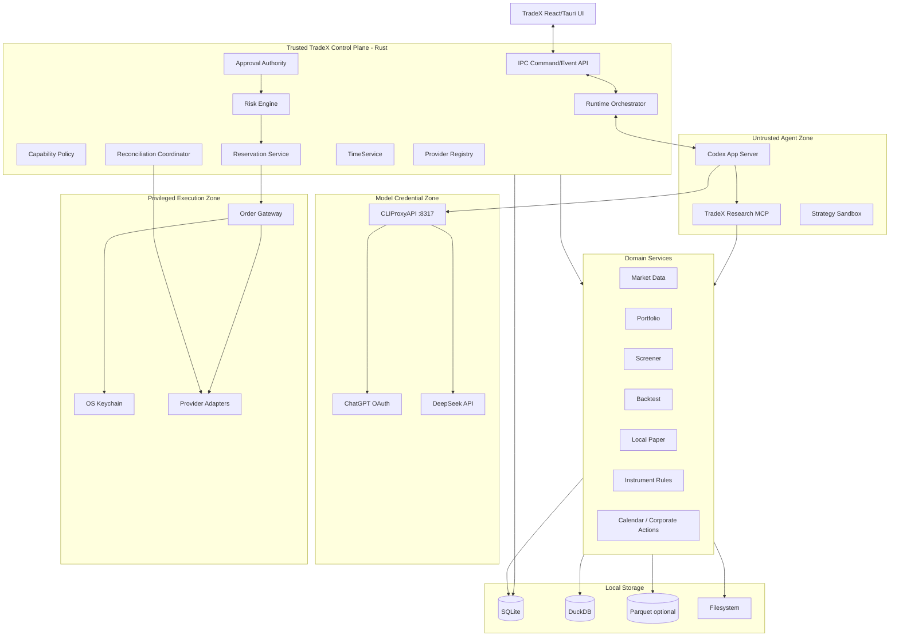

# TradeX 后端架构需求与设计（ARD）

**契约澄清日期：** 2026-09-05（RevC）；S18 本地账户删除契约于 2026-09-23 增补。原型行为仅为证据，以 QA Report 记录的缺陷和待验证门槛为准。

**版本：** v1.0 Revision C (RevC)  
**状态：** 工程基线  
**范围：** 本地后端 / Control Plane / Agent Runtime 集成 / Domain Services / Execution Boundary  
**主要实现：** 以 Rust Control Plane 为核心，并在合理场景使用本地 Sidecar / Process  
**来源基线：** `TradeX_PRD_v1.0_RevC_zh.md`、`TradeX_UI_Prototype_Spec_v1.0_RevC_zh.md`；原型观察另见 QA Report\
**语言：** 简体中文

> 本 ARD 将 RevC 产品需求落实为可实施的后端架构。安全语义、产品状态、Provider 范围和存储职责以 RevC PRD 为准；下文中的进程边界、服务拆分、持久化模式、Command/Event Contract、并发控制和 Adapter Pattern 属于工程实现层面的架构决策。

---

## 1. 目的

TradeX 后端是桌面 Workspace 背后的可信本地 Control Plane。它集成 Codex App Server 负责 Agent 执行，使用 CLIProxyAPI 负责模型路由，使用本地域服务完成研究/回测，并通过隔离的券商/交易所 Adapter 访问账户和执行能力。

后端最核心的职责是：允许 Agent 进行研究并提出金融操作，但绝不能让 Agent 自身成为金融执行权限主体。

后端必须：

- 监督本地 runtime dependency；
- 持久化 Thread / Turn / Item provenance；
- 向 Agent 暴露 typed domain tools；
- 统一 instrument、account、order、market data 与 provider capabilities；
- 管理 account-scoped live arming；
- 运行 deterministic risk；
- 签发和验证 TradeX financial approval；
- 按账户原子预留执行 capacity；
- 隔离 privileged Order Gateway 与 credentials；
- 在 ambiguity、restart、sleep、disconnect 和 rate limit 下安全 reconciliation/recovery；
- 保持本地 auditability 与 data provenance。

---

## 2. 架构驱动因素

### 2.1 安全驱动

1. Model 不能访问原始 broker secrets。
2. Codex/Agent runtime 不能直接调用 privileged Order Gateway。
3. Generic Codex approval 不能授权金融执行。
4. Live approval 必须绑定 proposal/account/action、短期且 single-use。
5. Live orders、positions、fills 以 broker/exchange state 为权威。
6. 对 ambiguous non-idempotent submission 禁止 blind retry。
7. Live account arming 按账户隔离，并在安全 trigger 时 reset。
8. Reservation 在 concurrent threads 间按账户原子化。
9. stale market data 或不可接受的 clock uncertainty 对 live authority decision fail closed。
10. Dangerous credential permission 必须阻止 live readiness。

### 2.2 Runtime 驱动

- Codex App Server 固定版本并进行 compatibility test。
- CLIProxyAPI 固定版本、由本地 supervise，并且是唯一 LLM egress。
- 即使模型不可用，Control Plane 的 trading/reconciliation 仍继续运行。
- 默认 local persistence；external telemetry 仅 opt-in。

### 2.3 数据驱动

- SQLite 负责 transactional/domain state 与 financial audit。
- DuckDB 负责 MVP analytical/historical data。
- Parquet 仅用于可选的大型 immutable dataset/interchange。
- Filesystem 保存 artifacts、strategies、exports、backups、datasets。
- Secret 排除在所有普通 Workspace storage 之外。

---

## 3. 后端系统上下文


```mermaid
flowchart TD
    UI[TradeX React/Tauri UI]

    subgraph CP[Trusted TradeX Control Plane - Rust]
      API[IPC Command/Event API]
      ORCH[Runtime Orchestrator]
      CAP[Capability Policy]
      RISK[Risk Engine]
      APPR[Approval Authority]
      RES[Reservation Service]
      REC[Reconciliation Coordinator]
      TIME[TimeService]
      PROV[Provider Registry]
    end

    subgraph AGENT[Untrusted Agent Zone]
      COD[Codex App Server]
      MCP[TradeX Research MCP]
      SBX[Strategy Sandbox]
    end

    subgraph MODEL[Model Credential Zone]
      CLIP[CLIProxyAPI :8317]
      CHAT[ChatGPT OAuth]
      DS[DeepSeek API]
    end

    subgraph DOMAIN[Domain Services]
      MKT[Market Data]
      PORT[Portfolio]
      SCR[Screener]
      BT[Backtest]
      PAPER[Local Paper]
      INST[Instrument Rules]
      CAL[Calendar / Corporate Actions]
    end

    subgraph EXEC[Privileged Execution Zone]
      GW[Order Gateway]
      KEY[OS Keychain]
      ADP[Provider Adapters]
    end

    subgraph STORE[Local Storage]
      SQL[(SQLite)]
      DUCK[(DuckDB)]
      PQ[(Parquet optional)]
      FS[Filesystem]
    end

    UI <--> API
    API <--> ORCH
    ORCH <--> COD
    COD --> MCP
    COD --> CLIP
    CLIP --> CHAT
    CLIP --> DS

    MCP --> DOMAIN
    CP --> DOMAIN

    APPR --> RISK
    RISK --> RES
    RES --> GW
    GW --> KEY
    GW --> ADP
    REC --> ADP

    CP --> SQL
    DOMAIN --> SQL
    DOMAIN --> DUCK
    DOMAIN --> PQ
    DOMAIN --> FS
```

---

## 4. 信任区与进程边界

TradeX 定义四个安全相关区域。

### 4.1 Untrusted Agent Zone

包含：

- Codex App Server；
- TradeX research MCP/tool process；
- strategy sandbox；
- workspace research files。

该区域可以读取获准 context 并创建 proposal/signal，但不得获得 broker credentials 或直接 execution capability。

### 4.2 Trusted Control Plane

包含金融权限逻辑：

- capability policy；
- account arming state；
- risk engine；
- approval authority；
- reservations；
- reconciliation coordination；
- provider capability/health state；
- TimeService；
- persistence transactions。

### 4.3 Privileged Execution Zone

包含：

- OS keychain access；
- provider request signing/authentication；
- ExecutionAdapter 实现；
- Order Gateway。

只有经过验证、批准并成功 reservation 的 execution intent 才能进入该区域。

### 4.4 Model Credential Zone

仅包含 CLIProxyAPI 与 model credentials：

- ChatGPT OAuth token 位于 sidecar auth directory；
- DeepSeek API key 由 Rust 在 launch 时渲染到 sidecar config。

Broker credentials 绝不能进入该区域。

---

## 5. 本地进程拓扑

推荐 v1.0：

```text
tradex-desktop (Tauri/Rust main process)
 ├─ React webview
 ├─ embedded/control-plane Rust services
 ├─ child: order-gateway [privileged execution; private IPC only]
 ├─ child: codex-app-server [pinned]
 ├─ child: cliproxyapi [pinned, localhost:8317]
 ├─ child: research-mcp (Rust or Python, restricted contract)
 └─ child: strategy/backtest worker(s) [restricted]
```

### 5.1 Process supervision

Rust main process 负责：

- deterministic startup order；
- version verification；
- health checks；
- capped exponential backoff restart；
- stdout/stderr redaction；
- shutdown coordination；
- crash event persistence。

### 5.2 Startup order

推荐：

```text
open/migrate SQLite
→ load settings + provider metadata
→ initialize TimeService
→ initialize domain services + durable event/authority store
→ start/authenticate Order Gateway (new mutations disabled)
→ restore account metadata
→ reconcile all live/open-order accounts
→ expose live execution readiness only for healthy accounts
→ require explicit per-account arming before new Live mutations
```

领域服务初始化后，以独立且有界退避的分支执行 CLIProxyAPI 启动 → `/v1/models` 探测 → Codex App Server 启动。模型启动失败不得阻塞订单查询、对账、账户 disarm 或执行控制面。只有所选模型路由健康后才能开始 Agent Turn；此前工作区可显示历史与恢复入口。

### 5.3 Order Gateway 进程边界

独立子进程是强制要求（PRD OD-009），桌面主进程内的模块不能代替该边界。“Privileged”表示独占交易/凭据能力，不表示以 root/管理员身份运行。父进程固定并验证二进制版本，负责健康检查、有界重启、日志脱敏和关闭。

使用专属继承式双向 IPC 通道，以消息长度分帧，并在启动时握手协议版本。父进程持有唯一对端句柄；不得开放监听 TCP 端口，也不得把该句柄传给 webview、Codex、CLIProxyAPI、研究或策略 worker。每次子进程会话通过继承通道传递随机会话凭证完成认证；凭证不能放入命令行参数、日志或普通工作区文件。协议不兼容时，在接受任何请求前拒绝连接。

Gateway 经认证的控制面通道读取权威不可变对象，不成为第二个 SQLite 写入者。只有其提供方签名层解析执行凭据引用。模型凭据和任意前端/Agent 订单字段不得进入 Gateway 请求。Gateway 故障使受影响 Live 账户 disarm，停止未派发工作，并对所有可能到达提供方的尝试完成对账后才允许显式重新 arming。重启子进程绝不自动重放订单修改请求。

Agent workspace 可以在 broker reconciliation 尚未结束时部分可用，但受影响 account 的 Live execution 必须保持 blocked。

---

## 6. 后端模块拆分

推荐 Rust workspace：

```text
crates/
  tradex-app/
  tradex-api/
  tradex-domain/
  tradex-runtime/
  tradex-thread/
  tradex-capability/
  tradex-market/
  tradex-instruments/
  tradex-portfolio/
  tradex-risk/
  tradex-approval/
  tradex-reservation/
  tradex-execution/
  tradex-reconciliation/
  tradex-provider-core/
  tradex-provider-alpaca/
  tradex-provider-t212/
  tradex-provider-binance/
  tradex-provider-bitget/
  tradex-storage/
  tradex-observability/
  tradex-security/
```

Quant/scientific workload 可以使用 Python worker，但金融 authority 必须留在 Rust。

---

## 7. Canonical Domain Model

### 7.1 Identity 规则

Domain logic 使用稳定 canonical IDs：

```text
workspace_id
thread_id
turn_id
account_id
instrument_id
proposal_id
approval_id
reservation_id
execution_attempt_id
provider_order_id
market_snapshot_id
policy_version
```

Provider-specific symbol/ID 只存在于 adapter mapping。

### 7.2 Instrument 示例

```yaml
instrument_id: equity:US:AAPL
asset_class: EQUITY
exchange: XNAS
currency: USD
providers:
  alpaca: AAPL
  trading212: provider_specific_id
```

```yaml
instrument_id: crypto:BTC/USDT:spot
asset_class: CRYPTO_SPOT
base: BTC
quote: USDT
providers:
  binance: BTCUSDT
  bitget: BTCUSDT
```

### 7.3 Decimal arithmetic

Price、quantity、notional、fees、FX conversion 与 risk calculation 必须使用 decimal-safe type。金融权限逻辑禁止 binary floating point。

### 7.4 Quantity semantics

```rust
enum OrderQuantity {
    Base(Decimal),
    Quote(Decimal),
    Notional(Decimal),
}
```

Adapter 根据 provider capability 与 instrument rules 显式转换。

---

## 8. Thread / Turn / Item Runtime 架构

### 8.1 Persistent Thread

只保存导航/default context：

```text
workspace_id
codex_thread_id
title
created_at
updated_at
default_agent_mode
linked_accounts[]
linked_instruments[]
linked_strategies[]
linked_artifacts[]
```

### 8.2 Immutable Turn snapshot

Turn 开始时持久化：

```text
turn_id
agent_mode_at_start
selected_account_id?
execution_context_at_start
capability_level_at_start
model_id
model_provider
attached_context_ids[]
attached_context_hashes[]
started_at
```

Turn 启动后该 snapshot 不可修改。Provider attempts 和完成时间属于启动快照之外只追加的 Turn 生命周期事件；历史模型/上下文不能从当前工作区默认值读取。

### 8.3 Runtime adapter

`tradex-runtime` 将 Codex protocol event 转换为 TradeX domain item，避免产品逻辑直接依赖不稳定 protocol detail。

```text
Codex JSON-RPC/JSONL
→ RuntimeProtocolAdapter
→ TradeX TurnEvent / ItemEvent
→ persistence
→ UI domain event
```

### 8.4 Generic approval 隔离

Codex approval event 可以暂停/恢复 Turn，但必须与 `FinancialApproval` 分开存储，任何代码路径都不能相互强转。

---

## 9. Agent Mode、Execution Context 与 Capability Policy

### 9.1 Agent Mode

```text
ASK
RESEARCH
BACKTEST
TRADE
```

### 9.2 Execution Context

```text
NONE_READ_ONLY
HISTORICAL_SIMULATION
LOCAL_PAPER
ALPACA_PAPER
TRADING212_DEMO
TRADING212_LIVE
BINANCE_TESTNET
BINANCE_LIVE
BITGET_DEMO
BITGET_LIVE
```

### 9.3 Capability Policy Service

根据具体 Turn snapshot 返回允许的 tool capability。

```rust
struct CapabilityDecision {
    level: CapabilityLevel,
    allowed_tools: Vec<ToolId>,
    execution_allowed: bool,
    reason: Option<String>,
}
```

规则：

- Ask/Research 不获得 current-market execution tools；
- Backtest 只有 historical simulation；
- Trade + Paper/Demo/Testnet 可获得 C3 execution tools；
- Trade + Live 可以达到 proposal capability C4；
- C5 不是常驻 tool grant，只在 Control Plane 内消费有效 transaction-specific approval 时临时成立；
- C6 不支持。

---

## 10. LLM Runtime 架构

### 10.1 Single egress

所有 model inference 都经过：

```text
127.0.0.1:8317 → CLIProxyAPI
```

TradeX、Codex、research tool、strategy code 禁止直接连接外部 LLM endpoint。

### 10.2 CLIProxyAPI supervision

后端负责：

- 验证 pinned binary/version；
- 占用/验证 8317 port；
- 启动 sidecar；
- 只注入 model credentials/config；
- probe `/v1/models`；
- 分类 stopped/port-conflict/unauthorized；
- 适用时 backoff restart；
- 退出时清理渲染的 DeepSeek configuration。

### 10.3 Provider routing

V1.0：

- ChatGPT subscription OAuth → GPT-5.6 series；
- DeepSeek official API → `deepseek-v4-flash`，显式使用 `thinking.type: disabled` 或 `thinking.type: enabled`。

选择的普通/推理模式与真实模型 ID 一起进入不可变路由/尝试快照和审计。必须通过 CLIProxyAPI 显式发送模式，不依赖上游默认值，也不将任一模式伪装为已弃用模型名。本次用户批准的模型名称澄清不增加提供方，不放宽单一出口或金融安全规则。

Cross-provider automatic fallback 默认 OFF。

### 10.4 Provider attempt audit

每次 attempt 持久化：

```text
turn_id
attempt_no
model_id
provider
started_at
ended_at
result
error_category?
quota_metadata?
```

若发生用户 opt-in 的 automatic fallback，两个 attempt 都必须保留并可审计。Provider switch 不得改变金融 capability state。

### 10.5 Model failure independence

`MODEL_UNAVAILABLE`、`OAUTH_EXPIRED`、`QUOTA_EXCEEDED` 可以阻止新的 Agent turn，但不得停止：

- live order monitoring；
- 已进入可信 control-plane flow 的 cancellation；
- reconciliation；
- account health processing；
- audit persistence。

---

## 11. Provider Registry 与 Schema-driven Connection Model

### 11.1 Provider definition

每个 integration 暴露：

```rust
struct ProviderDefinition {
    provider_id: ProviderId,
    display_name: String,
    environments: Vec<Environment>,
    credential_schema: CredentialSchema,
    capability_schema: CapabilitySchema,
    permission_rules: PermissionRules,
}
```

### 11.2 Credential schema

Schema 描述：

- fields；
- sensitivity；
- required/optional；
- environment applicability；
- help text；
- validation behavior。

后端不得假定所有 broker 都使用相同 `API Key + Secret`。

### 11.3 Secure connection sequence

```text
UI submits secret fields through privileged Tauri command
→ Rust validates shape
→ write secret to OS keychain
→ persist only credential reference metadata
→ adapter probes provider
→ discover permissions/capabilities
→ apply dangerous-permission safety gate
→ persist non-secret health/capability metadata
→ return sanitized account connection result
```

### 11.4 Permission gate

检测到以下权限时阻止 Live readiness：

- withdrawal；
- transfer；
- custody authority；
- unsupported margin/leverage-management authority。

无法 introspect permission 时标记 `UNVERIFIED`，要求用户 acknowledge，并持续在 Account Health 中可见。

---

## 12. Broker Adapter 架构

采用小型、按 capability 拆分的 interface，避免 oversized abstraction。

```rust
trait AccountAdapter { /* balances, positions, orders */ }
trait ExecutionAdapter { /* place/cancel/query execution */ }
trait MarketDataAdapter { /* quotes/bars/book + instrument metadata */ }
trait AccountStreamAdapter { /* private account/order stream */ }
```

### 12.1 Capability discovery

```rust
struct BrokerCapabilities {
    account_read: bool,
    position_read: bool,
    public_market_data: bool,
    private_account_stream: bool,
    order_types: Vec<OrderType>,
    fractional_quantity: bool,
    notional_orders: bool,
    extended_hours: bool,
    client_order_id: bool,
    paper_environment: bool,
    live_environment: bool,
}
```

在 provider 支持时，额外记录 TIF、min notional、post-only/venue constraints、cancellation behavior 和 provider-specific limit。

### 12.2 Provider-specific adapters

V1.0：

- Alpaca Paper；
- Trading 212 Demo / Live；
- Binance Testnet / Spot Live；
- Bitget Demo / Spot Live。

Adapter 将 canonical order 映射成 provider request，并把 provider state 映射回 normalized TradeX state。

### 12.3 Adapter error normalization

Provider error 映射到 canonical taxonomy，同时保留经过 redaction 的 provider raw code/message 作为诊断 metadata。

---

## 13. Market Data 架构

### 13.1 与 Execution 分离

Market data 与 broker execution 是不同 service contract。Broker adapter 即便能提供 market data，domain 也不能假设其数据完整或可用于 execution-grade 决策。

### 13.2 Subscription/access tiers

```text
Census — broad coarse universe/on-demand
Warm   — watchlists/candidates periodic refresh
Hot    — currently viewed/monitored active stream
Cold   — persisted historical/backtest data
```

MVP 使用 Hot active subscription 加 watchlist/universe 的 on-demand/coarse refresh，不对全部 universe 维持 always-on tick subscription。

### 13.3 Market snapshot

```rust
struct MarketSnapshot {
    id: MarketSnapshotId,
    instrument_id: InstrumentId,
    source: String,
    venue: Option<String>,
    provider_timestamp: DateTime<Utc>,
    received_timestamp: DateTime<Utc>,
    entitlement: Entitlement,
    freshness: FreshnessState,
    payload: MarketPayload,
}
```

所有 Live authority decision 都引用 persisted snapshot ID。

### 13.4 Entitlement metadata

每个 market-data integration 定义：

- realtime/delayed；
- local retention limit；
- redistribution restriction；
- commercial constraint；
- 适用 jurisdiction。

---

## 14. TimeService

TimeService 为以下能力提供一致时间语义：

- quote age；
- approval TTL；
- reconciliation deadline；
- event ordering；
- provider timestamp offset。

### 14.1 Data model

同时跟踪 wall-clock 与 monotonic time，检测：

- significant wall-clock jump；
- system resume discontinuity；
- provider/server offset 超 tolerance；
- quote age 不确定。

### 14.2 Fail-closed 规则

TimeService 认为 timing confidence 低于 Live threshold 时：

- 不签发/接受新的有效 Live approval；
- pre-execution freshness/TTL check 失败；
- account/execution surface 收到 clock/freshness blocking state；
- monitoring/reconciliation 继续运行。

---

## 15. Instrument Rules、Calendar 与 Corporate Actions

### 15.1 InstrumentRulesService

维护 venue/provider-specific constraints：

- tick size；
- price/quantity precision；
- minimum/maximum quantity；
- minimum/maximum notional；
- allowed order types；
- market-order constraints；
- trading status。

验证顺序：

```text
normalized order
→ InstrumentRulesService
→ deterministic risk
→ approval
→ pre-execution revalidation
→ provider adapter
```

### 15.2 MarketCalendarService

Equity：

- holidays；
- half days；
- sessions；
- extended-hours state；
- open/close timestamps；
- halts。

### 15.3 CorporateActionsService

追踪：

- splits；
- dividends；
- symbol changes；
- delistings；
- historical adjustment metadata。

在 execution 不被允许时，`MARKET_CLOSED` 与 `INSTRUMENT_HALTED` 是 deterministic blocking state。

---

## 16. Portfolio 与 Valuation 架构

### 16.1 Broker truth

Balance、position、open order、fill 来源于 provider state，并归一化成本地 projection。

### 16.2 Workspace base currency

Portfolio aggregation 使用配置的 base currency。

### 16.3 FX/stablecoin conversion

Conversion 记录：

```text
source
pair/path
provider timestamp
TradeX received timestamp
freshness
quality/depeg state
```

不得假设 `USDT = USD` 或 stablecoin 永远锚定。

如果 conversion quality 不可靠，且 Live risk 依赖该 normalized value，则执行必须 fail closed。

---

## 17. Deterministic Risk Engine

Risk Engine 与模型独立。

### 17.1 Inputs

Risk evaluation 消费 immutable snapshot/reference：

- account state；
- normalized order proposal；
- instrument rules；
- current market snapshot；
- policy version；
- portfolio/exposure state；
- open orders；
- active reservations；
- daily execution counters；
- market/calendar status；
- 必要时的 valuation provenance。

### 17.2 User-configurable policy

支持：

- maximum order notional/quantity；
- position/concentration limits；
- asset-class exposure；
- daily traded notional/loss；
- max open orders；
- max reserved capital；
- allowed/blocked instruments/venues/accounts；
- market-order enablement/slippage；
- price deviation；
- stale-price threshold；
- environment constraints。

Agent 无法修改 policy。

### 17.3 Hard safety rules

系统强制且不可 bypass：

- approval binding；
- duplicate-order protection；
- decimal/precision validation；
- instrument-rule validation；
- authoritative reconciliation；
- unhealthy-account block；
- stale snapshot block；
- reservation correctness；
- ambiguity 后禁止 blind retry；
- Order Gateway isolation。

### 17.4 Risk result

```rust
struct RiskDecision {
    decision_id: DecisionId,
    workspace_id: WorkspaceId,
    proposal_id: ProposalId,
    proposal_hash: Sha256,
    account_id: Option<AccountId>,
    environment: ExecutionContext,
    policy_version: Option<PolicyVersion>,
    policy_state_version: Option<StateVersion>,
    status: RiskDecisionStatus, // ALLOWED | REJECTED | UNAVAILABLE
    state_version: StateVersion,
    inputs: Vec<RiskDecisionInputReference>,
    checks: Vec<RiskCheckResult>,
    evaluated_at: DateTime<Utc>,
}
```

每项输入引用包含 kind、有界 reference ID、SHA-256 摘要及可选观察时间。每项检查包含稳定 ID、`PASS` / `REJECT` / `UNAVAILABLE`、reason code 与脱敏解释。任一拒绝优先；没有拒绝但至少一项 unavailable 时，总体为 unavailable。null 策略限额明确记录 `LIMIT_NOT_CONFIGURED`;已配置限额所需证据缺失时不能转成零。

输入摘要覆盖规范化后的实质证据，不包含仅读取时元数据。摘要排除策略更新时间、组合采集/行观察时间与 FX 接收时间、行情标的/时段观察时间，以及不断变化的 wall-clock/monotonic 样本；账户与策略状态、组合估值/持仓/未结订单/成交、报价身份/价格/来源/venue/entitlement/freshness，以及时钟可信度/provider offset 仍会绑定。报价 `providerTimestamp`、`receivedTimestamp` 和市场状态 `providerTime` 在哈希前会解析、转换为 UTC，并格式化为规范 RFC3339。重新验证会比较这些摘要和当前检查；报价与仪器状态 freshness 仍会基于可信时钟重新计算并保留亚秒精度，未来时间戳的证据视为 unavailable。

每条 decision 与 proposal 分开持久化为 append-only `risk.decision.evaluated` 事件，以 workspace + proposal 和每 proposal 连续序号为键。重新求值只追加历史，不改变 proposal/hash。Renderer 仅传 workspace/proposal ID;Control Plane 自行读取 policy、准确账户、完整 workspace Portfolio、market/time 与已有活动证据并计算全部检查。提交路径使用同一 evaluator 重新求值，并在创建 attempt 或进行 provider/simulator I/O 前拒绝 `REJECTED` / `UNAVAILABLE`。错误保持区分：`RISK_REJECTED` 与 `RISK_EVIDENCE_UNAVAILABLE`。

非本地执行要求可信实时行情来源、受信时钟、权威开盘状态和权威 provider 标的规则。在对应适配器提供这些输入之前，结果保持 `UNAVAILABLE`;本切片不新增行情、日历、FX、成交、预留或 provider-rule 采集。策略结果不代表金融审批、Arm、预留或 Gateway 授权。普通 Bitget `LIVE` 映射至 `RiskPolicyEnvironment::Live`;本决策路径不调用 provider，也不给 Bitget Demo/Live 写入权限。

---

## 18. Risk Policy Versioning 与 Serialization

`risk` aggregate 为每个 workspace 持有一份共享策略。该 workspace 中已持久化的账户绑定决定受影响集合；UI 当前选中的账户不会参与策略作用范围计算。

Save flow：

```text
begin workspace SQLite immediate transaction; verify policy/account/proposal versions
→ persist new policy version
→ re-evaluate every pending proposal against the new policy
→ append `POLICY_CHANGED` to each pending proposal bound to the old version
→ persist `POLICY_VERSION_STALE` decisions and audit projections
→ if any field relaxed: DISARM every affected Live account
→ commit
```

只要变更中有任一字段放宽，`weakened` 就为 true，即使同一变更也收紧了其他字段；仅收紧的变更为 false。提高或取消最高限额、扩大 allow-list、从 block-list 删除项目、启用市价单，以及放宽过期/不活跃阈值都属于弱化。提交前会重新核验 policy、账户集合和 proposal 状态版本；并发陈旧写入会失败且不产生部分效果。`risk.policy.changed`、可选的账户撤防事件、proposal 失效事件和 RiskDecision 在同一事务内提交。

可复用的 `POLICY_VERSION` eligibility check 会以 `POLICY_VERSION_STALE` 拒绝旧版本 proposal；S22 审批资格使用相同判定。S23 负责把 approval consumption/reservation 与策略保存纳入原子串行化。当前持久化的 Live 账户受 invariant 约束为 DISARMED；后续若作用范围内出现 ARMED 账户，弱化策略的事务会将其设为 DISARMED。

---

## 19. Order Draft 与 Immutable Proposal Service

### 19.1 Draft

`OrderDraft` 可以自由修改，不具备 authority。

### 19.2 Proposal generation

```text
OrderDraft
→ normalize canonical order
→ validate instrument/provider capability
→ capture market_snapshot_id where needed
→ bind policy_version
→ generate proposal_id
→ canonical serialize
→ SHA-256 proposal_hash
→ persist immutable OrderProposal
```

### 19.3 Material edit

任何 material edit 生成新的 proposal ID/hash。旧 approval 不可使用，但保留 audit history。

### 19.4 Canonical serialization

Hashing 使用 deterministic serialization，并明确 decimal/string normalization、field ordering、instrument/account identity、environment、TIF 与 quantity semantics。

---

## 20. Financial Approval Authority

`FinancialApproval` 与 Codex approval 完全分离。

### 20.1 Approval payload

```rust
struct FinancialApproval {
    approval_id: ApprovalId,
    intent: ApprovedFinancialIntent,
    account_id: AccountId,
    operation: FinancialOperation,
    policy_version: PolicyVersion,
    issued_at: DateTime<Utc>,
    expires_at: DateTime<Utc>,
    nonce: String,
    consumed_at: Option<DateTime<Utc>>,
}
```

ApprovedFinancialIntent 是带类型标签的联合：PLACE_ORDER 绑定 proposal_id/proposal_hash；CANCEL 绑定 cancellation_intent_id/intent_hash。operation 必须匹配标签、账户及不可变意图。撤单审批不能授权新建订单。

### 20.2 属性

- proposal-bound；
- account-bound；
- operation-bound；
- short-lived；
- single-use；
- material order change 时 invalidated；
- relevant policy change 时 invalidated；
- market snapshot/clock condition 不再满足时不可执行。

审批审阅不等于审批授权。`trade.request_approval` 返回由后端构建、绑定当前不可变 proposal 与 `ALLOWED` RiskDecision 的审阅内容，包括 provider/账户/LIVE 身份、proposal 字段、完整可用报价来源信息、基于受信审阅时间和 TradeX 接收时间计算的报价年龄，以及风险检查。买单显示预期支出；卖单显示预期收入；两者均显示最大授权金额。对于市价单，后端使用精确十进制算术比较预期金额与最大授权额；预期金额超过上限时，审阅不可批准，`trade.approve` 不会签发。估算费用与滑点属于可选的受信估算；没有估算来源时必须明确显示为 unavailable。审阅返回的 RiskDecision ID 只用于比较并重新校验，不能作为 renderer 提交的授权依据。`trade.approve` 会重新读取并求值所有输入；只有用户审阅的 proposal 与证据仍未变化时才签发。原生 UI 只能由明确的 Approve 操作触发签发；Codex 通用 approval、Enter 和 Agent 请求均不构成批准操作。

已签发 approval 绑定 workspace、不可变 proposal ID/hash、Live 账户与环境、`PLACE_ORDER`、policy version、审阅证据摘要和这一次明确的批准操作。approval ID、nonce、签发时间和过期时间均由后端设置。初始有效期最长 30 秒，并使用可信 `TimeService`；时钟不可信时阻止签发，过期/失效检查 fail closed。审阅与 approval 历史只包含脱敏原因和证据引用，不包含凭据、签名串或原始 provider body。

明确 Reject 会持久记录 `USER_REJECTED` 审计操作，且不会创建 `FinancialApproval`。编辑/刷新、账户撤防或健康变化、policy 或有实质影响的 RiskDecision/报价变化、时间失信和过期都会持久失效已签发的 approval。之后读取 `trade.approval.list` 时也会重新检查当前后端有效性，因此非流式报价或时钟变化会在 UI 将 approval 显示为当前状态或使用前被记录。

### 20.3 Approval consumption

S22 的 approval 签发不会消费 approval，也不会创建 reservation。S23 负责将消费与 pre-execution validation、reservation creation 放在同一事务中。已 consumed approval 不能复用。

---

## 21. Account-scoped Live Arming

Live arming 在 Control Plane 中按账户持久化：

```text
account A: DISARMED/ARMED
account B: DISARMED/ARMED
account C: DISARMED/ARMED
```

### 21.1 Arm requirements

接受 `ARM` 前：

- account connection healthy；
- reconciliation complete；
- credential/permission acceptable；
- provider capability 支持 Live；
- 不存在 blocking recovery state；
- 用户动作明确指向该账户。

### 21.2 Automatic disarm triggers

发生以下情况时 disarm 受影响账户：

- application restart；
- OS sleep/session lock；
- 在 macOS 上，`NSApplicationDidResignActiveNotification` 将每次应用失活（包括普通应用切换）统一视为 `SESSION_INACTIVE`；因此锁屏切换到 loginwindow 时会 fail closed；
- credential change；
- account health degradation；
- reconciliation failure；
- relevant pre-execution failure；
- risk-policy weakening；
- inactivity timeout。

### 21.3 Global Disable All

单个 Control Plane operation 原子地把全部 live account 设为 DISARMED，并追加 audit event。

应用重启、OS 休眠/锁屏和 Disable All 影响全部 Live 账户。凭据/健康故障影响指定账户；共享策略变更影响绑定该策略版本的全部账户。UI 当前选择不能决定作用范围。

Disable All 同时撤销尚未派发的执行许可。在受信派发边界之前停止的 `RESERVED` 尝试失效，并按 PRD §45 释放预留。已经进入提供方 I/O 的尝试保留预留并对账；Disable All 不等于隐式券商撤单。重新 arming 不恢复旧审批或派发许可。

---

## 22. Execution Reservation Service

Reservation 防止多个 Thread 重复消费同一 capacity。

### 22.1 Effective capacity

Risk 计算前由 adapter 规范化 provider capacity：

```text
provider gross balance
- provider open-order commitment（仅当 adapter 返回 gross balance 时扣除）
= normalized provider available

normalized provider available
- active reservations
- submitted-but-unconfirmed exposure
± pending cancellation rules
= effective available capacity
```

当 adapter 已返回扣除券商订单锁定额后的 free/available-to-trade 时，该值已经不含 provider commitment。后端仍会提供承诺金额及其来源供解释，但绝不会再次扣减。容量证据绑定精确 account state version 和观测时间；证据陈旧或不可用时不返回金额字段。

### 22.2 Atomicity model

使用 per-account serialization：SQLite immediate transaction + 应用内串行 Control Plane 命令队列。准备、共享策略保存、账户撤防/Disable All 及可信时钟过期扫描共用此写入边界；先提交的操作决定准备被拒绝，还是仍处于 `RESERVED` 的 attempt 被停止。

Database transaction 是 correctness boundary；in-memory lock 只是降低争用，不是唯一安全机制。

### 22.3 Reservation lifecycle

显式 `trade.execution.prepare` 仍是唯一公开的 PLACE/CANCEL 授权入口。对于 Live PLACE，一个 SQLite immediate transaction 重新校验精确 proposal 与账户，消费 approval 和 proposal，创建精确容量 reservation 与 `RESERVED` attempt，并提交审计/outbox。对于 Live CANCEL，同一命令重新校验获批的不可变意图、提供方订单身份、账户快照/证据、策略与剩余数量，然后只消费撤单 approval，并保存不带新增 reservation 的 `RESERVED` attempt。在该事务提交后，Control Plane 在内部启动隔离的 Order Gateway。Gateway 只有在当前授权复核并记录一次性许可后才能继续；只有 `SUBMITTING` 及其审计/outbox 持久化后，才允许 provider I/O。在权威提供方证据确认撤单或成交竞态之前，原订单承诺继续占用容量。若共享策略变更、账户撤防/Disable All 或可信 approval TTL 到期先于 `SUBMITTING` 获胜，则原子使 attempt 失效；active PLACE reservation 恰好释放一次。已消费 approval 保留已消费审计状态，同幂等键重放只读取已保存状态，不会重发。响应丢失或重启后，`trade.execution.preparation.get` 按 workspace 和 approval 身份读取耐久 attempt 及其 active/released PLACE reservation。

```text
PLACE：APPROVED → RESERVED（精确 reservation）→ SUBMITTING
       → ACCEPTED / REJECTED / UNKNOWN_RECONCILING
       → 仅依据权威处置证据调整/释放
CANCEL：APPROVED → RESERVED（不新增 reservation）→ SUBMITTING
        → CANCEL_PENDING / REJECTED / UNKNOWN_RECONCILING
        → 提供方确认的终态或成交竞态

若停止在 SUBMITTING 前获胜：RESERVED → INVALIDATED（STOPPED_BEFORE_DISPATCH）；
                                active PLACE reservation → RELEASED
```

### 22.4 Unknown state

`UNKNOWN_RECONCILING` 冻结 capacity，超时后也不能自动 release。

以 PRD §45 的过期/释放条件表为准。可能已经传输后的审批过期仅修改审批记录。提供方终态证据应先计入累计成交/费用，再释放未使用部分；仅收到撤单请求确认不能释放。证据引用、原状态、释放金额及最终账户状态须与预留处置在同一事务中持久化。

---

## 23. Pre-approval 与 Pre-execution Validation Pipeline

### 23.1 Pre-approval

```text
proposal immutable?
→ account/environment compatibility
→ account health
→ arming state for Live
→ provider capability
→ instrument rules
→ market/calendar state
→ market snapshot freshness/entitlement
→ TimeService confidence
→ deterministic risk
→ reservation capacity preview
→ approval request eligibility
```

### 23.2 Pre-execution

尝试进入后续 S24 broker 派发边界前执行：

```text
approval valid + unconsumed?
→ proposal hash matches?
→ policy version unchanged?
→ account still ARMED?
→ account healthy/reconciled?
→ quote still fresh?
→ TimeService trusted?
→ cash/positions/open orders refreshed as policy requires?
→ reservation created atomically
→ consume approval
→ consume proposal
→ transition RESERVED
→ commit 后由 Control Plane 在内部启动 Order Gateway
→ Gateway 重新验证后才可记录 SUBMITTING；provider mutation 必须在该提交之后
```

Material failure 会 invalidate/reject flow，并在需要时要求新的用户同意。

---

## 24. Privileged Order Gateway

### 24.1 职责

Order Gateway 是唯一允许执行 Live provider mutation 的组件。

它只接收狭窄 internal request，不接收自由形式 Agent input。

```rust
struct GatewayExecutionRequest {
    execution_attempt_id: ExecutionAttemptId,
    intent_id: FinancialIntentId,
    operation: FinancialOperation,
    approval_id: ApprovalId,
    reservation_id: Option<ReservationId>,
    account_id: AccountId,
}
```

Gateway 在 privileged boundary 内重新加载权威 proposal/account data，不信任 caller 复制的 mutable fields。

intent_id 在 PLACE_ORDER 时解析为不可变 OrderProposal，在 CANCEL 时解析为 CancellationIntent。新建订单必须有 reservation_id；撤单可以引用已有预留，但不能仅为了撤单而新增购买预留。

### 24.1.1 派发权威与故障边界

1. 显式 `trade.execution.prepare` 在账户/策略串行化边界内消费 proposal/approval，并原子持久化 `RESERVED` attempt、适用的 PLACE reservation、审计和 outbox。事务提交后，Control Plane 在内部启动 Gateway；Gateway 重新读取这些耐久状态。
2. Gateway 经私有通道为该尝试申请一次性派发许可。控制面使用与 disarm/策略保存相同的串行化边界，重新校验 arming、健康、权限、策略、proposal 身份、行情/时钟/FX 可执行性及当前预留；先持久化许可，再回复。
3. Gateway 按账户串行处理派发与撤销，确认许可仍有效，并在提供方 I/O 前通过控制面持久化 `SUBMITTING` 意图。在此边界前已确认的 disable 阻止 I/O；跨过边界后，取消本地工作不能证明提供方没有收到请求。
4. 若停止在 `SUBMITTING` 前获胜，则撤销许可、持久化 `STOPPED_BEFORE_DISPATCH`/失效状态，不发送 provider mutation，并恰好释放一次 active PLACE reservation。若 `SUBMITTING` 先提交，则持久化 `MAY_HAVE_SUBMITTED`、保留容量，不重放 POST/DELETE，也不声称本地取消阻止了请求。该边界后结果丢失或不确定时保持 `UNKNOWN_RECONCILING`，等待后续对账。

Disable All 返回各账户 disarm 状态，以及各尝试的 STOPPED_BEFORE_DISPATCH 或 MAY_HAVE_SUBMITTED 处置。前者要求 Gateway 在派发边界前确认撤销；Gateway 不可达时按后者处理并保留容量。这些是派发处置，不是新增券商订单状态。

许可绑定执行尝试、账户、操作、proposal/hash、审批、适用的预留以及权限版本。沿用 execution attempt ID 去重；传输 request ID 本身不是金融幂等保证。Gateway 或控制面重启使许可失效，同时保留尝试用于对账。

### 24.2 Keychain access

Credential 只在 provider signing/execution layer 内读取，绝不返回调用方。

### 24.3 Network isolation

只有 provider adapter 需要高权限 broker/exchange outbound access。Agent/strategy process 不获得该 capability。

---

## 25. Idempotency 与 Submission Semantics

### 25.1 Internal identity

每次 execution 有 durable `execution_attempt_id`；provider 支持时使用由稳定 TradeX identity 派生的 `client_order_id`，并在提交前将其持久化到 execution attempt。Binance 使用 `tx-{去掉连字符的 execution_attempt_id}`，并将已保存值用于 `newClientOrderId` / `origClientOrderId`。

### 25.2 Safe retry classes

- query/read：安全时 bounded backoff retry；
- idempotent provider mutation：仅按 provider contract retry；
- ambiguous timeout 后的 non-idempotent order POST：**绝不 blind retry**。

### 25.3 Ambiguous timeout

如果网络结果未知：

```text
SUBMITTING
→ SUBMISSION_AMBIGUOUS
→ UNKNOWN_RECONCILING
→ query provider using client order ID / account orders / time-symbol-side fingerprints
```

Reservation 继续冻结，直到 evidence 解决状态。

---

## 26. Reconciliation 架构

Reconciliation 使本地 projection 收敛到 provider truth。

### 26.1 Triggers

- application startup；
- OS resume；
- private stream disconnect/reconnect；
- ambiguous submission；
- periodic health cycle；
- user-requested refresh；
- restore/import；
- detected state mismatch。

### 26.2 Priority

Rate-limit budget 优先：

1. ambiguous-order resolution；
2. open live orders；
3. execution safety 所需 fills/positions/balances；
4. private stream recovery；
5. research/history traffic。

### 26.3 Reconciliation algorithm

```text
load local unresolved/open execution records
→ fetch authoritative provider state
→ map provider orders/fills to canonical IDs
→ detect missing/changed state
→ append reconciliation events
→ update local projection
→ adjust/release reservations only from resolved truth
→ recompute account health
```

### 26.4 Stream handling

Private WebSocket/account stream 是低延迟 signal，不是唯一真相。REST/query reconciliation 用来修复 missed event。

---

## 27. Manual Resolution

超过 bounded automatic reconciliation window（PRD 默认 5 分钟）后，未解决 submission 仍冻结，account 保持 unhealthy/disarmed。

允许：

### 27.1 Confirmed not submitted

需要足够 provider/account evidence。之后：

- 标记 execution attempt resolved-not-submitted；
- transactionally release reservation；
- 执行 account reconciliation；
- 只有 health check 通过后才恢复 readiness。

### 27.2 Confirmed submitted

要求/绑定 broker order identity，再根据 provider truth reconciliation 并调整 reservation。

### 27.3 Keep reconciling

保持 reservation frozen，并继续 query-first resolution。

仅用户口头/本地 assertion 不能恢复 account healthy/live-ready。

### 27.4 证据契约

Manual Resolution 提交 `{execution_attempt_id, account_id, decision, evidence_ids, broker_order_id?, expected_state_version}`。decision 为 `CONFIRMED_NOT_SUBMITTED`、`CONFIRMED_SUBMITTED` 或 `KEEP_RECONCILING`；这些是处置决策，不是新增订单状态。后端持有脱敏证据记录：提供方/账户、查询范围、查询时间与覆盖窗口、提供方请求/引用、结果及关联券商身份。凭据缺失、分页不完整、提供方可见性延迟或单次空查询均不能证明未提交。

确认已提交必须提供与目标标的/操作相符、已核验且属于该账户的券商订单身份；确认未提交必须满足适配器专属的充分缺席证据规则。无法证明缺席时，只允许 Keep reconciling。后端在提交处置时再次校验证据与预期状态版本；期间到达的成交优先于陈旧人工输入。UI 可以查看证据，但不能自行宣告证据已验证。处置成功后重新校验健康，且保持 DISARMED，直至另一次显式用户操作。

---

## 28. Order State Machine

Normalized backend order states：

```text
DRAFT
PROPOSED
RISK_REJECTED
NEEDS_APPROVAL
APPROVED
RESERVED
SUBMITTING
ACCEPTED
PARTIALLY_FILLED
FILLED
CANCEL_PENDING
CANCELLED
REJECTED
EXPIRED
UNKNOWN_RECONCILING
```

### 28.1 Transition ownership

- Draft/Proposal：proposal service；
- Risk rejected：Risk Engine；
- Needs approval/Approved 与审批过期：Approval Authority；
- Reserved：Reservation Service；
- Submitting：Order Gateway；
- Accepted/Partial/Filled/Rejected/Cancelled 与券商订单过期：adapter/reconciliation 获得的 provider truth；
- Unknown reconciling：submission/reconciliation coordinator。

UI 或 Agent text 不得直接写入这些 state。

---

## 29. Cancellation 架构

Cancellation 是 transaction-specific。

撤单意图不可变，绑定 `operation=CANCEL`、账户/环境、标的、提供方订单 ID、最新观察订单状态、累计成交/剩余数量以及提供方快照时间。Arming 是前置条件，完成后必须返回同一撤单意图，绝不进入新建订单审批。Arming 后再次刷新提供方状态；剩余数量/状态变化时，刷新撤单意图并重新获得同意。已成交/终态订单不能撤销。使用撤单专属可执行性规则：股票市场不接受新订单，不自动等于提供方禁止撤单。

流程：

```text
refresh provider order state
→ verify cancellable state/capability
→ create cancellation intent
→ deterministic safety checks
→ request user cancellation approval
→ consume cancellation approval
→ Order Gateway cancel
→ CANCEL_PENDING
→ reconcile
→ CANCELLED or authoritative terminal state
```

如果取消前已经 partial fill，需要根据剩余 exposure 调整 reservation。

V1.0 不要求 broker-native amend/replace。修改 open order 使用 confirmed cancel 后再创建新 proposal。

---

## 30. Paper / Demo / Testnet 架构

### 30.1 Local Paper

Local Paper 是 TradeX 自有 simulation engine，必须与 provider-hosted environment 明确区分。

尽可能复用 normalized order/event domain，但永远不穿过 Privileged Live Order Gateway。

### 30.2 Provider-hosted non-live environment

Alpaca Paper、Trading 212 Demo、Binance Testnet、Bitget Demo 使用 provider adapter，并带明确 non-live environment metadata。

它们尽可能映射到同一 order-state model，但不使用 Live arming/financial approval 作为 Live authority gate。

### 30.3 Environment invariant

Execution attempt 的 environment 不可修改。Demo/Testnet order 不能因为 adapter routing 或 UI state 改变而变成 Live。

---

## 31. Backtest 与 Strategy 架构

### 31.1 Backtest engine

Backtest local + deterministic。持久化：

- inputs/parameters；
- strategy version/hash；
- dataset hash/provider；
- adjustment/calendar/timezone assumptions；
- commission/slippage model；
- engine version；
- 完整 metrics/trades/equity curve。

### 31.2 Sandbox

Strategy worker 可以访问 approved historical data 与 numerical library，但不能访问：

- keychain；
- broker credentials；
- arbitrary network；
- privileged Order Gateway；
- unrestricted filesystem。

### 31.3 Live strategy output

Strategy 只输出 signal，不输出 executable provider request。Signal → proposal → risk → approval → reservation → gateway。

---

## 32. Storage 架构

### 32.1 SQLite

权威 transactional/domain state：

- workspace metadata；
- Thread/Turn/Item mapping；
- account metadata/capabilities/health；
- watchlists；
- risk policies/versions；
- Local Paper state；
- order drafts/proposals；
- risk decisions；
- approvals；
- reservations；
- execution attempts；
- reconciliation events；
- portfolio snapshots；
- provider connection metadata；
- settings/memory；
- audit log。

### 32.2 DuckDB

Analytical/historical：

- persistent 1-minute+ OHLCV；
- screener materializations；
- features；
- portfolio analytics；
- historical joins；
- backtest datasets/results。

### 32.3 Parquet

可选大型 immutable historical/interchange layer。V1.0 correctness 不依赖 Parquet。

### 32.4 Filesystem

```text
~/.tradex/
  workspaces/
  artifacts/
  strategies/
  datasets/
  logs/
  broker-cache/
  backups/
  exports/
```

Secret 不进入这些普通文件目录。

---

## 33. SQLite Transaction 与 Concurrency Model

### 33.1 Single-writer safety domains

关键金融 mutation 按账户 serialization：

- risk policy save；
- approval consumption；
- reservation create/release；
- execution attempt creation；
- 会改变 execution capacity 的 reconciliation update。

### 33.2 Transaction rules

使用 explicit transaction 与 foreign-key constraints。推荐：

- 金融状态 mutation 使用 `BEGIN IMMEDIATE`；
- 非关键 editable metadata 使用 optimistic version；
- financial event 尽可能 append-only；
- 对 single-use approval consumption 和 idempotency identity 设置 unique constraint。
- 在同一 transaction 中提交已消费的 proposal event、approval、reservation、`RESERVED` attempt 及其 outbox records；S23 execution rows 用 SQLite foreign keys 约束 workspace、approval、account 和 attempt 引用。

### 33.3 推荐 uniqueness constraints

```text
UNIQUE(proposal_hash)
UNIQUE(approval_id)
UNIQUE(reservation_id)
UNIQUE(execution_attempt_id)
UNIQUE(account_id, provider_client_order_id) where supported
```

Approval table 必须 transactionally enforce consumed-at-most-once。

---

## 34. Event 与 Audit 架构

### 34.1 Domain events

关键 state change append immutable event：

- TurnStarted/Completed/Failed；
- ProviderAttemptStarted/Failed/Completed；
- AccountArmed/Disarmed；
- RiskPolicyChanged；
- ProposalGenerated；
- ProposalConsumed / ExecutionPreparationRejected；
- RiskEvaluated；
- ApprovalIssued/Invalidated/Consumed/Expired；
- ReservationCreated/Adjusted/Released/Frozen；
- ExecutionStarted；
- BrokerAcknowledged；
- FillObserved；
- SubmissionBecameAmbiguous；
- ReconciliationStarted/Resolved/Failed；
- ManualResolutionRecorded。

### 34.2 Tamper evidence

建议 financial audit event 增加：

```text
sequence
previous_event_hash
event_hash
```

提供本地 tamper detection，但不宣称达到受监管 immutable ledger 的法律保证。

### 34.3 Secret redaction

Structured logging 在 serialize 前做 field-level redaction，不能只依赖下游 log scrubber。

---

## 35. Error Taxonomy

后端返回 canonical categories：

```text
AUTH_ERROR
PERMISSION_ERROR
RATE_LIMITED
NETWORK_ERROR
UNSUPPORTED_CAPABILITY
MARKET_CLOSED
INSTRUMENT_HALTED
INVALID_ORDER
INSUFFICIENT_FUNDS
RISK_REJECTED
SUBMISSION_REJECTED
SUBMISSION_AMBIGUOUS
STREAM_DISCONNECTED
STATE_STALE
RECONCILIATION_REQUIRED
MODEL_UNAVAILABLE
QUOTA_EXCEEDED
OAUTH_EXPIRED
INTERNAL_ERROR
```

每个 error 包含：

- category；
- stable internal code；
- human-safe message；
- blocking/non-blocking；
- remediation actions；
- related aggregate ID；
- 适用时经过 redaction 的 provider code/detail。

---

## 36. Rate-limit 与 Backpressure 架构

### 36.1 Provider budgets

维护 per-provider/per-account rate-limit state 与 request class。

Priority：

```text
P0 execution reconciliation
P1 account/order safety refresh
P2 active market/context
P3 research/history/background
```

Native provider adapter 对每个 provider 最多允许 4 个并发 HTTP request；非 P0 工作最多使用 3 个并发槽，为 execution reconciliation 保留 1 个。等待队列最多容纳 32 个 request；P2/P3 合计最多占用 24 个等待槽，为 P0/P1 保留 8 个。调度按 priority 排序，同一 priority 内 FIFO。收到数字格式的 `Retry-After` 或 provider reset deadline 后，会在受影响账户冷却结束前延迟后续符合条件的请求；provider/IP 级限制（包括 Binance request-weight 限制与无账户的公共数据源）会延迟全部账户。某个账户冷却时，不阻塞其他账户符合条件的工作。队列溢出会在发送该 request 前返回可重试的 `PROVIDER_BACKPRESSURE`。等待 provider 不持有 Control Plane/SQLite 锁。串行 P0 专用 Order Gateway 在预检与提交期间持有主进程 scheduler permit，计入同一个最多 4 个并发请求的 provider 预算。它通过私有 channel 返回脱敏后的冷却秒数，使主进程请求遵守子进程收到的 429 响应；进入持久化 SUBMITTING 前会重新验证 dispatch eligibility。Gateway 忙碌时，准入立即返回可重试的背压结果，避免命令积压在 host mutex 后面。

### 36.2 Backpressure

高流量 stream 经过 bounded channel：

- durable processing 前不得丢失 financial order/fill event；
- 可替代 quote/UI update 可以 coalesce；
- 高频 market data 按 tier backpressure/sample；
- provider 支持时保存 account stream sequence/checkpoint metadata。

当前 quote refresh 是本地 Paper simulation；没有远程 quote/UI refresh producer 进入 provider adapter。未来 provider-backed feed 必须在 admission 前 coalesce 或 sample 可替代的 refresh。durable order/fill change 和精确 reconciliation request 绝不 coalesce。

### 36.3 Codex backpressure

Codex queue overload 只能影响 Agent turn，不能挤占 control-plane reconciliation/execution task。

---

## 37. Recovery 架构

### 37.1 Application restart

启动时：

- 所有 live accounts 初始 DISARMED；
- 加载 unresolved/open live executions；
- 在 NFR 目标内开始 reconciliation；
- account health 恢复前保持 Live execution disabled。

### 37.2 Sleep/resume

Sleep/session lock 时：

- disarm live accounts；
- 在 macOS 上，TradeX 应用让出活动状态、切换至其他应用时，也执行撤防；
- 安全时持久化 runtime checkpoint；
- resume 后重新建立 TimeService confidence；
- 系统唤醒和 TradeX 重新成为活动应用时重连 private streams；
- 将已连接 Live account health 标为 stale 并刷新 provider state；
- 新 Live execution 前先 reconciliation。

### 37.3 Stream disconnect

Private-stream loss 将 account 标记 degraded，阻止新的 Live execution，并触发 query-based reconciliation/reconnect。

### 37.4 Corrupted local projections

Order/position projection 可以从 broker truth 重建。Local audit/proposal history 有价值，但不能覆盖 provider truth。

---

## 38. Workspace Export / Import / Backup

### 38.1 Export

Archive 包含 non-secret workspace state、schemas/manifests、artifacts、strategy files 与允许的数据/metadata。

### 38.2 Import

```text
validate archive manifest/schema
→ backup current state
→ migrate/restore non-secret state
→ verify credential references exist
→ mark live accounts DISARMED
→ reconcile account state
→ enable readiness only after health checks
```

Raw broker secrets 绝不从 Workspace archive 导入。

### 38.3 Retention

普通 artifact/cache 可以遵循用户 retention。Unresolved execution/reconciliation records 禁止自动删除。

---

## 39. Observability

Local metrics/logging 追踪：

- Codex turn/tool latency；
- token/model provider usage；
- CLIProxyAPI health；
- market-data freshness；
- WebSocket reconnects；
- broker REST latency；
- rate-limit state；
- order acknowledgement latency；
- fill convergence latency；
- reconciliation failures；
- unknown-order count；
- risk rejection count；
- storage growth。

External telemetry 默认关闭；开启后也必须进行 explicit redaction，并排除 broker secret。

---

## 40. Security Controls

### 40.1 Credentials

- broker secrets 只进入 OS credential storage；
- SQLite credential reference 不含 secret material；
- ChatGPT OAuth 保留在 CLIProxyAPI auth-dir；
- DeepSeek API key 保存在 OS keychain，由 Rust 渲染到严格文件权限的 sidecar config；
- 退出时清除临时 rendered model config；
- logs redact auth headers/signatures/tokens。

### 40.2 Prompt-injection boundary

Research content 是 untrusted data。Tool contract 必须分离 data 与 authority。任何 research source 返回文本都不能：

- 修改 risk policy；
- Arm account；
- 签发 financial approval；
- 访问 keychain；
- 调用 Order Gateway。

### 40.3 Sandbox

Strategy/research subprocess 使用 least privilege、restricted filesystem/environment，且不能访问 privileged broker credential。

### 40.4 Dependency pinning

固定并测试：

- Codex App Server；
- CLIProxyAPI；
- provider SDK/API schema assumptions；
- database migrations。

升级要求 compatibility/schema diff test。

---

## 41. Backend API / IPC Surface

前端使用的规范命令名（版本 1，见 §41.1）：

### Workspace/runtime

```text
workspace.open
workspace.export
workspace.import
runtime.status
runtime.restart_sidecar
time.status
time.revalidate
```

### Agent capability

```text
agent.capabilities
```

### Threads

```text
thread.list
thread.get
thread.create
turn.start
turn.cancel
turn.retry
```

### Markets/accounts

```text
market.catalog
market.get
market.snapshot
market.history
market.screen
screener.list
screener.save
screener.update
screener.attach
watchlist.list
watchlist.create
watchlist.rename
watchlist.delete
watchlist.add
watchlist.remove
account.list
account.activity
account.get
account.refresh
account.arm
account.disarm
account.disable_all_live
portfolio.get
```

### Data-source policy

```text
data.source.catalog
data.source.probe
```

### Providers

```text
provider.list_definitions
provider.get_schema
provider.connect
provider.disconnect
provider.probe
provider.permissions
model.login_chatgpt
model.configure_deepseek
model.set_default
model.set_fallback_policy
```

### Risk/trading

```text
risk.get_policy
risk.save_policy
trade.save_draft
trade.generate_proposal
trade.refresh_proposal
trade.request_approval
trade.approve
trade.execution.prepare
trade.execution.preparation.get
trade.reject
trade.cancel_request
trade.cancel_approve
trade.manual_resolution
trade.resolution_evidence
trade.resolution_evidence.refresh
```

### Local Paper simulation（S16）

```text
paper.account.ensure
paper.get
paper.order.submit
paper.order.cancel
paper.quote.refresh
paper.scenario.set
```

### Alpaca Paper 订单提交（S17）

```text
alpaca.paper.order.submit
alpaca.paper.order.attempt.get
alpaca.paper.order.reconcile
```

### Trading 212 Demo 订单提交（S18 #61）

```text
trading212.demo.order.submit
trading212.demo.order.attempt.get
```

### Strategy/backtest

```text
strategy.list
strategy.save_version
backtest.run
backtest.cancel
backtest.get
backtest.list
backtest.compare
```

### Artifacts

```text
artifact.save
artifact.list
artifact.get
artifact.export
```

每个 command 都使用明确 schema version 和 sanitized error。

---


### 41.1 权威传输契约（版本 1）

本节和 §42 是前端/控制面传输契约的权威来源，Frontend ARD §10 引用它们；概念模块分组不是另一套命令名。本节命令为精确传输名称，不能由两端独立改名。新增操作必须先定义 schema，再实现。

~~~ts
interface CommandEnvelope<T> {
  requestId: string;
  command: string;
  schemaVersion: 1;
  payload: T;
}
type ResultEnvelope<T> =
  | { requestId: string; schemaVersion: 1; ok: true; data: T; stateVersion?: string }
  | { requestId: string; schemaVersion: 1; ok: false; error: TradeXError };
interface TradeXError {
  category: string; // PRD §51 canonical error category
  code: string;     // stable operation-specific reason, not an order state
  message: string;  // sanitized user-facing explanation
  retryable: boolean; // not permission to retry a financial mutation
  blocking: boolean;
  reason?: string; // 一个 code 对应多种原因时使用稳定子原因
  capacityContext?: CapacityRejectionContext; // 后端持有的精确容量比较
  remediationActions: Array<{ id: string; label: string }>;
  aggregateId?: string;
  providerCode?: string; // sanitized, optional
}
~~~

不支持的 schema 版本必须在派发前以 category INTERNAL_ERROR、code IPC_SCHEMA_UNSUPPORTED 失败；UI 提供运行时兼容性/重连指引。未知命令返回 IPC_COMMAND_UNKNOWN；传输 payload 格式错误返回 INTERNAL_ERROR、code IPC_PAYLOAD_INVALID，订单值无效使用 INVALID_ORDER。状态版本不匹配时返回 STATE_STALE、code STATE_VERSION_CONFLICT 且不发生修改；客户端重新读取权威对象后才能请求新的同意。

| 前端职责 | 精确命令 | 最小 payload 契约 |
|---|---|---|
| 读取 Agent capability | agent.capabilities | workspace_id、agent_mode、execution_context、可选 account_id、attached_contexts，以及可选 requested_tool/requested_level 探针；返回 capability level、allowed tools、executionAllowed 和阻断原因；不允许或未知工具以及 C5/C6 返回 UNSUPPORTED_CAPABILITY |
| 保存可编辑草稿 | trade.save_draft | 更新时含 draft_id、草稿字段和 expected_state_version；不授予权限 |
| 生成 proposal | trade.generate_proposal | draft_id、expected_draft_version；后端生成不可变身份/hash |
| 刷新陈旧 proposal | trade.refresh_proposal | proposal_id、expected_state_version；返回新 proposal 并使旧同意失效 |
| 请求审批审阅 | trade.request_approval | workspace_id、proposal_id；返回后端持有的 proposal/账户/报价摘要和当前 RiskDecision ID 供比较；不签发授权 |
| 显式批准 | trade.approve | workspace_id、proposal_id、proposal_hash、reviewed_risk_decision_id、expected_state_version；后端重新校验完整审阅并创建短时 approval；不消费、不创建 reservation |
| 准备并发送已批准的 Live PLACE | trade.execution.prepare | workspace_id、approval_id、expected_approval_state_version、idempotency_key、confirmed=true；后端重新读取并校验精确 proposal/账户/策略/报价/FX/容量/时钟证据，然后原子消费 proposal 与 approval，并创建一个 `RESERVED` attempt 和精确 reservation。提交后 Control Plane 在内部启动 Gateway；Gateway 获取当前一次性许可并在持久化 `SUBMITTING` 后发送唯一一次 provider POST。结果持久化为 `ACCEPTED`（不是成交）、`REJECTED` 或 `UNKNOWN_RECONCILING`。相同幂等键重放只返回已保存状态，不会再次 POST。容量拒绝不执行 provider mutation，且保留 proposal/approval。 |
| 准备并发送已批准的 Live CANCEL | trade.execution.prepare | 使用相同 workspace/approval/version/idempotency/confirmed payload；后端校验带 CANCEL 标签的 approval、精确当前意图/订单/账户/策略/快照证据，然后原子消费 approval 并写入一个 `RESERVED` attempt，且 `reservation=null`。提交后 Control Plane 在内部启动 Gateway；持久化 `SUBMITTING` 先于唯一一次精确 provider DELETE。提供方确认只成为 `CANCEL_PENDING`，不表示 `CANCELLED`；明确拒绝与结果未知保持不同状态。不消费 proposal、不创建 PLACE reservation。同幂等键重放只读取已保存状态，不会再次 DELETE。 |
| 恢复 Live execution preparation | trade.execution.preparation.get | workspace_id、approval_id；响应丢失或重启后返回耐久的 `ExecutionPreparation | null`（适用时含 PLACE reservation 和已关联的成交/费用结算）与容量拒绝历史。只读，不发送 provider request。 |
| 拒绝审批审阅 | trade.reject | workspace_id、proposal_id、proposal_hash、reviewed_risk_decision_id、expected_state_version；记录 `USER_REJECTED`；不创建 approval 或执行券商操作 |
| 读取审批历史 | trade.approval.list | workspace_id、proposal_id；返回已签发、已拒绝、已失效、已过期及后续已消费状态和脱敏审计原因 |
| 准备撤单审阅 | trade.cancel_request | workspace_id、account_id、broker_order_id、expected_state_version、可选 previous_intent_id；Control Plane 执行认证后的 Live 只读请求并持久化观测，返回含不可变意图 ID/hash、精确剩余数量、snapshot_version/evidence、账户、RiskDecision、阻断原因和 review digest 的 CancellationReview。Arm 后只有当订单语义身份/状态/数量未变化时才复用同一意图。 |
| 批准撤单 | trade.cancel_approve | workspace_id、cancellation_intent_id、intent_hash、reviewed_risk_decision_id、review_digest、expected_state_version；重新核验当前账户/订单/策略/Arm/新鲜度，并签发带 `CANCEL` operation 标签的 FinancialApproval，绑定精确券商订单 ID、剩余数量、snapshot_version/evidence、策略版本和 30 秒 TTL。本命令不会调用提供方 DELETE。 |
| 拒绝撤单审阅 | trade.cancel_reject | 与当前审阅完全相同的意图/hash、RiskDecision ID、review digest 和 expected snapshot version；记录耐久的 `USER_REJECTED` 审计并使该意图失效。 |
| 读取撤单授权历史 | trade.cancel_approval.list | workspace_id、account_id、可选 broker_order_id；返回账户或准确券商订单范围内有界且脱敏的意图失效、审批签发/过期/失效及拒绝历史。 |
| 刷新 Trading 212 或 Binance Live 准确撤单证据 | trade.live_order.refresh | workspace_id、account_id、approval_id、broker_order_id、expected_state_version；对支持的已消费 Live CANCEL 审批执行只读准确订单刷新，并持久化订单观测及其准确关联的 PLACE 结算 |
| 查看处置证据 | trade.resolution_evidence | execution_attempt_id、account_id；返回后端持有的证据与允许的决策 |
| 刷新 Live 对账证据 | trade.resolution_evidence.refresh | workspace_id、execution_attempt_id、account_id、expected_attempt_state_version；对已保存的 Trading 212、Binance Spot 或 Bitget Spot Live 未知 PLACE attempt 执行一次有界只读 provider 查询 |
| 处置未知提交 | trade.manual_resolution | §27.4 payload；提交处置时再次核验 decision/evidence |

状态版本是后端生成、限于返回聚合对象的不透明 token。Decimal 金额使用规范化字符串；ID、枚举、时间表示及必填/可选字段属于命令的版本化 schema。request ID 只关联一次交互，不能替代 proposal/approval/execution 身份。改变权限的命令超时后必须先查询状态再决定重试；不得把传输重试变成重复同意。

```ts
interface ExecutionPrepareRequest {
  workspaceId: string;
  approvalId: string;
  expectedApprovalStateVersion: string;
  idempotencyKey: string;
  confirmed: boolean;
}
interface ExecutionPreparation {
  attempt: ExecutionAttempt; // RESERVED 或派发前 INVALIDATED
  reservation?: ExecutionReservation; // PLACE：ACTIVE 或 RELEASED
  liveOrderSettlement?: LiveOrderSettlement; // 已观测的精确关联 provider 证据
}
type LiveOrderDisposition = 'WORKING' | 'TERMINAL' | 'UNKNOWN';
type LiveOrderSettlementStatus = 'WORKING' | 'INCOMPLETE' | 'SETTLED';
interface LiveOrderFee { asset: string; amount: string; }
interface LiveOrderTradeFact {
  providerTradeId: string;
  quantity: string;
  value: string;
  fees: LiveOrderFee[];
}
interface LiveOrderSettlement {
  workspaceId: string;
  accountId: string;
  attemptId: string;
  reservationId: string;
  providerOrderId: string;
  providerStatus?: string;
  disposition: LiveOrderDisposition;
  status: LiveOrderSettlementStatus;
  filledQuantity?: string;
  filledValue?: string;
  fees?: LiveOrderFee[];
  tradeFacts?: LiveOrderTradeFact[]; // 有界持久化 provider 成交 ID 与逐笔手续费
  fillEvidenceComplete: boolean;
  feesComplete: boolean;
  tradeFactsComplete: boolean;
  providerTradeCount: number;
  source: string;
  providerObservedAt?: string;
  observedAt: string;
  initialCommitment: string;
  remainingCommitment: string;
  unresolvedReason?: string;
  stateVersion: string;
}
interface ExecutionPreparationQuery { workspaceId: string; approvalId: string; }
interface ExecutionPreparationRejection {
  auditId: string;
  workspaceId: string;
  approvalId: string;
  idempotencyDigest: string; // SHA-256；不持久化原始 key
  reason: 'RESERVED_CAPACITY';
  capacityContext: CapacityRejectionContext;
  occurredAt: string;
  stateVersion: string;
}
interface ExecutionPreparationQueryResult {
  preparation: ExecutionPreparation | null;
  rejections: ExecutionPreparationRejection[];
}
type CapacityLimitSource = 'BROKER_AVAILABLE' | 'WORKSPACE_RESERVED_CAPITAL';
type CapacityFreshness = 'CURRENT' | 'STALE' | 'UNAVAILABLE';
type CapacityAvailableSource = 'PROVIDER_BALANCE_AVAILABLE' | 'POSITION_LESS_OPEN_SELL_ORDERS' | 'UNAVAILABLE';
type CapacityCommittedSource = 'PROVIDER_BALANCE_COMMITTED' | 'OPEN_SELL_ORDERS' | 'UNAVAILABLE';
type CapacityRemediation = 'REDUCE_REQUEST_OR_WAIT_FOR_RESERVATIONS' | 'REDUCE_REQUEST_OR_REVIEW_WORKSPACE_LIMIT';
interface CapacityProjection {
  accountStateVersion: string;
  available?: string;
  committed?: string;
  reserved?: string;
  effectiveAvailable?: string;
  unit: string;
  availableSource: CapacityAvailableSource;
  committedSource: CapacityCommittedSource;
  freshness: CapacityFreshness;
  observedAt?: string | null;
  requestedAmount?: string;
}
// `trade.request_approval` 在 ApprovalReview 中返回此可选投影。
// PLACE reservation 与容量拒绝也会保存后端快照。
interface CapacityRejectionContext {
  source: CapacityLimitSource;
  requestedAmount: string;
  unit: string;
  capacityLimit: string;
  existingReservations: string;
  effectiveAvailable: string; // 本次预留前的可用容量
  capacityProjection?: CapacityProjection;
  remediation?: CapacityRemediation;
}
```

结算只接受由 Control Plane 认证、并按 Live 账户、provider order ID、已接受的 PLACE attempt 和原始 reservation 精确匹配的观测；不得按相似 symbol、数量或时间关联外部订单。耐久 projection 保留原始 provider status、累计十进制成交数量/价值、费用金额及资产、trade ID、来源和观测时间。成交或费用证据缺失、格式错误、矛盾、递减、过期或不完整时，状态保持 `INCOMPLETE` 并保留上次的保守承诺额度。完整的非终态观测按累计 BUY 成交价值加预留币种费用，或累计 SELL 成交数量加基础资产费用，减少剩余占用。完整且权威的终态观测只释放一次未使用的剩余额度。attempt 状态、trade facts、结算与 reservation projection 及其 outbox events 在同一个 SQLite 事务中提交。重新打开查询只读取已保存证据，不会刷新 provider。

#### 41.1.1 回测生命周期 payload（S15）

`backtest.run`、`backtest.get`、`backtest.list`、`backtest.compare` 和 `backtest.cancel` 使用版本 1 且限定在当前 workspace。`backtest.run` 只接受以下有界冻结配置；renderer 不能提交 run ID、state、request hash、观测时间、引擎版本或 state version。后端解析已保存的 strategy hash 和可信时间，并在 worker 启动前持久化 QUEUED run。

```ts
interface BacktestRunRequest {
  workspaceId: string;
  strategyVersionId: string;
  expectedStrategyHash?: string;
  instrumentId: string;
  datasetId: string;
  startAt: string; // UTC RFC 3339
  endAt: string; // UTC RFC 3339，end >= start
  barInterval: "1m" | "5m" | "15m" | "30m" | "1h" | "1d";
  startingCash: string; // 规范化非负 decimal，且 > 0
  commission: string; // 规范化非负 decimal
  slippage: string; // 规范化非负 decimal
  portfolioSeed?: string;
  parameters?: StrategyParameter[]; // 省略时使用已保存版本的参数
  fixtureScenario?: "SUCCESS" | "FAILURE" | "CANCELLED" | "LOOKAHEAD" | "SURVIVORSHIP" | "SPLIT" | "DIVIDEND" | "TIMEZONE" | "DATA_GAP" | "DATASET_HASH_MISMATCH"; // 仅集成测试 fixture；生产环境禁止
}
interface BacktestCancel {
  workspaceId: string;
  runId: string;
  expectedStateVersion: string;
}
interface BacktestRunSummary {
  runId: string;
  strategyVersionId: string;
  strategyHash: string;
  instrumentId: string;
  datasetId: string;
  startAt: string;
  endAt: string;
  barInterval: string;
  state: "QUEUED" | "RUNNING" | "COMPLETED" | "FAILED" | "CANCELLED";
  requestHash: string;
  updatedAt: string;
  resultHash?: string;
  tradeCount?: number;
}
interface BacktestLibrary {
  workspaceId: string;
  stateVersion: string;
  runs: BacktestRunSummary[];
}
interface BacktestCompareRequest {
  workspaceId: string;
  leftRunId: string;
  rightRunId: string;
}
interface BacktestComparison {
  workspaceId: string;
  left: BacktestRun;
  right: BacktestRun;
  leftCurve: {pointCount: number; startAt: string; endAt: string; startEquity: string; endEquity: string; maxDrawdown: string};
  rightCurve: {pointCount: number; startAt: string; endAt: string; startEquity: string; endEquity: string; maxDrawdown: string};
  inputDifferences: Array<{field: string; left: string; right: string}>;
  manifestDifferences: Array<{field: string; left: string; right: string}>;
  metrics: {
    return: {left: string; right: string; difference: string};
    sharpe: {left: string; right: string; difference: string};
    sortino: {left: string; right: string; difference: string};
    maxDrawdown: {left: string; right: string; difference: string};
    winRate: {left: string; right: string; difference: string};
    profitFactor: {left: string; right: string; difference: string};
    turnover: {left: string; right: string; difference: string};
    tradeCount: {left: string; right: string; difference: string};
  };
  historicalSimulation: boolean;
  limitations: string[];
}
interface BacktestManifest {
  strategyVersion: string;
  strategyHash: string;
  datasetId: string;
  datasetHash: string;
  dataProvider: string;
  retrievedAt: string;
  startAt: string;
  endAt: string;
  adjustmentMethod: string;
  timezone: string;
  marketCalendarVersion: string;
  commissionModel: string;
  commission: string;
  slippageModel: string;
  slippage: string;
  startingCash: string;
  seed: string;
  parameters: StrategyParameter[];
  engineVersion: string;
  runtimeVersion: string;
  guardChecks: Array<{name: string; state: "PASSED"; detail: string}>; // look-ahead、survivorship、split、dividend、timezone、缺口
  manifestHash: string;
}
interface BacktestResult {
  metrics: {
    return: string;
    sharpe: string;
    sortino: string;
    maxDrawdown: string;
    winRate: string;
    profitFactor: string;
    turnover: string;
    tradeCount: number;
  };
  equityCurve: Array<{observedAt: string; equity: string; drawdown: string}>;
  trades: Array<{
    tradeId: string;
    instrumentId: string;
    side: string;
    quantity: string;
    price: string;
    grossValue: string;
    commission: string;
    slippage: string;
    realizedPnl: string;
    observedAt: string;
  }>;
  manifest: BacktestManifest;
  historicalSimulation: true;
  limitations: string[];
  resultHash: string;
}
interface BacktestRun {
  // 冻结配置和生命周期字段在此省略
  result?: BacktestResult; // state=COMPLETED 时必需；其他状态不得存在
}
```

省略 `parameters` 或传入空数组时，后端使用已保存 strategy version 的参数。`fixtureScenario` 仅由集成测试 fixture 接受，生产运行时不得使用。

`backtest.get` 接受 `{workspaceId, runId}`，返回完整冻结配置、`runId`、`requestHash`、`state`、适用时的 failure/remediation 以及不透明 `stateVersion`。`COMPLETED` 响应包含经过 hash 校验的 `BacktestResult`，涵盖完整指标集、equity curve、trade list、六项数据 guard、限制说明和可复现 manifest。字段缺失、hash 被篡改、strategy/dataset identity 不匹配或结果不是历史模拟时必须 fail closed。稳定 request identity 是 strategy/version/hash、dataset hash、instrument、dataset、日期范围、时区、calendar/adjustment 假设、bar interval、规范化成本、starting cash、portfolio seed、parameters、runtime 和 engine version 的 canonical SHA-256；观测时间是 metadata，不参与 identity。同一配置的 retry 保持 request identity，但每次产生新的 run identity。

`backtest.list` 接受 {workspaceId}，返回按最新优先排序的、有界、workspace 作用域 `BacktestLibrary` 持久化摘要。后端在返回前重新校验每个 projection；该目录只用于 compare 选择，不授予执行权限。`backtest.compare` 恰好接受两个不同 run ID，并在构造 `BacktestComparison` 前重新加载两个 projection。两个 run 必须属于当前 workspace、均为 `COMPLETED`，且 request/result/manifest identity 有效并满足 `historicalSimulation=true`；未知、跨 workspace、同一 run、未完成或被篡改的 identity 必须 fail closed 且不产生修改。响应保留两侧完整 run identity 以及有界 input/manifest/metric/curve 差异。Compare 只读历史分析，永远不调用 broker、order、approval、reservation、gateway 或 provider mutation。模型不可用时，不得清空该持久化目录或已完成结果。

持久化状态机为 `QUEUED -> RUNNING -> COMPLETED|FAILED|CANCELLED`（QUEUED 可在启动前 FAILED 或 CANCELLED）。每次迁移都在 SQLite immediate transaction 中执行并进行 state-version compare-and-swap。过期的 cancel token 返回 `STATE_STALE / STATE_VERSION_CONFLICT` 且不修改状态；缺失 token 会在派发前被版本 1 payload schema 拒绝。terminal projection 不可变。重新打开 workspace 时，QUEUED/RUNNING run 会被对账为带类型的 `CANCELLED`。回测 worker 永不提交券商订单，也不调用 execution account。

模型推理不可用时，运行时状态、账户查询、事件订阅/重放和对账仍必须可用。纯前端导航/草稿输入不需要后端命令。

---

### 41.2 工作区启动 payload（S01）

以下版本 1 payload 定义首个桌面垂直切片。所有对象拒绝未声明字段。ID 是非空不透明字符串；sequence 是 0 到 JavaScript 安全整数上限之间的整数。时间为 UTC RFC 3339 字符串。下述命令均不授予金融权限。

| 命令 | Payload | 成功 data |
|---|---|---|
| workspace.open | `{path?: string, name?: string, baseCurrency?: string}`；省略时使用应用默认工作区目录；提供的 path 必须为绝对目录路径 | Workspace 投影：`{workspaceId, name, baseCurrency, path, createdAt, lastOpenedAt, storageSchemaVersion: 27}`，result envelope 附不透明 `stateVersion` |
| runtime.status | `{}` | `{components: [{id, status, message}], modelAvailable: boolean, liveExecutionAvailable: boolean}`；初始 Codex/CLIProxyAPI 为 `NOT_CONFIGURED`，不得推断健康 |
| domain.snapshot | `{aggregateType: "workspace", aggregateId: string}` | `{aggregateType, aggregateId, projection: Workspace, lastSequence}` |
| domain.subscribe | `{aggregateType: "workspace", aggregateId: string, afterSequence: number}` | 在交付完确认游标之前全部保留事件后返回 `{aggregateType, aggregateId, afterSequence, lastSequence, replayedCount}`；后续事件沿用同一传输通道 |

桌面传输在规范命令封装之外提供 Tauri Channel。控制面从原生 webview 获取 consumer 身份，不使用调用方提供的身份。重新订阅替换该 consumer 对此聚合体的订阅；交付失败移除订阅，客户端重新加载快照并订阅。切换活动工作区撤销旧订阅。重放到实时交付的交接与命令修改共享同一串行化边界，确保并发提交事件不会落入交接缺口。无界面集成 runner 通过继承 stdio 的逐行 JSON 分帧通信，不监听网络端口。

不存在/未知聚合体返回 `STATE_STALE / IPC_AGGREGATE_NOT_FOUND`。超前游标返回 `STATE_STALE / STATE_VERSION_CONFLICT`。保留事件存在缺口时返回 `STATE_STALE / IPC_REPLAY_UNAVAILABLE`，要求重载快照。缺少/失败订阅交付返回 `INTERNAL_ERROR / IPC_SUBSCRIPTION_CHANNEL_REQUIRED` 或 `IPC_SUBSCRIPTION_DELIVERY_FAILED`。存储打开失败返回脱敏的 `INTERNAL_ERROR` 代码 `WORKSPACE_PATH_INVALID`、`WORKSPACE_BUSY`、`WORKSPACE_OPEN_FAILED`、`WORKSPACE_SCHEMA_UNSUPPORTED` 或 `WORKSPACE_INTEGRITY_FAILED`；保留原活动工作区，不覆盖损坏/外来数据库，不返回原始文件系统/SQL 诊断。

name（1–120 个字符，不含控制字符）与 baseCurrency（三个大写字母）仅用于新建；重开返回持久化配置。默认名称为目录名、默认基础货币为 USD。不支持的换算货币对在组合/数据集成提供前保持不可用。打开操作在数据库不存在时创建非秘密工作区库，否则重开既有身份。每次成功 open 事务更新 `lastOpenedAt` 并追加一个 `workspace.opened` 领域事件，payload 为所得 Workspace 投影；workspace ID 与 `createdAt` 不变。新库初始化在事务中完成；升级已识别的既有 schema 前必须生成一致备份，迁移后校验完整性。进程级 OS lock 防止两个控制面同时把同一工作区当作活动写入者。未知较新 schema 和外来 SQLite 库均拒绝迁移。浏览器投影/渲染检查不替代实际 Tauri 与持久化存储验证。

---

### 41.3 券商连接载荷（S02）

版本 1 增加以下精确操作。所有输入对象拒绝额外字段和显式 null；字符串及集合长度受限，opaque ID/state version 不得为空。连接绑定活动 `workspaceId`，创建后 provider/environment 不可变。wire 不接受原始秘密、HTTP 目标地址、调用方声明的权限、arming 标志或自行指定的 Keychain 引用。

| Command | Payload | Success data |
|---|---|---|
| provider.list_definitions | `{}` | `{providers: ProviderDefinition[]}`，包含提供方/环境可用性、字段敏感性/必填性/验证/帮助、请求权限规则及支持能力 |
| provider.get_schema | `{providerId, environment}` | 该受支持组合的 ProviderDefinition；不支持的组合在秘密输入前拒绝 |
| provider.connect | `{step: "test", workspaceId, providerId, environment, label}` | 原生安全输入及只读认证后的 AccountConnection，状态 REVIEW_REQUIRED；秘密字段不经过 webview command envelope |
| provider.connect | `{step: "confirm", workspaceId, connectionId, expectedStateVersion, acknowledgeUnverified: boolean}` | AccountConnection；仅确认已成功测试的精确审阅版本；未知权限须显式确认且继续标为 UNVERIFIED |
| provider.probe / account.refresh | `{workspaceId, connectionId, expectedStateVersion}` | 实际读取结果/健康状态；读取失败保留旧观察和上次成功同步时间，标记 stale/error 并返回脱敏错误 |
| provider.permissions / account.get | `{workspaceId, connectionId}` | 分别为 PermissionReview / AccountConnection |
| account.list | `{workspaceId}` | `{accounts: AccountConnection[], liveArmingEligibility: LiveArmingEligibility[]}`；包含待处理、失败及断开记录，并为每个 Live 账户返回 fail-closed 准备状态和原因 |
| account.arm | `{workspaceId, connectionId, expectedStateVersion, confirmed: true}` | AccountConnection；重新校验可信时间、已配置风险策略、提供方 Live 支持、连接/凭据健康、对账及 VERIFIED 权限范围；确认 UNVERIFIED 范围仍不满足 Arm 条件；仅持久化此账户的 ARMED 转换和 `account.arming.changed` 事件 |
| account.disarm | `{workspaceId, connectionId, expectedStateVersion}` | AccountConnection；仅撤防指定 Live 账户并记录原因 |
| account.disable_all_live | `{workspaceId}` | Accounts；原子撤防工作区内全部 Live 账户并发布每项转换；不取消已派发的提供方请求 |
| account.activity | `{workspaceId}` | `{}`；仅受信前台指针/键盘/触控输入可刷新当前已 Arm 账户的内存 inactivity deadline；不能 Arm 账户，也不能在后端超时检查已到期后延续同意 |
| provider.disconnect | `{workspaceId, connectionId, expectedStateVersion}` | 删除凭据前先持久化 DISCONNECTED；删除失败保持 DELETE_PENDING，可使用新版本重试；不修改提供方、不取消外部订单 |
| account.delete | `{workspaceId, connectionId, expectedStateVersion}` | `{connectionId}` receipt；永久删除一个符合条件的 Trading 212 Demo 连接的本地账户与订单簿观察 |

ProviderDefinition 包含 `providerId`、`displayName`、`environment`、`available`、`helpText`、`fields`（`id`、`label`、`inputType`、`required`、`secret`、`maxLength`、`helpText`、适用环境）及权限要求。仅已实现的受支持组合可连接；不可用的目录项说明原因。Local Paper 内置且无需凭据，不代表外部探测成功。

AccountConnection 包含不可变的 `connectionId`、`workspaceId`、`providerId`、`environment`、`createdAt`；`label`、opaque `stateVersion`、`updatedAt`、`connectionState`（CONNECTING / REVIEW_REQUIRED / CONNECTED / FAILED / DISCONNECTED）；分开的连接/认证/凭据/私有流/对账/执行资格/arming 健康状态（含持久化的 `armingReason`）；可选的既有账户数据、上次成功同步及 PermissionReview。数据包含远端身份/类型、可用时的币种、规范 decimal 字符串余额、可选账户级购买力、持仓/未完成订单、已观察能力及明确限制。缺失值不可用，不能默认零。Alpaca Paper 的 `buyingPower` 必须是提供方账户币种下的精确 decimal，不能从 cash 或 equity 推算。PermissionReview 区分 VERIFIED/UNVERIFIED、已检测权限、禁止/不支持权限、确认记录及 IP 限制状态。读取成功不代表完整密钥权限或金融授权。应用重启后所有 Live 账户保持 DISARMED；S02 不授予执行资格。

Arm 对话框绑定 provider、用户标签、`LIVE` 环境、完整 TradeX `connectionId` 及已观察的 provider account ID。资格由 `account.list` 返回；当前资格行缺失时 renderer 必须阻断，`account.arm` 还会独立重新校验全部前置条件。Arm 要求凭据权限范围为 VERIFIED；对 UNVERIFIED 范围的确认只允许完成连接审核。原生 deadline monitor 会在应用空闲时持久化执行 inactivity 撤防。`account.activity` 仅根据受信 renderer 输入刷新正在计时的单调 deadline；账户定时刷新不算用户活动。应用重启、session 失活、OS sleep、策略削弱、账户健康/凭据变化及超时都会持久化撤防及原因。

账户观察在 balance 上增加可选 decimal 字符串 `reserved`、`inPies`；在 position 上增加可选 `instrumentCurrency`、`marketValueCurrency`；在 open order 上增加可选 `currency`、`filledValue`。提供方金额型订单的 `filledQuantity` 可缺失/null。旧持久化投影缺少字段时保持不可用。显示的金额单位来自对应观察币种，不将工作区币种视为隐式换算。Trading 212 summary 不提供账户子类型，应明确显示不可观测。提供方 JSON number 必须无二进制浮点转换地规范为精确 decimal wire 字符串。

控制面在原生输入前分配不可变连接及私有引用；仅受信提供方层采集/保存/解析 Keychain 值，普通存储只有 metadata/reference。取消使待处理连接失效并只清理自身凭据；初次测试失败保持明确失败并清理自身凭据；清理失败显示 DELETE_PENDING，可重试断开，期间禁止探测。原生弹窗和网络 I/O 不持有领域状态锁。提交结果前再次校验工作区会话、连接身份及期望状态；断开或切换工作区使进行中的结果失效。受信层在继续 I/O 前检查有效性，并清理放弃的新凭据。重启时中断的 CONNECTING 连接转为 DISCONNECTED / DELETE_PENDING，须清理后重新连接；旧观察保持 stale，直至引用检查及新探测成功；不得自动确认审阅或恢复 arming。

连接/健康变更与 `account.health.changed` 事件在同一 SQLite 事务提交。`account` aggregate 使用 `connectionId`、独立连续序列及 AccountConnection projection。`domain.snapshot` / `domain.subscribe` 接受该 aggregate，复用 §41.2 的恢复及 replay-to-live 保证。同一 consumer 可订阅不同 aggregate；替换只作用于 consumer + aggregate。

错误使用 PRD §51 类别与稳定 code：`PROVIDER_UNSUPPORTED`、`PROVIDER_NATIVE_ENTRY_REQUIRED`、`PROVIDER_ENTRY_CANCELLED`、`PROVIDER_ENTRY_BUSY`、`PROVIDER_ALREADY_CONNECTED`、`PROVIDER_AUTH_FAILED`、`PROVIDER_UNAVAILABLE`、`PROVIDER_RATE_LIMITED`、`PROVIDER_BACKPRESSURE`（`RATE_LIMITED`）、`CLOCK_SKEW`（`STATE_STALE`）、`ACCOUNT_DELETE_BLOCKED`（`STATE_STALE`）、`PROVIDER_RESPONSE_INVALID`、`PROVIDER_DATA_INCOMPLETE`、`PROVIDER_IDENTITY_CHANGED`、`PROVIDER_REVIEW_REQUIRED`、`PROVIDER_PERMISSION_BLOCKED`、`CREDENTIAL_UNAVAILABLE`、`CREDENTIAL_STORE_FAILED`、`CREDENTIAL_DELETE_FAILED`，以及既有 payload/state/storage 错误。Provider 队列溢出会明确返回可重试结果，并发生在发送 provider 请求之前。不返回原始 provider body、带签名 URL、认证 header 或原生诊断；request correlation 不能替代连接/同意身份。

Binance Spot 的余额 `available` / `reserved` 分别为原币 free / locked，`total` 为精确相加；非零余额形成未估值的现货持有量。订单身份包含 symbol 与 orderId，因为订单 ID 按交易对限定；缺失报价币种保持 unavailable。Testnet 密钥权限保持 UNVERIFIED，Live 使用独立密钥权限接口，账户 `canWithdraw` 不代表密钥提款权限。签名时间无效、采样过慢或服务端拒绝时间戳返回 `STATE_STALE / CLOCK_SKEW`；本次观察不更新。


Bitget Classic Spot 原生凭据 schema 精确包含三个敏感字段：API key、secret、passphrase。Demo 与 Live 是不可变的独立连接，共用固定 Bitget REST 主机；每个 Demo 私有请求携带 `paptrading: 1`，Live 请求省略该头。Demo 账户读取不受支持时明确返回 `PROVIDER_UNSUPPORTED`；禁止回退到 Live 或制造空账户成功观测。

Bitget 余额的 `reserved` 表示冻结资产。Balance 新增可选十进制字符串字段 `locked` 和 `restrictedAvailable`；其他提供方及旧持久化记录可保持不可用。分别保留可用、冻结、锁仓和受限可用资产。若展示由 available + frozen + locked 计算的资产总量/持仓数量，必须在账户限制中明确组成依据；提供方未说明受限可用是否重叠，因此不得另行相加。这不是组合权益或 FX 估值。缺失字段保持不可用，不替换为零。

OpenOrder 新增可选 `kind`（NORMAL / TPSL / PLAN）与十进制字符串 `triggerPrice`。Bitget 分别读取普通单、止盈止损当前单及待触发计划委托，按各接口分页契约完整读取后才发布账户快照。计划委托身份与普通订单身份分开。基础币数量、计价币名义金额、基础币已成交数量和计价币已成交金额保持区分。市价买单 size 为计价币金额，限价单和市价卖单 size 为基础币数量；计划单的 planType amount/total 决定数量/金额。币种或成交观测不可用时保持 null。这些只读观测不授权创建或执行触发订单。旧记录缺少这些新增可选字段时仍须可读。

PermissionReview 新增可选 `ipAllowList: string[] | null`：提供方返回合法白名单时，保留规范化、排序、去重后的 IP 地址；空数组表示明确未限制，null 表示不可用。该字段参与权限范围比较，即使状态仍为 RESTRICTED，地址变化也必须使先前确认失效。

Bitget authorities 与 IP 内省独立于 REST 读取成功决定凭据权限范围。未知权限码保持可见且为 UNVERIFIED；划转、提现、账户管理及不支持的非现货写权限，即使已确认未知权限也必须阻止连接确认。权限范围变化使先前确认失效。所有 Live 连接继续保持 DISARMED，执行为 BLOCKED。

---

### 41.4 受管模型网关载荷（S03 生命周期）

所有版本 1 输入对象拒绝未声明字段和 null。工作区身份必须匹配当前工作区；变更必须携带当前网关状态版本。载荷不得接收秘密、路径、可执行参数、端口、远程 URL 或进程 ID。宿主提供工作区存储之外的私有运行目录。

| Command | Payload | Success data |
|---|---|---|
| model.get_gateway | `{workspaceId: string}` | `GatewayState` |
| model.gateway | `{workspaceId: string, expectedStateVersion: string, action: "LAUNCH" \| "PROBE" \| "RESTART" \| "STOP"}` | `GatewayState` and opaque `stateVersion` |

~~~ts
interface GatewayState {
  workspaceId: string;
  stateVersion: string;
  pinnedVersion: "7.2.155";
  endpoint: "http://127.0.0.1:8317";
  status: "STOPPED" | "INSTALLING" | "STARTING" | "RUNNING" |
          "PORT_CONFLICT" | "UNAUTHORIZED" | "BACKOFF" | "FAILED" | "STOPPING";
  desiredRunning: boolean;
  installed: boolean;
  modelAvailable: boolean;
  discoveredModelCount: number;
  lastProbeAt: string | null;
  nextRetryAt: string | null;
  restartAttempts: number;
  errorCode: string | null;
  updatedAt: string;
}
~~~

`model-gateway` 聚合以 `workspaceId` 为 aggregate ID；snapshot/subscribe/replay 沿用 §41.2，投影为 `GatewayState`。新进程会话恢复非秘密配置，但将进程/探测观察视为未验证：STOPPED、无可用模型、发现模型数为零、无当前探测时间。新会话绝不信任持久化 PID 或端口监听者。时间为 UTC RFC 3339，计数为有界非负整数。installed 表示固定可执行文件摘要验证通过，不是文件存在。

LAUNCH 可先安装固定发布物，再启动并探测自己拥有的进程。STOP 取消退避并只停止自己的子进程；RESTART 先停止再启动；PROBE 仅检查自己的进程，不附着到已有端点。慢 I/O 前提交并发送过渡状态；I/O 不持有 Control Plane mutex。切换工作区使旧操作失效，迟到结果不能更新新工作区。发送下游秘密前验证进程所有权；限制请求和输出、禁止重定向/代理，并隐藏原始进程/网络诊断。

`/v1/models` 探测成功只表示 RUNNING，不表示 modelAvailable。生命周期票保持 modelAvailable=false，直到后续精确授权路由通过推理验证。端口冲突、未授权、停止、启动/探测失败及重启预算耗尽采用 MODEL_UNAVAILABLE 类别及具体脱敏 GATEWAY_* 原因码。崩溃自动恢复依次等待 1、2、4 秒，三次重启失败后停止，并展示下一重试时间。显式 STOP 或切换工作区取消待执行重试；持续稳定运行 60 秒后才可重置预算。普通模型/提供方故障不改变金融状态。

每次已提交状态变更在 §42 的 `model.gateway.changed` 事件中携带完整 `GatewayState`，聚合序号严格递增，事件与投影原子提交。无变化的轮询不重复发事件。Domain replay 与工作区/账户一样严格校验事件类型及聚合/载荷身份。

### 41.5 模型提供方连接 payload（S03 连接）

`model` 聚合以 `workspaceId` 为 aggregate ID，只包含非秘密的提供方健康、允许路由元数据和有界 setup-attempt 溯源。绝不包含 OAuth token、DeepSeek key、Keychain 字节、sidecar 路径、broker reference、原始响应 body 或 prompt 内容。新进程会话会把已保存的提供方配置标为 UNVERIFIED，直到新的路由验证成功。

| 命令 | Payload | 成功数据 |
|---|---|---|
| model.get | `{workspaceId: string}` | `ModelState` |
| model.login_chatgpt | `{workspaceId: string, expectedStateVersion: string, action: "LOGIN" \| "RELOGIN"}` | `ModelState` 和不透明 `stateVersion` |
| model.configure_deepseek | `{workspaceId: string, expectedStateVersion: string}` | `ModelState` 和不透明 `stateVersion` |
| model.verify_route | `{workspaceId: string, expectedStateVersion: string, provider: "CHATGPT" \| "DEEPSEEK", modelId: string, thinkingType: "disabled" \| "enabled" \| null}` | `ModelState` 和不透明 `stateVersion` |

`model.login_chatgpt` 在专用 auth directory 中启动固定 sidecar 的 `-codex-login` 流程，只观察有界退出/状态；TradeX 不读取或解析 OAuth 文件。`model.configure_deepseek` 只接受可信原生安全输入，将 key 存入仅供模型使用的 OS Keychain service，并在网关（重新）启动时将其渲染至私有 0600 sidecar config。取消或写入失败会保留旧 key 和状态。

`model.verify_route` 先认证自有 loopback 网关的 `/v1/models` 响应，再使用固定、无害且有界的 prompt 对同一精确 provider/model 路由进行测试推理。只有 GPT-5.6 系列 ID，或带显式 `thinking.type: disabled|enabled` 的 `deepseek-v4-flash` 才允许。目录命中而推理不成功仍为 UNVERIFIED。Setup attempt 只追加，保存真实 provider/model/mode、时间、结果、规范错误（`MODEL_UNAVAILABLE`、`OAUTH_EXPIRED`、`QUOTA_EXCEEDED`）和服务端明确给出的 quota window/cooldown；丢弃原始 body 和 prompt。

`model.provider.changed` 携带完整脱敏 `ModelState`；`model.provider_attempt.changed` 携带追加 attempt 后的同一状态。两者使用连续的 `model` 聚合序列，并在 replay 时严格校验聚合/载荷身份。这些变更绝不修改账户 capability、risk、arming 或 approval。只有验证通过的路由才能令 `modelAvailable` 或 onboarding Ready 为 true；默认选择和跨提供方 fallback consent 持久化在 model aggregate，入门和风险契约见 §41.6。

### 41.6 风险策略、RiskDecision 与入门 payload

`risk` aggregate 使用 `workspaceId` 作为 aggregate ID，是入门进度和设置风险默认值的唯一权威。版本 1 增加以下精确命令：

| 命令 | Payload | 成功数据 |
|---|---|---|
| risk.get_policy | `{workspaceId: string}` | `RiskPolicyState` 及其不透明 `stateVersion` |
| risk.save_policy | `{workspaceId: string, expectedStateVersion: string, policy: RiskPolicyInput}` | 新 `RiskPolicyState`、递增的 `policyVersion` 以及 `risk.policy.changed` |
| onboarding.set_step | `{workspaceId: string, expectedStateVersion: string, step: 1 \| 2 \| 3 \| 4 \| 5}` | 带请求进度步骤的新 `RiskPolicyState` |
| onboarding.complete | `{workspaceId: string, expectedStateVersion: string}` | `onboardingCompleted: true` 的新 `RiskPolicyState` |
| risk.evaluate_proposal | `{workspaceId: string, proposalId: string}` | 新追加的 `RiskDecision` 与 `risk.decision.evaluated` |
| risk.decision.list | `{workspaceId: string, proposalId: string}` | 按 proposal 连续序号排序的 `RiskDecisionHistory` |

~~~ts
type RiskPolicyEnvironment = "LOCAL_PAPER" | "PAPER" | "DEMO" | "TESTNET" | "LIVE";
type RiskAssetClass = "EQUITY" | "CRYPTO_SPOT";
interface RiskAssetClassLimit {
  assetClass: RiskAssetClass;
  maxExposurePercent: string;
}
interface RiskPolicyInput {
  maxOrderNotional: string | null;
  maxOrderQuantity: string | null;
  maxPositionSize: string | null;
  maxSingleInstrumentExposurePercent: string | null;
  maxAssetClassExposurePercent: RiskAssetClassLimit[];
  maxDailyTradedNotional: string | null;
  maxDailyRealizedLoss: string | null;
  maxOpenOrders: number | null;
  maxReservedCapital: string | null;
  allowedInstrumentIds: string[];
  blockedInstrumentIds: string[];
  allowedVenues: string[];
  blockedVenues: string[];
  allowedAccountIds: string[];
  blockedAccountIds: string[];
  allowedEnvironments: RiskPolicyEnvironment[];
  staleQuoteThresholdSeconds: number;
  marketOrdersEnabled: boolean;
  maxMarketOrderSlippagePercent: string | null;
  maxPriceDeviationPercent: string | null;
  liveInactivityTimeoutMinutes: number;
}
type RiskPolicy = RiskPolicyInput;
interface RiskPolicyChange {
  oldPolicyVersion: number;
  newPolicyVersion: number;
  scope: {kind: "WORKSPACE"; workspaceId: string};
  weakened: boolean;
  weakeningReasons: string[];
  affectedAccounts: Array<{accountId: string; environment: string}>;
  affectedProposals: Array<{
    proposalId: string;
    policyVersion?: number | null;
    invalidationReason: string;
  }>;
  changedAt: string;
}
interface RiskPolicyState {
  workspaceId: string;
  stateVersion: string;
  policyVersion: number;
  configured: boolean;
  onboardingStep: 1 | 2 | 3 | 4 | 5;
  onboardingCompleted: boolean;
  policy: RiskPolicy;
  hardRules: Array<{id: string; description: string}>;
  lastChange?: RiskPolicyChange | null;
  updatedAt: string;
}
type RiskDecisionStatus = "ALLOWED" | "REJECTED" | "UNAVAILABLE";
type RiskCheckOutcome = "PASS" | "REJECT" | "UNAVAILABLE";
interface RiskCheckResult {
  checkId: RiskCheckId;
  outcome: RiskCheckOutcome;
  reasonCode: RiskDecisionReasonCode;
  reason: string;
}
interface RiskDecisionInputReference {
  kind: RiskDecisionInputKind;
  referenceId: string;
  digest: string; // sha256:<lowercase hex>
  observedAt?: string;
}
interface RiskDecision {
  decisionId: string;
  workspaceId: string;
  proposalId: string;
  proposalHash: string;
  accountId?: string | null;
  environment: ExecutionContext;
  policyVersion?: number | null;
  policyStateVersion?: string | null;
  status: RiskDecisionStatus;
  evaluatedAt: string;
  stateVersion: string;
  inputs: RiskDecisionInputReference[];
  checks: RiskCheckResult[];
}
interface RiskDecisionHistory {
  workspaceId: string;
  proposalId: string;
  decisions: RiskDecision[];
}
~~~

每个 `RiskPolicyInput` 字段在 wire 上都必须存在。金额和组合估值上限（`maxOrderNotional`、`maxPositionSize`、`maxDailyTradedNotional`、`maxDailyRealizedLoss`、`maxReservedCapital`）是 workspace base currency 的精确十进制字符串。`maxOrderQuantity` 是 canonical instrument base units（股份或基础资产单位）的精确十进制；后续 risk check 使用此上限前，quote-quantity proposal 必须有受信的 base 等值证据。敞口、滑点、价格偏离使用精确百分比字符串。`maxOpenOrders` 是正整数或 `null`。金融/敞口上限由用户选择前保持 `null`，不得臆造金额或敞口偏好。市价单默认 `false`；启用时必须提供明确的最大滑点。过期报价默认 3 秒，Live inactivity timeout 默认 20 分钟。

金额、数量、百分比均用字符串，绝不使用 JSON number 或浮点。金额和敞口上限最多 15 位整数、8 位小数；base quantity 最多 18 位整数、8 位小数；敞口最多 100%。滑点与价格偏离最多 18 位整数、8 位小数。十进制输入必须为正数；空值、零值、科学计数法、格式错误或超长均无效。`maxOpenOrders` 设置后必须为正整数。过期报价边界为 1–86,400 秒，Live inactivity 边界为 1–1,440 分钟。允许/禁止列表最多 256 个唯一且有界的标识符；instrument ID 必须使用 TradeX canonical identity。空的 allowed list 表示不增加 allow-list 限制；空的 blocked list 表示不禁止任何项目；同一标识符出现在两个列表时以禁止列表为准。空 environment list 不增加环境限制。每个当前支持的资产类别（`EQUITY`、`CRYPTO_SPOT`）最多配置一个敞口上限。无效保存或陈旧保存返回 `POLICY_ERROR / RISK_POLICY_INVALID` 或 `STATE_STALE / STATE_VERSION_CONFLICT`，且不修改 projection/outbox。

新策略字段默认 `null` 或空列表。识别到仅含原七个 setup 字段的 S21 前风险 projection 时，加载时会为新增字段补入这些安全默认值；原有值、policy version 和市价单偏好都会保留。`hardRules` 仍由后端拥有且只读：Live 默认 DISARMED、仍需 approval、过期数据阻断 Live、Agent 不能修改策略。旧 projection 不包含 `RiskPolicyState.lastChange`；存在时该字段包含 workspace scope、新旧策略版本、确定性的弱化分类/原因码、全部已持久化受影响账户身份、全部待处理 proposal 的失效原因及变更时间。账户/proposal 数组最多各 256 项；ID 和 workspace ID 长度为 1–128 字符，environment 属于定义的账户集合，原因码最多 32 项且每项为 1–64 个 ASCII 大写字母、数字或下划线，失效原因长度为 1–128 字符，策略版本为正数，变更时间长度为 1–64 字符。策略保存 fan-out 遵循 §18；`POLICY_VERSION` / `POLICY_VERSION_STALE` 是可复用的旧版本 eligibility check，S22 也必须使用。入门流程仍展示七项 setup defaults。

策略保存时，每个绑定旧策略版本的待处理 proposal 都会用新策略重新求值。其 decision 包含 outcome 为 `REJECT` 的 `POLICY_VERSION` check 和 `POLICY_VERSION_STALE` reason；proposal history 在同一个 SQLite 事务中追加带脱敏版本变更原因的 `POLICY_CHANGED`。Renderer 读取持久化结果，不得提供 proposal 状态。

所有变更都要求当前 workspace 和精确的 `stateVersion`；陈旧游标返回 `STATE_STALE / STATE_VERSION_CONFLICT` 且不修改状态。进度只能前进或后退一步；越级返回 `POLICY_ERROR / ONBOARDING_STEP_INVALID`。步骤 5 和完成都要求已配置风险默认值及 §41.5 的当前已验证默认模型路由。完成还要检查每个 Live 账户为 `DISARMED`；任何入门命令都不会 arm 账户或启用 Send/Live execution。模型会话重置会使已完成设置失效并回到 Model（步骤 3）。`risk.policy.changed` 与 risk projection/outbox 在同一事务提交，`risk` snapshot/subscribe/replay 遵循 §41.2 的工作区规则和连续序列。新工作区在 storage schema version 5 迁移时初始化风险表；已识别的旧工作区迁移前先备份。

脱敏 remediation code 为 `RISK_POLICY_INVALID`、`RISK_POLICY_NOT_CONFIGURED`、`ONBOARDING_STEP_INVALID` 和 `ONBOARDING_BLOCKED`；不返回原始存储、账户或模型诊断。Decision command 只接收 workspace/proposal identity；逐项 reason code 覆盖策略、标识符、账户、市场、时钟、规则、计数与预留状态。Decision 存储 SHA-256 输入引用，不保存原始凭据或 provider response body。`risk-decision` aggregate 使用 proposal ID 作为 aggregate ID，并按 proposal 连续递增。`risk.decision.list` 为只读；`risk.evaluate_proposal` 追加记录但不改 proposal 或 risk-policy aggregate。提交被阻断时先记录对应 decision，再返回脱敏风险错误，且不持久化 order attempt。前端在拿到权威账户 projection 前必须把未知/加载中的账户状态视为不可用，并在 Ready 展示当前 provider/model/fallback、currency 与 Live arming 事实。这些命令仅供 renderer 使用；Agent/Thread 执行没有修改策略的能力，也不能以 Renderer 提供的证据调用 evaluator。

---

### 41.7 上下文目录载荷（S05）

上下文目录是只读的工作区查询，为 Composer 暴露非秘密 canonical account refs，并为未来上下文类别返回明确的空状态；绝不返回凭据、提供方响应或权限秘密。

| Command | Payload | Success data |
|---|---|---|
| context.catalog | `{workspaceId: string}` | `ContextCatalog`，包含有界账户条目和明确空状态 |

~~~ts
interface ContextCatalog {
  entries: ContextCatalogEntry[];
  emptyStates: ContextCatalogEmptyState[];
}
interface ContextCatalogEntry {
  contextRef: { kind: "account"; id: string; hash: string };
  label: string;
  providerId?: string;
  environment?: string;
  readOnly: boolean;
  available: boolean;
  availabilityReason?: string;
}
interface ContextCatalogEmptyState {
  kind: "instrument" | "account" | "strategy" | "backtest" | "artifact";
  availabilityReason: string;
}
~~~

账户 hash 使用 `sha256:<64 个小写十六进制字符>`，输入为 canonical 非秘密元组 `workspaceId\0connectionId\0providerId\0environment\0createdAt`。label 与凭据不参与 hash。DISCONNECTED、缺少凭据和清理待处理连接仍可见但 `available: false`；未来 instrument、strategy、backtest、artifact 类别返回明确空状态而非 fixture。`thread.create` 和 `turn.start` 只接受有界的受支持 refs；account ref 必须匹配活动工作区目录及派生 hash。重复、格式错误、未知或跨工作区 ref 在持久化或 runtime 前失败。`turn.start` 省略 `attachedContexts` 时为兼容性沿用已保存 Thread refs，显式空数组会清除本轮上下文，显式 `null` 无效。

可用的附加 account 上下文会为 Ask、Research 和 Backtest 增加只读 `account_read` 能力，但不会满足 Trade 所需的独立执行账户条件。

### 41.8 Typed research tool/result 边界（S05）

`CapabilityDecision.researchTools` 是 Control Plane 从 `allowedTools` 派生的 data-plane registry，只能包含 `public_market_read`、`account_read` 和 `historical_simulation`；`paper_demo_testnet_execution`、`live_order_proposal` 以及 risk、approval、arming、keychain 和 Order Gateway 命令永远不会成为 registry entry。总能力列表仍是模式/环境的权威决策：Trade Paper/Demo/Testnet 是唯一非 Live execution 路径，Trade Live 始终停在 proposal-only。

| Command | Payload | Success data |
|---|---|---|
| research.run | `ResearchToolRequest` | `ResearchToolResult` |

~~~ts
type ResearchToolId = "public_market_read" | "account_read" | "historical_simulation";
type ResearchResultState = "AVAILABLE" | "DEGRADED" | "UNAVAILABLE" | "BLOCKED_EXTERNAL" | "FAILED";
type ResearchFocus = "GENERAL" | "EQUITY" | "CRYPTO_SPOT";
type ResearchSpotVenueId = "BINANCE" | "BITGET";
type ResearchFreshness = "HEALTHY" | "STALE" | "UNAVAILABLE";
type ResearchQuality = "VERIFIED" | "DEGRADED" | "UNKNOWN" | "UNAVAILABLE";
interface ResearchToolDefinition { id: ResearchToolId; label: string; readOnly: boolean; description: string; }
interface ResearchFinding { title: string; detail: string; } // title <=120，detail <=512
interface ResearchScenario { title: string; detail: string; } // title <=120，detail <=512
interface ResearchProvenance {
  sourceId: string; provider: string; status: DataSourceStatus;
  providerTimestamp?: string; receivedTimestamp: string;
  freshness: ResearchFreshness; quality: ResearchQuality; limitation?: string;
}
interface ResearchSpotVenue {
  venue: ResearchSpotVenueId; state: ResearchResultState; selected: boolean;
  bid?: string; ask?: string; spread?: string; depth?: string; quoteAge?: string;
  provenance: ResearchProvenance; limitation?: string;
}
interface ResearchToolPayload {
  state: ResearchResultState; reason: string; focus?: ResearchFocus;
  conclusion?: string; findings: ResearchFinding[]; scenarios: ResearchScenario[];
  evidence: ResearchProvenance[]; limitations: string[]; instrumentRefs: string[];
  artifactRefs: string[]; marketSnapshotRefs?: string[]; datasetRefs?: string[];
  orderRefs?: string[]; spotVenues: ResearchSpotVenue[]; fixtureLabel?: string;
}
interface ResearchToolRequest {
  workspaceId: string; agentMode: AgentMode; executionContext: ExecutionContext;
  accountId?: string; focus?: ResearchFocus; attachedContexts: ThreadContextRef[];
  toolId: ResearchToolId; query: string;
}
interface ResearchToolInvocation { toolId: ResearchToolId; focus?: ResearchFocus; query: string; }
interface ResearchToolResult {
  resultId: string; toolId: ResearchToolId; sourceId: string; accountId?: string;
  requestHash: string; marker: string; contextRefs: ThreadContextRef[];
  payload: ResearchToolPayload;
}
~~~

`research.run` 是只读命令，在拥有 market/account/history 的 slice 接入 provider 前返回受 source gate 约束的 typed payload。focus、tool、mode、execution context、account、attached refs 和 query 都进入 request hash；query 文本有界并只参与 hash，不会回显到 result。旧的仅含 `state/reason` 的 S05 payload 仍可按默认字段解码。`turn.start` 只能成对提交 `ResearchToolInvocation` 和 result；Control Plane 从 Turn 输入重建完整 request，再次运行同一 registry 并逐字段比较，确认后才写入 `research_result` item 或启动 runtime。缺失、错配或篡改 pair 返回 `RESEARCH_RESULT_INVALID`，且不修改 projection。持久化 item 与非秘密 source/context refs、marker 一起保留完整的有界 typed result；runtime 只接收清洗后的 marker。broker credential、model secret 和 direct external LLM endpoint 不会跨越该边界。

payload 的 `scenarios` 和 `artifactRefs` 是有界 typed 字段；`artifactRefs` 只能复制请求中已经附加的 canonical artifact context ID。`spotVenues` 仅允许 Binance 和 Bitget 条目，每条都带 typed state 和完整 provenance；来源不可用时 bid/ask/spread/depth/quoteAge 为可空字段并序列化为 `null`，不得用零替代。集成 bridge 只有在 integration feature 和显式 fixture 环境变量同时启用时才可生成 synthetic 股票情景或 venue 条目，结果必须显示 `fixtureLabel`；这不构成 provider entitlement 或实时事实。Trade 卡片只能提供只读 proposal 入口，不能调用 order、approval、arming、Gateway 或 live-risk 命令。

### 41.9 数据源目录与探测载荷（S06）

数据源目录是只读的策略投影。它为 OD-001–006 记录所选来源、能力覆盖、时效、entitlement、保留、再分发/商业/辖区限制、官方/条款 URL 及来源审阅日期。它不表示已连接的券商账户拥有市场数据 entitlement。`data.source.probe` 是有界只读操作：公开 HTTP 响应只能证明可达性；Alpaca credentialed source 在用户管理的 entitlement 被单独验证前始终为 `BLOCKED_EXTERNAL`。

| Command | Payload | Success data |
|---|---|---|
| data.source.catalog | `{workspaceId: string}` | `DataSourceCatalog` |
| data.source.probe | `{workspaceId: string, sourceId: string, expectedStateVersion: string}` | `DataSourceCatalog`，以探测后的条目替换目标项 |

~~~ts
type DataSourceStatus = "AVAILABLE" | "UNAVAILABLE" | "BLOCKED_EXTERNAL" | "UNVERIFIED";
type DataSourceProbeKind = "PUBLIC_METADATA" | "CREDENTIALED_METADATA";
interface DataSourceEntry {
  sourceId: string; provider: string; capabilities: string[];
  coverage: string; latency: string; entitlement: string;
  retention: string; redistribution: string; commercialUse: string;
  jurisdictions: string; officialUrl: string; termsUrl: string;
  reviewedAt: string; checkedAt?: string; observedAt?: string;
  probeKind: DataSourceProbeKind; status: DataSourceStatus;
  configured: boolean; verifiedAt?: string; availabilityReason: string;
}
interface DataSourceCatalog { workspaceId: string; stateVersion: string; sources: DataSourceEntry[]; }
interface DataSourceQuery { workspaceId: string; }
interface DataSourceProbe { workspaceId: string; sourceId: string; expectedStateVersion: string; }
~~~

初始策略将 Alpaca Market Data 映射到 OD-001/002，将 SEC EDGAR 映射到 OD-003/004 的基本面与 filings，将 Alpaca Calendar/Corporate Actions 映射到 OD-005，将 ECB EXR/SDMX 信息性参考汇率映射到 OD-006。通用新闻、完整跨市场事件、交易级盘中 FX 和稳定币 parity 保持 `BLOCKED_EXTERNAL`。公开 SEC/ECB 探测保留来源 URL、checked/observed 时间和脱敏 HTTP 结果，但绝不保留响应正文或凭据。未知 source ID 返回 `DATA_SOURCE_UNKNOWN`；过期 workspace 游标返回 `STATE_STALE / STATE_VERSION_CONFLICT`；两个命令都不写 SQLite、不改变 account/model/risk/thread 版本，也不启用 Live。探测观察按 workspace/source 保存在 Control Plane 进程内存中，同一进程的 renderer reload/remount 会保留；进程重启后恢复静态 `UNVERIFIED`/`BLOCKED_EXTERNAL` 并要求重新探测。source 状态不是 `AVAILABLE` 时，typed research 必须返回 sanitized unavailable，直到所属数据切片解除 gate。

### 41.10 行情目录、详情与历史载荷（S07）

S07 增加两个只读行情命令。它们在执行任何 provider adapter 之前解析规范化 instrument 身份，绝不把券商账户连接当作行情 entitlement。

| Command | Payload | 成功 data |
|---|---|---|
| market.catalog | `{workspaceId: string, query?: string, tier?: MarketTier}` | `MarketCatalog` |
| market.get | `{workspaceId: string, instrumentId: string, tier: MarketTier}` | `MarketDetail` |

~~~ts
type MarketTier = "CENSUS" | "WARM" | "HOT" | "COLD";
type MarketDataStatus = "AVAILABLE" | "UNAVAILABLE" | "BLOCKED_EXTERNAL" | "UNVERIFIED";
type MarketEntitlement = "REALTIME" | "DELAYED" | "UNKNOWN";
type MarketFreshness = "HEALTHY" | "STALE" | "CLOCK_UNCERTAIN";
interface InstrumentProviderMapping { providerId: string; providerSymbol: string; }
interface Instrument {
  instrumentId: string; assetClass: "EQUITY" | "CRYPTO_SPOT"; symbol: string;
  base?: string; quote?: string; exchange?: string; currency: string;
  displayName: string; providers: InstrumentProviderMapping[];
}
interface MarketSnapshotProvenance {
  marketSnapshotId: string; source: string; venue?: string;
  providerTimestamp: string; receivedTimestamp: string;
  entitlement: MarketEntitlement; freshness: MarketFreshness;
}
interface MarketSnapshot {
  instrumentId: string; provenance: MarketSnapshotProvenance;
  lastPrice?: string; bid?: string; ask?: string;
  bidSize?: string; askSize?: string; // exact BASE units, from the quote producer
}
interface MarketCatalog {
  workspaceId: string; query: string; tier: MarketTier; sourceId?: string;
  status: MarketDataStatus; availabilityReason: string; instruments: Instrument[];
}
interface MarketDetail {
  workspaceId: string; instrument: Instrument; tier: MarketTier; sourceId?: string;
  status: MarketDataStatus; availabilityReason: string; snapshot?: MarketSnapshot;
}
~~~

`market.catalog` 省略 `tier` 时默认为 `CENSUS`；两个 payload 都拒绝未知字段、控制字符和超长值。Instrument ID 使用规范形式（`equity:US:AAPL` 或 `crypto:BTC/USDT:spot`），provider symbol 只存在于 adapter 映射中。Equity tier 选择 OD-001（Census/Warm/Hot）或 OD-002（Cold）。只有当所有匹配结果都解析到同一个 source 时 catalog 才返回 source ID；混合 equity/crypto 结果省略它，避免为 crypto 行显示 Alpaca source。Crypto 映射为未来 Binance/Bitget adapter 保留，但 S06 授权目录目前没有选定 crypto source，因此 `market.get` 返回 `UNAVAILABLE`、不返回 source ID 和 snapshot。source 状态不是 `AVAILABLE` 时返回脱敏的状态/原因，绝不制造报价。

行情历史是内部数据层操作，不是 renderer mutation。DuckDB 与 workspace SQLite 并列存放于 `market.duckdb`，保存按规范 instrument、分钟和 source 键控的有界 `ohlcv_1m` 行。只有规范 instrument 在 registry 中、source ID 映射到 equity 的 OD-001/OD-002 adapter 且匹配条目为 `AVAILABLE` 时才接收行；crypto 行和 `REALTIME` entitlement 在历史写入边界直接拒绝。OHLCV 是精确的非负 decimal 字符串，时间是 RFC 3339（interval start 必须落在整分钟），venue/source 是有界标识符。source 缺失、阻断或不匹配时在任何写入前返回 `MARKET_HISTORY_UNAVAILABLE`；不改变 SQLite 领域投影或 state version。重开 workspace 时按需创建表，不导入 synthetic 或 blocked history。

### 41.11 Watchlist library 与 membership payload（S07）

Watchlists 是 workspace-scoped 的本地 collection projection。它们是有序成员关系的 SQLite 权威状态，但不是 financial-authority aggregate。V1 暴露以下精确命令：

| Command | Payload | 成功 data |
|---|---|---|
| watchlist.list | `{workspaceId: string}` | `Watchlists` |
| watchlist.create | `{workspaceId: string, name: string}` | `Watchlist` |
| watchlist.rename | `{workspaceId: string, watchlistId: string, name: string, expectedStateVersion: string}` | `Watchlist` |
| watchlist.delete | `{workspaceId: string, watchlistId: string, expectedStateVersion: string}` | `Watchlists` |
| watchlist.add | `{workspaceId: string, watchlistId: string, instrumentId: string, expectedStateVersion: string}` | `Watchlist` |
| watchlist.remove | `{workspaceId: string, watchlistId: string, instrumentId: string, expectedStateVersion: string}` | `Watchlist` |

~~~ts
interface WatchlistItem { instrumentId: string; }
interface Watchlist {
  watchlistId: string; workspaceId: string; name: string;
  stateVersion: string; items: WatchlistItem[];
}
interface Watchlists {
  workspaceId: string; stateVersion: string; watchlists: Watchlist[];
}
~~~

每个 payload 都拒绝未声明字段、控制字符和超长值。Name 会 trim、有界并在 workspace 内大小写不敏感地唯一；membership 只使用 canonical instrument ID 并保留插入顺序。mutation 必须携带该 list 精确的 `expectedStateVersion`；陈旧游标返回 `STATE_STALE / STATE_VERSION_CONFLICT` 且不修改状态。对已存在/不存在成员的 add/remove 是幂等的。上限为每 workspace 128 个 list、每 list 256 个成员。脱敏错误包括 `WATCHLIST_NAME_CONFLICT`、`WATCHLIST_NOT_FOUND`、`MARKET_INSTRUMENT_INVALID`、`MARKET_INSTRUMENT_NOT_FOUND`、`STATE_VERSION_CONFLICT` 和 `IPC_PAYLOAD_INVALID`。

每个 mutation 在一个 immediate SQLite transaction 中同时提交 projection 与表元数据。它绝不存储 credential 或 quote，也不改变 account、model、risk 或 thread 版本。mutation 和 workspace reopen 后，`watchlist.list` 是权威读取。V1.0 中 Watchlists 有意不使用 `DomainProjection`、outbox 或 `domain.snapshot`/`domain.subscribe`；§42 的 event/replay 适用于 financial 和 agent-authority aggregate。如果未来需要跨窗口实时同步，应先将该 collection 提升为 evented aggregate，并补充 replay/snapshot 契约后再启用。

### 41.12 Trusted time payload（S08）

`time.status` 与 `time.revalidate` 是 workspace-scoped、只读的运行时查询。两者都接收 `{workspaceId: string}`，返回 `TimeStatus`：

~~~ts
type TimeConfidence = "TRUSTED" | "CLOCK_UNCERTAIN" | "STALE";
interface TimeStatus {
  workspaceId: string; confidence: TimeConfidence; wallClock: string;
  monotonicMs: number; providerOffsetMs?: number; observedAt: string;
  reason: string; remediation: { id: string; label: string };
}
~~~

Rust Control Plane 使用文档化的 2,000 ms 容差比较 UTC wall-clock 与 monotonic elapsed，并将 provider/server offset 限制在 5,000 ms。workspace open、进程重启和 resume 都会重置 trust；首次 status 在显式执行 `time.revalidate` 建立有效基准前保持 `CLOCK_UNCERTAIN`。wall-clock 重大偏离、monotonic 回退或超界 provider offset 返回 `CLOCK_UNCERTAIN` 或 `STALE`，并以 `CLOCK_SKEW`/`time_revalidate` 提供 remediation。时间读数只存在进程内，绝不写入 SQLite、DomainProjection、outbox、account、risk、approval 或 thread 状态。未来 freshness/TTL/approval/dispatch 路径必须消费 `TimeService::require_trusted`；renderer 不能传入时钟覆盖。

### 41.13 Market state 与 corporate-action payload（S08）

`market.get` 仍是只读 canonical-instrument query，并携带 typed 的 market-session 与 corporate-action metadata：

~~~ts
type MarketSession = "OPEN" | "CLOSED" | "EXTENDED_HOURS" | "HALTED" | "MAINTENANCE" | "SUSPENDED" | "DEGRADED" | "UNKNOWN";
type AdjustmentStatus = "ADJUSTED" | "UNADJUSTED" | "UNKNOWN" | "UNAVAILABLE";
type CorporateActionType = "SPLIT" | "DIVIDEND" | "SYMBOL_CHANGE" | "DELISTING";
interface MarketState {
  session: MarketSession; venue: string; sourceId?: string;
  sourceStatus: MarketDataStatus; nextOpen?: string; nextClose?: string;
  calendarVersion?: string; providerTime?: string; observedAt: string;
  timeConfidence: TimeConfidence; reason: string;
}
interface CorporateAction {
  actionId: string; instrumentId: string; actionType: CorporateActionType;
  effectiveAt: string; announcedAt?: string; sourceId?: string;
  description: string; adjustmentStatus: AdjustmentStatus;
}
interface MarketDetail {
  /* S07 的既有字段保持不变 */
  marketState: MarketState; corporateActions: CorporateAction[];
  adjustmentStatus: AdjustmentStatus;
}
~~~

Equity 状态和 action 数据使用 OD-005 calendar/corporate-action gate；在选择授权 source 前，crypto venue state 保持 `UNKNOWN`/`UNAVAILABLE`。任何 source 状态都不能展示成 `OPEN`，任何 fixture 都不能把 DuckDB history 标为已调整。有限 observation seam 为 contract tests 提供确定性的 regular/holiday/half-day/extended/halt 以及 crypto maintenance/suspension/degraded fixture；blocked 或 unavailable source 继续显示 `UNKNOWN`/`UNAVAILABLE`。Payload 有界、按 canonical instrument 归属，拒绝未知/控制字符字段和无效 RFC 3339 timestamp，并拒绝重复 action ID；corporate-action record 按 effective time 与 action ID 规范排序。共享 `market_execution_eligibility` seam 先消费 `TimeService::require_trusted`，再要求 source 可用且 adjustment status 已知，才允许 `OPEN`/`EXTENDED_HOURS`；对 source 阻断、CLOSED/HALTED 返回确定性的 `MARKET_CLOSED` 或 `INSTRUMENT_HALTED` remediation；本节不实现 order、approval、risk、reservation 或 gateway command。

### 41.14 只读组合载荷（S09）

版本 1 增加一个按 workspace 作用域的只读操作：

| 命令 | 载荷 | 成功数据 | 写入/事件行为 |
|---|---|---|---|
| `portfolio.get` | `{workspaceId}` | `PortfolioSnapshot` | 无；不写入 SQLite、outbox、account/model/risk/thread 版本或凭据，也不产生 domain event |

`PortfolioSnapshot` 返回持久化 workspace `baseCurrency`、TimeService `observedAt`、typed `status`（`AVAILABLE`、`DEGRADED`、`UNAVAILABLE` 或 `BLOCKED_EXTERNAL`）、清理后的 `availabilityReason`、`PortfolioTotals`、有界的账户/持仓/订单行、可选 `fills`、有界 `fxRoutes`，以及本只读切片中始终 `eligible=false` 的 `liveRisk`。请求拒绝额外字段、控制字符、外部 workspace 以及超出 schema 限制的集合。

每条账户/持仓/订单/成交观察都携带 provider connection identity、该观察的 `observedAt` 和账户 `health`。适配器在账户投影进入组合逻辑前把 provider symbol 解析为 canonical `instrumentId`；未知映射使用明确的 `asset: "UNAVAILABLE"` sentinel。只有 provider 提供 venue 证据时才返回可选 `venue`。余额 asset 可以保留为明确的原生资产/币种 identity。

`PortfolioValue` 分开保存 `nativeValue/nativeCurrency`、`accountValue/accountCurrency` 与 `workspaceValue/workspaceCurrency`。每个归一化值都必须带有 `FxProvenance`，包含 source、pair path、可选 rate、provider timestamp、TradeX received timestamp、freshness、quality 和可选 depeg warning。缺失币种、汇率、成交、成本基础、已实现/未实现 P&L 或其他 provider 字段必须为 `null`/unavailable，不能填零。聚合采用 fail-closed：任何参与的原生值缺少可信 workspace 转换时，依赖的 workspace 总额不可用，snapshot status 保持 degraded/blocked。provider 不提供成交时 `fillsCount` 为可选字段。组合载荷不授予 arming、approval、reservation 或 gateway 权限；后续 risk consumer 必须重新验证全部账户、市场、时间和 FX gate。

### 41.15 只读自然语言筛选器载荷（S11）

版本 1 增加受 source gate 约束的 `market.screen` 操作、按 workspace 作用域的已审阅定义 projection，以及 canonical 附加操作：

| 命令 | 载荷 | 成功数据 | 写入/事件行为 |
|---|---|---|---|
| `market.screen` | `{workspaceId, operation, naturalLanguage, focus?, filterSpec?, rankSpec?, revision?, limit?}` | `ScreenerResult` | 无；不调用 provider、不写 SQLite/DuckDB、不产生 domain event，也不授予 execution authority |
| `screener.list` | `{workspaceId}` | `ScreenerLibrary` | 只读查询 SQLite projection；不产生 domain event、不调用 provider、不授予 execution authority |
| `screener.save` / `screener.update` | `{workspaceId, name, definition, state, expectedStateVersion[, screenerId]}` | `ScreenerLibrary` | 仅原子写入 workspace SQLite projection；不写 outbox/domain event，也不修改 DuckDB/provider/account/risk/approval/arming/Gateway/credentials |
| `screener.attach` | `{workspaceId, revision, selectedInstrumentIds[]}` | `ScreenerAttachment` | 不持久化、不调用 provider；只返回所选 canonical `ThreadContextRef` |

`operation` 为 `PARSE` 或 `RUN`。`PARSE` 把有界自然语言转换为 typed `FilterSpec`、`RankSpec` 和确定性的 `sha256:` revision。Renderer 必须在 `RUN` 前显示已解析条件；编辑后必须生成新 revision。`RUN` 拒绝缺失或过期 revision，并返回带有界候选行、精确 canonical instrument ID、feature 值、source ID、provider/received timestamp、freshness、quality 和 limitation 的 `COMPLETED`、`EMPTY`、`BLOCKED_EXTERNAL` 或 `FAILED` 结果。`RUN` 不得静默丢弃不支持的 predicate：typed result 必须以 `SCREENER_FILTER_UNSUPPORTED` 失败。

首个实现支持 US equities、US large-cap technology 和 crypto spot universe，支持 revenue growth、estimate revision、RSI、price change predicate，以及 quality/revision-strength/momentum 排序。真实 provider adapter 仍受 OD-001/OD-003 source gate 约束，在 entitlement 和 adapter 配置完成前返回 `BLOCKED_EXTERNAL`。仅 integration 使用的 `SYNTHETIC_SCREENER_FIXTURE` 是确定性的，不能证明 provider entitlement、quote authority 或 Live execution。

`ScreenerLibrary` 只在当前 workspace 保存有界的已审阅定义（`naturalLanguage`、`FilterSpec`、`RankSpec`、`revision`、`limit`、状态和时间戳）。每个 workspace 内名称唯一；未知 workspace、重名、越界、revision 不匹配和陈旧 `expectedStateVersion` 都 fail closed。重开只恢复输入，不恢复 Live authority 或 provider payload；编辑生成新 revision 并使旧结果失效。

`screener.attach` 只接受用户明确选择的 canonical instrument ID，重新验证它们仍属于当前 market catalog，并返回 workspace-bound `ThreadContextRef`。Renderer 可以把这些 ref 传给 `thread.create.linkedContexts` 或下一次 `turn.start`，两条路径都会重新验证。未选候选、完整 universe、provider payload、credentials 和自然语言上下文不会被附加，也不会自动启动 Turn。

### 41.16 研究产物载荷（S12）

版本 1 增加按 workspace 作用域的、对金融状态只读的产物 projection，以及显式的本地导出：

| 命令 | 载荷 | 成功数据 | 写入/事件行为 |
|---|---|---|---|
| `artifact.save` | `{workspaceId, threadId, turnId, itemId, kind, title}` | `Artifact` | 仅在 SQLite 写入有界脱敏 projection；不写 outbox/domain event，不修改 account/model/risk/approval/arming/reservation/Gateway/credentials |
| `artifact.list` | `{workspaceId}` | `ArtifactLibrary` | 仅按 workspace 查询 SQLite projection |
| `artifact.get` | `{workspaceId, artifactId}` | `Artifact` | 仅按 workspace 查询 projection；保存的 Turn snapshot 是权威来源 |
| `artifact.export` | `{workspaceId, artifactId, fileName?, destinationPath?}` | `ArtifactExportResult` | 在 workspace `exports/` 目录或原生选择的本地路径执行显式本地原子 JSON 导出；不上传云端、不生成分享链接 |

`artifact.save` 会重新读取持久化 Thread，并要求当前 workspace 中的 Turn 和 Item 均已完成。此切片生成的 `Artifact` 不可变，包含有界文本/typed research 字段和 `ArtifactProvenance`：workspace/Thread/Turn/Item ID、不可变 `TurnSnapshot`、追加式 provider attempts、research tool/result/source provenance，以及可选的 market snapshot、dataset 和 order 引用。每个产物使用版本 `1`、规范 `sha256:` 内容 hash 和 opaque ID；重复保存会创建新的 identity。

当 typed research producer 提供这些信息时，`ResearchToolResult.payload` 会携带有界的 `marketSnapshotRefs`、`datasetRefs` 和 `orderRefs`；`artifact.save` 将 producer 自有值复制到对应 provenance 字段。Renderer 的 context reference 不会被重新解释为 market snapshot、dataset 或 order identity。

Projection 拒绝未知或跨 workspace 引用、不支持的 kind、超限集合、控制字符和敏感 marker。它不会保存 broker credentials、model keys、Keychain bytes、Authorization header、原始 provider response 或完整账户/订单 payload。`artifact.export` 写入包含 schema version、artifact/version/hash、导出时间和 provenance 引用的 manifest，以及脱敏后的 artifact JSON；路径穿越、符号链接目标、已存在文件、脱敏失败和部分写入都会被拒绝，返回的 manifest hash 与 content hash 用于后续完整性检查。产物操作不授予执行权限，也不改变金融状态。

### 41.17 Local Paper payload（S16）

Local Paper 使用版本 1 envelope，且始终是按 workspace 作用域的 TradeX projection。它无 credential，不调用 provider adapter、Keychain/native credential input、network、model gateway、approval authority、arming service、reservation service、broker gateway 或 reconciliation service。

| 命令 | 载荷 | 成功 data | 写入/事件行为 |
|---|---|---|---|
| `paper.account.ensure` | `{workspaceId}` | 内置 `AccountConnection`，包含 `providerId: "local-paper"`、`environment: "LOCAL"`、`TRADEX_SIMULATION` 与 `SIMULATION_ONLY` eligibility | 幂等创建 Local Paper account 和初始 SQLite projection；不读取 credential、不做 provider probe |
| `paper.get` | `{workspaceId}` | `LocalPaperState` | 读取权威 SQLite；重建 orders、fills、events，校验确定性 ledger，不产生 event |
| `paper.order.submit` | `{workspaceId, proposalId, expectedProposalStateVersion, idempotencyKey}` | `PaperOrderResult`，包含 `LocalPaperOrder`、可选 `LocalPaperFill`、确定性 `LocalPaperQuote` 和更新后的 `LocalPaperState` | 只消费当前已选择、绑定 workspace 且为 `NEEDS_APPROVAL` 的 Local Paper proposal；在一个 immediate transaction 中持久化 order/fill/event/projection；同一 idempotency key 只重放结果、不产生修改 |
| `paper.order.cancel` | `{workspaceId, orderId, expectedStateVersion, idempotencyKey}` | `PaperOrderResult` | 只取消 open Local Paper order，释放模拟现金 reservation，保留 fills，并在同一事务持久化一次 cancellation event；重复取消只重放、不产生修改 |
| `paper.quote.refresh` | `{workspaceId, expectedStateVersion}` | `LocalPaperState` | 仅 Trade surface 可调用，刷新有界确定性 quote 时间；有 open order 或 Agent consumer 时拒绝 |
| `paper.scenario.set` | `{workspaceId, expectedStateVersion, profile}` | `LocalPaperState` | 仅 Trade surface 可在有界 S16 scenario 中切换；有 open order、policy 字段被篡改、版本过期、未知字段或 Agent consumer 时拒绝 |

`LocalPaperState` 保留 `local-paper` / `LOCAL` / `TRADEX_SIMULATION` identity、确定性 scenario 和 quote provenance、规范化现金/reservation/position/P&L projection，以及有序 event 列表（`ACCEPTED`、`PARTIALLY_FILLED`、`FILLED`、`REJECTED`、`CANCELLED`、`SCENARIO_CHANGED`、`QUOTE_REFRESHED`）。Storage boundary 拒绝外部 workspace/proposal、格式错误或未知字段、过期版本、已 invalidated proposal、被篡改的 fill/cash/position/P&L projection，以及任何无法从 canonical fills 与 open-order reservation 重新计算的状态，返回 `WORKSPACE_INTEGRITY_FAILED` 且不产生部分修改。重新打开同一 workspace 后，account、profile、orders、fills、cash、positions、open orders、P&L、events 和只读 portfolio aggregate 必须一致。

Local Paper result 是 simulation observation，不是 provider order ID、broker acknowledgement、reconciliation truth、approval state、arming state、Live readiness 或 Live execution authority。这些命令不发布 provider 或 Live domain event；内嵌的 Local Paper event list 是权威模拟时间线。

### 41.18 Alpaca Paper 提交与恢复（S17 #57）

这些版本 1 命令仅供主 UI consumer 使用现有 `alpaca` / `PAPER` 连接和 Keychain 凭据。Provider transport 将 host 固定为 `https://paper-api.alpaca.markets`，只允许有界的必需路径与方法；renderer 不能提供 host、symbol、远端 account ID、credential 或 authority 字段。

| 命令 | 载荷 | 成功 data | 写入/事件行为 |
|---|---|---|---|
| `alpaca.paper.order.submit` | `{workspaceId, connectionId, expectedConnectionStateVersion, proposalId, expectedProposalStateVersion, proposalHash, idempotencyKey, confirmedPaperOrder}` | `AlpacaPaperOrderAttempt` | 重新读取并将不可变 Alpaca Paper Proposal 绑定到当前连接/账户；provider I/O 前持久化一次 attempt 和稳定 `clientOrderId`；重复提交返回已保存 attempt，不再 POST |
| `alpaca.paper.order.attempt.get` | `{workspaceId, proposalId}` | `{attempt?: AlpacaPaperOrderAttempt}` | 仅按 workspace 读取 |
| `alpaca.paper.order.reconcile` | `{workspaceId, connectionId, expectedConnectionStateVersion, proposalId}` | `AlpacaPaperOrderAttempt` | 仅 `UNKNOWN_RECONCILING` attempt 可对账；按已保存 client order ID 查询前会重新核对 provider account identity；空查询或失败仍保持 unknown，绝不因此再次 POST |

`AlpacaPaperOrderAttempt` 是带版本的 workspace projection，并附有追加式状态事件；状态为 `SUBMITTING`、`ACKNOWLEDGED`、`UNKNOWN_RECONCILING` 或 `REJECTED`。重启会将未解决的 `SUBMITTING` 转为 `UNKNOWN_RECONCILING`；provider acknowledgement 与 fill evidence 保持区分。载荷经过 schema 校验，拒绝未知字段，且仅主 Trade surface 可提交或对账。Provider job 在 POST 前重新核对返回的 account identity、账户交易状态、资产类别/状态/可交易/可 fractional 能力、精确 Proposal identity 及受支持的订单组合。Fractional equity `qty` 与 `notional` 仅支持 Market/Day；当前契约无法验证的组合 fail closed。

Attempt 状态变化通过 aggregate type `alpaca-paper-order-attempt` 发布 `alpaca.paper.order.attempt.changed`，包含稳定的 attempt identity 和单调递增序号。秘密、Authorization header 和原始 provider payload 不进入 attempt projection 或 event。订单列表、fills、撤单与私有流恢复属于后续 S17 子票；这些命令不增加 Live authority，也不改变 Local Paper 行为。

### 41.19 Alpaca Paper 订单、成交与撤单（S17 #58）

这些命令始终绑定现有 `alpaca` / `PAPER` connection、remote account identity、Keychain 引用及固定 Paper host。`alpaca-paper-order-book` 是按 workspace 与 connection 隔离的持久化 aggregate；projection 包含规范化 provider orders 和 `FILL` activity observations，不是 renderer 自有订单状态。

| Command | Payload | 成功 data | 写入/provider 行为 |
|---|---|---|---|
| `alpaca.paper.orders.get` | `{workspaceId, connectionId}` | `{book?: AlpacaPaperOrderBook}` | 读取 workspace 内最近持久化的订单簿 |
| `alpaca.paper.orders.refresh` | `{workspaceId, connectionId, expectedConnectionStateVersion}` | `AlpacaPaperOrderBook` | 核验仍为同一 Paper account，分页读取有界订单历史和 fill activities，并提交完整合并 projection 及 `alpaca.paper.order.book.changed` |
| `alpaca.paper.order.review` | `{workspaceId, connectionId, expectedConnectionStateVersion, providerOrderId}` | `AlpacaPaperOrderBook` | 用户确认前重新读取指定 provider order，返回当前 identity、status、filled/remaining quantity；完整刷新前标记 order book 为 stale |
| `alpaca.paper.order.cancel` | `{workspaceId, connectionId, expectedConnectionStateVersion, providerOrderId, expectedBookStateVersion, idempotencyKey, confirmed}` | `AlpacaPaperOrderBook` | 要求显式确认及已审阅的 book version；DELETE 前持久化 `SUBMITTING`，并将 provider status 与本地撤单状态分开保存 |

Rust transport 仅允许有界 Paper routes。一次完整刷新最多读取 500 个 orders 与 1,000 个 fills；重复 cursor、冲突 identity、格式错误 row 或超限时 fail closed，保留最近一次完整观察并标记 `DEGRADED`。Order 与 fill 使用稳定 provider ID、可解析时的 canonical instrument ID、精确 decimal 字符串、provider timestamp 和 TradeX observation timestamp。`origin` 区分 `TRADE_X` 与 `EXTERNAL`，因此也显示 TradeX 以外创建的订单。重复 observations 按 provider identity 合并；fill 不会被 order status 覆盖。

撤单前会重新读取指定订单，并比较此前审阅的 identity 与数量。如果快照发生变化或订单已不可撤销，则不发送 DELETE，要求用户重新审阅。Provider 返回 HTTP 204 只表示请求已受理：订单保持 `CANCEL_PENDING`，直到后续权威订单读取确认终态。DELETE 可能已发送后的传输故障也保持 pending，并通过读取对账；绝不盲目重发。Provider 拒绝及成交/撤单竞态保留 provider order 与 fill 两类事实。Workspace 重开时，中断的 `SUBMITTING` 撤单恢复为 pending。部分读取和仅单笔订单审阅会明确显示 `DEGRADED` 或 `STALE`，不能显示为空或 current order book。

订单簿 projection 与对应 outbox event 在同一事务内提交。仅主 Trade surface 可以刷新、审阅或撤单；这些命令不增加 Agent、Local Paper、Live、approval、arming、reservation 或 gateway 权限。S17 私有 `trade_updates` 流与重连对账仍由 #59 负责。

### 41.20 Alpaca Paper 私有订单更新流（S17 #59）

桌面服务为每个已连接的 `alpaca` / `PAPER` account 管理一个 worker。Worker 只读取该 account 已有的 Keychain 凭据，先通过 Paper REST endpoint 重新核对远端账户，再连接固定 `wss://paper-api.alpaca.markets/stream` host（禁用 redirect）并订阅 `trade_updates`。Renderer 不提供 host、凭据、远端身份或 authority。切换 workspace 时先取消旧 worker 再启动新 workspace；应用恢复时强制重连。Supervisor 等待旧 worker 退出后才替换同一 connection 的 worker，避免订阅重叠。

WebSocket message 和 frame 上限为 256 KiB。32 项有界 channel 在 typed Rust validation 与 SQLite projection 写入期间提供 backpressure，并串行应用事件。每条更新都必须匹配当前 workspace、connection state version、Paper environment 和 remote account；secret 反射、格式错误的时间戳、订单/成交身份冲突以及超大 payload 均 fail closed。订单按 provider order ID 和 provider 更新时间合并，成交按 execution identity 去重；重复更新幂等，迟到状态不能回滚较新状态，未知 provider status 保留为可见文本，不会被归类成已知终态。Fill projection 记录首次观测来源是 `TRADE_UPDATE` 还是 REST `FILL` activity。

Stream 将规范化 `alpaca-paper-order-book` 写入 outbox，并发布 `alpaca.paper.order.book.changed`。账户健康状态使用单独的 `account.health.changed` projection，包含 `privateStream`、reconciliation 状态、已清理的 reason 和 `lastPrivateStreamEventAt`；health 更新保留 account state version，stream tick 不会让无关 provider job 失效。断连、认证失败或恢复不完整时将订单簿标为 stale/degraded。首次连接、socket 重连、workspace 重开及系统恢复都会重新认证/订阅，并执行既有的有界 REST 订单与成交对账后才报告 `CURRENT`。Stream 断开时仍可从 SQLite 查询；stale 订单簿不会显示成 current。

Stream 不增加公开 IPC command。Primary Trade surface 读取既有订单查询和 account aggregate；账户健康事件会使已保存订单查询失效，因此流更新经现有 Rust outbox 和 React projection 路径呈现。Local Paper、Live credentials、Live arming 和所有 financial approval 路径保持不变。

### 41.21 Trading 212 Demo 订单提交（S18 #61）

这些版本 1 命令仅允许主 Trade UI 使用已连接且经过权限审阅的 `trading212` / `DEMO` connection。Provider I/O 使用该 connection 的 Keychain credential，并固定到 `https://demo.trading212.com`；transport 对本票仅允许 `GET /api/v0/equity/account/summary`、`POST /api/v0/equity/orders/market` 和 `POST /api/v0/equity/orders/limit`。Renderer payload 不接受 host、ticker、remote account ID、credential 或 authority flag。

| 命令 | 载荷 | 成功 data | 修改/provider 行为 |
|---|---|---|---|
| `trading212.demo.order.submit` | `{workspaceId, connectionId, expectedConnectionStateVersion, proposalId, expectedProposalStateVersion, proposalHash, idempotencyKey, confirmedDemoOrder}` | `Trading212DemoOrderAttempt` | 重新读取并将不可变 Demo Proposal 绑定到当前 connection/account；provider I/O 前持久化一次 attempt；`idempotencyKey` 仅供 TradeX 本地使用，绝不发送给 Trading 212；同一 Proposal 的重复提交返回已保存 attempt，不再 POST |
| `trading212.demo.order.attempt.get` | `{workspaceId, proposalId}` | `{attempt?: Trading212DemoOrderAttempt}` | 仅按 workspace 读取 |

`Trading212DemoOrderAttemptState` 为 `SUBMITTING`、`ACKNOWLEDGED`、`UNKNOWN_RECONCILING` 或 `REJECTED`。`Trading212DemoOrderAttempt` 包含 `attemptId`、`workspaceId`、`connectionId`、`remoteAccountId`、`proposalId`、`proposalHash`、`state`、可选 `providerOrderId`、可选 `providerStatus`、可选 `errorCode`、`reason`、`stateVersion`、`createdAt` 和 `updatedAt`；不包含凭据、原始响应或 client order ID。版本 1 请求对象拒绝未知字段。重启会把中断的 `SUBMITTING` 恢复为 `UNKNOWN_RECONCILING`；即使 attempt 已拒绝或结果未知，重复提交也不能再次传输。

POST 前 Control Plane 重新核对当前 workspace、connection state/version、provider/environment、权限审阅、账户摘要预检查返回的 remote account ID、不可变 Proposal ID/hash/state/version、canonical instrument 和支持的订单字段。只接受股票 `BASE` 数量型 Market-DAY 与 Limit-DAY/GTC。Market body 包含映射后的 `ticker`、带方向符号的 `quantity` 和 `extendedHours: false`；Limit body 还包含精确 `limitPrice` 与 `timeValidity`（`DAY` 或 `GOOD_TILL_CANCEL`）。Provider request 使用不经二进制浮点转换的精确十进制 JSON number，并把 Sell 编码为负数量。Market 不发送有效期字段，响应必须报告 `DAY`；Limit 响应 `timeInForce` 必须与请求一致。其他组合在 provider I/O 前拒绝。

通过校验的 HTTP 200 订单响应必须包含正 int64 `id`，且匹配请求中的 ticker、side、绝对 quantity、order type 和适用的 limit/TIF 字段；随后记录不透明 order ID 与非空原始 provider status，作为 acknowledgement 而不是 fill。HTTP 400/401/403/429 明确拒绝时保持 `REJECTED`，且不自动重试。HTTP 408、发送后的 transport failure、其他有歧义/无法识别的响应、identity/字段不匹配或进程中断会进入 `UNKNOWN_RECONCILING` 且不重试。Trading 212 不提供 TradeX client-order identity；因此后续账户读取中相似的订单只能作为候选证据，不能自动绑定 attempt 或解除账户冻结；需要更强证据或后续 S25 authority-resolution 路径。Secret、Authorization header 和原始 provider response 不进入 projection/event。

Attempt 变化通过 aggregate type `trading212-demo-order-attempt` 发布 `trading212.demo.order.attempt.changed`，使用稳定的 attempt identity 和单调序号。Attempt projection 与 outbox event 原子提交。这些命令不增加 Live、Local Paper、Agent、financial approval、arming、reservation 或 Order Gateway 权限；订单簿读取由 S18 #62 规定，撤单由 #63 规定。

### 41.22 Trading 212 Demo 订单簿读取（S18 #62）

这些版本 1 只读命令仅允许主 Trade UI 使用已连接且经过权限审阅的 `trading212` / `DEMO` connection。请求使用该 connection 的 Keychain credential，并固定到 `https://demo.trading212.com`。本命令组不开放任何 provider 写入路由。

| 命令 | 载荷 | 成功 data | 行为 |
|---|---|---|---|
| `trading212.demo.orders.get` | `{workspaceId, connectionId}` | `{book?: Trading212DemoOrderBook}` | 读取按 workspace 和 connection 隔离的持久订单簿 |
| `trading212.demo.orders.refresh` | `{workspaceId, connectionId, expectedConnectionStateVersion, action, providerOrderId?}` | `Trading212DemoOrderBook` | 对 `PENDING`、`DETAIL` 或单个 `HISTORY` 页执行一次 provider 读取；`DETAIL` 要求准确订单 ID 已存在于已保存的待处理集合 |

Transport 仅允许 Demo 上的 `GET /api/v0/equity/orders`、`GET /api/v0/equity/orders/{positive-int64-id}` 和 `GET /api/v0/equity/history/orders?limit=50[&cursor=…]`。历史读取只跟随经过校验的 provider `nextPagePath`，每页至多读取 50 行，每账户一次历史读取最多 100 页 / 5,000 笔订单；重复或未前进游标、重复或冲突订单身份、未知状态、格式错误的十进制数、超限/不完整页面或意外路由均拒绝。读取失败会设置 `DEGRADED`，并保留最后可信行与上次成功同步时间。不增加高频轮询或私有流 worker。

`Trading212DemoOrderBook` 由 `workspaceId`、`connectionId`、精确字符串 `remoteAccountId` 和常量 `environment: DEMO` 限定范围。`NEVER_SYNCED`、`CURRENT`、`DEGRADED` 或 `STALE` 状态、观察时间、历史游标/页状态、endpoint 重试时间及最多 5,000 笔订单均持久化，并使用单调版本和 `trading212.demo.order.book.changed` outbox event。每个 `Trading212DemoOrder` 保留十进制字符串 provider ID、原始与独立归一化 provider 状态、`pending`、精确可选十进制字符串数量/累计成交数量/累计成交金额/剩余数量、可选 provider 报告的 ISO 币种代码、provider 与 TradeX 观察时间、`TRADE_X` 或 `EXTERNAL` 来源，以及可选关联 attempt ID。TradeX attempt 只有在同一 connection 与远端账户中已有完全匹配的 provider order ID 时才会关联；不会推断或绑定相似提交候选项。只有精确订单仍在已保存的待处理集合中时，详情端点才可查询；已核验的终态详情会将订单从该集合移除。

开放订单、详情和历史读取分别使用按账户门控（5 秒、1 秒和 10 秒）。Adapter 在 provider 返回 `x-ratelimit-remaining: 0` 时遵守其 reset 截止时间，并展示下一次可读取时间。累计成交仍是订单观察：acknowledgement 不是成交，也不合成逐笔执行行。Value 策略订单若 provider 未提供数量，则数量和剩余数量保持不可用；缺失数字绝不显示为零。

Order Drafts surface 以文字呈现加载、尚未同步、空、当前、stale/degraded 和重试状态。手动刷新会更新其返回 projection；持久事件保留相同 identity 与 sequence 契约，供 projection 消费者使用。不增加 Live、Agent、Local Paper、approval、arming、reservation 或 gateway 权限。

### 41.23 Trading 212 Demo 撤单（S18 #63）

`trading212.demo.orders.cancel` 是独立的主 Trade UI 写命令，载荷为 `{workspaceId, connectionId, expectedConnectionStateVersion, providerOrderId, expectedBookStateVersion, idempotencyKey, confirmed}`，返回 `Trading212DemoOrderBook`。仅接受已连接且完成权限审阅的 `trading212` / `DEMO` connection，以及当前已保存待处理集合中的准确订单；原始 provider 状态必须为 `CONFIRMED`、`NEW` 或 `PARTIALLY_FILLED`，且所选 provider 详情的观察时间不超过 60 秒。UI 先通过显式的“复核撤单”读取该详情，再展示准确环境、账户、provider order ID、状态、已成交/剩余数量、可用时的币种/金额和观察时间，供用户单独确认。关闭复核不会发送命令。

I/O 前通过 SQLite immediate transaction 重新核验 workspace、connection 和订单簿版本、环境、连接/认证健康、远端账户身份、待处理状态、新鲜度及用户确认，然后持久化 `SUBMITTING`、本地幂等键和 outbox event。Provider worker 再通过固定 Demo host 核验远端账户，最多发送一次 `DELETE /api/v0/equity/orders/{positive-int64-id}`。撤单路由仅允许访问 `https://demo.trading212.com`，Live 禁止该路由。每账户本地撤单门控为 2 秒，并保存/展示 `cancelOrderRetryAt`；若 provider 返回 reset metadata，也必须遵守。

HTTP 200 只表示已接受，并不表示已撤销：设置本地 `cancelState: PENDING`，直到后续显式订单观察更新 provider 状态。对明确的 400/401/403/429 响应清除本地撤单状态并保存有界错误。超时、transport 歧义、408 或任何未识别响应均进入 `PENDING` / `ORDER_CANCEL_STATUS_UNKNOWN`，绝不重发。重新打开时，未完成的 `SUBMITTING` 恢复为相同 pending/unknown 状态。对 `SUBMITTING` 或 `PENDING` 的重复命令不会再次发送 DELETE。订单观察优先处理竞态：部分成交会更新累计成交数据并保持撤单 pending；只有 provider 终态 `CANCELLED`、`FILLED`、`REJECTED`、`REPLACED` 或 `EXPIRED` 才清除本地撤单状态，成交仍可见。`CANCELLING` 是非终态且仍待处理。不增加自动轮询、替代订单、Live 路由、Agent 或 Order Gateway 权限。

### 41.24 Trading 212 Demo 本地账户删除（S18 #66）

`account.delete` 是版本 1 公共命令，输入 `{workspaceId, connectionId, expectedStateVersion}`，成功返回 `{connectionId}`。仅接受活动 workspace 中准确的 `trading212` / `DEMO` 账户，且状态为 `FAILED` 或 `DISCONNECTED`、credential health 为 `MISSING`、account state version 完全匹配。后端拒绝其他 provider/environment、Live、已连接/仍有凭据的账户、provider open order、Demo 订单簿中的 pending order、绑定该 connection 且状态为 `NEEDS_APPROVAL` 的 proposal，以及仍处于 `SUBMITTING` 或 `UNKNOWN_RECONCILING` 的 attempt。`ACKNOWLEDGED` attempt 在持久化订单簿出现其准确关联订单且订单为已识别终态、`pending: false` 前也会阻止删除；单独的 provider acknowledgement 不代表已解决。`REJECTED` attempt 属于终态。拒绝返回 `ACCOUNT_DELETE_BLOCKED` / `STATE_STALE`；版本陈旧则返回 `STATE_VERSION_CONFLICT`。

账户资格检查与删除由控制面命令串行化及进程级 workspace lock 保护；删除在一个 immediate SQLite transaction 中重新读取目标身份/版本、账户订单、订单簿和 attempt 状态后提交。成功会删除账户 projection（包括非秘密、确定性的 credential reference）、account aggregate outbox 观察、按 connection 作用域保存的 Trading 212 Demo 订单簿 projection，以及该订单簿的 aggregate outbox 观察。账户/订单簿/attempt 验证或任意存储失败都会回滚。终态 proposal/attempt 审计历史遵循现有保留规则。不会发起 provider 请求，也不会调用 Keychain API；此操作不能撤销 provider key、取消 provider order 或影响其他账户。不增加 schema migration 或通用账户删除 API。

### 41.25 Binance Spot Testnet 提交与未知结果恢复（S19 #68）

版本 1 主 Trade 命令为：`binance.testnet.order.submit`，载荷 `{workspaceId, connectionId, expectedConnectionStateVersion, proposalId, expectedProposalStateVersion, proposalHash, idempotencyKey, confirmedTestnetOrder}`，返回 `BinanceTestnetOrderAttempt`；`binance.testnet.order.attempt.get`，载荷 `{workspaceId, proposalId}`，返回 `{attempt?}`；以及 `binance.testnet.order.reconcile`，载荷 `{workspaceId, connectionId, expectedConnectionStateVersion, proposalId}`，返回 `BinanceTestnetOrderAttempt`。只有主 Trade surface 可准备 submit/reconcile job；Research 和 Agent consumer 会被拒绝。持久聚合为 `binance-testnet-order-attempt`，事件为 `binance.testnet.order.attempt.changed`，支持有版本的 snapshot/replay。数据库 migration 20 增加 attempt 持久表，并将重启时中断的 `SUBMITTING` 转为 `UNKNOWN_RECONCILING`。

Provider I/O 前通过一个 immediate SQLite transaction 重新检查已连接的 Binance `TESTNET` 账户、已确认的 key scope、准确远端账户 ID、不可变的 `NEEDS_APPROVAL` Proposal/hash/version 及能力支持，消费 Proposal 和幂等键，并持久化带稳定 `newClientOrderId` 的 `SUBMITTING` attempt 与 outbox event。任何写入请求前都已有持久化 attempt。重复提交返回已保存的 attempt，不会再次 POST；每个 connection 同时只允许一个未解决的 submit。

Adapter 固定使用 `https://testnet.binance.vision`，并严格限制 `/api/v3` 路由和参数。它从 `/api/v3/time` 获取 Binance server time，使用 HMAC-SHA256 签署 query 参数，并将 API key header 标记为敏感；renderer 不能选择 URL。Testnet 下单支持 canonical BTC/USDT 与 ETH/USDT Spot 标的：`DAY` 语义的 Market + BASE 数量，或仅 BUY 的 QUOTE 数量；Limit + BASE 数量，以及精确的 `GTC`、`IOC`、`FOK`。不支持的有效期和订单形式会明确拒绝。提交前重新检查 `/api/v3/account` identity、`SPOT` 和 `canTrade`、原生资产 free balance、当前 `/api/v3/exchangeInfo` filters，以及必要时的 market 参考价。Limit 的 `PERCENT_PRICE` / `PERCENT_PRICE_BY_SIDE` filters 与 BASE 数量 Market notional 检查，在 Binance 返回经过验证的非空值时使用 `/api/v3/referencePrice`。只有格式正确的 HTTP 200 响应明确返回 `referencePrice: null` 时，才允许回退到 `/api/v3/avgPrice`；`avgPriceMins` 为 0 时使用 `/api/v3/ticker/price`。分钟窗口不匹配或 reference endpoint 的任何错误都会 fail closed。数量范围/步长、价格 tick、百分比价格、notional、maximum spend 和余额均以精确十进制校验；TradeX 不会为符合 provider filter 而舍入 Proposal。订单写入仅允许对 Testnet `/api/v3/order` 发送 POST；本命令不包含 Live 下单 POST 或 `/sapi` 路由。

验证通过的 provider 响应将 attempt 置为 `ACKNOWLEDGED`，以十进制字符串保留 provider order ID，并记录 provider status 表示已接受；此 attempt 不合成 fills。确定性 provider rejection 转为 `REJECTED`。超时、传输歧义或无法核对准确 client-order identity 的响应，会按已保存的 `origClientOrderId` 查询；查不到或证据不足时保持 `UNKNOWN_RECONCILING`。恢复仅对准确的已保存 client order ID 执行 GET。重复命令和空查询都不能消除未知状态或重发订单。本阶段不增加自动轮询、撤单、Live 下单、Agent 写入或 Order Gateway 权限。

### 41.26 Binance Spot Testnet 订单、成交与余额（S19 #69）

版本 1 的主 Trade 命令包括 `binance.testnet.orders.get`，载荷 `{workspaceId, connectionId}`，结果 `{book?}`；以及 `binance.testnet.orders.refresh`，载荷 `{workspaceId, connectionId, expectedConnectionStateVersion, action, symbol?, providerOrderId?}`，结果为 `BinanceTestnetOrderBook`。action 为 `PENDING`、`ACCOUNT`、`HISTORY` 和 `DETAIL`。每次执行前都会通过 `/api/v3/account` 重新核验当前已连接的 Binance `TESTNET` account。`PENDING` 读取开放订单，`ACCOUNT` 读取余额，`HISTORY` 针对一个受支持的交易对读取 `/api/v3/allOrders` 与 `/api/v3/myTrades` 的单页有界历史，`DETAIL` 只读取已保存订单簿中的一个准确订单。只允许固定的 `/api/v3` 路径，以及受支持的 `BTCUSDT` / `ETHUSDT` 历史交易对。renderer 不能提供 URL、路由或任意 provider ID。

每种 action 都有持久化重试截止时间及保守的后端请求间隔；429 和 418 响应会延长对应截止时间。历史页最多 1,000 行，即 provider 允许的最大页大小。每个交易对从 provider ID `1` 开始，分别跟踪精确字符串订单游标和成交游标；满页结果会保持 incomplete，直到后续空页证明历史耗尽。HTTP、解析、identity 和限流失败会保留最近可信记录，并把订单簿标记为 `DEGRADED` 或 `STALE`；不完整历史不会显示为 complete。只有当成功的 `/api/v3/account` 响应与已保存的远端 `uid` 一致时，才接受其中精确的 `free` 与 `locked` 资产字符串。

持久化的 `BinanceTestnetOrderBook` 按 workspace、connection、远端账户字符串和固定的 `TESTNET` 环境隔离。它保存有界的订单、成交、资产余额、逐交易对历史游标及最近读取时间、开放订单与余额各自的成功观察时间、endpoint 重试截止时间、最近一次请求的状态/时间、单调版本，以及 `binance.testnet.order.book.changed` outbox event。顶层状态只描述最近一次请求；对应 provider 读取成功前，页面不得把某个分区表示为空。provider 订单 ID 与 trade ID 始终是十进制字符串；数量、价格、报价累计值、手续费和余额均为精确十进制字符串。Binance 历史中的负数 `cummulativeQuoteQty` 哨兵值会显示为不可用，绝不用于估值。仅当 provider 基础资产数量可用时，才用精确十进制减法计算剩余数量。手续费按 provider trade 显示精确 commission 与手续费资产。仅当 `clientOrderId` 与同一 workspace、connection、远端账户的已保存 attempt 完全匹配时，订单才标为 `TRADE_X`，其他订单均标为 `EXTERNAL`。未知 provider 状态继续显示，不会被当作终态。不会推断加密资产的美元估值。

这些读取命令只由主 Trade UI 发起。本阶段不增加提交重试、撤单、Live 路由、Local Paper 耦合、Agent 写权限或 Order Gateway 权限。私有流收敛单独规定于 §41.27；订单读取命令仍为显式用户操作。

### 41.27 Binance Spot Testnet 签名 user-data stream（S19 #70）

桌面服务为每个已连接且远端身份已核验的 `binance` / `TESTNET` 账户运行一个 worker。它只读取该 connection 的双字段 Keychain 凭据，通过固定 Testnet REST host 重新核验 `/api/v3/account`，且只连接 `wss://ws-api.testnet.binance.vision/ws-api/v3`。认证使用签名 WebSocket API 方法 `userDataStream.subscribe.signature`；worker 校验订阅响应，并要求每个事件的 `subscriptionId` 精确匹配。API key、secret、signature、签名请求及原始认证帧不会进入 renderer IPC、event、SQLite 或普通日志。Renderer 不提供 host、credential、subscription、远端身份或权限。Workspace 替换时先取消旧 worker 再启动新 worker；应用 resume 会重启 worker。

WebSocket 消息/帧上限为 256 KiB，并通过容量为 32 的有界 channel 串行进入 Rust 校验与 SQLite 写入。每帧都绑定当前 workspace、connection state version、远端账户 ID、`TESTNET` 环境和已确认的 subscription。`executionReport` 按交易对/订单 ID 合并准确 provider order identity 与累计十进制数量；只有带正 trade ID 的 `TRADE` execution 才接受为 fill，并按交易对/trade ID 合并。较旧时间戳或较低累计成交不能回滚状态，重复 fill 幂等，身份冲突 fail closed，未知原始状态保留并视为非终态。`outboundAccountPosition` 仅替换 provider 明确变更的资产余额，并忽略较旧账户更新时间；`balanceUpdate` 只提供 delta，因此只会标记需要 reconciliation，不会猜测 free/locked 余额。未知事件类型同样要求 reconciliation。秘密反射、身份/时间戳/十进制格式错误、帧过大或订阅不匹配均 fail closed，且不会清除已保存观察。

已接受的订单/账户观察通过既有 `binance-testnet-order-book` 和账户健康投影更新，不增加公开 streaming IPC command。两个投影与各自的 `binance.testnet.order.book.changed` / `account.health.changed` outbox event 在同一个 SQLite transaction 中提交。完全重复的帧不会产生重复 fill 或 event。账户健康状态提供可读的私有流状态、reconciliation 状态和最近事件时间；账户 event 会使 Order Drafts 现有的已保存订单查询失效。

断流、`eventStreamTerminated`、workspace reopen 和系统 resume 会将 stream 标为 degraded；认证失败使用 `AUTH_FAILED`。这两种情况下都会将已保存订单簿标为 stale。之后 worker 只通过现有固定 `/api/v3` 只读路由核验准确账户、读取开放订单与余额，并为 `BTCUSDT` 和 `ETHUSDT` 推进有界的 `allOrders` / `myTrades` 历史。恢复受现有订单/fill 投影 5,000 行上限及 provider 单页 1,000 行上限约束。触及边界时历史仍明确标为 incomplete；只有所需读取成功后账户 reconciliation 才能报告 `CURRENT`。Provider 418/429 冷却、重定向、畸形/不完整响应及账户身份变化均 fail closed 并保留先前可信观察。陈旧订单簿不会显示为 current。

唯一运行时测试 seam 是现有 Rust Control Plane、临时 SQLite/outbox、内存 Keychain 与受控 loopback WebSocket/HTTP fixture；浏览器验收经仅集成测试可用的 Rust bridge 注入已清理 fixture，并在 390、768、1280 px 检查无障碍流状态/reconciliation 文案。不会使用真实 Testnet key 或下单。不增加 listen-key 生命周期、其他交易对、Live stream、Local Paper、Agent 访问、金融审批、reservation 或 Order Gateway 权限。

### 41.28 Binance Spot Testnet 准确订单撤销（S19 #71）

版本 1 增加仅主 Trade UI 可调用的 `binance.testnet.orders.cancel` 命令，输入为 `{workspaceId, connectionId, expectedConnectionStateVersion, symbol, providerOrderId, expectedBookStateVersion, idempotencyKey, confirmed}`，返回已保存的 `BinanceTestnetOrderBook`。仅允许已连接的 `binance` / `TESTNET` 账户，以及状态为 `NEW` 或 `PARTIALLY_FILLED` 且剩余数量已知、有效并严格大于零的准确 `BTCUSDT` / `ETHUSDT` 订单；剩余数量为零时不可撤销。已保存订单观察必须为 `CURRENT`，匹配账户/订单簿版本和远端身份，且不超过 60 秒。Provider I/O 前先在事务中持久化 `SUBMITTING`、UUID 幂等键、新订单簿版本和 outbox event。应用重新打开时，遗留的 `SUBMITTING` 转为结果未知的 `PENDING`，绝不重发。

用户明确确认后，特权 adapter 先将 `/api/v3/account` 与已保存远端 `uid` 核对，再在写入前立即签名读取准确订单 `GET /api/v3/order`。它会与用户复核时的观察比较不可变订单身份、原始状态、已成交/剩余数量及 provider 更新时间。订单发生变化则返回 `ORDER_CHANGED_REVIEW_AGAIN`；订单已终结则保存该结果且不发送 DELETE；不支持的状态则拒绝。随后最多只发送一次签名 `DELETE /api/v3/order`，参数严格为准确 symbol、十进制字符串 order ID，以及用作 `newClientOrderId` 的已保存 UUID。不允许撤销全部、cancel-replace、任意路由、Live endpoint、Agent 或 Gateway 路径。确定的写前拒绝仍保留幂等键以防重放；传输/解析结果不明时保存 `PENDING` / `ORDER_CANCEL_STATUS_UNKNOWN`，禁止盲目重发。

DELETE 响应只代表收到请求。后续准确订单 GET 或签名私有流才是 provider 状态依据；包括与确认竞态的成交都必须保留。结果合并到最新持久化订单簿和成交，而不覆盖并发私有流更新；发生冲突时保留最新可信成交并将订单簿标为 stale、要求 reconciliation。订单簿投影与 event 原子提交。Fixture 使用合成 Testnet 响应及临时 SQLite，不调用 Binance 或创建真实订单。

### 41.29 Bitget Spot Live 订单与成交观测（#75）

`AccountData` 为不可变的 `bitget` / `LIVE` connection 增加可选 `bitgetOrderBook` 投影，包含当前开放订单、近期普通单/TPSL/计划单历史、近期逐笔成交记录，以及 TradeX 观测时间。Provider ID 与十进制数量/金额保持字符串。每笔订单保留类型、方向、标的、provider 提供时的计价币、原始与归一状态、provider 时间、累计基础币成交数量/金额；仅在可确定时提供剩余基础币数量。`TRIGGERED` 与 `TRIGGER_FAILED` 表示计划单触发结果，不是成交证据。只有能与持久化 TradeX identity 关联的订单 origin 才是 `TRADEX`；否则使用字面值 `external`。

用户显式执行 `account.refresh` 时，选中账户只通过固定 Classic Spot 主机上的签名 GET 请求读取；当前订单与资产余额仍属于同一次账户观测。近期历史与成交读取按每类历史 endpoint 及成交 endpoint 最多 20 页、每页最多 100 条限制，每个响应最多 2 MiB；各类当前开放订单合计最多 10,000 条，因此订单投影最多 16,000 条。为符合 Bitget 面向交易者的 UID 频率限制，成交查询的首个页面之后每页至少间隔一秒。超过任一界限、游标/identity 重复或无效、数据畸形或截断都会使刷新失败并保留最后可信的 AccountConnection 投影。限流和 provider 故障不得伪造为空的成功结果。

Live 读取省略 `paptrading: 1`，不得回退到 Demo，也不暴露提交、撤销、划转或提现路由。只在用户显式刷新时访问 provider，不进行后台轮询。缺少 `bitgetOrderBook` 的旧记录仍可读取；缺失数值保持不可用。Live 始终为 DISARMED 且 execution BLOCKED。该账户详情切片不代表 Bitget Demo 验收完成，也不代表 S30 Live 执行完成。

TradeX 不为 Bitget Classic Spot v2 connection 维护私有流。账户/订单观测仅通过用户显式连接或 REST 刷新请求读取并更新；`privateStream` 投影为 `NOT_CONFIGURED`，并在账户限制中显示 `Private stream unavailable · REST reconciliation`。

### 41.30 Live 未知 PLACE 对账（S25.1 #97、S25.2 #98、S25.3 #99、S25.4 #100）

`ExecutionAttempt.dispatchStartedAt` 在持久化进入 `SUBMITTING` 边界时记录可信时间戳。对账以此作为五分钟自动窗口起点；缺少该字段的旧 attempt 保守使用更早的 `createdAt`。只有可信时间才能评估窗口。时钟不可信时仍可读取已保存证据，但暂停 provider 刷新和自动过期。

Control Plane 原生 deadline pass 会独立检查已保存且符合条件的 attempt，不依赖 Order Drafts 页面是否打开；公开命令分发也会在处理后续 Live authority check 前运行相同的安全预检。可信时间到达 attempt deadline 后，该 pass 会将准确账户的 reconciliation 标记为 `STALE` 并置为 `DISARMED`；关闭证据页面或导航离开不会延迟此状态转换。

~~~ts
interface ResolutionEvidenceQuery {
  workspaceId: string;
  executionAttemptId: string;
  accountId: string;
}
interface ResolutionEvidenceRefresh extends ResolutionEvidenceQuery {
  expectedAttemptStateVersion: string;
}
interface ManualResolutionRequest extends ResolutionEvidenceQuery {
  decision: 'KEEP_RECONCILING' | 'CONFIRMED_SUBMITTED';
  evidenceIds: string[];
  brokerOrderId?: string | null;
  expectedAttemptStateVersion: string;
  expectedEvidenceStateVersion?: string | null;
}
type ResolutionEvidenceOutcome = 'CANDIDATES_FOUND' | 'INCONCLUSIVE';
interface ProviderOrderCandidate {
  providerOrderId: string;
  providerSymbol: string;
  side: OrderSide;
  providerStatus: string;
  orderType: string;
  quantity?: string | null;
  quoteQuantity?: string | null;
  limitPrice?: string | null;
  timeInForce?: string | null;
  force?: string | null;
  tpslType?: string | null;
  submittedAt?: string | null;
  providerClientId?: string | null;
}
interface ResolutionEvidence {
  evidenceId: string;
  executionAttemptId: string;
  accountId: string;
  providerId: 'trading212' | 'binance' | 'bitget';
  accountObservationVersion?: string | null;
  queriedAt: string;
  queryScope: string;
  coverageFrom?: string | null;
  coverageTo?: string | null;
  outcome: ResolutionEvidenceOutcome;
  paginationComplete: boolean;
  candidateOrders: ProviderOrderCandidate[];
  nextPagePath?: string | null;
  errorCode?: string | null;
}
interface ResolutionEvidenceQueryResult {
  ledger?: ResolutionEvidenceLedger | null;
  automaticWindowStartedAt: string;
  automaticWindowEndsAt: string;
  automaticWindowExpired: boolean;
  timeTrusted: boolean;
  allowedDecisions: ManualResolutionDecision[];
}
~~~

`trade.resolution_evidence` 接收 `{workspaceId, executionAttemptId, accountId}`，只读返回耐久的 `ResolutionEvidenceLedger | null`、窗口起止时间、`automaticWindowExpired`、`timeTrusted` 和后端授权决策。`trade.resolution_evidence.refresh` 增加 `expectedAttemptStateVersion`，仅主 Trade 界面可调用（integration-test build 中也仅限 stdio）。两个命令都要求准确的已保存 Trading 212 Live、Binance Spot Live 或 Bitget Spot Live PLACE attempt 处于 `UNKNOWN_RECONCILING`，并校验准确已连接账户、不可变 proposal 和 active reservation。Renderer 不提供 provider identity 或 URL。

每次刷新都会核验远端账户身份、读取开放订单，并读取严格限定的 Trading 212 Live `/api/v0/equity/history/orders` GET 路由中的一页（最多 50 行）。Renderer 不能提供 URL 或 provider identity。UI 至少每隔 11 秒才自动刷新一次；已保存的下一页 cursor 只能由后续刷新前进。候选匹配要求 ticker、side、quantity 完全一致，且 provider 提交时间位于可信窗口内。由于 Trading 212 不提供 TradeX client-order identity，相似订单始终只是候选：不会自动关联，也不能处置 attempt。

Binance Spot Live 对账仅向普通生产端点 `https://api.binance.com` 发送签名 GET：先读取 `/api/v3/account` 并核验保存的数字型 SPOT 账户身份，再通过 `/api/v3/order` 使用 attempt 已保存的 `providerClientOrderId` 作为 `origClientOrderId` 查询准确 provider symbol。Binance 将其生成为 `tx-{去掉连字符的 execution_attempt_id}`，并在提交前持久化。此只读查询不会启用 Binance Live 下单。只有返回记录的 client ID、symbol、side、order type、准确的 base 或 quote quantity，以及 provider 时间均符合不可变 proposal 和可信五分钟窗口时，才会保存为候选；LIMIT 订单还必须匹配已保存的 limit price 和 time-in-force。Binance `-2013`（未找到匹配订单）、缺少 client ID、格式错误或不完整数据、账户身份不符、认证失败、传输失败和限流都会让 attempt 保持 `UNKNOWN_RECONCILING`，reservation 保持 active。该 Live 路径不会使用 Testnet 端点，也不会发送 POST 或 DELETE。

Bitget Classic Spot Live 对账只向普通生产主机 `https://api.bitget.com` 发送签名 GET：`/api/v2/public/time` 提供签名时钟，`/api/v2/spot/account/info` 核验已保存的远端 `userId`，`/api/v2/spot/trade/orderInfo?clientOid={saved-clientOid}` 查询准确的已保存订单。TradeX 将 `clientOid` 生成为 `tx-{去掉连字符的 execution_attempt_id}` 并在提交前持久化。响应必须恰好包含一行；其 `userId`、`clientOid`、symbol、side、order type、size 和 `cTime` 必须与已保存账户、不可变 proposal 和可信五分钟窗口匹配。LIMIT 订单还须匹配 price 与 `force`，且 `tpslType` 必须为 `normal`。Bitget 空 `data` 数组仍是不确定结果；多行、字段缺失、identity 无关、格式错误、认证/限流错误及传输失败均不能处置 attempt 或释放容量。此路径省略仅供 Demo 使用的 `paptrading: 1` header，拒绝 Testnet/Demo 上下文，且不发送 POST 或 DELETE。

成功的空结果、不完整/延迟查询、未认证、身份不匹配或失败的观测均保持 `INCONCLUSIVE`；空响应不能证明未提交。只持久化脱敏查询范围、时间覆盖、分页状态、有界候选字段、结果和稳定错误码。每个证据 projection 与 `trade.resolution_evidence.changed` event 在同一 SQLite/outbox 事务中提交。可信五分钟窗口超时后，将账户对账标为 `STALE` 并 disarm，保留 `UNKNOWN_RECONCILING` 与 active PLACE reservation，并允许 `KEEP_RECONCILING`。只有最新观测新鲜、完整、绑定账户快照，且来自准确的 Binance/Bitget 已保存 client-order-ID 查询，恰好返回一笔与不可变 proposal 和可信窗口匹配的 provider 订单时，才额外允许 `CONFIRMED_SUBMITTED`。提交事务会再次核验数量语义（base/quote）、LIMIT 价格和 time-in-force/force，以及 Bitget `tpslType`，再将 provider order ID/status 关联到 attempt，同时追加人工决策及两个 outbox projection；reservation 仍保持 active，且不会合成 fill。Trading 212 相似订单候选以及所有空、不完整、延迟、过期、不匹配或不支持的观测均只能 Keep。实现 provider-specific 的充分未提交证明前，不开放 `CONFIRMED_NOT_SUBMITTED`。主 Trade 界面通过 `trade.manual_resolution` 提交当前 attempt/证据版本和已有 evidence 引用。窗口过期后不会重启 provider 查询，也不发送/重放 POST/DELETE；过期版本或不可信时钟请求均 fail closed。

### 41.31 Trading 212 Live 撤单竞态与准确订单观测（S26.2 #104）

`trade.cancel_approval.list` 接收 `{workspaceId, accountId, brokerOrderId?}`。省略可选订单 ID 时返回该账户有界的撤单历史，使导航或重启后仍能发现已消费审批；提供订单 ID 时仍限定到准确订单。

`trade.live_order.refresh` 接收 `{workspaceId, accountId, approvalId, brokerOrderId, expectedStateVersion}`，返回刷新的 `AccountConnection`。它要求准确且已消费的 CANCEL approval、已保存的账户及 provider order ID，以及其带 `MAY_HAVE_SUBMITTED` 派发处置的耐久 `REJECTED`、`UNKNOWN_RECONCILING` 或 `CANCEL_PENDING` attempt。仅已连接的 Trading 212 Live 账户可用；若在线的 `REVIEW_REQUIRED` 账户认证仍有效且只是提供方权限范围需要复核，也允许调用此只读命令。凭据缺失/待删除、身份变化、账户版本陈旧、格式错误数据、provider 故障及不支持状态均 fail closed。此例外不授予 Arm、审批或提供方写权限。

Adapter 使用已保存凭据执行全部读取，并将 `/api/v0/equity/account/summary` 与已保存远端账户 ID 核对。它读取准确的 `/api/v0/equity/orders/{id}` 详情；由于 Trading 212 详情接口仅支持待处理订单，HTTP 404 会回退到一页有界的 `/api/v0/equity/history/orders`，且只接受已保存的准确 ID。本命令只发 GET，不改变撤单状态，也不会重试 DELETE。

将校验后的原始 provider status、归一 `WORKING`/`TERMINAL`/`UNKNOWN` disposition、准确可用的订单/成交/剩余数量与累计金额、TradeX 观测时间、可选 provider 时间和来源，保存到同一 CANCEL attempt。在同一 SQLite 事务中，将准确订单的成交证据交由 S26.1 settlement 处理，并匹配唯一关联的 PLACE attempt。较新的成交观测优先于陈旧的 pending 订单数据，但 CANCEL attempt 仍保持 `CANCEL_PENDING`；provider acknowledgement 永不呈现为撤单已确认。缺少 provider fee 或 trade facts 时继续显示不可用，保留 S26.1 完整性/未解决状态，且不释放容量。工作区重开后，可从 execution-preparation 历史恢复已保存观测及关联结算。不增加后台轮询。

### 41.32 Binance Spot Live 撤单竞态与准确订单观测（S26.3 #105）

连接的 `binance` / `LIVE` Spot 账户使用相同 `{workspaceId, accountId, approvalId, brokerOrderId, expectedStateVersion}` payload 调用 `trade.live_order.refresh`。它要求准确的已消费 CANCEL approval、已保存账户及复合 `symbol:orderId`，以及带 `MAY_HAVE_SUBMITTED` disposition 的耐久 `REJECTED`、`UNKNOWN_RECONCILING` 或 `CANCEL_PENDING` attempt。在线且凭据有效的 `REVIEW_REQUIRED` 账户仅能使用此只读刷新。身份变化、版本陈旧、provider 证据格式错误/不完整及不支持状态均 fail closed；该例外不会增加 Arm、审批或写入权限。

Order Gateway 在执行修改前重新核验已保存 Spot 账户和准确订单。`SUBMITTING` 耐久写入后，最多发送一次带签名的 `DELETE /api/v3/order`，参数为已保存 symbol 和数字订单 ID。不得调用撤销全部、撤单替换、Testnet 或其他修改路由。成功 acknowledgement 进入 `CANCEL_PENDING`；明确拒绝与结果模糊保持不同状态，重启后均不重发。

刷新时核验已保存的数字 Spot account ID，并读取准确的 `/api/v3/order?symbol={symbol}&orderId={id}`。Settlement evidence 只读取该订单范围内、且有界的 `/api/v3/myTrades?symbol={symbol}&orderId={id}` 分页。持久化准确订单状态、累计 executed/remaining quantity 和 quote value、每笔 provider trade ID、commission 金额/资产、来源，以及 provider/TradeX 观测时间。Settlement 和 execution-preparation history projection 最多返回 2,000 笔持久化成交事实；撤单历史逐笔显示 provider trade ID 和手续费详情。只有同一账户下的数字 broker order ID、规范 symbol/instrument 与已保存 proposal 完全匹配，才会将 `BTCUSDT:12345` 这样的撤单 ID 关联到已接受 PLACE；外部或仅相似订单不关联。

同一 SQLite 事务同时保存 CANCEL 观测并将准确订单/成交证据交给 S26.1 settlement。DELETE 期间发生的成交更新最新 provider facts，而 CANCEL attempt 仍保持 `CANCEL_PENDING`。Working、unknown 或不完整证据保留保守的剩余 commitment；只有完整且权威的终态证据才结算累计成交/费用，并且仅一次释放未使用部分。缺失或冲突的交易/手续费事实绝不当作零。工作区重开后，execution-preparation history 恢复观测和关联 settlement。不增加后台轮询。

### 41.33 Bitget Classic Spot Live 撤单竞态与准确订单观测（S26.4 #106）

已连接的 Bitget Classic Spot Live 账户通过 `{workspaceId, accountId, approvalId, brokerOrderId, expectedStateVersion}` 调用 `trade.live_order.refresh`。已保存撤单身份采用 `normal:{numericOrderId}` 命名空间；只接受正十进制 provider ID（不超过有符号 64 位范围）、准确已保存 symbol、准确账户 `userId` 和普通 `tpslType=normal` 订单。在线且认证/已保存凭据有效的 `REVIEW_REQUIRED` 账户可使用此只读刷新，但不会因此获得 Arm、审批或写权限。订单离开开放订单投影后，`trade.cancel_approval.list` 仍返回账户范围的耐久历史。

特权 Gateway 在派发前重新核验准确签名账户和订单。耐久写入 `SUBMITTING` 后，最多发送一次带 HMAC 签名的 `POST /api/v2/spot/trade/cancel-order`，JSON body 只包含已保存的 `symbol` 和数字 `orderId`。不发送 client ID、`tpslType` 或额外订单身份。只能路由到 Bitget Classic Spot Live；Demo/Testnet、批量撤单、撤单替换及撤销全部均被拒绝。经核验的 provider acknowledgement 进入 `CANCEL_PENDING`，绝不表示 `CANCELLED`。明确拒绝单独记录；超时、传输模糊、响应丢失、重启或 acknowledgement 不确定均不会重试非幂等 POST。

Gateway CANCEL frame 只携带准确匹配的开放订单和对应的普通 Bitget order-book 记录；其他余额、仓位、能力与成交仍保留在 SQLite 持久化证据中，不放入这一次性的派发 package，以保证小于 64 KiB 帧上限。完整刷新的账户投影保持不变。只有所有历史 attempt 都有耐久证据表明其为 `INVALIDATED` / `STOPPED_BEFORE_DISPATCH`、没有派发开始时间且没有 provider 结果或订单观测时，新 approval 才能为同一 intent 创建新 attempt。任何可能已到达 provider 的历史 attempt 都视为已消费。Schema version 31 允许保留此类 CANCEL 历史，同时维持每个 intent 仅一个 PLACE attempt。

读取并核验已保存账户身份、准确 `/api/v2/spot/trade/orderInfo?orderId={id}`，以及有界的订单范围 `/api/v2/spot/trade/fills?limit=100&orderId={id}` 分页（最多 20 页/2,000 笔成交）。在已保存的 CANCEL attempt 和 Bitget order book 中持久化原始 provider status、归一 disposition、准确 base quantity、累计成交/剩余 quantity 与 quote value、trade ID、逐笔手续费资产/金额、provider 执行/更新时间、来源和 TradeX 观测时间。共享 settlement model 将 Bitget 有符号负 `totalFee` 余额变化规范为非负手续费成本，并保留准确 decimal 精度。

同一 SQLite 事务中持久化准确 CANCEL 观测，并将完整订单/成交证据交由 S26.1 settlement。只有同一账户、数字 provider order ID、规范 instrument 和已保存 proposal 均匹配才关联 PLACE。竞态 POST 的成交会更新 provider facts，而 attempt 继续保持 `CANCEL_PENDING`。Working、unknown、陈旧、格式错误、身份不匹配、分页不完整、缺少手续费或累计数据冲突均保守保留容量；绝不把缺失费用/成交当作零。只有完整且权威的终态证据才结算累计成交，并且仅一次释放未使用部分。工作区重开后，execution-preparation history 恢复观测与 settlement。

真实 Gateway 子进程集成测试使用 loopback fake provider 验证准确签名序列化、仅一次 POST，以及拒绝、传输丢失或进程重启后的不重放。确定性测试无需调用真实 Bitget。

### 41.34 Live 启动恢复与有界近期订单（S27.1 #108）

打开 workspace 时先将已持久化的 Live health 重置为 stale/disarmed，建立新的本地 TimeService 基线，并为所有已连接的 Trading 212、Binance Spot 和 Bitget Spot Live 账户安排只读恢复；此过程不依赖 renderer 当前选中的账户。不同账户的刷新 provider 读取会并发派发，避免单个慢 provider 延迟其他账户开始读取。未知 PLACE attempt 的准确 S25 evidence 读取与账户读取重叠；先提交准确 evidence，再持久化刷新后的账户投影。启动流程不会查询或重放未知 CANCEL attempt；只要存在未知 PLACE 或 CANCEL，reconciliation 就保持 `STALE`、execution eligibility 保持 `BLOCKED`、arming 保持 `DISARMED`。未知 CANCEL 需要用户触发现有准确订单刷新。只有新鲜账户观测成功、本地时间可信且不存在未知 Live execution attempt，账户才能变为 `CURRENT`。Arm 始终是单独的显式操作。

`AccountData.recentOrders` 是可选且 serde 默认初始化的 `OpenOrder[]` 投影，最多 10,000 行。它与 `openOrders` 分开，仅用于近期历史展示；不能作为当前开放订单、撤单资格、容量或结算的权威来源。Trading 212 Live 刷新读取一页 `/api/v0/equity/history/orders?limit=50` 并校验有界响应；启动期间不跟进已保存的下一页游标。Binance Spot Live 对当前开放订单及此前持久化近期订单中的最多 10 个 symbol，各读取一页带签名的 `/api/v3/allOrders?symbol={symbol}&limit=1000`。此路径没有 Binance 账户级订单历史查询，因此本地尚未观测过的 symbol 可能缺失。Bitget Live 继续使用既有有界 `bitgetOrderBook` 保存订单/成交历史，不增加重复的 `recentOrders` 数据流。提供方限制和读取失败必须可见；不完整刷新不会将保留的可信观测提升为当前状态。

UI 对 Trading 212 和 Binance Live 将 `recentOrders` 与 `openOrders` 分开展示。近期历史行不会作为开放订单，也不会获得撤单入口。启动恢复不会 Arm 账户，也不会重放 PLACE/CANCEL；遇到时间不可信、身份校验读取失败/不完整或任何未解决 attempt 时，账户保持 stale 且 disarmed。五秒内启动读取是产品目标；打包原生应用的实际耗时须单独测量。

### 41.35 Live resume 与重新激活后的恢复（S27.2 #109）

在 macOS 上，由 `NSWorkspaceDidWakeNotification` 和 `NSApplicationDidBecomeActiveNotification` 驱动 resume transition；桌面版 `RunEvent::Resumed` 在 macOS 不可用。系统休眠或 session loss 后恢复时，先 disarm 所有 Live account、重置 TimeService confidence，并在 provider recovery 开始前，将每个已连接 Live account 持久化为 `STALE / UNVERIFIED / UNCHECKED / STALE / BLOCKED / DISARMED`。renderer 当前选中的账户不会缩小此范围。

原生服务会重启现有且受支持的 private-stream worker，然后重验证 TimeService，再通过已有路径派发未知 PLACE 的 P0 准确 evidence 读取，以及所有已连接 Trading 212、Binance Spot 和 Bitget Spot Live account 的 P1 只读账户刷新。现有 stream 支持范围仍限于各自声明的 Paper/Testnet 环境；Live 恢复使用固定 provider REST adapter。只有新鲜、绑定正确身份的 provider 数据已取得、时间可信且不存在未解决 PLACE 或 CANCEL attempt 时，Live account 才会恢复为 `CURRENT`。Provider failure、数据不完整、时间不可信或执行未解决时，持久化账户原因继续保持 stale/blocked。恢复通过既有账户投影路径使旧 account-bound approval/dispatch preparation 失效，不会重放订单 mutation，并始终要求用户重新显式 Arm。

### 41.36 Trading 212 Live 市价授权上限（S28 #114）

对于 BASE 数量的不可变 `TRADING212_LIVE` Market-DAY Proposal，`maximumSpend` 必须是正的规范十进制本地授权上限。它通过现有可信检查持续绑定 Proposal/审批与保守的容量预留。特权 adapter 在读取凭据/Provider I/O 前校验该字段；缺失、非正数或格式错误的上限不能进入提交。Trading 212 的该请求不提供 broker 强制执行的支出或成交价上限；不得把本地上限展示为此类保证。

固定 Live Market 请求只包含精确的 provider ticker、有符号数值数量（Sell 为负数）与 `extendedHours: false`；不把 `maximumSpend` 作为不受支持的 broker 字段发送。BASE Limit-DAY/GTC 保留精确限价及 `DAY`/`GOOD_TILL_CANCEL`，不使用市价上限。Demo 按原契约拒绝 `maximumSpend`。权限、政策、报价/溯源、可信时间、时段/可交易性、FX、审批、预留和认证 Gateway 的既有门禁继续保持权威。合成测试不能满足普通原生版就绪门禁或真实资金验收。

`MarketSnapshot` 可携带可选的精确 BASE `bidSize`/`askSize`，由报价 producer 提供，与价格共用标的、venue、来源、时间戳及 entitlement。BUY 使用 ask/askSize，SELL 使用 bid/bidSize；全部 BASE 数量须不超过对应方向的完整显示深度。来源/时间不受信、字段缺失、非正数、格式错误、交叉报价、标的/venue 不匹配或数量超过深度均为 unavailable，不推断更深档位。估算基准是同一报价的 bid/ask 中点，逆向价格距离百分比为 `100 × (ask − bid) / (ask + bid)`；风险使用精确十进制交叉相乘比较配置上限，不用舍入后的商授权。审阅百分比只是显示深度内的近似估算，不保证券商成交。价格、深度和溯源通过既有 proposal/账户/provider 绑定及 digest 在审批、原子 Prepare、dispatch 重新校验；深度变化使原同意失效。普通桌面缺少生产报价 producer 时仍阻止执行；合成深度只能来自 test/integration producer，不能推断 OD-001 的凭据或 entitlement。

### 41.37 已配置 Alpaca 数据源与生产报价目标（S28 #116）

这是实现目标，不是 provider-hosted 验收。OD-001 配置与 Alpaca Paper 账户独立。`data.source.connection {workspaceId}` 返回 `DataSourceConnection`：`workspaceId`、`sourceId: "OD-001"`、`stateVersion`、`configured`、`status`、`availabilityReason`、`eligibleAccounts: {connectionId, displayName}[]`、必需的 `cleanupPending`，及可选的显式 `feed`（`iex | sip | delayed_sip`）、`credentialKind`（`EXISTING_ACCOUNT | DEDICATED`）和选定 `accountId`（仅已有引用选择）。数据源版本为 `data:{workspaceId}:{generation}`，独立于 workspace/account 版本。可信原生 Settings 发送 `data.source.configure {workspaceId, expectedStateVersion, feed, credential}`，其中 credential 为 `{kind: "EXISTING_ACCOUNT", connectionId}` 或 `{kind: "DEDICATED"}`。前者显式复用符合条件的已保存 Alpaca 引用，不复制 key；后者在 Control Plane 锁外打开原生安全输入，只保存数据源独占的 Keychain 项，不创建券商账户。两者都不证明 entitlement。`data.source.disconnect {workspaceId, expectedStateVersion}` 移除选择并停止访问，保留复用的券商 key，仅把独占数据 key 加入清理队列。`data.source.cleanup {workspaceId}` 重试该独占清理，不改变数据源选择/版本。删除失败通过 `cleanupPending` 保持可见；secret 或 vault reference 不进入 renderer/Agent。安全输入前先持久登记独占引用，将其激活与选择原子提交；重启把中断写入恢复为待清理。取消或陈旧完成保留当前选择，仅清理本次新建的独占项。重开保留选择，但清除验证与行情就绪。配置 generation 与脱敏审计/清理元数据持久化在 SQLite，quote tick 只保存在有界内存。

Provider 只读 I/O 在 Control Plane 锁外执行，受共享 provider 预算限制。只允许固定 `https://data.alpaca.markets` latest-quote/metadata 路径和 `wss://stream.data.alpaca.markets/v2/{feed}`，显式 feed/canonical symbol/USD，禁用重定向，限制时限/body/frame，错误脱敏。HTTP 认证/entitlement/限流结果与 stream 协议错误分开。Hot 必须先取得 authenticated 和完整所请求 symbol 的 subscription acknowledgement，再收到实际 quote；upgrade 或公共 test feed 不足以证明就绪。单个受管理的数据源连接服务有界 active subscription，在导航/关闭/断开时释放，拒绝旧 generation/更早或顺序不明的 frame，在重连或失败时把原报价标记 stale。Stream 402/404 是认证失败/超时，405 是 symbol 上限，406 是连接上限，407 是慢客户端，409 是 entitlement；stream 403 表示已认证。Typed ephemeral subscription generation/sequence 不得伪造持久领域 replay。

Coverage 遵循 PRD §33：SIP 是美国合并证据（`US_SIP`），不是单个上市 venue 的订单簿。保留实际 bid/ask exchange code、feed/coverage、condition/tape 证据及 source/connection generation，同时保留既有 canonical provider/receipt 时间戳绑定。仅受支持的 canonical 美国上市标的、且 Proposal 上市映射匹配时，才可使用有效实时 SIP 报价覆盖。IEX、延迟/未知/不匹配 coverage 不能用于该执行检查。普通 condition 必须由认证后的 provider metadata 解析；不支持/未知的 condition、映射或数量单位保持 unavailable。2025-11-03 起当前 CTA/UTP SIP quote size 是股票数量（BASE），不是 round lot 数；不得乘100或外推至 IEX/历史路径。精确 slippage/depth 比较、quote age/future/time 检查及其他全部金融守卫保持有效。相同 provider event 保留原始接收时间；新时间戳/material/source generation 使旧同意失效。

`MarketSnapshotProvenance.alpaca` 对历史/其他 producer 可选，对此 producer 必须提供：显式 `feed`、`coverage`（`US_SIP | IEX`）、规范 `providerSymbol`、`listingVenue`、实际 `bidExchange`/`askExchange` 及经认证的 `bidExchangeName`/`askExchangeName`、`tape`、有界 `conditions: {code, name}[]`、`regularConditions`、`depthUnit`（`BASE | UNAVAILABLE`）、`sourceVersion` 与临时 `connectionGeneration`。对受支持的 Tape C 标的，仅支持代码 `R` 且经认证 quote metadata 名称恰为 `Regular Two Sided Open` 的普通报价条件。代码和名称必须同时匹配；缩短名称、其他代码、混合或非普通条件均不能提供执行证据。只有 provider event 在 2025-11-03 及之后的当前 SIP size 使用 BASE。纯报价读取提供 bid/ask，不能伪造 `lastPrice` 或成交。相同材料的缓存读取保持首次接收时间与 snapshot ID；数据源变更和 workspace 重开清除此内存。每次读取均由 source 有效性、TimeService confidence 及两个时间戳的年龄确定当前/陈旧状态。技术验证以已选 feed 认证读取 AAPL/USD latest quote，不证明报价年龄、broker health 或权限。较新验证结果优先于迟到响应；同一 workspace 重开也清除验证。

验证/报价同时绑定所复用账户版本、数据源版本及 workspace epoch。账户更新后不保留已验证状态；取得新的读取时轮换临时 connection generation，旧 key observation 与报价同意不得跨越此更新。

Hot lease wire 目标为 `market.hot.acquire {workspaceId, instrumentId, expectedSourceVersion}`、`market.hot.get {workspaceId, leaseId, generation}`，及使用相同 lease query 的可信 `market.hot.release`。Acquire 仅选择已保存 feed 和 canonical symbol。`HotQuoteProjection` 包含 workspace/source/instrument ID、source version、临时 lease ID/lease generation、connectionGeneration、reconnectAttempt 和 sequence、状态（`CONNECTING | RECONNECTING | AUTHENTICATING | SUBSCRIBING | AWAITING_QUOTE | STREAMING | STALE | FAILED | CLOSED`）、authenticated/subscribed 标志、脱敏原因及可选的共享 Market detail。STREAMING 要求两项 acknowledgement 后实际接受的报价，不证明金融 freshness。Release 返回含 `released` 的 CLOSED receipt；被替代 lease 的迟到 release 幂等，不得停止新 lease。单个受管理 worker 拥有 source socket，先关闭旧连接再打开新连接，并在导航/source/workspace 变化时使旧 generation 失效。不持久化或 replay 临时 sequence/quote tick。

实现/本地 fixture 验证与实际认证读取和当前 feed 证据分开。FR-016/AC-010 与原 S28 权限/日历/公司行为/可交易性/FX/真实订单门禁，须各自验收后才能验证。

### 41.38 只读 XNAS 日历前置项（S28 #118）

本切片只提供日历证据，不证明 Trading 212 Live 验收，不关闭当前报价验收票。权限、报价/depth、公司行为/tradability、FX、同意及 Gateway 门禁保持独立。

| Command | Payload | Success data |
|---|---|---|
| data.calendar.connection | `{workspaceId}` | `CalendarConnection` |
| data.calendar.configure | `{workspaceId, expectedStateVersion, connectionId}` | `CalendarConnection`；明确选择合格的已有 Alpaca Paper 账户 |
| data.calendar.disconnect | `{workspaceId, expectedStateVersion}` | `CalendarConnection`；保留借用的账户/key |
| data.calendar.refresh | `{workspaceId, expectedStateVersion}` | `CalendarConnection`；Control Plane 锁外认证读取固定 host |

输入拒绝未知字段、秘密、调用方观察、任意 host/vault reference。只支持凭据状态为 `CONFIGURED` 或 `UNCHECKED` 且 connected 的已有 Alpaca `PAPER` 账户；`UNCHECKED` 允许重开后选择，但日历证据仍须新的成功 vault/提供方读取。SQLite schema33 只保存来源 generation/账户选择及 metadata audit，不保存秘密或日历观察。选择使用 CAS；重开只恢复 metadata，撤销观察。

`CalendarConnection` 包含 workspaceId/sourceId/stateVersion/configured、可选 connectionId、固定 environment `PAPER`、日历专属 status/availabilityReason、eligibleAccounts、可选 observedAt/calendarVersion/coverageStart/coverageEnd，以及恰好四项 typed capabilityStatuses。每项含 capability（`MARKET_CALENDAR`、`CORPORATE_ACTIONS`、`HALTS`、`HISTORICAL_ADJUSTMENT`）、status、reason。只有日历实现时，OD-005 综合 catalog status 保持 UNVERIFIED。计划时段不是 provider observation time；缺少 provider timestamp 时保持缺失。

只认证 GET `https://paper-api.alpaca.markets/v3/calendar/XNAS?start=<UTC date minus one day>&end=<UTC date plus fourteen days>&timezone=UTC`，canonical 范围为 XNAS 上 AAPL/MSFT。不回退 host/key/feed，不调用 provider mutation。校验市场 identity/timezone、UTC 时段、有界日期/顺序/重复和可选成对边界；不完整、错配、过大、不可用数据失败关闭。OPEN/CLOSED/EXTENDED_HOURS 来自 provider 边界，包括 early-close/holiday gap，不使用本地 weekday/DST 推算。不推断公司行为、停牌或历史调整。

进程级证据绑定 source generation、精确账户版本/reference、workspace/session、可信 clock generation 和 refresh sequence。vault/network 在 Control Plane 锁外复用已有有界 read-priority scheduler；绑定变化后的延迟结果不能发布。投影保留首次接收时间。执行证据按 wall 与 monotonic time 最多存活30个可信秒；clock reset/revalidation、重开、凭据/source/account 改变或读取失败均撤销资格。calendar version 哈希校验后的请求覆盖/实质时段及影响权限的 source/account/session/clock 绑定，不暴露秘密。反复 UI 投影不能延长接收时间。

同一 producer 投影用于 market detail、risk/approval review、消费及 dispatch 重新校验，只能满足匹配的日历检查。CLOSED/EXTENDED/stale/UNKNOWN 阻止执行；来源设置/读取不授予 Arm、审批或 reservation。明确配置日历后同样绕过历史 synthetic market/Live-approval fixture。测试沿用已确认的公开 UI/真实 Rust/隔离存储/外部 provider seam；真实 provider 只读证据与正向金融验收分开。

### 41.39 已知公司行为与精确账户元数据（S28 #119）

本只读前置项提供有界观测，不代表金融正向验收。日历、已处理公司行为、完整未来行为覆盖、历史调整、交易所停牌、精确账户可交易性、报价质量和 key 权限相互独立。读取成功不能将 Trading 212 权限范围从 `UNVERIFIED` 提升，也不能启用 Arm、审批、Prepare 或 Gateway 派发。

| 命令 | Payload | 成功数据 |
|---|---|---|
| data.actions.connection / data.instrument.connection | `{workspaceId}` | `FinancialSourceConnection` |
| data.actions.configure / data.instrument.configure | `{workspaceId, expectedStateVersion, connectionId}` | `FinancialSourceConnection`；明确选择已有账户 |
| data.actions.disconnect / data.instrument.disconnect | `{workspaceId, expectedStateVersion}` | `FinancialSourceConnection`；保留借用账户/key |
| data.actions.refresh / data.instrument.refresh | `{workspaceId, expectedStateVersion}` | `FinancialSourceConnection`；在 Control Plane 锁外读取固定 host 的认证接口 |

输入拒绝未知字段，不允许凭证、私有 vault 引用、host、调用方观测或权限断言。公司行为来源借用合格且已连接的 Alpaca `PAPER` 账户；标的来源借用合格且已连接的 Trading 212 `LIVE` 账户。凭证状态 `CONFIGURED` 或 `UNCHECKED` 允许选择，但不证明访问。SQLite schema34 只持久化每种来源的 generation、账户选择及配置审计。CAS 保存/断开撤销旧证据。重新打开只恢复 metadata 并撤销进程证据；重复投影不会延长首次接收时间。

`FinancialSourceConnection` 包含 workspaceId、kind（`CORPORATE_ACTIONS` / `BROKER_INSTRUMENTS`）、stateVersion、configured、可选 connectionId、固定 environment、status、availabilityReason、eligibleAccounts、可选 observedAt/evidence 和 capabilityStatuses。分别类型化八项能力：`KNOWN_ACTIONS`、`ACTION_QUERY_COMPLETION`、`COMPLETE_ACTION_COVERAGE`、`HISTORICAL_ADJUSTMENT`、`BROKER_ACCOUNT_IDENTITY`、`BROKER_INSTRUMENT_METADATA`、`EXCHANGE_HALTS`、`ACCOUNT_TRADABILITY`；每种来源投影自己的四项结果。选择来源后，综合 OD-005 始终保持 `UNVERIFIED`，包括断开后；历史 fixture 或 entitlement probe 不能补齐权威性。

证据绑定 workspace/session/runtime epoch、kind/source generation、精确账户/version/私有引用、可信 clock generation 和刷新序号。公开 binding 含 connectionId/accountVersion/sourceVersion/bindingVersion，不暴露私有引用。解析前保留首次认证响应的 wall/monotonic 接收读数。material version 包含原始接收时间、quality、校验后内容及 binding。wall 与 monotonic 年龄均最多30可信秒；账户/来源/时钟/session 变化或刷新失败撤销当前资格。当前进程可显示明确不可用的过期观测。晚到/取消读取不能发布。受保护 vault 访问及有界 P3 HTTP 在 Control Plane 锁外执行；调度准入在 broker45秒或公司查询60秒的任务截止前，预留完整12秒 HTTP timeout。系统认证出现时仍需用户完成。 即使系统认证仍在等待，凭据获取也须在任务截止时返回经过清理的来源不可用结果。未结束的来源 vault 读取在进程内最多32项，同一私有引用最多一项，直到实际完成才释放。vault worker 只获取凭据；已超时的接收方丢弃会清零的凭据，不执行 HTTP 或发布观测。同一引用仍在等待时，重试返回背压；不绕过或取消系统认证。

公司行为只使用 `GET https://data.alpaca.markets/v1/corporate-actions?symbols=AAPL,MSFT&region=us&data_quality=all&start=<UTC今天减30天>&end=<UTC今天加30天>&limit=100`，后续页只使用校验和编码后的 provider token。在10页/1000条、每页512KiB、总计4MiB、token2048字符限制内原子穷尽分页。token 循环、重复逻辑 UUID、未知 schema/group、无效日期/小数或资源超限均不得发布部分查询，也不得保留上次当前权威性。只替换有界当前查询，不归档原始响应、不修改历史、不导出。

`CORPORATE_ACTIONS` evidence 含 binding/materialVersion/providerQuality=`DELAYED_PROCESS_DATE_QUERY`、observedAt、可选 providerObservedAt、coverageStart/coverageEnd、queryComplete 和最多1000条 typed actions。每条保留稳定规范 UUID、规范 AAPL/MSFT instrumentIds、category、原始 processDate、可选 date-only dates、security roles/ISIN/CUSIP、精确小数 terms/stock movements、可选 currency/special/foreign/subType/lotteryType 和 partial。16类别为 forward/reverse/unit split、cash/stock dividend、spin-off、cash/stock/stock-and-cash merger、redemption、name change、worthless removal、rights distribution、partial call、reorganization、capital gains distribution。不得把名称变化改为代码变化、无价值移除改为退市证据、仅日期值改为 timestamp，或缺失数值改为零。分页完成/空结果只证明返回的 process-date 查询已穷尽，不能证明没有待处理事件、完整未来覆盖或历史已调整。

Broker metadata 在固定 Trading 212 Live host 使用同一已有 Live 凭证：先 summary（`/api/v0/equity/account/summary`），再 `/api/v0/equity/metadata/instruments` 与 `/api/v0/equity/metadata/exchanges`。目录读取前要求精确正数 remote account id 和已保存 currency 一致；不得修改账户 health、余额或 permission review。限制25000标的/8MiB、1000交易所/2MiB；ticker/exchange/schedule 身份唯一，AAPL_US_EQ/MSFT_US_EQ 精确唯一且为 `STOCK`/USD，ISIN checksum 有效，schedule join 一致。Schedule 限制每交易所1000、总计10000、每 schedule4000事件、总计100000；只接受官方8类 time event。不使用 Demo、key/host 回退、订单/Pie 探测或绕过重试。额度按实际 remote account+endpoint 跨 workspace/key/source generation 共享；从实际操作结束预留/延长 summary5秒、instruments50秒、exchanges30秒，并遵守 provider429/exhausted/reset/Retry-After。每个已知账户 summary 消费者都原子预留共享端点额度，包括首次元数据刷新前。 隔离 Gateway 同样在发送 grant 前使用主进程持有的预留。summary 读取后，子进程发送一次认证且绑定 attempt/grant 的私有 `summary_read_completed` frame，仅含 status、remaining、resetAt、retryAfterSeconds；主进程验证有界额度元数据，记录实际完成并确认 `summary_read_recorded` 后才接受 begin_request。此回执不传 provider body、credential 或 renderer authority。子进程/传输丢失或未使用预留在结束时保守释放；这些 frame 不能授权 mutation 或绕过持久化 SUBMITTING。进行中占用不会过期；释放和最小/provider header 冷却期以实际完成为准，即使传输失败、取消或 workspace/clock 变化也一样。未执行的已预留元数据端点保守应用最小冷却期。首次认证在首个响应前不能推断未知 remote identity。连贯日程拒绝矛盾的重复会话/休市转换和零时长普通交易转换，同时允许有界窗口初始会话状态未知和末尾尚未结束。`AFTER_HOURS_OPEN` 可以直接从未休市的普通交易会话转换，无需独立 `CLOSE`；保留 provider 事件，不补造收盘事件或时间。这不证明日历覆盖或当前 venue 状态。

`BROKER_INSTRUMENTS` evidence 含原始 binding/materialVersion/observedAt、可选 providerObservedAt、providerQuality=`TEN_MINUTE_METADATA`、accountCurrency 和恰好两条 typed instrument。每条保留规范 instrumentId、providerSymbol、ISIN、currency、displayName、workingScheduleId、exchangeName、scheduleEvents、可选精确 maxOpenQuantity/extendedHours 和 canonicalSecurityIdentity。有效 checksum 与目录成员身份不提供权威规范 ISIN 注册表，canonicalSecurityIdentity 保持 `UNVERIFIED`。静态 schedule 不证明当前停牌/可交易性、执行 MIC 或 provider observation time。不得将数量上限/extendedHours 当作账户无限制权限，也不得因本地刚接收就提升十分钟质量。格式错误/歧义/不完整、反射秘密、未授权或超限响应撤销当前证据，只显示脱敏错误。

`MarketDetail.financialEvidence` 可选包含 companyEvents/brokerInstruments 来源投影。选用生产来源后屏蔽历史金融 fixture，包括断开后；清除旧 timestamped actions 与标的 readiness，adjustment 保持不可用。普通外部股票 PLACE 增加独立 `CORPORATE_ACTION_COVERAGE`、`HISTORICAL_ADJUSTMENT` 不可用检查。精确账户可交易性要求所选账户/version/source/instrument 匹配，并有真实可用 capability/identity evidence；当前 provider metadata 不能补齐这些检查。保留 Local Paper、非股票、保护性 CANCEL 和其他门禁。既有明确标识的 synthetic contract producer 只属于测试，不是生产证据；不增加正向权威性 seed。Risk/approval/Prepare/dispatch 使用同一不可变证据并重新校验 binding/age/material/quality；轮询不能续期 consent。公开 UI/真实 Rust/临时存储/外部 HTTP-vault 测试与普通原生真实读取证据分开记录；父票 #117/#116/#113 在各自验收前保持 OPEN。

### 41.40 所需币种路由与只读 FX 观察（S28 #120）

本项提供有界币种需求和认证观察，不能提供合格金融换算，不能完成 OD-006 或关闭正向金融验收父票。[Alpaca 当前 Market Data schema](https://docs.alpaca.markets/us/openapi/market-data-api.json) 定义按币对索引的 latest rates `ap/bp/mp/t` 及 APCA Trading API 认证。已有 key 的实际 entitlement、允许的金融用途和 feed qualification 仍独立。第三方汇率不能证明 Trading 212 在主账户币种执行时的实际换汇或费用；每日 ECB 参考汇率与历史/延迟数据仍不能用于执行。

| Command | Payload | Success data |
|---|---|---|
| data.fx.connection | `{workspaceId}` | `FinancialSourceConnection` |
| data.fx.configure | `{workspaceId, expectedStateVersion, connectionId}` | `FinancialSourceConnection`；明确选择已有 Alpaca PAPER 账户 |
| data.fx.disconnect | `{workspaceId, expectedStateVersion}` | `FinancialSourceConnection`；保留账户/key |
| data.fx.refresh | `{workspaceId, expectedStateVersion, proposalId?}` | `FinancialSourceConnection`；只读后端导出的所需路由 |
| data.fx.requirements | `{workspaceId, proposalId?}` | `FxRequirements` |

输入拒绝未知字段、endpoint、vault reference、调用方 pairs/rates/quality/authority 和替代账户断言。合格已有 connected Alpaca PAPER 账户的 credential status 为 CONFIGURED 或 UNCHECKED；选择不代表已验证读取。Save 不读 provider/vault。SQLite schema35 原子扩展每类配置/audit 约束以支持 FX，并保留 schema34 的 source generation 和选择。Disconnect 保留借用凭据。Reopen 只恢复元数据；断开后的 generation 仍属于材料。

`FxRequirements` 包含 workspaceId/baseCurrency、可选不可变 proposalId、materialVersion 和最多128条去重 typed requirements。每条保留 purpose（ACCOUNT_WORKSPACE、BALANCE_WORKSPACE、POSITION_WORKSPACE、ORDER_WORKSPACE、INTENT_POLICY、INTENT_FUNDING）、已知精确 account/version、可选 fromCurrency/toCurrency/providerPair、need（IDENTITY、EXTERNAL_RATE、UNKNOWN_CURRENCY）及 reason。后端依据真实账户货币观察和已存不可变 Proposal 导出币种，不能从其他提供方推断币种或金额。同币种 identity 不需外部汇率；未知仍未知，不支持路由仍不支持，USDT 与 USD 不同。EURUSD 与 USDEUR 是独立方向观察，不能推断倒数。组合上下文包含实际账户主币种、每个已观察 balance 的 total 或 available 所用原生单位、持仓 market-value 和订单 value 币种；余额路由明确标为 BALANCE_WORKSPACE，不能从已知钱包单位推断未知账户 fiat 主币种。已知货币/金额单位沿用 Portfolio 的2–16位 ASCII 大写字母或数字验证；这仅命名不支持的资产路由，不证明金融用途或平价。Proposal 上下文额外包含 policy 与实际需要的 BUY funding 路由。支持的 Spot BUY 中，与不可变 quote currency 匹配的已返回 balance 仅证明该 funding 单位，不能证明组合 fiat currency 或 USDT/USD 平价。SELL 的 base-asset capacity 不加入 BUY funding 换算路由。这些说明性路由不能成为保护性 CANCEL 的全组合前置项。

仅读取实际需要的支持币对：固定 `GET https://data.alpaca.markets/v1beta1/forex/latest/rates?currency_pairs=EURUSD`、`USDEUR` 或排序后的 `EURUSD,USDEUR`，使用所选 key 的 APCA-API-KEY-ID/APCA-API-SECRET-KEY headers。无支持的外部币对需求时，不读 Keychain/HTTP；区分 identity 与缺失/不支持币种，不错误要求更换 key。无 history/auth/host/key/redirect/proxy 回退。既有 P3 quota 保持权威。最多2币对、512KiB 响应、12秒 HTTP timeout、30秒 job deadline。有界 vault/scheduler/HTTP 在 Control Plane 锁外执行；超时认证不能发布或随后启动 HTTP。

将精确 JSON 数字词法值保留为有界正十进制 bid/ask/provider-mid 字符串。验证精确请求币对、重复/冲突字段、已知 schema、非交叉 bid/ask、小数边界和 RFC3339 时间戳。Provider mid 独立，不能要求等于 bid/ask 算术平均。不得伪造时间戳或价格。非法、不完整、反射秘密或超限响应撤销当前证据。HTTP401/403/429 和其他失败保留为脱敏、独立的 access/quota 失败。

FX 来源投影增加可选 fxRequirements 及四项独立 typed capabilities：FX_RATE_OBSERVATION、TRANSACTION_FX_QUALIFICATION、BROKER_CONVERSION_COSTS、MONETARY_INPUT_COMPLETENESS。FX evidence 包含 kind=FX、binding/materialVersion、providerQuality=UNQUALIFIED_FX_RATE、原始 observedAt、缺失的汇总 providerObservedAt、捕获 requirements 和1–2条 rates。每条保留 providerPair/fromCurrency/toCurrency/bid/ask/mid 及原始 providerTimestamp。读取 AVAILABLE 不得提升 transaction qualification、精确 broker funding/costs、完整 monetary inputs、key permissions、Arm 或 consent。当前消费者不得把这些汇率变成可信 PortfolioFxProvenance 或金额权威；未来金融使用前必须另行同步 asset/liability/funding 方向、倒数和舍入契约。

绑定 source/account/credential versions、workspace/session/runtime epoch、可信 clock generation、refresh sequence 和精确 requirements/Proposal 材料。Provider 时间、首次 receipt wall age、首次 receipt monotonic age 均须非负且最多30秒。投影轮询不续 receipt/material；过期上下文可保留但明确不可用。Account/source/key/time/workspace 改变、失败读取和较新 sequence 撤销旧资格，迟到结果不能覆盖新证据。明确选择 FX 来源后永久隔离旧合成 Portfolio opt-in，包括 Disconnect 后；不得制造缺失真实金额数据。

非 Local Paper PLACE 在明确选过 FX 来源（包含断开后保留 generation）且存在真实跨币种或未知需求时，风险输入增加保留原始材料的 CURRENCY_RATES。CURRENCY_CONVERSION 检查维持 UNAVAILABLE / CURRENCY_CONVERSION_UNAVAILABLE，因为本来源不能证明换算资格、舍入或精确 funding/costs。可选 `ApprovalReview.currencyEvidence` 一次捕获该 decision 使用的同一 FxReviewEvidence `{requirements, source}`；快照不可变，保留原始观察。既有 input digest/consent/review、Prepare 与 dispatch 重新验证可发现来源/材料/过期变化，轮询不能续同意。纯同币种上下文不加 FX 门禁。Local Paper 和保护性 CANCEL 保留按操作的检查。Incomplete portfolio、permission、quote/SIP、calendar/actions、identity/venue/tradability、capacity 门禁仍独立。公开 fixture、响应式 UI、普通 native hosted 证据是不同验收类别；实现文档本身不证明任何一类 PASS。

### 41.41 Binance Live 账户交易状态观察（S29.1 #122）

`AccountConnection.binanceTradingStatus` 是绑定精确 Binance 普通 Spot Live 连接的可选、serde 默认观察字段。缺少该字段的历史账户仍可读取，但交易状态证据不可用。字段为 `systemStatus`（`NORMAL` 或 `MAINTENANCE`）、`apiTradingLocked`（布尔）、`providerUpdatedAt`（提供方交易锁更新时间，RFC3339）、`plannedRecoveryAt`（可空 RFC3339；提供方零值表示未提供）及 `observedAt`（首个系统状态响应在本地收到的 RFC3339 时间）。后续交易锁和历史读取不会推进这个保守接收时间。系统状态没有提供方时间戳；本地接收时间及旧交易锁更新时间均不是执行报价时间。稳定未锁定状态可以带有较早的提供方更新时间：新读取的时效不等于虚构新交易锁事件。

普通 Test/Verify/Refresh 在固定 `https://api.binance.com` 主机读取无签名公共 GET `/sapi/v1/system/status` 及签名 GET `/sapi/v1/account/apiTradingStatus`，沿用调度器、服务端时间 HMAC、当前任务、身份、响应上限及秘密检查。独立于任意精度 `Value` 转换，在投影状态证据前校验原始 JSON 整数与布尔 token；数字对象哨兵、关键字段重复、错误类型、未知系统码、错误时间单位/范围及晚于当前提供方采样的锁更新时间均为无效响应。不持久化远程消息、触发条件正文或原始响应。精确 CANCEL 观察与未知 PLACE 对账保持各自门禁读取契约，不新增诊断依赖。成功的精确 Live 订单持久化保留既有身份、权限、凭据及真实健康降级检查，但不引入此新增诊断前提；该范围由可信已准备任务决定。普通账户持久化与 Arm/PLACE 继续消费交易状态证据。

系统正常与 API 未锁定只是只读诊断，不等于完整权限、标的/规则/报价/FX/数据权利/私有流就绪。维护、锁定、缺失观察、无法解析/未来接收时间或接收时间超过 30 秒，阻断 Arm 与 PLACE 的账户健康判断。适用时沿用账户降级路径解除武装并使未消费权限失效；正常读取永不自动重新武装。失败或过时任务保留此前可信数据、状态及成功同步时间，但不得恢复当前健康。重开保留状态供参考，仍执行启动失效与解除武装/对账。S29 父项的普通数据源、Live PLACE/私有流及经授权外部生命周期验收保持开放；S28/S17/物理 S27 发布门禁不变。

### 41.42 Binance 普通 Spot 规则来源（S29.2 #123）

`data.binance_rules.connection {workspaceId}` 返回 kind 为 `BINANCE_SPOT_RULES` 的 `FinancialSourceConnection`，含可选规范 `instrumentId`。`data.binance_rules.configure {workspaceId, expectedStateVersion, connectionId, instrumentId}` 选择符合条件的已保存普通 Binance Live 账户，只允许 `crypto:BTC/USDT:spot` 或 `crypto:ETH/USDT:spot`；`data.binance_rules.refresh {workspaceId, expectedStateVersion}` 显式读取已保存选择；`data.binance_rules.disconnect {workspaceId, expectedStateVersion}` 移除选择并保留借用的账户/密钥。Save/disconnect 不请求提供方。SQLite schema 36 保留历史来源记录；重开只恢复配置，不恢复运行时观察或武装权限。

Refresh 复用受限 vault/P3/当前任务边界，调用方截止时间为 30 秒，固定 `api.binance.com` GET 路由，无替代主机/Testnet/写操作。先取得受限服务器时钟采样，再读取签名账户、密钥限制、交易状态及精确标的 myFilters；精确 exchangeInfo 显式请求 `showPermissionSets=true`，executionRules 独立公开读取。投影前执行 HMAC 与密钥/签名反射保护。采集器按进程保留滚动 60 秒的元数据余量：IP 权重 3000、已认证 UID 权重 1500；切换来源/账户/workspace 无法重置。不声称覆盖全部提供方/IP 流量。每个响应最多 512 KiB，总计 4 MiB。身份必须匹配已连接远程 UID 和规范 symbol/BASE/QUOTE；USDT 永不视作 USD。

证据 kind `BINANCE_SPOT_RULES`、quality `READ_ONLY_SPOT_RULES`，包含 `binding`、`materialVersion`、保守首次 `observedAt`、可空 `providerObservedAt`（规则未提供时间则为 null）及独立 `providerClockSample`。绑定 workspace/session/clock/sequence 和 source/account/credential 版本。包括报告及类型化标的状态、精度、Spot/报价数量标志、订单形式/STP 模式、类型化账户类型/canTrade/permissions、权限集合/成员判断、可选账户 STP 要求、密钥审查、交易状态观察、分层约束、`admissionBlockers` 和 `unresolvedObligations`。必须使用原始 JSON 布尔/整数/十进制字符串；非负 int64 规则限制以精确字符串投影，涵盖 JavaScript 安全整数范围之外的值。十进制不经浮点往返。重复字段/同层规则、错误层级/身份、无效范围、超长值及数字哨兵均失败关闭。PRICE_FILTER 的零值禁用相应单项。只有文档明确的 PRICE_FILTER.priceExponent 和 MAX_ASSET.qtyExponent 作为可选受限原始整数接受；未知有效规则/字段显式保留为不支持义务。MAX_ASSET 限制单笔订单资产量，与 MAX_POSITION 独立。

权限集合内部 OR、集合之间 AND。账户类型/canTrade、密钥范围、Spot 支持、HALT/BREAK/未知标的状态、维护及 API 锁保留不同负面诊断。采集成功只代表技术可用。准入按独立墙钟/单调时钟最多 30 秒有效；缓存读取不更新接收时间。新的来源/账户/时间/sequence/session 代使资格失效；刷新失败保留此前成功观察，明确不可用且不续期。MarketDetail 的可选 `spotRuleEvidence` 只投影精确已选规范标的；Trade 还要求精确已选账户。当前负面准入进入后端 InstrumentRules 拒绝及 market/approval 摘要；正常元数据对逐 Proposal 资格仍为 UNAVAILABLE。选择此来源也使旧合成 crypto 权限失效，包括断开后。

按实际约束逐项列出价格/数量网格、名义金额/市场参考、提供方参考或加权均价、当前仓位/订单计数、精确单笔资产量、PRICE_RANGE 盘口参考、订单形式及不支持约束的剩余义务。采集不授予无条件 InstrumentRules PASS、执行级报价/深度、许可、FX/费用、股票日历/公司行为完整性、审批、Arm、PLACE 或私有流权限。精确 CANCEL/对账保持独立。#123 验收、完整父项 #121 和 S28/S17/物理 S27 门禁分开；文档契约不等于普通提供方或金融运行时证明。


`orderFormFlags` 保留可空原始布尔 `icebergAllowed`、`ocoAllowed`、`otoAllowed`、`opoAllowed`、`allowTrailingStop`、`cancelReplaceAllowed`、`amendAllowed` 和 `pegInstructionsAllowed`。缺失/null 保留为未观察（`ORDER_FORM_FLAGS_UNOBSERVED`）；提供的类型畸形则采集失败。`ADVANCED_ORDER_FORMS_UNSUPPORTED` 明确保留 TradeX Market/Limit 意图边界：提供方支持不能启用冰山、追踪、列表、撤单替换、改单或挂钩订单。空外层或内层权限集合属于未填充证据，采集失败，绝不隐含成功成员判断。

### 41.43 Binance 普通公开 Spot 行情来源选择（S29.3 #124，IN_PROGRESS）

`data.binance_market.connection {workspaceId}`、`data.binance_market.configure {workspaceId, expectedStateVersion}` 和 `data.binance_market.disconnect {workspaceId, expectedStateVersion}` 返回类型化 `BinanceMarketSourceConnection {workspaceId, stateVersion, configured, source: DataSourceEntry}`。元数据命令须可信 main 消费者（沿用 feature-gated 验证 stdio，仅集成构建允许），绝不读取 HTTP/WS 或凭据。来源 ID `BINANCE_SPOT_PUBLIC` 与 OD-001/Alpaca、执行密钥分开；目标覆盖仅 canonical BTC/USDT、ETH/USDT。SQLite schema37 增加版本化配置/审计，保留 schema36 规则选择和更早历史，重开只恢复选择。选择/断开此来源不得恢复历史合成 crypto 权威。

配置选择仍为 UNVERIFIED，直到所属连续 Hot 生产者提供真实证据。来源 AVAILABLE 仅表示当前技术采集：可信 wall/provider/monotonic 年龄均不超过30s，精确当前来源/所有者/连接绑定，以及已对齐且连续的已知订单簿。失败/停止/失去绑定/过期采集为 UNAVAILABLE；保留读取不续期材料接收时间。来源目录记录公开技术访问、实时目标、临时内存，以及明确未验证的保留/再分发/商业/用户地区权利，官方/条款 URL 审阅于2026-10-08。公开读取/勾选不授予权利、Arm 或审批。

沿用 `market.hot.acquire/get/release`，持有一个普通公开 BTCUSDT 或 ETHUSDT diff-depth 流，与任何执行凭据无关。原始 `E/U/u` 和 REST `lastUpdateId` 按有界原始整数解析，不做浮点/字符串类型强转；提供方 ID 以十进制字符串投影。原始十进制字符串须验证并精确规范化。REST 快照没有事件时间，缓冲增量对齐前不得成为报价。缓冲事件全部过期时，在初始化总期限内等待之后的对齐事件。重复/过期事件不续期材料；已接受但未改变材料的更新只推进租约健康/序号。原始非法值和未来/过期事件时间须在丢弃游标或比较材料前拒绝。缺口终止连续性，恢复须新连接代次与新快照；最多3次重连，退避250/500/1000ms。网络 I/O、深度解析和材料哈希期间不得持有 Control Plane 锁。

可选 `MarketSnapshotProvenance.binance: BinanceSpotQuoteEvidence` 记录 `workspaceId`、`sessionId`、`timeGeneration`、`leaseId`、`environment: ORDINARY`、`providerSymbol`、`baseAsset`、`quoteAsset`、`sourceVersion`、`connectionGeneration`、`bookUpdateId`（材料的更新）、`providerEventTimeMs`、`depthUnit: BASE`、`depthCoverage: KNOWN_PRICE_BANDS`、`knownBidLevels`、`knownAskLevels`、`bidKnownFloor`、`askKnownCeiling`、每侧最多20条 `bids/asks {price, quantity}`、64字符小写 SHA-256 `materialHash`、`dataUseRights: UNVERIFIED`。哈希覆盖 canonical 来源/符号/BASE、已知边界以及所有保留的已知层级，按精确 bid 降序/ask 升序，包括显示20层之外的层级。删除边界价位不得扩大已知边界。初始快照每侧最多1000层、保留已知层级每侧最多5000层、帧最多512KiB、初始化缓冲最多256帧/4MiB。不虚构完整订单簿、最后成交、USD/USDT 等价或数据使用许可。

完整 Hot/连续深度/消费者/UI 契约见[配对来源规范](../implementation/s29-binance-hot-source-spec_zh.md)。生产者与 #124 验收仍 IN_PROGRESS：传输控制/连接配额、其余故障/生命周期、受保护消费者和实际 React UI 仍须所属验收。本地 loopback 生产者证明与普通原生/提供方/金融验收及父项关闭分开。原型代码未改。

## 42. Backend-to-Frontend Event Surface

代表性 events：

```text
runtime.health.changed
model.gateway.changed
model.provider_attempt.changed
thread.updated
turn.started
turn.item.started
turn.item.delta
turn.item.completed
turn.failed
market.snapshot.updated
account.health.changed
alpaca.paper.order.book.changed
account.arming.changed
risk.policy.changed
trade.proposal.created
trade.proposal.invalidated
trade.approval.issued
trade.approval.invalidated
trade.approval.consumed
trade.reservation.created
trade.reservation.adjusted
trade.reservation.released
trade.live_order.settlement.changed
trade.execution.attempt.changed
trade.resolution_evidence.changed
trade.order.state_changed
trade.fill.observed
trade.reconciliation.changed
trade.manual_resolution.required
provider.health.changed
alpaca.paper.order.attempt.changed
trading212.demo.order.attempt.changed
trading212.demo.order.book.changed
binance.testnet.order.book.changed
```

Event payload 使用 canonical IDs 和 versioned schemas。

---


### 42.1 事件封装、顺序与恢复

~~~ts
interface DomainEvent<T> {
  eventId: string;
  eventType: string;
  schemaVersion: 1;
  occurredAt: string;
  aggregateType: string;
  aggregateId: string;
  sequence: number;
  payload: T;
}
~~~

对同一 aggregateType/aggregateId，sequence 是从 1 开始、持久化且严格递增的整数；封装不隐含跨聚合对象的全局顺序。领域变更与 outbox 事件在同一事务中持久化；重放保留原 eventId、sequence、schemaVersion 和 occurredAt。流式 UI delta 使用所属 Turn 的 sequence；瞬时动画帧不是领域事件。

IPC 传输提供精确命令 domain.subscribe({aggregateType, aggregateId, afterSequence}) 与 domain.snapshot({aggregateType, aggregateId})。Subscribe 重放游标之后保留的事件，再无缝接续实时事件；afterSequence=0 表示从头开始。Snapshot 返回一致投影和 lastSequence；新订阅从该游标之后继续。

前端忽略相同 eventId/sequence 的重复事件，不无限缓存缺口，也不推测更新金融权限；sequence 缺口或冲突重复触发快照重载。重放范围已被压缩时，返回 STATE_STALE、code IPC_REPLAY_UNAVAILABLE，并要求读取快照。快照丢失/schema 未知时，金融控件保持不可用，直至加载受支持的权威投影。未知事件类型/版本必须显式提示兼容性错误，不能静默越过并推进游标。

审批、预留、券商订单状态、账户就绪及模型路由健康保留为不同 payload。Agent item 完成、收到请求确认或未知状态均不能合成券商成交。实现 IPC 模块时，前端类型与 Rust serde 类型必须从同一实现 schema 生成或对其校验，避免维护独立漂移的定义。

---

## 43. 测试策略

### 43.1 Unit tests

- capability matrix；
- decimal arithmetic；
- instrument rules；
- risk checks；
- policy version invalidation；
- approval single-use；
- reservation accounting；
- order transition validation；
- error normalization；
- TimeService skew decision。

### 43.2 Adapter contract tests

每个 provider/environment 验证：

- symbol mapping；
- capability discovery；
- credential/permission detection；
- account read normalization；
- order request mapping；
- acknowledgement 与 fill 区分；
- cancellation semantics；
- error mapping；
- idempotency/client-order-ID；
- private stream event mapping。

### 43.3 Fault-injection tests

模拟：

- provider accept 前后 timeout；
- private stream disconnect；
- duplicate provider event；
- out-of-order event；
- RESERVED 与 SUBMITTING 之间 crash；
- provider accept 后、本地 acknowledgement 前 crash；
- SQLite transaction interruption；
- clock jump；
- quota/OAuth/model sidecar failure；
- rate-limit exhaustion。

### 43.4 Security tests

- 尝试向 Codex 暴露 keychain value；
- strategy 尝试访问 gateway/network/secret path；
- prompt-injection 请求 execution；
- log secret scanning；
- dangerous provider permission gate；
- generic Codex approval 无法进入 FinancialApproval consumption path。

### 43.5 End-to-end state assertions

验证：

- 没有 unapproved Live submission；
- TradeX retry 不产生 duplicate submission；
- broker acknowledgement 不等于 fill；
- restart 后 disarm + reconcile；
- 两个 Thread 不能 reserve 同一 capital；
- policy change 使 pending approval invalid；
- stale/clock-uncertain snapshot block execution；
- ambiguous reservation 在 evidence-based resolution 前冻结；
- model outage 不影响 reconciliation。

---

## 44. 性能与资源目标

后端实现遵循 RevC local-resource model：

- 避免 full-universe tick subscription；
- 使用 bounded queue；
- 默认持久化 1-minute+ OHLCV，而不是无限 raw tick history；
- DuckDB analytical write 批处理；
- execution safety 的 SQLite transaction 优先；
- child-process restart loop 有上限；
- reconciliation latency 与重型 backtest/research job 隔离。

Backtest 和大型 analytics 使用 worker thread/process，确保 Control Plane 保持 responsive。

---

## 45. Release 与 Migration 架构

### 45.1 Database migration

- 每个 schema versioning；
- migration 前 backup；
- 支持时 transactional migration；
- migration 后 integrity check；
- migration/reconciliation 成功前不启用 Live readiness。

### 45.2 Runtime compatibility

Release artifact 记录 pinned versions：

- TradeX app；
- Codex App Server；
- CLIProxyAPI；
- backend IPC schema；
- provider adapter schema/version；
- backtest engine。

### 45.3 Code signing 与 packaging

Tauri desktop 与 bundled/managed sidecar 进入可重复的 signed release pipeline。About/diagnostics 中展示 binary provenance/version。

---

## 46. 后端交付阶段

### Phase BE-0 — Core Control Plane

- Rust app/bootstrap；
- SQLite/DuckDB stores；
- versioned IPC schemas；
- Thread/Turn/Item persistence；
- Codex supervision；
- CLIProxyAPI supervision；
- keychain abstraction；
- Agent Mode/Execution Context capability service；
- provider schema registry；
- account-scoped arming model。

### Phase BE-1 — Research/Data Domain

- canonical instruments；
- market data tiers；
- TimeService；
- portfolio/FX/stablecoin provenance；
- screener/research MCP；
- calendars/corporate actions；
- artifact provenance。

### Phase BE-2 — Backtest 与 Non-live Execution

- deterministic backtest engine；
- strategy sandbox；
- Local Paper；
- Alpaca Paper；
- T212 Demo；
- Binance Testnet；
- Bitget Demo；
- normalized order lifecycle。

### Phase BE-3 — Trusted Live Execution

- Risk Engine；
- policy versioning；
- Approval Authority；
- Reservations；
- Order Gateway；
- T212/Binance/Bitget Live adapters；
- cancellation；
- reconciliation；
- ambiguous-state Manual Resolution；
- restart/sleep/stream recovery。

### Phase BE-4 — Hardening

- fault injection；
- audit tamper detection；
- export/import；
- telemetry controls；
- migration hardening；
- accessibility-support event semantics；
- performance/resource profiling；
- adapter capability contract coverage。

---

## 47. 后端 Definition of Done

后端 v1.0 达到 architecture-complete 的条件：

1. 全部金融 authority 位于 Agent/Model zone 之外；
2. broker credentials 只有 privileged provider code 能访问；
3. 每笔 live execution 都有 durable proposal → risk → approval → reservation → execution → broker-state provenance；
4. approval consumption 与 reservation creation transactional 且 account-serialized；
5. ambiguous non-idempotent submission 绝不 blind retry，并冻结 capacity；
6. restart/disconnect/ambiguity 后通过 reconciliation 让 provider state 成为权威；
7. account arming 按账户隔离，并在全部 RevC safety trigger 下 reset；
8. model outage 不影响 trusted order monitoring/reconciliation；
9. 所有 live market-data authority decision 使用完整 provenance 与 trusted time semantics；
10. adapter/provider capability 通过 discovery/normalization，而不是硬编码假设；
11. SQLite/DuckDB/filesystem 职责与 RevC 一致，secret 不进入普通 store；
12. 所有启用的 Live provider 都通过 end-to-end safety 与 fault-injection test。

---

## 48. 与 RevC 的后端追溯

本 ARD 主要实现：

- **FR:** FR-001–080，重点后端 ownership 为 FR-006–013、FR-019–029、FR-036–039、FR-046–047、FR-057–080；
- **NFR:** NFR-003–014、NFR-017–019；
- **SEC:** SEC-001–009；
- **DATA:** DATA-001–008；
- **OPS:** OPS-001–009；
- **UX:** 为 UX-001–010 提供后端 enforcement。

前端消费并展示这些决策，但不取代后端 authority。

#### Hot 租约与重连代次

`HotQuoteProjection.generation` 绑定视图持有的 lease，自动重连期间保持稳定；只读 `connectionGeneration` 绑定实际网络连接尝试，每次重连生成新值，并进入 `AlpacaQuoteEvidence.connectionGeneration` 和 snapshot digest。`reconnectAttempt` 为 0–3；`RECONNECTING` 不证明认证、订阅或报价。相同 lease 的每次暂时性 transport/internal-error/slow-client 故障先关闭旧 socket，再使旧报价失效并轮换 connection generation，清除认证/订阅标志，最多自动重试 3 次（等待 500/1000/2000 ms，等待可由 release、stop 或来源变化取消）。每次尝试重新读取绑定凭据、完成认证与准确订阅、取得实际报价后才恢复 STREAMING；仅 ACK 不恢复报价 freshness。认证失败、feed entitlement、connection/symbol limit、协议不合法或 HTTP quota/cooldown 不自动改变 feed 或立即重试；保持 FAILED，提供用户重试路径。旧 lease 的 release 不影响新 lease；当前视图 lease 的 release 结束其所有连接尝试。相同报价 material 在新 connection generation 下是新证据，不能延用旧 consent。

既有 OS_SLEEP、SESSION_INACTIVE 与 SESSION_RESUMED 安全入口同时轮换报价连接代次、使保留报价非 current，并清除来源验证。选择与凭据所有权保留。旧回调或迟到认证不可恢复旧 stream；须显式重新 acquire 并以新的实际提供方读取验证来源。公开 handler 测试与实际 macOS Sleep/Wake 事件证据分别记录。

#### Hot 关闭、完整订阅与心跳

显式停止 supervisor 为终态，即使尚未首次 acquire；后续 acquire 在改变当前公开 lease 前被拒绝。释放中间 supervisor 句柄保留共享连接；最后一个 owner 释放后停止 worker 并关闭提供方 socket。活动或排队中的当前 lease 退役为 CLOSED，并清除 ACK 标志。关闭不生成报价、不改变来源选择、不删除凭据。订阅确认只能含请求的单个报价符号及已知的其他空频道；未知频道或未请求符号为无效确认。WebSocket Ping 每 20 秒使用新的有界随机标识，只有 10 秒内具有相同 payload 的 Pong 才确认该 Ping（[RFC 6455 §5.5.3](https://datatracker.ietf.org/doc/html/rfc6455#section-5.5.3)）。主动发送或不匹配的 Pong 不延长 deadline，不刷新报价时间戳。超时通过同一有界重连路径退役连接尝试。跨 lease 尝试最多保留一个未完成 OS 主机名解析线程，包括超过调用者四秒 deadline 的 OS resolver；测试用字面 loopback IP 不需要 DNS。主机名 resolver 饱和会明确失败，不排队创建无界解析线程，也不改变 feed。

#### 风险与审批中的仅报价来源证据

显式选择并配置的 Alpaca quote producer 为风险评估、approval review/issue、Prepare 与 dispatch 复验提供同一已接受的内存 Market observation；历史测试 fixture 不得覆盖该显式选择。其报价 freshness 使用有效 bid/ask、时间戳与 entitlement 证据，不虚构 `lastPrice`；依赖 last-trade 的价格偏离仍为 unavailable。仅当受支持 canonical 股票已核验上市映射匹配 Proposal venue、provider symbol 一致、普通 conditions 已知且 BASE 数量有文档依据时，合并实时 SIP 才满足 execution-coverage 检查。单个 bid/ask exchange 不重标为执行 venue。IEX、延迟、未知或不匹配证据不满足该检查。既有精确 depth/slippage 算术及权限/市场时段/公司行为/可交易性/FX/arming 守卫保持独立。

#### 已配置数据源尚无观察

已配置数据源没有已接受报价时，Market 详情投影为 UNAVAILABLE。匹配的 Hot 租约通过有限生命周期原因解释缺少观察（连接、认证、等待订阅或等待实际报价）。成功的认证报价访问探测或订阅确认不会制造 snapshot。没有匹配租约时，数据源验证或失败原因仍然可见；可用数据源尚无报价则提示按需刷新。旧的适配器未配置原因不用于描述已明确配置的生产数据源。

控制消息格式遵循[官方股票流契约](https://docs.alpaca.markets/us/docs/streaming-market-data)：success/error/subscription 消息使用单元素数组。控制消息与报价或其他控制消息混合时，在应用任何确认或观察前拒绝整条消息。有限的多报价数据数组仍然允许。提供方元数据读取也在 Control Plane 锁外执行；等待读取期间切换数据源或 feed 会使旧结果及 socket 失效。
