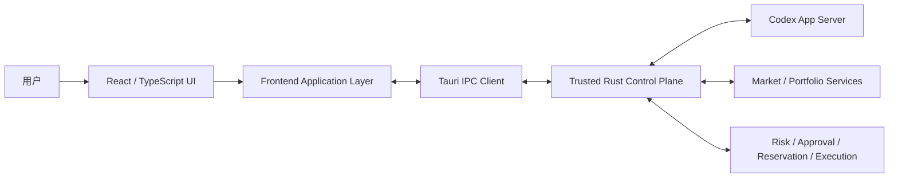

# TradeX 前端架构需求与设计（ARD）

**版本：** v1.0 Revision C (RevC)  
**状态：** 工程基线  
**范围：** 仅桌面前端  
**目标技术栈：** Tauri + React + TypeScript  
**来源基线：** `TradeX_PRD_v1.0_RevC_zh.md`、`TradeX_UI_Prototype_Spec_v1.0_RevC_zh.md`、RevC Prototype  
**语言：** 简体中文

> 本 ARD 将 RevC 产品需求落实为可实施的前端架构。产品语义和安全不变量以 RevC PRD / UI Spec 为准；下文中的模块边界、状态存储拆分、IPC contract、目录结构和测试结构属于工程实现层面的架构决策。

---

## 1. 目的

TradeX 前端是一个 local-first 桌面工作台，用于持久化 Agent Thread、市场研究、回测、模拟交易以及经审批门控的真实交易。其交互体验应类似 Codex Agent Workspace，但金融执行必须始终作为独立的高权限工作流处理。

前端负责：

- 渲染持久化的 Thread / Turn / Item 时间线；
- 将 Agent Mode 与 Execution Context 作为两个独立维度展示；
- 展示市场、账户、组合、策略、Artifact 与执行状态；
- 展示后端产生的可信 Risk、Approval、Reservation 与 Reconciliation 决策；
- 收集明确的用户操作，例如账户 Arm、真实交易审批、撤单审批、Provider 配置和 Manual Resolution；
- 持续展示模型/provider provenance 与 market-data provenance；
- 在窄窗口、键盘操作、断线、数据过期和后端失败时仍保持安全。

前端**不是金融权限主体**。前端不能自行判断真实订单是否有效，不能持有券商凭据，也不能把通用 Agent/Codex approval 转换为交易授权。

---

## 2. 架构驱动因素

### 2.1 产品驱动

1. Codex 风格的持久工作台，而不是无状态聊天页面。
2. Local-first 桌面体验与快速事件渲染。
3. Agent-native 的结构化时间线卡片。
4. Research-first，并允许用户显式进入 Trade。
5. Agent Mode 与 Execution Context 明确分离。
6. 真实交易 Arm 必须按账户隔离。
7. 每笔真实交易采用 transaction-specific、single-use approval。
8. 每个 Live approval 必须完整展示 market snapshot provenance。
9. Paper / Demo / Testnet / Live 必须有明确文字身份。
10. 对恢复与 reconciliation 使用显式状态，而不是乐观猜测。

### 2.2 质量驱动

- IPC 事件到达后至 UI 可见提交：代表性交互 p95 < 100 ms。
- 核心 UI 可通过键盘访问，并具有明显 focus。
- `Enter` 绝不能隐式批准真实订单或撤单。
- 窄桌面/平板窗口必须保留真实交易安全控制。
- 状态不能只靠颜色表达。
- 外部 telemetry 默认关闭且需 opt-in；前端日志不得包含秘密信息。

### 2.3 信任边界驱动

前端只能通过类型化后端命令请求高权限操作。它不能访问 OS keychain、provider signing code、Order Gateway 或原始 broker credentials。

---

## 3. 前端系统上下文



### 架构规则

UI 只渲染后端权威状态；不得根据 Agent 文本、网络超时或客户端乐观状态推断金融操作成功。

---

## 4. 技术决策

| 领域 | 决策 | 原因 |
|---|---|---|
| Desktop shell | Tauri | 本地桌面集成、较小体积、Rust Control Plane 安全边界 |
| UI framework | React + TypeScript | 适合组件化 Codex 风格 Workspace，强类型 |
| Server-state cache | TanStack Query | Query 生命周期、失效与必要的轮询/重验证 |
| UI/session state | Zustand 或等价轻量 store | 管理明确的本地 UI 状态，不把 server state 变成客户端权威状态 |
| Runtime transport | Typed Tauri commands/events | 所有高权限操作都经过 Rust 边界 |
| Agent stream mapping | 将 Codex JSON-RPC/JSONL 转成 typed frontend events 的 adapter | 避免协议细节扩散到全部 UI 组件 |
| Charts | 轻量金融图表库 | 本地快速渲染；图表层不拥有权限语义 |
| Styling | CSS modules/tokens 或等价方案 | 可控 design system、focus 和 reduced-motion |
| Schema validation | Zod 或生成式 runtime validator | 在 IPC/event 边界拒绝格式错误的数据 |

React meta-framework 不在本 ARD 中强制指定。TradeX v1.0 是桌面应用，不依赖 SSR。

---

## 5. 前端进程与分层模型

```text
React Presentation
    ↓
Feature Controllers / View Models
    ↓
Frontend Domain Selectors
    ↓
Query + Event Stores
    ↓
Typed IPC Client
    ↓
Rust Control Plane
```

### 5.1 Presentation layer

只包含可复用视觉组件，例如：

- `AppShell`
- `Sidebar`
- `TopBar`
- `ThreadTimeline`
- `Composer`
- `ContextPanel`
- `MarketSnapshotProvenance`
- `OrderProposalCard`
- `RiskCheckPanel`
- `ReservationPanel`
- `LiveArmModal`
- `LiveApprovalModal`
- `CancellationApprovalModal`
- `ErrorRecoveryPanel`
- `WorkspaceImportModal`

Presentation component 接收明确的 state 和 callback，不直接调用 broker API，也不能读取 secret。

### 5.2 Feature-controller layer

负责协调：

- 创建/恢复 Thread；
- 开始/取消/重试 Turn；
- 切换 Agent Mode；
- 选择 execution account/context；
- 对单个 live account Arm/Disarm；
- 生成/刷新 live proposal；
- 提交批准/拒绝；
- 批准撤单；
- 处理 ambiguous submission；
- 配置 provider/model；
- 导入/恢复 Workspace。

### 5.3 Frontend domain-selector layer

只生成展示所需的派生状态，例如：

- `canShowLiveApproval`
- `executionContextLabel`
- `isSelectedLiveAccountArmed`
- `effectiveAvailableDisplay`
- `isMarketSnapshotFresh`
- `isTurnExternalProcessorChanged`

Selector 可帮助渲染，但不能产生执行权限。`can_execute`、risk、freshness eligibility、reservation validity 与 account health 始终以后端为权威。

---

## 6. 应用导航架构

RevC 固定一级导航：

```text
New Thread
Threads
Markets
Watchlists
Accounts
Strategies
Artifacts
Settings
```

Portfolio 与 Orders 是 account/context surface，不是永久一级导航。

### 6.1 Route 模型

推荐逻辑路由：

```text
/
/thread/:threadId
/markets
/markets/:instrumentId
/watchlists
/watchlists/:watchlistId
/accounts
/accounts/:accountId
/strategies
/strategies/:strategyId
/artifacts
/artifacts/:artifactId
/settings/:section?
```

这些是本地桌面导航状态，不是公开 Web URL。

### 6.2 窄窗口导航

进入窄布局后：

- sidebar 折叠；
- 主 Workspace 仍然可访问；
- secondary inspector 堆叠到主内容下方；
- 如果 compact navigation 空间不足，使用 `More` 暴露 Artifacts 与 Settings；
- live account identity、arming status、Reject、Approve、Cancel、Manual Resolution 和 Disable All Live 均必须无需 hover 即可访问。

---

## 7. 核心前端 Domain Model

前端镜像后端 Domain Object，但不拥有其权威生命周期。

### 7.1 Thread

```ts
interface ThreadSummary {
  workspaceId: string;
  threadId: string;
  title: string;
  createdAt: string;
  updatedAt: string;
  defaultAgentMode: AgentMode;
  linkedAccountIds: string[];
  linkedInstrumentIds: string[];
  linkedStrategyIds: string[];
  linkedArtifactIds: string[];
}
```

### 7.2 不可变 Turn start snapshot

```ts
interface TurnSnapshot {
  turnId: string;
  agentModeAtStart: AgentMode;
  selectedAccountId?: string;
  executionContextAtStart: ExecutionContext;
  capabilityLevelAtStart: CapabilityLevel;
  modelId: string;
  modelProvider: ModelProvider;
  providerAttempts: ProviderAttempt[];
  attachedContextIds: string[];
  attachedContextHashes: string[];
  startedAt: string;
  completedAt?: string;
}
```

Turn 启动后的 picker 修改不得改变该对象。

### 7.3 Agent Mode

```ts
type AgentMode = "ASK" | "RESEARCH" | "BACKTEST" | "TRADE";
```

### 7.4 Execution Context

```ts
type ExecutionContext =
  | "NONE_READ_ONLY"
  | "HISTORICAL_SIMULATION"
  | "LOCAL_PAPER"
  | "ALPACA_PAPER"
  | "TRADING212_DEMO"
  | "TRADING212_LIVE"
  | "BINANCE_TESTNET"
  | "BINANCE_LIVE"
  | "BITGET_DEMO"
  | "BITGET_LIVE";
```

### 7.5 Live account state

```ts
type ArmingState = "DISARMED" | "ARMED";

interface LiveAccountStatus {
  accountId: string;
  environment: "LIVE";
  armingState: ArmingState;
  health: AccountHealth;
  lastReconciledAt?: string;
  capabilitySummary: string[];
}
```

禁止使用 workspace 级 `liveArmed: boolean`。

---

## 8. Agent Mode × Execution Context UX 状态机

前端必须显式表达合法组合。

| Agent Mode | 无账户 | Paper/Demo/Testnet | Live account |
|---|---|---|---|
| Ask | read-only | read-only context | read-only context |
| Research | read-only | read-only context | read-only context |
| Backtest | historical simulation | 可作为 portfolio seed | 可作为 portfolio seed |
| Trade | 必须选择 execution account | 模拟/provider-hosted execution | live proposal flow，但仍受安全门控 |

### UI 行为

- 非法组合 disable 并解释原因；
- 切换 Agent Mode 不得静默替换 account/environment；
- Ask/Research 中选择 Live account 仍然是 read-only；
- 选择 Trade 不得自动 Arm；
- mode/account/model 的变化只作用于下一 Turn，不修改 in-flight turn。

---

## 9. 状态管理策略

TradeX 必须区分后端权威状态与临时 UI 状态。

### 9.1 TanStack Query 管理

用于后端拥有的 snapshot：

- thread summaries / detail；
- account detail / health；
- portfolio snapshot；
- watchlists；
- market/instrument snapshot；
- provider/model health；
- risk-policy summary；
- strategy/backtest metadata；
- artifacts；
- open orders 与 reconciliation view。

### 9.2 Event-driven state

订阅后端事件：

- Codex turn/item streaming；
- tool lifecycle；
- order state change；
- fills/position updates；
- private-stream degradation；
- reconciliation progress；
- account arming change；
- risk-policy invalidation；
- CLIProxyAPI health/provider-attempt change。

事件更新 normalized cache 或追加 immutable timeline item。

### 9.3 Zustand 管理

只保存：

- 当前 workspace/thread route；
- composer draft；
- drawer/inspector 开关；
- 展开的 timeline item IDs；
- 发送前的 picker 临时选择；
- 本地 theme/appearance；
- transient modal stack。

不得只在 Zustand 中保存 approval validity、broker order truth、reservation truth 或 account health。

---

## 10. IPC Contract 架构

前端仅通过 versioned typed commands/events 与 Rust Control Plane 交互。

### 10.1 Command envelope

```ts
interface CommandEnvelope<T> {
  requestId: string;
  command: string;
  schemaVersion: number;
  payload: T;
}
```

### 10.2 Result envelope

```ts
interface ResultEnvelope<T> {
  requestId: string;
  ok: boolean;
  data?: T;
  error?: TradeXError;
  stateVersion?: string;
}
```

### 10.3 Event envelope

```ts
interface DomainEvent<T> {
  eventId: string;
  eventType: string;
  occurredAt: string;
  aggregateType: string;
  aggregateId: string;
  sequence?: number;
  payload: T;
}
```

### 10.4 前端命令组

```text
workspace.*
thread.*
turn.*
market.*
watchlist.*
account.*
provider.*
risk.*
trade.draft.*
trade.proposal.*
trade.approval.*
trade.cancel.*
trade.resolution.*
strategy.*
backtest.*
artifact.*
settings.*
```

### 10.5 安全规则

- 不向前端返回原始 keychain value；
- 完成 secure-entry handoff 后，不再接受前端传入的原始 broker secret；
- live execution command 使用 `account_id`、`proposal_id`、`approval_id` 等引用；
- UI 不生成 provider-signed request；
- 未知或不兼容的 event schema 必须显式失败，不能静默强转。

---

## 11. Thread / Turn / Item 渲染架构

### 11.1 Timeline item registry

采用 typed renderer registry，避免巨型条件组件。

```ts
const itemRenderers: Record<ItemType, React.ComponentType<any>> = {
  user_message: UserMessageItem,
  agent_message: AgentMessageItem,
  plan: PlanItem,
  tool_call: ToolCallItem,
  tool_result: ToolResultItem,
  market_snapshot: MarketSnapshotItem,
  research_evidence: ResearchEvidenceItem,
  portfolio_snapshot: PortfolioSnapshotItem,
  screener_result: ScreenerResultItem,
  backtest_result: BacktestResultItem,
  order_draft: OrderDraftItem,
  order_proposal: OrderProposalItem,
  risk_check: RiskCheckItem,
  approval_request: ApprovalRequestItem,
  reservation: ReservationItem,
  order_update: OrderUpdateItem,
  fill: FillItem,
  error: ErrorItem,
  artifact: ArtifactItem,
};
```

### 11.2 Item lifecycle

UI 支持：

```text
started → streaming → completed
                 ↘ failed
```

Turn 包含 running、cancelled、interrupted、completed、failed 等状态。

### 11.3 Resume 行为

恢复 Thread 可以恢复导航/default context，但不得把以下内容恢复为有效权威状态：

- 已消费/过期 approval；
- stale market snapshot；
- restart 前的 `ARMED`；
- 用当前 picker 值覆盖历史 in-flight turn 的 provider/model。

---

## 12. Composer 架构

Composer controls 是一级产品状态：

```text
@ Context | Account | Agent Mode | Model | Send
```

### 12.1 Send 流程

```text
validate local draft
→ request backend compatibility validation
→ freeze TurnSnapshot inputs
→ persist/start turn
→ render streaming items
```

### 12.2 Provider disclosure

发送前展示下一 Turn 的处理路径：

```text
CLIProxyAPI → ChatGPT
或
CLIProxyAPI → DeepSeek
```

如果用户显式启用了 fallback 且 provider 在 turn 中变化，timeline 必须记录并可见地展示变化。

### 12.3 Ask mode

Ask 是轻量 read-only workflow，不暴露当前市场交易动作，也不默认生成 research artifact。

---

## 13. Market 与 Portfolio UI 架构

### 13.1 Canonical instrument identity

前端 route 与 cache key 使用 canonical `instrument_id`，不使用 provider symbol 作为 domain identity。

### 13.2 Market snapshot model

```ts
interface MarketSnapshotProvenance {
  marketSnapshotId: string;
  instrumentId: string;
  source: string;
  venue?: string;
  providerTimestamp: string;
  receivedTimestamp: string;
  entitlement: "REALTIME" | "DELAYED" | "UNKNOWN";
  freshness: "HEALTHY" | "STALE" | "CLOCK_UNCERTAIN";
  quoteAgeMs?: number;
}
```

只要 market data 参与 live authority decision，approval view 就必须展示完整 provenance。

### 13.3 FX/stablecoin provenance

跨账户归一化必须展示：

- workspace base currency；
- conversion pair/path；
- source；
- timestamps；
- freshness；
- quality/depeg warning。

前端不得在没有后端 conversion state 的情况下把 USDT 静默展示为 USD 等价物。

---

## 14. Live Execution UI 架构

### 14.1 原则

前端是**决策与用户同意界面**，不是 execution engine。

### 14.2 Order lifecycle 展示

UI 至少支持：

```text
DRAFT
PROPOSED
RISK_REJECTED
NEEDS_APPROVAL
APPROVED
RESERVED
SUBMITTING
ACCEPTED
PARTIALLY_FILLED
FILLED
CANCEL_PENDING
CANCELLED
REJECTED
EXPIRED
UNKNOWN_RECONCILING
```

### 14.3 Editable draft 与 immutable proposal

- `OrderDraft` 可编辑；
- `Generate Proposal` 返回新的不可变 `proposal_id + proposal_hash`；
- 之后的任何 material edit 都生成新的 proposal identity；
- 旧 approval UI 必须明确变为 invalidated，不能静默替换字段。

### 14.4 Account-scoped arming

流程：

```text
select exact live account
→ inspect account health + permission state
→ explicit Arm action
→ backend confirms ARMED for that account
→ UI updates account badge
```

Global Disable All 调用一次后端动作，再渲染后端返回的每个账户状态。

### 14.5 Approval modal

必须包含：

- 准确 account/environment；
- proposal ID/hash 或可审计 immutable identity；
- instrument、side、quantity/notional、type、price、TIF；
- estimated notional；
- 完整 market snapshot provenance；
- 必要时的 available / reserved / effective available；
- deterministic risk checks；
- policy version；
- 显式 Reject 与 Approve。

`Enter` 永远不能作为默认 approval 动作。

### 14.6 Reservation conflict

如果 proposal 因 effective capacity 降低而失败，直接展示后端原因和 reservation context。浏览器端不得重新计算金融结论。

### 14.7 Ambiguous submission

`UNKNOWN_RECONCILING` 打开 Manual Resolution，只允许后端授权的选项：

- Confirmed not submitted（要求 evidence）；
- Confirmed submitted（绑定 broker identity）；
- Keep reconciling。

不得存在通用 “release reservation and continue”。

---

## 15. Provider 与 Model 配置 UI

### 15.1 Schema-driven forms

Provider 配置由后端 schema metadata 驱动。

```ts
interface ProviderFieldSchema {
  id: string;
  label: string;
  inputType: "text" | "password" | "select" | "boolean";
  required: boolean;
  secret: boolean;
  environment?: string[];
  helpText?: string;
}
```

前端不得假定所有 provider 都使用 `API Key + Secret`。

### 15.2 Secret-entry 规则

Secret field 对 UI 来说是 write-only。安全提交完成后，UI 只保存 “configured”、允许暴露的 keychain reference identity、permission/capability result 和 health 等 metadata。

### 15.3 LLM provider surface

展示：

- CLIProxyAPI sidecar state；
- pinned version；
- `/v1/models` health；
- ChatGPT OAuth login/re-login；
- DeepSeek key configured/invalid；
- discovered models；
- default provider/model；
- 可选 `Allow automatic fallback to DeepSeek`，默认 OFF。

LLM Provider 永远不能表现为交易 capability。

---

## 16. Error 与 Recovery 架构

使用一个由 canonical error 驱动的通用 `ErrorRecoveryPanel`。

```ts
interface TradeXError {
  category: ErrorCategory;
  code?: string;
  title: string;
  detail?: string;
  blocking: boolean;
  remediation: RemediationAction[];
  relatedEntity?: { type: string; id: string };
}
```

Canonical categories：

```text
AUTH_ERROR
PERMISSION_ERROR
RATE_LIMITED
NETWORK_ERROR
UNSUPPORTED_CAPABILITY
MARKET_CLOSED
INSTRUMENT_HALTED
INVALID_ORDER
INSUFFICIENT_FUNDS
RISK_REJECTED
SUBMISSION_REJECTED
SUBMISSION_AMBIGUOUS
STREAM_DISCONNECTED
STATE_STALE
RECONCILIATION_REQUIRED
MODEL_UNAVAILABLE
QUOTA_EXCEEDED
OAUTH_EXPIRED
INTERNAL_ERROR
```

前端不得自行创造新的 machine-state 名称。

---

## 17. Accessibility 架构

强制工程规则：

- 使用语义化 button/input/landmark；
- 明确 `:focus-visible`；
- 合理 tab order；
- icon-only control 有 accessible label；
- modal 有 focus trap 与关闭后的 focus return；
- 重要订单状态变化使用 `aria-live`/status；
- Paper/Demo/Testnet/Live 使用明确文字；
- generic `Enter` 不绑定 approval；
- 非必要动画支持 reduced-motion；
- 安全信息不能 hover-only。

Live approval modal 初始 focus 应放在 neutral/reject-safe 控件，而不是 Approve。

---

## 18. 性能架构

### 18.1 Rendering strategy

- 长 Thread timeline 使用 virtualization；
- streaming item 增量追加；
- 对复杂 structured card memoize；
- chart render 与主 timeline tree 隔离；
- cache key 基于 canonical ID；
- 高频 market event 在超过实际可视刷新需求时先 batch，再触发 React commit。

### 18.2 Market stream strategy

前端不消费所有 instrument 的所有 tick，只接收后端选择的 Hot subscription，以及其他 context 的 coarse/on-demand update。

### 18.3 Failure containment

图表或 research card 的 rendering error 不能遮蔽 live execution state。关键 execution/status surface 与非关键 visualization 使用独立 error boundary。

---

## 19. Security 架构

前端安全要求：

1. broker secrets 不进入 React state、browser storage、日志、route、analytics 或 crash payload；
2. 不直接请求外部 LLM；
3. 不直接请求 broker/exchange 的高权限操作；
4. research/web content 视为 untrusted，不能触发 privileged command；
5. HTML/Markdown 渲染必须 sanitize；
6. 对敏感 account data 的 clipboard/export 在适用时要求明确用户动作；
7. Trade approval state 只从后端 authority object 渲染；
8. UI 不能伪造 approval ID、reservation ID 或 execution eligibility。

---

## 20. 前端项目结构

推荐：

```text
src/
  app/
    App.tsx
    routes.tsx
    providers/
  components/
    shell/
    timeline/
    market/
    account/
    trading/
    strategy/
    artifact/
    settings/
    recovery/
  features/
    threads/
    composer/
    markets/
    watchlists/
    accounts/
    trading/
    strategies/
    backtests/
    artifacts/
    providers/
  domain/
    types/
    selectors/
    schemas/
  ipc/
    client.ts
    commands.ts
    events.ts
    generated/
  state/
    uiStore.ts
  query/
    keys.ts
    hooks/
  accessibility/
  styles/
  test/
```

Generated IPC/domain schema binding 与手写 UI logic 分离维护。

---

## 21. 测试策略

### 21.1 Unit tests

覆盖：

- Agent Mode × Execution Context compatibility；
- state selectors；
- immutable proposal rendering；
- policy invalidation display；
- provider disclosure；
- canonical error mapping；
- safe keyboard behavior。

### 21.2 Component tests

通过 fixture 测试：

- LiveArmModal；
- LiveApprovalModal；
- ReservationPanel；
- CancellationApprovalModal；
- ManualResolution panel；
- ProviderCredentialSchemaForm；
- ErrorRecoveryPanel。

### 21.3 Integration tests

使用 fake IPC backend 验证：

- turn streaming；
- restart/resume 后全部 live accounts 为 DISARMED；
- policy save 使 approval 失效；
- reservation conflict；
- ambiguous submission；
- model OAuth/quota error 和 explicit switch；
- Demo/Testnet 永远不会被视觉误认为 Live。

### 21.4 End-to-end safety tests

必须断言：

- 选择 Trade/Live 不会自动 Arm；
- Arm Trading 212 不会 Arm Binance/Bitget；
- generic Enter 无法批准 live order/cancel；
- materially changed proposal 不能复用旧 approval；
- stale/clock-uncertain quote 不能显示可执行 approval；
- `UNKNOWN_RECONCILING` 不存在不安全 release button；
- restart 后 UI 不恢复 ARMED。

### 21.5 Accessibility tests

尽可能自动化语义检查，并手动验证 focus order、screen-reader status、narrow-window live flow 与 reduced motion。

---

## 22. 前端交付阶段

### Phase FE-0 — Shell 与 Contracts

- Tauri/React shell；
- typed IPC client；
- 一级导航；
- design tokens；
- Thread/Turn/Item renderer foundation；
- Agent Mode/Execution Context 类型；
- account-scoped arming display model。

### Phase FE-1 — Agent Research Workspace

- composer/pickers；
- thread history/resume；
- market/instrument/context panels；
- provider/model provenance；
- watchlists/accounts/artifacts。

### Phase FE-2 — Backtest 与 Simulated Trading

- strategy/backtest surfaces；
- Local Paper；
- Alpaca Paper；
- T212 Demo / Binance Testnet / Bitget Demo lifecycle variants。

### Phase FE-3 — Live Execution Safety

- live arming；
- approval/provenance；
- reservation；
- cancellation；
- risk-policy invalidation；
- ambiguous state / Manual Resolution；
- startup/reconnect recovery。

### Phase FE-4 — Hardening

- 完整 canonical errors；
- workspace import/restore；
- accessibility；
- narrow-layout QA；
- performance profiling；
- release telemetry controls。

---

## 23. 前端 Definition of Done

前端 v1.0 达到 architecture-complete 的条件：

1. 每个 RevC UI state 都对应 typed backend contract，或被明确标记为 local-only UI state；
2. Thread/Turn/Item replay 不依赖当前 picker 值；
3. Agent Mode 与 Execution Context 在 UI/state/API type 中始终独立；
4. account-scoped arming 不存在 global boolean shortcut；
5. 所有 live approval 展示 immutable order identity + 完整 provenance + risk/reservation 信息；
6. frontend 无法访问 secret 或 privileged execution API；
7. canonical error/recovery 不伪造 authority；
8. keyboard/narrow-layout 保持全部 live safety invariants；
9. generated schema compatibility test 与 pinned backend version 全部通过。

---

## 24. 与 RevC 的前端追溯

本 ARD 主要落实以下 requirement groups：

- **FR:** FR-002–006、FR-014–018、FR-030–035、FR-040–045、FR-048–080 中所有 UI-facing 部分；
- **NFR:** NFR-001、NFR-002、NFR-009、NFR-015–019；
- **SEC:** SEC-001–009 作为前端 boundary constraints；
- **DATA:** DATA-001、DATA-003–008；
- **OPS:** OPS-003、OPS-007–009 的 recovery/visibility 部分；
- **UX:** UX-001–010。

Risk、Reservation、Broker state、Approval validity、Reconciliation、Credential handling 与 Execution 的最终权威均在后端。
