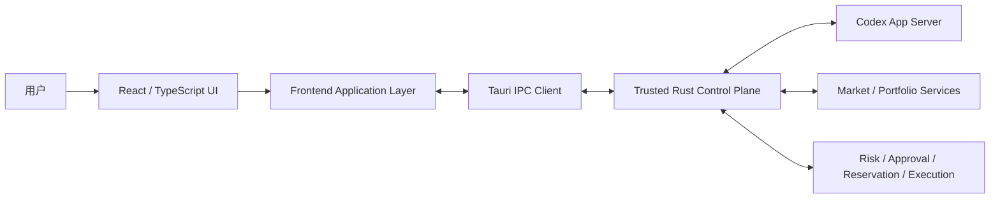

# TradeX 前端架构需求与设计（ARD）

**契约澄清日期：** 2026-09-05（RevC）；S18 本地账户删除契约于 2026-09-24 澄清为通过完整 connection ID 识别同名记录。原型行为仅为证据，以 QA Report 记录的缺陷和待验证门槛为准。

**版本：** v1.0 Revision C (RevC)  
**状态：** 工程基线  
**范围：** 仅桌面前端  
**目标技术栈：** Tauri + React + TypeScript  
**来源基线：** `TradeX_PRD_v1.0_RevC_zh.md`、`TradeX_UI_Prototype_Spec_v1.0_RevC_zh.md`；原型观察另见 QA Report\
**语言：** 简体中文

> 本 ARD 将 RevC 产品需求落实为可实施的前端架构。产品语义和安全不变量以 RevC PRD / UI Spec 为准；下文中的模块边界、状态存储拆分、IPC contract、目录结构和测试结构属于工程实现层面的架构决策。

---

## 1. 目的

TradeX 前端是一个 local-first 桌面工作台，用于持久化 Agent Thread、市场研究、回测、模拟交易以及经审批门控的真实交易。其交互体验应类似 Codex Agent Workspace，但金融执行必须始终作为独立的高权限工作流处理。

前端负责：

- 渲染持久化的 Thread / Turn / Item 时间线；
- 将 Agent Mode 与 Execution Context 作为两个独立维度展示；
- 展示市场、账户、组合、策略、Artifact 与执行状态；
- 展示后端产生的可信 Risk、Approval、Reservation 与 Reconciliation 决策；
- 收集明确的用户操作，例如账户 Arm、真实交易审批、撤单审批、Provider 配置和 Manual Resolution；
- 持续展示模型/provider provenance 与 market-data provenance；
- 在窄窗口、键盘操作、断线、数据过期和后端失败时仍保持安全。

前端**不是金融权限主体**。前端不能自行判断真实订单是否有效，不能持有券商凭据，也不能把通用 Agent/Codex approval 转换为交易授权。

---

## 2. 架构驱动因素

### 2.1 产品驱动

1. Codex 风格的持久工作台，而不是无状态聊天页面。
2. Local-first 桌面体验与快速事件渲染。
3. Agent-native 的结构化时间线卡片。
4. Research-first，并允许用户显式进入 Trade。
5. Agent Mode 与 Execution Context 明确分离。
6. 真实交易 Arm 必须按账户隔离。
7. 每笔真实交易采用 transaction-specific、single-use approval。
8. 每个 Live approval 必须完整展示 market snapshot provenance。
9. Paper / Demo / Testnet / Live 必须有明确文字身份。
10. 对恢复与 reconciliation 使用显式状态，而不是乐观猜测。

### 2.2 质量驱动

- IPC 事件到达后至 UI 可见提交：代表性交互 p95 < 100 ms。
- 核心 UI 可通过键盘访问，并具有明显 focus。
- `Enter` 绝不能隐式批准真实订单或撤单。
- 窄桌面/平板窗口必须保留真实交易安全控制。
- 状态不能只靠颜色表达。
- 外部 telemetry 默认关闭且需 opt-in；前端日志不得包含秘密信息。

### 2.3 信任边界驱动

前端只能通过类型化后端命令请求高权限操作。它不能访问 OS keychain、provider signing code、Order Gateway 或原始 broker credentials。

---

## 3. 前端系统上下文



### 架构规则

UI 只渲染后端权威状态；不得根据 Agent 文本、网络超时或客户端乐观状态推断金融操作成功。

---

## 4. 技术决策

| 领域 | 决策 | 原因 |
|---|---|---|
| Desktop shell | Tauri | 本地桌面集成、较小体积、Rust Control Plane 安全边界 |
| UI framework | React + TypeScript | 适合组件化 Codex 风格 Workspace，强类型 |
| Server-state cache | TanStack Query | Query 生命周期、失效与必要的轮询/重验证 |
| UI/session state | Zustand 或等价轻量 store | 管理明确的本地 UI 状态，不把 server state 变成客户端权威状态 |
| Runtime transport | Typed Tauri commands/events | 所有高权限操作都经过 Rust 边界 |
| Agent stream mapping | 将 Codex JSON-RPC/JSONL 转成 typed frontend events 的 adapter | 避免协议细节扩散到全部 UI 组件 |
| Charts | 轻量金融图表库 | 本地快速渲染；图表层不拥有权限语义 |
| Styling | CSS modules/tokens 或等价方案 | 可控 design system、focus 和 reduced-motion |
| Schema validation | Zod 或生成式 runtime validator | 在 IPC/event 边界拒绝格式错误的数据 |

React meta-framework 不在本 ARD 中强制指定。TradeX v1.0 是桌面应用，不依赖 SSR。

---

## 5. 前端进程与分层模型

```text
React Presentation
    ↓
Feature Controllers / View Models
    ↓
Frontend Domain Selectors
    ↓
Query + Event Stores
    ↓
Typed IPC Client
    ↓
Rust Control Plane
```

### 5.1 Presentation layer

只包含可复用视觉组件，例如：

- `AppShell`
- `Sidebar`
- `TopBar`
- `ThreadTimeline`
- `Composer`
- `ContextPanel`
- `MarketSnapshotProvenance`
- `OrderProposalCard`
- `RiskCheckPanel`
- `ReservationPanel`
- `LiveArmModal`
- `LiveApprovalModal`
- `CancellationApprovalModal`
- `ErrorRecoveryPanel`
- `WorkspaceImportModal`

Presentation component 接收明确的 state 和 callback，不直接调用 broker API，也不能读取 secret。

### 5.2 Feature-controller layer

负责协调：

- 创建/恢复 Thread；
- 开始/取消/重试 Turn；
- 切换 Agent Mode；
- 选择 execution account/context；
- 对单个 live account Arm/Disarm；
- 生成/刷新 live proposal；
- 提交批准/拒绝；
- 批准撤单；
- 处理 ambiguous submission；
- 配置 provider/model；
- 导入/恢复 Workspace。

### 5.3 Frontend domain-selector layer

只生成展示所需的派生状态，例如：

- `canShowLiveApproval`
- `executionContextLabel`
- `isSelectedLiveAccountArmed`
- `effectiveAvailableDisplay`
- `isMarketSnapshotFresh`
- `isTurnExternalProcessorChanged`

Selector 可帮助渲染，但不能产生执行权限。`can_execute`、risk、freshness eligibility、reservation validity 与 account health 始终以后端为权威。

---

## 6. 应用导航架构

RevC 固定一级导航：

```text
New Thread
Threads
Markets
Watchlists
Accounts
Strategies
Artifacts
Settings
```

Portfolio 与 Orders 是 account/context surface，不是永久一级导航。

### 6.1 Route 模型

推荐逻辑路由：

```text
/
/thread/:threadId
/markets
/markets/:instrumentId
/watchlists
/watchlists/:watchlistId
/accounts
/accounts/:accountId
/strategies
/strategies/:strategyId
/artifacts
/artifacts/:artifactId
/settings/:section?
```

这些是本地桌面导航状态，不是公开 Web URL。

### 6.2 窄窗口导航

进入窄布局后：

- sidebar 折叠；
- 主 Workspace 仍然可访问；
- secondary inspector 堆叠到主内容下方；
- 侧栏折叠后，在抽屉或 `More` 保留 New Thread、Thread History、Watchlists、Artifacts、Settings、Account Health；Provider Configure/Models 与表格行动作通过换行/堆叠保留；
- live account identity、arming status、Reject、Approve、Cancel、Manual Resolution 和 Disable All Live 均必须无需 hover 即可访问。

---

## 7. 核心前端 Domain Model

前端镜像后端 Domain Object，但不拥有其权威生命周期。

### 7.1 Thread

```ts
interface ThreadSummary {
  workspaceId: string;
  threadId: string;
  title: string;
  createdAt: string;
  updatedAt: string;
  defaultAgentMode: AgentMode;
  linkedAccountIds: string[];
  linkedInstrumentIds: string[];
  linkedStrategyIds: string[];
  linkedArtifactIds: string[];
}
```

### 7.2 不可变 Turn start snapshot

```ts
interface TurnSnapshot {
  turnId: string;
  agentModeAtStart: AgentMode;
  selectedAccountId?: string;
  executionContextAtStart: ExecutionContext;
  capabilityLevelAtStart: CapabilityLevel;
  modelId: string;
  modelProvider: ModelProvider;
  attachedContextIds: string[];
  attachedContextHashes: string[];
  startedAt: string;
}
```

Turn 启动后的 picker 修改不得改变该对象。

不可变快照只保存启动时输入。Provider attempts 是只追加的 Turn 事件，完成时间属于 Turn 生命周期记录。历史 Turn/Artifact 溯源读取已保存快照和事件历史，不能读取当前 composer 选择器。

### 7.3 Agent Mode

```ts
type AgentMode = "ASK" | "RESEARCH" | "BACKTEST" | "TRADE";
```

### 7.4 Execution Context

```ts
type ExecutionContext =
  | "NONE_READ_ONLY"
  | "HISTORICAL_SIMULATION"
  | "LOCAL_PAPER"
  | "ALPACA_PAPER"
  | "TRADING212_DEMO"
  | "TRADING212_LIVE"
  | "BINANCE_TESTNET"
  | "BINANCE_LIVE"
  | "BITGET_DEMO"
  | "BITGET_LIVE";
```

### 7.5 Live account state

```ts
type ArmingState = "DISARMED" | "ARMED";

interface LiveAccountStatus {
  accountId: string;
  environment: "LIVE";
  armingState: ArmingState;
  health: AccountHealth;
  lastReconciledAt?: string;
  capabilitySummary: string[];
}
```

禁止使用 workspace 级 `liveArmed: boolean`。

### 7.6 Capability 预检

```ts
type CapabilityLevel = "C0" | "C1" | "C2" | "C3" | "C4" | "C5" | "C6";
type ToolId = "public_market_read" | "account_read" | "historical_simulation" | "paper_demo_testnet_execution" | "live_order_proposal";

interface CapabilityDecision {
  level: CapabilityLevel;
  allowedTools: ToolId[];
  executionAllowed: boolean;
  reason?: string;
}
```

Composer 可以通过 `agent.capabilities` 查询待发送状态，但 `turn.start` 必须接收相同输入并在可信边界重新计算 decision。C5/C6 以及未知或不允许的工具始终不可用。

### 7.7 上下文目录与临时 picker 状态

```ts
interface ContextCatalogEntry {
  contextRef: { kind: "account"; id: string; hash: string };
  label: string;
  providerId?: string;
  environment?: string;
  readOnly: boolean;
  available: boolean;
  availabilityReason?: string;
}
interface ContextCatalog {
  entries: ContextCatalogEntry[];
  emptyStates: { kind: "instrument" | "account" | "strategy" | "backtest" | "artifact"; availabilityReason: string }[];
}
```

`context.catalog` 由后端拥有，返回已持久化的 account refs 以及未来目录的明确空状态。picker 保持临时 pending 列表：Attach 替换列表，Cancel 不改变列表，移除 chip 只影响下一 Turn。Ask/Research 中的 Live account 显示 `LIVE · READ-ONLY`；Backtest 只将其保留为可选 read-only seed。创建 Thread 或开始 Turn 时，后端重新校验 ref ID 和 hash。`turn.start` 省略 `attachedContexts` 时兼容性沿用已保存 Thread refs，显式空数组清除本轮 refs，`null` 无效。

可用的附加 account 上下文会为 Ask、Research 和 Backtest 暴露只读账户工具；Trade 需要执行账户时仍必须使用独立的 Account picker。

### 7.8 Typed research registry 与 result preview

Capability summary 必须渲染独立的 `researchTools` data-plane registry。它只包含 read-only IDs `public_market_read`、`account_read` 和 `historical_simulation`；`allowedTools` 中的金融 authority IDs 不是 research tool。Composer 提供已授权 research tool selector 和 focus selector（`GENERAL`、`EQUITY`、`CRYPTO_SPOT`），然后可以调用 `research.run`，展示 typed state、结论、canonical instrument refs、findings、有界 scenarios、artifact refs、source/provider 时间、新鲜度、质量、限制和 marker。`CRYPTO_SPOT` 卡片只渲染带 provenance 的 Binance/Bitget typed venue 条目、选定 venue、spread/depth 和 quote age；数据缺失时保持缺失并展示 blocked/unavailable/degraded 原因。query 文本始终是不可信输入，不得被写入 result payload。

Send 之前，Composer 可以成对附加 `ResearchToolInvocation` 与 `ResearchToolResult`。`turn.start` 在可信边界重新校验 pair；缺失或篡改的 pair 显示 `RESEARCH_RESULT_INVALID` 且 Thread 保持不变。合法 result 会渲染为 `research_result` timeline item，并将完整的有界 typed result 与 item 一起持久化，使 reload 后仍保留 evidence card；其 marker 在最终 Turn 输出可见。selected tool、focus、mode、execution context、account 或附加 refs 改变时，preview 临时状态会清除。Trade mode 卡片可以显示 disabled/read-only proposal 入口；Ask 和 Research 不渲染 Trade CTA，卡片也不会调用 order、approval、arming、Gateway 或 live-risk。Synthetic fixture 条目必须可见标记，不能作为 provider 事实。

---

## 8. Agent Mode × Execution Context UX 状态机

前端必须显式表达合法组合。

| Agent Mode | 无账户 | Paper/Demo/Testnet | Live account |
|---|---|---|---|
| Ask | read-only | read-only context | read-only context |
| Research | read-only | read-only context | read-only context |
| Backtest | historical simulation | 可作为 portfolio seed | 可作为 portfolio seed |
| Trade | 必须选择 execution account | 模拟/provider-hosted execution | live proposal flow，但仍受安全门控 |

### UI 行为

- 非法组合 disable 并解释原因；
- 切换 Agent Mode 不得静默替换 account/environment；
- Ask/Research 中选择 Live account 仍然是 read-only；
- 选择 Trade 不得自动 Arm；
- mode/account/model 的变化只作用于下一 Turn，不修改 in-flight turn。

---

## 9. 状态管理策略

TradeX 必须区分后端权威状态与临时 UI 状态。

### 9.1 TanStack Query 管理

用于后端拥有的 snapshot：

- thread summaries / detail；
- account detail / health；
- portfolio snapshot；
- watchlists；
- market/instrument snapshot；
- provider/model health；
- risk-policy summary；
- strategy/backtest metadata；
- artifacts；
- open orders 与 reconciliation view。

### 9.2 Event-driven state

订阅后端事件：

- Codex turn/item streaming；
- tool lifecycle；
- order state change；
- fills/position updates；
- private-stream degradation；
- reconciliation progress；
- account arming change；
- risk-policy invalidation；
- CLIProxyAPI health/provider-attempt change。

事件更新 normalized cache 或追加 immutable timeline item。

### 9.3 Zustand 管理

只保存：

- 当前 workspace/thread route；
- composer draft；
- drawer/inspector 开关；
- 展开的 timeline item IDs；
- 发送前的 picker 临时选择；
- 本地 theme/appearance；
- transient modal stack。

不得只在 Zustand 中保存 approval validity、broker order truth、reservation truth 或 account health。

---

## 10. IPC Contract 架构

命令/结果/事件封装、精确命令名、payload 要求、schema 版本规则和重放协议统一由 [Backend ARD §41–42](./TradeX_Backend_ARD_v1.0_RevC_zh.md#41-backend-api--ipc-surface) 定义。前端 IPC 使用该契约，不得为既定命令另造 trade.draft.*、trade.approval.* 等别名。

### 10.1 客户端职责

- 命令使用 schemaVersion 1，并验证结果/事件中的版本。
- 匹配 requestId；成功与错误使用互斥结果类型。
- 修改请求携带预期权威状态版本；状态陈旧时重新加载并取得新的同意，不能盲目重试。
- 按聚合身份和 sequence 订阅/重放；重复事件去重，sequence 缺口、冲突重复或重放范围不可用时重新加载一致快照。
- 权威投影缺失/不兼容时，金融控件保持不可用。纯模型故障禁用受影响 Agent Turn，同时保留账户/对账操作。
- 导航、尚未提交的选择器/草稿变更属于本地 UI 状态。类型化的 account/trade/model/domain 命令只通过受信 Tauri 控制面边界。

### 10.2 安全规则

前端不能获得 keychain secret。凭据输入只使用专用 secure-entry handoff，后续命令引用凭据 ID。UI 不签名提供方请求，也不直接调用 Gateway。金融命令携带规范 account/proposal/approval/cancellation-intent ID，不能从通用 Agent 审批取得权限。客户端检查权威契约要求的安全/错误字段，显示后端修复措施，不另造订单状态。

---

## 11. Thread / Turn / Item 渲染架构

### 11.1 Timeline item registry

采用 typed renderer registry，避免巨型条件组件。

```ts
const itemRenderers: Record<ItemType, React.ComponentType<any>> = {
  user_message: UserMessageItem,
  agent_message: AgentMessageItem,
  plan: PlanItem,
  tool_call: ToolCallItem,
  tool_result: ToolResultItem,
  market_snapshot: MarketSnapshotItem,
  research_evidence: ResearchEvidenceItem,
  portfolio_snapshot: PortfolioSnapshotItem,
  screener_result: ScreenerResultItem,
  backtest_result: BacktestResultItem,
  order_draft: OrderDraftItem,
  order_proposal: OrderProposalItem,
  risk_check: RiskCheckItem,
  approval_request: ApprovalRequestItem,
  reservation: ReservationItem,
  order_update: OrderUpdateItem,
  fill: FillItem,
  error: ErrorItem,
  artifact: ArtifactItem,
};
```

### 11.2 Item lifecycle

UI 支持：

```text
started → streaming → completed
                 ↘ failed
```

Turn 包含 running、cancelled、interrupted、completed、failed 等状态。

### 11.3 Resume 行为

恢复 Thread 可以恢复导航/default context，但不得把以下内容恢复为有效权威状态：

- 已消费/过期 approval；
- stale market snapshot；
- restart 前的 `ARMED`；
- 用当前 picker 值覆盖历史 in-flight turn 的 provider/model。

---

## 12. Composer 架构

Composer controls 是一级产品状态：

```text
@ Context | Account | Agent Mode | Model | Send
```

### 12.1 Send 流程

```text
validate local draft
→ request backend compatibility validation
→ freeze TurnSnapshot inputs
→ persist/start turn
→ render streaming items
```

### 12.2 Provider disclosure

发送前展示下一 Turn 的处理路径：

```text
CLIProxyAPI → ChatGPT
或
CLIProxyAPI → DeepSeek
```

如果用户显式启用了 fallback 且 provider 在 turn 中变化，timeline 必须记录并可见地展示变化。

### 12.3 Ask mode

Ask 是轻量 read-only workflow，不暴露当前市场交易动作，也不默认生成 research artifact。

---

## 13. Market 与 Portfolio UI 架构

### 13.1 Canonical instrument identity

前端 route 与 cache key 使用 canonical `instrument_id`，不使用 provider symbol 作为 domain identity。

### 13.2 Market snapshot model

```ts
interface MarketSnapshotProvenance {
  marketSnapshotId: string;
  instrumentId: string;
  source: string;
  venue?: string;
  providerTimestamp: string;
  receivedTimestamp: string;
  entitlement: "REALTIME" | "DELAYED" | "UNKNOWN";
  freshness: "HEALTHY" | "STALE" | "CLOCK_UNCERTAIN";
  quoteAgeMs?: number;
}
```

只要 market data 参与 live authority decision，approval view 就必须展示完整 provenance。

### 13.3 Trusted time health

Settings / Account Health 展示 workspace-scoped 的 `time.status`，以语义状态呈现 wall-clock、monotonic reading、provider offset、observed timestamp、有限长度 reason；当 confidence 为 `CLOCK_UNCERTAIN` 或 `STALE` 时提供键盘可达的 `time.revalidate` 动作。面板使用 `role="status"` 与 `aria-live="polite"`，保留可见焦点，并在 768 px 与 390 px 保持同样的阻塞原因。renderer 不能覆盖后端读数；只有 Control Plane 报告 `TRUSTED` 后 Live eligibility 才能恢复。

### 13.4 Market session 与 corporate actions

`MarketDetail` 在既有 source/snapshot panel 旁展示后端持有的 `marketState`、`corporateActions` 与 `adjustmentStatus`。session 文本覆盖 `OPEN`、`CLOSED`、`EXTENDED_HOURS`、`HALTED`、`MAINTENANCE`、`SUSPENDED`、`DEGRADED`、`UNKNOWN`；venue、source status、next boundary、calendar version、provider time、observed time 和 `timeConfidence` 保持可见。OD-005 缺失或 blocked 时维持 `UNKNOWN`/`UNAVAILABLE`，fixture 不得被呈现成实时 session 或已调整历史。

面板使用语义 heading、`role="status"`/`aria-live="polite"` 宣布 session 变化，提供可见焦点、键盘可达的 source remediation，并在颜色之外使用文本标签。`MARKET_CLOSED` 与 `INSTRUMENT_HALTED` 作为确定性的 blocking state 展示；renderer 不计算 execution eligibility。Corporate-action 行有界，并展示 action type、description、effective/announced time、source 与 adjustment status。

### 13.5 FX/stablecoin provenance

跨账户归一化必须展示：

- workspace base currency；
- conversion pair/path；
- source；
- timestamps；
- freshness；
- quality/depeg warning。

前端不得在没有后端 conversion state 的情况下把 USDT 静默展示为 USD 等价物。

### 13.6 Local Paper surface（S16）

Local Paper account 必须显示为 `Local Paper · LOCAL_PAPER` 与 `TradeX simulation · TRADEX_SIMULATION`。Accounts surface 读取 `paper.get`，展示确定性 scenario/quote 状态、cash、reserved cash、positions、open orders、fills 与 event history，并只提供 simulation action。Order Drafts surface 通过 `paper.order.submit` 提交已选择的 immutable Local Paper proposal；resting 或 partial order 必须先经过显式 cancellation dialog，再调用 `paper.order.cancel`。`paper.quote.refresh` 与 `paper.scenario.set` 只能由 Trade surface 显式触发，不能成为 Agent action。

Renderer 在 reload/reopen 后把 Local Paper projection 作为权威状态。Loading、empty、error 与 retry 使用 status/alert 语义；submit/cancel dialog 使用 `role="dialog"`、`aria-modal`、accessible name，仅显式 action 接受键盘 Enter，并把焦点恢复到触发 proposal 或 Local Paper summary。每个 simulation result 保留 `LOCAL`、`TRADEX_SIMULATION` 与 `not provider truth` 文本披露。Portfolio 展示 simulation provenance 与 `Live risk: Blocked`；Local Paper control 不渲染 approval、arming、reservation、broker acknowledgement 或 Live readiness。

### 13.7 Alpaca Paper 订单提交（S17 #57）

Accounts surface 只从 provider observation 展示 Alpaca Paper buying power，并同时标注账户币种；缺失时显示 `Unavailable`。Order Drafts surface 在显式的 Paper-only 确认 dialog 前展示不可变的 `ALPACA_PAPER` Proposal 及其绑定账户、环境、canonical instrument、方向、数量/金额、订单类型、有效期和限价。用户必须确认审阅过的精确 Proposal；此路径与 Local Paper simulation 和 Live approval 分离。

提交后 renderer 从持久化 attempt projection 读取状态，并区分 `SUBMITTING`、`ACKNOWLEDGED`、`UNKNOWN_RECONCILING` 与 `REJECTED`。Acknowledgement 标记为 provider 已接受，不能称为成交证据。Reload 后恢复已保存 attempt；unknown attempt 只允许按已保存 client order ID 查询式对账；重复提交展示已有 attempt，不能再发 POST。错误保留有界的 remediation 文本。Loading/error 使用 status/alert 语义，确认 dialog 会恢复焦点；在 390、768、1280 px 下账户与订单的 Paper identity 均保持可读。Alpaca Paper control 不授予 Live 或 Agent 提交权限。

### 13.8 Alpaca Paper 订单簿与撤单审阅（S17 #58）

Order Drafts surface 读取当前 Alpaca Paper account 持久化的 `alpaca-paper-order-book`，并提供显式刷新。界面标记 `ALPACA_PAPER` 环境、`TRADE_X` 或 `EXTERNAL` 来源、provider order status、filled/remaining quantity、provider 时间、TradeX observation 时间，以及最近一次完整读取为 current、stale、degraded 或尚未读取。Open orders、订单历史和 `FILL` activities 分开显示；读取不完整时保留最近一次完整数据并说明 degraded 原因。

只有当前仍 open 的 provider order 才显示撤单操作。弹出确认框前，前端先请求后端重新读取该订单。确认框显示 account、Paper 环境、provider order、标的、filled quantity 与 remaining quantity。只有用户明确确认后才调用 typed cancel command。Provider acknowledgement 显示为 `CANCEL_PENDING`；后续 provider observation 确认终态后才显示 `CANCELLED`。订单 identity/status 已变化时要求重新审阅。键盘关闭确认框不会发送请求，焦点返回触发撤单的订单控件。这些操作不会撤销 Local Paper 或 Live 订单。

### 13.9 Alpaca Paper 实时更新与流健康状态（S17 #59）

Accounts surface 显示文字形式的私有流与 reconciliation 状态，以及最近成功接收 trade update 的时间。Order Drafts surface 在已保存的 Paper order book 旁显示相同健康状态；account aggregate 报告 stream 更新后重新读取订单簿，并将 fill observation 标记为 `trade_updates` 或 REST `FILL` activity。部分成交、完全成交、拒绝、撤单、过期和未知 provider 状态保持清晰区分。断流或对账不完整时显示 stale/degraded 文本并保留已保存订单/成交；不会将其呈现为 current。健康状态不授予 Local Paper、Live、Agent、approval 或 arming capability。

### 13.10 Trading 212 Demo 订单提交（S18 #61）

Order Drafts surface 仅在独立确认后，通过 `trading212.demo.order.submit` 提交所选的不可变 `TRADING212_DEMO` Proposal。确认界面标识 Demo 环境并准确展示标的、方向、数量、订单类型、限价和有效期。只支持 BASE 数量型 Market-DAY 与 Limit-DAY/GTC；Market 确认还显示 extended-hours 已关闭。Reload 后通过 `trading212.demo.order.attempt.get` 恢复已保存 attempt。UI 区分 `SUBMITTING`、`ACKNOWLEDGED`、`UNKNOWN_RECONCILING` 和 `REJECTED`；不能把 acknowledgement 称作成交。重复提交只读取已保存 attempt，不再发第二个 POST。未知结果禁用重试并保持冻结，因为 provider 不公开 TradeX client-order identity。所有操作只能由主 Trade UI 触发；Agent 与 Live 均不能进入此路径。

### 13.11 Trading 212 Demo 订单簿（S18 #62）

Order Drafts 允许用户选择一个已连接的 Trading 212 Demo 账户，并在选择/重新加载时读取其已保存订单簿。显式控件可刷新待处理订单、刷新某个准确且已保存的待处理订单详情，或每次加载一个有界历史页。面板标明 `TRADING212_DEMO`、provider order ID、`TRADE_X` / `EXTERNAL` 来源、原始与归一化 provider 状态、订单类型/有效期、提交/观察时间、精确累计成交数量/金额，以及可确定时的剩余数量。只有已记录 provider order ID 完全匹配时才显示 TradeX attempt；不关联相似订单。Provider 缺失值保持为 `Unavailable`。

UI 区分尚未同步、加载、空、当前、stale/degraded 和限流读取，显示最近成功读取与 endpoint 重试时间，并在读取不完整后保留已保存观察。历史控件显示页数/是否完成，且不能触发自动轮询。只有已保存观察仍标记订单待处理时才提供详情控件；详情返回终态后会移除该操作。列表和控件支持键盘及窄屏阅读。累计成交金额在币种可用时与 provider 报告的币种一起显示；UI 不换算或推断单位。不合成 fill 行，也不增加 stream 或 Live/Agent 操作。

### 13.12 Trading 212 Demo 撤单（S18 #63）

对当前待处理且 provider 状态在允许列表内的 Demo 订单，“复核撤单”会先刷新该准确订单详情。只有返回的订单簿与准确订单均为当前状态、仍待处理/可撤单，并且属于已选 Demo connection 与远端账户时，才打开确认框。对话框展示捕获的准确账户/环境和完整 provider order ID、原始/归一状态、精确已成交与剩余数量、可用时的成交金额/币种及观察时间；文案明确 provider 接受不代表撤单已完成。点击“继续检查”或按 Escape 只关闭，不会写入；键盘焦点从安全的关闭操作开始，在框内循环，关闭后回到触发控件或逻辑替代位置。确认仅针对已捕获的 connection 与订单簿版本发送一次 `trading212.demo.orders.cancel`。

收到 HTTP 200 后显示撤单待确认，同时保留 provider 原始状态；超时或未知结果也保持 pending/unknown，不能重新提交。继续保留准确订单详情刷新用于对账，隐藏再次撤单控件，并让后续 provider 事实优先处理部分/全部成交竞态。只有 provider 终态才显示最终结果。将撤单 endpoint 重试时间与其他每账户门控一同展示。这些操作仅限 Demo；陈旧、断开、未知或终态订单不提供撤单，且须在 390/768 px 验证布局与键盘行为。

### 13.13 Trading 212 Demo 本地账户删除（S18 #66）

Accounts 仅在所选 Trading 212 Demo connection 处于 FAILED 或 DISCONNECTED 且 credential health 为 MISSING 时提供“删除本地账户”。原生确认框通过完整 connection ID、账户 label、provider 和 environment 标识捕获的准确记录，明确说明将删除 TradeX 本地账户及账户/订单簿观察，并说明 provider key/order 与其他所有连接保持不变。Cancel/Escape 为只读操作。确认只调用 `account.delete`；后端资格校验仍是权威边界。`ACKNOWLEDGED` attempt 在其准确关联订单获得持久化且已识别的终态观察、`pending: false` 前仍属未解决。成功后失效 account list/detail/context 查询，移除所选详情，播报完成，并将焦点返回触发控件或 `Account connections`。若状态陈旧、存在未解决活动或存储失败，显示 accessible 错误并保留账户视图供恢复。已有连接选择与安全的新账户输入仍可使用。

---

### 13.14 Binance Spot Testnet Proposal 提交与恢复（S19 #68）

Order Drafts 仅对绑定已连接 Binance `TESTNET` 账户的不可变 `BINANCE_TESTNET` Proposal 提供提交。确认前捕获准确 connection ID、账户 label 和远端账户 ID，并与 Proposal hash、instrument/venue、方向、数量类型/数值、订单类型、有效期、限价和 maximum spend 一同展示。用户确认后重新读取 Proposal 和账户；若 Proposal 已变化或捕获的 Testnet 账户 identity 不再匹配，则停止操作并要求重新审阅。只有主 Trade UI 可调用有类型的 Testnet submit command。

选择/重新打开 Proposal 时读取已保存 attempt。UI 区分 `SUBMITTING`、`ACKNOWLEDGED`、`UNKNOWN_RECONCILING` 与 `REJECTED`；acknowledgement 仅表示 Binance 已接受，绝不展示为 fill。重复提交只读取已保存 attempt，不能再发 POST。`UNKNOWN_RECONCILING` 禁用重新提交，只提供按已保存 `clientOrderId` 显式查询；无结果时 attempt 保持 unknown。Loading/error/reload 使用 status/alert 语义。确认框限制焦点，Escape/Keep reviewing 安全关闭，关闭后恢复焦点。在 390、768、1280 px 检查身份与状态标签。不暴露 Binance Live 或 Agent 写入控件。

### 13.15 Binance Spot Testnet 私有更新与恢复（S19 #70）

在所选且已连接的 `BINANCE_TESTNET` 账户下，Order Drafts 展示已保存订单簿、文字形式的私有流/reconciliation 健康状态及最近事件时间。`executionReport` 更新通过现有账户 aggregate event 刷新已保存订单查询。有效账户持仓更新只替换明确变更的资产；stale/degraded/reconciling 状态保留最后可信记录。仅提供 delta 的余额事件或未知事件会让 reconciliation 保持可见的 required，直至固定 REST 路由读取成功。未知订单状态继续显示且非终态。此界面不增加 user-data stream 控件、Live 或 Local Paper 路径或任何权限；保留显式 pending/history/detail 读取控件，并验证键盘操作以及 390/768/1280 px 布局。

### 13.15.1 Binance Spot Testnet 准确订单撤销（S19 #71）

仅当 `BINANCE_TESTNET` 账户已连接，且准确 `BTCUSDT` / `ETHUSDT` 订单的已保存观察为 `CURRENT`、不超过 60 秒、状态是 `NEW` 或 `PARTIALLY_FILLED`、剩余数量已知、有效且严格大于零并且未在撤销时，显示“复核撤销”。激活后先执行现有的准确订单 Detail 刷新；仅当返回订单簿为 `CURRENT`，且准确订单对当前 connection 和远端账户仍可撤销时，才打开复核框。显示账户/订单身份、状态、已成交和剩余数量以及观察时间；剩余数量缺失、无效或为零时保持复核不可用。用户确认后，后端会独立校验捕获的账户/订单簿版本、远端身份和新鲜度，并在写入前重新读取准确账户和订单。订单变化时必须重新复核；已终结订单只记录状态，不发送 DELETE。

仅通过主 Trade UI 发送有类型的 `binance.testnet.orders.cancel` command。`SUBMITTING` 与 `PENDING` 分开呈现；请求已被接受不等于撤销完成，结果不明时保持 pending 且不得再次请求。后续准确订单读取或私有流 event 决定终态并保留竞态成交。不提供 Live、撤销全部、Agent 或 Order Gateway 控件。

### 13.16 Bitget Spot Live 账户订单与成交（#75）

选中 `bitget` / `LIVE` connection 后，Accounts 详情页显示 provider 余额，并在用户显式刷新后显示已保存的当前订单及近期历史订单/成交观测。该区域明确标注 `READ ONLY · DISARMED`。订单表展示 provider order ID；只有关联到持久化 TradeX identity 时 origin 才显示 `TRADEX`，否则显示 `external`；同时显示标的/类型、方向、准确数量或名义金额、累计基础币/计价币成交数量、仅在已知时显示剩余数量、原始/归一 provider 状态与 provider 时间。近期 fills 以 provider trade/order ID 单独识别。缺失字段显示为不可用。

展示 TradeX 观测时间及 `CURRENT`、`STALE`（超过五分钟）或 `DEGRADED` 新鲜度。读取失败时保留最后保存的订单簿与账户余额；账户健康状态显示脱敏的失败/限流状态与重试状态。不进行自动 provider 轮询。宽订单/成交/余额表可用键盘滚动，并在 390、768、1280 px 检查账户详情。没有 Bitget Demo 回退或 Live 写操作。

TradeX 不为 Bitget Classic Spot v2 connection 维护私有流。账户详情显示 `Private stream unavailable · REST reconciliation`；`privateStream` 保持 `NOT_CONFIGURED`，且仅通过用户显式连接或 REST 刷新读取更新观测。

## 14. Live Execution UI 架构

### 14.1 原则

前端是**决策与用户同意界面**，不是 execution engine。

### 14.2 Order lifecycle 展示

UI 至少支持：

```text
DRAFT
PROPOSED
RISK_REJECTED
NEEDS_APPROVAL
APPROVED
RESERVED
SUBMITTING
ACCEPTED
PARTIALLY_FILLED
FILLED
CANCEL_PENDING
CANCELLED
REJECTED
EXPIRED
UNKNOWN_RECONCILING
```

### 14.3 Editable draft 与 immutable proposal

- `OrderDraft` 可编辑；
- `Generate Proposal` 返回新的不可变 `proposal_id + proposal_hash`；
- 之后的任何 material edit 都生成新的 proposal identity；
- 旧 approval UI 必须明确变为 invalidated，不能静默替换字段。

### 14.4 Account-scoped arming

流程：

```text
select exact live account
→ inspect account health + permission state
→ explicit Arm action
→ backend confirms ARMED for that account
→ UI updates account badge
```

Global Disable All 调用一次后端动作，再渲染后端返回的每个账户状态。

### 14.5 Approval modal

必须包含：

- 准确 account/environment；
- proposal ID/hash 或可审计 immutable identity；
- instrument、side、quantity/notional、type、price、TIF；
- estimated notional；
- 完整 market snapshot provenance；
- 必要时的 available / reserved / effective available；
- deterministic risk checks；
- policy version；
- 显式 Reject 与 Approve。

`Enter` 永远不能作为默认 approval 动作。

### 14.6 Reservation conflict

如果 proposal 因 effective capacity 降低而失败，直接展示后端原因和 reservation context。浏览器端不得重新计算金融结论。

### 14.7 Ambiguous submission

`UNKNOWN_RECONCILING` 打开 Manual Resolution，只允许后端授权的选项：

- Confirmed not submitted（要求 evidence）；
- Confirmed submitted（绑定 broker identity）；
- Keep reconciling。

不得存在通用 “release reservation and continue”。

---

### 14.8 保留操作类型的审批与撤单

待处理意图按 PLACE_ORDER 或 CANCEL 区分，并保存其不可变后端身份。打开 Arm 不替换意图、不修改账户、不填入默认订单。Arming 后请求后端刷新可执行性，并返回对应审批。撤单必须展示券商订单 ID 与剩余数量；提供方快照变化使旧同意失效。

### 14.9 按状态呈现与控制可执行性

显式处理各订单状态；无法识别或 UNKNOWN_RECONCILING 状态不得回退到成功成交。只显示已持久化的观察事件，并区分账户健康、订单状态、预留状态和审批过期。Manual Resolution 先通过 trade.resolution_evidence 读取后端证据及允许的决策，再通过 trade.manual_resolution 提交证据引用/版本；本地文字或复选框不能验证证据。

按钮反映精确操作的后端可执行性。账户、模式、行情、时钟、权限、策略、proposal 或预留变化时重新评估。Disable All 等待结果说明哪些账户已 disarm、哪些尝试已停止/可能提交；不能乐观删除预留或暗示已券商撤单。UI Spec §14 定义所需交互与无障碍场景。

---

## 15. Provider 与 Model 配置 UI

### 15.1 Schema-driven forms

Provider 配置由后端 schema metadata 驱动。

```ts
interface ProviderFieldSchema {
  id: string;
  label: string;
  inputType: "text" | "password" | "select" | "boolean";
  required: boolean;
  secret: boolean;
  environment?: string[];
  helpText?: string;
}
```

前端不得假定所有 provider 都使用 `API Key + Secret`。

### 15.2 Secret-entry 规则

Secret field 对 UI 来说是 write-only。安全提交完成后，UI 只保存 “configured”、允许暴露的 keychain reference identity、permission/capability result 和 health 等 metadata。

### 15.3 LLM provider surface

展示：

- CLIProxyAPI sidecar state；
- pinned version；
- `/v1/models` health；
- ChatGPT OAuth login/re-login；
- DeepSeek key configured/invalid；
- discovered models；
- default provider/model；
- 可选 `Allow automatic fallback to DeepSeek`，默认 OFF。

LLM Provider 永远不能表现为交易 capability。

---

## 16. Error 与 Recovery 架构

使用一个由 canonical error 驱动的通用 `ErrorRecoveryPanel`。

```ts
interface TradeXError {
  category: ErrorCategory;
  code?: string;
  title: string;
  detail?: string;
  blocking: boolean;
  remediation: RemediationAction[];
  relatedEntity?: { type: string; id: string };
}
```

Canonical categories：

```text
AUTH_ERROR
PERMISSION_ERROR
RATE_LIMITED
NETWORK_ERROR
UNSUPPORTED_CAPABILITY
MARKET_CLOSED
INSTRUMENT_HALTED
INVALID_ORDER
INSUFFICIENT_FUNDS
RISK_REJECTED
SUBMISSION_REJECTED
SUBMISSION_AMBIGUOUS
STREAM_DISCONNECTED
STATE_STALE
RECONCILIATION_REQUIRED
MODEL_UNAVAILABLE
QUOTA_EXCEEDED
OAUTH_EXPIRED
INTERNAL_ERROR
```

前端不得自行创造新的 machine-state 名称。

---

## 17. Accessibility 架构

强制工程规则：

- 使用语义化 button/input/landmark；
- 明确 `:focus-visible`；
- 合理 tab order；
- icon-only control 有 accessible label；
- modal 有 focus trap 与关闭后的 focus return；
- 重要订单状态变化使用 `aria-live`/status；
- Paper/Demo/Testnet/Live 使用明确文字；
- generic `Enter` 不绑定 approval；
- 非必要动画支持 reduced-motion；
- 安全信息不能 hover-only。

Live approval modal 初始 focus 应放在 neutral/reject-safe 控件，而不是 Approve。

---

## 18. 性能架构

### 18.1 Rendering strategy

- 长 Thread timeline 使用 virtualization；
- streaming item 增量追加；
- 对复杂 structured card memoize；
- chart render 与主 timeline tree 隔离；
- cache key 基于 canonical ID；
- 高频 market event 在超过实际可视刷新需求时先 batch，再触发 React commit。

### 18.2 Market stream strategy

前端不消费所有 instrument 的所有 tick，只接收后端选择的 Hot subscription，以及其他 context 的 coarse/on-demand update。

### 18.3 Failure containment

图表或 research card 的 rendering error 不能遮蔽 live execution state。关键 execution/status surface 与非关键 visualization 使用独立 error boundary。

---

## 19. Security 架构

前端安全要求：

1. broker secrets 不进入 React state、browser storage、日志、route、analytics 或 crash payload；
2. 不直接请求外部 LLM；
3. 不直接请求 broker/exchange 的高权限操作；
4. research/web content 视为 untrusted，不能触发 privileged command；
5. HTML/Markdown 渲染必须 sanitize；
6. 对敏感 account data 的 clipboard/export 在适用时要求明确用户动作；
7. Trade approval state 只从后端 authority object 渲染；
8. UI 不能伪造 approval ID、reservation ID 或 execution eligibility。

---

## 20. 前端项目结构

推荐：

```text
src/
  app/
    App.tsx
    routes.tsx
    providers/
  components/
    shell/
    timeline/
    market/
    account/
    trading/
    strategy/
    artifact/
    settings/
    recovery/
  features/
    threads/
    composer/
    markets/
    watchlists/
    accounts/
    trading/
    strategies/
    backtests/
    artifacts/
    providers/
  domain/
    types/
    selectors/
    schemas/
  ipc/
    client.ts
    commands.ts
    events.ts
    generated/
  state/
    uiStore.ts
  query/
    keys.ts
    hooks/
  accessibility/
  styles/
  test/
```

Generated IPC/domain schema binding 与手写 UI logic 分离维护。

---

## 21. 测试策略

### 21.1 Unit tests

覆盖：

- Agent Mode × Execution Context compatibility；
- state selectors；
- immutable proposal rendering；
- policy invalidation display；
- provider disclosure；
- canonical error mapping；
- safe keyboard behavior。

### 21.2 Component tests

通过 fixture 测试：

- LiveArmModal；
- LiveApprovalModal；
- ReservationPanel；
- CancellationApprovalModal；
- ManualResolution panel；
- ProviderCredentialSchemaForm；
- ErrorRecoveryPanel。

### 21.3 Integration tests

使用 fake IPC backend 验证：

- turn streaming；
- restart/resume 后全部 live accounts 为 DISARMED；
- policy save 使 approval 失效；
- reservation conflict；
- ambiguous submission；
- model OAuth/quota error 和 explicit switch；
- Demo/Testnet 永远不会被视觉误认为 Live。

### 21.4 End-to-end safety tests

必须断言：

- 选择 Trade/Live 不会自动 Arm；
- Arm Trading 212 不会 Arm Binance/Bitget；
- generic Enter 无法批准 live order/cancel；
- materially changed proposal 不能复用旧 approval；
- stale/clock-uncertain quote 不能显示可执行 approval；
- `UNKNOWN_RECONCILING` 不存在不安全 release button；
- restart 后 UI 不恢复 ARMED。

### 21.5 Accessibility tests

尽可能自动化语义检查，并手动验证 focus order、screen-reader status、narrow-window live flow 与 reduced motion。

---

## 22. 前端交付阶段

### Phase FE-0 — Shell 与 Contracts

- Tauri/React shell；
- typed IPC client；
- 一级导航；
- design tokens；
- Thread/Turn/Item renderer foundation；
- Agent Mode/Execution Context 类型；
- account-scoped arming display model。

### Phase FE-1 — Agent Research Workspace

- composer/pickers；
- thread history/resume；
- market/instrument/context panels；
- provider/model provenance；
- watchlists/accounts/artifacts。

### Phase FE-2 — Backtest 与 Simulated Trading

- strategy/backtest surfaces；
- Local Paper；
- Alpaca Paper；
- T212 Demo / Binance Testnet / Bitget Demo lifecycle variants。

### Phase FE-3 — Live Execution Safety

- live arming；
- approval/provenance；
- reservation；
- cancellation；
- risk-policy invalidation；
- ambiguous state / Manual Resolution；
- startup/reconnect recovery。

### Phase FE-4 — Hardening

- 完整 canonical errors；
- workspace import/restore；
- accessibility；
- narrow-layout QA；
- performance profiling；
- release telemetry controls。

---

## 23. 前端 Definition of Done

前端 v1.0 达到 architecture-complete 的条件：

1. 每个 RevC UI state 都对应 typed backend contract，或被明确标记为 local-only UI state；
2. Thread/Turn/Item replay 不依赖当前 picker 值；
3. Agent Mode 与 Execution Context 在 UI/state/API type 中始终独立；
4. account-scoped arming 不存在 global boolean shortcut；
5. 所有 live approval 展示 immutable order identity + 完整 provenance + risk/reservation 信息；
6. frontend 无法访问 secret 或 privileged execution API；
7. canonical error/recovery 不伪造 authority；
8. keyboard/narrow-layout 保持全部 live safety invariants；
9. generated schema compatibility test 与 pinned backend version 全部通过。

---

## 24. 与 RevC 的前端追溯

本 ARD 主要落实以下 requirement groups：

- **FR:** FR-002–006、FR-014–018、FR-030–035、FR-040–045、FR-048–080 中所有 UI-facing 部分；
- **NFR:** NFR-001、NFR-002、NFR-009、NFR-015–019；
- **SEC:** SEC-001–009 作为前端 boundary constraints；
- **DATA:** DATA-001、DATA-003–008；
- **OPS:** OPS-003、OPS-007–009 的 recovery/visibility 部分；
- **UX:** UX-001–010。

Risk、Reservation、Broker state、Approval validity、Reconciliation、Credential handling 与 Execution 的最终权威均在后端。
