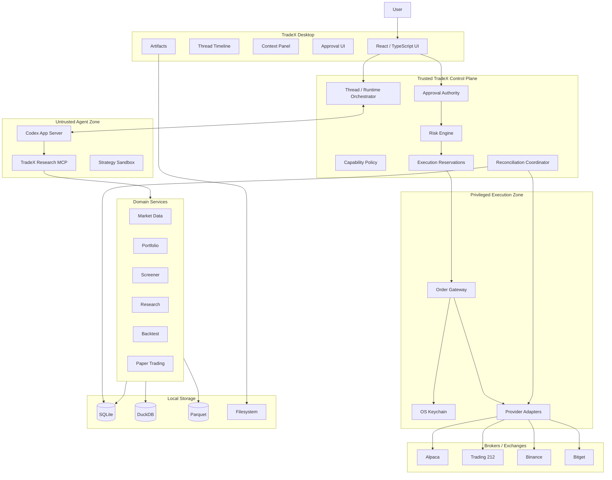

# TradeX 产品需求文档

**版本:** 1.0 Final — Revision C(中文版)  
**日期:** 2026-09-05\
**产品:** TradeX  
**类别:** 本地优先的 AI 交易智能体工作区  
**主运行时方向:** OpenAI Codex App Server / Codex Harness  
**状态:** 架构、UI 规范、原型追溯、QA 规划与 MVP 实现的规范性基线  
**原型证据:** [docs/prototype](../prototype/README_zh.md)，审查源码 main@6c4b267。2026-09-05 澄清更新规范文档；当前原型缺陷及剩余门槛记录在 Coverage Matrix 和 QA Report 中。

> **本文件是英文权威版 `TradeX_PRD_v1.0_RevC.md` 的简体中文翻译**,内容以英文版为准;术语与状态 token 保留英文原文,见 [中文目录](./README.md) 的术语约定。

---

本次澄清保留 v1.0 范围和 FR/AC 标识。UI Spec §14 细化交互；Backend ARD §5/§24 和 §41–42 定义 Gateway 与权威传输契约。文档可用于开发，不代表原型/运行时已验收。

## 修订历史

| 版本 | 日期 | 摘要 |
|---|---|---|
| 1.0 Final | 2026-09-04 | 初始定稿(2,980 行、30 章;pre-baseline,未入 git 历史)。 |
| 1.0 RevA | 2026-09-04 | 规范性重基线:新增 AC-039–AC-054 与 NFR/SEC/DATA/OPS/UX 需求表(§62.2–62.5);规范化订单状态机与错误分类(§45、§51);新增端到端状态断言要求(§67.5)与实施阶段/开放决策/成功标准(§70–§73);QA 与覆盖文档从"全部 Complete"改为分级证据。 |
| 1.0 RevB | 2026-09-04 | LLM 网关架构重构:模型接入限定为两个来源——本地 CLIProxyAPI(ChatGPT 订阅 OAuth → GPT-5.6)与 DeepSeek 官方 API key——统一经由单一本地 OpenAI 兼容端点(§16、§26.3、§27、§58、§64);OD-009/OD-015 转为已决议(§72);安全增补 SEC-007/SEC-008 与 Model-credential zone(§17、§62.2);审批/预留时序加固(§15、§18、§21.3、§22、§23、§45、§46、§47);MVP 存储画像简化(§32、§54);适配器合并(§24);LLM 错误分类(§51);FR-068–FR-073 与 AC-055–AC-058(§61、§69);隐私披露(§56);JTBD/范围/成功标准更新(§8、§68、§73)。 |
| 1.0 RevC | 2026-09-04 | 产品状态模型与原型统一:将 Agent Mode 与 Execution Context 分离(§12–§15);新增每轮不可变上下文/模型快照、OrderDraft→OrderProposal 语义、兼容矩阵、账户级布防、基于证据的对账人工处置、提供方权限安全门、时间/FX 溯源与更细粒度能力描述;跨提供方 LLM 自动回退默认关闭并改为显式 opt-in/默认手动(§16、§26.3、§51、§56);统一 DuckDB/Parquet 与市场数据分层语义(§32、§54、§63);强化 FR/AC/NFR/SEC/DATA/OPS/UX 追溯、Phase 0 门槛、成功指标与开放决策治理;同步英文/中文 PRD、UI Spec、Coverage Matrix、QA Report 与独立原型。 |
| 1.0 RevC 澄清 | 2026-09-05 | 按提交状态限定过期/预留释放，明确全局 disarm 范围与撤单身份，补充 Gateway/IPC 契约引用，校正证据等级并同步双语；原型代码未变。 |

## 目录

- §1–§5 总览:执行摘要 · 问题陈述 · 产品愿景 · 产品目标 · 非目标
- §6–§8 原则与用户:产品原则 · 目标用户 · 待完成的工作
- §9–§11 产品形态:核心用户旅程 · 产品信息架构 · Codex 风格 UX 模型
- §12–§15 核心模型:线程/轮次/条目模型 · Agent Mode 与 Execution Context · 能力模型 · 实盘交易账户武装状态
- §16–§20 执行权威:智能体运行时架构 · 安全边界 · 金融审批模型 · 订单提案 · 审批 UI
- §21–§24 防护栏:确定性风险引擎 · 审批前与执行前校验 · 执行保留与并发 · 券商适配器架构
- §25–§29 券商与数据:支持的券商与交易所 · 账户连接模型 · 凭证安全 · 市场与标的模型 · 订单数量语义
- §30–§35 市场数据:标的规则服务 · 市场数据架构与分层 · 市场数据元数据 · 市场数据授权与许可 · 市场日历与公司行为
- §36–§40 研究与回测:研究需求 · 筛选器需求 · 组合需求 · 回测 · 回测可复现性清单
- §41–§44 策略与交易:策略沙箱 · Paper/Demo/Testnet 交易 · Live 交易 · 市价单安全
- §45–§51 状态与错误:订单状态模型与 UI 映射 · 幂等性 · 对账 · 启动与崩溃恢复 · 休眠/恢复/连接性 · 速率限制管理 · 错误分类
- §52–§56 Agent 与存储:提示注入与不可信内容 · Agent 记忆 · 本地存储架构 · 本地数据生命周期 · 隐私模型
- §57–§60 平台:可观测性 · Codex 运行时依赖 · 桌面技术方向 · 高层架构
- §61–§64 需求:功能需求 · 非功能与横切需求 · 本地资源约束 · 依赖
- §65–§69 治理:监管/API/数据约束 · 风险登记 · 测试策略 · MVP 范围 · MVP 验收标准
- §70–§73 执行:实施阶段 · 未来范围 · 开放产品决策 · 产品成功标准

---


---

# 1. 执行摘要

TradeX 是一个**本地优先、智能体原生的交易工作空间**,用于市场研究、投资组合分析、回测、模拟交易,以及经审批网关控制的实盘交易。

其交互模型有意设计得类似于 **OpenAI Codex Desktop**:

- 用户在持久的智能体线程(agent thread)中工作;
- 智能体规划工作并调用带类型的工具;
- 研究、市场数据、策略运行、券商读取与交易操作以结构化时间线条目呈现;
- 报告、表格、图表、策略与回测等产物(artifact)保留在工作空间中;
- 用户可以在不离开线程的情况下,从研究平滑过渡到模拟交易或实盘执行。

TradeX 并非意图成为一个在上方叠加 AI 聊天面板的传统交易终端。**智能体线程才是主要的工作空间对象**。

该产品支持:

- 美股研究与投资组合分析;
- 加密货币市场研究;
- 本地策略开发与回测;
- Alpaca 模拟交易(paper trading);
- Trading 212 的 demo 与 live 股票交易;
- Binance 的 testnet 与 live 现货交易;
- Bitget 的 demo 与 live 现货交易;
- 未来扩展至更多券商、交易所、资产类别及 A 股数据源。

实盘交易围绕一条严格的安全不变量设计:

> **智能体可以对一笔交易进行推理并提出请求,但它永远不拥有执行实盘交易所需的授权。**

MVP 中每一笔实盘订单都必须通过确定性的策略与风险检查,并在受权限保护的本地 Order Gateway 将其发送至券商或交易所之前,获得一次性的显式用户审批。

---

# 2. 问题陈述

活跃的个人交易者及量化研究人员通常需要在碎片化的工具之间切换工作:

- 市场数据终端;
- 券商应用;
- 图表软件;
- notebook 与 Python 脚本;
- 新闻与研究网站;
- 策略仓库;
- 回测引擎;
- 电子表格;
- AI 助手。

一种典型的工作流如下:

```text
Research
   ↓ manual copying
Charts
   ↓ manual comparison
Portfolio
   ↓ manual context reconstruction
Python / Backtest
   ↓ manual interpretation
Broker
   ↓ manual order entry
Trade review
```

这带来了若干问题:

1. 上下文在工具之间反复丢失。
2. 研究证据与最终交易相互脱节。
3. AI 助手往往缺乏可靠的账户、市场与策略状态。
4. 通用 AI 智能体并非围绕安全的金融执行边界而设计。
5. 策略研究与实盘执行难以端到端复现与审计。
6. 用户反复将自然语言目标转化为手动的数据查询、代码、计算与下单。
7. 现有交易终端功能强大,但通常并非智能体原生。

TradeX 旨在将上述工作流压缩为:

```text
Intent
  ↓
Agent Thread
  ↓
Evidence + Deterministic Tools
  ↓
Analysis / Strategy / Backtest
  ↓
Order Proposal
  ↓
Risk Validation
  ↓
User Approval
  ↓
Execution
  ↓
Reconciliation
  ↓
Audit / Review
```

---

# 3. 产品愿景

> **TradeX 是面向市场的 Codex:一个本地 AI 工作空间,用户可以通过持久的智能体线程进行研究、分析、回测、模拟交易,并安全地执行真实交易。**

长期愿景是一个桌面工作空间,在其中与market相关的工作体验类似于使用一个先进的编码智能体:

- 用户表达意图;
- 智能体展开调查;
- 工具提供确定性事实;
- 执行进度可见;
- 决策沉淀为产物;
- 状态跨会话持久保留;
- 每一个重要操作都可被检视与复现。

---

# 4. 产品目标

## 4.1 主要目标

TradeX v1.0 应当:

1. 提供一个 Codex 风格的本地桌面工作空间,用于与市场相关的智能体工作流。
2. 支持带有流式工具执行与结构化结果的持久智能体线程。
3. 在同一工作空间中统一研究、投资组合分析、回测与交易。
4. 在 MVP 中支持美股与加密现货市场。
5. 支持 Alpaca Paper、Trading 212、Binance 与 Bitget。
6. 默认将主要用户数据与应用状态保存在本地。
7. 将券商凭据与模型和智能体运行时隔离。
8. 对每一笔实盘订单要求显式的一次性用户审批。
9. 维护一个独立于 LLM 的确定性本地风险引擎。
10. 从网络故障、券商状态歧义、应用崩溃与重启中安全恢复。
11. 在研究、提案、审批、券商提交与最终成交之间保留可审计的关联。
12. 提供一个插件式架构,以便未来接入更多券商、交易所、市场数据提供商与智能体工具。

---

# 5. 非目标

TradeX v1.0 不打算提供:

- 无人值守的自主实盘交易;
- 高频交易;
- 做市;
- 跟单交易;
- 社交交易;
- 托管账户;
- 代表第三方进行交易;
- 提现或转账功能;
- 入金功能;
- 资产托管;
- 杠杆管理;
- 保证金借贷;
- 期权交易;
- 期货实盘交易;
- 机构级 OMS/EMS 功能;
- 亚毫秒级执行;
- 云端托管的多人协作;
- 移动端优先的执行;
- 券商账户创建;
- 券商 KYC 流程;
- 投资顾问或组合管理服务。

未来版本可能扩展部分市场能力,但提现、转账与资产托管应始终处于核心产品方向之外。

---

# 6. 产品原则

## 6.1 本地优先

默认情况下,以下内容应存储于本地:

- 线程;
- 工作空间状态;
- 账户元数据;
- 投资组合快照;
- 自选列表;
- 研究报告;
- 策略源代码;
- 策略元数据;
- 回测数据集与输出;
- 订单提案;
- 审批记录;
- 执行日志;
- 智能体记忆;
- 市场数据缓存;
- 风险策略;
- 产物。

应用运行无需云端后端。

本地优先主要指存储与应用架构层面。模型推理始终涉及远程提供商:在 RevC 的 LLM 策略下(§16),所有为推理而发送的智能体上下文仅通过唯一一个通道离开设备——本地 CLIProxyAPI 端点(127.0.0.1:8317)——并由 ChatGPT 订阅后端(GPT-5.6 系列)或 DeepSeek API 处理,具体取决于所选模型。任何其他数据类别都不会离开设备:券商凭据、keychain 条目、工作空间数据库、产物与审计日志永不离开本地存储。

---

## 6.2 智能体原生

主要的应用模型为:

```text
Thread
→ Turn
→ Plan
→ Tool calls
→ Results
→ Artifacts
→ Optional action
```

而非:

```text
Traditional trading terminal
+
chat sidebar
```

---

## 6.3 研究优先

对于非平凡(nontrivial)的金融操作,TradeX 应当鼓励:

```text
Evidence
→ Analysis
→ Proposal
→ Action
```

而非:

```text
Prompt
→ Immediate order
```

---

## 6.4 默认安全的执行

LLM 不能:

- 访问原始券商密钥;
- 直接发送经过认证的券商订单;
- 自我授权执行;
- 削弱风险限额;
- 审批自己的订单。

实盘执行始终经过位于智能体授权边界之外的受信任本地组件。

---

## 6.5 结构化数据优先

庞大的提供商载荷应在到达模型之前完成规范化。

模型应接收紧凑的带类型数据,而非:

- 无限制的账户 JSON;
- 完整 tick 流;
- 原始订单簿增量;
- 完整的历史数据集。

---

## 6.6 券商状态具有权威性

对于实盘活动:

> 券商或交易所状态具有权威性。TradeX 维护该状态的本地投影。

在出现歧义的网络故障或重启之后,未经对账(local reconciliation)前,绝不可假设本地状态正确。

---

## 6.7 人工审批是交易特定的

实盘交易的人工审批是:

- 单次使用;
- 提案特定;
- 账户特定;
- 操作特定;
- 限时有效。

通用的工具审批、会话审批或模型级权限均不能授权一笔实盘金融交易。

---

# 7. 目标用户

## 7.1 用户画像 A —— 技术型主动交易者

特征:

- 积极研究美股及/或加密货币;
- 理解交易概念;
- 需要 AI 辅助分析;
- 可能使用多个账户;
- 仍希望对实盘执行保持手动控制。

主要需求:

- 更快的研究;
- 组合感知的分析;
- 有证据支撑的提案;
- 清晰的执行预览;
- 研究与交易合一的工作空间。

---

## 7.2 用户画像 B —— 量化研究员 / 开发者

特征:

- 熟悉 Python 或 TypeScript;
- 开发系统性思路;
- 关注可复现性;
- 在模拟或实盘交易前使用历史测试。

主要需求:

- 策略工作空间;
- 确定性回测;
- 数据集与产物;
- 策略版本间的对比;
- 信号生成与执行之间的清晰分离。

---

## 7.3 用户画像 C —— 多场所加密货币交易者

特征:

- 使用 Binance 及/或 Bitget;
- 比较场所流动性;
- 监控价差、资金费率、OI 与余额;
- 可能维护多个加密账户。

主要需求:

- 统一的场所上下文;
- 规范化的资产与订单表示;
- 感知场所的市场数据;
- 明确的 live/testnet 分离;
- 快速的账户与订单对账。

---

## 7.4 明确的非目标用户

MVP 并非为以下对象设计:

- 机构交易台;
- 做市商;
- 管理客户资金的财务顾问;
- 期望完全自主财富管理的用户;
- 将智能体作为金融教育替代品的彻底新手;
- 对延迟敏感的套利者。

---

# 8. 待完成的工作(Jobs to Be Done)

用户应能够使用 TradeX 来:

1. 调查某一标的或市场事件。
2. 比较多个标的或场所。
3. 理解当前投资组合敞口。
4. 使用自然语言筛选市场全集。
5. 将一份投资论点保存为产物。
6. 生成或修改策略。
7. 在本地回测策略。
8. 比较多次回测运行。
9. 模拟或模拟交易(paper trading)。
10. 准备一笔实盘订单。
11. 在交易前审阅风险影响。
12. 审批或拒绝一笔实盘交易。
13. 监控提交、部分成交、全部成交、撤单或拒绝。
14. 从不确定的订单状态中恢复。
15. 复盘一笔交易为何发生。
16. 在不重建上下文的情况下恢复先前的研究。
17. 配置与管理 AI 推理来源(ChatGPT 订阅经 CLIProxyAPI、DeepSeek API key),包括健康度、配额与回退(fallback)可见性。

---

# 9. 核心用户旅程

## 9.1 从研究到模拟交易

示例:

> 比较 NVDA、AMD 与 AVGO。检查动量、近期财报、估值以及我当前的敞口。如果 NVDA 仍是最强候选,则在 Alpaca Paper 中买入价值 $500 的仓位。

流程:

```text
User request
→ market data
→ research
→ portfolio read
→ comparison
→ decision artifact
→ paper risk check
→ Alpaca Paper submission
→ broker update
→ fill
```

---

## 9.2 从研究到 Trading 212 实盘订单

示例:

> 复盘 AAPL 与我当前投资组合。若由此产生的单票敞口仍低于 10%,则准备一笔两股的限价单。

流程:

```text
Research
→ account snapshot
→ quote
→ risk evaluation
→ immutable proposal
→ approval card
→ user approval
→ pre-execution revalidation
→ Trading 212 submission
→ reconciliation
```

---

## 9.3 Binance 现货交易

示例:

> 比较 BTC 在 Binance 与 Bitget 上的流动性。若价差仍低于我的限额,则在更优场所准备一笔 0.01 BTC 的 Binance 现货买入。

流程:

```text
venue market data
→ liquidity comparison
→ selected venue
→ proposal
→ risk checks
→ approval
→ pre-execution validation
→ submission
→ private stream / REST reconciliation
```

---

## 9.4 Bitget Demo 验证

示例:

> 在最近 12 个月上运行我的 BTC 突破策略,随后在下一有效信号出现时使用 Bitget Demo。

流程:

```text
strategy load
→ historical data
→ backtest
→ result artifact
→ demo mode
→ signal
→ demo order
→ fill update
```

---

## 9.5 现有持仓复盘

示例:

> 复盘我在 Trading 212、Binance 与 Bitget 上的所有实盘持仓。告诉我自昨日以来发生了什么变化,以及哪份投资论点需要关注。

预期结果:

- 统一的投资组合视图;
- 持仓级的市场上下文;
- 投资论点链接;
- 重要变化;
- 除非明确要求,否则不进行交易。

---

## 9.6 关键失败与恢复旅程

MVP 还必须把以下非 happy-path 旅程作为一等产品流程:

1. 选择实盘账户期间提供方认证过期;
2. thread 执行期间 LLM sidecar 或模型提供方不可用;
3. 实盘审批因到期、行情或风控策略变更失效;
4. 第二个 thread 与已预留现金/敞口发生冲突;
5. 实盘请求离开 TradeX 后超时,提交状态不明确;
6. 应用重启时存在未结或未知实盘订单;
7. 实盘撤单与部分成交发生竞态;
8. 恢复工作区时只有账户引用而没有券商密钥;
9. 市场数据陈旧/延迟、市场休市/停牌,或时间同步超出容差。

每条旅程必须落到显式权威状态、确定性修复路径与审计事件。

---

# 10. 产品信息架构

TradeX 刻意采用极简的主导航,使产品保持为一个智能体工作空间,而非演变成一个模块繁重的交易终端。

主导航:

```text
New Thread
Threads
Markets
Watchlists
Accounts
Strategies
Artifacts
Settings
```

`Settings` 包含次级配置入口:

```text
Providers & Models
Risk & Limits
Data & Storage
Account Health
Appearance
About
```

由上下文驱动的视图可从主工作空间打开,但不成为一级导航:

- 投资组合;
- 订单;
- 回测;
- 账户详情;
- 标的详情;
- 产物溯源;
- 恢复 / 对账状态。

`Markets` 作为一级发现入口保留,因为筛选器(screener)与标的发现是反复出现的工作流。投资组合与订单作为账户 / 上下文视图存在,而非永久的顶级模块。

---

# 11. Codex 风格 UX 模型

## 11.1 主布局

```text
┌───────────────────────────────────────────────────────────────────────────┐
│ Workspace              Current Context                  PAPER / LIVE       │
├──────────────┬─────────────────────────────────────┬──────────────────────┤
│              │                                     │                      │
│ Threads      │ Agent Timeline                      │ Context              │
│              │                                     │                      │
│ Today        │ User                                │ Quote                │
│ Yesterday    │ Plan                                │ Chart                │
│ Saved        │ Tool Call                           │ Position             │
│              │ Research                            │ Open Orders          │
│ Watchlists   │ Chart                               │ Exposure             │
│ Accounts     │ Backtest                            │ Evidence             │
│ Strategies   │ Order Proposal                      │ Risk                 │
│ Artifacts    │ Approval                            │                      │
│              │ Order Update                        │                      │
│              │ Fill                                │                      │
├──────────────┴─────────────────────────────────────┴──────────────────────┤
│ @Context     Account      Mode      Model                        Send      │
└───────────────────────────────────────────────────────────────────────────┘
```

---

## 11.2 输入区(Composer)

输入区控件:

```text
@ Context
Account
Mode
Model
```

上下文标签(chip)示例:

```text
@AAPL
@BTC/USDT
@Trading212-Live
@Binance-Live
@Momentum-v3
@Backtest-2026-09-01
```

切换至 Live 会更改可见的环境,但不会授权执行。

---

## 11.3 线程时间线

中部时间线应展示:

- 用户消息;
- 智能体消息;
- 计划;
- 工具调用;
- 结构化结果;
- 产物;
- 警告;
- 风险检查;
- 订单提案;
- 审批;
- 提交;
- 成交;
- 错误;
- 对账状态。

用户应能够在默认显示紧凑摘要的同时,展开查看技术细节。


## 11.4 线程历史与持久化工作导航

左侧栏必须暴露近期与已保存的线程,使工作空间表现得像一个持久的智能体工作台,而非无状态的聊天界面。

最低 UX 要求:

```text
Threads
  Today
    US tech earnings analysis
    BTC liquidity setup
  Yesterday
    Portfolio risk review
    AAPL thesis refresh
  Saved
```

要求:

- 线程历史在本地持久化;
- 选择一个线程会在适当时恢复关联的账户、标的、策略、产物与模式上下文;
- 恢复线程绝不恢复先前已被消费或已过期的实盘执行审批;
- 用户可以在不丢失先前线程状态的情况下新建线程。

## 11.5 上下文、账户、Agent Mode 与模型选择器

输入区控件是可交互的产品原语,而非装饰性标签。

`@ Context` 打开一个选择器,用于:

- 标的;
- 账户;
- 策略;
- 回测运行;
- 产物。

账户选择器必须清晰区分 Paper / Demo / Testnet / Live 连接。

模型选择器仅更改推理模型。它绝不能更改交易权限、风险限额或实盘执行授权。切换模型在下一轮次(turn)生效,且绝不改变正在执行中的轮次;每个轮次记录生成它的模型与 provider。模型按其 provider 来源显示(CLIProxyAPI 本地网关 vs DeepSeek API)。

选择 `Live` 模式会更改工具 / 能力上下文,但不会武装(arm)实盘执行。

## 11.6 智能体工具与轮次状态

原型与实现必须可见地支持:

```text
Tool: Running
Tool: Completed
Tool: Failed
Tool: Retrying
Turn: Cancelled
Turn: Interrupted
```

一个失败且仅读的工具绝不能呈现为金融状态的变更。用户必须能够重试或取消受影响的轮次。

## 11.7 响应式产品行为

主要产品是一个桌面应用。响应式规则适用于窄桌面与平板级窗口,而非一个独立的原生移动执行产品。

响应式布局必须保留:

- 线程访问;
- 核心市场 / 账户上下文;
- Paper / Demo / Testnet / Live 区分;
- 所选账户的实盘武装状态;
- 审批安全信息;
- 拒绝一笔实盘订单的能力;
- 禁用实盘执行的能力。

在窄窗口下,次级检视面板可折叠至主内容下方,但实盘审批细节绝不可隐藏在仅悬停或仅桌面的 UI 之后。

TradeX v1.0 **不**提供原生的移动端实盘执行客户端。未来的移动端伴侣应用保持只读,除非另行评审。

## 11.8 可访问性与破坏性操作的键盘安全

核心产品界面必须可通过键盘到达,并暴露可见的焦点状态。

对于实盘金融操作:

- 在输入区、选择器、模态框或表单中按下 `Enter` 绝不能隐式审批一笔实盘订单或撤单;
- 实盘审批需要在该控件获得焦点时激活显式的审批控件;
- `Escape` 可以关闭 / 拒绝一个可解除的审批界面,但绝不能审批它;
- 颜色绝非 Paper / Demo / Testnet / Live 或执行状态的唯一指示器;
- `SUBMITTING`、`FILLED`、`REJECTED`、`UNKNOWN_RECONCILING` 等状态变化应以状态更新的形式暴露给辅助技术;
- 对于非必要动画,必须尊重减少动态效果(reduced-motion)的偏好。

# 12. 线程、轮次与条目模型

每个用户任务对应一个持久化 Agent Thread。Thread 包含一个或多个 Turn;Turn 包含类型化 Item。

Thread 仅保存长期导航/默认上下文,不作为每个历史 Turn 的权威状态:

```text
workspace_id
codex_thread_id
title
created_at
updated_at
default_agent_mode
linked_accounts[]
linked_instruments[]
linked_strategies[]
linked_artifacts[]
```

每个 Turn 在开始时保存**不可变快照**,从而确保回放/审计不依赖后续 picker 变化:

```text
turn_id
agent_mode_at_start
selected_account_id?
execution_context_at_start
capability_level_at_start
model_id
model_provider
provider_attempts[]
attached_context_ids[]
attached_context_hashes[]
started_at
completed_at?
```

金融 Item 还引用权威决策所使用的不可变策略与市场上下文:

```text
proposal_id / proposal_hash
policy_version
market_snapshot_id
reservation_id?
approval_id?
execution_attempt_id?
```

推荐的领域 Item 类型:

```text
user_message
agent_message
plan
tool_call
tool_result
market_snapshot
research_evidence
portfolio_snapshot
chart
screener_result
strategy
backtest_result
order_draft
order_proposal
risk_check
approval_request
reservation
order_submitted
order_update
fill
position_update
warning
error
artifact
```

Item 生命周期:

```text
started
streaming
completed
failed
```

恢复 Thread 可以恢复当前默认值与附加上下文,但绝不恢复已消费/过期审批、陈旧 market snapshot 或 `ARMED` 状态。

---

# 13. Agent Mode 与 Execution Context

TradeX 将**智能体正在做什么**与**执行可能发生在哪里**分成两个正交产品状态,不得编码为同一个 enum。

## 13.1 Agent Mode

| Agent Mode | 用途 | 执行权限 |
|---|---|---|
| Ask | 轻量问题 / 快速分析 | 无 |
| Research | 深度市场 + 投资组合研究 | 无 |
| Backtest | 策略研究 | 仅历史模拟 |
| Trade | 准备/检查当前市场交易 | 由所选 Execution Context、风控、布防与审批共同决定 |

Agent Mode 控制工具暴露与工作流密度。仅选择 `Trade` 不会授予执行权限。

## 13.2 Execution Context

Execution Context 由所选账户/环境与当前 Agent Mode 推导:

```text
NONE / READ_ONLY
HISTORICAL_SIMULATION
LOCAL_PAPER
ALPACA_PAPER
TRADING212_DEMO
TRADING212_LIVE
BINANCE_TESTNET
BINANCE_LIVE
BITGET_DEMO
BITGET_LIVE
```

实盘账户可在 Ask/Research 中作为**只读上下文**附加;只有 Trade 模式且全部安全门通过后,同一账户才具备执行能力。

## 13.3 兼容矩阵

| Agent Mode | 无账户 | Paper/Demo/Testnet 账户 | Live 账户 |
|---|---|---|---|
| Ask | 公共/只读 | 只读上下文 | 只读上下文 |
| Research | 公共/只读 | 只读上下文 | 只读上下文 |
| Backtest | 历史模拟 | 可作为组合初始条件;无券商执行 | 可作为组合初始条件;无券商执行 |
| Trade | 必须选择执行账户 | 本地/券商托管模拟执行 | proposal → risk → account arming → transaction approval → execution |

UI 必须禁用非法组合或解释原因,不得通过静默切换来改变权限。

## 13.4 Ask 模式规则

Ask 有意比 Research 更轻量:

- 可使用公开市场数据及显式附加的只读上下文;
- 不暴露当前市场的 paper/live 执行工具;
- 默认不创建研究产物;
- 用户可提升为 Research、Backtest 或 Trade。

在 Ask/Research 中选择 Live 账户,或仅选择 Trade 模式,都**不会**布防该账户。

---

# 14. 能力模型

| 级别 | 能力 |
|---|---|
| C0 | 公开市场数据 |
| C1 | 账户读取 |
| C2 | 回测 |
| C3 | 模拟 / demo 执行 |
| C4 | 实盘订单提案 |
| C5 | 经显式用户审批后的实盘执行 |
| C6 | 无人值守实盘执行 |

C6 不在范围内。

LLM 不能提升其自身的能力级别。

---

# 15. 实盘交易账户武装状态

实盘武装是**账户级作用域**的,而非单一的整个工作空间级权限。

每个实盘账户拥有独立的状态:

```text
Trading 212 Live   DISARMED
Binance Live       DISARMED
Bitget Live        DISARMED
```

对于单个账户:

```text
DISARMED
   ↓ 针对该确切账户的显式用户操作
ARMED
   ↓
实盘提案可进行至交易特定的审批
```

武装一个实盘账户不会武装任何其他实盘账户。

在账户处于 ARMED 期间,实盘执行仍保持交易特定且受审批网关控制。

TradeX 会在以下情况后自动将受影响的实盘账户恢复为 `DISARMED`:

- 应用重启;
- OS 休眠或会话锁定;
- 凭据变更;
- 账户健康度下降(单一触发来源,涵盖:提供商重连的认证失败、对账失败、预审批 / 预执行检查失败、不健康的券商状态);
- 风险策略削弱;
- 配置的非活跃超时。

任何可能影响待处理实盘提案的风险策略变更,都会使该受影响账户的审批失效。削弱策略还会额外解除该实盘账户的武装。

UI 必须提供:

- 清晰可见的 `LIVE · <Account> · ARMED/DISARMED` 状态;
- 每账户的 **Disable Live** 操作;
- 一个全局的 **Disable All Live Execution** 操作,可立即解除所有实盘账户针对新提交的武装。

---

### 15.1 Disarm 作用域与进行中的工作

应用重启、OS 休眠/锁屏和 Disable All 解除全部 Live 账户的 arming。账户专属健康/凭据故障影响该账户；策略变化影响绑定该策略的全部账户。UI 当前选择不能决定作用范围。Disable All 撤销尚未派发工作的待处理审批/派发许可，并阻止新传输。可能已跨过受信派发边界的尝试保留容量并对账，不能假定已撤销。释放任何预留前按 §45 判断。恢复需要健康重新校验和独立显式 Arm，不能恢复旧同意。

---

# 16. 智能体运行时架构

TradeX 使用 **Codex App Server / Codex Harness** 作为主要智能体运行时(线程生命周期、turn 执行、item 流式、工具调用、通用审批)。

## 16.1 模型访问策略(RevC)

模型推理严格限制为两个来源,统一经由单一本地 OpenAI-compatible 端点:

1. **CLIProxyAPI**(本地网关,固定版本):ChatGPT 订阅 OAuth(`--codex-login`)→ GPT-5.6 系列;
2. **DeepSeek 官方 API**:`deepseek-chat` / `deepseek-reasoner`,作为 CLIProxyAPI 上游,密钥由 OS keychain 注入。

v1.0 不允许其他模型 provider。所有模型流量终止于 `127.0.0.1:8317`;TradeX、Codex、策略代码或研究工具都不得直接连接外部 LLM 端点(SEC-007)。

```text
TradeX Desktop (React/Tauri)
      │ JSON-RPC / JSONL over local IPC
      ▼
Codex App Server ─── model_provider ───► CLIProxyAPI (127.0.0.1:8317)
      │                                  ├─ ChatGPT OAuth → GPT-5.6
      │                                  └─ DeepSeek official API → deepseek-*
      │
      └──────── TradeX Control Plane
                 Risk / Approval / Reservations / Order Gateway / Reconciliation
```

Control Plane 绝不依赖模型可用性。

## 16.2 CLIProxyAPI Sidecar 生命周期

CLIProxyAPI 作为**由 TradeX Rust 控制平面管理的用户级 sidecar**运行:

- 启动/监管/退避重启;
- 固定并展示 sidecar 版本;
- 探测 `/v1/models`,失败则标记模型链不健康;
- 8317 端口冲突映射为 `MODEL_UNAVAILABLE`;
- sidecar 仅持有模型凭证;券商凭证绝不进入该域(SEC-008)。

## 16.3 Provider 路由、回退与失败模式

跨 provider fallback 会改变接收模型输入的外部处理方,因此**跨 provider 自动 fallback 默认关闭**。

默认行为:

- 进行中的 turn 保持启动时的 provider/model 快照;
- OAuth 过期或持续配额耗尽会暂停/失败当前模型 attempt 并显示修复;
- 用户可 `Re-login`、`Retry` 或显式 `Switch to DeepSeek` 用于下一 attempt/turn;
- provider/model 变化记录在 `provider_attempts[]` 与审计轨迹;
- provider 切换不得改变 capability、账户布防、风控或审批要求。

用户可显式开启 **Allow automatic fallback to DeepSeek**。开启后,TradeX 可对符合条件的失败 attempt 通过 DeepSeek 重试,但必须明显披露 provider 变化并记录前后两个 attempt。

| 失败 | 行为 |
|---|---|
| Sidecar 未运行 / 端口占用 | agent turn 暂停,显示 `MODEL_UNAVAILABLE` + 修复;交易/审批/对账不受影响 |
| ChatGPT OAuth 过期(401) | `OAUTH_EXPIRED`;重新登录或显式切 provider;仅在用户已 opt-in 时自动 fallback |
| ChatGPT 配额耗尽(429) | `QUOTA_EXCEEDED`;冷却/重试或显式切 provider;仅在已 opt-in 时自动 fallback |
| DeepSeek 不可用 | 相关 DeepSeek turn 暂停/失败;不会静默切回 ChatGPT |
| 两个 provider 均不可用 | agent turn 禁用;非模型控制平面继续工作 |

---

# 17. 安全边界

TradeX 应分离三个信任区域。

```text
┌─────────────────────────────┐
│ Untrusted Agent Zone        │
│                             │
│ Codex App Server            │
│ Research MCP tools          │
│ Strategy sandbox            │
│ Workspace files             │
└──────────────┬──────────────┘
               │
               │ proposals / reads
               ▼
┌─────────────────────────────┐
│ TradeX Control Plane        │
│                             │
│ Capability policy           │
│ Risk Engine                 │
│ Approval authority          │
│ Execution reservations      │
│ Reconciliation coordinator  │
└──────────────┬──────────────┘
               │
               │ scoped execution capability
               ▼
┌─────────────────────────────┐
│ Privileged Execution Zone   │
│                             │
│ Order Gateway               │
│ Keychain access             │
│ Broker adapters             │
└─────────────────────────────┘

┌─────────────────────────────┐
│ Model-credential Zone       │
│ (RevC)                      │
│                             │
│ CLIProxyAPI sidecar         │
│ ChatGPT OAuth tokens        │
│ DeepSeek API key (rendered) │
│                             │
│ Holds ONLY model            │
│ credentials — never broker  │
│ credentials (SEC-008)       │
└─────────────────────────────┘
```

安全不变量:

> Codex 可以请求金融执行,但无法直接访问特权网关或凭据。

> 模型推理流量有且只有一个出口 —— 本地 CLIProxyAPI 端点 —— 且模型凭据区域与特权执行区域相互独立(SEC-007、SEC-008)。

---

# 18. 金融审批模型

交易审批是 TradeX 的一种授权机制。

通用的 Codex 审批机制可用于暂停一个轮次并渲染 UI,但它们本身绝不能授权实盘金融执行。

一份有效的实盘审批是:

- 绑定于一个提案哈希;
- 绑定于一个账户;
- 绑定于一个操作;
- 绑定于一个用户动作;
- 短生命周期;
- 单次使用。

示例:

```yaml
proposal_id: ordp_01
proposal_hash: sha256(...)
account_id: trading212-live
operation: PLACE_ORDER
expires_at: 2026-09-04T15:15:00Z
nonce: ...
```

任何实质性的订单变更都会使审批失效。

每份审批还附带审批生效时的 `policy_version`。`PRE_EXECUTION_CHECK` 会重新校验该账户当前的策略版本是否仍匹配；不匹配则使审批失效。只有受信执行边界确认尚未开始提交时，过期或失效才原子释放已有的账户级预留。一旦可能已经开始提交，本地审批过期不能释放容量，也不能覆盖券商订单状态；按 §45 的条件处理。

---

撤单金融审批绑定不可变 cancellation_intent_id/intent_hash，而非新建订单的 proposal_id/proposal_hash。意图固定 operation=CANCEL、账户/环境、提供方订单身份及新鲜的剩余订单快照。Arming 和导航不能改变操作类型（§43.3）。

---

# 19. Order Draft 与不可变 Order Proposal

Agent 或用户可先创建可编辑 `OrderDraft`;draft 没有审批权限。

```text
OrderDraft (editable)
→ Generate Proposal
→ OrderProposal (immutable id + hash)
→ Risk / Approval / Reservation / Execution
```

Proposal 生成后的任何编辑都会创建**新的 proposal_id/proposal_hash**;旧 proposal 与审批保留在审计中但不可再使用。

```yaml
proposal_id: ordp_01
account_id: trading212-live
venue: TRADING212
environment: LIVE
instrument_id: equity:US:AAPL
side: BUY
order_type: LIMIT
quantity:
  type: BASE
  value: 2
limit_price: 221.50
time_in_force: DAY
estimated_notional:
  amount: 443.00
  currency: USD
market_snapshot_id: ms_01
policy_version: risk_v7
status: NEEDS_APPROVAL
```

---

# 20. 审批 UI

每笔实盘订单审批都必须同时展示不可变更的交易内容与用于审批的确切市场快照。

示例:

```text
LIVE ORDER

Trading 212 Live
BUY 2 AAPL
Limit: $221.50
Estimated value: $443.00

MARKET SNAPSHOT
Quote: $221.42
Venue: NASDAQ
Source: MarketDataProvider-X
Provider timestamp: 14:42:18.201
TradeX received: 14:42:18.312
Entitlement: REALTIME
Quote age: 111 ms
Freshness: HEALTHY

Available cash: €...
Projected AAPL concentration: 8.4%

Risk checks
✓ Account connected
✓ Account reconciled
✓ Instrument tradable
✓ Quantity valid
✓ Position limit valid
✓ Daily exposure valid
✓ Reservation capacity valid
✓ Duplicate-order protection valid
✓ Quote freshness valid

[Reject]                         [Approve & Place Order]
```

审批要求:

- 审批控件在视觉上须与普通聊天/发送控件区分开;
- 当使用市场数据来审批执行时,来源、提供方时间戳、TradeX 接收时间戳、实时/延迟授权、交易场所与新鲜度状态为必填项;
- 延迟数据必须标注为 `DELAYED`,且不能满足仅限实时的执行策略;
- 账户、标的、方向、数量/名义金额、订单类型、价格、有效期或市场快照有效性发生实质性变化,将令审批失效;
- 键盘行为遵循 §11.8,且绝不可将 `Enter` 设为隐式实盘审批快捷键。

---

# 21. 确定性风险引擎

风险引擎独立于模型运行。

## 21.1 用户可配置的风险策略

用户可配置的控制项可包括:

- 最大订单名义金额;
- 最大订单数量;
- 最大持仓规模;
- 单标的集中度上限;
- 资产类别敞口上限;
- 每日成交名义金额上限;
- 每日已实现亏损上限;
- 未平仓订单数量上限;
- 保留资金上限;
- 允许的标的;
- 禁止的标的;
- 允许的交易场所;
- 允许的账户;
- 市价单启用/禁用;
- 市价单最大滑点;
- 最大价格偏离;
- 过期价格阈值;
- 模拟/实盘环境约束。

智能体不能修改这些控制项。

## 21.2 系统强制的硬性安全规则

以下各项不属于用户可绕过的策略偏好:

- 提案标识/审批绑定;
- 重复订单防护;
- 小数位/精度校验;
- 提供方标的规则校验;
- 权威券商状态对账;
- 异常账户执行阻断;
- 过期市场快照阻断;
- 账户级保留正确性;
- 歧义非幂等提交后禁止盲目重试;
- 特权 Order Gateway 隔离。

## 21.3 风险策略变更行为

保存风险策略必须被视为安全相关事件。

对受影响的实盘账户:

```text
Save risk policy
→ invalidate pending live approvals that could be affected
→ re-evaluate pending proposals
→ if policy is weakened: DISARM account
→ persist audit event
```

当先前已审批的交易因策略变更而失效时,UI 必须明确提示。

同一账户的策略保存与审批消费通过按账户的单写者路径串行化,从而消除"保存 vs 消费"竞争:在审批签发与消费之间落地的保存,会被 `PRE_EXECUTION_CHECK` 处的策略版本检查捕获。

---

# 22. 审批前与执行前校验

每笔实盘订单都经过两次确定性校验。

```text
PRE_APPROVAL_CHECK
```

在审批之前。

随后:

```text
PRE_EXECUTION_CHECK
```

在提交之前立即执行。

第二阶段重新校验:

- 价格新鲜度;
- 可用资金;
- 持仓状态;
- 未平仓订单;
- 风险保留;
- 账户连通性;
- 标的状况;
- 市场状态。

若实质性条件发生变化——包括 `policy_version` 不匹配(§18)——原审批即失效,用户必须审批一份刷新后的提案。

---

# 23. 执行预留与并发

并发 thread 不得独立消耗同一份可用现金或敞口。Live 执行前必须计入持仓、未结订单、已批准未提交订单、已提交未确认订单、预留现金/敞口与待撤单。执行容量按**账户**原子预留。

```text
Trading 212 Live cash = €10,000
Thread A reserves €4,000
Effective available = €6,000
Thread B evaluates against €6,000, not €10,000
```

第二个提案若超出有效容量,在审批前由确定性风控返回 `RISK_REJECTED` 与 reservation-capacity 原因。

```text
APPROVED
→ RESERVED
→ SUBMITTING
→ ACCEPTED / REJECTED / UNKNOWN_RECONCILING
→ 仅根据权威结果释放或调整 reservation
```

`UNKNOWN_RECONCILING` 会冻结 reservation。自动对账窗口(默认 5 分钟)结束后,订单仍保持 `UNKNOWN_RECONCILING`,账户变为 unhealthy / DISARMED,并进入 **Manual Resolution**——绝不提供盲目的“release reservation”按钮。

Manual Resolution 必须基于证据:

1. **Confirmed not submitted**——要求 provider/account 证据;可释放 reservation,但 live 恢复前仍需重新验证账户健康;
2. **Confirmed submitted**——记录/关联 broker order identity,再按券商状态对账/调整 reservation;
3. **Keep reconciling**——保持冻结并继续 query-first 对账。

仅凭本地/用户声明不能让模糊状态账户恢复健康。确认提交前的过期/失效按 §45 原子释放已有预留。UI 在有助于解释阻断时展示 `Available`、`Reserved`、`Effective Available`。

---

# 24. 券商适配器架构

不要将每个提供方都塞进一个臃肿的接口。

推荐的接口(RevC:标的元数据并入市场数据适配器——元数据属于低频市场数据;ExecutionAdapter 因特权边界而保持独立):

```ts
interface AccountAdapter {}
interface ExecutionAdapter {}
interface MarketDataAdapter {}   // includes instrument metadata / rules
interface AccountStreamAdapter {}
```

能力发现应当是显式的。

示例:

```ts
interface BrokerCapabilities {
  accountRead: boolean
  positionRead: boolean
  publicMarketData: boolean
  privateAccountStream: boolean
  orderTypes: string[]
  fractionalQuantity: boolean
  notionalOrders: boolean
  extendedHours: boolean
  clientOrderId: boolean
  paperEnvironment: boolean
  liveEnvironment: boolean
}
```

UI 与智能体工具层应适配提供方能力。

---

# 25. 支持的券商与交易所

## 25.1 Alpaca

MVP 角色:

> 美国股票的主要模拟交易环境。

所需能力:

- 模拟账户;
- 余额;
- 购买力;
- 持仓;
- 订单;
- 成交;
- 模拟下单/撤单;
- 可用的兼容股票行情数据。

v1.0 不要求 Alpaca 实盘交易。

---

## 25.2 Trading 212

MVP 角色:

> 首批实盘美股券商集成。

在用户账户/API 环境支持的前提下所需能力:

- 账户信息;
- 标的;
- 持仓;
- 未平仓订单;
- 订单历史;
- 支持的订单类型;
- 撤单;
- 模拟环境;
- 实盘环境。

TradeX 应将提供方功能视为能力驱动,因为 Public API 可能演进。

禁止对非幂等订单提交进行自动盲目重试。

---

## 25.3 Binance

MVP 角色:

> 加密现货测试网与实盘执行。

所需能力:

- 现货行情数据;
- 余额;
- 现货订单;
- 现货成交;
- 公开 WebSocket;
- 私有账户/订单流;
- 现货测试网;
- 现货实盘。

不包含:

- 保证金;
- 期货;
- 杠杆调整。

---

## 25.4 Bitget

MVP 角色:

> 加密现货模拟与实盘执行。

所需能力:

- 现货行情数据;
- 余额;
- 现货订单;
- 成交;
- 模拟环境;
- 实盘环境;
- 支持的私有订单/账户更新。

不包含:

- 期货;
- 杠杆调整;
- 保证金。

---

# 26. 账户连接模型

设置 → 账户:

```text
+ Connect Account

US Equities
  Alpaca Paper
  Trading 212 Demo
  Trading 212 Live

Crypto
  Binance Testnet
  Binance Live
  Bitget Demo
  Bitget Live
```

每个账户展示:

- 提供方;
- 环境;
- 账户类型;
- 连接健康度;
- 能力集;
- 上次成功同步;
- 权限范围;
- 实盘交易启用/停用;
- 风险策略;
- 凭证健康度;
- 可选 API IP 限制状态。

模拟与实盘账户必须表示为不同的连接。


## 26.1 提供方连接工作流

连接账户是一个多步用户工作流,而非通用的硬编码 API 密钥表单。

所需流程:

```text
Select provider/environment
→ render provider-defined credential schema
→ enter credentials in trusted UI
→ test authentication
→ detect account type and capabilities
→ display requested/available permissions
→ confirm connection
→ persist only credential reference + non-secret metadata locally
```

提供方适配器提供凭证/能力模式,使 UI 能支持如下提供方专属字段:

- API 密钥;
- 密钥;
- 口令;
- 账户标识;
- 环境选择器;
- 其他提供方要求的非机密元数据。

UI 不得假设每个提供方都采用相同的 `API Key + Secret` 形态。

连接 UX 必须明确展示 TradeX 不需要也未实现:

- 提现;
- 转账;
- 托管;
- 保证金借贷;
- 杠杆管理。

对支持 IP 允许列表的提供方,UX 应建议启用。

## 26.2 提供方专属账户详情

账户详情页必须反映提供方真实能力,而非呈现通用券商页。

产品界面至少须呈现:

- Alpaca Paper;
- Trading 212 Demo;
- Trading 212 Live;
- Binance Testnet;
- Binance Live;
- Bitget Demo;
- Bitget Live。

每个账户视图应在可用时展示:

- 环境;
- 账户类型;
- 账户健康度;
- 余额/净值;
- 持仓;
- 未平仓订单;
- 上次成功同步;
- 上次对账;
- 检测到的权限/能力集;
- 凭证健康度;
- 风险策略摘要;
- 可选 IP 允许列表状态;
- 相关的实盘武装状态。

## 26.3 LLM 提供方连接模型(RevC)

LLM 提供方遵循与券商提供方相同的模式驱动连接方式(§26.1),v1.0 含两个来源(OD-015 已解决):

| 提供方 | 凭证 | 连接流程 | 健康信号 |
|---|---|---|---|
| CLIProxyAPI(本地网关) | TradeX 不持有——ChatGPT OAuth 存于 sidecar auth-dir | sidecar 安装/启动 → `--codex-login` 浏览器授权 → 探测 `/v1/models` → 模型列表发现 | sidecar 运行中 + 探测正常 |
| DeepSeek 官方 API | OS keychain 中的 API 密钥(由 Rust 层注入 sidecar 配置,§27) | 密钥录入 → keychain 存储 → 探测 + 推理测试 | 探测正常 + 密钥有效 |

连接 UI 展示:sidecar 状态(Running / Stopped / Port conflict / Unauthorized)、各提供方模型可用性,以及版本(已固定)。LLM 提供方永不出现在券商账户选择器中,也绝不授予交易能力。引导门槛:若无至少一个可用的 LLM 提供方,引导流程无法达到 Ready(AC-055)。

# 27. 凭证安全

要求:

1. 券商凭证仅存储于 OS 凭证存储。
2. 凭证绝不出现在普通工作区文件。
3. 凭证绝不出现在 SQLite、DuckDB、Parquet、产物或线程历史中。
4. 模型从不接收券商凭证。
5. 凭证仅在特权提供方签名层内注入。
6. 日志对 API 密钥、密钥、签名、令牌与鉴权头做脱敏。
7. TradeX 应仅要求最低 API 权限。
8. 不需要提现与转账权限。
9. 当提供方支持时,TradeX 应建议启用 API IP 限制。
10. 模拟/测试凭证与实盘凭证相互分离。
11. ChatGPT 订阅 OAuth 令牌仅存于 CLIProxyAPI sidecar auth-dir;TradeX 绝不读取、存储或传输它们(§16.2)。
12. DeepSeek API 密钥存于 OS keychain,并在启动时由 Rust 控制平面渲染进 sidecar 配置(文件模式 0600,退出时清除);它绝不出现在工作区文件、SQLite、日志或线程历史中。
13. 模型提供方 api-keys(包括在 sidecar 上配置的任何下游密钥)依据 NFR-004 与 §27.6 日志脱敏规则作为机密处理。

---

# 28. 市场与标的模型

TradeX 需要独立于提供方符号的规范标的标识符。

股票示例:

```yaml
instrument_id: equity:US:AAPL
asset_class: EQUITY
symbol: AAPL
exchange: XNAS
currency: USD
isin: optional
providers:
  alpaca: AAPL
  trading212: provider_specific_id
```

加密示例:

```yaml
instrument_id: crypto:BTC/USDT:spot
asset_class: CRYPTO_SPOT
base: BTC
quote: USDT
providers:
  binance: BTCUSDT
  bitget: BTCUSDT
```

提供方标识符不得泄漏进投资组合或策略领域逻辑。

---

# 29. 订单数量语义

绝不要将每个订单归一化为单一含糊的 `quantity`。

使用:

```ts
type OrderQuantity =
  | { type: "BASE"; value: Decimal }
  | { type: "QUOTE"; value: Decimal }
  | { type: "NOTIONAL"; value: Decimal }
```

提供方适配器执行显式转换。

所有金融计算必须使用十进制算术,而非二进制浮点。

---

# 30. 标的规则服务

TradeX 应维护交易场所专属的交易约束:

- 最小报价单位;
- 价格精度;
- 数量步长;
- 数量精度;
- 最小数量;
- 最大数量;
- 最小名义金额;
- 最大名义金额;
- 允许的订单类型;
- 市价单约束;
- 交易状态。

订单流程:

```text
User intent
→ normalized order
→ InstrumentRulesService
→ Risk Engine
→ approval
→ pre-execution validation
→ broker adapter
```

无效订单应尽可能在到达券商之前失败。

---

# 31. 市场数据架构

市场数据独立于券商执行。

```text
Broker APIs
    → account + execution truth

Market Data Providers
    → quotes / bars / book / market state

Research Providers
    → news / filings / fundamentals / events
```

TradeX 不应假定每个券商同时也是完整的市场数据提供方。

---

# 32. 市场数据访问分层与 MVP 持久化

产品使用访问/订阅层级控制资源使用;这些层级**不是**存储引擎选择。

| 层级 | 范围 | 典型行为 |
|---|---|---|
| Census | 广泛市场范围、粗粒度快照 | 按需 universe 查询 |
| Warm | watchlist/候选标的 | 周期性/粗粒度刷新;不是 tick 常驻订阅 |
| Hot | 当前查看/主动监控 | 内存 + 短缓冲 / active stream |
| Cold | 历史研究/回测 | 按需持久化历史数据 |

默认数据行为:

- 原始 tick/order-book delta:内存/短可选缓冲;
- 1 分钟及以上 OHLCV:持久化;
- 日频/基本面:持久化并版本化;
- funding/OI:采样历史;
- 券商账户/订单事件:持久化审计。

TradeX 默认绝不对全部支持标的进行 tick 级订阅。

**MVP 持久化画像(RevC):**

- SQLite:事务/领域状态与金融审计;
- DuckDB:持久化 1-minute+ OHLCV、分析表/特征、screener materialization 与 MVP backtest 输出;
- Filesystem:artifacts、strategies、exports、backups;
- Parquet:Phase 2+ 可选的大型不可变历史数据/交换格式;不是 v1.0 MVP 正确性的前置条件。

MVP 支持 Hot active subscriptions + watchlist/universe 按需刷新。Persistent always-on Warm subscriptions 与完整 materialized Census universe 延后,直到资源测量证明有必要。

---

# 33. 市场数据元数据

产品使用的每个市场快照都应携带:

```text
source
provider timestamp
TradeX received timestamp
realtime/delayed status
instrument
venue
data quality / freshness state
```

UI 不得将延迟数据当作实时数据呈现。

### 时间同步要求

TradeX 维护 `TimeService` 用于 quote age、approval TTL、reconciliation window 与审计排序。它同时记录 wall-clock 与 monotonic time,检测显著时钟跳变,在可用时估计 provider/server offset,并在超出配置容差时暴露 `CLOCK_SKEW`/stale remediation。若时间不确定性使 freshness/TTL 判断不可信,Live 审批/执行必须 fail closed。

---

# 34. 市场数据授权与许可

每个市场数据集成必须明确定义:

- 实时 vs 延迟状态;
- 授权要求;
- 允许的本地留存;
- 再分发限制;
- 商业/非商业条款;
- 支持的法域。

TradeX 不应假定本地缓存市场数据即自动获得再分发权利。

---

# 35. 市场日历与公司行为

对股票,TradeX 需要:

- 交易所休市日;
- 半日交易;
- 常规时段;
- 盘后/盘前时段;
- 交易暂停;
- 股票拆分;
- 分红;
- 符号变更;
- 退市。

服务:

```text
MarketCalendarService
CorporateActionsService
```

产品 UI 必须在影响研究或订单资格处展示市场状态信息,包括:

```text
OPEN / CLOSED / EXTENDED HOURS / HALTED
next open/close timestamp
upcoming known corporate action
adjustment status for historical data
```

`MARKET_CLOSED` 与 `INSTRUMENT_HALTED` 是确定性状态。当所请求的订单类型/时段不允许执行时,TradeX 在实盘审批前阻断流程,而非依赖模型推断资格。

对加密资产,市场状态逻辑应计入:

- 场所维护;
- 标的暂停;
- 交易服务降级。

---


---

# 36. 研究需求

agent 应当支持：

- 公司/标的证券研究；
- 同业对比；
- 组合感知分析；
- 事件研究；
- 市场综述；
- 投资论点追踪；
- 证据收集；
- 自然语言筛选；
- 加密资产交易场所对比。

研究输出应保留来源元数据与时间戳。

外部研究内容必须被视为不可信输入。

---

# 37. 筛选器需求

自然语言应被转换为结构化查询。

```text
User request
   ↓
FilterSpec / RankSpec
   ↓
Visible parsed interpretation
   ↓
DuckDB / feature tables
   ↓
Candidate reduction
   ↓
Selective external fetch
   ↓
Agent analysis
```

model 不应接收上千只标的的完整提供商数据集。

用户应能够在保存筛选器之前查看解释后的筛选条件。

## 37.1 筛选器构建器 UX

筛选器流程必须在执行前让 agent 的解释可被查看。

示例：

```text
Natural-language request
→ Parsed FilterSpec / RankSpec
→ User can inspect/edit
→ Run structured query
→ Candidate table
→ Optional agent deep research on reduced candidate set
```

高保真原型应至少演示一次完整的筛选器创建与结果流程。

---

# 38. 组合需求

TradeX 应当聚合：

- 余额；
- 持仓数量；
- 头寸；
- 未平仓订单；
- 成交；
- 已实现盈亏；
- 未实现盈亏；
- 风险敞口；
- 账户币种；
- 交易场所。

跨账户组合计算需要将币种兑换（FX）归一化到用户配置的 **Workspace 基准币种**。

每个数值都应可表示为：

```text
Native value
Account-currency value
Workspace-base-currency value
FX source
FX provider timestamp
TradeX received timestamp
FX freshness state
```

UI 可以使用 EUR 作为固设数据，但产品需求不得硬编码 EUR。用户必须能够查看用于聚合组合数值的 FX 来源与时间戳。

---

## 38.1 FX 与 Stablecoin 估值

跨账户估值绝不能假设 `USDT = USD = workspace currency`。FX/stablecoin 转换必须记录 source、pair/path、provider timestamp、TradeX received timestamp、freshness 与 depeg/quality warning。陈旧或显著脱锚的转换可降级投资组合分析,并必须阻止依赖不可靠转换的 Live 风控计算。

---

# 39. 回测

回测保持本地化与确定性。

MVP 功能：

- OHLCV 策略；
- 市价单；
- 限价单；
- 模拟模型支持的止损单；
- 可配置佣金；
- 可配置滑点；
- 现金记账；
- 头寸记账；
- 权益曲线；
- 回撤；
- Sharpe；
- Sortino；
- 胜率；
- 盈亏比；
- 换手率；
- 成交列表。

回测必须具有可复现性。

---

# 40. 回测可复现性清单

每次保存的运行应记录：

```yaml
strategy_version: ...
strategy_hash: ...
dataset_hash: ...
data_provider: ...
retrieved_at: ...
adjustment_method: ...
timezone: ...
market_calendar_version: ...
commission_model: ...
slippage_model: ...
starting_cash: ...
engine_version: ...
```

回测应当显式防范：

- 前视偏差；
- 相关的幸存者偏差；
- 错误的拆股处理；
- 错误的分红处理；
- 时区不一致；
- 数据缺口。

Paper 与回测结果不得被表述为等同于预期 Live 表现。

---

# 41. 策略沙箱

agent 生成的策略代码必须在受限环境中执行。

策略代码可以访问：

- 已批准的历史数据集；
- 预定义的数值计算库；
- 策略状态；
- 本地 workspace 策略文件。

策略代码不得访问：

- OS keychain；
- 券商密钥；
- 原始 Live 执行网关；
- 任意网络端点；
- 不受限制的文件系统路径。

Live 策略产生的是信号，而非可执行的券商请求。

示例：

```yaml
signal:
  instrument: crypto:BTC/USDT:spot
  direction: BUY
  desired_exposure: 0.05
```

TradeX 随后应用常规的 proposal、风险、审批与执行逻辑。

## 41.1 策略运行 UX

策略 workspace 必须清晰区分：

```text
Draft / Editor
Queued
Running
Completed
Failed
Cancelled
```

用户应能够对比两次已保存的回测运行，包括：

- 参数差异；
- 收益；
- Sharpe；
- 回撤；
- 成交笔数；
- 数据集/可复现性元数据。

---

# 42. Paper / Demo / Testnet 交易

TradeX 支持两类模拟家族。

## 42.1 本地模拟

`Local Paper` 是 v1.0 明确的 TradeX 自管模拟账户,与券商托管 Paper/Demo/Testnet 不同,绝不代表 provider execution truth。


TradeX 自有的确定性模拟，用于：

- 策略测试；
- 可复现场景；
- 与交易场所无关的 paper 工作流。

## 42.2 券商托管的 Paper / Demo / Testnet

MVP 环境：

- Alpaca Paper；
- Trading 212 Demo（在支持的情况下）；
- Binance Spot Testnet；
- Bitget Demo。

UI 必须清晰区分本地模拟与券商托管模拟。

产品/原型必须呈现完整的通用券商托管模拟生命周期，而非仅仅账户卡片：

```text
Select Demo/Testnet account
→ create supported simulated order
→ provider acknowledgement
→ order update/fill simulation
→ account/position update
```

特定提供商的变体可复用同一套归一化 UI 组件，同时保留明确的环境标签。

paper/demo/testnet 结果绝不得被表述为等同于预期 Live 执行质量。

---

# 43. Live 交易

Live 交易支持：

- 账户读取；
- proposal 生成；
- 风险校验；
- 用户审批；
- 订单提交；
- 撤单；
- 对账；
- 交易复核。

v1.0 中 Live 交易不支持无人值守执行。

## 43.1 显式 Live 武装工作流

在账户/会话处于 `DISARMED` 状态下准备 Live 订单，不得自动武装执行。

要求流程：

```text
Live order requested
→ TradeX detects DISARMED state
→ Explicit Arm Live Trading confirmation
→ Session becomes ARMED
→ Generate/show transaction-specific proposal
→ Separate transaction approval
```

武装不等同于订单审批。

## 43.2 Live 订单身份连续性

同一不可变 proposal 必须贯穿始终可识别：

```text
Proposal
→ Approval
→ Reservation
→ Submission
→ Broker acknowledgement
→ Partial fill
→ Fill / cancellation / rejection
→ Reconciliation
```

UI 绝不得批准某一标的/账户/订单，随后却为另一笔交易显示监控状态。

## 43.3 Live 撤单

撤销未平仓 Live 订单是一项特权 Live 操作。

要求流程：

```text
Open order
→ Request cancellation
→ Refresh broker state
→ Transaction-specific cancellation approval
→ CANCEL_PENDING
→ Broker confirmation
→ CANCELLED
```

TradeX 必须警告：在券商确认撤单之前，订单可能继续成交。

## 43.4 订单修改 / Replace 范围

v1.0 不提供可绕过审批的 broker-native amend/replace 快捷方式。修改未结 Live 订单时:刷新 broker state → 审批 cancellation → 确认权威 cancellation/remaining fill → 生成新 `OrderProposal` → 获取新审批。

## 43.5 Live 失败状态

产品必须可见地呈现至少：

- `RISK_REJECTED`；
- 券商/交易所 `REJECTED`；
- `EXPIRED` 审批；
- `UNKNOWN_RECONCILING`；
- 认证失败；
- 私有流断开；
- 启动对账。

---

# 44. 市价单安全

市价单需要更强的预览信息。

审批应包含：

```text
best bid / ask
spread
quote age
estimated notional
estimated fees
slippage assumption
maximum approved notional
```

示例：

```text
BUY BTC MARKET

Expected: ≈ €620
Maximum authorized spend: €630
Quote age: 280 ms
Spread: 1.7 bps
```

若实际所需花费将超过已批准的硬性上限，TradeX 拒绝提交。

---

# 45. 订单状态模型与 UI 映射

归一化标准领域状态：

```text
DRAFT
PROPOSED
RISK_REJECTED
NEEDS_APPROVAL
APPROVED
RESERVED
SUBMITTING
ACCEPTED
PARTIALLY_FILLED
FILLED
CANCEL_PENDING
CANCELLED
REJECTED
EXPIRED
UNKNOWN_RECONCILING
```

`REJECTED` 是券商/交易所拒绝的规范化订单状态。`SUBMISSION_REJECTED` 是解释状态为何变为 `REJECTED` 的错误类别；不得引入 `BROKER_REJECTED` 作为第三种机器状态。

审批过期与券商订单过期是不同事件。过期审批不可复用，但过期本身不能证明订单尚未提交。每个过期事件必须记录作用对象（`approval` 或 `broker_order`）、权威来源/证据引用，以及预留处置结果；只有实际释放容量时才产生预留释放事件。

| 触发条件与已知执行状态 | 权威状态转换 | 预留处置 |
|---|---|---|
| 审批过期/失效，且确认任何传输均未开始；包括在派发前被原子停止的 `RESERVED` 工作 | Approval Authority 使同意失效；未提交 proposal 可带原因进入 `EXPIRED` | 原子释放已有预留；没有预留时不得伪造释放事件 |
| 已进入 `SUBMITTING` 后本地审批过期，或传输结果不确定 | 仅使审批记录过期；保留已观察订单状态或 `UNKNOWN_RECONCILING` | 保持容量冻结，直至权威对账 |
| 券商确认订单终态为过期、撤销、拒绝或成交 | Adapter/reconciliation 应用券商状态与累计成交 | 计入成交/费用后，仅释放未使用部分，且只释放一次 |
| 自动对账超时，或用户关闭 Manual Resolution | 保持 `UNKNOWN_RECONCILING`；账户仍 unhealthy/DISARMED | 不释放 |
| Manual Resolution 核验提供方证据，确认未提交 | 将执行尝试记为已解决且未提交；保留审计历史并重新校验账户健康 | 基于已验证证据原子释放；此后仍需用户显式 arming |

撤单确认收到请求不等于最终撤销。`CANCEL_PENDING` 和部分成交仍保留剩余占用，直至券商证据允许调整。重启、休眠、时钟不确定性及 Disable All 均不能绕过这些规则（§15、§23、§47–49）。

最低 UI 映射：

| Domain State | Required UI Representation |
|---|---|
| `DRAFT` | editable order/request draft |
| `PROPOSED` | immutable Order Proposal card |
| `RISK_REJECTED` | deterministic risk block with reason |
| `NEEDS_APPROVAL` | transaction-specific approval surface |
| `APPROVED` | approval event in timeline/audit |
| `RESERVED` | reservation event / reserved capacity where relevant |
| `SUBMITTING` | pending broker submission state |
| `ACCEPTED` | broker acknowledged, explicitly not a fill |
| `PARTIALLY_FILLED` | filled + remaining quantity |
| `FILLED` | authoritative completed fill state |
| `CANCEL_PENDING` | cancellation requested, fill race warning |
| `CANCELLED` | authoritative broker cancellation |
| `REJECTED` | broker/exchange rejection with error category |
| `EXPIRED` | approval/order expiry; no reuse |
| `UNKNOWN_RECONCILING` | ambiguous state; blind retry blocked |

TradeX 必须区分券商确认与成交。

---

# 46. 幂等性

TradeX 为每笔订单分配内部逻辑订单身份。

建议字段：

```text
tradex_order_id
proposal_id
execution_attempt_id
provider_client_order_id?
broker_order_id?
```

提供商客户端订单标识在支持时使用，但不是唯一的幂等机制。

提交后的超时不得自动触发重复的 POST。

对于其提供商不支持客户端订单标识的适配器，仅允许在 **先查询（query-first）** 流程之后重试：扫描提供商的未平仓订单/订单历史以查找逻辑订单身份，确认不存在匹配订单后，再以新的执行尝试 id 重新提交。该规则按适配器进行契约测试（§67.2）。

---

# 47. 对账

Live 执行遵循：

```text
WebSocket / provider event stream
   ↓ fast state updates

REST reconciliation
   ↓ correctness fallback

Local event store
   ↓ durable projection / audit
```

在提交结果不明确时：

```text
SUBMITTING
   ↓ timeout / uncertain response
UNKNOWN_RECONCILING
   ↓
query broker state
   ↓
resolve or require user review
```

TradeX 不得静默推断成交、拒绝或撤销。

对未知提交的自动对账运行一个有界窗口（默认 5 分钟）。超时后订单仍保持 `UNKNOWN_RECONCILING`，预留继续冻结，账户被标记为 unhealthy/DISARMED，UI 打开 §23 定义的证据型 Manual Resolution。不存在未经审计的“释放后继续交易”捷径；不能仅凭用户声明释放。

---

# 48. 启动与崩溃恢复

重启后：

```text
Local order projection
      +
Broker account snapshot
      +
Open orders
      +
Recent order history
      ↓
Reconciliation
      ↓
Fresh local projection
```

在 reconciliation 成功之前，Live 执行保持禁用。

待审批项应在重启时过期，除非另有显式设计。

---

# 49. 休眠 / 恢复 / 连接性

桌面环境带来：

- 笔记本休眠；
- Wi-Fi 变更；
- VPN 变更；
- 时钟漂移；
- 临时离线状态。

恢复时：

```text
invalidate freshness
→ reconnect streams
→ resynchronize provider/server time
→ refresh account state
→ reconcile open orders
→ mark account healthy
```

在新 Live 订单上，TradeX 应在账户健康之前按失败关闭（fail closed）处理。

---

# 50. 速率限制管理

应有一个中心化的 Provider Rate Limiter 管理 API 预算。

建议优先级：

```text
P0 execution reconciliation
P1 account refresh
P2 active market monitoring
P3 research/history fetch
```

低优先级 agent 研究不得挤占执行对账资源。

LLM 配额（CLIProxyAPI 订阅限制、DeepSeek API 速率限制）与提供商 API 预算分开管理：CLIProxyAPI 内部的轮询/冷却吸收瞬时订阅限制，持续性的 LLM 限流或不可用按 §16.3 降级 agent 回合，但绝不阻塞执行对账、审批或对账流量（上述 P0/P1）。

---

# 51. 错误分类

TradeX 确定性地对错误进行分类。

规范化类别：

```text
AUTH_ERROR
PERMISSION_ERROR
RATE_LIMITED
NETWORK_ERROR
UNSUPPORTED_CAPABILITY
MARKET_CLOSED
INSTRUMENT_HALTED
INVALID_ORDER
INSUFFICIENT_FUNDS
RISK_REJECTED
SUBMISSION_REJECTED
SUBMISSION_AMBIGUOUS
STREAM_DISCONNECTED
STATE_STALE
RECONCILIATION_REQUIRED
MODEL_UNAVAILABLE
QUOTA_EXCEEDED
OAUTH_EXPIRED
INTERNAL_ERROR
```

命名规则：

```text
Order state: REJECTED
Error category: SUBMISSION_REJECTED
User-facing label: Broker rejected order
```

UI 应使用一个可复用的错误/状态组件族，配以类别特定的修复措施，而非另造额外的机器状态。

最低修复示例：

- `AUTH_ERROR` → 重新连接凭据；禁用 Live 执行；
- `PERMISSION_ERROR` → 显示缺失的权限/能力；
- `RATE_LIMITED` → 退避并保留对账优先级；
- `MARKET_CLOSED` / `INSTRUMENT_HALTED` → 阻止不支持的执行并显示市场状态；
- `INSUFFICIENT_FUNDS` → 显示可用与所需容量（含预留）；
- `STATE_STALE` / `RECONCILIATION_REQUIRED` → 在刷新前禁用 Live 执行；
- `SUBMISSION_AMBIGUOUS` → 转入 `UNKNOWN_RECONCILING`，不盲目重试；
- `MODEL_UNAVAILABLE` → 暂停 agent 回合并附 sidecar 修复指引（§16.3）；审批/执行/对账不受影响；
- `QUOTA_EXCEEDED` → 显示配额状态；提供冷却后重试和显式切换至 DeepSeek；只有用户已开启时才允许自动回退；
- `OAUTH_EXPIRED` → 标记 ChatGPT 路由不可用；显示重新登录与显式切换操作；只有用户已开启时才允许自动回退；
- 时间/新鲜度不确定性 → 映射到 `STATE_STALE` / `RECONCILIATION_REQUIRED` 并提供时钟/时间修复，不得另造冲突的订单状态。

model 可以解释错误，但不负责分配其权威类别。


---

# 52. 提示注入与不可信内容

所有外部内容均不可信:

- 新闻;
- 网站;
- 申报文件;
- 报告;
- 用户导入的策略代码;
- 外部研究文档。

规则:

```text
Untrusted content
      ↓
may influence analysis

cannot:
modify permissions
modify risk limits
authorize execution
access secrets
invoke privileged gateway
```

桌面应用中渲染的 HTML 或外部内容必须经过净化处理。

---

# 53. Agent 记忆

记忆是本地化且作用域受限的。

适合存储的记忆:

- 偏好市场;
- 偏好的分析框架;
- 自选股意图;
- 投资论点定义;
- 已保存的策略假设;
- 用户选择的基础货币。

记忆不得包含:

- API 密钥;
- 认证令牌;
- 签名材料;
- 执行授权。

实时交易授权绝不从记忆中推断得出。

---

# 54. 本地存储架构

## SQLite — 事务/领域状态

用于 workspace、Thread/Turn mapping、account metadata、watchlist、strategy/backtest metadata、Local Paper 状态、order draft/proposal、approval、reservation、execution/reconciliation event、portfolio snapshot、risk policy、settings 与 memory。

## DuckDB — MVP 分析与历史存储

用于持久化 1-minute+ OHLCV、screener materialization、feature join、portfolio analytics、historical feature、MVP backtest datasets/results 与大型本地分析查询。

## Parquet — 可选的大数据集/交换层

Parquet **不是 v1.0 MVP 必需项**。当不可变历史/backtest 数据集足够大,需要文件分区/交换时再引入;DuckDB 必须可直接读写这些数据而不改变领域接口。

## 文件系统

```text
~/.tradex/
  workspaces/
  artifacts/
  strategies/
  datasets/
  logs/
  broker-cache/
  backups/
  exports/
```

Secrets 被排除。Workspace retention 必须将 unresolved execution/reconciliation records 与普通 artifact/cache 分开;未解决金融审计记录不得被自动删除。

---

# 55. 本地数据生命周期

TradeX 应提供:

- 带版本的数据库 schema;
- 事务性迁移;
- 迁移前备份;
- 损坏检测;
- 工作区导出;
- 工作区导入/恢复;
- 可配置的产物保留策略;
- 可配置的市场数据保留策略;
- 安全地移除凭证引用。

工作区导入/恢复必须:

- 在应用变更前校验清单/schema 版本;
- 绝不从工作区归档中导入原始券商密钥;
- 仅当对应的 OS keychain 条目仍然存在时才恢复凭证引用;
- 尽可能保留审计/溯源标识;
- 恢复后重新启用实时执行前要求进行对账。

即使本地投影数据受损,券商状态仍可从券商处恢复。

## 55.1 产物溯源与导出

每个导出的决策产物都应保留足够的元数据,以便将结果与其源上下文重新关联。

至少,溯源信息应包括(适用时):

- 工作区与 Thread ID;
- Turn/Item ID;
- 模型/运行时标识;
- 使用的工具调用;
- 源引用与时间戳;
- 市场快照 ID/哈希;
- 数据集 / 回测清单哈希;
- 相关提案/订单 ID;
- 创建时间戳。

---

# 56. 隐私模型

TradeX 应按披露边界对数据进行分类。

```text
LOCAL_ONLY
never leaves device

AGENT_CONTEXT
may be sent to configured model

BROKER_ONLY
sent only to broker/exchange

SECRET
never sent to model
```

用户应能够检查附加到某个 agent thread 的账户/上下文对象。

RevC 披露说明:`AGENT_CONTEXT` 仅通过唯一一个通道离开设备——本地 CLIProxyAPI 端点(§16.1)——并由 ChatGPT 订阅后端或 DeepSeek 处理,二者各自受其隐私政策约束。Model 选择器会呈现此来源信息,以便用户针对每项任务做出知情选择;券商凭证、keychain 项以及 `SECRET` 级数据绝不进入 LLM 链路。

未来的隐私选项:

- 屏蔽绝对账户数值;
- 仅向模型暴露归一化百分比。

---

## 56.1 每个 Turn 的外部处理方披露

发送前 composer 展示下一 turn 的 provider path(如 `CLIProxyAPI → ChatGPT` 或 `CLIProxyAPI → DeepSeek`)。Provider route 变化时必须记录并明显披露。仅选择模型不代表允许跨 provider 自动 fallback;自动 fallback 始终为 opt-in(§16.3)。

---

# 57. 可观测性

默认可观测性为本地。

追踪:

- Codex turn 延迟;
- 工具延迟;
- token 用量;
- 市场数据新鲜度;
- WebSocket 连接健康度;
- 重连次数;
- 券商 REST 延迟;
- 限流状态;
- 订单确认延迟;
- 成交收敛延迟;
- 对账失败;
- 未知订单数;
- 风控拒绝数;
- 提供方错误率;
- 本地存储增长。

外部遥测必须选择加入(opt-in)。

日志持久化前必须对密钥进行脱敏。

---

# 58. Codex 运行时依赖

TradeX 应固定一个经过测试的 Codex App Server 版本。

要求:

```text
Pinned App Server version
Generated protocol schemas
Compatibility tests
Schema diff on upgrade
Controlled runtime upgrade
```

除非必要,MVP 不应依赖实验性协议接口。

App Server 过载或队列背压应在客户端层通过重试/退避优雅处理。

TradeX 不应在生产版本中直接跟踪 Codex 的 `main` 分支。

RevC 基线——CLIProxyAPI 网关依赖:CLIProxyAPI 版本与应用一起固定,并视为与 App Server 同等处理(兼容性测试、升级时的 schema/配置差异比对、受控升级)。Rust 控制平面监管 sidecar 生命周期(§16.2);任何改变端点或认证行为的 CLIProxyAPI 升级,在发布前必须通过兼容性测试。

---

# 59. 桌面技术方向

推荐技术栈:

- Tauri;
- React;
- TypeScript;
- 本地 Rust 控制层;
- TanStack Query;
- Zustand 或等同的状态管理;
- SQLite;
- DuckDB;
- Parquet;
- 系统 keychain;
- 轻量级金融图表库。

在成熟的量化/科学计算库确有必要时,Python 可作为独立的本地进程使用。

若交付速度优先于体积占用,Electron 仍可作为备选方案。

---

# 60. 高层架构



---

# 61. 功能需求

| ID | Requirement | Priority |
|---|---|---:|
| FR-001 | 在本地运行一个固定版本的 Codex App Server | P0 |
| FR-002 | 支持持久化的 Thread / Turn / Item 用户体验 | P0 |
| FR-003 | 实时流式展示 agent 与工具活动 | P0 |
| FR-004 | 恢复此前的 thread | P0 |
| FR-005 | 渲染结构化的金融时间线卡片 | P0 |
| FR-006 | 实现 TradeX 类型化领域工具 | P0 |
| FR-007 | 将可信控制平面与 agent 区域分离 | P0 |
| FR-008 | 实现 OS keychain 凭证存储 | P0 |
| FR-009 | 实现规范化标的模型 | P0 |
| FR-010 | 实现提供方能力发现 | P0 |
| FR-011 | 实现市场数据服务 | P0 |
| FR-012 | 实现市场数据新鲜度元数据 | P0 |
| FR-013 | 实现投资组合聚合 | P0 |
| FR-014 | 实现账户货币与 FX 归一化 | P0 |
| FR-015 | 实现 Alpaca Paper 适配器 | P0 |
| FR-016 | 实现 Trading 212 Demo/Live 适配器 | P0 |
| FR-017 | 实现 Binance Testnet/Live 现货适配器 | P0 |
| FR-018 | 实现 Bitget Demo/Live 现货适配器 | P0 |
| FR-019 | 实现 OrderProposal 模型 | P0 |
| FR-020 | 实现确定性风控引擎 | P0 |
| FR-021 | 实现审批前校验 | P0 |
| FR-022 | 实现执行前校验 | P0 |
| FR-023 | 实现账户作用域内的原子执行预留 | P0 |
| FR-024 | 实现一次性实时审批 | P0 |
| FR-025 | 实现特权 Order Gateway | P0 |
| FR-026 | 实现幂等性与对账 | P0 |
| FR-027 | 实现账户作用域内的实时布防/撤防 + 全局一键全部禁用 | P0 |
| FR-028 | 实现崩溃/启动对账 | P0 |
| FR-029 | 实现本地执行审计轨迹 | P0 |
| FR-030 | 实现提供方限流 | P0 |
| FR-031 | 实现本地回测 | P0 |
| FR-032 | 实现策略沙箱 | P0 |
| FR-033 | 实现 paper/demo/testnet 交易工作流 | P0 |
| FR-034 | 实现确定性错误分类与 UI 映射 | P1 |
| FR-035 | 实现自然语言筛选器 | P1 |
| FR-036 | 实现产物(artifacts) | P1 |
| FR-037 | 实现策略版本管理 | P1 |
| FR-038 | 实现市场日历与公司行为 | P1 |
| FR-039 | 实现可配置的数据保留 | P1 |
| FR-040 | 实现工作区导出/导入 | P1 |
| FR-041 | 增加期货支持 | P2 |
| FR-042 | 增加 A 股研究/数据集成 | P2 |
| FR-043 | 增加更多券商/交易所 | P2 |
| FR-044 | 实现完整的五步入门引导流程 | P0 |
| FR-045 | 实现可交互的 thread 历史与恢复导航 | P0 |
| FR-046 | 实现上下文/账户/模型选择器 | P0 |
| FR-047 | 实现提供方连接测试 + 权限/能力审查 | P0 |
| FR-048 | 实现提供方特定的账户详情变体 | P0 |
| FR-049 | 实现实时订单取消审批生命周期 | P0 |
| FR-050 | 实现明确的「风控拒绝 / 券商拒绝 / 审批过期」UI 状态 | P0 |
| FR-051 | 实现启动/认证/流断开的恢复状态 | P0 |
| FR-052 | 实现市价单最大授权名义金额审批 UI | P0 |
| FR-053 | 实现完整的自然语言筛选器构建流程 | P1 |
| FR-054 | 实现回测运行中/失败/对比状态 | P1 |
| FR-055 | 实现产物溯源展示 | P1 |
| FR-056 | 实现无执行能力的 Ask 模式 | P0 |
| FR-057 | 实现完整的实时审批市场快照溯源 | P0 |
| FR-058 | 实现风控策略变更导致审批失效的生命周期 | P0 |
| FR-059 | 实现预留冲突 UI/推理展示 | P0 |
| FR-060 | 实现 Trading 212、Binance 与 Bitget 完整的 Demo/Testnet 订单生命周期变体 | P0 |
| FR-061 | 实现完整的归一化订单状态 UI 映射(含 `RESERVED`) | P0 |
| FR-062 | 实现市场时段 / 停牌 / 公司行为产品界面 | P1 |
| FR-063 | 实现工作区导入/恢复工作流 | P1 |
| FR-064 | 实现完整的规范化错误修复界面 | P1 |
| FR-065 | 实现投资组合 FX 溯源展示 | P1 |
| FR-066 | 实现完整的回测指标集(含 Sortino、盈利因子与换手率) | P1 |
| FR-067 | 实现由提供方 schema 驱动的凭证/配置表单 | P1 |
| FR-068 | 实现 LLM 提供方连接工作流(CLIProxyAPI OAuth / DeepSeek 密钥),基于 §26.3 的 schema 驱动 | P0 |
| FR-069 | 实现 CLIProxyAPI sidecar 生命周期:启动/监管/健康检查(`/v1/models` 探测)/退避重启/端口冲突处理 | P0 |
| FR-070 | 实现订阅配额展示与耗尽处理(provider 可报告的窗口;进行中 attempt 行为;显式切换/重试) | P0 |
| FR-071 | 实现 LLM 错误类别与恢复状态(`MODEL_UNAVAILABLE` / `QUOTA_EXCEEDED` / `OAUTH_EXPIRED`)及修复 UI | P0 |
| FR-072 | 记录每个 turn 的模型/提供方来源,并将模型切换/降级写入审计轨迹 | P0 |
| FR-073 | 实现模型路由/fallback:跨 provider 自动 fallback 默认关闭、显式 opt-in、完整审计/披露且不改变 capability | P0 |
| FR-074 | 将 Agent Mode 与 Execution Context 分离并强制执行兼容矩阵 | P0 |
| FR-075 | 持久化不可变的每 turn mode/account/execution/model/provider/context 快照 | P0 |
| FR-076 | 为 `UNKNOWN_RECONCILING` 实现基于证据的 Manual Resolution;禁止盲目释放 reservation | P0 |
| FR-077 | 实现 TimeService 的 clock-skew/freshness/TTL Live 安全门 | P0 |
| FR-078 | Live readiness 前阻断/审查危险 provider 权限(withdrawal/transfer/custody/margin/leverage) | P0 |
| FR-079 | 实现 FX/stablecoin 估值溯源与 depeg/quality 处理 | P1 |
| FR-080 | 实现可编辑 OrderDraft → 不可变 OrderProposal 的重新生成语义 | P0 |

需求重叠说明(用于可追溯性,ID 保持稳定):

- FR-034 ⊂ FR-050 ⊂ FR-064:FR-034 为分类/数据模型;FR-050 为 P0 安全状态子集;FR-064 为完整的修复界面集合。
- FR-035 与 FR-053 描述了同一筛选能力在两个完成度层级上的形态:FR-035 = 可用流程,FR-053 = 完整构建器(编辑已解析的 FilterSpec、排序、持久化)。

---

# 62. 非功能与跨领域需求

## 62.1 非功能需求

| ID | Requirement | MVP Target |
|---|---|---|
| NFR-001 | UI 在收到运行时事件后渲染 | p95 < 100 ms(自 IPC 事件到达至 UI 提交测得;在代表性交互上采样) |
| NFR-002 | 工具卡片在收到结果后渲染 | p95 < 100 ms(与 NFR-001 相同的测量边界) |
| NFR-003 | 崩溃重启至对账开始 | < 5 秒 |
| NFR-004 | 密钥泄漏至日志 | 0(CI 在代表性日志语料上运行密钥扫描器;零发现为验收门槛) |
| NFR-005 | 未经审批的实时订单提交 | 0 |
| NFR-006 | 由 TradeX 重试导致的重复实时提交 | 0 |
| NFR-007 | 对模糊券商状态的静默假设 | 0 |
| NFR-008 | 重启后已对账的未结实时订单 | 100% |
| NFR-009 | 实时审批市场快照包含来源、提供方时间戳、TradeX 接收时间戳、场所、授权与新鲜度 | 100% |
| NFR-010 | 实时执行要求账户状态健康 | 100% |
| NFR-011 | 实质性订单变更使审批失效 | 100% |
| NFR-012 | 任何相关风控策略变更使受影响的待审批项失效;策略弱化则撤防受影响的实时账户 | 100% |
| NFR-013 | 外部遥测默认关闭且需显式选择加入 | 100% |
| NFR-014 | 金融价格/数量/名义金额计算使用十进制安全算术 | 100% |
| NFR-015 | 核心桌面 UI 可通过键盘访问且具可见焦点;`Enter` 绝不隐式批准实时交易 | 100% |
| NFR-016 | 窄窗口布局保留实时安全信息;v1.0 不提供原生移动端实时执行客户端 | 100% |

| NFR-017 | 每个 agent turn 的 model/provider/context provenance 完整 | 100% |
| NFR-018 | Live freshness/TTL 校验使用可信时间语义,不可接受的 clock uncertainty 必须 fail closed | 100% |
| NFR-019 | 模糊提交不能仅靠本地 release 就恢复 healthy/live-ready;必须基于权威/证据完成 resolution | 100% |

## 62.2 安全需求

| ID | Requirement |
|---|---|
| SEC-001 | 模型无法访问原始券商密钥或 OS-keychain 值。 |
| SEC-002 | Agent/Codex 运行时无法直接调用特权 Order Gateway。 |
| SEC-003 | 通用 Codex 审批无法授权金融执行。 |
| SEC-004 | 策略沙箱无法访问券商凭证、keychain、特权网关或无限制网络。 |
| SEC-005 | 不可信外部内容无法更改风控策略、授权、凭证或批准执行。 |
| SEC-006 | 实时审批与账户/操作/提案绑定,短期有效且一次性使用。 |
| SEC-007 | 所有模型推理流量仅有唯一出口:本地 CLIProxyAPI 端点(127.0.0.1:8317)。TradeX、Codex 与策略沙箱不得直接连接任何外部 LLM 端点。 |
| SEC-008 | CLIProxyAPI sidecar 仅持有模型凭证(ChatGPT OAuth、渲染出的 DeepSeek 密钥);它绝不得持有或接收券商凭证、keychain 券商项或 Order Gateway 能力。 |
| SEC-009 | 检测到 withdrawal/transfer/custody 权限的 Live 券商连接在移除这些权限前不得 execution-ready;TradeX 不得使用不支持的 margin/leverage 权限。 |

## 62.3 数据完整性需求

| ID | Requirement |
|---|---|
| DATA-001 | 领域逻辑使用规范化标的 ID;提供方代码符号仍属适配器映射。 |
| DATA-002 | 价格、数量与名义金额计算使用十进制安全表示。 |
| DATA-003 | 市场快照保留来源、提供方时间戳、TradeX 接收时间戳、场所、授权与新鲜度。 |
| DATA-004 | 跨账户估值记录工作区基础货币、FX 来源、时间戳与新鲜度。 |
| DATA-005 | 市场数据提供方元数据包含授权、保留与再分发约束。 |
| DATA-006 | 回测持久化可复现清单,含策略/数据哈希以及调整/日历假设。 |
| DATA-007 | 每个 Turn 持久化不可变的 Agent Mode、Execution Context、账户、model/provider 与 attached-context provenance。 |
| DATA-008 | FX/stablecoin 归一化估值持久化 source/path/timestamps/freshness 与 quality/depeg 状态。 |

## 62.4 运维需求

| ID | Requirement |
|---|---|
| OPS-001 | 券商/交易所状态对实时持仓、订单与成交具有权威性。 |
| OPS-002 | 模糊的非幂等提交在任何重试前先完成对账。 |
| OPS-003 | 启动/恢复/重连在新实时执行前进行对账。 |
| OPS-004 | 提供方限流优先保障执行对账,高于研究/历史流量。 |
| OPS-005 | 执行预留跨并发 thread 为原子且账户作用域隔离。 |
| OPS-006 | 桌面构建通过可重复的发布流水线打包并代码签名。 |
| OPS-007 | 自动更新与崩溃报告为显式产品界面;崩溃报告不含券商密钥,遥测遵循 NFR-013 的选择加入。 |
| OPS-008 | `UNKNOWN_RECONCILING` reservation 在自动超时后继续冻结,仅能通过审计化 Manual Resolution 解决。 |
| OPS-009 | TimeService 检测显著 wall-clock jump/skew,恢复可信时间前阻止 Live freshness/TTL 权限判断。 |

## 62.5 UX 安全需求

| ID | Requirement |
|---|---|
| UX-001 | 选择 Trade 模式或 Live Execution Context 绝不布防执行。 |
| UX-002 | 实时布防为显式且账户作用域隔离;布防一个券商账户不会布防另一个。 |
| UX-003 | 实时审批展示不可变的订单标识与市场数据溯源。 |
| UX-004 | Paper / Demo / Testnet / Live 状态除颜色外还使用显式文本。 |
| UX-005 | 键盘交互不能隐式批准实时订单或取消。 |
| UX-006 | 主导航为 New Thread / Threads / Markets / Watchlists / Accounts / Strategies / Artifacts / Settings。 |
| UX-007 | 响应式行为面向窄桌面/平板级窗口;原生移动端执行不在 v1.0 范围内。 |
| UX-008 | Agent Mode 与 Execution Context 在 UI 中明确区分;非法组合被禁用或解释。 |
| UX-009 | 跨 provider 模型 fallback 在发生前/发生时明确披露,且默认不开启。 |
| UX-010 | Manual Resolution 不展示不安全的通用“release reservation and continue”操作。 |

---

# 63. 本地资源约束

默认行为应避免过度占用本地资源。

```text
Hot active instruments: <= 20 by default
Watchlist/candidates: 按需或粗粒度刷新;默认无持续 tick 订阅
Raw order book: 除非显式开启,否则仅内存
Historical data: lazy/on-demand fetch
DuckDB historical cache: 可配置容量/保留告警
Parquet: 大型不可变数据集的可选层,不是 MVP 必需
```

在磁盘/内存压力可能静默影响正确性前,产品必须给出 storage/resource warning。

---

# 64. 依赖

## 运行时

- Codex App Server;
- CLIProxyAPI(固定的本地网关——唯一的模型端点;面向 GPT-5.6 的 ChatGPT 订阅 OAuth、作为 OpenAI-compatible 上游的 DeepSeek 官方 API),依据 §16.1。

## 桌面

- Tauri;
- 操作系统凭证库;
- 本地文件系统;
- SQLite;
- DuckDB。

## 券商 / 交易所

- Alpaca;
- Trading 212;
- Binance;
- Bitget。

## 市场数据

- 美股实时/延迟提供方 — 待定;
- 美股历史提供方 — 待定;
- 加密场所行情。

## 参考数据

- 标的映射;
- 交易所日历;
- 公司行为;
- FX 来源。

## 研究

- 新闻提供方 — 待定;
- 基本面提供方 — 待定;
- 申报文件提供方 — 待定。

## 可视化

- 图表库 — 待定,取决于授权与嵌入要求。

---

# 65. 监管、API 与数据约束

TradeX 被设计为用户主导的研究与执行工作区。

它不:

- 持有客户资金;
- 托管资产;
- 提取资产;
- 转移资产;
- 管理第三方账户;
- 代表第三方交易。

在公开发布前,法务/产品审查应评估:

- 券商/交易所 API 条款;
- 自动化交易限制;
- 数据授权;
- 交易所授权;
- 提供方数据的本地存储;
- 投资顾问性质的影响;
- 特定司法辖区要求。

提供方 API 可能独立于 TradeX 变更,必须隔离在适配器之后。

---

# 66. 风险登记

| Risk | Severity | Primary Mitigation |
|---|---|---|
| 重复的实时订单 | 严重 | 无盲目重试、逻辑 ID、对账 |
| Agent 绕过执行策略 | 严重 | 信任区隔离 + 特权网关 |
| 通用 agent 审批授权交易 | 严重 | 独立的金融审批授权 |
| 并发 thread 过度分配敞口 | 严重 | 原子预留 |
| 用户混淆 demo 与 live | 严重 | 独立连接 + 醒目环境 UI |
| 陈旧市场数据 | 高 | 时间戳 + 新鲜度门控 |
| 提示注入 | 高 | 不可信上下文边界 |
| 策略代码访问券商 | 高 | 沙箱隔离 |
| 提供方中断 | 高 | 故障关闭 + 对账 |
| 私有流丢失消息 | 高 | REST 回退 |
| Trading 212 非幂等重试 | 高 | 无自动盲目 POST 重试 |
| 提供方 API 变更 | 高 | 能力发现 + 契约测试 |
| Codex 协议变更 | 高 | 固定版本 + 生成 schema |
| 市场数据授权问题 | 高 | 授权与提供方策略层 |
| 本地 DB 损坏 | 中 | 备份 + 券商对账 |
| 时钟漂移 | 中 | 服务器时间同步 |
| 不支持的账户/地区 | 中 | 连接时能力校验 |

---

# 67. 测试策略

测试必须区分**动作执行**、**状态断言**、**安全边界**、**非功能度量**与**视觉 QA**。

## 67.1 单元测试

覆盖:

- 风控规则;
- 十进制/数量归一化;
- 标的映射;
- 提案哈希;
- 审批过期/消费;
- 风控策略失效;
- 提供方错误映射;
- 预留核算;
- 状态转换。

## 67.2 适配器契约测试

每个提供方适配器必须通过适用的、具备能力感知的契约测试套件。

测试:

- 认证;
- 凭证 schema;
- 账户读取;
- 标的查询;
- 订单预览;
- 支持的订单类型;
- 订单提交;
- 取消;
- 对账;
- 提供方特定失败用例;
- Demo/Testnet 与 Live 隔离。

## 67.3 仿真与故障注入测试

注入:

- 延迟;
- 超时;
- 部分成交;
- 丢弃的 WebSocket;
- 重复事件;
- 乱序事件;
- 陈旧报价;
- API 限流;
- 应用崩溃;
- 时钟漂移;
- 同时运行的 thread 间预留冲突。

## 67.4 安全测试

验证:

- 模型无法访问 keychain;
- agent 无法直接调用特权 Order Gateway;
- 策略沙箱无法访问券商凭证;
- 通用 Codex 审批无法授权实时执行;
- 提示注入无法更改风控策略;
- 风控策略无法通过 agent 工具修改;
- 导入的工作区归档不引入券商密钥。

## 67.5 带状态断言的端到端测试

端到端 QA 必须断言结果状态,而不仅仅是验证某个动作不抛出异常。

必需示例:

```text
Select Trade mode with a Live execution context
ASSERT selected account remains DISARMED

Request Trading 212 live order while DISARMED
ASSERT account-specific Arm modal is visible
ASSERT order approval is not yet valid

Arm Trading 212
ASSERT Trading 212 == ARMED
ASSERT Binance == DISARMED

Approve AAPL order
ASSERT monitored account/instrument/side/quantity/type equal approved proposal

Change risk policy
ASSERT affected pending approvals == invalid
ASSERT weakened-policy account == DISARMED

Approve proposal A using €4,000 reservation
Evaluate proposal B
ASSERT proposal B sees reduced risk-available capacity

Submit → timeout
ASSERT order == UNKNOWN_RECONCILING
ASSERT automatic retry == blocked
```

完整流程集:

```text
Ask → lightweight response without execution tools
research → paper order
research → live proposal → reject
research → live proposal → approve → fill
approve → quote stale → approval invalidated
Demo/Testnet → order → simulated fill
submit → timeout → reconcile
restart → reconcile open order
two threads → competing reservations
workspace export → import → reconcile before live
```

## 67.6 非功能验证

NFR 验证必须记录实际证据,或显式声明 `NOT TESTED` / `NOT APPLICABLE TO PROTOTYPE`。

必须包含:

- 运行时/UI 延迟测量;
- 重启至对账耗时;
- 日志/密钥扫描;
- 重复提交故障测试;
- 响应式视觉审查;
- 键盘/焦点审查。

## 67.7 视觉与无障碍 QA

在前端实现被接受前:

- 在常规桌面浏览器中审查桌面与窄窗口布局;
- 验证无实时安全数据被裁剪或隐藏;
- 验证焦点顺序与可见焦点状态;
- 验证通用 Enter 键提交无法触发实时审批;
- 验证 Paper/Demo/Testnet/Live 状态绝不只依赖颜色。

---

# 68. MVP 范围

## 包含

### Agent 运行时

- Codex App Server;
- CLIProxyAPI 本地网关 + DeepSeek 官方 API(仅有的两个 LLM 来源,§16.1);
- 持久化 thread;
- 流式;
- 工具卡片;
- 产物;
- 特定领域的审批 UI。

### 市场

- 美股;
- 加密现货。

### 账户

- Local Paper;
- Alpaca Paper;
- Trading 212 Demo;
- Trading 212 Live;
- Binance Spot Testnet;
- Binance Spot Live;
- Bitget Demo;
- Bitget Spot Live。

### 研究

- 市场数据;
- 账户上下文;
- 投资组合上下文;
- 自选列表;
- 自然语言筛选器;
- 研究产物。

### 策略

- 本地回测;
- 策略版本管理;
- 沙箱执行。

### 交易

- Trade Agent Mode + 显式 Execution Context;
- Local Paper / broker paper/demo/testnet 交易;
- 实时提案;
- 确定性风控;
- 一次性审批;
- 提交;
- 取消;
- 对账;
- 审计。

---

# 69. MVP 验收标准

## 框架与 Agent 工作区

**AC-001**
用户可以创建 TradeX thread,并在完整 turn 结束前看到流式展示的 agent 项。

**AC-002**
用户可以关闭并重新打开 TradeX,恢复已持久化的 thread。

**AC-003**
工具调用展示名称、状态、持续时间与结构化摘要。

**AC-039**
用户可以从 composer 检查并恢复最近的 Thread,管理附加的上下文/账户/模型。

**AC-041**
Ask 模式提供轻量分析/只读上下文,不暴露 paper 或 live 执行能力。

---

## 账户与提供方设置

**AC-004**
Demo 与 live 账户表示为独立的连接。

**AC-005**
账户连接时 TradeX 校验提供方能力。

**AC-006**
若账户对账不完整,实时执行被禁用。

**AC-036**
提供方连接界面在连接被视为就绪前,展示检测到的权限与能力集合。

**AC-038**
完整的首次运行工作流覆盖 Workspace → Providers → LLM (Model) → Risk Defaults → Ready,其中 Model 步骤配置 LLM 提供方:CLIProxyAPI sidecar 状态(运行中/OAuth 已授权)和/或经探测 + 测试推理校验的 DeepSeek 密钥(§26.3)。

**AC-055**
若无至少一个可用 LLM 提供方,入门流程无法到达 Ready;已停止、端口冲突或未授权的 sidecar 会阻断 Ready 并提供修复指引。

**AC-051**
提供方连接 UI 由提供方凭证/能力 schema 渲染,不假设每个提供方使用相同的凭证字段。

---

## 研究、市场数据与投资组合

**AC-007**
Agent 可在单个 thread 中结合市场数据、投资组合状态与研究。

**AC-008**
实时审批中展示的每个市场快照均含来源、提供方时间戳、TradeX 接收时间戳、场所、实时/延迟授权与新鲜度状态。

**AC-040**
自然语言筛选器在执行前展示已解析的结构化筛选条件,并渲染缩减后的候选集。

**AC-049**
股票标的详情暴露相关的市场时段/公司行为状态,且对不支持的已收盘/停牌执行确定性地阻止。

**AC-053**
跨账户投资组合值展示工作区基础货币,以及归一化值的 FX 来源/时间戳/新鲜度。

---

## Paper / Demo / Testnet 交易

**AC-009**
用户可提交 Alpaca Paper 订单并查看结果券商状态。

**AC-010**
用户可在 Trading 212、Binance 与 Bitget 上执行受支持的 Demo/Testnet 订单工作流(在可用时),并在确认/成交状态中带有显式环境标签。

---

## 实时交易安全

**AC-011**
无有效 TradeX 金融审批,实时订单无法提交。

**AC-012**
通用 Codex 审批无法授权实时金融执行。

**AC-013**
变更标的、方向、数量、账户、订单类型、价格或有效期使先前审批失效。

**AC-014**
相关风控策略变更使受影响的待审批项失效;策略弱化还额外撤防受影响的实时账户。

**AC-015**
陈旧的市场快照阻止执行,直至刷新。

**AC-016**
提交前立即重新校验风控状态。

**AC-017**
两个并发 thread 无法预留相同的现金或敞口。

**AC-018**
Agent 无法修改风控策略。

**AC-019**
Agent 无法直接访问特权 Order Gateway。

**AC-020**
模型绝不接收券商密钥。

**AC-030**
选择 Trade 模式或 Live Execution Context 不布防实时执行。

**AC-031**
在 DISARMED 状态下请求实时订单,需在展示交易审批前执行单独的显式 Arm 操作。

**AC-032**
订单监控期间展示的标的、账户、方向、数量与订单类型,与用户批准的不可变交易一致。

**AC-033**
未结实时订单唯有在券商状态刷新且经交易特定的用户审批后,方可进入取消流程;UI 呈现 `CANCEL_PENDING` 与 `CANCELLED`。

**AC-034**
UI 呈现确定性的 `RISK_REJECTED`、券商 `REJECTED`、审批 `EXPIRED` 与 `UNKNOWN_RECONCILING` 状态,且不暗示执行成功。

**AC-035**
市价单审批展示预期支出、最大授权支出、买卖价差、报价年龄以及(在可用时)费用/滑点估计。

**AC-042**
实时布防为账户作用域:布防 Trading 212 不会布防 Binance 或 Bitget;全局「全部禁用」撤防所有实时账户。

**AC-043**
每个实时审批暴露由 AC-008 定义的完整市场快照溯源。

**AC-044**
保存风控策略使受影响的待审批项失效并传达失效原因;策略弱化撤防受影响的账户。

**AC-045**
在较早提案预留现金/敞口后,第二个并发提案按缩减后的账户容量评估,并在容量不足时被确定性拒绝。

**AC-046**
Trading 212 Demo、Binance Testnet 与 Bitget Demo/Testnet 兼容工作流在提案、确认、成交/更新与账户持仓刷新全程保持明确的非实时环境标识。

---

## 订单生命周期与恢复

**AC-021**
除非券商状态确认成交,否则券商确认绝不显示为成交。

**AC-022**
模糊的提交进入 `UNKNOWN_RECONCILING`。

**AC-023**
TradeX 绝不在模糊超时后盲目重试非幂等的提供方订单 POST。

**AC-024**
丢失私有流连接触发降级状态与对账。

**AC-025**
重启应用后,在启用新实时提交前先对账未结实时订单。

**AC-026**
每个实时订单具备从提案 → 风控评估 → 审批 → 预留 → 执行尝试 → 提供方状态的持久链条。

**AC-037**
认证失败与私有流断开会禁用新实时执行,直至账户健康恢复。

**AC-050**
规范化错误类别渲染适当的修复措施,且不引入冲突的机器状态名称。

---

## 策略、回测与数据生命周期

**AC-027**
策略代码无法访问券商凭证。

**AC-028**
外部研究内容无法授权交易。

**AC-029**
券商密钥绝不出现在日志、产物、thread 历史、SQLite、DuckDB 或 Parquet 中。

**AC-047**
工作区导入/恢复校验归档/schema 元数据,不导入券商密钥,且在重新启用实时执行前要求对账。

**AC-048**
回测结果包含收益、Sharpe、Sortino、最大回撤、胜率、盈利因子、换手率、权益曲线、交易清单与可复现清单。

---

## 无障碍与响应式安全

**AC-052**
核心交互界面可通过键盘访问且具可见焦点,通用 `Enter` 提交无法批准实时订单或取消。

**AC-054**
窄桌面/平板级布局保留实时安全信息;v1.0 不提供原生移动端实时执行客户端。

---

## LLM 运行时与模型访问

**AC-056**
当 CLIProxyAPI sidecar 停止、端口冲突或未授权时,agent turn 暂停并提供修复指引,而审批、执行与对账继续运行(仅对 LLM 故障关闭)。

**AC-057**
订阅配额耗尽与 OAuth 过期呈现 `QUOTA_EXCEEDED` / `OAUTH_EXPIRED`,并提供 retry/re-login/显式 provider switch。只有用户显式开启时才允许跨 provider 自动 fallback;fallback 必须明显披露并写入审计,且绝不改变 capability 或绕过审批。

**AC-058**
每个 turn 记录产生/失败该 turn 的 model/provider 与全部 provider attempt;模型切换/降级写入审计轨迹(§57)。

**AC-059**
Agent Mode 与 Execution Context 作为独立维度存储与呈现;Ask/Research + Live account 始终只读,Backtest 不能调用当前市场 broker execution,Trade + Live context 仍需 arming + approval。

**AC-060**
每个启动的 turn 持久化 Agent Mode、Execution Context、所选 account、capability、model/provider 与 attached context reference/hash 的不可变快照。

**AC-061**
模糊 Live submission 超过自动对账窗口后 reservation 继续冻结,仅暴露 §23 的 evidence-based Manual Resolution;不存在可恢复 Live readiness 的通用 release 操作。

**AC-062**
Live broker credential 检测到 withdrawal/transfer/custody 权限时阻止 execution-ready 直至移除;无法 introspect 的权限持续标记 `UNVERIFIED`。

**AC-063**
当 TimeService 报告不可接受 clock uncertainty 时,quote age、approval expiry 与 reconciliation timer 对 Live 权限判断必须 fail closed。

**AC-064**
Local Paper 明确标记为 TradeX simulation,不得与 provider-hosted Paper/Demo/Testnet 或 Live 混淆。

**AC-065**
编辑已生成订单会创建新的不可变 `OrderProposal` identity,并使旧 proposal 的 approval 失效。

**AC-066**
涉及 stablecoin/FX 的跨账户估值展示 source/path/timestamps/freshness 与 quality/depeg 状态;不可靠转换不得静默驱动 Live 风控。

---

# 70. 实现阶段

## Phase 0 — Harness、Model Gateway 与产品状态基础

退出门槛:

- Tauri shell、打包/签名、React UI、固定 Codex App Server、JSON-RPC client;
- SQLite domain store + DuckDB analytical store;OS keychain;process boundaries;
- CLIProxyAPI sidecar lifecycle、`/v1/models` health、ChatGPT OAuth、DeepSeek key path;
- provider/model picker + per-turn provenance;跨 provider fallback 默认关闭;
- Agent Mode / Execution Context 状态模型与兼容矩阵;
- account-scoped live arming(重启全部 DISARMED);
- provider-schema credential forms 与 permission safety gate。

## Phase 1 — Research Workspace

- canonical instrument;美股/crypto market data;TimeService;context panel;watchlist;portfolio reads;FX/stablecoin provenance;research tools/artifacts/screener;market session/corporate-action surfaces。

## Phase 2 — Strategy 与 Simulated Trading

- backtest engine + 完整 metrics/manifest;strategy sandbox/versioning;Local Paper;Alpaca Paper;Trading 212 Demo;Binance Testnet;Bitget Demo;归一化 non-live order lifecycle。

## Phase 3 — Trusted Live Execution

进入前必须完成 Phase 0/1 safety gates 并解决阻断型 OD。

- financial approval;deterministic risk;reservations;Order Gateway;Trading 212/Binance/Bitget Spot Live;完整 market provenance;cancellation;reconciliation;Manual Resolution;crash/sleep recovery;危险权限阻断证据。

## Phase 4 — Product Hardening

- state-assertion/browser accessibility QA;observability;auto-update/crash reporting;workspace export/import;retention;capability contract coverage;数据许可/公司行为加固。

## Phase 5 — Broader Markets

- 更多 brokers/exchanges;A-share research;futures research/simulation;任何新 Live capability 都需独立安全 review。

---

# 71. 未来范围

潜在的未来能力:

- A 股研究与筛选;
- 更多美股券商;
- 更多加密交易所;
- 期权研究;
- 期货研究;
- 期货 paper 交易;
- 高级多账户分析;
- 本地多 agent 研究团队;
- 本地托管模型支持;
- 策略调度;
- 条件提醒;
- 云备份(可选);
- 移动端只读配套应用。

无人值守的实时执行应经过独立的产品与安全审查,而非被视为 v1.0 的常规扩展。

---

# 72. 开放产品决策

开放决策使用稳定 ID。`未决时默认`刻意保守:被阻断的 Live capability 保持 disabled,而不是依赖隐式假设。

| ID | 决策 | 阻断 | Owner | 决策时点 | 未决时默认 |
|---|---|---|---|---|---|
| OD-001 | 美股实时 market-data provider | Phase 3 Live | Product + Data | Phase 1 exit 前 | Live equity execution disabled;research 仅可显式 delayed |
| OD-002 | 历史 equity-data provider | Phase 2 backtest | Data | Phase 2 前 | 相关 backtest unavailable |
| OD-003 | fundamentals provider | Phase 1 research | Product | Phase 1 前 | 依赖功能 disabled |
| OD-004 | news/filings provider | Phase 1 research | Product | Phase 1 前 | source-specific tools disabled |
| OD-005 | exchange-calendar/corporate-actions source | Phase 3 safety | Data + Risk | Phase 3 前 | 相关 equity Live disabled |
| OD-006 | FX source | portfolio/Live risk | Data + Risk | Phase 1 exit 前 | cross-currency Live risk disabled |
| OD-007 | charting library/licensing | UI | Frontend | Phase 1 | minimal internal charting |
| OD-008 | Python backtest runtime vs Rust-native split | Phase 2 | Eng | Phase 2 前 | 隔离 Python runtime |
| OD-010 | local DB encryption policy | Phase 0 | Security | Phase 0 exit 前 | 依赖 OS disk protection,不宣称 DB-level encryption |
| OD-011 | default Live risk policy | Phase 3 | Product + Risk | Phase 3 前 | 用户设置前 Live disabled |
| OD-012 | default market-order availability | Phase 3 | Product + Risk | Phase 3 前 | disabled |
| OD-013 | default Live arming inactivity timeout | Phase 3 | Product + Risk | Phase 3 前 | 20 minutes |
| OD-014 | desktop OS launch order | packaging | Product + Eng | Phase 0 | macOS first |
| OD-016 | v1.0 UI language scope | localization | Product | Phase 0 | English UI + localization-ready strings |

已解决方向:

- Agent Mode 与 Execution Context 为独立维度;
- Live arming 为 account-scoped;
- `Markets` 为主导航,Portfolio/Orders 保持 context-driven;
- v1.0 不提供 native mobile Live execution;
- `REJECTED` 为券商拒绝的规范 order state;
- OD-009:Order Gateway 为独立 privileged child process;CLIProxyAPI 为独立 user-level sidecar;credential domain 不混用;
- OD-015:v1.0 模型访问仅允许 CLIProxyAPI 路由的 ChatGPT OAuth 与 DeepSeek official API;禁止 arbitrary base URL/provider;
- 跨 provider 自动 LLM fallback 默认关闭,需用户显式 opt-in。

---

# 73. 产品成功标准

MVP 成功意味着目标用户无需离开 TradeX 即可完成:

```text
Ask a market question
→ inspect evidence + provider provenance
→ inspect portfolio/FX impact
→ run or inspect a strategy
→ Local Paper or broker Demo/Testnet trade
→ switch to Trade mode with a Live account
→ explicitly arm that exact account
→ review immutable proposal + market provenance + risk
→ approve once
→ observe RESERVED → broker state → reconciliation
→ later reconstruct why the trade happened
```

可度量发布目标:

| 指标 | v1.0 目标 |
|---|---:|
| 未经审批的 Live submission | 0 |
| TradeX retry 导致的 duplicate submission | 0 |
| 包含完整 market provenance 的 Live approval | 100% |
| 包含 model/provider/context provenance 的 agent turn | 100% |
| restart 测试后 open Live orders reconciled | 100% |
| 检测到危险 broker 权限仍被接受为 live-ready | 0 |
| Critical prototype/user-flow state assertions | sign-off 前 100% |
| Critical controls keyboard reachable + visible focus | 100% |
| Workspace export/import 排除 broker secrets | 100% |

体验目标:Codex 的工作流流畅性、交易系统的确定性、研究笔记本的可审计性、approval-gated authority separation。

LLM 链不可用时,用户仍可查看既有 artifacts、处理已创建且仍有效的 approval、cancel/reconcile open orders、检查 account health 与使用非模型 control-plane 功能。任何 Live authority 都不依赖模型可用性。

> **Agent 负责推理。TradeX Control Plane 负责授权。Broker/Exchange 是执行事实来源。**
